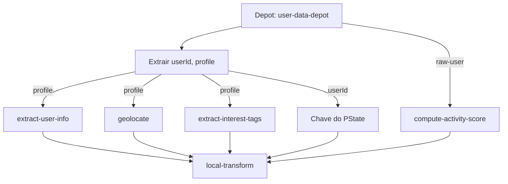

Ok, aqui está o artigo com gráficos Mermaid inseridos nos tópicos pertinentes para melhor visualização dos conceitos:

# Construindo ETLs Poderosos e Escaláveis com Rama

Quando pensamos em criar um sistema de ETL (Extract, Transform, Load), geralmente pensamos em integrar várias ferramentas diferentes para cada etapa do processo. O mais comum talvez seja usar algum variante do Apache Spark como o PySpark para a etapa de transformação e um banco de dados relacional como o PostgreSQL para a etapa de carregamento.

No entanto, o [Rama](https://docs.redplanetlabs.com/concepts/etl.html) oferece uma abordagem mais simples e poderosa para construir ETLs, permitindo que você implemente um pipeline completo em poucas linhas de código. Duvida?

## Introdução ao Rama para ETL

Antes de mais nada, o [Rama](https://docs.redplanetlabs.com/concepts/etl.html) é uma plataforma para construção de pipelines de [ETL (Extract, Transform, Load)](https://en.wikipedia.org/wiki/Extract,_transform,_load) com uma quantidade mínima de código. Enquanto ETLs tradicionais exigem múltiplas ferramentas e milhares de linhas de código, o Rama permite implementações completas em dezenas de linhas, oferecendo:

- Processamento de milhões de registros por segundo
- Operações [ACID](https://en.wikipedia.org/wiki/ACID) garantidas
- Execução em tempo real e por lotes
- Tolerância a falhas com replicação incremental
- Implantação e escalonamento simplificados
- Monitoramento abrangente integrado

O fluxo básico de um ETL pode ser representado como:

```mermaid
graph TD
    A[Extração (Extract)] --> B(Transformação (Transform))
    B --> C{Carregamento (Load)}
```

## Arquitetura ETL no Rama

Um pipeline ETL no Rama segue um fluxo otimizado:

1.  **Extract**: Dados são ingeridos através de "depots" (logs distribuídos)
2.  **Transform**: Topologias de processamento aplicam transformações usando dataflow
3.  **Load**: Resultados são carregados em "PStates" (datastores particionados e indexados)

Esta arquitetura elimina a complexidade de integrar várias ferramentas diferentes para cada etapa do ETL. A arquitetura específica do Rama pode ser visualizada como:

```mermaid
graph TD
    D(Fontes de Dados Externas) --> A
    subgraph Arquitetura Rama ETL
        direction LR
        A[Depots<br/>(Ingestão / Extract)] --> B(Topologias<br/>(Processamento / Transform))
        B --> C{PStates<br/>(Armazenamento / Load)}
    end
```

## Componentes Fundamentais para ETL

### 1. Depots: Extração de Dados

Os depots são a porta de entrada para dados no Rama, funcionando como um log de eventos distribuído:

```clojure
(declare-depot setup *source-data-depot (hash-by :id))
```

Em Java:

```java
setup.declareDepot("*source-data-depot", Depot.hashBy("id"));
```

Os depots podem receber dados de APIs, bancos de dados, sistemas de mensageria ou qualquer outra fonte, proporcionando um ponto unificado de ingestão.

### 2. Topologias: Transformação de Dados

As topologias são onde ocorre a transformação dos dados, usando uma API de dataflow expressiva:

```clojure
(let [topology (stream-topology topologies "etl-pipeline")]
  ;; Definição de PState para armazenar os resultados
  (declare-pstate
    topology
    $$processed-data
    {String (fixed-keys-schema
              {:processedAt Long
               :metrics Map
               :tags #{String}})})

  ;; Implementação da lógica de transformação
  (<<sources topology
    (source> *source-data-depot :> *raw-record)

    ;; Extrair campos do registro
    (ops/get *raw-record :id :> *id)
    (ops/get *raw-record :data :> *data)

    ;; Aplicar transformações
    (ops/custom-transformation *data :> *transformed-data)
    (ops/compute-metrics *transformed-data :> *metrics)
    (ops/extract-tags *transformed-data :> *tags)

    ;; Armazenar resultado no PState
    (|hash *id)
    (local-transform>
      [(keypath *id) (termval {:processedAt (System/currentTimeMillis)
                               :metrics *metrics
                               :tags *tags})]
      $$processed-data)))
```

As topologias permitem:

- Filtragem e limpeza de dados
- Transformações complexas
- Agregações e cálculos
- Enriquecimento de dados
- Processamento em paralelo

O fluxo de dados dentro de uma topologia pode ser conceitualizado da seguinte forma:

```mermaid
flowchart TD
    A[Source (Depot)] --> B[Extrair Campos]
    B --> C[Aplicar Transformações]
    C --> D[Outras Operações]
    D --> E[Atualizar PState]
```

### 3. PStates: Carregamento de Dados

Os PStates são o destino final dos dados transformados:

```clojure
(declare-pstate
  topology
  $$processed-data
  {String (fixed-keys-schema
            {:processedAt Long
             :metrics Map
             :tags #{String}})})
```

Em Java:

```java
topology.pstate(
  "$$processed-data",
  PState.mapSchema(String.class,
                   PState.fixedKeysSchema(
                     "processedAt", Long.class,
                     "metrics", Map.class,
                     "tags", PState.setSchema(String.class)
                     )));
```

Os PStates oferecem:

- Indexação automática
- Particionamento para performance
- Esquemas flexíveis adaptados aos requisitos específicos
- Consultas eficientes

## Implementando um ETL Completo

Vamos implementar um pipeline ETL completo que:

1.  Ingere dados brutos de usuários
2.  Processa e enriquece os dados
3.  Carrega-os em um PState otimizado para consultas

```clojure
(defmodule UserETLModule
  [setup topologies]

  ;; Extração: Declaração do depot para ingestão
  (declare-depot setup *user-data-depot (hash-by :userId))

  (let [topology (stream-topology topologies "user-etl")]

    ;; Carregamento: Declaração do PState para dados processados
    (declare-pstate
      topology
      $$users
      {String (fixed-keys-schema
                {:name String
                 :email String
                 :location String
                 :lastUpdated Long
                 :activityScore Double
                 :tags #{String}})})

    ;; Transformação: Dataflow para processar os dados
    (<<sources topology
      ;; Extração de campos
      (source> *user-data-depot :> *raw-user)
      (ops/get *raw-user :userId :> *userId)
      (ops/get *raw-user :profile :> *profile)

      ;; Transformações
      (ops/extract-user-info *profile :> *name *email)
      (ops/geolocate *profile :> *location)
      (ops/compute-activity-score *raw-user :> *score)
      (ops/extract-interest-tags *profile :> *tags)

      ;; Carregamento no PState
      (|hash *userId)
      (local-transform>
        [(keypath *userId) (termval {:name *name
                                     :email *email
                                     :location *location
                                     :lastUpdated (System/currentTimeMillis)
                                     :activityScore *score
                                     :tags *tags})]
        $$users))))
```

Este ETL realiza:

1.  **Extração**: Dados brutos do usuário entram pelo depot
2.  **Transformação**: Extração de informações, geolocalização, cálculo de scores e análise de interesses
3.  **Carregamento**: Gravação dos dados processados em um PState otimizado

O fluxo de dados específico deste exemplo `UserETLModule` pode ser visualizado como:



## ETL Incremental e em Tempo Real

Uma vantagem significativa do Rama é a capacidade de processar dados de forma incremental e em tempo real:

```clojure
(<<query-topology topologies "real-time-metrics"
  [*time-window :> *metrics]
  (do-query> $$users
    (aggs/metrics-aggregation *time-window))
  (|origin)
  (transform-metrics> *metrics :> *formatted-metrics))
```

Este código implementa métricas em tempo real que:

1.  Processam incrementalmente novos dados à medida que chegam
2.  Atualizam métricas sem reprocessar dados históricos
3.  Fornecem resultados em milissegundos

## Vantagens do Rama para ETL

Usar o Rama para implementar ETLs oferece vantagens significativas:

1.  **Simplicidade**: Toda a solução em uma única plataforma
2.  **Performance**: Processamento distribuído e paralelizado automaticamente
3.  **Escalabilidade**: Escalonamento horizontal simplificado
4.  **Manutenção**: Menos código significa menos bugs e mais facilidade de manutenção
5.  **Confiabilidade**: Tolerância a falhas incorporada através da arquitetura baseada em eventos
6.  **Operação**: Monitoramento e observabilidade integrados

## Conclusão

O Rama redefiniu como ETLs podem ser implementados, eliminando a necessidade de múltiplas ferramentas e codificação complexa. Com uma abordagem unificada para extração, transformação e carregamento, o Rama permite implementar pipelines ETL em dezenas de linhas de código que anteriormente exigiriam milhares.

O Rama é gratuito para clusters de produção com até dois nós e pode ser baixado no site da Red Planet Labs.