+++
title = "Compiladores"
description = "Introdução aos compiladores"
date = 2025-07-21T12:00:00-00:00
tags = ["Compiladores", "Linguagens de Programação", "Arquitetura de Computadores"]
draft = true
weight = 3
author = "Vitor Lobo Ramos"
+++

## 1. INTRODUÇÃO

Sabe quando você tem uma ideia e quer que o computador a transforme em um aplicativo, um jogo ou um site? A gente usa [**linguagens de programação**](https://www.linguagensdeprogramacao.com.br/) pra isso. Elas são como a nossa forma de conversar com a máquina, dando instruções detalhadas para resolver problemas ou criar coisas novas.

De apps no seu celular a sistemas que controlam carros, redes sociais ou até satélites, tudo começa com código. Mas tem um detalhe: o computador, na sua forma mais básica, não entende a nossa linguagem. Ele só entende uma coisa: a linguagem de máquina, que é basicamente uma sequência de zeros e uns. É aí que entra o herói da história: o **compilador**.

Pense no compilador como um tradutor superinteligente. Ele pega o código que a gente escreve (que é bem mais fácil de entender) e o traduz para a linguagem que o computador entende. Essa tradução pode ser direta para a linguagem da máquina ou para um formato intermediário, como o [bytecode](https://en.wikipedia.org/wiki/Bytecode) ou [WebAssembly](https://webassembly.org/), que pode rodar em diferentes lugares, seja no seu PC, no celular ou até no seu navegador.

É por causa dos compiladores que linguagens como [Rust](https://www.rust-lang.org/), [Go](https://go.dev/) e [TypeScript](https://www.typescriptlang.org/) conseguem criar programas super-rápidos, seguros e que funcionam em qualquer plataforma. Eles são a mágica por trás do desempenho de quase tudo que a gente usa no mundo digital.

Hoje em dia, saber como um compilador funciona não é só coisa de professor de faculdade. É o tipo de conhecimento que te dá superpoderes para criar suas próprias linguagens, otimizar programas para rodarem mais rápido em diferentes computadores, ou até para entender como ferramentas como o [V8](https://v8.dev/) (o motor do Google Chrome) ou a [JVM](https://www.oracle.com/java/technologies/javase/jvms.html) (da linguagem Java) funcionam por dentro. É um campo que junta várias áreas, de lógica a engenharia, e que é essencial para o futuro da [Inteligência Artificial](https://www.inteligenciaartificial.com.br/), [cibersegurança](https://www.ciberseguranca.com.br/) e [desenvolvimento de games](https://www.games.com.br/).

Neste artigo, a gente vai desvendar esse mistério de forma prática. Vamos ver o que acontece a cada etapa da tradução do código e entender por que esse conhecimento é cada vez mais valioso num mundo cheio de nuvens, IA e sistemas conectados. Se você sempre quis saber como seu código vira algo real e funcional, prepare-se, porque esta jornada é para você.

### 1.1 PROCESSADORES DE LINGUAGEM

De maneira bem simples, um compilador é um programa que pega o seu código-fonte e o converte para um código "traduzido" (o código objeto). Durante essa tradução, ele também te avisa se você cometeu algum erro na escrita, como uma palavra fora do lugar ou um comando que não existe, o que facilita muito a nossa vida.

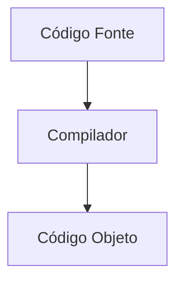

**FIGURA 1.1** O papel de um compilador.

Depois que o compilador faz a mágica e gera o código que o computador entende, esse novo arquivo pode ser executado para receber uma entrada (por exemplo, um dado que o usuário digita) e gerar uma saída (o resultado ou a ação que a gente espera).


**FIGURA 1.2** O programa em ação.

Antes de seguirmos, vale lembrar que o compilador não é o único "tradutor" do mundo da programação. Existe também uma outra figura importante nesse cenário: o **interpretador**. 

Enquanto o compilador funciona como um tradutor profissional que converte um livro inteiro de uma vez só, o interpretador age de forma diferente. Ele se assemelha a um tradutor simultâneo em uma conferência, traduzindo e executando cada linha do código à medida que ela é lida, sem gerar um arquivo final antecipadamente. Por isso, linguagens como **Python** e **JavaScript** são tão populares em ambientes interativos: o interpretador permite testar ideias rapidamente e receber feedback imediato sobre erros ou resultados. 


**FIGURA 1.3** Como o interpretador trabalha.

Enquanto o compilador geralmente gera programas super-rápidos (já que a tradução foi feita antes), o interpretador brilha na hora de encontrar bugs, pois ele executa o código "ao vivo". Isso é perfeito para ferramentas como o **Jupyter Notebook**, que te permitem ver o resultado de cada linha de código imediatamente.

### O Melhor dos Dois Mundos: O Caso do Java

A linguagem **Java** é um exemplo de como podemos usar o melhor das duas abordagens. A mágica acontece em duas etapas:

1.  **A Primeira Tradução:** O código-fonte em Java é compilado para um formato intermediário, o **bytecode**. Pense no bytecode como uma "linguagem universal" que nenhuma máquina entende diretamente, mas que é fácil de traduzir para qualquer uma delas.
2.  **A Tradução Final:** Esse bytecode é então rodado dentro de uma **Máquina Virtual Java (JVM)**. A JVM é como um ambiente virtual dentro do seu computador que pega o bytecode e o executa. Ela pode tanto interpretá-lo linha a linha quanto usar uma técnica chamada **JIT** (*Just-In-Time*).

Esse modelo híbrido é o que permite que um mesmo código Java rode sem problemas em um servidor gigante, no seu PC ou até no seu celular. É o famoso lema do Java: **"escreva uma vez, rode em qualquer lugar"**.

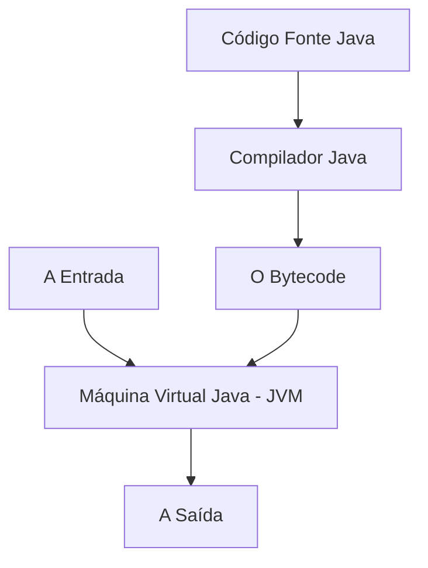

**FIGURA 1.4** O sistema híbrido de Java.

O **JIT** é como um turbo para a JVM. Ele observa quais partes do bytecode são mais usadas e, em vez de interpretá-las toda vez, as traduz na hora para o código de máquina mais rápido possível. É o mesmo truque que o **V8** (o motor do JavaScript no Chrome e Node.js) usa para deixar a navegação na web super veloz.

Agora que você já viu como diferentes estratégias de tradução e execução podem ser combinadas — como no caso do [Java](https://www.java.com/pt-BR/) e do [JavaScript](https://www.javascript.com/) —, vale entender que o processo de transformar código em um programa executável envolve ainda mais etapas e ferramentas. Por trás dos bastidores, existe toda uma equipe de componentes trabalhando juntos para garantir que seu código chegue até o computador de forma eficiente e funcional.

### A Equipe Completa de Compilação

Quando você está em um projeto grande, o compilador não trabalha sozinho. Ele faz parte de uma equipe que transforma seu código em um programa executável.

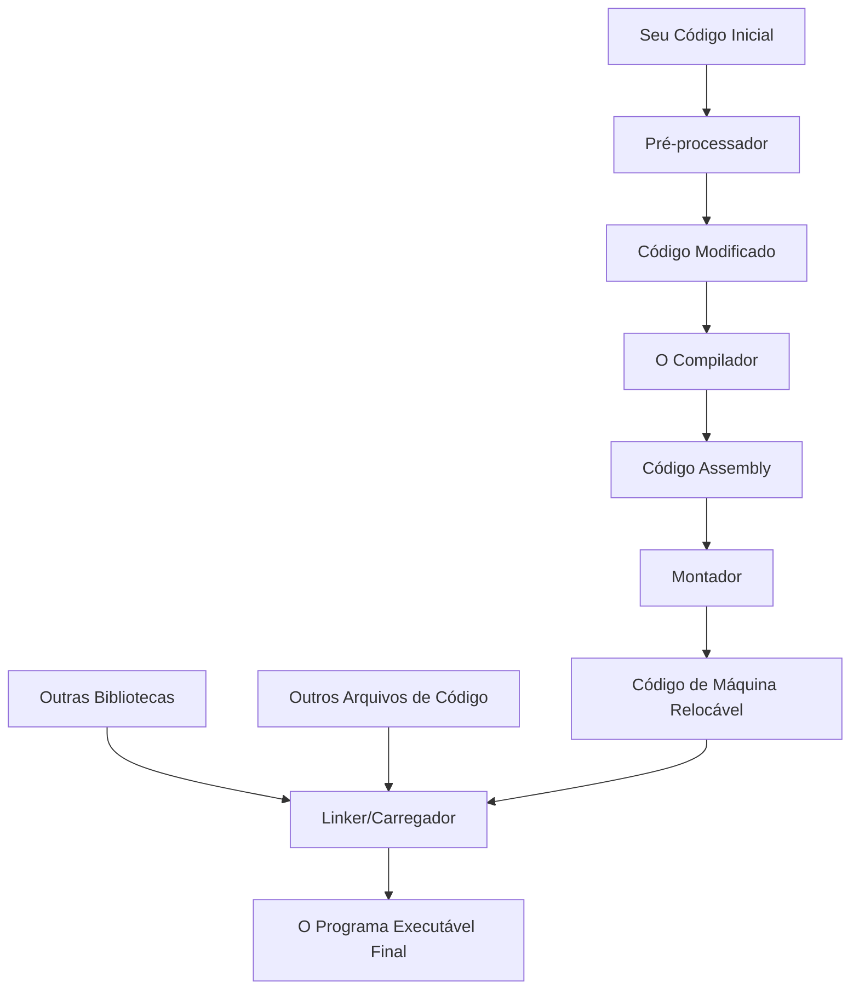

**FIGURA 1.5** Todo o fluxo de trabalho de compilação.

O processo pode ser resumido assim:

1.  **Pré-processador:** Antes de tudo, um assistente dá uma primeira passada no seu código. Ele resolve tarefas simples, como incluir códigos de outras bibliotecas (`#include`) ou expandir atalhos.
2.  **Montador (Assembler):** O compilador pode não gerar o código de máquina final. Em vez disso, ele gera um código "irmão", o **assembly**, que é mais fácil de ler e otimizar. O montador é quem pega esse código e o traduz para o código de máquina.
3.  **Linker (Editor de Ligação):** Em projetos complexos, seu código é dividido em vários arquivos. O linker é o grande organizador. Ele junta todos os pedacinhos do seu projeto, conecta eles com bibliotecas externas (como bibliotecas de matemática ou de gráficos) e cria um único arquivo executável.
4.  **Carregador (Loader):** Por fim, o carregador é a parte do sistema operacional que coloca seu programa na memória para que ele possa ser executado.

> Com o avanço das ferramentas modernas, como o **LLVM**, grande parte desse fluxo de trabalho foi automatizado. Isso significa que, ao compilar seu código hoje, você não precisa mais se preocupar manualmente com cada uma dessas etapas: o próprio compilador se encarrega de adaptar e otimizar o programa para diferentes arquiteturas, seja em um chip de celular ou em um computador de mesa.

Agora que você já conhece o panorama geral de como o código é transformado até virar um executável, vamos mergulhar mais fundo e entender como funciona a estrutura interna de um compilador — ou seja, o que acontece "por dentro" desse processo.

---

### 1.2 A Estrutura por Dentro de um Compilador

Um compilador não faz todo o trabalho de uma vez. Ele é como um time de especialistas que tem um processo bem definido para traduzir o seu código. Esse processo é dividido em duas grandes etapas: **Análise** e **Síntese**. Pense assim:

  * A **Análise** (o "Front-End") é como um time de editores. Eles pegam seu rascunho de texto (o código-fonte) e trabalham nele para entender cada detalhe e garantir que não tem erros de gramática ou de lógica.
  * A **Síntese** (o "Back-End") é como a equipe de produção. Eles pegam o texto final, revisado e aprovado, e o transformam em um produto final que pode ser lido e executado (o código de máquina).

Vamos dar uma olhada em cada uma dessas partes, com foco nas ferramentas modernas que fazem tudo isso acontecer de forma muito mais inteligente.

#### O Front-End: Entendendo o que Você Escreveu

O front-end de um compilador tem a missão de "desmontar" o seu código para entender exatamente o que ele significa. Para isso, ele passa por três fases:

1.  **Análise Léxica (O Scanner):** Esta é a primeira fase. O compilador lê seu código como se fosse uma sequência gigante de letras, números e símbolos. O trabalho dele é agrupar essas sequências em "palavrinhas" com significado, que a gente chama de **tokens**. Por exemplo, ele entende que `if`, `while` ou `int` são palavras-chave, que `minha_variavel` é um nome de variável e que `100` é um número.
2.  **Análise Sintática (O Professor de Gramática):** Depois de ter todos os tokens, essa fase é como um professor de gramática. Ela verifica se as "palavrinhas" estão na ordem certa, formando frases válidas, de acordo com as regras da linguagem. Se você esquecer um ponto e vírgula ou um parêntese, é aqui que o compilador te pega. O resultado é uma **Árvore Sintática Abstrata (AST)**, que é como um mapa visual da estrutura do seu código.
3.  **Análise Semântica (O Professor de Lógica):** A lógica é a cereja do bolo. Essa fase verifica a coerência do seu código. Por exemplo, ela checa se você está tentando somar um texto com um número ou se está usando uma variável que nunca foi declarada.

Durante todo esse processo de análise, o compilador anota tudo em uma [**tabela de símbolos**](https://en.wikipedia.org/wiki/Symbol_table). Pense nela como um "caderninho de anotações" onde ele guarda informações sobre cada variável e função: o nome, o tipo de dado (se é um número, texto, etc.), e onde ela pode ser usada. Ferramentas modernas, como o [**Clang**](https://clang.llvm.org/) e o [**Rustc**](https://www.rust-lang.org/), usam essa tabela para dar mensagens de erro super detalhadas e úteis.

Depois que o front-end "entendeu" tudo, o back-end entra em ação. Ele pega a representação intermediária do seu código (como a árvore sintática) e começa a traduzi-la para a linguagem final. Essa linguagem pode ser o código de máquina que a [CPU entende](https://en.wikipedia.org/wiki/Central_processing_unit), ou algo como o [**WebAssembly**](https://en.wikipedia.org/wiki/WebAssembly) para rodar em múltiplas plataformas.

---

#### 🌐 **WebAssembly: Evolução de "Navegador" para "Universal"**

O **[WebAssembly (WASM)](https://en.wikipedia.org/wiki/WebAssembly)** surgiu em 2017 como uma tecnologia para rodar código compilado diretamente no navegador, trazendo performance próxima ao nativo para aplicações web. Desde então, evoluiu rapidamente: em 2019, o [WASI (WebAssembly System Interface)](https://wasi.dev/) permitiu que módulos [WASM](https://en.wikipedia.org/wiki/WebAssembly) acessassem recursos do sistema de forma segura, e em 2022 o [Component Model](https://github.com/WebAssembly/component-model) foi padronizado, facilitando a composição de módulos e a criação de plugins e serviços modulares. Hoje, WASM já é alvo de backend para várias linguagens no lado servidor, e a portabilidade é um dos seus maiores trunfos — o mesmo código pode rodar em navegadores, servidores, dispositivos de borda [(edge)](https://en.wikipedia.org/wiki/Edge_computing) e [IoT](https://en.wikipedia.org/wiki/Internet_of_things).

Essa versatilidade abriu espaço para aplicações em diferentes áreas. No universo serverless e edge computing, plataformas como [Cloudflare Workers](https://developers.cloudflare.com/workers/), [Fastly Compute](https://docs.fastly.com/products/compute-at-the-edge) e [Vercel Edge Functions](https://vercel.com/docs/concepts/functions/edge-functions) executam código WASM globalmente, com baixa latência e alta eficiência, sendo usados em APIs, processamento de dados e autenticação. No entretenimento, engines como [Unity WebGL](https://docs.unity3d.com/Manual/webgl-building.html) e [Godot](https://docs.godotengine.org/en/stable/getting_started/workflow/export/exporting_for_web.html) exportam jogos completos em WASM, permitindo que rodem em qualquer plataforma sem plugins. No campo da inteligência artificial, frameworks como [TensorFlow.js](https://www.tensorflow.org/js) e [ONNX Runtime Web](https://onnxruntime.ai/docs/execution-providers/web.html) possibilitam rodar modelos de machine learning diretamente no navegador, com privacidade e aceleração via SIMD e threads.

Além disso, WASM se tornou o backend universal de linguagens modernas: [Rust](https://www.rust-lang.org/), [Go](https://go.dev/), [C/C++](https://en.wikipedia.org/wiki/C_(programming_language)), [Python](https://www.python.org/) (via [Pyodide](https://pyodide.org/)), [C#/.NET](https://dotnet.microsoft.com/en-us/) (via [Blazor](https://dotnet.microsoft.com/en-us/apps/aspnet/web-apps/blazor)), [Kotlin](https://kotlinlang.org/), [AssemblyScript](https://www.assemblyscript.org/) (TypeScript para WASM) e [Zig](https://ziglang.org/) já oferecem suporte nativo ou oficial. As linguagens adotam WASM porque ele garante portabilidade real, performance próxima ao nativo, segurança por sandboxing, eficiência no tamanho dos binários e um ecossistema onde o mesmo código pode ser executado em qualquer lugar, do navegador ao servidor, passando por dispositivos embarcados.

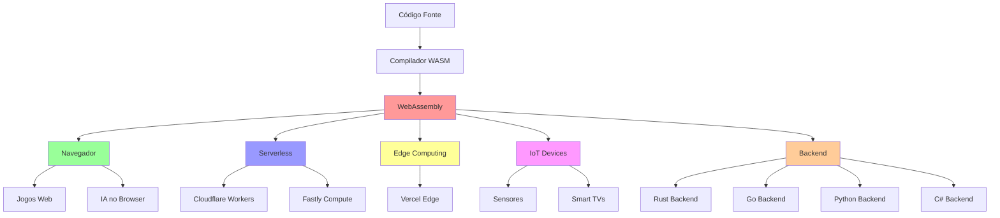

O [WebAssembly (WASM)](https://en.wikipedia.org/wiki/WebAssembly) é revolucionário hoje porque oferece performance próxima ao nativo (10-20x mais rápido que JavaScript), segurança por meio de [sandbox isolado sem acesso direto ao sistema](https://en.wikipedia.org/wiki/Sandboxing), portabilidade real com o conceito de "write once, run anywhere", eficiência graças ao tamanho reduzido dos binários e carregamento rápido, além de contar com suporte das principais linguagens de programação. 

Em apenas oito anos, evoluiu de uma tecnologia restrita ao navegador (em 2017) para uma plataforma universal (em 2025), tornando-se alvo de backend para [Rust](https://www.rust-lang.org/), [Go](https://go.dev/), [Python](https://www.python.org/), [C#/.NET](https://dotnet.microsoft.com/en-us/), [Kotlin](https://kotlinlang.org/), [Zig](https://ziglang.org/) e outras linguagens, que agora compilam nativamente para WASM, não apenas para JavaScript. 

> "Nesse contexto, a otimização realizada pelo back-end do compilador é fundamental: é nessa etapa que o código é ajustado para ser mais rápido, consumir menos energia (algo crucial em dispositivos móveis e [IoT](https://en.wikipedia.org/wiki/Internet_of_things)) e tirar proveito de recursos específicos de cada hardware. Ferramentas como o [LLVM](https://llvm.org/) desempenham um papel central nesse processo, permitindo que um mesmo back-end produza programas otimizados para uma grande variedade de plataformas, de computadores pessoais a smartphones."

---

Agora que entendemos como o [WebAssembly](https://en.wikipedia.org/wiki/WebAssembly) e as técnicas modernas de compilação transformaram o cenário da computação, vale a pena olhar para trás e ver como essa evolução aconteceu ao longo das décadas. A seguir, uma linha do tempo destaca os principais marcos da história dos compiladores — do assembly dos mainframes aos frameworks universais e à era da inteligência artificial.

## 📋 **ANEXO: Timeline da Evolução dos Compiladores (1960 → 2025)**

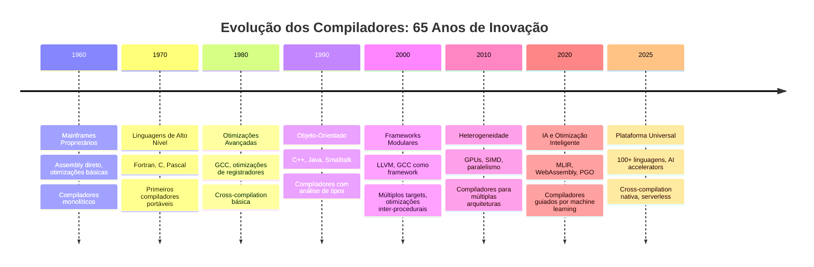

Ao longo das décadas, os compiladores passaram por transformações marcantes: nos anos 1960, eram ferramentas acadêmicas voltadas para assembly direto em mainframes; nos anos 1970, surgiram as linguagens de alto nível, trazendo portabilidade e otimizações básicas; os anos 1980 introduziram otimizações avançadas, frameworks e a [cross-compilation](https://en.wikipedia.org/wiki/Cross-compilation); nos anos 1990, destacaram-se a orientação a objetos, a análise de tipos e a compilação [JIT](https://en.wikipedia.org/wiki/Just-in-time_compilation); os anos 2000 trouxeram frameworks modulares como o [LLVM](https://llvm.org/) e suporte a múltiplos targets.

A década de 2010 foi marcada pela heterogeneidade, com suporte a [GPUs](https://en.wikipedia.org/wiki/Graphics_processing_unit), [SIMD](https://en.wikipedia.org/wiki/SIMD) e [paralelismo](https://en.wikipedia.org/wiki/Parallel_computing); nos anos 2020, destacam-se otimizações guiadas por [IA](https://en.wikipedia.org/wiki/Artificial_intelligence), [WebAssembly](https://en.wikipedia.org/wiki/WebAssembly) e [MLIR](https://mlir.llvm.org/); e, [em 2025, vislumbra-se uma plataforma universal, com suporte a mais de 100 linguagens e aceleradores de IA](https://en.wikipedia.org/wiki/Artificial_intelligence). O resultado desse percurso é a evolução dos compiladores de ferramentas acadêmicas para uma tecnologia fundamental da computação moderna.

Mas, afinal, como toda essa evolução se reflete no funcionamento interno de um compilador? Para entender o impacto dessas transformações, vale a pena olhar mais de perto como as diferentes fases do compilador trabalham juntas para transformar o código-fonte em algo que a máquina realmente entende.

### 1.3 As Fases do Compilador em Ação

O processo de compilação completo é como uma linha de montagem, com várias etapas que se alimentam umas das outras. Aqui está o fluxo completo:

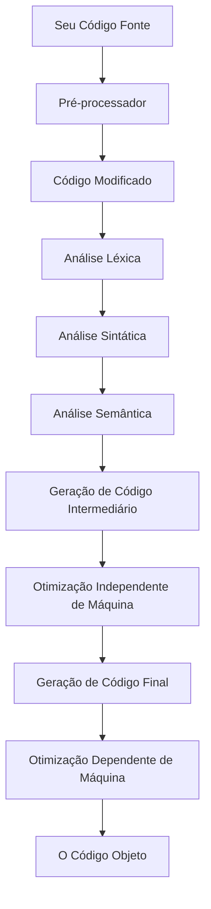

**FIGURA 1.6** As fases de um compilador moderno.

#### 1.2.1 Análise Léxica: O Detetive de Palavras

Vamos pegar um exemplo real para entender a primeira fase. Imagine a seguinte linha de código em C:

```bash
position = initial + rate * 60
```

1.  O **Analisador Léxico** passa por essa linha e, em vez de ver um texto corrido, ele "peneira" o código e o quebra em pedaços significativos. Ele descarta os espaços e cria uma "ficha" (**token**) para cada pedaço, com um tipo e um valor:
      * `position` → ele entende que é um nome de variável (`id` - identificador).
      * `=` → ele entende que é um operador de atribuição.
      * `initial` → de novo, um nome de variável (`id`).
      * `+` → um operador de soma.
      * `rate` → mais um nome de variável (`id`).
      * `*` → um operador de multiplicação.
      * `60` → um número.
2.  Para cada nome de variável (`id`) e número, ele anota os detalhes em sua **tabela de símbolos**. Por exemplo, ele guarda que `position` é a variável `1`, `initial` é a `2`, e assim por diante.

No final, essa linha de código se transforma em uma sequência de fichas, sem os espaços, pronta para a próxima fase (o "professor de gramática") analisar:

```bash
id,1 atribuicao id,2 soma id,3 multiplicacao numero,4
```

É assim que o compilador começa a "enxergar" seu código, um pequeno passo de cada vez. E em linguagens como [Rust](https://www.rust-lang.org/) ou [TypeScript](https://www.typescriptlang.org/), essa etapa já ajuda a verificar se o código é seguro ou se os tipos estão corretos.

-----

### 1.2.2 Análise Sintática: O Professor de Gramática

Depois que o "faxineiro do código" (o analisador léxico) separou tudo em "fichas" (os tokens), é hora de o **Analisador Sintático** entrar em ação. Pense nele como um professor de gramática: sua missão é garantir que todas as "fichas" estão na ordem certa e que formam frases válidas. Ele não se preocupa com o significado, só com a estrutura.

O resultado do trabalho dele é uma **Árvore Sintática Abstrata (AST)**. Essa árvore é um mapa visual do seu código, que mostra a hierarquia e a ordem de importância de cada operação. Ela é fundamental para que o compilador entenda o que deve ser feito primeiro (como a multiplicação em uma equação matemática) antes de seguir para a próxima etapa. Vamos voltar ao nosso exemplo:

```bash
position = initial + rate * 60
```

Para o analisador sintático, a sequência de fichas (`id`, `atribuicao`, `id`, `soma`, etc.) não é só uma lista. Ele a organiza em uma árvore, priorizando as operações mais importantes, como a multiplicação (`*`), que tem que ser feita antes da soma (`+`).

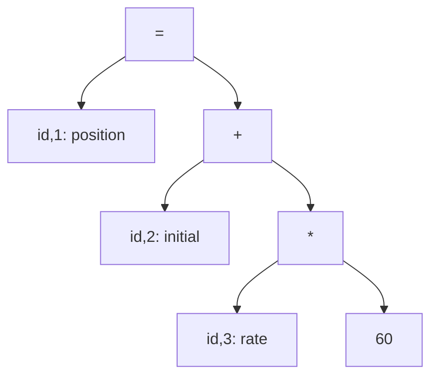

**FIGURA 1.7** A Árvore Sintática Abstrata para o nosso código.

Note como a multiplicação e a soma estão "dentro" do sinal de atribuição (`=`). Isso mostra a ordem: primeiro a multiplicação, depois a soma e, por fim, a atribuição. Depois de ter essa árvore em mãos, o compilador passa para as próximas fases.

### 1.2.3 Análise Semântica: O Professor de Lógica

Essa é a fase onde o compilador verifica se o seu código faz sentido de verdade, e não só se ele está escrito corretamente. O **Analisador Semântico** usa a árvore sintática e o "caderninho de anotações" (a tabela de símbolos) para checar a lógica do programa. Ele é o cara que vai te avisar se você está:

  * Tentando somar um texto com um número.
  * Usando uma variável que você esqueceu de declarar.
  * Tentando usar um tipo de dado errado, como usar um texto (`"texto"`) para indexar um array.

É também nesta fase que o compilador faz conversões automáticas (`coerções`), quando o seu código precisa. Por exemplo, se você tenta somar um número inteiro e um número com vírgula, ele transforma o inteiro para o tipo de número com vírgula para que a operação funcione.

---

### 1.2.4 O Fluxo Completo da Tradução

A partir da árvore sintática, a mágica do back-end começa. A árvore é o mapa para as próximas fases:

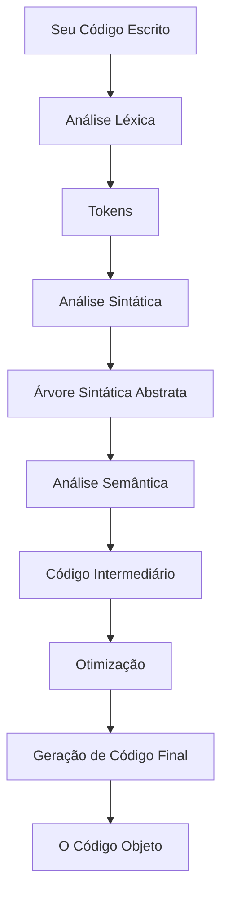

**FIGURA 1.8** O fluxo de trabalho completo da tradução.

### 1.2.5 Geração de Código Intermediário: A Receita Universal

Depois de passar pela análise, o compilador traduz a AST para uma linguagem que ele entende melhor, chamada **Código Intermediário (IR)**. Pense nisso como uma "receita de cozinha" universal, com passos super claros e simples. Essa receita é fácil de entender para qualquer compilador, não importa qual computador ou sistema operacional você esteja usando. Por exemplo, a nossa linha de código `position = initial + rate * 60` vira uma sequência de passos bem detalhados:

```bash
t1 = inttofloat(60)
t2 = id3 * t1
t3 = id2 + t2
id1 = t3
```

#### Exemplo Real: LLVM IR

Para dar concretude a essa abstração, vamos ver um exemplo real de **LLVM IR** gerado pelo compilador Clang. Considere o seguinte código C:

```c
int add_and_multiply(int a, int b, int c) {
    int temp = a + b;
    return temp * c;
}
```

Quando compilado com `clang -S -emit-llvm`, gera o seguinte LLVM IR:

```llvm
define i32 @add_and_multiply(i32 %a, i32 %b, i32 %c) {
entry:
  %temp = add i32 %a, %b
  %result = mul i32 %temp, %c
  ret i32 %result
}
```

Neste exemplo, `define i32` indica que estamos definindo uma função que retorna um inteiro de 32 bits. Os símbolos `%a`, `%b` e `%c` representam os parâmetros de entrada da função, enquanto `%temp` e `%result` são variáveis temporárias, também chamadas de registradores virtuais, utilizadas para armazenar resultados intermediários das operações. As instruções `add` e `mul` realizam operações aritméticas de soma e multiplicação, respectivamente, e a instrução `ret` é responsável por retornar o valor final da função.

#### Exemplo Real: MLIR Dialect

O **MLIR (Multi-Level Intermediate Representation)** é uma representação intermediária mais moderna que suporta múltiplos "dialectos" (linguagens especializadas). Vamos ver um exemplo usando os dialectos `arith` (aritmética) e `memref` (referências de memória):

```mlir
func.func @vector_add(%arg0: memref<100xf32>, %arg1: memref<100xf32>, %arg2: memref<100xf32>) {
  %c0 = arith.constant 0 : index
  %c100 = arith.constant 100 : index
  %c1 = arith.constant 1 : index
  
  scf.for %i = %c0 to %c100 step %c1 {
    %val1 = memref.load %arg0[%i] : memref<100xf32>
    %val2 = memref.load %arg1[%i] : memref<100xf32>
    %sum = arith.addf %val1, %val2 : f32
    memref.store %sum, %arg2[%i] : memref<100xf32>
  }
  return
}
```

Neste exemplo de MLIR, podemos observar como diferentes dialetos colaboram para descrever uma operação de soma de vetores: o dialeto `func` é utilizado para definir a função `vector_add`, enquanto o dialeto `memref` gerencia as referências de memória necessárias para manipular os arrays. As operações aritméticas, como a soma de números de ponto flutuante (`addf`), são realizadas pelo dialeto `arith`, e o controle do fluxo do programa, como o laço `for`, é feito pelo dialeto `scf`. A grande vantagem do MLIR é justamente essa flexibilidade: ele permite representar o código em múltiplos níveis de abstração, desde construções de alto nível até detalhes próximos do hardware, tudo dentro de uma mesma infraestrutura modular.

### 1.2.6 Otimização: A Receita Melhorada

Otimizar é deixar o código mais eficiente. O compilador usa o Código Intermediário para procurar jeitos de melhorar a performance. Ele é como um chef experiente que olha a receita e diz: "Podemos pular alguns passos aqui para ir mais rápido e usar menos ingredientes." No nosso exemplo, ele perceberia que a conversão de `60` para um número com vírgula pode ser feita na hora, e que as variáveis `t2` e `t3` podem ser eliminadas, já que os resultados podem ser guardados em outro lugar. O código final ficaria mais enxuto:

```bash
t1 = id3 * 60.0
id1 = id2 + t1
```

Esse processo é super importante para jogos, sistemas de IA ou apps de celular, onde cada milissegundo e cada bit de energia contam.

#### 🚀 **Otimizações Modernas: IA e Perfis Reais**

Os compiladores modernos evoluíram muito além das otimizações tradicionais, incorporando técnicas avançadas como inteligência artificial e o uso de perfis de execução reais para tomar decisões mais inteligentes. Uma dessas técnicas é a [Profile-Guided Optimization (PGO)](https://en.wikipedia.org/wiki/Profile-guided_optimization) de segunda geração, que inclui ferramentas como o [AutoFDO](https://github.com/google/autofdo), capaz de coletar perfis automaticamente durante a execução normal do programa, e o [BOLT](https://github.com/facebook/BOLT), que otimiza o layout do código binário com base em perfis de cache e branch prediction. O resultado dessas abordagens são ganhos de performance reais de 5 a 15%, indo além dos simples benchmarks sintéticos.

Outra inovação importante é o [Machine-Learning-Guided Inlining (MLGO)](https://en.wikipedia.org/wiki/Machine_learning_guided_inlining), que utiliza aprendizado de máquina para decidir automaticamente quais funções devem ser expandidas inline. Esses modelos são treinados com milhões de exemplos de código real, permitindo ao compilador reduzir o tempo de compilação em 7 a 15% sem sacrificar a performance do código gerado.

Além disso, a [Link-Time Optimization (LTO)](https://en.wikipedia.org/wiki/Link-time_optimization) tornou-se padrão em builds otimizados (`-O2`) nos toolchains modernos como [GCC 10+](https://gcc.gnu.org/) e [Clang 12+](https://clang.llvm.org/). O LTO permite que o compilador analise e otimize todo o programa durante o processo de linking, e não apenas arquivos individuais, viabilizando otimizações inter-procedurais que seriam impossíveis ao compilar cada arquivo separadamente.

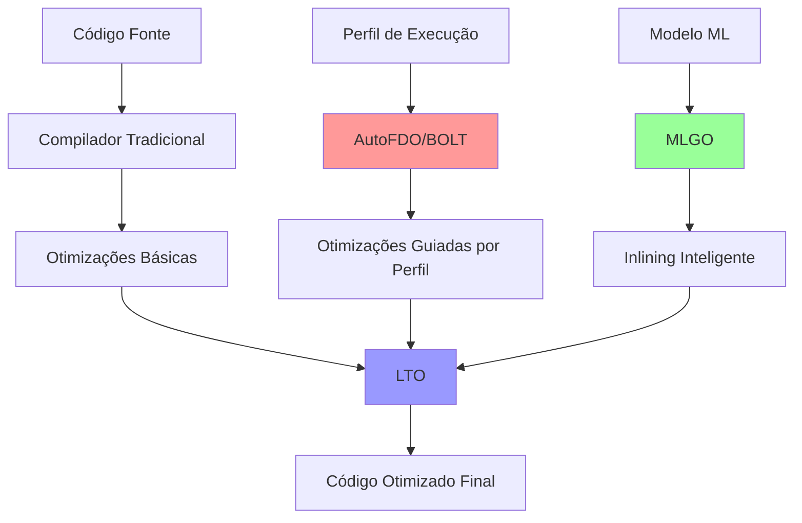

**Por que isso importa?**

As otimizações modernas de compiladores representam a chamada terceira geração, marcada pelo uso intensivo de dados reais de execução e inteligência artificial. Técnicas como o [Profile-Guided Optimization (PGO)](https://en.wikipedia.org/wiki/Profile-guided_optimization) utilizam informações coletadas durante a execução real do programa, em vez de depender apenas de estimativas, permitindo que o compilador tome decisões mais precisas para melhorar a performance. 

O [Machine-Learning-Guided Inlining (MLGO)](https://en.wikipedia.org/wiki/Machine_learning_guided_inlining) aplica modelos de aprendizado de máquina treinados com grandes volumes de código do mundo real, identificando padrões e aprendendo quais funções devem ser expandidas inline para otimizar o desempenho. Já a [Link-Time Optimization (LTO)](https://en.wikipedia.org/wiki/Link-time_optimization) possibilita uma visão holística do programa, analisando e otimizando o código como um todo, e não apenas em partes isoladas, o que viabiliza melhorias inter-procedurais. 

> Além disso, ferramentas como o [AutoFDO](https://github.com/google/autofdo) automatizam a coleta de perfis de execução, eliminando a necessidade de instrumentação manual e tornando o processo de otimização mais eficiente. Dessa forma, os compiladores atuais não se limitam a aplicar regras fixas, mas evoluem para sistemas adaptativos, capazes de aprender e se ajustar continuamente com base em dados reais de uso.

### 1.2.7 Geração de Código Final: O Prato Servido

Esta é a etapa final. O compilador pega a "receita melhorada" (o código otimizado) e a traduz para a "língua nativa" do seu computador (o **código de máquina**). É aqui que ele decide onde guardar cada valor na memória do computador, usando os espaços disponíveis chamados **registradores**. O nosso código otimizado vira algo parecido com isso:

```bash
LDF R2, id3      // Carregue a variável 'rate' no registrador R2
MULF R2, R2, #60.0 // Multiplique o valor de R2 por 60.0
LDF R1, id2      // Carregue a variável 'initial' no registrador R1
ADDF R1, R1, R2    // Some o valor de R1 com R2
STF id1, R1      // Guarde o resultado final em 'position'
```

> É assim que o seu código, uma ideia que começou em texto, passa por uma série de etapas até se transformar em instruções que o computador pode executar. Incrível, né?

---


### 1.2.8 Gerenciamento da Tabela de Símbolos

A tabela de símbolos é uma estrutura fundamental em compiladores modernos, armazenando informações sobre variáveis, funções e seus atributos, como tipo, escopo e, no caso de funções, parâmetros e tipos de retorno. Em linguagens como [TypeScript](https://www.typescriptlang.org/) ou [Go](https://go.dev/), que possuem sistemas de tipos avançados, a tabela de símbolos é essencial para suportar inferência de tipos e verificações de escopo em tempo de compilação. Estruturas de dados eficientes, como tabelas de hash ou árvores balanceadas, são usadas para garantir acesso rápido a essas informações.

### 1.2.9 Agrupamento de Fases em Passos

Na prática, as fases de compilação são frequentemente agrupadas em passos para otimizar o desempenho. Por exemplo, em compiladores como [Clang](https://clang.llvm.org/) ou [Rustc](https://www.rust-lang.org/), o front-end (análise léxica, sintática, semântica e geração de código intermediário) pode ser combinado em um único passo, enquanto otimizações e geração de código para a máquina alvo formam passos separados. 

O uso de representações intermediárias padronizadas, como a [IR do LLVM](https://llvm.org/docs/IR.html), permite criar compiladores modulares, combinando front-ends para diferentes linguagens com back-ends para várias arquiteturas, um modelo amplamente adotado em ferramentas modernas. Essa abordagem reflete a evolução dos compiladores, que hoje lidam com linguagens mais complexas e arquiteturas diversas, mantendo a eficiência e a portabilidade como prioridades.

### 1.2.10 Ferramentas para Construção de Compilador

No desenvolvimento de compiladores modernos, os projetistas contam com uma ampla gama de ferramentas especializadas que simplificam e aceleram a construção de diferentes fases do compilador. Além de ferramentas genéricas de desenvolvimento de software, como editores de texto avançados (e.g., [VS Code](https://code.visualstudio.com/)), sistemas de controle de versão (e.g., [Git](https://git-scm.com/)), e depuradores, ferramentas específicas para compiladores têm evoluído significativamente, integrando algoritmos complexos e interfaces que facilitam sua adoção. Essas ferramentas frequentemente utilizam linguagens declarativas ou especificações formais para definir componentes do compilador, permitindo integração fluida com o restante do sistema. As principais ferramentas incluem:

1. **Geradores de Analisadores Sintáticos**: Ferramentas como [Bison](https://www.gnu.org/software/bison/) e [Yacc](https://www.gnu.org/software/yacc/) geram analisadores sintáticos a partir de gramáticas livres de contexto, descritas em linguagens como BNF (Backus-Naur Form). Essas ferramentas são amplamente usadas em projetos como GCC e Clang para automatizar a construção de parsers.

2. **Geradores de Analisadores Léxicos**: Ferramentas como [Flex](https://github.com/westes/flex) e [Lex](https://github.com/westes/flex) criam analisadores léxicos com base em expressões regulares que descrevem os tokens de uma linguagem. Elas são essenciais para identificar palavras-chave, identificadores e outros elementos léxicos em linguagens como C++ ou Rust.

3. **Mecanismos de Tradução Dirigida por Sintaxe**: Ferramentas como [ANTLR](https://www.antlr.org/) permitem a geração de código intermediário a partir de árvores de derivação, utilizando regras sintáticas anotadas. Elas são amplamente usadas em compiladores modernos para traduzir construções de alto nível em representações intermediárias.

4. **Geradores de Gerador de Código**: Essas ferramentas, como as usadas no framework LLVM, geram código de máquina a partir de especificações de tradução para diferentes arquiteturas (e.g., x86, ARM, RISC-V). Elas permitem que o compilador produza código otimizado para plataformas específicas.

5. **Mecanismos de Análise de Fluxo de Dados**: Ferramentas como as integradas ao [LLVM](https://llvm.org/) ou ao [GCC](https://gcc.gnu.org/) realizam análises de fluxo de dados para rastrear como valores são propagados no programa. Essas análises são fundamentais para otimizações como eliminação de código morto e propagação de constantes.

6. **Conjuntos de Ferramentas para Construção de Compiladores**: Frameworks como [LLVM](https://llvm.org/) e [GCC](https://gcc.gnu.org/) oferecem um ecossistema integrado de rotinas para todas as fases do compilador, desde a análise léxica até a geração de código. Esses frameworks são amplamente adotados em projetos de compiladores para linguagens como Rust, Swift e WebAssembly.

> Essas ferramentas, combinadas com avanços em algoritmos e arquiteturas de software, tornam o desenvolvimento de compiladores mais eficiente e escalável, permitindo lidar com a complexidade de linguagens modernas e arquiteturas heterogêneas.

---

### 1.3 Evolução das Linguagens de Programação

A evolução das linguagens de programação reflete avanços tanto em hardware quanto em paradigmas de desenvolvimento de software. Na década de 1940, os primeiros computadores eram programados diretamente em linguagem de máquina, usando sequências binárias para especificar operações de baixo nível, como movimentação de dados ou operações aritméticas. Esse processo era extremamente propenso a erros e difícil de manter.

### 1.3.1 Mudança para Linguagens de Alto Nível

Na década de 1950, linguagens assembly introduziram mnemônicos para instruções de máquina, facilitando a programação. A adição de macros permitiu abstrações simples, mas ainda assim a programação permanecia intimamente ligada ao hardware. O grande salto veio com o surgimento de linguagens de alto nível, como [Fortran](https://en.wikipedia.org/wiki/Fortran) (para computação científica), [Cobol](https://en.wikipedia.org/wiki/COBOL) (para aplicações comerciais) e [Lisp](https://en.wikipedia.org/wiki/Lisp_(programming_language)) (para computação simbólica). 

Essas linguagens introduziram construções que abstraíam detalhes de hardware, permitindo que programadores se concentrassem na lógica do programa. Hoje, versões modernas de Fortran e Lisp ainda são usadas em nichos específicos, enquanto Cobol persiste em sistemas legados bancários. Nas décadas seguintes, linguagens como [C](https://en.wikipedia.org/wiki/C_(programming_language)), [C++](https://en.wikipedia.org/wiki/C%2B%2B), [Java](https://en.wikipedia.org/wiki/Java_(programming_language)), [Python](https://en.wikipedia.org/wiki/Python_(programming_language)) e [Rust](https://en.wikipedia.org/wiki/Rust_(programming_language)) trouxeram inovações como modularidade, orientação a objetos e segurança de memória. A classificação das linguagens evoluiu para incluir:

- **Linguagens de Primeira Geração**: Linguagens de máquina (binárias).
- **Linguagens de Segunda Geração**: Linguagens assembly.
- **Linguagens de Terceira Geração**: Linguagens procedurais de alto nível, como C, C++, Java e Go.
- **Linguagens de Quarta Geração**: Linguagens voltadas para aplicações específicas, como [SQL](https://en.wikipedia.org/wiki/SQL) (bancos de dados) e [R](https://en.wikipedia.org/wiki/R_(programming_language)) (análise de dados).
- **Linguagens de Quinta Geração**: Linguagens baseadas em lógica, como [Prolog](https://en.wikipedia.org/wiki/Prolog), usadas em inteligência artificial.

Além disso, linguagens são classificadas como **imperativas** (e.g., C++, Java), que manipulam o estado do programa, ou **declarativas** (e.g., Haskell, Prolog), que especificam o quê deve ser computado sem detalhar o como. Linguagens orientadas a objetos, como [Java](https://en.wikipedia.org/wiki/Java_(programming_language)) e [Python](https://en.wikipedia.org/wiki/Python_(programming_language)), e linguagens de script, como [JavaScript](https://en.wikipedia.org/wiki/JavaScript) e [Ruby](https://en.wikipedia.org/wiki/Ruby_(programming_language)), dominam o desenvolvimento moderno devido à sua flexibilidade e produtividade.

---

### 1.3.2 Impactos nos Compiladores

O avanço das linguagens de programação e das arquiteturas de hardware impõe desafios constantes aos projetistas de compiladores. Linguagens modernas, como [Rust](https://www.rust-lang.org/) (com ênfase em segurança de memória) ou [TypeScript](https://www.typescriptlang.org/) (com tipagem estática em JavaScript), exigem compiladores que suportem verificações complexas de tipos e otimizações avançadas. Arquiteturas modernas, como GPUs e processadores multicore, requerem que os compiladores gerem código que explore paralelismo e eficiência energética.

Compiladores como [Clang](https://clang.llvm.org/), [Rustc](https://www.rust-lang.org/) e o [V8](https://v8.dev/) (para JavaScript) minimizam o custo de execução de linguagens de alto nível, permitindo que sejam amplamente adotadas. Além disso, compiladores são usados para avaliar novas arquiteturas antes da fabricação, como em simulações de chips RISC-V. A complexidade dos compiladores modernos, que frequentemente integram múltiplas linguagens e alvos, exige boas práticas de engenharia de software, como modularidade e testes automatizados.

#### 🚀 **Linguagens Modernas e Tendências de Design (2025)**

A partir de 2025, observa-se uma tendência marcante no desenvolvimento de linguagens de programação: o surgimento de compiladores cada vez mais inteligentes e um design de linguagem fortemente orientado à performance. Novas linguagens são criadas para atacar problemas específicos, buscando unir facilidade de uso com alto desempenho. 

Por exemplo, o [Mojo](https://www.modular.com/mojo) se destaca como um superset de Python, compatível com o ecossistema existente, mas capaz de atingir velocidades até 35.000 vezes superiores ao Python puro em tarefas numéricas, graças ao uso de técnicas avançadas de compilação (MLIR). Isso permite que áreas como inteligência artificial, computação científica e sistemas de alto desempenho aproveitem a simplicidade do Python sem abrir mão da eficiência típica de linguagens compiladas.

Outro exemplo é o [Zig](https://ziglang.org/), que na versão 0.13 simplifica drasticamente o desenvolvimento multi-plataforma ao permitir cross-compilation nativo, sem dependências externas como libc ou runtimes, e sem custos de gerenciamento de memória. Isso o torna ideal para sistemas embarcados, kernels e ferramentas de sistema. 

Já o [Carbon](https://github.com/carbon-language/carbon-lang), iniciativa experimental do Google, propõe-se como sucessor do C++, mantendo compatibilidade e performance, mas trazendo uma sintaxe mais moderna e ferramentas aprimoradas. O objetivo é evoluir linguagens estabelecidas de forma incremental, facilitando a adoção em projetos críticos de baixo nível. Essas inovações refletem a busca contínua por linguagens que conciliem produtividade, segurança e máxima eficiência, impulsionando a evolução dos compiladores e do próprio desenvolvimento de software.

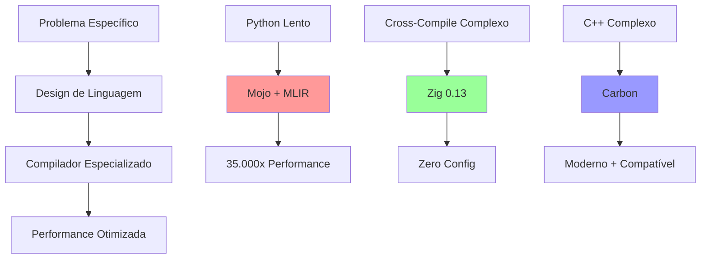

**Por que isso importa para quem aprende compiladores?**

O cenário atual do desenvolvimento de linguagens de programação mostra uma demanda crescente por especialistas em compiladores. Novas linguagens, como [Mojo](https://www.modular.com/mojo) e [Zig](https://ziglang.org/), dependem de compiladores modernos e sofisticados para atingir seus objetivos de performance e segurança, utilizando tecnologias como [MLIR](https://mlir.llvm.org/) e [LLVM](https://llvm.org/). 

Ter conhecimento em compiladores abre portas para oportunidades de carreira em projetos inovadores, já que trabalhar com linguagens emergentes exige domínio dessas ferramentas. Além disso, os compiladores atuais possibilitam inovações tecnológicas que antes eram inviáveis, permitindo criar linguagens que resolvem problemas específicos que compiladores tradicionais não conseguiam abordar.

Entre as principais tendências, destacam-se a priorização da performance (“performance first”), o uso de representações intermediárias avançadas para otimizações inteligentes, a simplificação do desenvolvimento multi-plataforma (cross-platform nativo) e a evolução incremental das linguagens já existentes. 

> "Essas mudanças indicam que aprender sobre compiladores deixou de ser um tema restrito ao meio acadêmico: tornou-se uma habilidade fundamental para quem deseja participar ativamente da próxima geração de linguagens de programação e contribuir para a evolução do ecossistema de software."

---

### 1.4 A Ciência da Criação de um Compilador

O projeto de compiladores combina teoria e prática, utilizando modelos matemáticos para resolver problemas complexos. Um compilador deve processar um conjunto potencialmente infinito de programas, preservando sua semântica, o que torna o desenvolvimento de compiladores um desafio único.

### 1.4.1 Modelagem no Projeto e Implementação do Compilador

Modelos como **máquinas de estado finito** e **expressões regulares** (Capítulo 3) são usados para análise léxica, enquanto **gramáticas livres de contexto** (Capítulo 4) descrevem a sintaxe das linguagens. **Árvores sintáticas** (Capítulo 5) representam a estrutura do programa e sua tradução para código objeto. Esses modelos garantem que o compilador seja robusto e eficiente, equilibrando generalização e simplicidade.

### 1.4.2 A Ciência da Otimização do Código

A otimização de código busca melhorar a eficiência do código gerado, seja em termos de velocidade, tamanho ou consumo de energia. Em arquiteturas modernas, como processadores multicore ou GPUs, otimizações como paralelização e vetorização são cruciais. No entanto, a otimização é um problema indecidível, exigindo heurísticas baseadas em modelos como grafos de fluxo de dados e álgebra linear (Capítulo 9).

Os objetivos de otimização incluem:

- **Correção**: Preservar a semântica do programa.
- **Desempenho**: Melhorar a eficiência para a maioria dos programas.
- **Tempo de Compilação**: Manter a compilação rápida para ciclos de desenvolvimento ágeis.
- **Manutenibilidade**: Garantir que o compilador seja fácil de manter.

A exatidão é fundamental, pois um compilador incorreto pode gerar código inválido. O desenvolvimento de compiladores combina teoria (modelos formais) e experimentação (validação empírica), oferecendo lições valiosas sobre resolução de problemas complexos.

---

### 1.5 APLICAÇÕES DA TECNOLOGIA DE COMPILADORES

O projeto de um compilador não diz respeito apenas a compiladores, e muitas pessoas usam a tecnologia aprendida pelo estudo de compiladores na escola, embora nunca tenham, estritamente falando, nem mesmo escrito parte de um compilador para uma linguagem de programação conhecida. A tecnologia de compiladores possui também outras aplicações importantes. Além do mais, o projeto de um compilador tem impacto em várias outras áreas da ciência da computação. Nesta seção, veremos as interações e aplicações mais importantes dessa tecnologia.

### 1.5.1 IMPLEMENTAÇÃO DE LINGUAGENS DE PROGRAMAÇÃO DE ALTO NÍVEL

Uma linguagem de programação de alto nível define uma abstração de programação: o programador escreve um algoritmo usando a linguagem, e o compilador deve traduzir esse programa para a linguagem objeto. Em geral, é mais fácil programar em linguagens de programação de alto nível, mas elas são menos eficientes, ou seja, os programas objetos são executados mais lentamente. 

Os programadores que usam uma linguagem de baixo nível têm mais controle sobre uma computação e podem, a princípio, produzir código mais eficiente. Infelizmente, os programas feitos desta forma são mais difíceis de escrever e – pior ainda – menos transportáveis para outras máquinas, mais passíveis de erros e mais difíceis de manter. Os compiladores otimizadores dispõem de técnicas para melhorar o desempenho do código gerado, afastando assim a ineficiência introduzida pelas abstrações de alto nível.

**EXEMPLO 1.2**: A palavra-chave register da linguagem de programação C é um velho exemplo da interação entre a tecnologia de compiladores e a evolução da linguagem. Quando a linguagem C foi criada em meados da década de 1970, considerou-se importante permitir o controle pelo programador de quais variáveis do programa residiam nos registradores. Esse controle tornou-se desnecessário quando foram desenvolvidas técnicas eficazes de alocação de registradores, e a maioria dos programas modernos não usa mais esse recurso da linguagem.

Na verdade, os programas que usam a palavra-chave register podem perder a eficiência, pois os programadores normalmente não são os melhores juízes em questões de muito baixo nível, como a alocação de registradores. A escolha de uma boa estratégia para a alocação de registradores depende muito de detalhes específicos de uma arquitetura de máquina. 

> "Tomar decisões sobre o gerenciamento de recursos de baixo nível, como a alocação de registradores, pode de fato prejudicar o desempenho, especialmente se o programa for executado em máquinas diferentes daquela para a qual ele foi A adoção de novas linguagens de programação tem sido na direção daquelas que oferecem maior nível de abstração."

Nos anos 80, C foi a linguagem de programação de sistemas predominante; muitos dos novos projetos iniciados nos anos 1990 escolheram C++ como a linguagem de programação de sistemas. A linguagem Java, introduzida em 1995, rapidamente ganhou popularidade no final da década de 1990. Os novos recursos de linguagem de programação introduzidos a cada rodada incentivaram novas pesquisas sobre otimização de compilador. 

Praticamente todas as linguagens de programação comuns, incluindo C, Fortran e Cobol, admitem que os usuários definam tipos de dados compostos, como arranjo e estruturas, e fluxo de controle de alto nível, como loops e chamadas de procedimentos. 

> "Se simplesmente traduzirmos diretamente para código de máquina cada construção de alto nível ou operação de acesso, o resultado será ineficaz."

Um conjunto de otimizações, conhecido como otimizações de fluxo de dados,foi desenvolvido para analisar o fluxo de dados de um programa, e remover as redundâncias encontradas nessas construções. Essas otimizações têm-se revelado eficazes, e o código gerado se assemelha ao código escrito em um nível mais baixo por um programador habilidoso.

A orientação por objeto foi introduzida inicialmente na linguagem [Simula](https://en.wikipedia.org/wiki/Simula) em 1967, e incorporada em linguagens como [Smalltalk](https://en.wikipedia.org/wiki/Smalltalk), [C++](https://en.wikipedia.org/wiki/C%2B%2B), [C#](https://en.wikipedia.org/wiki/C_Sharp_(programming_language)) e [Java](https://en.wikipedia.org/wiki/Java_(programming_language)). As principais idéias por trás da orientação por objeto são:

1. **Abstração de dados** - Abstrair os detalhes de uma implementação para fornecer uma interface mais simples e fácil de usar.
2. **Herança de propriedades** - Herdar propriedades de uma classe base para uma classe derivada, permitindo a reutilização de código e a criação de hierarquias de classes.

Ambas consideradas fundamentais para tornar os programas mais modulares e mais fáceis de manter. Os programas orientados por objeto são diferentes daqueles escritos em várias outras linguagens, pois possuem mais, porém menores, procedimentos (chamados métodos no contexto da orientação por objeto). Assim, as otimizações presentes no compilador precisam ser eficazes além dos limites de procedimento do programa fonte. A “expansão em linha” (do inglês, inlining) de procedimento, que corresponde à substituição de uma chamada de procedimento pelo seu corpo, é particularmente útil neste contexto. 

Também têm sido desenvolvidas otimizações para agilizar os disparos dos métodos virtuais.  

A linguagem Java possui muitos recursos que tornam a programação mais fácil, e muitos deles foram introduzidos anteriormente em outras linguagens. A linguagem é segura em termos de tipo; ou seja, um objeto não pode ser usado como um objeto de um tipo não relacionado. Todos os acessos a arranjos são verificados para garantir que estejam dentro dos limites do arranjo. Java não possui apontadores nem permite aritmética de apontadores. Ela possui uma função primitiva (built-in) para a coleta de lixo, a qual libera automaticamente a memória das variáveis que não são mais usadas. 

> "Embora todos esses recursos facilitem a programação, eles geram um custo adicional no tempo de execução. Foram desenvolvidas otimizações no compilador para reduzir esse custo adicional, por exemplo, eliminando verificações de limites desnecessárias e alocando na pilha, ao invés de na heap, os objetos que não são acessíveis fora de um procedimento. Algoritmos eficientes também foram desenvolvidos para reduzir o custo adicional atribuído à coleta de lixo."

Além disso, a linguagem Java é projetada para prover código transportável e móvel. Os programas são distribuídos como bytecode Java, que precisa ser interpretado ou compilado para o código nativo dinamicamente, ou seja, em tempo de execução. A compilação dinâmica também tem sido estudada em outros contextos, nos quais a informação é extraída dinamicamente em tempo de execução e usada para produzir um código mais otimizado. Na otimização dinâmica, é importante minimizar o tempo de compilação, pois ele faz parte do custo adicional da execução. Uma técnica muito utilizada é compilar e otimizar apenas as partes do programa que serão executadas com mais frequência.

### 1.5.2 OTIMIZAÇÕES PARA ARQUITETURAS DE COMPUTADOR

A rápida evolução das arquiteturas de computador também gerou uma demanda insaciável por novas técnicas de compilação. Quase todos os sistemas de alto desempenho tiram proveito de duas técnicas básicas: o paralelismo e as hierarquias de memória. O paralelismo pode ser encontrado em diversos níveis: em nível de instrução, onde várias operações são executadas simultaneamente; e em nível de processador, onde diferentes threads da mesma aplicação são executadas em diferentes processadores. 

As hierarquias de memória são uma resposta à limitação básica de que podemos construir um dispositivo de armazenamento muito rápido ou muito grande, mas não um dispositivo de armazenamento que seja tanto rápido quanto grande.

O paralelismo moderno foi muito além das antigas arquiteturas [VLIW](https://en.wikipedia.org/wiki/Very_long_instruction_word) e, em 2025, está centrado em três grandes pilares: instruções vetoriais (vector/SIMD), GPUs e aceleradores especializados para inteligência artificial. As instruções vetoriais, como [RISC-V](https://en.wikipedia.org/wiki/RISC-V) (com suporte completo em GCC/LLVM), [ARM NEON](https://en.wikipedia.org/wiki/ARM_architecture#NEON) (presente em todos os smartphones e tablets) e [x86 AVX-512](https://en.wikipedia.org/wiki/Advanced_Vector_Extensions) (usado em aplicações científicas), permitem que múltiplos dados sejam processados simultaneamente, acelerando operações numéricas. Compiladores modernos, como GCC, Clang e LLVM, já realizam auto-vectorização, ou seja, transformam automaticamente código sequencial em operações vetoriais para aproveitar ao máximo o hardware disponível.

Além disso, as GPUs se consolidaram como o novo paradigma de computação paralela. Tecnologias como [CUDA](https://en.wikipedia.org/wiki/CUDA) (NVIDIA), [OpenCL](https://en.wikipedia.org/wiki/OpenCL) (padrão aberto para diferentes tipos de hardware), [Vulkan Compute](https://en.wikipedia.org/wiki/Vulkan_(API)) e [Metal](https://en.wikipedia.org/wiki/Metal_(API)) (Apple) permitem que programas sejam escritos para explorar milhares de núcleos de processamento em paralelo, acelerando tarefas que vão de gráficos a inteligência artificial. Em paralelo, aceleradores de IA, como as [TPUs](https://en.wikipedia.org/wiki/Tensor_Processing_Unit) do Google, [NPUs](https://en.wikipedia.org/wiki/Neural_Processing_Unit) presentes em smartphones (Apple Neural Engine, Qualcomm Hexagon), [AMD ROCm](https://en.wikipedia.org/wiki/ROCm) e [Intel oneAPI](https://en.wikipedia.org/wiki/Intel_oneAPI), oferecem plataformas dedicadas para executar modelos de machine learning com máxima eficiência.

Para tirar proveito desses recursos, surgiram compiladores especializados em IA, como o [TVM](https://tvm.apache.org/) (Apache), [IREE](https://www.iree.dev/) (Google), [MLIR](https://mlir.llvm.org/) e [ONNX Runtime](https://onnxruntime.ai/), que otimizam modelos de aprendizado de máquina para diferentes tipos de hardware. O ecossistema [RISC-V](https://en.wikipedia.org/wiki/RISC-V), por sua vez, já está presente em placas de desenvolvimento (como [Raspberry Pi Pico](https://en.wikipedia.org/wiki/Raspberry_Pi_Pico), [ESP32-C3](https://en.wikipedia.org/wiki/ESP32), [SiFive HiFive](https://en.wikipedia.org/wiki/SiFive)) e em smartphones (Google Pixel 6, Samsung Exynos) e em servidores de grandes empresas de nuvem (Alibaba Cloud, Tencent Cloud), com toolchains modernos ([GCC 12+](https://gcc.gnu.org/), [LLVM 15+](https://llvm.org/)) oferecendo suporte completo. Assim, o paralelismo atual é caracterizado pela heterogeneidade e pela capacidade dos compiladores de explorar, de forma automática, o melhor de cada arquitetura.

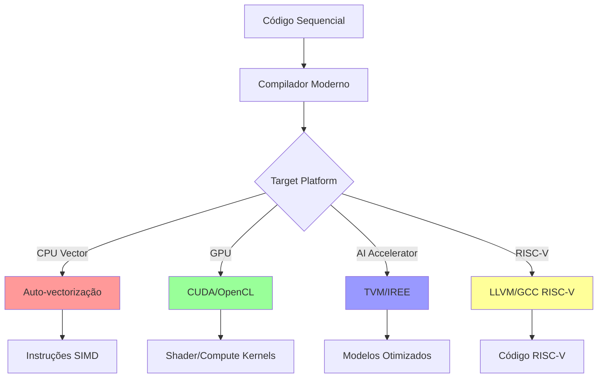

**Por que isso importa?**

O cenário do paralelismo em 2025 é marcado pela heterogeneidade, ou seja, pela capacidade de utilizar o acelerador mais adequado para cada tipo de computação. Isso se reflete em diversos aspectos: instruções vetoriais (Vector/SIMD) podem acelerar operações numéricas em 4 a 16 vezes, enquanto GPUs oferecem uma eficiência energética de 10 a 100 vezes maior para tarefas paralelas. 

A presença de aceleradores de inteligência artificial tornou-se ubíqua, estando presentes em dispositivos que vão de smartphones a datacenters, e a arquitetura [RISC-V](https://en.wikipedia.org/wiki/RISC-V) democratizou o acesso a plataformas customizadas, permitindo que startups e pesquisadores desenvolvam soluções sob medida. Assim, o foco não está mais em arquiteturas como VLIW ou Itanium, mas sim em explorar, de forma inteligente, a diversidade de recursos computacionais disponíveis para maximizar desempenho e eficiência.

**Hierarquias de memória**: Uma hierarquia de memória consiste em vários níveis de armazenamento com diferentes velocidades e tamanhos, com o nível mais próximo do processador sendo o mais rápido, porém o menor. O tempo médio de acesso à memória de um programa é reduzido se a maior parte dos seus acessos for satisfeita pelos níveis mais rápidos da hierarquia. Tanto o paralelismo quanto a existência de uma hierarquia de memória melhoram o desempenho potencial de uma máquina, mas ambos precisam ser utilizados de modo eficaz pelo compilador, a fim de oferecer um desempenho real em uma aplicação.

As hierarquias de memória são encontradas em todas as máquinas. Um processador normalmente possui uma pequena quantidade de registradores consistindo em centenas de bytes, vários níveis de caches contendo kilobytes a megabytes, memória física contendo de megabytes a gigabytes, e finalmente uma memória secundária que contém gigabytes. Desta forma, a velocidade dos acessos entre os níveis adjacentes da hierarquia de memória pode diferir entre duas ou três ordens de grandeza.

> "O desempenho de um sistema normalmente é limitado não pela velocidade do processador, mas pelo desempenho do subsistema de memória. Embora os compiladores tradicionalmente focalizem a otimização da execução do processador, a ênfase maior agora está em tornar a hierarquia de memória mais eficiente."

O uso eficaz dos registradores provavelmente é o problema mais importante na otimização de um programa. Ao contrário dos registradores que precisam ser gerenciados explicitamente no software, os caches e as memórias físicas não são visíveis no conjunto de instruções e, portanto são gerenciados pelo hardware. Descobriu-se que as políticas de gerenciamento de cache implementadas pelo hardware não são eficientes em alguns casos, especialmente em códigos científicos que possuem grandes estruturas de dados (normalmente, arranjos). 

É possível melhorar a eficácia da hierarquia de memória alterando o leiaute dos dados, ou alterando a ordem das instruções que acessam os dados. Também podemos alterar o leiaute do código para melhorar a eficácia dos caches de instrução.

---

### 1.5.3 PROJETO DE NOVAS ARQUITETURAS DE COMPUTADOR

Nos primeiros projetos de arquiteturas de computadores, os compiladores só eram desenvolvidos após a construção das máquinas. Mas isso mudou. Como o usual é programar em linguagens de alto nível, o desempenho de um sistema de computação é determinado não somente por sua inerente velocidade, mas também pela forma como os compiladores podem explorar seus recursos. Assim, no desenvolvimento de arquiteturas de computadores modernas, os compiladores são desenvolvidos no estágio de projeto do processador, e o código compilado, executando em simuladores, é usado para avaliar os recursos arquitetônicos propostos.

**RISC**: Um dos exemplos mais conhecidos de como os compiladores influenciaram o projeto da arquitetura de computador foi a invenção da arquitetura [RISC](https://en.wikipedia.org/wiki/Reduced_instruction_set_computer) (Reduced Instruction-Set Computer – computador com um conjunto reduzido de instruções). 

Antes dessa invenção, a tendência era desenvolver gradativamente conjuntos de instruções cada vez mais complexos, com o objetivo de tornar a programação assembler mais fácil; essas arquiteturas eram conhecidas como [CISC](https://en.wikipedia.org/wiki/Complex_instruction_set_computer) (Complex Instruction Set Computer – computador com um conjunto de instruções complexas). Por exemplo, os conjuntos de instruções CISC incluem modos de endereçamento de memória complexos para dar suporte aos acessos a estruturas de dados e instruções de chamada de procedimento que salvam registradores e passam parâmetros na pilha.

**Otimizações de compiladores**: Normalmente, as otimizações de compiladores podem reduzir essas instruções a um pequeno número de operações mais simples, eliminando as redundâncias das instruções complexas. Assim, é desejável construir conjuntos de instruções simples; os compiladores podem usá-las de forma mais eficiente e torna-se mais fácil otimizar o hardware.

**Arquiteturas especializadas**: A maioria das arquiteturas de processadores de uso geral, incluindo [PowerPC](https://en.wikipedia.org/wiki/PowerPC), [SPARC](https://en.wikipedia.org/wiki/SPARC), [MIPS](https://en.wikipedia.org/wiki/MIPS_architecture), [Alpha](https://en.wikipedia.org/wiki/Alpha_(microarchitecture)) e [PA-RISC](https://en.wikipedia.org/wiki/PA-RISC), é baseada no conceito de RISC. Embora a arquitetura [x86](https://en.wikipedia.org/wiki/X86) – o microprocessador mais popular – possua um conjunto de instruções CISC, muitas das idéias desenvolvidas para máquinas RISC são usadas nas implementações do próprio processador. Além disso, o modo mais eficiente de usar uma máquina x86 de alto desempenho é usar apenas suas instruções mais simples.

**Arquiteturas especializadas**: Durante as três últimas décadas, foram propostos muitos conceitos arquitetônicos. Eles incluem máquinas de fluxo de dados, máquinas de vetor, máquinas [VLIW](https://en.wikipedia.org/wiki/Very_long_instruction_word) (Very Long Instruction Word – palavra de instrução muito longa), arranjos de processadores [SIMD](https://en.wikipedia.org/wiki/SIMD) (Single Instruction, Multiple Data – única instrução, múltiplos dados), arranjos sistólicos, multiprocessadores com memória compartilhada e multiprocessadores com memória distribuída. O desenvolvimento de cada um desses conceitos arquitetônicos foi acompanhado pela pesquisa e desenvolvimento de novas tecnologias de compilação.

**Máquinas embutidas**: Algumas dessas idéias deram origem aos projetos de máquinas embutidas. Uma vez que sistemas inteiros podem caber em um único chip, os processadores não precisam mais ser unidades tipo produto pré-empacotado, mas podem ser feitos sob medida para melhorar a relação custo-benefício de determinada aplicação. 

Assim, ao contrário dos processadores de uso geral, nos quais as economias de escala levaram à convergência das arquiteturas de computador, os processadores de aplicações específicas apresentam uma diversidade de arquiteturas de computador. A tecnologia de compiladores é necessária não apenas para dar suporte à programação para essas arquiteturas, mas também para avaliar os projetos arquitetônicos propostos.

### 1.5.4 TRADUÇÕES DE PROGRAMA

Embora normalmente pensemos na compilação como uma tradução de uma linguagem de alto nível para o nível de máquina, a mesma tecnologia pode ser aplicada para traduzir entre diferentes tipos de linguagens. A seguir são apresentadas algumas aplicações importantes das técnicas de tradução de programa.

**Tradução binária**: A tradução binária também foi usada pela Transmeta Inc. em sua implementação do conjunto de instruções x86. Em vez de executar este complexo conjunto de instruções diretamente no hardware, o processador Transmeta Crusoe é um processador VLIW que usa a tradução binária para converter o código x86 em código VLIW nativo.

**Tradução binária**: A tradução binária também pode ser usada para prover compatibilidade para trás (backward compatibility). Por exemplo, quando o processador Motorola MC 68040 foi substituído pelo PowerPC no Apple Macintosh em 1994, usou-se a tradução binária para permitir que os processadores PowerPC executassem o código legado do MC 68040.

**Síntese de hardware**: Assim como a maioria do software é escrita em linguagens de programação de alto nível, os projetos de hardware também o são. Estes são especificados principalmente em linguagens de descrição de arquitetura de alto nível, como, por exemplo, Verilog e VHDL (Very high-speed integrated circuit Hardware Description Language – linguagem de descrição de hardware para circuito integrado de altíssima velocidade). Os projetos de hardware são tipicamente descritos em RTL (Register Transfer Level), onde as variáveis representam registradores e as expressões representam lógica combinatória.

**Ferramentas de síntese de hardware**: Ferramentas de síntese de hardware traduzem automaticamente descrições RTL para portas, que são então mapeadas para transistores e eventualmente para um leiaute físico. Diferentemente dos compiladores para linguagens de programação, essas ferramentas normalmente gastam horas otimizando o circuito. Também existem técnicas para traduzir projetos em níveis mais altos, como o nível de comportamento ou funcional.

**Interpretadores de consulta de banco de dados**: Além de especificar software e hardware, as linguagens de programação são úteis em muitas outras aplicações. Por exemplo, as linguagens de consulta, especialmente SQL (Structured Query Language – linguagem de consulta estruturada), são usadas para pesquisas em bancos de dados. As consultas em banco de dados consistem em predicados contendo operadores relacionais e boolianos, os quais podem ser interpretados ou compilados para comandos que consultam registros de um banco de dados satisfazendo esse predicado.

**Simulação compilada**: Simulação é uma técnica geral utilizada em muitas disciplinas científicas e de engenharia para compreender um fenômeno ou validar um projeto. As entradas de um simulador usualmente incluem a descrição do projeto e parâmetros de entrada específicos para que uma simulação em particular execute. As simulações podem ser muito dispendiosas. Normalmente, precisamos simular muitas das possíveis alternativas de projeto em vários conjuntos de entrada diferentes, e cada experimento pode levar dias para ser concluído em uma máquina de alto desempenho. Em vez de escrever um simulador que interprete o projeto, é mais rápido compilar o projeto para produzir código de máquina que simula esse projeto em particular nativamente.

**Simulação compilada**: A simulação compilada pode ser executada muitas vezes mais rapidamente do que uma abordagem interpretada. A simulação compilada é usada em muitas ferramentas de última geração que simulam projetos escritos em Verilog ou VHDL.

### 1.5.5 FERRAMENTAS DE PRODUTIVIDADE DE SOFTWARE

Os programas são comprovadamente os artefatos de engenharia mais complicados já produzidos; eles consistem em muitos e muitos detalhes, cada um devendo estar correto antes que o programa funcione completamente. Como resultado, os erros são como rompantes nos programas; eles podem arruinar um sistema, produzir resultados errados, tornar um sistema vulnerável a ataques de segurança, ou, ainda, levar a falhas catastróficas em sistemas críticos. O teste é a principal técnica para localizar erros nos programas.

**Análise de fluxo de dados**: Uma técnica complementar interessante e promissora é usar a análise de fluxo de dados para localizar erros estaticamente, ou seja, antes que o programa seja executado. A análise de fluxo de dados pode localizar erros em todos os caminhos de execução possíveis, e não apenas aqueles exercidos pelos conjuntos de dados de entrada, como no caso do teste do programa. Muitas das técnicas de análise de fluxo de dados, originalmente desenvolvidas para otimizações de compilador, podem ser usadas para criar ferramentas que auxiliam os programadores em suas tarefas de engenharia de software.

**Análise de fluxo de dados**: O problema de localizar todos os erros de um programa é indeciso. Uma ferramenta para a análise de fluxo de dados pode ser criada para avisar aos programadores sobre todas as instruções que podem infringir determinada categoria de erros. Mas, se a maioria desses avisos forem alarmes falsos, os usuários não usarão a ferramenta. Assim, os detectores de erro práticos normalmente não são seguros nem completos. Ou seja, eles podem não encontrar todos os erros no programa, e não há garantias de que todos os erros relatados sejam erros reais. Apesar disso, diversas análises estáticas têm sido desenvolvidas e consideradas eficazes na localização de erros, tais como tentativas de acessos via apontadores nulos ou liberados, nos programas reais.

O fato de os detectores de erro poderem ser inseguros os torna significativamente diferentes das otimizações de compiladores. Os otimizadores de código precisam ser conservadores e não podem alterar a semântica do programa sob circunstância alguma.

No fim desta seção, mencionaremos diversas maneiras pelas quais a análise do programa, baseada nas técnicas desenvolvidas originalmente para otimizar o código nos compiladores, melhorou a produtividade do software. Técnicas que detectam estaticamente quando um programa pode ter uma vulnerabilidade de segurança são de especial importância.

A verificação de tipos é uma técnica eficaz e bastante estabelecida para identificar inconsistências nos programas. Ela pode ser usada para detectar erros, por exemplo, quando uma operação é aplicada ao tipo errado de objeto, ou se os parâmetros passados a um procedimento não casam com a assinatura do procedimento. A análise do programa pode ir além de encontrar erros de tipo, analisando o fluxo de dados ao longo de um programa. Por exemplo, se for atribuído um valor null ao apontador e depois ele for imediatamente utilizado para acesso, o programa conterá claramente um erro.

A mesma abordagem pode ser usada para identificar diversas brechas na segurança, em que um invasor fornece uma cadeia de caracteres ou outro dado que seja usado descuidadamente pelo programa. Uma cadeia de caracteres fornecida pelo usuário pode ser rotulada com um tipo “perigoso”. Se essa cadeia de caracteres não tiver o formato correto verificado, ela permanece “perigosa”, e, se uma cadeia de caracteres desse tipo for capaz de influenciar o fluxo de controle do código em algum ponto no programa, então existe uma falha de segurança potencial.

### Verificação de limites

É mais fácil cometer erros ao programar em uma linguagem de baixo nível do que em uma linguagem de alto nível. Por exemplo, muitas brechas de segurança nos sistemas são causadas por estouros de buffer em programas escritos na linguagem C. Como C não possui verificação de limites de arranjos, fica a critério do usuário garantir que os arranjos não sejam acessados fora dos limites. Deixando de verificar se os dados fornecidos pelo usuário podem estourar um buffer, o programa pode ser enganado e armazenar dados do usuário fora do buffer. Um invasor pode manipular dados de entrada que causem um comportamento errôneo no programa e comprometer a segurança do sistema. Foram desenvolvidas técnicas para encontrar estouros de buffer nos programas, mas com um sucesso limitado.

Se o programa tivesse sido escrito em uma linguagem segura, que inclui verificação automática de limites de arranjo, esse problema não teria ocorrido. A mesma análise de fluxo de dados usada para eliminar verificações de limites redundantes também pode ser utilizada para localizar estouros de buffer. No entanto, a principal diferença é que deixar de eliminar uma verificação de limites só resulta em um pequeno custo em tempo de execução, enquanto deixar de identificar um estouro de buffer potencial pode comprometer a segurança do sistema. Assim, embora seja adequado usar técnicas simples para otimizar as verificações de limites, para conseguir resultados de alta qualidade nas ferramentas de detecção de erros são necessárias análises sofisticadas, tais como o rastreamento dos valores de apontadores entre procedimentos.

A coleta de lixo é outro exemplo excelente de compromisso entre a eficiência e uma combinação de facilidade de programação e confiabilidade de software. O gerenciamento automático da memória suprime todos os erros de gerenciamento de memória (por exemplo, “vazamento de memória”), que são uma grande fonte de problemas nos programas em C e C++. Diversas ferramentas foram desenvolvidas para auxiliar os programadores a encontrar erros de gerenciamento de memória. 

Por exemplo, Purify é uma ferramenta muito utilizada para detectar erros de gerenciamento de memória dinamicamente, à medida que acontecem. Também foram desenvolvidas ferramentas que ajudam a identificar alguns desses problemas estaticamente.
