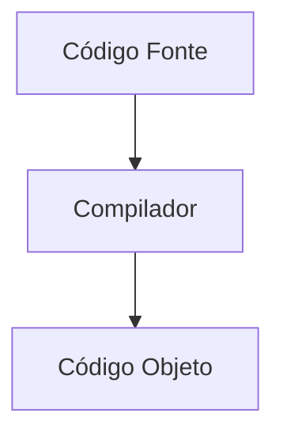
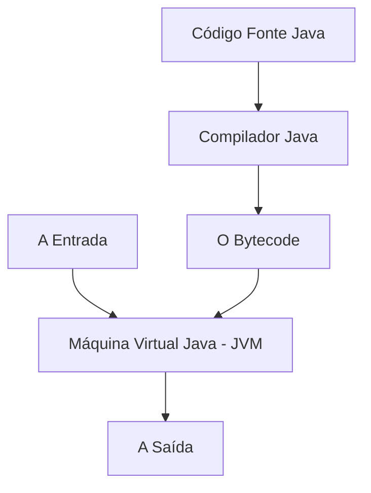
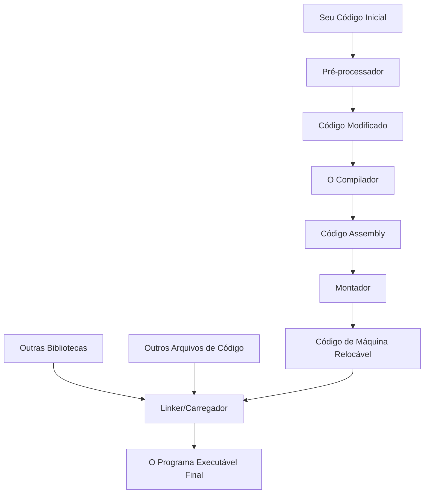
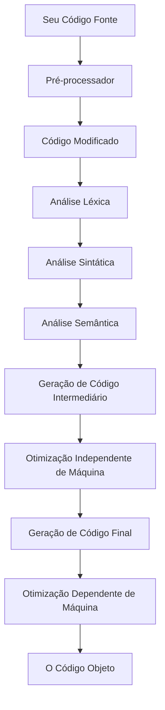
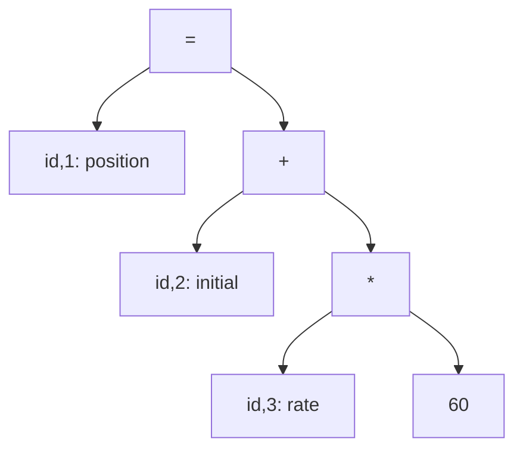
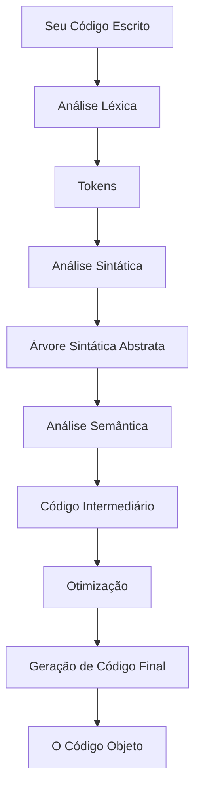
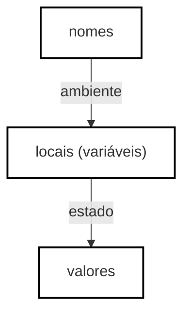

## 1. INTRODUÇÃO

Sabe quando você tem uma ideia e quer que o computador a transforme em um aplicativo, um jogo ou um site? A gente usa [**linguagens de programação**](https://www.linguagensdeprogramacao.com.br/) pra isso. Elas são como a nossa forma de conversar com a máquina, dando instruções detalhadas para resolver problemas ou criar coisas novas.

De apps no seu celular a sistemas que controlam carros, redes sociais ou até satélites, tudo começa com código. Mas tem um detalhe: o computador, na sua forma mais básica, não entende a nossa linguagem. Ele só entende uma coisa: a linguagem de máquina, que é basicamente uma sequência de zeros e uns. É aí que entra o herói da história: o **compilador**.

Pense no compilador como um tradutor superinteligente. Ele pega o código que a gente escreve (que é bem mais fácil de entender) e o traduz para a linguagem que o computador entende. Essa tradução pode ser direta para a linguagem da máquina ou para um formato intermediário, como o [bytecode](https://en.wikipedia.org/wiki/Bytecode) ou [WebAssembly](https://webassembly.org/), que pode rodar em diferentes lugares, seja no seu PC, no celular ou até no seu navegador.

É por causa dos compiladores que linguagens como [Rust](https://www.rust-lang.org/), [Go](https://go.dev/) e [TypeScript](https://www.typescriptlang.org/) conseguem criar programas super-rápidos, seguros e que funcionam em qualquer plataforma. Eles são a mágica por trás do desempenho de quase tudo que a gente usa no mundo digital.

Hoje em dia, saber como um compilador funciona não é só coisa de professor de faculdade. É o tipo de conhecimento que te dá superpoderes para criar suas próprias linguagens, otimizar programas para rodarem mais rápido em diferentes computadores, ou até para entender como ferramentas como o [V8](https://v8.dev/) (o motor do Google Chrome) ou a [JVM](https://www.oracle.com/java/technologies/javase/jvms.html) (da linguagem Java) funcionam por dentro. É um campo que junta várias áreas, de lógica a engenharia, e que é essencial para o futuro da [Inteligência Artificial](https://www.inteligenciaartificial.com.br/), [cibersegurança](https://www.ciberseguranca.com.br/) e [desenvolvimento de games](https://www.games.com.br/).

Neste artigo, a gente vai desvendar esse mistério de forma prática. Vamos ver o que acontece a cada etapa da tradução do código e entender por que esse conhecimento é cada vez mais valioso num mundo cheio de nuvens, IA e sistemas conectados. Se você sempre quis saber como seu código vira algo real e funcional, prepare-se, porque esta jornada é para você.

### 1.1 PROCESSADORES DE LINGUAGEM

De maneira bem simples, um compilador é um programa que pega o seu código-fonte e o converte para um código "traduzido" (o código objeto). Durante essa tradução, ele também te avisa se você cometeu algum erro na escrita, como uma palavra fora do lugar ou um comando que não existe, o que facilita muito a nossa vida.



**FIGURA 1.1** O papel de um compilador.


Depois que o compilador faz a mágica e gera o código que o computador entende, esse novo arquivo pode ser executado para receber uma entrada (por exemplo, um dado que o usuário digita) e gerar uma saída (o resultado ou a ação que a gente espera).


**FIGURA 1.2** O programa em ação.


### O que é o "outro cara": O Interpretador

Além do compilador, que é como um tradutor profissional que converte um livro inteiro de uma vez, existe o **interpretador**. Pense nele como um tradutor simultâneo, daqueles que você vê em conferências.

Em vez de traduzir o código-fonte todo de uma vez para um arquivo final, ele vai "lendo" seu código linha por linha, na hora, e executando cada instrução baseada no que você dá de entrada. É por isso que linguagens como **Python** e **JavaScript** são tão flexíveis e ótimas para ambientes interativos. Se você comete um erro, o interpretador te avisa na mesma hora\!


**FIGURA 1.3** Como o interpretador trabalha.

Enquanto o compilador geralmente gera programas super-rápidos (já que a tradução foi feita antes), o interpretador brilha na hora de encontrar bugs, pois ele executa o código "ao vivo". Isso é perfeito para ferramentas como o **Jupyter Notebook**, que te permitem ver o resultado de cada linha de código imediatamente.


### O Melhor dos Dois Mundos: O Caso do Java

A linguagem **Java** é um exemplo de como podemos usar o melhor das duas abordagens. A mágica acontece em duas etapas:

1.  **A Primeira Tradução:** O código-fonte em Java é compilado para um formato intermediário, o **bytecode**. Pense no bytecode como uma "linguagem universal" que nenhuma máquina entende diretamente, mas que é fácil de traduzir para qualquer uma delas.
2.  **A Tradução Final:** Esse bytecode é então rodado dentro de uma **Máquina Virtual Java (JVM)**. A JVM é como um ambiente virtual dentro do seu computador que pega o bytecode e o executa. Ela pode tanto interpretá-lo linha a linha quanto usar uma técnica chamada **JIT** (*Just-In-Time*).

Esse modelo híbrido é o que permite que um mesmo código Java rode sem problemas em um servidor gigante, no seu PC ou até no seu celular. É o famoso lema do Java: **"escreva uma vez, rode em qualquer lugar"**.



**FIGURA 1.4** O sistema híbrido de Java.

O **JIT** é como um turbo para a JVM. Ele observa quais partes do bytecode são mais usadas e, em vez de interpretá-las toda vez, as traduz na hora para o código de máquina mais rápido possível. É o mesmo truque que o **V8** (o motor do JavaScript no Chrome e Node.js) usa para deixar a navegação na web super veloz.

### A Equipe Completa de Compilação

Quando você está em um projeto grande, o compilador não trabalha sozinho. Ele faz parte de uma equipe que transforma seu código em um programa executável.



**FIGURA 1.5** Todo o fluxo de trabalho de compilação.

O processo pode ser resumido assim:

1.  **Pré-processador:** Antes de tudo, um assistente dá uma primeira passada no seu código. Ele resolve tarefas simples, como incluir códigos de outras bibliotecas (`#include`) ou expandir atalhos.
2.  **Montador (Assembler):** O compilador pode não gerar o código de máquina final. Em vez disso, ele gera um código "irmão", o **assembly**, que é mais fácil de ler e otimizar. O montador é quem pega esse código e o traduz para o código de máquina.
3.  **Linker (Editor de Ligação):** Em projetos complexos, seu código é dividido em vários arquivos. O linker é o grande organizador. Ele junta todos os pedacinhos do seu projeto, conecta eles com bibliotecas externas (como bibliotecas de matemática ou de gráficos) e cria um único arquivo executável.
4.  **Carregador (Loader):** Por fim, o carregador é a parte do sistema operacional que coloca seu programa na memória para que ele possa ser executado.

Ferramentas modernas, como o **LLVM**, fazem a maior parte desse trabalho de forma automática, garantindo que seu código funcione em diferentes arquiteturas (como chips de celular e chips de PC) sem que você precise se preocupar com cada etapa.

### 1.2 A Estrutura por Dentro de um Compilador

Um compilador não faz todo o trabalho de uma vez. Ele é como um time de especialistas que tem um processo bem definido para traduzir o seu código. Esse processo é dividido em duas grandes etapas: **Análise** e **Síntese**.

Pense assim:

  * A **Análise** (o "Front-End") é como um time de editores. Eles pegam seu rascunho de texto (o código-fonte) e trabalham nele para entender cada detalhe e garantir que não tem erros de gramática ou de lógica.
  * A **Síntese** (o "Back-End") é como a equipe de produção. Eles pegam o texto final, revisado e aprovado, e o transformam em um produto final que pode ser lido e executado (o código de máquina).

Vamos dar uma olhada em cada uma dessas partes, com foco nas ferramentas modernas que fazem tudo isso acontecer de forma muito mais inteligente.

#### O Front-End: Entendendo o que Você Escreveu

O front-end de um compilador tem a missão de "desmontar" o seu código para entender exatamente o que ele significa. Para isso, ele passa por três fases:

1.  **Análise Léxica (O Scanner):** Esta é a primeira fase. O compilador lê seu código como se fosse uma sequência gigante de letras, números e símbolos. O trabalho dele é agrupar essas sequências em "palavrinhas" com significado, que a gente chama de **tokens**. Por exemplo, ele entende que `if`, `while` ou `int` são palavras-chave, que `minha_variavel` é um nome de variável e que `100` é um número.
2.  **Análise Sintática (O Professor de Gramática):** Depois de ter todos os tokens, essa fase é como um professor de gramática. Ela verifica se as "palavrinhas" estão na ordem certa, formando frases válidas, de acordo com as regras da linguagem. Se você esquecer um ponto e vírgula ou um parêntese, é aqui que o compilador te pega. O resultado é uma **Árvore Sintática Abstrata (AST)**, que é como um mapa visual da estrutura do seu código.
3.  **Análise Semântica (O Professor de Lógica):** A lógica é a cereja do bolo. Essa fase verifica a coerência do seu código. Por exemplo, ela checa se você está tentando somar um texto com um número ou se está usando uma variável que nunca foi declarada.

Durante todo esse processo de análise, o compilador anota tudo em uma **tabela de símbolos**. Pense nela como um "caderninho de anotações" onde ele guarda informações sobre cada variável e função: o nome, o tipo de dado (se é um número, texto, etc.), e onde ela pode ser usada. Ferramentas modernas, como o **Clang** e o **Rustc**, usam essa tabela para dar mensagens de erro super detalhadas e úteis.

#### O Back-End: Criando o Programa de Verdade

Depois que o front-end "entendeu" tudo, o back-end entra em ação. Ele pega a representação intermediária do seu código (como a árvore sintática) e começa a traduzi-la para a linguagem final. Essa linguagem pode ser o código de máquina que a CPU entende, ou algo como o **WebAssembly** para rodar no navegador.

É aqui que a mágica da **otimização** acontece\! O back-end busca jeitos de fazer seu código rodar mais rápido, gastar menos energia (ótimo para celulares e dispositivos IoT) ou aproveitar recursos de hardware específicos. O **LLVM** é uma das ferramentas mais importantes nesse campo, pois permite que o mesmo back-end crie programas otimizados para chips diferentes, de PCs a smartphones.

### 1.3 As Fases do Compilador em Ação

O processo de compilação completo é como uma linha de montagem, com várias etapas que se alimentam umas das outras. Aqui está o fluxo completo:



**FIGURA 1.6** As fases de um compilador moderno.

#### 1.2.1 Análise Léxica: O Detetive de Palavras

Vamos pegar um exemplo real para entender a primeira fase. Imagine a seguinte linha de código em C:

```bash
position = initial + rate * 60
```

1.  O **Analisador Léxico** passa por essa linha e, em vez de ver um texto corrido, ele "peneira" o código e o quebra em pedaços significativos. Ele descarta os espaços e cria uma "ficha" (**token**) para cada pedaço, com um tipo e um valor:
      * `position` → ele entende que é um nome de variável (`id` - identificador).
      * `=` → ele entende que é um operador de atribuição.
      * `initial` → de novo, um nome de variável (`id`).
      * `+` → um operador de soma.
      * `rate` → mais um nome de variável (`id`).
      * `*` → um operador de multiplicação.
      * `60` → um número.
2.  Para cada nome de variável (`id`) e número, ele anota os detalhes em sua **tabela de símbolos**. Por exemplo, ele guarda que `position` é a variável `1`, `initial` é a `2`, e assim por diante.

No final, essa linha de código se transforma em uma sequência de fichas, sem os espaços, pronta para a próxima fase (o "professor de gramática") analisar:

```bash
id,1 atribuicao id,2 soma id,3 multiplicacao numero,4
```

É assim que o compilador começa a "enxergar" seu código, um pequeno passo de cada vez. E em linguagens como **Rust** ou **TypeScript**, essa etapa já ajuda a verificar se o código é seguro ou se os tipos estão corretos.

-----

### 1.2.2 Análise Sintática: O Professor de Gramática

Depois que o "faxineiro do código" (o analisador léxico) separou tudo em "fichas" (os tokens), é hora de o **Analisador Sintático** entrar em ação. Pense nele como um professor de gramática: sua missão é garantir que todas as "fichas" estão na ordem certa e que formam frases válidas. Ele não se preocupa com o significado, só com a estrutura.

O resultado do trabalho dele é uma **Árvore Sintática Abstrata (AST)**. Essa árvore é um mapa visual do seu código, que mostra a hierarquia e a ordem de importância de cada operação. Ela é fundamental para que o compilador entenda o que deve ser feito primeiro (como a multiplicação em uma equação matemática) antes de seguir para a próxima etapa.

Vamos voltar ao nosso exemplo:

```bash
position = initial + rate * 60
```

Para o analisador sintático, a sequência de fichas (`id`, `atribuicao`, `id`, `soma`, etc.) não é só uma lista. Ele a organiza em uma árvore, priorizando as operações mais importantes, como a multiplicação (`*`), que tem que ser feita antes da soma (`+`).



**FIGURA 1.7** A Árvore Sintática Abstrata para o nosso código.

Note como a multiplicação e a soma estão "dentro" do sinal de atribuição (`=`). Isso mostra a ordem: primeiro a multiplicação, depois a soma e, por fim, a atribuição. Depois de ter essa árvore em mãos, o compilador passa para as próximas fases.

### 1.2.3 Análise Semântica: O Professor de Lógica

Essa é a fase onde o compilador verifica se o seu código faz sentido de verdade, e não só se ele está escrito corretamente. O **Analisador Semântico** usa a árvore sintática e o "caderninho de anotações" (a tabela de símbolos) para checar a lógica do programa.

Ele é o cara que vai te avisar se você está:

  * Tentando somar um texto com um número.
  * Usando uma variável que você esqueceu de declarar.
  * Tentando usar um tipo de dado errado, como usar um texto (`"texto"`) para indexar um array.

É também nesta fase que o compilador faz conversões automáticas (`coerções`), quando o seu código precisa. Por exemplo, se você tenta somar um número inteiro e um número com vírgula, ele transforma o inteiro para o tipo de número com vírgula para que a operação funcione.

### 1.2.4 O Fluxo Completo da Tradução

A partir da árvore sintática, a mágica do back-end começa. A árvore é o mapa para as próximas fases:



**FIGURA 1.8** O fluxo de trabalho completo da tradução.

### 1.2.4 Geração de Código Intermediário: A Receita Universal

Depois de passar pela análise, o compilador traduz a AST para uma linguagem que ele entende melhor, chamada **Código Intermediário (IR)**. Pense nisso como uma "receita de cozinha" universal, com passos super claros e simples.

Essa receita é fácil de entender para qualquer compilador, não importa qual computador ou sistema operacional você esteja usando. Por exemplo, a nossa linha de código `position = initial + rate * 60` vira uma sequência de passos bem detalhados:

```bash
t1 = inttofloat(60)
t2 = id3 * t1
t3 = id2 + t2
id1 = t3
```

### 1.2.5 Otimização: A Receita Melhorada

Otimizar é deixar o código mais eficiente. O compilador usa o Código Intermediário para procurar jeitos de melhorar a performance. Ele é como um chef experiente que olha a receita e diz: "Podemos pular alguns passos aqui para ir mais rápido e usar menos ingredientes."

No nosso exemplo, ele perceberia que a conversão de `60` para um número com vírgula pode ser feita na hora, e que as variáveis `t2` e `t3` podem ser eliminadas, já que os resultados podem ser guardados em outro lugar. O código final ficaria mais enxuto:

```bash
t1 = id3 * 60.0
id1 = id2 + t1
```

Esse processo é super importante para jogos, sistemas de IA ou apps de celular, onde cada milissegundo e cada bit de energia contam.

### 1.2.6 Geração de Código Final: O Prato Servido

Esta é a etapa final. O compilador pega a "receita melhorada" (o código otimizado) e a traduz para a "língua nativa" do seu computador (o **código de máquina**). É aqui que ele decide onde guardar cada valor na memória do computador, usando os espaços disponíveis chamados **registradores**.

O nosso código otimizado vira algo parecido com isso:

```bash
LDF R2, id3      // Carregue a variável 'rate' no registrador R2
MULF R2, R2, #60.0 // Multiplique o valor de R2 por 60.0
LDF R1, id2      // Carregue a variável 'initial' no registrador R1
ADDF R1, R1, R2    // Some o valor de R1 com R2
STF id1, R1      // Guarde o resultado final em 'position'
```

É assim que o seu código, uma ideia que começou em texto, passa por uma série de etapas até se transformar em instruções que o computador pode executar. Incrível, né?


---


### 1.2.7 Gerenciamento da Tabela de Símbolos

A tabela de símbolos é uma estrutura fundamental em compiladores modernos, armazenando informações sobre variáveis, funções e seus atributos, como tipo, escopo e, no caso de funções, parâmetros e tipos de retorno. Em linguagens como TypeScript ou Go, que possuem sistemas de tipos avançados, a tabela de símbolos é essencial para suportar inferência de tipos e verificações de escopo em tempo de compilação. Estruturas de dados eficientes, como tabelas de hash ou árvores balanceadas, são usadas para garantir acesso rápido a essas informações.

### 1.2.8 Agrupamento de Fases em Passos

Na prática, as fases de compilação são frequentemente agrupadas em passos para otimizar o desempenho. Por exemplo, em compiladores como Clang ou Rustc, o front-end (análise léxica, sintática, semântica e geração de código intermediário) pode ser combinado em um único passo, enquanto otimizações e geração de código para a máquina alvo formam passos separados. 

O uso de representações intermediárias padronizadas, como a IR do LLVM, permite criar compiladores modulares, combinando front-ends para diferentes linguagens com back-ends para várias arquiteturas, um modelo amplamente adotado em ferramentas modernas. Essa abordagem reflete a evolução dos compiladores, que hoje lidam com linguagens mais complexas e arquiteturas diversas, mantendo a eficiência e a portabilidade como prioridades.

### 1.2.9 Ferramentas para Construção de Compilador

No desenvolvimento de compiladores modernos, os projetistas contam com uma ampla gama de ferramentas especializadas que simplificam e aceleram a construção de diferentes fases do compilador. Além de ferramentas genéricas de desenvolvimento de software, como editores de texto avançados (e.g., VS Code), sistemas de controle de versão (e.g., Git), e depuradores, ferramentas específicas para compiladores têm evoluído significativamente, integrando algoritmos complexos e interfaces que facilitam sua adoção. Essas ferramentas frequentemente utilizam linguagens declarativas ou especificações formais para definir componentes do compilador, permitindo integração fluida com o restante do sistema. As principais ferramentas incluem:

1. **Geradores de Analisadores Sintáticos**: Ferramentas como [Bison](https://www.gnu.org/software/bison/) e [Yacc](https://www.gnu.org/software/yacc/) geram analisadores sintáticos a partir de gramáticas livres de contexto, descritas em linguagens como BNF (Backus-Naur Form). Essas ferramentas são amplamente usadas em projetos como GCC e Clang para automatizar a construção de parsers.

2. **Geradores de Analisadores Léxicos**: Ferramentas como [Flex](https://github.com/westes/flex) e [Lex](https://github.com/westes/flex) criam analisadores léxicos com base em expressões regulares que descrevem os tokens de uma linguagem. Elas são essenciais para identificar palavras-chave, identificadores e outros elementos léxicos em linguagens como C++ ou Rust.

3. **Mecanismos de Tradução Dirigida por Sintaxe**: Ferramentas como [ANTLR](https://www.antlr.org/) permitem a geração de código intermediário a partir de árvores de derivação, utilizando regras sintáticas anotadas. Elas são amplamente usadas em compiladores modernos para traduzir construções de alto nível em representações intermediárias.

4. **Geradores de Gerador de Código**: Essas ferramentas, como as usadas no framework LLVM, geram código de máquina a partir de especificações de tradução para diferentes arquiteturas (e.g., x86, ARM, RISC-V). Elas permitem que o compilador produza código otimizado para plataformas específicas.

5. **Mecanismos de Análise de Fluxo de Dados**: Ferramentas como as integradas ao LLVM ou ao GCC realizam análises de fluxo de dados para rastrear como valores são propagados no programa. Essas análises são fundamentais para otimizações como eliminação de código morto e propagação de constantes.

6. **Conjuntos de Ferramentas para Construção de Compiladores**: Frameworks como [LLVM](https://llvm.org/) e [GCC](https://gcc.gnu.org/) oferecem um ecossistema integrado de rotinas para todas as fases do compilador, desde a análise léxica até a geração de código. Esses frameworks são amplamente adotados em projetos de compiladores para linguagens como Rust, Swift e WebAssembly.

Essas ferramentas, combinadas com avanços em algoritmos e arquiteturas de software, tornam o desenvolvimento de compiladores mais eficiente e escalável, permitindo lidar com a complexidade de linguagens modernas e arquiteturas heterogêneas.

### 1.3 Evolução das Linguagens de Programação

A evolução das linguagens de programação reflete avanços tanto em hardware quanto em paradigmas de desenvolvimento de software. Na década de 1940, os primeiros computadores eram programados diretamente em linguagem de máquina, usando sequências binárias para especificar operações de baixo nível, como movimentação de dados ou operações aritméticas. Esse processo era extremamente propenso a erros e difícil de manter.

### 1.3.1 Mudança para Linguagens de Alto Nível

Na década de 1950, linguagens assembly introduziram mnemônicos para instruções de máquina, facilitando a programação. A adição de macros permitiu abstrações simples, mas ainda assim a programação permanecia intimamente ligada ao hardware. O grande salto veio com o surgimento de linguagens de alto nível, como [Fortran](https://en.wikipedia.org/wiki/Fortran) (para computação científica), [Cobol](https://en.wikipedia.org/wiki/COBOL) (para aplicações comerciais) e [Lisp](https://en.wikipedia.org/wiki/Lisp_(programming_language)) (para computação simbólica). 

Essas linguagens introduziram construções que abstraíam detalhes de hardware, permitindo que programadores se concentrassem na lógica do programa. Hoje, versões modernas de Fortran e Lisp ainda são usadas em nichos específicos, enquanto Cobol persiste em sistemas legados bancários. Nas décadas seguintes, linguagens como [C](https://en.wikipedia.org/wiki/C_(programming_language)), [C++](https://en.wikipedia.org/wiki/C%2B%2B), [Java](https://en.wikipedia.org/wiki/Java_(programming_language)), [Python](https://en.wikipedia.org/wiki/Python_(programming_language)) e [Rust](https://en.wikipedia.org/wiki/Rust_(programming_language)) trouxeram inovações como modularidade, orientação a objetos e segurança de memória. A classificação das linguagens evoluiu para incluir:

- **Linguagens de Primeira Geração**: Linguagens de máquina (binárias).
- **Linguagens de Segunda Geração**: Linguagens assembly.
- **Linguagens de Terceira Geração**: Linguagens procedurais de alto nível, como C, C++, Java e Go.
- **Linguagens de Quarta Geração**: Linguagens voltadas para aplicações específicas, como [SQL](https://en.wikipedia.org/wiki/SQL) (bancos de dados) e [R](https://en.wikipedia.org/wiki/R_(programming_language)) (análise de dados).
- **Linguagens de Quinta Geração**: Linguagens baseadas em lógica, como [Prolog](https://en.wikipedia.org/wiki/Prolog), usadas em inteligência artificial.

Além disso, linguagens são classificadas como **imperativas** (e.g., C++, Java), que manipulam o estado do programa, ou **declarativas** (e.g., Haskell, Prolog), que especificam o quê deve ser computado sem detalhar o como. Linguagens orientadas a objetos, como [Java](https://en.wikipedia.org/wiki/Java_(programming_language)) e [Python](https://en.wikipedia.org/wiki/Python_(programming_language)), e linguagens de script, como [JavaScript](https://en.wikipedia.org/wiki/JavaScript) e [Ruby](https://en.wikipedia.org/wiki/Ruby_(programming_language)), dominam o desenvolvimento moderno devido à sua flexibilidade e produtividade.

### 1.3.2 Impactos nos Compiladores

O avanço das linguagens de programação e das arquiteturas de hardware impõe desafios constantes aos projetistas de compiladores. Linguagens modernas, como Rust (com ênfase em segurança de memória) ou TypeScript (com tipagem estática em JavaScript), exigem compiladores que suportem verificações complexas de tipos e otimizações avançadas. Arquiteturas modernas, como GPUs e processadores multicore, requerem que os compiladores gerem código que explore paralelismo e eficiência energética.

Compiladores como [Clang](https://clang.llvm.org/), [Rustc](https://www.rust-lang.org/) e o [V8](https://v8.dev/) (para JavaScript) minimizam o custo de execução de linguagens de alto nível, permitindo que sejam amplamente adotadas. Além disso, compiladores são usados para avaliar novas arquiteturas antes da fabricação, como em simulações de chips RISC-V. A complexidade dos compiladores modernos, que frequentemente integram múltiplas linguagens e alvos, exige boas práticas de engenharia de software, como modularidade e testes automatizados.

### 1.4 A Ciência da Criação de um Compilador

O projeto de compiladores combina teoria e prática, utilizando modelos matemáticos para resolver problemas complexos. Um compilador deve processar um conjunto potencialmente infinito de programas, preservando sua semântica, o que torna o desenvolvimento de compiladores um desafio único.

### 1.4.1 Modelagem no Projeto e Implementação do Compilador

Modelos como **máquinas de estado finito** e **expressões regulares** (Capítulo 3) são usados para análise léxica, enquanto **gramáticas livres de contexto** (Capítulo 4) descrevem a sintaxe das linguagens. **Árvores sintáticas** (Capítulo 5) representam a estrutura do programa e sua tradução para código objeto. Esses modelos garantem que o compilador seja robusto e eficiente, equilibrando generalização e simplicidade.

### 1.4.2 A Ciência da Otimização do Código

A otimização de código busca melhorar a eficiência do código gerado, seja em termos de velocidade, tamanho ou consumo de energia. Em arquiteturas modernas, como processadores multicore ou GPUs, otimizações como paralelização e vetorização são cruciais. No entanto, a otimização é um problema indecidível, exigindo heurísticas baseadas em modelos como grafos de fluxo de dados e álgebra linear (Capítulo 9).

Os objetivos de otimização incluem:

- **Correção**: Preservar a semântica do programa.
- **Desempenho**: Melhorar a eficiência para a maioria dos programas.
- **Tempo de Compilação**: Manter a compilação rápida para ciclos de desenvolvimento ágeis.
- **Manutenibilidade**: Garantir que o compilador seja fácil de manter.

A exatidão é fundamental, pois um compilador incorreto pode gerar código inválido. O desenvolvimento de compiladores combina teoria (modelos formais) e experimentação (validação empírica), oferecendo lições valiosas sobre resolução de problemas complexos.

### 1.5 APLICAÇÕES DA TECNOLOGIA DE COMPILADORES

O projeto de um compilador não diz respeito apenas a compiladores, e muitas pessoas usam a tecnologia aprendida pelo estudo de compiladores na escola, embora nunca tenham, estritamente falando, nem mesmo escrito parte de um compilador para uma linguagem de programação conhecida. A tecnologia de compiladores possui também outras aplicações importantes. Além do mais, o projeto de um compilador tem impacto em várias outras áreas da ciência da computação. Nesta seção, veremos as interações e aplicações mais importantes dessa tecnologia.

### 1.5.1 IMPLEMENTAÇÃO DE LINGUAGENS DE PROGRAMAÇÃO DE ALTO NÍVEL

Uma linguagem de programação de alto nível define uma abstração de programação: o programador escreve um algoritmo usando a linguagem, e o compilador deve traduzir esse programa para a linguagem objeto. Em geral, é mais fácil programar em linguagens de programação de alto nível, mas elas são menos eficientes, ou seja, os programas objetos são executados mais lentamente. 

Os programadores que usam uma linguagem de baixo nível têm mais controle sobre uma computação e podem, a princípio, produzir código mais eficiente. Infelizmente, os programas feitos desta forma são mais difíceis de escrever e – pior ainda – menos transportáveis para outras máquinas, mais passíveis de erros e mais difíceis de manter. Os compiladores otimizadores dispõem de técnicas para melhorar o desempenho do código gerado, afastando assim a ineficiência introduzida pelas abstrações de alto nível.

**EXEMPLO 1.2**: A palavra-chave register da linguagem de programação C é um velho exemplo da interação entre a tecnologia de compiladores e a evolução da linguagem. Quando a linguagem C foi criada em meados da década de 1970, considerou-se importante permitir o controle pelo programador de quais variáveis do programa residiam nos registradores. Esse controle tornou-se desnecessário quando foram desenvolvidas técnicas eficazes de alocação de registradores, e a maioria dos programas modernos não usa mais esse recurso da linguagem.

Na verdade, os programas que usam a palavra-chave register podem perder a eficiência, pois os programadores normalmente não são os melhores juízes em questões de muito baixo nível, como a alocação de registradores. A escolha de uma boa estratégia para a alocação de registradores depende muito de detalhes específicos de uma arquitetura de máquina. Tomar decisões sobre o gerenciamento de recursos de baixo nível, como a alocação de registradores, pode de fato prejudicar o desempenho, especialmente se o programa for executado em máquinas diferentes daquela para a qual ele foi A adoção de novas linguagens de programação tem sido na direção daquelas que oferecem maior nível de abstração. 

Nos anos 80, C foi a linguagem de programação de sistemas predominante; muitos dos novos projetos iniciados nos anos 1990 escolheram C++ como a linguagem de programação de sistemas. A linguagem Java, introduzida em 1995, rapidamente ganhou popularidade no final da década de 1990. Os novos recursos de linguagem de programação introduzidos a cada rodada incentivaram novas pesquisas sobre otimização de compilador. A seguir, apresentamos uma visão geral dos principais recursos de linguagens de programação que têm estimulado avanços significativos na tecnologia de compilação.

Praticamente todas as linguagens de programação comuns, incluindo C, Fortran e Cobol, admitem que os usuários definam tipos de dados compostos, como arranjo e estruturas, e fluxo de controle de alto nível, como loops e chamadas de procedimentos. Se simplesmente traduzirmos diretamente para código de máquina cada construção de alto nível ou operação de acesso, o resultado será ineficaz. 

Um conjunto de otimizações, conhecido como otimizações de fluxo de dados,foi desenvolvido para analisar o fluxo de dados de um programa, e remover as redundâncias encontradas nessas construções. Essas otimizações têm-se revelado eficazes, e o código gerado se assemelha ao código escrito em um nível mais baixo por um programador habilidoso.

A orientação por objeto foi introduzida inicialmente na linguagem Simula em 1967, e incorporada em linguagens como Smalltalk, C++, C# e Java. As principais idéias por trás da orientação por objeto são:

1. Abstração de dados e
2. Herança de propriedades,

ambas consideradas fundamentais para tornar os programas mais modulares e mais fáceis de manter. Os programas orientados por objeto são diferentes daqueles escritos em várias outras linguagens, pois possuem mais, porém menores, procedimentos (chamados métodos no contexto da orientação por objeto). Assim, as otimizações presentes no compilador precisam ser eficazes além dos limites de procedimento do programa fonte. A “expansão em linha” (do inglês, inlining) de procedimento, que corresponde à substituição de uma chamada de procedimento pelo seu corpo, é particularmente útil neste contexto. 

Também têm sido desenvolvidas otimizações para agilizar os disparos dos métodos virtuais.  
A linguagem Java possui muitos recursos que tornam a programação mais fácil, e muitos deles foram introduzidos anteriormente em outras linguagens. A linguagem é segura em termos de tipo; ou seja, um objeto não pode ser usado como um objeto de um tipo não relacionado. Todos os acessos a arranjos são verificados para garantir que estejam dentro dos limites do arranjo. Java não possui apontadores nem permite aritmética de apontadores. Ela possui uma função primitiva (built-in) para a coleta de lixo, a qual libera automaticamente a memória das variáveis que não são mais usadas. 

Embora todos esses recursos facilitem a programação, eles geram um custo adicional no tempo de execução. Foram desenvolvidas otimizações no compilador para reduzir esse custo adicional, por exemplo, eliminando verificações de limites desnecessárias e alocando na pilha, ao invés de na heap, os objetos que não são acessíveis fora de um procedimento. Algoritmos eficientes também foram desenvolvidos para reduzir o custo adicional atribuído à coleta de lixo.

Além disso, a linguagem Java é projetada para prover código transportável e móvel. Os programas são distribuídos como bytecode Java, que precisa ser interpretado ou compilado para o código nativo dinamicamente, ou seja, em tempo de execução. A compilação dinâmica também tem sido estudada em outros contextos, nos quais a informação é extraída dinamicamente em tempo de execução e usada para produzir um código mais otimizado. Na otimização dinâmica, é importante minimizar o tempo de compilação, pois ele faz parte do custo adicional da execução. Uma técnica muito utilizada é compilar e otimizar apenas as partes do programa que serão executadas com mais frequência.

### 1.5.2 OTIMIZAÇÕES PARA ARQUITETURAS DE COMPUTADOR

A rápida evolução das arquiteturas de computador também gerou uma demanda insaciável por novas técnicas de compilação. Quase todos os sistemas de alto desempenho tiram proveito de duas técnicas básicas: o paralelismo e as hierarquias de memória. O paralelismo pode ser encontrado em diversos níveis: em nível de instrução, onde várias operações são executadas simultaneamente; e em nível de processador, onde diferentes threads da mesma aplicação são executadas em diferentes processadores. As hierarquias de memória são uma resposta à limitação básica de que podemos construir um dispositivo de armazenamento muito rápido ou muito grande, mas não um dispositivo de armazenamento que seja tanto rápido quanto grande.

**Paralelismo**: Todos os microprocessadores modernos exploram o paralelismo em nível de instrução. No entanto, esse paralelismo pode não ser visível ao programador. Os programas são escritos como se todas as instruções fossem executadas seqüencialmente; o hardware verifica dinamicamente se há dependências no fluxo seqüencial das instruções e, quando possível, as emite em paralelo. Em alguns casos, a máquina inclui no hardware um escalonador que pode alterar a ordem das instruções para aumentar o paralelismo do programa. Independentemente de o hardware reordenar as instruções ou não, os compiladores podem rearranjá-las para tornar mais eficiente o paralelismo em nível de instrução.

**Máquinas VLIW**: Máquinas VLIW (Very Long Instruction Word) possuem instruções que podem emitir várias operações em paralelo. A máquina Intel IA64 é um exemplo bem conhecido desse tipo de arquitetura. Todos os microprocessadores de alto desempenho de uso geral também incluem instruções que podem operar sobre um vetor de dados ao mesmo tempo. Técnicas de compiladores têm sido desenvolvidas para gerar automaticamente código para essas máquinas a partir de programas seqüenciais.

**Multiprocessadores**: Os multiprocessadores também se tornaram predominantes; até mesmo os computadores pessoais normalmente possuem múltiplos processadores. Os programadores podem escrever código multithreaded para multiprocessadores, ou o código para paralelo pode ser gerado automaticamente por um compilador a partir de programas seqüenciais convencionais. Esse compilador esconde dos programadores os detalhes para localizar o paralelismo em um programa, distribuindo a computação pela máquina e minimizando a sincronização e a comunicação entre os processadores. Muitas aplicações de computação científica e engenharia fazem cálculos intensivos e podem beneficiar-se muito com o processamento paralelo. Técnicas de paralelismo têm sido desenvolvidas para traduzir automaticamente os programas científicos seqüenciais em código multiprocessável.

**Hierarquias de memória**: Uma hierarquia de memória consiste em vários níveis de armazenamento com diferentes velocidades e tamanhos, com o nível mais próximo do processador sendo o mais rápido, porém o menor. O tempo médio de acesso à memória de um programa é reduzido se a maior parte dos seus acessos for satisfeita pelos níveis mais rápidos da hierarquia. Tanto o paralelismo quanto a existência de uma hierarquia de memória melhoram o desempenho potencial de uma máquina, mas ambos precisam ser utilizados de modo eficaz pelo compilador, a fim de oferecer um desempenho real em uma aplicação.

As hierarquias de memória são encontradas em todas as máquinas. Um processador normalmente possui uma pequena quantidade de registradores consistindo em centenas de bytes, vários níveis de caches contendo kilobytes a megabytes, memória física contendo de megabytes a gigabytes, e finalmente uma memória secundária que contém gigabytes. Desta forma, a velocidade dos acessos entre os níveis adjacentes da hierarquia de memória pode diferir entre duas ou três ordens de grandeza. O desempenho de um sistema normalmente é limitado não pela velocidade do processador, mas pelo desempenho do subsistema de memória. Embora os compiladores tradicionalmente focalizem a otimização da execução do processador, a ênfase maior agora está em tornar a hierarquia de memória mais eficiente.

O uso eficaz dos registradores provavelmente é o problema mais importante na otimização de um programa. Ao contrário dos registradores que precisam ser gerenciados explicitamente no software, os caches e as memórias físicas não são visíveis no conjunto de instruções e, portanto são gerenciados pelo hardware. Descobriu-se que as políticas de gerenciamento de cache implementadas pelo hardware não são eficientes em alguns casos, especialmente em códigos científicos que possuem grandes estruturas de dados (normalmente, arranjos). É possível melhorar a eficácia da hierarquia de memória alterando o leiaute dos dados, ou alterando a ordem das instruções que acessam os dados. Também podemos alterar o leiaute do código para melhorar a eficácia dos caches de instrução.

### 1.5.3 PROJETO DE NOVAS ARQUITETURAS DE COMPUTADOR

Nos primeiros projetos de arquiteturas de computadores, os compiladores só eram desenvolvidos após a construção das máquinas. Mas isso mudou. Como o usual é programar em linguagens de alto nível, o desempenho de um sistema de computação é determinado não somente por sua inerente velocidade, mas também pela forma como os compiladores podem explorar seus recursos. Assim, no desenvolvimento de arquiteturas de computadores modernas, os compiladores são desenvolvidos no estágio de projeto do processador, e o código compilado, executando em simuladores, é usado para avaliar os recursos arquitetônicos propostos.

**RISC**: Um dos exemplos mais conhecidos de como os compiladores influenciaram o projeto da arquitetura de computador foi a invenção da arquitetura RISC (Reduced Instruction-Set Computer – computador com um conjunto reduzido de instruções). Antes dessa invenção, a tendência era desenvolver gradativamente conjuntos de instruções cada vez mais complexos, com o objetivo de tornar a programação assembler mais fácil; essas arquiteturas eram conhecidas como CISC (Complex Instruction Set Computer – computador com um conjunto de instruções complexas). Por exemplo, os conjuntos de instruções CISC incluem modos de endereçamento de memória complexos para dar suporte aos acessos a estruturas de dados e instruções de chamada de procedimento que salvam registradores e passam parâmetros na pilha.

**Otimizações de compiladores**: Normalmente, as otimizações de compiladores podem reduzir essas instruções a um pequeno número de operações mais simples, eliminando as redundâncias das instruções complexas. Assim, é desejável construir conjuntos de instruções simples; os compiladores podem usá-las de forma mais eficiente e torna-se mais fácil otimizar o hardware.

**Arquiteturas especializadas**: A maioria das arquiteturas de processadores de uso geral, incluindo PowerPC, SPARC, MIPS, Alpha e PA-RISC, é baseada no conceito de RISC. Embora a arquitetura x86 – o microprocessador mais popular – possua um conjunto de instruções CISC, muitas das idéias desenvolvidas para máquinas RISC são usadas nas implementações do próprio processador. Além disso, o modo mais eficiente de usar uma máquina x86 de alto desempenho é usar apenas suas instruções mais simples.

**Arquiteturas especializadas**: Durante as três últimas décadas, foram propostos muitos conceitos arquitetônicos. Eles incluem máquinas de fluxo de dados, máquinas de vetor, máquinas VLIW (Very Long Instruction Word – palavra de instrução muito longa), arranjos de processadores SIMD (Single Instruction, Multiple Data – única instrução, múltiplos dados), arranjos sistólicos, multiprocessadores com memória compartilhada e multiprocessadores com memória distribuída. O desenvolvimento de cada um desses conceitos arquitetônicos foi acompanhado pela pesquisa e desenvolvimento de novas tecnologias de compilação.

**Máquinas embutidas**: Algumas dessas idéias deram origem aos projetos de máquinas embutidas. Uma vez que sistemas inteiros podem caber em um único chip, os processadores não precisam mais ser unidades tipo produto pré-empacotado, mas podem ser feitos sob medida para melhorar a relação custo-benefício de determinada aplicação. Assim, ao contrário dos processadores de uso geral, nos quais as economias de escala levaram à convergência das arquiteturas de computador, os processadores de aplicações específicas apresentam uma diversidade de arquiteturas de computador. A tecnologia de compiladores é necessária não apenas para dar suporte à programação para essas arquiteturas, mas também para avaliar os projetos arquitetônicos propostos.

### 1.5.4 TRADUÇÕES DE PROGRAMA

Embora normalmente pensemos na compilação como uma tradução de uma linguagem de alto nível para o nível de máquina, a mesma tecnologia pode ser aplicada para traduzir entre diferentes tipos de linguagens. A seguir são apresentadas algumas aplicações importantes das técnicas de tradução de programa.

**Tradução binária**: A tradução binária também foi usada pela Transmeta Inc. em sua implementação do conjunto de instruções x86. Em vez de executar este complexo conjunto de instruções diretamente no hardware, o processador Transmeta Crusoe é um processador VLIW que usa a tradução binária para converter o código x86 em código VLIW nativo.

**Tradução binária**: A tradução binária também pode ser usada para prover compatibilidade para trás (backward compatibility). Por exemplo, quando o processador Motorola MC 68040 foi substituído pelo PowerPC no Apple Macintosh em 1994, usou-se a tradução binária para permitir que os processadores PowerPC executassem o código legado do MC 68040.

**Síntese de hardware**: Assim como a maioria do software é escrita em linguagens de programação de alto nível, os projetos de hardware também o são. Estes são especificados principalmente em linguagens de descrição de arquitetura de alto nível, como, por exemplo, Verilog e VHDL (Very high-speed integrated circuit Hardware Description Language – linguagem de descrição de hardware para circuito integrado de altíssima velocidade). Os projetos de hardware são tipicamente descritos em RTL (Register Transfer Level), onde as variáveis representam registradores e as expressões representam lógica combinatória.

**Ferramentas de síntese de hardware**: Ferramentas de síntese de hardware traduzem automaticamente descrições RTL para portas, que são então mapeadas para transistores e eventualmente para um leiaute físico. Diferentemente dos compiladores para linguagens de programação, essas ferramentas normalmente gastam horas otimizando o circuito. Também existem técnicas para traduzir projetos em níveis mais altos, como o nível de comportamento ou funcional.

**Interpretadores de consulta de banco de dados**: Além de especificar software e hardware, as linguagens de programação são úteis em muitas outras aplicações. Por exemplo, as linguagens de consulta, especialmente SQL (Structured Query Language – linguagem de consulta estruturada), são usadas para pesquisas em bancos de dados. As consultas em banco de dados consistem em predicados contendo operadores relacionais e boolianos, os quais podem ser interpretados ou compilados para comandos que consultam registros de um banco de dados satisfazendo esse predicado.

**Simulação compilada**: Simulação é uma técnica geral utilizada em muitas disciplinas científicas e de engenharia para compreender um fenômeno ou validar um projeto. As entradas de um simulador usualmente incluem a descrição do projeto e parâmetros de entrada específicos para que uma simulação em particular execute. As simulações podem ser muito dispendiosas. Normalmente, precisamos simular muitas das possíveis alternativas de projeto em vários conjuntos de entrada diferentes, e cada experimento pode levar dias para ser concluído em uma máquina de alto desempenho. Em vez de escrever um simulador que interprete o projeto, é mais rápido compilar o projeto para produzir código de máquina que simula esse projeto em particular nativamente.

**Simulação compilada**: A simulação compilada pode ser executada muitas vezes mais rapidamente do que uma abordagem interpretada. A simulação compilada é usada em muitas ferramentas de última geração que simulam projetos escritos em Verilog ou VHDL.

### 1.5.5 FERRAMENTAS DE PRODUTIVIDADE DE SOFTWARE

Os programas são comprovadamente os artefatos de engenharia mais complicados já produzidos; eles consistem em muitos e muitos detalhes, cada um devendo estar correto antes que o programa funcione completamente. Como resultado, os erros são como rompantes nos programas; eles podem arruinar um sistema, produzir resultados errados, tornar um sistema vulnerável a ataques de segurança, ou, ainda, levar a falhas catastróficas em sistemas críticos. O teste é a principal técnica para localizar erros nos programas.

**Análise de fluxo de dados**: Uma técnica complementar interessante e promissora é usar a análise de fluxo de dados para localizar erros estaticamente, ou seja, antes que o programa seja executado. A análise de fluxo de dados pode localizar erros em todos os caminhos de execução possíveis, e não apenas aqueles exercidos pelos conjuntos de dados de entrada, como no caso do teste do programa. Muitas das técnicas de análise de fluxo de dados, originalmente desenvolvidas para otimizações de compilador, podem ser usadas para criar ferramentas que auxiliam os programadores em suas tarefas de engenharia de software.

**Análise de fluxo de dados**: O problema de localizar todos os erros de um programa é indeciso. Uma ferramenta para a análise de fluxo de dados pode ser criada para avisar aos programadores sobre todas as instruções que podem infringir determinada categoria de erros. Mas, se a maioria desses avisos forem alarmes falsos, os usuários não usarão a ferramenta. Assim, os detectores de erro práticos normalmente não são seguros nem completos. Ou seja, eles podem não encontrar todos os erros no programa, e não há garantias de que todos os erros relatados sejam erros reais. Apesar disso, diversas análises estáticas têm sido desenvolvidas e consideradas eficazes na localização de erros, tais como tentativas de acessos via apontadores nulos ou liberados, nos programas reais.

O fato de os detectores de erro poderem ser inseguros os torna significativamente diferentes das otimizações de compiladores. Os otimizadores de código precisam ser conservadores e não podem alterar a semântica do programa sob circunstância alguma.

No fim desta seção, mencionaremos diversas maneiras pelas quais a análise do programa, baseada nas técnicas desenvolvidas originalmente para otimizar o código nos compiladores, melhorou a produtividade do software. Técnicas que detectam estaticamente quando um programa pode ter uma vulnerabilidade de segurança são de especial importância.

A verificação de tipos é uma técnica eficaz e bastante estabelecida para identificar inconsistências nos programas. Ela pode ser usada para detectar erros, por exemplo, quando uma operação é aplicada ao tipo errado de objeto, ou se os parâmetros passados a um procedimento não casam com a assinatura do procedimento. A análise do programa pode ir além de encontrar erros de tipo, analisando o fluxo de dados ao longo de um programa. Por exemplo, se for atribuído um valor null ao apontador e depois ele for imediatamente utilizado para acesso, o programa conterá claramente um erro.

A mesma abordagem pode ser usada para identificar diversas brechas na segurança, em que um invasor fornece uma cadeia de caracteres ou outro dado que seja usado descuidadamente pelo programa. Uma cadeia de caracteres fornecida pelo usuário pode ser rotulada com um tipo “perigoso”. Se essa cadeia de caracteres não tiver o formato correto verificado, ela permanece “perigosa”, e, se uma cadeia de caracteres desse tipo for capaz de influenciar o fluxo de controle do código em algum ponto no programa, então existe uma falha de segurança potencial.

### Verificação de limites

É mais fácil cometer erros ao programar em uma linguagem de baixo nível do que em uma linguagem de alto nível. Por exemplo, muitas brechas de segurança nos sistemas são causadas por estouros de buffer em programas escritos na linguagem C. Como C não possui verificação de limites de arranjos, fica a critério do usuário garantir que os arranjos não sejam acessados fora dos limites. Deixando de verificar se os dados fornecidos pelo usuário podem estourar um buffer, o programa pode ser enganado e armazenar dados do usuário fora do buffer. Um invasor pode manipular dados de entrada que causem um comportamento errôneo no programa e comprometer a segurança do sistema. Foram desenvolvidas técnicas para encontrar estouros de buffer nos programas, mas com um sucesso limitado.

Se o programa tivesse sido escrito em uma linguagem segura, que inclui verificação automática de limites de arranjo, esse problema não teria ocorrido. A mesma análise de fluxo de dados usada para eliminar verificações de limites redundantes também pode ser utilizada para localizar estouros de buffer. No entanto, a principal diferença é que deixar de eliminar uma verificação de limites só resulta em um pequeno custo em tempo de execução, enquanto deixar de identificar um estouro de buffer potencial pode comprometer a segurança do sistema. Assim, embora seja adequado usar técnicas simples para otimizar as verificações de limites, para conseguir resultados de alta qualidade nas ferramentas de detecção de erros são necessárias análises sofisticadas, tais como o rastreamento dos valores de apontadores entre procedimentos.

A coleta de lixo é outro exemplo excelente de compromisso entre a eficiência e uma combinação de facilidade de programação e confiabilidade de software. O gerenciamento automático da memória suprime todos os erros de gerenciamento de memória (por exemplo, “vazamento de memória”), que são uma grande fonte de problemas nos programas em C e C++. Diversas ferramentas foram desenvolvidas para auxiliar os programadores a encontrar erros de gerenciamento de memória. Por exemplo, Purify é uma ferramenta muito utilizada para detectar erros de gerenciamento de memória dinamicamente, à medida que acontecem. Também foram desenvolvidas ferramentas que ajudam a identificar alguns desses problemas estaticamente.


## 1.6 FUNDAMENTOS DA LINGUAGEM DE PROGRAMAÇÃO

Nesta seção, discutiremos a terminologia e as diferenças mais importantes que aparecem no estudo das linguagens de programação. Não é nossa intenção abordar todos os conceitos ou todas as linguagens de programação populares. Consideraremos que o leitor domina pelo menos uma dentre C, C++, C# ou Java, e pode ter visto outras linguagens também.

### 1.6.1 A DIFERENÇA ENTRE ESTÁTICO E DINÂMICO

Um dos aspectos mais importantes ao projetar um compilador para uma linguagem diz respeito às decisões que o compilador pode tomar sobre um programa. Se uma linguagem utiliza uma política que permite ao compilador decidir a respeito de uma questão, dizemos que a linguagem usa uma política estática ou que a questão pode ser decidida em tempo de compilação. Por outro lado, uma política que só permite que uma decisão seja tomada quando executamos o programa é considerada uma política dinâmica, ou que exige decisão em tempo de execução.

Uma questão na qual nos concentraremos é o escopo das declarações. O escopo de uma declaração de x é a região do programa em que os usos de x se referem a essa declaração. Uma linguagem usa escopo estático ou escopo léxico se for possível determinar o escopo de uma declaração examinando-se apenas o programa. Caso contrário, a linguagem utiliza escopo dinâmico. Com o escopo dinâmico, enquanto o programa é executado, o mesmo uso de x poderia referir-se a qualquer uma dentre as várias declarações diferentes de x.

A maioria das linguagens, como C e Java, utiliza escopo estático. Discutiremos sobre escopo estático na Seção 1.6.3.

EXEMPLO 1.3: Como outro exemplo da distinção entre estático e dinâmico, considere o uso do termo static aplicado aos dados em uma declaração de classe Java. Em Java, uma variável é um nome que designa uma localização de memória usada para armazenar o valor de um dado. Neste contexto, static refere-se não ao escopo da variável, mas sim à capacidade de o compilador determinar a localização na memória onde a variável declarada pode ser encontrada. Uma declaração como

```bash
public static int x;
```

torna x uma variável de classe e diz que existe apenas uma única cópia de x, não importa quantos objetos dessa classe sejam criados. Além disso, o compilador pode determinar uma localização na memória onde esse inteiro x será mantido. Ao contrário, se “static” fosse omitido dessa declaração, cada objeto da classe teria sua própria localização onde x seria mantido, e o compilador não poderia determinar todos esses lugares antes da execução do programa.

### 1.6.2 AMBIENTES E ESTADOS

Outra distinção importante que precisamos fazer ao discutir linguagens de programação é se as mudanças que ocorrem enquanto o programa é executado afetam os **valores dos elementos de dados** ou afetam a **interpretação dos nomes** para esses dados. Por exemplo, a execução de uma atribuição como `x = y + 1` muda o valor denotado pelo nome `x`. Mais especificamente, a atribuição muda o valor em alguma localização designada para `x`.

Pode não ser tão claro que a **localização** denotada por `x` pode mudar durante a execução. Por exemplo, conforme discutimos no Exemplo 1.3, se `x` não for uma variável (ou “classe”) estática, cada objeto da classe tem sua própria localização para uma instância da variável `x`. Nesse caso, a atribuição para `x` pode mudar qualquer uma dessas variáveis de “instância”, dependendo do objeto ao qual é aplicado um método contendo essa atribuição.

A associação dos nomes às localizações na memória (o armazenamento) e depois aos valores pode ser descrita por **dois mapeamentos** que mudam à medida que o programa é executado (ver Figura 1.8):

1. **Ambiente**: é um mapeamento de um nome para uma posição de memória. Como as variáveis se referem a localizações (“valores-l” ou “valores à esquerda”, do inglês *left-value*, na terminologia da linguagem C), poderíamos, alternativamente, definir um ambiente como um mapeamento entre nomes e variáveis.
2. **Estado**: é um mapeamento de uma posição de memória ao valor que ela contém. Ou seja, o estado mapeia os “valores-l” aos “valores-r” (“valores à direita”, do inglês *right-value*, na terminologia da linguagem C) correspondentes.



FIGURA 1.8 Mapeamento em dois estágios entre nomes e valores.

### Escopo e Variáveis em Linguagens de Programação

Os ambientes mudam de acordo com as regras de escopo de uma linguagem.

## EXEMPLO 1.4: Variáveis Globais e Locais em C
Considere o fragmento de programa em C que aparece na Figura 1.9. O inteiro `i` é declarado como uma variável global, e também é declarado como uma variável local à função `f`. Quando `f` está sendo executada, o ambiente se ajusta de modo que `i` se refira à localização reservada para `i` que é local a `f`, e qualquer uso de `i`, como a atribuição `i = 3` mostrada explicitamente, se refira a essa localização. Normalmente, a variável local `i` é armazenada em uma localização na pilha em tempo de execução.

```c
int i; /* i global */
...
void f(...) {
    int i; /* i local */
    ...
    i = 3; /* uso do i local */
    ...
}
...
x = i + 1; /* uso do i global */
```

**FIGURA 1.9** Duas declarações do nome `i`

Sempre que uma função `g` diferente de `f` estiver sendo executada, os usos de `i` não poderão referir-se ao `i` que é local a `f`. Os usos do nome `i` em `g` precisam estar dentro do escopo de alguma outra declaração de `i`. Um exemplo é a instrução `x = i+1` mostrada explicitamente, e que está dentro de algum procedimento cuja definição não é exibida. Presume-se que o `i` em `i + 1` se refira ao `i` global. Assim como na maioria das linguagens, as declarações em C precisam preceder seu uso, de modo que uma função que vem antes do `i` global não pode referir-se a ele.

## Dinâmica do Ambiente
O ambiente e os mapeamentos de estado na Figura 1.8 são dinâmicos, mas existem algumas exceções:

1. **Vínculo estático versus dinâmico dos nomes para as localizações.** A maior parte do vínculo dos nomes para as localizações é dinâmica, e discutiremos várias abordagens para esse tipo de vínculo no decorrer da seção. Algumas declarações, como o `i` global da Figura 1.9, podem ser colocadas em uma localização de memória definitivamente, enquanto o compilador gera o código objeto.
2. **Vínculo estático versus dinâmico das localizações para os valores.** O vínculo de localizações para valores (ver segundo estágio da Figura 1.8) geralmente também é dinâmico, pois não sabemos qual é o valor em uma localização até que o programa seja executado. As constantes declaradas são exceções à regra. Por exemplo, a definição na linguagem C:
   ```c
   #define ARRAYSIZE 1000
   ```

## Nomes, Identificadores e Variáveis
Embora os termos “nome” e “variável” normalmente se refiram à mesma coisa, vamos usá-los cuidadosamente para distinguir entre os nomes usados em tempo de compilação e as localizações em tempo de execução denotadas pelos nomes.

Um **identificador** é uma cadeia de caracteres, normalmente letras ou dígitos, que se refere a (identifica) uma entidade, como um objeto de dados, um procedimento, uma classe ou um tipo. Todos os identificadores são nomes, mas nem todos os nomes são identificadores. Os nomes também podem ser expressões. Por exemplo, o nome `x.y` poderia designar o campo `y` de uma estrutura representada por `x`. Neste contexto, `x` e `y` são identificadores, enquanto `x.y` é um nome, mas não um identificador. Nomes compostos como `x.y` são chamados de **nomes qualificados**.

Uma **variável** refere-se a um endereço particular de memória. É comum que o mesmo identificador seja declarado mais de uma vez, sendo que cada declaração introduz uma nova variável. Mesmo que cada identificador seja declarado apenas uma vez, um identificador local a um procedimento recursivo continuará referindo-se a diferentes endereços de memória em diferentes momentos.

Tecnicamente, o compilador C atribuirá um endereço na memória virtual para o `i` global, deixando para o carregador e para o sistema operacional determinar onde `i` estará localizado na memória física da máquina. No entanto, não devemos ficar preocupados com questões de “relocação” como estas, que não causam impacto na compilação. Em vez disso, vamos tratar o espaço de endereços que o compilador usa para o seu código de saída como se fosse localizações da memória física. O comando `#define ARRAYSIZE 1000` vincula estaticamente o nome `ARRAYSIZE` ao valor `1000`. Podemos determinar esse vínculo examinando o comando, e sabemos que é impossível que esse vínculo mude quando o programa for executado.


# 1.6.3 Escopo Estático e Estrutura de Blocos

A maioria das linguagens, incluindo C e sua família, utiliza **escopo estático**. As regras de escopo para C são baseadas na estrutura do programa; o escopo de uma declaração é determinado implicitamente pelo local onde a declaração aparece no programa. Outras linguagens mais modernas, como C++, Java e C#, também oferecem controle explícito sobre escopos, por meio de palavras-chave como `public`, `private` e `protected`.

Nesta seção, consideramos as regras de escopo estático para uma linguagem com blocos, onde um **bloco** é um agrupamento de declarações e comandos. C utiliza chaves `{` e `}` para delimitar um bloco; o uso alternativo de `begin` e `end` para a mesma finalidade teve origem na linguagem Algol.

## Exemplo 1.5: Política de Escopo Estático de C

Para uma primeira visão, a política de escopo estático de C é a seguinte:

1. Um programa C consiste em uma sequência de **declarações globais** (top-level) de variáveis e funções.
2. As funções podem conter declarações de variável; estas variáveis incluem as **variáveis locais** e **parâmetros**. O escopo de cada declaração desse tipo é restrito à função em que ela aparece.

### Procedimentos, Funções e Métodos

Para evitar dizer “procedimentos, funções ou métodos” toda vez que quisermos falar sobre um subprograma que pode ser chamado, normalmente nos referimos a todos eles como **“procedimentos”**. A exceção é que, quando se fala explicitamente de programas em linguagens como C, que só possuem funções, nos referimos a eles como **“funções”**. Ou, se estivermos discutindo sobre uma linguagem como Java, que possui apenas métodos, também usamos esse termo.

- Uma **função** geralmente retorna um valor de algum tipo (o “tipo de retorno”), enquanto um **procedimento** não retorna nenhum valor.
- A linguagem C e outras semelhantes, que possuem apenas funções, tratam os procedimentos como funções, mas com um tipo de retorno especial **“void”**, que significa nenhum valor de retorno.
- As linguagens orientadas por objeto, como Java e C++, utilizam o termo **“métodos”**. Estes podem comportar-se como funções ou procedimentos, mas estão associados a uma classe em particular.

3. O escopo de uma **declaração global** de um nome `x` consiste de todo o programa que se segue, com a exceção dos comandos que estão dentro de uma função que também possui uma declaração de `x`.

O detalhe adicional em relação à política de escopo estático de C trata de declarações de variável dentro de comandos. Examinamos essas declarações em seguida e no Exemplo 1.6.

## Sintaxe dos Blocos em C

Em C, a sintaxe dos blocos é dada por:

1. **Bloco** é um tipo de comando. Os blocos podem aparecer em qualquer lugar em que outros tipos de comandos (como os comandos de atribuição) podem aparecer.
2. Um bloco é uma sequência de **declarações** seguida por uma sequência de **comandos**, todos entre chaves `{` e `}`.

Observe que essa sintaxe permite que os blocos sejam **aninhados** um dentro do outro. Essa propriedade de encaixamento é chamada de **estrutura de bloco**. A família de linguagens C possui estrutura de bloco, exceto pelo fato de que uma função não pode ser definida dentro de outra função.

### Regra de Escopo Estático

Dizemos que uma declaração `D` “pertence” a um bloco `B` se `B` for o bloco aninhado mais próximo contendo `D`; ou seja, `D` está localizada dentro de `B`, mas não dentro de qualquer bloco que esteja aninhado dentro de `B`.

A regra de escopo estático para declarações de variável em uma linguagem com estrutura de bloco é a seguinte: se a declaração `D` do nome `x` pertence ao bloco `B`, então o escopo de `D` é todo o `B`, exceto por quaisquer blocos `B’` aninhados em qualquer profundidade dentro de `B`, em que `x` é redeclarado. Aqui, `x` é redeclarado em `B’` se alguma outra declaração `D’` com o mesmo nome `x` pertencer a `B’`.

Uma forma equivalente de expressar essa regra é focar um uso de um nome `x`. Considere que `B1, B2, ..., Bk` sejam todos os blocos que envolvem esse uso de `x`, com `Bk` sendo o menor, aninhado dentro de `Bk-1`, que está aninhado dentro de `Bk-2`, e assim por diante. Procure o maior `i` de modo que haja uma declaração de `x` pertencente a `Bi`. Esse uso de `x` refere-se à declaração `Bi`. Alternativamente, esse uso de `x` está dentro do escopo da declaração em `Bi`.

## Exemplo 1.6: Blocos em um Programa C++

```cpp
main() {
    int a = 1; // B1
    int b = 1; // B1
    {
        int b = 2; // B2
        {
            int a = 3; // B3
            cout << a << b; // Imprime: 3 2
        }
        {
            int b = 4; // B4
            cout << a << b; // Imprime: 1 4
        }
        cout << a << b; // Imprime: 1 2
    }
    cout << a << b; // Imprime: 1 1
}
```

**Figura 1.10**: Blocos em um programa C++.

- **B1**: Bloco principal.
- **B2**: Bloco aninhado dentro de B1.
- **B3**: Bloco aninhado dentro de B2.
- **B4**: Bloco aninhado dentro de B2.

O programa C++ na Figura 1.10 tem quatro blocos, com várias definições das variáveis `a` e `b`. Para facilitar, cada declaração inicia a sua variável com o número do bloco ao qual ela pertence.

Por exemplo, considere a declaração `int a = 1` no bloco `B1`. Seu escopo é todo o `B1`, exceto por aqueles blocos aninhados (talvez profundamente) dentro de `B1` que têm sua própria declaração de `a`. `B2`, aninhado imediatamente dentro de `B1`, não possui uma declaração de `a`, mas `B3` possui. `B4` não possui uma declaração de `a`, de modo que o bloco `B3` é o único local no programa inteiro que está fora do escopo da declaração do nome `a` que pertence a `B1`. Ou seja, esse escopo inclui `B4` e todo o `B2`, exceto pela parte de `B2` que está dentro de `B3`.

Os escopos de todas as cinco declarações são resumidos na **Figura 1.11**:

| **Declaração** | **Escopo** |
|----------------|------------|
| `int a = 1`   | `B1 - B3`  |
| `int b = 1`   | `B1`       |
| `int b = 2`   | `B2 - B4`  |
| `int a = 3`   | `B3`       |
| `int b = 4`   | `B4`       |

Olhando por outro ângulo, vamos considerar o comando de saída no bloco `B4` e vincular as variáveis `a` e `b` usadas lá às declarações apropriadas. A lista de blocos envolventes, em ordem crescente de tamanho, é `B4`, `B2`, `B1`. Observe que `B3` não envolve o ponto em questão. `B4` contém uma declaração de `b`, portanto é a essa declaração que esse uso de `b` se refere, e o valor de `b` impresso é `4`. No entanto, `B4` não possui uma declaração de `a`, de modo que em seguida examinamos `B2`. Esse bloco também não tem uma declaração de `a`, então prosseguimos para `B1`. Felizmente, existe uma declaração `int a = 1` pertencente a esse bloco, portanto o valor impresso de `a` é `1`. Se não houvesse tal declaração, o programa apresentaria um erro.

## 1.6.4 Controle de Acesso Explícito

Classes e estruturas introduzem um novo **escopo** para seus membros. Se `p` é um objeto de uma classe com um campo (membro) `x`, então o uso de `x` em `p.x` refere-se ao campo `x` na definição da classe. Em analogia com a estrutura de blocos, o escopo de uma declaração do membro `x` em uma classe `C` se estende a qualquer **subclasse** `C’`, exceto se `C’` tiver uma declaração local com o mesmo nome `x`.

Com o uso de palavras-chave como `public`, `private` e `protected`, as linguagens orientadas por objeto, como **C++** ou **Java**, oferecem **controle explícito** sobre o acesso aos nomes de membros em uma superclasse. Essas palavras-chave admitem a **encapsulação** pela restrição do acesso:

- **Nomes privados** recebem propositadamente um escopo que inclui apenas as declarações e definições de método associadas a essa classe e a quaisquer classes “amigas” (ou “friend”, o termo da C++).
- **Nomes protegidos** são acessíveis às subclasses.
- **Nomes públicos** são acessíveis de fora da classe.

Em **C++**, uma definição de uma classe pode estar separada das definições de alguns ou de todos os seus métodos. Portanto, um nome `x` associado à classe `C` pode ter uma região do código que está **fora do seu escopo**, seguida por outra região (uma definição de método) que está **dentro do seu escopo**. De fato, as regiões dentro e fora do escopo podem alternar-se, até que todos os métodos tenham sido definidos.

## Declarações e Definições

Os termos aparentemente semelhantes **“declaração”** e **“definição”** para conceitos da linguagem de programação são, na realidade, bem diferentes:

- **Declarações** dizem respeito aos **tipos** das construções.
- **Definições** se referem aos seus **valores**. Definições têm o efeito de criar uma associação.

Por exemplo:
- `int i` é uma **declaração** de `i`.
- `i = 1` é uma **definição** de `i`.

A diferença é mais significativa quando tratamos de métodos ou outros procedimentos. Em **C++**, um método é **declarado** em uma definição de classe, dando os tipos dos argumentos e resultado do método (normalmente chamado de **assinatura do método**). O método é então **definido**, ou seja, o código para executar o método é dado em outro local. De modo semelhante, é comum definir uma função **C** em um arquivo e declará-la em outros arquivos, onde a função é usada.

# 1.6.5 Escopo Dinâmico

Tecnicamente, qualquer política de escopo é **dinâmica** se for baseada em fatores que possam ser conhecidos apenas quando o programa é executado. O termo **escopo dinâmico**, porém, normalmente se refere à seguinte política: um uso de um nome `x` se refere à **declaração de `x`** no procedimento chamado mais recentemente com tal declaração. O escopo dinâmico desse tipo aparece apenas em situações especiais. Vamos considerar dois exemplos de políticas dinâmicas: **expansão de macro** no pré-processador **C** e **resolução de método** na programação orientada por objeto.

## Exemplo 1.7: Macro com Escopo Dinâmico

```c
#define a (x+1)
int x = 2;
void b() { int x = 1; printf("%d\n", a); }
void c() { printf("%d\n", a); }
void main() { b(); c(); }
```

**Figura 1.12**: Uma macro cujos nomes precisam ter escopo dinâmico.

Na verdade, para interpretar `x`, temos de usar a regra usual de **escopo dinâmico**. Examinamos todas as chamadas de função que estão atualmente ativas e pegamos a função chamada mais recentemente que tenha uma declaração de `x`. É a essa declaração que o uso de `x` se refere.

No exemplo da Figura 1.12:
- A função `main` chama primeiramente a função `b`. Quando `b` executa, ela imprime o valor da macro `a`. Como `(x+1)` precisa ser substituído por `a`, resolvemos esse uso de `x` para a declaração `int x = 1` na função `b`. O motivo é que `b` possui uma declaração de `x`, de modo que o `(x+1)` no `printf` de `b` se refere a esse `x`. Assim, o valor impresso é `2`.
- Depois que `b` termina e `c` é chamada, precisamos novamente imprimir o valor da macro `a`. Porém, o único `x` acessível a `c` é o `x` global. A instrução `printf` em `c`, portanto, refere-se a essa declaração de `x`, e o valor `3` é impresso.

## Analogia entre Escopo Estático e Dinâmico

Embora possa haver diversas políticas para o escopo estático ou dinâmico, existe um relacionamento interessante entre a regra de escopo estático normal (estruturado em bloco) e a política dinâmica normal. De certa forma, a regra dinâmica está para o **tempo** assim como a regra estática está para o **espaço**. Enquanto a regra estática nos pede para encontrar a declaração cuja unidade (bloco) cerca mais de perto a **localização física** do uso, a regra dinâmica nos pede para encontrar a declaração cuja unidade (chamada de procedimento) cerca mais de perto o **tempo do uso**.

A resolução do **escopo dinâmico** também é essencial para **procedimentos polimórficos**, aqueles que possuem duas ou mais definições para o mesmo nome, dependendo apenas dos tipos dos argumentos. Em algumas linguagens, como **ML**, é possível determinar estaticamente os tipos para todos os usos dos nomes, nos quais o compilador pode substituir cada uso de um procedimento de nome `p` por uma referência ao código para o procedimento apropriado. Porém, em outras linguagens, como **Java** e **C++**, há ocasiões em que o compilador não pode fazer essa determinação.

## Exemplo 1.8: Resolução de Método em Programação Orientada por Objeto

Um recurso que distingue a programação orientada por objeto é a capacidade de cada objeto invocar o **método apropriado** em resposta a uma mensagem. Em outras palavras, o procedimento chamado quando `x.m()` é executado depende da **classe de objeto** denotada por `x` naquele momento. Um exemplo típico é o seguinte:

1. Existe uma classe `C` com um método chamado `m()`.
2. Há uma subclasse de `C`, e `D` tem seu próprio método chamado `m()`.
3. Existe um uso de `m` na forma `x.m()`, onde `x` é um objeto da classe `C`.

Normalmente, é impossível saber durante a compilação se `x` será da classe `C` ou da subclasse `D`. Se a aplicação do método ocorre várias vezes, é altamente provável que algumas sejam sobre objetos indicados por `x` que estão na classe `C`, mas não `D`, enquanto outras estarão na classe `D`. Somente no momento da execução é que pode ser decidida qual definição de `m` é a correta. Assim, o código gerado pelo compilador precisa determinar a classe do objeto `x` e chamar um ou outro método denominado `m`.

# 1.6.6 Mecanismos de Passagem de Parâmetros

Todas as linguagens de programação possuem a noção de **procedimento**, mas elas podem diferir no modo como esses procedimentos recebem seus argumentos. Nesta seção, vamos considerar como os **parâmetros reais** (os parâmetros usados na chamada de um procedimento) estão associados aos **parâmetros formais** (aqueles usados na definição do procedimento). O mecanismo utilizado determina como o código na sequência de chamada trata os parâmetros. A grande maioria das linguagens utiliza **chamada por valor**, **chamada por referência**, ou ambas. Vamos explicar esses termos, além de outro método, conhecido como **chamada por nome**, cujo principal interesse é histórico.

## Chamada por Valor

Na **chamada por valor**, o parâmetro real é **avaliado** (se for uma expressão) ou **copiado** (se for uma variável). O valor é armazenado em uma localização pertencente ao parâmetro formal correspondente do procedimento chamado. Esse método é usado em **C** e **Java**, e é uma opção comum em **C++**, bem como na maioria das outras linguagens. A chamada por valor tem o efeito de que toda a computação envolvendo os parâmetros formais feita pelo procedimento chamado é **local** a esse procedimento, e os próprios parâmetros reais não podem ser alterados.

Observe, porém, que em **C** podemos passar um **apontador** a uma variável para permitir que a variável seja alterada pelo procedimento chamado. De forma semelhante, os nomes de **arranjos** passados como parâmetros em **C**, **C++** ou **Java** dão ao procedimento chamado o que é de fato um **apontador** ou uma **referência** para o próprio arranjo. Assim, se `a` é o nome de um arranjo do procedimento que chama, e ele é passado por valor ao parâmetro formal `x` correspondente, então uma atribuição como `x[i] = 2` na realidade muda o elemento do arranjo `a[2]`. A razão para isso é que, embora `x` receba uma cópia do valor de `a`, esse valor na realidade é um **apontador** para o início da área de armazenamento onde está localizado o arranjo chamado `a`.

De forma semelhante, em **Java**, muitas variáveis são na realidade **referências** (ou apontadores) para as construções que elas representam. Essa observação se aplica a arranjos, cadeias de caracteres e objetos de todas as classes. Embora **Java** utilize exclusivamente a chamada por valor, sempre que passamos o nome de um objeto a um procedimento chamado, o valor recebido por esse procedimento é na verdade um **apontador** para o objeto. Assim, o procedimento chamado é capaz de afetar o valor do próprio objeto.

## Chamada por Referência

Na **chamada por referência**, o **endereço** do parâmetro real é passado ao procedimento chamado como o valor do parâmetro formal correspondente. Os usos do parâmetro formal no código chamado são implementados seguindo-se esse apontador para o local indicado por quem chamou. As mudanças no parâmetro formal, portanto, aparecem como mudanças no parâmetro real.

Porém, se o parâmetro real for uma **expressão**, então a expressão é avaliada antes da chamada, e seu valor é armazenado em um local próprio. As mudanças no parâmetro formal mudam essa localização, mas podem não ter efeito algum sobre os dados de quem chamou.

A chamada por referência é usada para parâmetros `ref` em **C++** e é uma opção em muitas outras linguagens. Ela é quase essencial quando o parâmetro formal é um **objeto**, um **arranjo** ou uma **estrutura grande**. A razão para isso é que a chamada por valor estrita exige que quem chama copie o parâmetro real inteiro para o espaço pertencente ao parâmetro formal correspondente. Essa cópia é dispendiosa quando o parâmetro é grande. Conforme observamos ao discutir sobre a chamada por valor, linguagens como **Java** solucionam o problema passando arranjos, strings ou outros objetos copiando apenas uma **referência** a esses objetos. O efeito é que **Java** se comporta como se usasse a chamada por referência para qualquer coisa fora um tipo básico, como um número inteiro ou real.

## Chamada por Nome

Um terceiro mecanismo – a **chamada por nome** – era usado na antiga linguagem de programação **Algol 60**. Ele exige que o procedimento chamado seja executado como se o parâmetro formal fosse substituído literalmente pelo parâmetro real no código chamado, como se o parâmetro formal fosse uma **macro** significando o parâmetro real (renomeando nomes locais no procedimento chamado, para mantê-los distintos). Quando o parâmetro real é uma expressão, em vez de uma variável, ocorrem alguns comportamentos não intuitivos, motivo pelo qual esse mecanismo não tem a preferência da maioria atualmente.

# 1.6.7 Sinônimos

Existe uma consequência interessante da passagem de parâmetros na **chamada por referência** ou sua simulação, como em **Java**, onde as referências a objetos são passadas por valor. É possível que dois parâmetros formais se refiram ao **mesmo local**; tais variáveis são consideradas **sinônimos** (aliases) uma da outra. Como resultado, duas variáveis quaisquer, que correspondem a dois parâmetros formais distintos, também podem tornar-se sinônimos uma da outra.

## Exemplo 1.9: Sinônimos em Passagem de Parâmetros

Suponha que `a` seja um arranjo pertencente a um procedimento `p`, e `p` chama outro procedimento `q(x, y)` com uma chamada `q(a, a)`. Suponha também que os parâmetros sejam passados por valor, mas que os nomes de arranjo sejam na realidade referências às localizações onde o arranjo está armazenado, como em **C** ou em linguagens semelhantes. Agora, `x` e `y` se tornaram **sinônimos** um do outro. O ponto importante é que, se dentro de `q` houver uma atribuição do tipo `x[10] = 2`, então o valor de `y[10]` também se torna `2`.

Acontece que entender os **sinônimos** e os mecanismos que os criam é essencial se um compilador tiver de otimizar um programa. Conforme veremos a partir do Capítulo 9, existem muitas situações em que só podemos otimizar o código se tivermos certeza de que certas variáveis **não são sinônimos** uma da outra. Por exemplo, poderíamos determinar que `x = 2` é o único local em que a variável `x` é atribuída. Nesse caso, podemos substituir um uso de `x` por um uso de `2`; por exemplo, substituir `a = x+3` pela atribuição mais simples `a = 5`. Mas suponha que existisse outra variável `y` que fosse um alias de `x`. Então a atribuição `y = 4` poderia ter um efeito inesperado ao alterar `x`. Isso também poderia significar que a substituição de `a = x+3` por `a = 5` seria um erro; o valor apropriado de `a` poderia ser `7` nesse caso.

# Referências

Para saber mais sobre o desenvolvimento das linguagens de programação que foram criadas e estiveram em uso por volta de 1967, incluindo **Fortran**, **Algol**, **Lisp** e **Simula**, ver [7]. Para estudar sobre as linguagens que foram criadas por volta de 1982, incluindo **C**, **C++**, **Pascal** e **Smalltalk**, ver [1].

A **GNU Compiler Collection**, **gcc**, é uma ferramenta popular de código-fonte aberto de compiladores para **C**, **C++**, **Fortran**, **Java** e outras linguagens [2]. **Phoenix** é um kit de ferramentas de construção de compiladores que oferece uma estrutura integrada para a construção das fases de análise, geração e otimização de código dos compiladores discutidos neste livro [3].

Para obter mais informações sobre conceitos de linguagem de programação, recomendamos [5 e 6]. Para ver mais sobre arquitetura de computadores e seu impacto sobre a compilação, sugerimos [4].

1. BERGIN, T. J. e GIBSON R. G. *History of programming languages*. Nova York: ACM Press, 1996.
2. [http://gcc.gnu.org/](http://gcc.gnu.org/).
3. [http://research.microsoft.com/phoenix/default.aspx](http://research.microsoft.com/phoenix/default.aspx).
4. HENNESSY, J. L. e PATTERSON D. A. *Computer organization and design: the hardware/software interface*. San Francisco: Morgan-Kaufmann, 2004.
5. SCOTT, M. L. *Programming language pragmatics*. 2ed. São Francisco: Morgan-Kaufmann, 2006.
6. SETHI, R. *Programming languages: concepts and constructs*. Addison-Wesley, 1996.
7. WEXELBLAT, R. L. *History of programming languages*. Nova York: Academic Press, 1981.