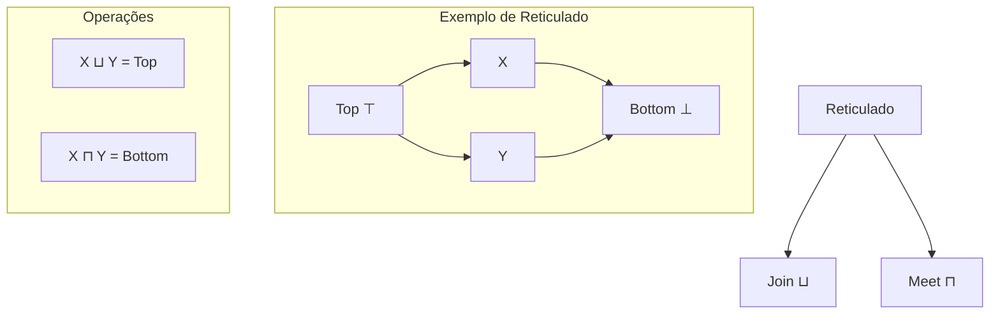
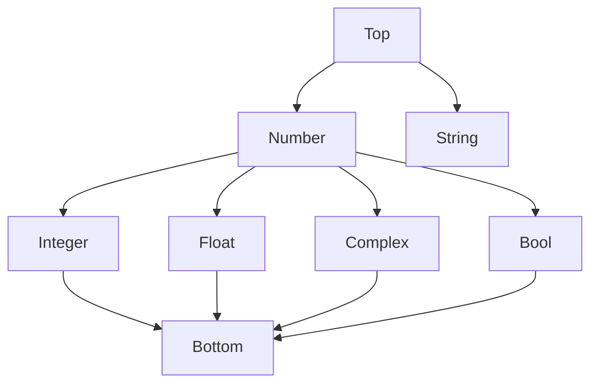
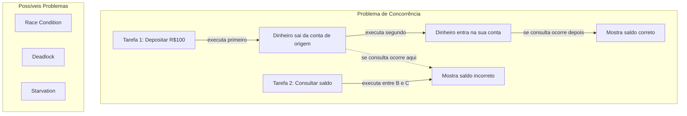

+++
title = "Análise de código estático"
description = "Deep Dive"
date = 2025-03-21T19:00:00-00:00
tags = ["OOP","software","engineering", "Clojure"]
draft = true
weight = 6
author = "Vitor Lobo Ramos"
+++

# Análise Estática de Código: Entendendo seu Programa sem Executá-lo

Muitos mecanismos que ocorrem naturalmente em nosso dia-a-dia no desenvolvimento de software, muitas vezes, não são devidamente apreciados e nem mesmo conhecidos. Ações das quais parecem mágicas, mas que na verdade são resultado de um grande esforço de muitas pessoas ao longo de décadas. 

Como quando você abre uma IDE e tem à sua disposição ferramentas que parecem mágicas como [intelisense](https://en.wikipedia.org/wiki/Intelligent_code_completion), [autocompletion](https://en.wikipedia.org/wiki/Autocompletion), [dumping de variáveis](https://en.wikipedia.org/wiki/Variable_dumping) e [palavras reservadas](https://en.wikipedia.org/wiki/Reserved_word) de cada linguagem de programação, entre outras. Neste artigo, vou compartilhar um pouco do que eu aprendi e ainda estou aprendendo sobre análise estática de código com o intuito de ajudar você a entender um pouco mais sobre como esses mecanismos funcionam.


Já pensou se existisse um super-poder que permitisse saber o que seu código vai fazer sem nem precisar rodar ele? Pois é, a análise estática é exatamente isso! Ela funciona como um detetive que examina seu código linha por linha, tentando prever todos os caminhos que ele pode seguir quando estiver rodando de verdade. É como se você pudesse "ler a mente" do seu programa só olhando pra ele e sem overhead de testes, processamento e etc... 

É como se você pudesse dar uma olhada na receita de um bolo e já saber se vai ficar gostoso ou se vai desandar, tudo isso sem precisar ligar o forno! Diferente dos testes tradicionais (onde você roda o código com alguns exemplos específicos), a análise estática "tenta imaginar" TODOS os caminhos possíveis que seu código pode seguir.

> "A análise estática é como um detetive que examina seu código linha por linha, tentando prever todos os caminhos que ele pode seguir quando estiver rodando de verdade."

Claro que essa "mágica" tem seus truques e limitações. Às vezes ela pode te encher de avisos sobre problemas que nem existem, ou deixar passar alguns bugs bem na sua cara. Mas mesmo assim, é uma ferramenta poderosa que pode salvar seu dia, seu código e projeto como um todo. A análise estática sempre fica nesse dilema entre [(soundness)](https://en.wikipedia.org/wiki/Soundness) e [(precision)](https://en.wikipedia.org/wiki/Precision_(statistics)). 

Ser soundness significa que a análise estática não vai deixar passar nenhum bug, mas pode te encher de alertas falsos. E ser preciso, significa que a análise estática só te avisa de problemas reais, mas pode deixar passar alguns bugs.


Na vida real, as ferramentas de análise estática escolhem um lado desse espectro dependendo do que elas querem fazer. Algumas preferem pegar todas as vulnerabilidades de segurança possíveis, mesmo que isso signifique alguns alarmes falsos. Outras preferem te incomodar menos, mesmo que isso signifique deixar passar alguns probleminhas.

## Sumário

- [Por que a análise estática é importante](#por-que-a-análise-estática-é-importante)
- [Entendendo o protocolo LSP](#entendendo-o-protocolo-lsp)
- [Caçando bugs comuns](#caçando-bugs-comuns)
  - [Exemplo Prático: Detecção de Erros em Clojure](#exemplo-prático-detecção-de-erros-em-clojure)
- [Reticulados: os organizadores da bagunça](#reticulados-os-organizadores-da-bagunça)
  - [Exemplo: Reticulado de Tipos](#exemplo-reticulado-de-tipos-ou-a-família-dos-tipos)
- [Análise de Tipos](#análise-de-tipos-o-sherlock-holmes-do-seu-código)
- [Análise de Ponteiros e Alias](#análise-de-ponteiros-e-alias-quem-está-apontando-pra-quem)
  - [Diferentes Abordagens de Investigação](#os-três-detetives-do-caso)
  - [Sensibilidade ao Fluxo](#o-super-poder-da-sensibilidade-ao-fluxo)
  - [Análise de Null Pointers](#analisando-o-perigo-dos-nulls-o-detetive-anti-crash)
  - [Análise Interprocedural](#quando-funções-entram-na-jogada)
- [Interpretação Abstrata](#interpretação-abstrata-a-arte-de-simplificar-sem-perder-a-essência)
  - [Análise de Intervalos](#análise-de-intervalos-descobrindo-os-valores-secretos-das-variáveis)
  - [Operadores Especiais: Widening e Narrowing](#operadores-especiais-widening-e-narrowing)
- [Análise de Concorrência](#análise-de-concorrência)
- [Representações de Programa](#representações-de-programa)
  - [Árvore Sintática Abstrata (AST)](#árvore-sintática-abstrata-ast-o-esqueleto-do-código)
  - [Grafo de Fluxo de Controle (CFG)](#grafo-de-fluxo-de-controle-cfg-o-mapa-da-execução)
- [Técnicas Avançadas](#técnicas-avançadas)
  - [Sensibilidade de Contexto](#sensibilidade-de-contexto-entendendo-o-de-onde-veio)
  - [Algoritmos de Ponto Fixo](#algoritmos-de-ponto-fixo-deixa-comigo-que-eu-resolvo-rápido)
  - [Imutabilidade](#imutabilidade-a-arma-secreta-contra-bugs-cabeludos)
  - [Modelos de Atores e Análise de Mensagens](#modelos-de-atores-e-análise-de-mensagens-cada-um-no-seu-quadrado-e-se-falando)
- [Otimização e Desempenho](#otimização-e-desempenho)
  - [Casos Especiais e Otimizações](#casos-especiais-e-otimizações-a-vida-como-ela-é-e-como-deixar-ela-mais-rápida)
  - [Como os "Mestres" Fazem](#como-os-mestres-fazem-compiladores-reais)
  - [Desempenho de Analisadores Estáticos](#desempenho-de-analisadores-estáticos-por-que-uns-são-tão-rápidos-e-outros-tão)
- [Perspectivas Futuras](#perspectivas-futuras)
  - [Desafios e Fronteiras](#desafios-e-fronteiras)
  - [O Futuro da Análise Estática](#o-futuro-da-análise-estática)
- [Considerações Finais](#considerações-finais)

---

## Por que a análise estática é importante

A análise estática tem uma história e tanto que começou lá no finalzinho dos anos 1950, quando o [John Backus e sua turma criaram o primeiro compilador FORTRAN](https://en.wikipedia.org/wiki/John_Backus). Backus, junto com o [Peter Naur](https://en.wikipedia.org/wiki/Peter_Naur), bolou um jeito de formalizar a sintaxe das linguagens de programação com a tal da [BNF (Backus-Naur Form)](https://en.wikipedia.org/wiki/Backus%E2%80%93Naur_form), que virou peça-chave pra análise sintática.


Na área de verificação de programas, o [Robert W. Floyd](https://en.wikipedia.org/wiki/Robert_W._Floyd) soltou em 1967 um trabalho muito bom chamado ["Assigning Meanings to Programs"](https://en.wikipedia.org/wiki/Assigning_Meanings_to_Programs), que abriu caminho pro que a gente conhece hoje como [lógica de Hoare](https://en.wikipedia.org/wiki/Hoare_logic). Floyd teve a sacada de usar invariantes de loop e asserções pra provar que os programas faziam o que deviam. O Naur também meteu o bedelho nessa área, batendo na tecla de que especificações claras e métodos na régua eram essenciais pra validar programas.

Nos anos 1970, o [Stephen Cook](https://en.wikipedia.org/wiki/Stephen_Cook) e outros caras começaram a dar uma cara mais formal pros fundamentos teóricos da computabilidade ligados à análise estática. Aí em 1977 veio a virada de jogo: [Patrick Cousot e Radhia Cousot](https://en.wikipedia.org/wiki/Patrick_Cousot) apresentaram a teoria da [interpretação abstrata](https://en.wikipedia.org/wiki/Abstract_interpretation), que virou um dos pilares da análise estática moderna. 

> "Essa teoria deu um jeito de explicar matematicamente como representar e calcular aproximações seguras do comportamento dos programas, o que abriu as portas pra ferramentas de análise mais precisas e versáteis. De lá pra cá, a análise estática evoluiu pra caramba em várias frentes que impactam direto o desenvolvimento de software."

Na parte de otimização de código, os compiladores usam análise estática pra entender a fundo o comportamento do programa e gerar um código mais enxuto. Eles identificam [código morto que pode ser jogado fora](https://en.wikipedia.org/wiki/Dead_code_elimination), sacam [expressões dentro de loops que sempre dão no mesmo](https://en.wikipedia.org/wiki/Loop_invariant_code_motion) (aí dá pra calcular só uma vez fora do loop), descobrem se valores de variáveis dependem do que o usuário digita (se não dependerem, dá pra calcular na hora de compilar), e estimam os valores mínimos e máximos que as variáveis podem ter (ajudando a escolher tipos de dados que economizam memória).

Além disso, os compiladores analisam se funções podem mexer nas mesmas estruturas de dados ao mesmo tempo sem dar rolo, o que permite [paralelização](https://en.wikipedia.org/wiki/Parallel_computing). Um exemplo clássico de otimização é quando juntamos a movimentação de código invariante com transformação de loop. Dá uma olhada nessa função que calcula áreas de círculos:

```clojure
(defn calcular-areas [raios]
    (loop [resultado []
           restantes raios]
        (if (empty? restantes)
            resultado
            (let [r (first restantes)
                  pi 3.14159       ;; pi é calculado em cada iteração!
                  area (* pi r r)]
                (recur (conj resultado area) (rest restantes))))))
```

O compilador faz duas mágicas bem legais aqui:

1. Primeiro, ele saca que o valor de `π` não muda dentro do loop, então ele tira isso de lá e calcula só uma vez
2. Depois, ele percebe que dá pra substituir todo aquele trampo de loop por um simples `map` que faz a mesma coisa

> Para quem não está tão familiarizado com matemática (como eu), o `π` aqui é uma constante que vale aproximadamente 3.14159. Ou seja, o código original faz o mesmo cálculo de área de círculo várias vezes, enquanto o otimizado faz só uma vez. Na prática, isso é uma enorme diferença, porque o cálculo de `π` é um pouco demorado. 

Depois da otimização (aplicando a técnica de [remoção de código invariante de loop](https://en.wikipedia.org/wiki/Loop_invariant_code_motion)), o código fica assim:

```clojure
(defn calcular-areas [raios]
    (let [pi 3.14159]   ;; pi é calculado apenas uma vez
        (map (fn [r] (* pi r r)) raios)))  ;; Loop substituído por map
```

Esta transformação não só elimina o recálculo de valores constantes, mas também troca aquele loop manual por uma operação mais elegante que o compilador consegue otimizar melhor e, quem sabe, até rodar em paralelo. Interessante, não? Vamos expandir um pouco mais olhando para alguns bugs e problemas comuns que podem ser detectados pela análise estática.

---

## Entendendo o protocolo LSP no contexto de análise estática

Vamos entender o que é o LSP e como ele se relaciona com a análise estática. O LSP (Language Server Protocol) é basicamente um meio de comunicação entre seu editor de texto e as ferramentas que analisam seu código.

É graças a esse protocolo que seu editor consegue oferecer dicas enquanto você digita, destacar erros e fazer refatorações de forma simples. Mas como isso realmente funciona?

Vamos usar como exemplo o servidor LSP da linguagem Lua, que é relativamente simples de entender:

1. Primeiro, ele transforma seu código em uma estrutura organizada chamada AST (Árvore de Sintaxe Abstrata):

```lua
local texto = "function soma(a, b) return a + b end"
local ast = parser.parse(texto)
```

Essa árvore consegue identificar os elementos importantes do seu código:
- Declarações de funções e variáveis
- Operações realizadas (como soma, multiplicação)
- Estruturas de controle (if, while, for)
- Escopos das variáveis

Depois de criar essa árvore, o servidor de Lua começa a analisar o código:

**1. Rastreando tipos (mesmo em uma linguagem dinâmica):**
```lua
local x = "texto"   -- O servidor identifica que x é uma string
x = 42              -- Agora x passou a ser um número
```

**2. Identificando símbolos:**
```lua
local function foo() end
foo() -- O servidor reconhece que este foo é aquela função local
```

**3. Detectando código que nunca será executado:**
```lua
function algo()
  return 42
  print("Nunca executado") -- Este código nunca será alcançado
end
```

Uma funcionalidade útil é que você pode ajudar o servidor usando comentários especiais:

```lua
---@param raio number O raio do círculo
---@return number A área do círculo
function calcularArea(raio)
  return 3.14159 * raio * raio
end

calcularArea("dois") -- Erro: esperava número, recebeu string
```

Existem vários tipos de comentários que você pode usar:

- `---@param nome tipo descrição` - Especifica o tipo do parâmetro
- `---@return tipo descrição` - Indica o tipo de retorno
- `---@type tipo` - Define o tipo de uma variável
- `---@class nome` - Cria um tipo estruturado
- `---@field nome tipo` - Define um campo em uma classe

Para manter a velocidade em projetos grandes, o servidor implementa otimizações:

1. **Indexação inteligente**: Só reanálisa os arquivos que foram modificados
2. **Análise seletiva**: Examina apenas as partes do código necessárias
3. **Cache eficiente**: Guarda resultados anteriores para consulta rápida

Com essa análise, o servidor consegue identificar vários problemas no código:

1. **Incompatibilidade de tipos**: Uso incorreto de tipos de dados
2. **Variáveis não utilizadas**: Variáveis declaradas que nunca são usadas
3. **Variáveis não declaradas**: Uso de variáveis que não foram definidas
4. **Parâmetros ausentes**: Chamadas de função com parâmetros faltando

No fim, essa análise permite que o LSP transforme um simples editor de texto em um ambiente de desenvolvimento completo, mesmo para linguagens dinâmicas como Lua, sem precisar executar o código.

---

## Caçando Bugs Comuns

Os tipos de problemas detectados variam de acordo com a linguagem de programação utilizada e a natureza específica da sua aplicação. Em linguagens como C e C++, onde você precisa gerenciar memória na mão, a análise estática ajuda a encontrar [vazamentos de memória](https://en.wikipedia.org/wiki/Memory_leak) (quando você esquece de liberar memória), [uso-após-liberação](https://en.wikipedia.org/wiki/Use-after-free) (quando você tenta usar memória que já foi liberada), e [ponteiros nulos](https://en.wikipedia.org/wiki/Null_pointer) (quando você tenta acessar o endereço zero).  

## Reticulados: Os Organizadores da Bagunça!


Imagine que você está tentando arrumar seu quarto cheio de coisas espalhadas. Um [**reticulado**](https://en.wikipedia.org/wiki/Lattice_(order)) é como aquela estante perfeita onde tudo tem seu lugar e você sempre consegue encontrar o que precisa. No mundo da matemática, um reticulado é uma estrutura que organiza elementos em uma ordem parcial, com duas operações especiais:

1. **Join (⊔)** ou **supremo**: Para quaisquer dois elementos, encontra o "menor elemento maior que ambos"
2. **Meet (⊓)** ou **ínfimo**: Para quaisquer dois elementos, encontra o "maior elemento menor que ambos"



O gráfico acima ilustra um reticulado simples com quatro elementos: `Top (⊤)`, `Bottom (⊥)`, `X` e `Y`. As setas indicam a relação de ordem entre os elementos (de baixo para cima). O `Top` é o elemento máximo, enquanto o `Bottom` é o elemento mínimo. `X` e `Y` são elementos intermediários que não têm relação de ordem entre si. O diagrama também mostra as operações fundamentais:

- O **join (⊔)** de X e Y resulta em Top, pois é o menor elemento que está acima de ambos
- O **meet (⊓)** de X e Y resulta em Bottom, pois é o maior elemento que está abaixo de ambos

Para entender melhor, pense em uma árvore genealógica:
- O **join** seria como encontrar o ancestral comum mais próximo de duas pessoas
- O **meet** seria como encontrar o descendente comum mais próximo de duas pessoas (se existir)

> O reticulado é uma forma de representar as relações de ordem entre os elementos de um conjunto. No caso da análise estática, ele representa as relações de ordem entre os possíveis valores que uma expressão pode ter.

Você pode estar pensando: "Reticulados? Isso parece matemática avançada que nunca vou usar no meu dia-a-dia como desenvolvedor!" 


Esse é um equívoco comum! Na verdade, você provavelmente já usa reticulados sem perceber. Quando trabalha com sistemas de tipos em linguagens como [TypeScript](https://www.typescriptlang.org/), [Rust](https://www.rust-lang.org/) ou [Haskell](https://www.haskell.org/), está navegando por um reticulado de tipos. 

Quando usa análise estática em seu IDE que detecta bugs potenciais antes mesmo de executar o código, há reticulados trabalhando nos bastidores. Até mesmo quando usa um [linter que sugere melhorias no seu código](https://en.wikipedia.org/wiki/Lint_(software)), ele está aplicando conceitos baseados em reticulados para analisar o fluxo de dados. Esses conceitos matemáticos, embora pareçam abstratos, são a fundação invisível que torna possíveis muitas das ferramentas que facilitam nosso trabalho diário como desenvolvedores.

---

### Exemplo: Reticulado de Tipos (ou "A Família dos Tipos")

Vamos imaginar um reticulado simples que representa tipos em uma linguagem de programação. Ainda usando o exemplo da árvore genealógica, podemos representar os tipos como uma árvore genealógica dos tipos! No diagrama abaixo, a seta `A → B` significa "`A` é filho de `B`" (ou mais tecnicamente, "`A` é subtipo de `B`"):



Imagine que este diagrama é a **Grande Árvore Genealógica dos Tipos de Dados**! 

*   **`Top`:** É o tataravô de todos os tipos! Dele, *qualquer* tipo de valor pode descender. É tipo aquele ancestral mítico que deu origem a toda a família.
*   **`Bottom`:** É aquele galho da árvore que não deu em nada... Um tipo que não tem valor nenhum. Coitado, não vingou. 
*   **`Number`:** É um ramo importante da família, que gerou todos os tipos numéricos.
*   **`String`:** Outro ramo importante, responsável por todos os tipos de texto.
*   **`Integer`:** São os descendentes de `Number` que só trabalham com números inteiros, sem casas decimais. Uma linhagem tradicional!
*   **`Float`:** Também descendem de `Number`, mas são mais flexíveis, aceitando números com vírgula.
*    **`Complex`:** Descendem de Number, números complexos.
*    **`Bool`:** Só tem dois valores: true (verdadeiro) ou false (falso).
*   **Setas (→):** Mostram a relação de parentesco, quem descende de quem. "Filho de", "Neto de"...

**E como essa árvore genealógica nos ajuda?** 🤔

Quando o seu programa está analisando os tipos de dados (especialmente em expressões), ele usa essa árvore para entender as relações de parentesco e descobrir o tipo resultante. Vamos analisar a expressão: `if faz_sol then 42 else 3.1415`

*   `42` é um `Integer` (Inteiro Puro).
*   `3.1415` é um `Float` (Decimal Liberal).

O programa olha na árvore genealógica e se pergunta: "Quem é o ancestral comum mais próximo entre `Integer` e `Float`?". A resposta é `Number`!

Portanto, o tipo dessa expressão toda será `Number`. Afinal, o resultado pode ser um número inteiro ou decimal, dependendo do clima.

> Essa árvore genealógica é uma maneira divertida de visualizar como os tipos se relacionam. Ajuda o programa (e a nós!) a entender a "família" dos tipos e a descobrir qual o tipo final de uma expressão, de um jeito bem mais claro e intuitivo, menos pesado.

---

## Análise de Tipos: O Sherlock Holmes do Seu Código

Já pensou como seria mandar mensagem de texto para um número de telefone... que na verdade é uma data de nascimento? Ou tentar somar seu nome com seu sobrenome e esperar um resultado numérico? Pois é, não faz sentido, né? 🤔 A análise estática aqui é como ter um fiscal super atento olhando por cima do seu ombro enquanto você programa, gritando "EEEEPA!" toda vez que você tenta fazer algo maluco com os tipos errados. Tipo quando você tenta:

* Dividir uma string por um booleano? 
* Ordenar alfabeticamente um conjunto de números? 
* Calcular a média de um array de emojis? 

A análise de tipos é aquela amiga sincerona que te diz: "Vem, vem, vem, vem ver a merda que você tá fazendo! UHAuhuaHHaa"

### Como Ela Funciona?

1. **Coleta as Pistas**: Primeiro, ela vasculha seu código todo pegando informações sobre cada variável, expressão e função.
2. **Deduz os Tipos**: Com base nessa investigação, ela consegue "adivinhar" qual o tipo de cada coisinha no seu código.
3. **Cruza as Informações**: Usando nossa árvore genealógica dos tipos (lembra dela?), verifica se todas as operações fazem sentido.
4. **Apresenta o Relatório**: "Temos um problema na linha 42! Você está tentando casar um Integer com uma String! Eles nem se conhecem direito!"

### Linguagens Tipadas e Não-Tipadas: Primos Diferentes 

* **Linguagens com Tipagem Estática** (como Java, TypeScript, Rust): São aquelas certinhas que checam tudo antes mesmo de você rodar o código. É tipo sua mãe verificando se você está com casaco antes de sair de casa. "Tem certeza que essa variável é um número? Deixa eu ver isso direito!"
* **Linguagens com Tipagem Dinâmica** (como JavaScript, Python, Ruby): São mais "relaxadas", elas deixam você tentar quase tudo e só reclamam quando dá problema durante a execução. É aquele amigo que diz "Vai lá, tenta, o que pode dar errado?" e depois diz "Eita, não sabia que ia explodir!"

### Por Que Isso É TÃO Legal? 

1. **Bugs? Que Bugs?** - Encontra VÁRIOS problemas antes mesmo de você rodar o programa! É como ter um detector de fumaça que avisa antes do incêndio começar.
2. **Documentação Automática** - Quando você sabe os tipos, entende muito melhor o código. É como ter pequenas placas explicativas em cada pedacinho do seu programa.
3. **Refatoração Sem Medo** - Quer mudar aquela função gigante? A análise de tipos vai te avisar exatamente onde você esqueceu de atualizar alguma coisa!
4. **IDEs Mais Inteligentes** - É por isso que seu editor consegue fazer sugestões tão boas! Ele sabe o tipo de cada variável e pode te mostrar só os métodos que fazem sentido.
Imagine que você tem um joguinho simples:

```javascript
function calcularPontuação(acertos, tempo, dificuldade) {
    // Aqui a mágica acontece
    return acertos * 100 - tempo + (dificuldade === "difícil" ? 500 : 0);
}
```

O analisador de tipos olha para isso e pensa:
* `acertos` está sendo multiplicado, então deve ser um número
* `tempo` está sendo subtraído, também deve ser um número
* `dificuldade` está sendo comparado com uma string, então deve ser uma string!

Se em algum lugar do código você chamar:

```javascript
calcularPontuação("muitos", 30, 5)
```
O analisador levanta a mão e diz: "Peraí! 'muitos' não é um número e 5 não é uma string... Isso vai dar ruim!"

### A Mágica da Inferência de Tipos 

Uma das coisas mais legais da análise de tipos é que, em muitas linguagens modernas, você nem precisa declarar os tipos explicitamente! O sistema é tão esperto que consegue deduzir os tipos baseado em como você usa as variáveis. É como se ele lesse sua mente programadora!

```typescript
// Você escreve só isso
let mensagem = "Olá, mundo!";
let contador = 42;

// E o analisador entende que:
// mensagem: string
// contador: number
```

A análise de tipos está ficando cada vez mais poderosa! Hoje já temos:

* **Tipos Graduais**: Permite misturar código com e sem tipos declarados
* **Tipos Refinados**: Permite especificar mais detalhes (como "número positivo" em vez de apenas "número")
* **Análise de Fluxo de Tipos**: Entende quando o tipo pode mudar durante a execução

No fim das contas, a análise de tipos é como um super-poder que transforma você de um programador comum em um programador com raio-X, capaz de ver problemas invisíveis e construir código mais robusto!

> E lembre-se: um bug encontrado durante a análise de tipos é um bug que nunca chegará ao seu usuário. E isso não tem preço! 

---

## Análise de Ponteiros e Alias: Quem Está Apontando pra Quem?!

Imagine só: você mexe numa variável aqui e, **PIMBA!**, outra variável lá do outro lado do código também mudou! Como assim?! Parece bruxaria, mas é só o fascinante mundo dos **ponteiros e aliases** - aquela parte da programação que faz até veteranos coçarem a cabeça!

Por exemplo, o caso dos gêmeos idênticos: Quando Dois São Um:

```javascript
let a = { saldo: 1000 };
let b = a;  // Agora b e a são como gêmeos idênticos!

b.saldo -= 500;  // "Vou só tirar um dinheirinho daqui..."
console.log(a.saldo);  // SURPRESA! Seu saldo também caiu! 😱
```

É tipo você fazer uma dieta e seu irmão gêmeo também emagrecer sem fazer nada. Injusto, né? Mas é exatamente assim que aliases funcionam! Duas variáveis, mesma memória, mesma dor de cabeça. Mas por que isso é um problemão? 

Já pensou se seu cartão de crédito fosse, secretamente, um alias do cartão do seu chefe? Você compra um cafezinho, e o chefe recebe a fatura do seu PlayStation 5! Na programação isso causa:

* **Bugs Ninja**: Aparecem do nada e somem quando você tenta encontrá-los
* **Funções Traiçoeiras**: Chamou uma função inocente e ela alterou dados que nem estavam nos parâmetros!
* **Concorrência Caótica**: Duas threads brigando pelo mesmo dado como crianças pelo controle da TV
* **Memória Zumbi**: Dados que deveriam ter morrido mas continuam assombrando seu programa

### Entrando na Cena do Crime: A Análise de Ponteiros 🔍

Nosso super-herói, o **Analisador de Ponteiros**, chega para salvar o dia! Sua missão? Descobrir para onde cada variável PODE apontar antes mesmo do programa rodar!

#### Os Três Detetives do Caso 🕴️

1. **Detetive "Lugar do Crime"** (Abstração de Locais de Alocação)
   
   Este detetive é rápido mas meio preguiçoso. Ele olha só ONDE o objeto foi criado, não QUANDO ou COMO.
   
   ```python
   # O detetive diz: "São todos o mesmo cara com disfarces diferentes!"
   for dia in range(365):
       presente = CriarPresente()  # 365 presentes? Não! É O MESMO presente!
   ```

2. **Detetive Andersen** (O Meticuloso) 
   
   Este cara é minucioso! Cria um dossiê para cada variável com todos os lugares para onde ela PODE apontar. É como se ele dissesse: "Se João conhece Maria, e Maria conhece Pedro, então João PODE conhecer Pedro indiretamente!"
   
   ```
   a = b    →    "Tudo que b conhece, a também conhece"
   *a = b   →    "Tudo que b conhece, *a também conhece"
   a = *b   →    "Tudo que *b conhece, a também conhece"
   ```

   > Apesar da brincadeira, [Andersen se refere a um algoritmo de análise de ponteiros](https://en.wikipedia.org/wiki/Andersen%27s_algorithm).

3. **Detetive Steensgaard** (O Apressado)
   
   Este é o detetive que quer resolver tudo rapidinho! Ele cria "gangues de variáveis" - se a e b estão na mesma gangue, eles apontam para os mesmos lugares. É tipo dizer: "Vocês dois estavam no mesmo bar ontem? Então são cúmplices! Caso encerrado!"

   > Assim como Andersen, [Steensgaard se refere a um algoritmo de análise de ponteiros](https://en.wikipedia.org/wiki/Steensgaard%27s_algorithm).

A maioria das análises são "cegas ao tempo" - não importa a ORDEM das operações. Mas e se tivéssemos um detetive com o poder de ver a LINHA DO TEMPO do crime? Se liga no exemplo:

```javascript
let conta1 = { nome: "Poupança", saldo: 1000 };
let conta2 = { nome: "Corrente", saldo: 100 };
let contaAtiva;

if (éDiaUtil()) {
    contaAtiva = conta1;  // Durante a semana, uso a conta1
} else {
    contaAtiva = conta2;  // No fim de semana, uso a conta2
}

// O detetive comum diz: "contaAtiva pode ser conta1 OU conta2 "
// O detetive sensível ao fluxo diz: "contaAtiva é conta1 em dias úteis, 
// e conta2 nos outros dias!"
```

O código acima é um exemplo de um programa que usa um alias para contas bancárias. O detetive Andersen vai ver que `contaAtiva` pode ser `conta1` ou `conta2` dependendo do dia da semana. Já o detetive Steensgaard vai ver que `contaAtiva` é sempre `conta1` ou `conta2`, mas não pode ser ambos.

### Analisando o Perigo dos Nulls: O Detetive Anti-Crash

Já tomou aquele susto quando o app fecha do nada com [NullPointerException](https://en.wikipedia.org/wiki/NullPointerException), hein? Javeiro? É como pisar num buraco que você não viu! Exemplo:

```java
void métodoPerigoso(Objeto obj) {
    return obj.propriedade;  // PERIGO! E se obj for null? 💣
}
```

O analisador de null pointers é como um cão-guia que late antes de você pisar no buraco! Ele identifica todos os pontos onde você PODE estar tentando usar algo que não existe. No caso do Java, caso tenha o [checkstyle configurado](https://checkstyle.sourceforge.io/), ele vai te avisar que você está usando um método de um objeto que pode ser null.

### Quando Funções Entram na Jogada

Com funções, o jogo fica ainda mais interessante:

    ```javascript
function processarPagamento(handler) {
    // handler pode ser qualquer função! Quem será o misterioso executor?
    let resultado = handler();
    return resultado;
}

// Em um lugar do código:
processarPagamento(confirmarCompra);
// Em outro lugar:
processarPagamento(cancelarCompra);
```

A análise interprocedural de ponteiros é como um detetive perseguindo um criminoso que muda de disfarce em cada cena do filme. A análise de ponteiros é como aquele segurança discreto da balada - você nem percebe que ele está lá, mas ele evita MUITA confusão! Cada vez que seu IDE diz:

* "Esta variável pode ser null aqui"
* "Possível condição de corrida detectada"
* "Possível vazamento de memória"

Agradeça à equipe de detetives de ponteiros que estão trabalhando nos bastidores para salvar seu código (e sua sanidade)!

---

## Operadores Especiais: Widening e Narrowing

A Interpretação Abstrata é esperta, mas, às vezes, ela pode ser **lenta** para chegar a uma conclusão, especialmente quando o programa tem **loops** ou **recursão** (funções que chamam a si mesmas). Para resolver isso, ela usa dois truques:

1.  **Widening (∇):** É como dar um "salto" na análise. Em vez de ir passo a passo, o **widening** "chuta" um valor maior e mais abrangente. Pense assim: se os valores de uma variável estão crescendo (1, 2, 3...), o **widening** pode dizer "Ah, vai para infinito logo!".
    *   Exemplo:  `[0, 3] ∇ [0, 4] = [0, ∞)` (Percebeu o crescimento? Vai para infinito!)
    *   **Vantagem:** A análise termina **muito** mais rápido.
    *   **Desvantagem:** Perde um pouco de precisão (afinal, é um "chute").

2.  **Narrowing (∆):** É como um "ajuste fino" depois do **widening**. Ele tenta recuperar um pouco da precisão perdida, usando informações extras.
    *   Exemplo: `[0, ∞) ∆ [0, 10] = [0, 10]` (Sabemos que o valor máximo é 10, então ajustamos o intervalo).
    *   **Vantagem:** Melhora a precisão do resultado final.
    *   **Desvantagem:** Precisa de informações adicionais.

**Onde a Interpretação Abstrata Brilha?**

A teoria por trás da Interpretação Abstrata (reticulados e tal) é a base de **muitas** ferramentas de análise de código que usamos hoje em dia. Por exemplo:

1.  **Análise de Fluxo de Dados:**  Descobre quais variáveis estão "vivas" (sendo usadas) em cada ponto do código, quais valores elas podem ter, etc.
2.  **Análise de Ponteiros:**  Rastreia para onde as variáveis que apontam para outras variáveis (os "ponteiros") estão apontando.
3.  **Análise de Tipos:**  Verifica se os tipos das variáveis (número, texto, etc.) estão sendo usados corretamente.
4.  **Verificação de Propriedades:**  Confere se o programa segue certas regras (por exemplo, "uma variável nunca deve ser nula depois de inicializada").

**"Traduzindo" o Programa: Domínios Abstratos**

Para fazer a análise, a Interpretação Abstrata precisa de um "dicionário" que traduza o mundo real do programa (cheio de detalhes) para um mundo mais simples (abstrato). Esse "dicionário" é chamado de [**Domínio Abstrato**](https://en.wikipedia.org/wiki/Domain_(mathematics)). Cada domínio abstrato foca em um tipo de informação:

| Domínio Abstrato     | O que ele "enxerga"                                      | Exemplo                                         |
| :------------------- | :------------------------------------------------------- | :---------------------------------------------- |
| Constantes          | Valores exatos que a gente já sabe antes de rodar o programa | `x = 5`  →  O analisador sabe que `x` é 5.     |
| Intervalos          | Os valores mínimo e máximo de uma variável               | `for (i=0; i<10; i++)`  →  `i` está entre 0 e 9. |
| Sinais              | Se um número é positivo, negativo ou zero               | `x > 0`  →  `x` é positivo.                      |
| Poliédros           | Relações *lineares* entre variáveis (tipo equações)       | `i <= j <= n`  → Desenha uma forma geométrica.   |
| Conjuntos de Strings | Os possíveis textos que uma variável pode ter           | `s` pode ser `"http:"` ou `"https:"`.           |

A escolha do domínio abstrato é como escolher a ferramenta certa para o trabalho:

*   **Mais Simples (ex: Sinais):** Rápido, mas menos detalhado.
*   **Mais Complexo (ex: Poliédros):** Mais detalhado, mas mais lento.

Vamos ver como a Interpretação Abstrata pode encontrar variáveis que podem ser `null` (vazias) em Java, o que pode causar erros:

```java
String processarTexto(String texto) {
    String resultado = null;
    if (texto != null) {
        resultado = texto.toUpperCase();
        if (texto.length() > 10) {
            resultado = resultado.substring(0, 10);
        }
    }
    return resultado;  // ⚠️ Pode ser null!
}
```

Usamos um domínio abstrato simples:

*   **NN (Not Null):** Com certeza *não* é `null`.
*   **MN (Maybe Null):** *Pode* ser `null` ou não.
*   **DN (Definitely Null):** Com certeza *é* `null`.

A análise seria assim:

1.  `texto` começa como `MN` (porque pode ser `null` quando a função é chamada).
2.  Dentro do primeiro `if`, `texto` vira `NN` (porque a gente *checou* se ele não era `null`).
3.  `resultado` começa como `DN` (porque foi inicializado com `null`).
4.  Depois da atribuição (`resultado = texto.toUpperCase()`), `resultado` vira `NN`.
5.  No `return`, `resultado` é `MN` (porque se o primeiro `if` não for executado, `resultado` continua `null`).

O analisador daria um aviso: "Cuidado! A variável `resultado` pode ser `null` quando você retorna ela!".

A Interpretação Abstrata, com seus [reticulados](https://en.wikipedia.org/wiki/Lattice_(order_theory)), [**widening**](https://en.wikipedia.org/wiki/Widening_(abstract_interpretation)) e [**narrowing**](https://en.wikipedia.org/wiki/Narrowing_(abstract_interpretation)), e [domínios abstratos](https://en.wikipedia.org/wiki/Domain_(mathematics)), é uma técnica poderosa para analisar programas. Ela permite que ferramentas encontrem erros e otimizem o código **antes** de ele ser executado, tornando a programação bem mais interessante!

---

## Análise de Concorrência

Até agora, focamos em [programas **sequenciais**](https://pt.wikipedia.org/wiki/Programa_sequencial), onde as instruções são executadas uma após a outra, em ordem. Mas, no mundo moderno, muitos programas são [**concorrentes**](https://pt.wikipedia.org/wiki/Concorrência_(informática)), eles executam várias tarefas "ao mesmo tempo" (ou, pelo menos, dando a **impressão** de que estão fazendo isso). Isso traz novos desafios para a análise estática. Imagine que você tem duas tarefas:

*   **Tarefa 1:** Depositar R$100 na sua conta.
*   **Tarefa 2:** Consultar o saldo da sua conta.

Se essas tarefas forem executadas sequencialmente (primeiro o depósito, depois a consulta, ou vice-versa), tudo bem. Mas, e se elas forem executadas **concorrentemente**?

* **Problema:** Se a consulta acontecer **entre** o momento em que o dinheiro saiu da conta de origem e o momento em que ele entrou na sua conta, o saldo pode mostrar um valor **incorreto** (menor do que o real). Isso é só um exemplo simples. Em programas concorrentes, podem acontecer **muitos** problemas sutis e difíceis de detectar, como:

*   **Condições de Corrida [(Race Conditions)](https://pt.wikipedia.org/wiki/Condição_de_corrida):** Quando o resultado do programa depende da ordem **exata** em que as tarefas concorrentes são executadas (como no exemplo do depósito).
*   [**Deadlocks**](https://pt.wikipedia.org/wiki/Deadlock): Quando duas ou mais tarefas ficam "travadas", esperando umas pelas outras para liberar recursos (tipo, cada uma esperando que a outra termine de usar o banheiro 🚽).
*   [**Starvation**](https://pt.wikipedia.org/wiki/Starvation_(informática)): Quando uma tarefa nunca consegue os recursos de que precisa para executar (tipo, ficar sempre em último na fila).



O gráfico acima ilustra um problema clássico de concorrência: uma [race condition](https://pt.wikipedia.org/wiki/Condição_de_corrida) durante uma operação de depósito bancário. Ele mostra como a Tarefa 1 (depositar R$100) tem duas etapas: primeiro o dinheiro sai da conta de origem e depois entra na conta de destino. 

Se a Tarefa 2 (consultar saldo) for executada exatamente entre essas duas etapas, o usuário verá um saldo incorreto. O gráfico também destaca outros problemas comuns em programas concorrentes: [race conditions](https://pt.wikipedia.org/wiki/Condição_de_corrida), [deadlocks](https://pt.wikipedia.org/wiki/Deadlock) e [starvation](https://pt.wikipedia.org/wiki/Starvation_(informática)).

A Análise Estática de programas concorrentes tenta encontrar esses problemas **antes** de o programa ser executado, analisando o código-fonte. Isso é **muito** mais difícil do que analisar programas sequenciais, porque o número de possíveis **intercalações** (ordens em que as instruções de diferentes tarefas podem ser executadas) é **enorme** (e, muitas vezes, infinito!). Existem várias técnicas para análise de concorrência, cada uma com seus pontos fortes e fracos:

*   **Análise de Fluxo de Dados [(Dataflow Analysis)](https://en.wikipedia.org/wiki/Dataflow_analysis):**  Adapta as técnicas que vimos para programas sequenciais (como [Live Variables](https://en.wikipedia.org/wiki/Live_variable_analysis), [Reaching Definitions](https://en.wikipedia.org/wiki/Reaching_definition)) para o mundo concorrente.  É preciso levar em conta as possíveis **interferências** entre as tarefas.

*   **Análise Baseada em Tipos [(Type-Based Analysis)](https://en.wikipedia.org/wiki/Type_system):** Usa sistemas de tipos especiais para garantir que certas operações (como o acesso a variáveis compartilhadas) sejam feitas de forma segura.

*   [**Model Checking:**](https://en.wikipedia.org/wiki/Model_checking) Constrói um **modelo** do programa concorrente e explora **todos** os seus possíveis estados e transições, procurando por erros.  É uma técnica poderosa, mas pode ser computacionalmente cara.

*   **Análise Baseada em Grafos [(Graph-Based Analysis)](https://en.wikipedia.org/wiki/Graph_theory):** Representa o programa como um grafo e usa algoritmos de análise de grafos para detectar padrões que indicam problemas de concorrência (como ciclos, que podem indicar deadlocks).

*   **Análise de bloqueios [(lock analysis)](https://en.wikipedia.org/wiki/Lock_(computer_science)):** Verificando se os bloqueios (**locks**) são adquiridos e liberados corretamente.

Imagine um programa com duas threads (tarefas concorrentes):

```
Thread 1:      | Thread 2:
x = x + 1;     | x = x * 2;
```

Uma análise de fluxo de dados para concorrência poderia:

1.  **Representar o Estado:** Usar um domínio abstrato que rastreie os possíveis valores de `x` **e** as possíveis intercalações das threads.
2.  **Analisar as Instruções:**  Para cada instrução, considerar **todas** as possíveis intercalações com instruções de outras threads.
3.  **Detectar Condições de Corrida:**  Se houver duas operações em threads diferentes que acessam a mesma variável (`x`, neste caso) e pelo menos uma delas é uma escrita, há uma condição de corrida. O analisador emitiria um aviso.

A Análise de Concorrência é uma área de pesquisa ativa e desafiadora, mas **essencial** para garantir a correção e a confiabilidade de programas concorrentes.  As técnicas de análise estática para concorrência estão em constante evolução, tornando-se cada vez mais poderosas e capazes de lidar com a complexidade dos sistemas modernos.

---

## Comparação entre Andersen e Steensgaard


As análises de [Andersen e Steensgaard](https://en.wikipedia.org/wiki/Pointer_analysis) são como dois detetives investigando para onde as variáveis do tipo "ponteiro" (que guardam endereços de memória) estão apontando. A diferença crucial entre eles é como eles lidam com a **informação** sobre esses apontamentos:

*   **[Andersen](https://en.wikipedia.org/wiki/Andersen_analysis) (O Detetive Detalhista):** Mantém um registro **separado** para cada variável, anotando **todos** os lugares para onde ela **pode** estar apontando. É como ter uma ficha completa para cada suspeito.
*   **[Steensgaard](https://en.wikipedia.org/wiki/Steensgaard_analysis) (O Detetive Eficiente):** É mais "econômico" com a informação. Se duas variáveis podem apontar para os **mesmos** lugares, ele **junta** os registros delas em um só. É como ter uma única ficha para todos os suspeitos que têm o mesmo álibi.

Essa diferença tem um impacto grande na **precisão** da análise (o quão detalhada ela é) e na sua **eficiência** (o quão rápida ela é).

**O Caso do Código C:**

Vamos acompanhar o trabalho dos dois detetives neste código em C:

```c
int x, y;
int *p, *q;

p = &x;        // Andersen: pt(p) = {x}       | Steensgaard: pt(p) = {x}
p = &y;        // Andersen: pt(p) = {x,y}     | Steensgaard: pt(p) = {x,y}
q = p;         // Andersen: pt(q) = {x,y}     | Steensgaard: pt(q) = pt(p) = {x,y}

// Até aqui, ambos os detetives têm as mesmas informações.
```

*   `int x, y;`: Criamos duas variáveis inteiras, `x` e `y`.
*   `int *p, *q;`: Criamos dois ponteiros, `p` e `q`.
*   `p = &x;`: `p` agora aponta para `x`. Ambos os detetives anotam isso.
*   `p = &y;`: `p` agora aponta para `y`.
    *   **Andersen:** Atualiza a ficha de `p`: "Agora `p` pode apontar para `x` **ou** `y`."
    *   **Steensgaard:** Faz o mesmo: "Agora `p` pode apontar para `x` **ou** `y`."
*   `q = p;`: `q` agora aponta para onde `p` aponta.
    *   **Andersen:** Cria uma ficha para `q`: "`q` pode apontar para `x` **ou** `y`."
    *   **Steensgaard:** Pensa: "`q` aponta para os mesmos lugares que `p`, então vou usar a **mesma** ficha."

Até aqui, tudo igual. Mas, e agora?

```c
q = &x;        // Andersen: pt(q) = {x,y}     | Steensgaard: pt(p) = pt(q) = {x,y}
               // (Steensgaard unifica os conjuntos)
```

*   `q = &x;`: `q` agora aponta para `x`.
    *   **Andersen:** Atualiza a ficha de `q`: "`q` *ainda* pode apontar para `x` *ou* `y`" (ele não "esquece" o apontamento anterior).
    *   **Steensgaard:** Pensa: "Como `q` e `p` compartilham a mesma ficha, se eu mudar a ficha de `q`, tenho que mudar a de `p` também! Então, `p` e `q` agora podem apontar para `x` *ou* `y`."

Aí está a **perda de precisão** de Steensgaard! Ele "juntou" as informações de `p` e `q`, e agora não consegue mais dizer com certeza para onde **cada um** deles aponta.

```c
// Agora, se adicionarmos:
int *r = q;    // Andersen: pt(r) = {x,y}     | Steensgaard: pt(r) = pt(q) = pt(p) = {x,y}
p = &x;        // Andersen: pt(p) = {x,y}     | Steensgaard: pt(p) = pt(q) = pt(r) = {x,y}
```

*   `int *r = q;`: `r` agora aponta para onde `q` aponta.
    *   Andersen: pt(r) = {x, y}
    *   Steensgaard: pt(r) = pt(q) = pt(p) = {x, y}
* `p = &x`: p agora aponta para x;
    * Andersen: pt(p) = {x, y}
    * Steensgaard: pt(p) = pt(q) = pt(r) = {x, y}

**Consequências:**

Suponha que, em algum momento, a gente **saiba** que `p` só pode apontar para `x`.

*   **Andersen:**  Como ele tem fichas separadas, ele pode usar essa informação para fazer otimizações no código. Por exemplo, se tiver um `*p = 5;`, ele sabe que está escrevendo em `x`.
*   **Steensgaard:**  Como ele "misturou" as informações de `p`, `q` e `r`, ele **não** pode ter certeza se `*p` vai alterar `x` ou `y`. Ele perdeu a oportunidade de otimizar!

Ou seja... :

*   **Andersen:** Mais preciso, mas mais lento (mais fichas para preencher!).
*   **Steensgaard:** Mais rápido, mas menos preciso (junta informações, o que pode levar a conclusões erradas).

A escolha entre Andersen e Steensgaard é um **trade-off**: você prefere um detetive mais detalhista ou um detetive mais rápido? Depende do que você precisa!

---

## Sensibilidade de Contexto: Entendendo o "De Onde Veio"

Vamos continuar explorando sob a ótica do detetive. Imagine que você é um detetive e precisa analisar o comportamento de uma função em um programa. A **Sensibilidade de Contexto** é como perguntar: "Importa **de onde** essa função foi chamada?".

1.  **[Insensível ao Contexto (O Detetive Distraído):](https://en.wikipedia.org/wiki/Context-insensitive_analysis)** Não se importa **de onde** a função foi chamada. Ele trata **todas** as chamadas da mesma função como se fossem iguais. É como analisar um crime sem considerar o local onde ele ocorreu.
2.  **[Sensível ao Contexto (O Detetive Atento):](https://en.wikipedia.org/wiki/Context-sensitive_analysis)** Leva em conta o **contexto** de cada chamada da função. Ele analisa a função de forma **diferente** dependendo de onde ela foi chamada. É como investigar um crime considerando se ele aconteceu em um beco escuro ou em uma praça movimentada.

**Por que isso é Importante?**

A sensibilidade de contexto afeta **muito** a precisão da análise (o quão detalhada e correta ela é). Uma análise sensível ao contexto consegue entender melhor o que está acontecendo, mas pode ser mais lenta. Existem várias formas de ser "atento ao contexto":

*   **[Call-site Sensitivity (Sensibilidade ao Local da Chamada):](https://en.wikipedia.org/wiki/Call-site_sensitivity)**  O detetive olha para o *local* do código onde a função foi chamada (o "call site"). Cada local de chamada é tratado como um caso diferente. É como ter um "carimbo" com o número da linha do código em cada análise.
*   **[Object Sensitivity (Sensibilidade ao Objeto):](https://en.wikipedia.org/wiki/Object-sensitivity)**  Muito útil em linguagens orientadas a objetos (como Java). O detetive olha para o *objeto* em que a função foi chamada (o "receptor"). Chamadas em objetos diferentes são tratadas como casos diferentes.
*   **[Functional Approach (Enfoque Funcional):](https://en.wikipedia.org/wiki/Functional_approach)** Diferencia com base nos estados abstratos.

Vamos ver como a sensibilidade de contexto faz diferença em um exemplo em Java:

```java
void exemplo() {
    List<String> lista1 = new ArrayList<>();  // Cria lista1
    List<String> lista2 = new ArrayList<>();  // Cria lista2

    adicionar(lista1, "a");  // Adiciona "a" em lista1 (Linha X)
    adicionar(lista2, "b");  // Adiciona "b" em lista2 (Linha Y)
}

void adicionar(List<String> lista, String valor) {
    lista.add(valor);
}
```

*  Temos duas listas, `lista1` e `lista2`.
*  Chamamos a função `adicionar()` duas vezes: uma para adicionar `"a"` em `lista1` e outra para adicionar `"b"` em `lista2`.

O detetive distraído **não** diferencia as duas chamadas de `adicionar()`. Ele pensa:

1.  `lista1` aponta para um objeto (vamos chamar de `objeto1`).
2.  `lista2` aponta para outro objeto (`objeto2`).
3.  Dentro de `adicionar()`, a variável `lista` pode apontar para *qualquer um* desses objetos (`objeto1` *ou* `objeto2`).
4.  Conclusão: Tanto `lista1` quanto `lista2` podem conter `"a"` *ou* `"b"`! 🤯

```bash
// Resultado da análise insensível ao contexto:
pt(lista1) = {objeto1}  // lista1 aponta para objeto1
pt(lista2) = {objeto2}  // lista2 aponta para objeto2
pt(lista em adicionar()) = {objeto1, objeto2} // lista, dentro de adicionar, pode apontar para qualquer um!

// Conclusão errada:
// lista1 pode conter "a" ou "b"
// lista2 pode conter "a" ou "b"
```

O detetive distraído **misturou** as informações e chegou a uma conclusão errada. Já o detetive atento, **diferencia** as duas chamadas de `adicionar()`, usando a **sensibilidade ao local da chamada**:

1.  `lista1` aponta para `objeto1`.
2.  `lista2` aponta para `objeto2`.
3.  Na chamada de `adicionar()` na *linha X*, a variável `lista` aponta para `objeto1`.
4.  Na chamada de `adicionar()` na *linha Y*, a variável `lista` aponta para `objeto2`.
5.  Conclusão: `lista1` contém apenas `"a"`, e `lista2` contém apenas `"b"`! 😊

```bash
// Resultado da análise sensível ao contexto:
pt(lista1) = {objeto1}  // lista1 aponta para objeto1
pt(lista2) = {objeto2}  // lista2 aponta para objeto2
pt(lista em adicionar() chamado da linha X) = {objeto1}  // Na linha X, lista aponta para objeto1
pt(lista em adicionar() chamado da linha Y) = {objeto2}  // Na linha Y, lista aponta para objeto2

// Conclusão correta:
// lista1 contém apenas "a"
// lista2 contém apenas "b"
```

Considere agora este trecho de código:

```java
class MyClass {
    int value;
    public void setValue(int v) {
        this.value = v;
    }
}
MyClass obj1 = new MyClass();
MyClass obj2 = new MyClass();

obj1.setValue(10);
obj2.setValue(20);
```

Uma análise com [object sensitivity](https://en.wikipedia.org/wiki/Object-sensitivity) diferenciaria as duas chamadas `setValue`, uma para `obj1` e a outra para `obj2`. Isso significa:
* obj1.value será analisado separadamente de obj2.value.
* A análise concluirá corretamente que obj1.value = 10 e obj2.value = 20.

Já uma análise context-insensitive trataria todas as chamadas de setValue como a mesma, levando a um resultado impreciso onde ambos obj1.value e obj2.value poderiam ser 10 *ou* 20.

A Sensibilidade de Contexto é um conceito **chave** na análise estática. Ela permite que a análise seja mais precisa, diferenciando chamadas de funções com base em informações como o local da chamada, o objeto receptor ou o estado abstrato. Isso é crucial para evitar conclusões erradas e para permitir otimizações mais eficazes no código. A escolha do tipo de sensibilidade de contexto é um **trade-off** entre precisão e custo computacional.

> Trade-off aqui significa, se você escolher uma abordagem mais sensível, você vai ter um custo computacional maior, mas vai ter uma análise mais precisa.

---

## Análise de Ponteiros: A Treta Começa Aqui!

Então, a gente viu que análise de ponteiros é tipo um superpoder pra entender o que o código tá fazendo com a memória. Mas, na vida real, essa parada não é tão simples assim... Tem uns perrengues que deixam a gente de cabelo em pé:

1.  **Código Gigante (Escalabilidade é o Bicho!)**:

Imagina que você tá trabalhando naquele projeto monstro, com *milhões* de linhas de código. Tem variável pra todo lado, um monte de objetos sendo criados... Tentar analisar tudo isso, tim-tim por tim-tim, é tipo procurar agulha no palheiro... *no meio do Saara!* O negócio demora uma eternidade e sua máquina pede arrego (se bobear, até esquenta e faz um churrasquinho).

*   **O que a gente faz?** Precisa ser esperto. Tem que achar um jeito de analisar o código *sem* perder o juízo (e o prazo!). É tipo escolher entre ser *super* detalhista (e demorar *anos*) ou ser mais rápido, mas talvez deixar passar alguma coisa.

2.  **Brincando de Lego com Endereços (Arrays e Aritmética de Ponteiros):**

Em C e C++, a gente adora brincar com ponteiros, né? Somar um número no ponteiro pra andar no array, fazer umas continhas... Parece legal, mas pra análise estática, isso é um *pesadelo*.

```c
int arr[10];      // Nosso array de brinquedo
int *p = &arr[0]; // 'p' tá olhando pro começo do array
p = p + 3;      // Opa! 'p' agora tá lá no arr[3]
*p = 5;        //  Colocamos um 5 na posição arr[3]
```

*   **Qual o BO?** A análise estática tem que *adivinhar* o que essas continhas com ponteiros tão fazendo. Duas opções:
    *   **Modo "Deus me livre, mas quem me dera" (Conservador):** A análise fala: "Ah, esse 'p' aí pode apontar pra *qualquer* lugar dentro do array". É seguro, mas meio inútil, porque não diz muita coisa.
    *   **Modo Detetive Sherlock Holmes (Preciso):** A análise *tenta* descobrir *exatamente* onde o 'p' tá apontando ("Hmm... acho que é arr[3]!"). É mais da hora, mas dá um *trabalhão*.

3.  **Polimorfismo e Chamadas Virtuais: Onde Está o Wally?**

Quando a gente programa orientado a objetos (tipo em Java ou C++), rola um negócio chamado *polimorfismo*.  É tipo ter várias funções com o *mesmo* nome, mas que fazem coisas *diferentes* dependendo do tipo do objeto.

```java
interface Animal { // Tipo um "contrato"
    void fazerBarulho(); // Todo Animal tem que fazer barulho
}

class Cachorro implements Animal { // Cachorro segue o contrato
    public void fazerBarulho() {
        System.out.println("Au au!"); // Barulho de cachorro
    }
}

class Gato implements Animal { // Gato também
    public void fazerBarulho() {
        System.out.println("Miau!"); // Barulho de gato
    }
}

Animal meuAnimal = pegarAnimalDeAlgumLugar(); // Sei lá de onde vem...
meuAnimal.fazerBarulho(); // 🐶 ou 🐱?  Eis a questão!
```

*   **E agora, José?** A análise estática fica coçando a cabeça... Qual `fazerBarulho()` vai ser chamado?  É tipo procurar o Wally em no show do Metallica. Em tempo de execução, o Java sabe qual é o tipo *real* do objeto e chama a função certa. Mas, *antes* de rodar...? A análise estática tem que usar uns truques, senão não rola.

**Resumindo a Ópera:**

A análise de ponteiros é *essencial*, mas é tipo aquele quebra-cabeça de 5000 peças que você comprou e se arrependeu. É *difícil*, mas quando você consegue encaixar as peças, o resultado é *muito* útil.  Ela ajuda o compilador a fazer um código mais rápido, encontra uns bugs *cabeludos* antes de eles explodirem na sua cara e até ajuda a entender aqueles códigos "espaguete" que ninguém sabe quem escreveu.

**"Tá, mas e na prática, onde eu vejo isso?"**

Você, dev, provavelmente **não** vai implementar essas análises do zero (ufa!). Mas você **usa** elas todo dia, sem nem perceber:

*   **Na sua IDE:** Sabe quando você digita um ponto (`.`) depois de um objeto e a IDE te mostra as opções de métodos? Ou quando ela te avisa que você tá passando um tipo errado pra uma função? Ou quando ela sublinha de vermelho aquele ponteiro que pode ser nulo? Pois é, **análise estática** na veia!
*   **No compilador:** Quando você manda compilar o código, o compilador usa essas análises pra **otimizar** o programa. Ele pode, por exemplo, tirar um cálculo de dentro de um loop se ele perceber que o resultado é sempre o mesmo.
*   **Em ferramentas de análise de código:** Sabe o SonarQube, o FindBugs, ou o ESLint? Eles usam análise estática pra encontrar *possíveis* problemas no seu código, tipo variáveis não usadas, condições que sempre dão verdadeiro/falso, e por aí vai.

Então, mesmo que você não **veja** as engrenagens da análise de ponteiros rodando, pode ter certeza que elas estão lá, trabalhando duro pra deixar seu código mais **redondo** e evitar que você passe vergonha na frente do cliente! 

---

## Casos Especiais e Otimizações: A Vida Como Ela É (e Como Deixar Ela Mais Rápida)

Antes de falar de otimizações, vamos relembrar o que é [SSA (Static Single Assignment)](https://en.wikipedia.org/wiki/Static_single_assignment_form) e as [funções Phi](https://en.wikipedia.org/wiki/Phi_function). Na forma SSA, cada variável é atribuída exatamente uma vez, o que facilita várias análises. Quando temos caminhos diferentes no código (tipo um if/else), usamos funções `Phi (φ)` para "juntar" os valores:

1.  **"Pra quê Phi se dá no mesmo?" (Eliminação de Phi Redundante):** Se a função Phi sempre devolve o **mesmo** valor, não importa de onde ele veio, a gente joga ela fora. Pra quê complicar?
2.  **"Cópia e Cola" (Propagação de Cópias):** Às vezes, uma variável é só uma **cópia** de outra. Em vez de ficar usando as duas, a gente usa só a original.
3.  **"Juntando os Trapinhos" (Fusão de Variáveis):** Se duas variáveis nunca são usadas ao **mesmo** tempo, a gente pode "juntar" elas em uma só (tipo dividir o mesmo armário, se elas não usam as mesmas roupas).

A teoria é linda, mas no **mundo real**, o código é cheio de armadilhas:

1.  **Chamadas de Função:** Quando uma função chama outra, a gente tem que lembrar que as variáveis que a gente passa como **argumentos** estão sendo "usadas".
2.  **Exceções (Deu Ruim!):** `try`/`catch`, `throw`... Essas coisas **bagunçam** o fluxo do programa. A análise tem que ser esperta pra não se perder.
3.  **Variáveis Globais e o "Misterioso" Heap:** Lembra que o [**heap**](https://en.wikipedia.org/wiki/Heap_(data_structure)) é aquela área de memória onde a gente cria objetos dinamicamente? Então, é **difícil** pra caramba rastrear o que acontece com variáveis globais e coisas no heap. É tipo tentar seguir um gato em um labirinto.

Se a gente tem um código **gigante**, a análise não pode demorar uma eternidade. Então, podemos recorrer a alguns truques:

1.  [**"Ordem dos Tratores" (Ordenação de Blocos):**](https://en.wikipedia.org/wiki/Control-flow_graph#Topological_sorting) A gente analisa os pedaços do código (os "blocos") em uma ordem **esperta**. Tipo, se a gente tá indo pra frente, começa do começo. Se tá indo pra trás, começa do fim (dã!). Parece óbvio, mas faz **muita** diferença.
2.  [**"Só o que Importa" (Trabalho Incremental):**](https://en.wikipedia.org/wiki/Incremental_computation) Se só um **pedacinho** do código mudou, a gente não precisa analisar **tudo** de novo. É tipo refazer só o pedaço da receita que você errou, não o bolo inteiro.
3.  [**"Aceleração Inteligente" (Widening e Narrowing):**](https://en.wikipedia.org/wiki/Widening_and_narrowing) Às vezes, a análise fica "patinando" em um loop. O [**widening**](https://en.wikipedia.org/wiki/Widening_and_narrowing) é tipo dar um "salto calculado" pra um valor maior (tipo, "ah, essa variável vai pro infinito!"). Depois, o [**narrowing**](https://en.wikipedia.org/wiki/Widening_and_narrowing) tenta "refinar" essa estimativa, pra ficar mais preciso.

### Como os "Mestres" Fazem (Compiladores Reais)

Os compiladores que a gente usa todo dia (tipo o [GCC](https://en.wikipedia.org/wiki/GNU_Compiler_Collection), o [LLVM](https://en.wikipedia.org/wiki/LLVM) do [Clang](https://en.wikipedia.org/wiki/Clang), e a [JVM](https://en.wikipedia.org/wiki/Java_virtual_machine) do [Java](https://en.wikipedia.org/wiki/Java_(programming_language))) são **cheios** de truques:

1.  [**"Código Secreto" (Representações Intermediárias Otimizadas):**](https://en.wikipedia.org/wiki/Intermediate_representation) Eles usam umas representações **internas** do código que são mais fáceis de analisar. É tipo traduzir o código pra uma "língua secreta" que só eles entendem.
2.  [**"Lego de Análise" (Framework de Análises Plugáveis):**](https://en.wikipedia.org/wiki/Analysis_framework) Eles têm um monte de pecinhas de análise que a gente pode **combinar** pra fazer coisas diferentes. É tipo um Lego de análise de código.
3.  [**"Dividir pra Conquistar" (Paralelização):**](https://en.wikipedia.org/wiki/Parallel_computing) Eles fazem várias análises ao **mesmo tempo**, em paralelo. É tipo ter vários detetives trabalhando no mesmo caso.
4.  [**"Nem Tanto ao Mar, Nem Tanto à Terra" (Equilíbrio Precisão-Desempenho):**](https://en.wikipedia.org/wiki/Precision_and_recall) Eles deixam a gente escolher se quer uma análise **super** detalhada (mas lenta) ou uma mais rápida (mas que pode deixar passar alguma coisa). E, geralmente, eles só fazem a análise **super** detalhada nas partes mais **importantes** do código.

Olha só esse código C++ abaixo que **parece** simples, mas que dá um trabalhinho pra [análise de variáveis vivas](https://en.wikipedia.org/wiki/Live_variable_analysis):

```c++
// Versão mais realista do algoritmo de variáveis vivas
Map<Instruction, Set<Variable>> liveVariablesAnalysis(CFG cfg) {
    Map<Instruction, Set<Variable>> liveOut = new Map();
    
    // Inicializa liveOut vazio para todas as instruções
    for (BasicBlock block : cfg.getBlocks()) {
        for (Instruction inst : block.getInstructions()) {
            liveOut[inst] = new Set();
        }
    }
    
    bool changed = true;
    while (changed) {
        changed = false;
        
        // Itera em ordem reversa sobre blocos e instruções
        for (BasicBlock block : cfg.getBlocksInReversePostorder()) {
            Set<Variable> live = new Set();
            
            // Adiciona variáveis vivas no final do bloco
            for (BasicBlock succ : block.getSuccessors()) {
                Instruction firstInst = succ.getFirstInstruction();
                if (firstInst) {
                    live.addAll(liveOut[firstInst]);
                }
            }
            
            // Processa instruções em ordem reversa
            for (Instruction inst : block.getInstructionsInReverseOrder()) {
                // Armazena o conjunto atual de variáveis vivas
                Set<Variable> oldLiveOut = liveOut[inst];
                liveOut[inst] = new Set(live);
                
                // Verifica se houve mudança
                if (!oldLiveOut.equals(live)) {
                    changed = true;
                }
                
                // Remove variáveis definidas
                for (Variable def : inst.getDefinedVariables()) {
                    live.remove(def);
                }
                
                // Adiciona variáveis usadas
                for (Variable use : inst.getUsedVariables()) {
                    live.add(use);
                }
                
                // Casos especiais
                if (inst.isCallInstruction()) {
                    // Adiciona variáveis potencialmente modificadas pela chamada
                    for (Variable v : getPotentiallyModifiedVariables(inst)) {
                        live.add(v);
                    }
                }
                
                if (inst.mayThrowException()) {
                    // Considera variáveis usadas nos handlers de exceção
                    for (Variable v : getExceptionHandlerVariables(inst)) {
                        live.add(v);
                    }
                }
            }
        }
    }
    
    return liveOut;
}
```

Mesmo que **você** não escreva esse código de análise, é bom saber que ele existe.  Porque quando a sua IDE te avisa que uma variável não tá sendo usada, ou quando o compilador faz o seu código rodar mais rápido "do nada", é essa galera aí que tá por trás! É como ter um "anjo da guarda" do código, te protegendo dos bugs e te dando uma ajudinha pra ele rodar mais liso. É interessante você entender como eles funcionam, afinal, eles são o coração do seu compilador!


---

## Algoritmos de Ponto Fixo: "Deixa Comigo Que Eu Resolvo... Rápido!"

[Algoritmos de ponto fixo](https://en.wikipedia.org/wiki/Fixed-point_iteration) são aqueles que ficam iterando repetidamente sobre os dados até que nada mais mude - ou seja, até encontrar um "ponto fixo". Eles são super importantes na análise estática, mas podem demorar muito tempo para convergir. Então, ninguém quer ficar esperando **pra sempre**. Por isso, a galera que manja dos paranauê inventou uns jeitos de acelerar o processo:

1.  [**"Organizando a Bagunça" (Ordenação de Blocos):**](https://en.wikipedia.org/wiki/Control-flow_graph#Topological_sorting) Imagina que você tem um monte de caixas pra organizar. Você pode começar por qualquer uma, ou pode ser esperto e organizar primeiro as caixas que vão te ajudar a organizar as outras depois. É tipo isso: a gente analisa os pedaços do código (os "blocos") numa ordem que faz sentido, pra informação "fluir" mais rápido.

2.  [**"Fazendo Só o Necessário" (Trabalho Incremental):**](https://en.wikipedia.org/wiki/Incremental_computation) Se você só mudou um pedacinho do código, não precisa analisar **tudo** de novo. É como consertar um furo no pneu da bicicleta, em vez de trocar a bicicleta inteira. A gente guarda o que já fez antes e só atualiza o que **realmente** mudou.

3.  [**"O Chute Controlado" (Widening e Narrowing):**](https://en.wikipedia.org/wiki/Widening_and_narrowing) Já falamos disso antes, mas vale repetir. É tipo quando você tá perdido e chuta uma direção, mas depois vai ajustando o caminho pra chegar no lugar certo.

**Exemplo Prático (em pseudo-código):**

```bash
função analisaRapidinho(oCodigo, asOperacoes):
    // Começa "zerado"
    entradaDeCadaBloco = tudoVazio
    saidaDeCadaBloco = tudoVazio

    // Organiza os blocos do código pra análise ser mais rápida
    blocos = organizaBlocos(oCodigo)

    // Cria uma "fila de espera" com os blocos
    fila = criaFila(blocos)

    // Enquanto tiver coisa na fila...
    enquanto não fila.vazia():
        bloco = tiraDaFila(fila)

        // Junta o que a gente sabe dos blocos que "apontam" pra esse
        novaEntrada = juntaTudo(saidaDosBlocosAnteriores(bloco))

        // Se mudou alguma coisa na entrada...
        se novaEntrada != entradaDeCadaBloco[bloco]:
            entradaDeCadaBloco[bloco] = novaEntrada

            // "Aplica" as operações do bloco pra ver o que acontece na saída
            novaSaida = fazAsContas(bloco, novaEntrada)

            // Se a saída mudou, coloca os "próximos" blocos na fila
            se novaSaida != saidaDeCadaBloco[bloco]:
                saidaDeCadaBloco[bloco] = novaSaida
                colocaNaFila(fila, proximosBlocos(bloco))

    // No fim, devolve o que a gente descobriu sobre a saída de cada bloco
    retorna saidaDeCadaBloco
```

O pseudocódigo acima ilustra como um algoritmo de ponto fixo trabalha na prática para análise estática. Ele demonstra de forma simplificada, mas didática, como os analisadores modernos conseguem processar código de maneira eficiente, usando técnicas como ordenação topológica de blocos, processamento incremental e uma fila de trabalho inteligente. Em vez de analisar repetidamente todos os blocos do programa, o algoritmo só reanalisa os blocos cujas entradas foram alteradas e coloca na fila apenas os blocos que podem ser afetados por essas mudanças. Essa abordagem "trabalhe apenas no necessário" é fundamental para que análises complexas possam ser executadas em tempo razoável, mesmo em bases de código grandes, permitindo que ferramentas de análise estática sejam práticas no desenvolvimento do dia a dia.

Os compiladores que a gente usa (tipo o [LLVM](https://en.wikipedia.org/wiki/LLVM), o [GCC](https://en.wikipedia.org/wiki/GNU_Compiler_Collection), a [JVM](https://en.wikipedia.org/wiki/Java_virtual_machine)) são tipo carros de Fórmula 1: **cheios** de tecnologias pra fazer as coisas **muito** rápido.  Alguns dos "segredos" deles:

1.  [**"Código Ninja" (Representações Intermediárias Otimizadas):**](https://en.wikipedia.org/wiki/Intermediate_representation) Eles transformam o seu código em uma "linguagem secreta" que é mais fácil de analisar. Tipo, o LLVM usa uma coisa chamada "LLVM IR", que é toda organizadinha.  A JVM tem o bytecode, que também é mais "esperto" que o código Java original.

2.  [**"Caixa de Ferramentas" (Framework de Análises Plugáveis):**](https://en.wikipedia.org/wiki/Analysis_framework) Eles têm um monte de análises **prontas** que a gente pode usar, tipo peças de Lego.  E a gente pode até **combinar** elas pra fazer coisas mais complexas.

3.  [**"Multitarefa" (Paralelização):**](https://en.wikipedia.org/wiki/Parallel_computing) Eles fazem **várias** análises ao **mesmo tempo**, pra economizar tempo. É tipo ter vários cozinheiros preparando o jantar, cada um cuidando de uma parte. E, de novo, se você só mudou um pedacinho do código, eles só analisam aquele pedaço (e o que depende dele).

4.  [**"Escolha o Seu Nível" (Equilíbrio Precisão-Desempenho):**](https://en.wikipedia.org/wiki/Precision_and_recall) Você pode escolher se quer uma análise **super** detalhada (mas que demora) ou uma mais rápida (mas que pode deixar passar alguma coisa).  É tipo escolher o nível de dificuldade em um jogo. E, claro, eles tentam ser **mais** detalhistas nas partes **mais importantes** do código. 

Olha esse código C++ que **parece** complicado (e é!):

```c++
// Definição simplificada de uma análise de fluxo de dados em LLVM
class ReachingDefinitions : public FunctionPass {
public:
    static char ID;
    ReachingDefinitions() : FunctionPass(ID) {}
    
    bool runOnFunction(Function &F) override {
        // Calcula CFG e ordena blocos
        auto &DT = getAnalysis<DominatorTreeWrapperPass>().getDomTree();
        
        // Inicializa estruturas de dados
        DenseMap<BasicBlock*, DefSet> BlockInDefs, BlockOutDefs;
        
        // Inicializa a lista de trabalho com todos os blocos
        SmallSetVector<BasicBlock*, 16> WorkList;
        for (BasicBlock &BB : F) {
            WorkList.insert(&BB);
        }
        
        // Itera até atingir ponto fixo
        while (!WorkList.empty()) {
            BasicBlock *BB = WorkList.pop_back_val();
            
            // Juntar definições de todos os predecessores
            DefSet BBInDefs;
            for (BasicBlock *Pred : predecessors(BB)) {
                BBInDefs.join(BlockOutDefs[Pred]);
            }
            
            // Verificar se a entrada mudou
            if (BBInDefs != BlockInDefs[BB]) {
                BlockInDefs[BB] = BBInDefs;
                
                // Calcular novas definições alcançáveis na saída
                DefSet BBOutDefs = BBInDefs;
                for (Instruction &I : *BB) {
                    if (isa<StoreInst>(I) || isa<CallInst>(I)) {
                        updateDefSet(BBOutDefs, I);
                    }
                }
                
                // Se a saída mudou, adicionar sucessores à lista
                if (BBOutDefs != BlockOutDefs[BB]) {
                    BlockOutDefs[BB] = BBOutDefs;
                    for (BasicBlock *Succ : successors(BB)) {
                        WorkList.insert(Succ);
                    }
                }
            }
        }
        
        // Armazena os resultados para uso por outras análises
        return false; // Não modifica a função
    }
};
```

Isso aí é **parte** de uma análise de fluxo de dados **de verdade**, dentro do LLVM.  Não se assuste!  Você **não** precisa entender **tudo** o que ele faz.  O importante é sacar que:

*   Ele usa um monte de estruturas de dados **espertas** pra guardar informação (tipo `DenseMap`, `SmallSetVector`).
*   Ele trabalha em **pedaços** do código (os `BasicBlock`).
*   Ele fica **iterando** (rodando em círculos) até achar a resposta "certa" (o tal do "ponto fixo").
*   Ele é preparado pra lidar com chamadas de função, exceções, é modular.

O lance do "lock" é um ótimo exemplo disso:

```clojure
(defn processar-transacao [transacao sistema]
  (let [nivel-carga (get-nivel-carga sistema)
        estrategia (cond
                     (< nivel-carga 0.3) :otimista
                     (< nivel-carga 0.7) :misto
                     :else :pessimista)]
    (case estrategia
      :otimista  (processar-otimista transacao)
      :misto     (processar-misto transacao)
      :pessimista (locking sistema (processar-pessimista transacao)))))
```

Neste exemplo, vemos como a análise estática pode identificar problemas de concorrência relacionados ao uso de locks. O código utiliza uma estratégia adaptativa de concorrência baseada na carga do sistema: em baixa carga, usa uma abordagem otimista com poucos locks; em carga média, uma estratégia mista; e em alta carga, uma abordagem pessimista com locks explícitos (`locking sistema`). [Um lock é um mecanismo que garante acesso exclusivo a um recurso compartilhado, impedindo que múltiplas threads modifiquem o mesmo dado simultaneamente](https://en.wikipedia.org/wiki/Lock_(computer_science)). 

No caso da estratégia pessimista, o `locking` cria uma seção crítica onde apenas uma thread pode executar `processar-pessimista` por vez, evitando condições de corrida. A análise estática pode verificar se os locks são adquiridos e liberados corretamente, se há possibilidade de [deadlocks (quando threads ficam esperando indefinidamente por recursos)](https://en.wikipedia.org/wiki/Deadlock), ou se a granularidade dos locks é apropriada (muito fina pode não proteger adequadamente, muito grossa pode prejudicar o desempenho).

Agora imagine que isso é o código de um banco. Dependendo da quantidade de gente usando o sistema ("nível-carga"), ele escolhe um jeito diferente de lidar com as transações:

*   **Otimista:** Tipo, "vai na fé!", assume que não vai dar problema. Usa uns "locks" (travas) mais leves, só pra garantir que ninguém vai mexer na mesma conta ao mesmo tempo.
*   **Misto:** Meio termo, usa umas travas um pouco mais fortes.
*   **Pessimista:** "Ih, tá cheio de gente! Vamos travar *tudo* pra não dar confusão!".

A análise estática, nesse caso, pode:

*   **Verificar se os "locks" estão sendo usados do jeito certo:** Se você "travou" alguma coisa, tem que "destravar" depois, senão o programa *congela*.
*   **Verificar se a "granularidade" tá boa:** Tipo, se você tá travando *coisas demais* (deixando o programa lento) ou *coisas de menos* (correndo o risco de dar problema).

Ou seja, a análise estática não é só pra encontrar **erros**, mas também pra garantir que o código tá **bem feito**, que ele vai funcionar **direitinho**, mesmo quando tiver um monte de gente usando ao mesmo tempo. É como ter um "guru" do código, te dando dicas pra ele ficar **show de bola**!

---

## Imutabilidade: A "Arma Secreta" Contra Bugs Cabeludos!

Gente, sério, se tem uma coisa que **facilita** a vida do dev (e da análise estática!) é a tal da **imutabilidade**!  Em linguagens como [Clojure, Rust, Haskell, etc.](https://en.wikipedia.org/wiki/Functional_programming), a imutabilidade é tipo a regra número 1: uma vez que você criou um dado, ele **não muda mais**.  Pode parecer estranho no começo, mas **acredite**, isso é **lindo**! E por quê?  Porque um monte de problemas de concorrência simplesmente... **POOF!** Desaparecem!

1.  **Data Races? Nunca Nem Vi! (Eliminação de Data Races):**

    Sabe aquele pesadelo de ter várias [**threads** mexendo no **mesmo** dado ao mesmo tempo?](https://en.wikipedia.org/wiki/Race_condition) Em Clojure, com imutabilidade, isso **não existe**.  Se duas threads tentarem "modificar" um dado, elas, na verdade, vão criar **cópias** modificadas, cada uma no seu canto.  É tipo ter **vários universos paralelos**, cada um com a sua versão do dado! Olha só esse exemplo, onde a gente **tenta** fazer uma zona com um contador (mas em Clojure **de verdade**, isso não rola!):

```clojure
    ;; Código PROBLEMA (com coisas que mudam!)
(defn processa-lotes-mutavel [itens]
        (let [resultados (atom [])  ; Um "atom" é tipo uma caixinha que PODE mudar
            processados (atom 0)  ; Outra caixinha...
        total (count itens)]
    
        ;; Lança um monte de "trabalhadores" ao mesmo tempo
        (dotimes [_ 4]  ; 4 trabalhadores
            (future  ; "future" roda em paralelo
        (loop []
                (let [idx (swap! processados inc)]  ; Tenta pegar um item pra processar
            (when (<= idx total)
                    ;; 😱 PERIGO! Vários "trabalhadores" podem pegar o MESMO item!
              (let [item (nth itens (dec idx) nil)]
                (when item
                  (let [resultado (processa-item item)]
                        ;; 😱 MAIS PERIGO! Vários podem tentar colocar coisa no "resultados"
                    (swap! resultados conj resultado))))
                    (recur))))))  ; Repete até acabar
    
        ;; Espera (de um jeito meio tosco) todos terminarem
    (while (< @processados total)
      (Thread/sleep 50))
      
        @resultados))  ;; 🤞 Torcendo pra dar certo... (mas provavelmente não vai!)
    ```

    Este código **sofre**, ele é a definição do caos, haha. Agora, a versão **zen**, com imutabilidade:

    ```clojure
    ;; Código ZEN (tudo imutável!)
(defn processa-lotes-imutavel [itens]
  (->> itens
            (partition-all (quot (count itens) 4)) ; Divide em pedaços
            (pmap (fn [lote]  ; "pmap" processa em paralelo, mas SEM BAGUNÇA!
                    (map processa-item lote)))  ; Processa cada pedaço
            (apply concat)  ; Junta tudo
            (into [])))  ; Transforma em vetor
    ```

    Este código **respira**, ele é uma cachoeira de tranquilidade. Percebeu a diferença? No código **imutável**, a gente **não tenta** mudar nada "no lugar".  A gente vai **transformando** os dados, criando **novas** versões, até chegar no resultado final.  É tipo construir com Lego: você não "muda" uma peça, você **troca** ela por outra.


2.  **Análise de Fluxo de Dados? Moleza! (Análise Simplificada):**

    Quando o código é cheio de "efeitos colaterais" (tipo, mudar variáveis, mexer em arquivos, etc.), a análise estática fica **doida**.  É tipo tentar prever o futuro de um furacão!

```clojure
    ;; Código CABELUDO (efeitos colaterais pra todo lado!)
(defn processar-pedido [pedido]
  (let [cliente-id (:cliente-id pedido)]
        ;; 😱 Efeito colateral 1: Mexe em um cache global!
    (when-not (contains? @cache-clientes cliente-id)
      (swap! cache-clientes assoc cliente-id (buscar-cliente cliente-id)))
      
        ;; 😱 Efeito colateral 2: Incrementa um contador global!
    (swap! contador-pedidos inc)
    
        ;; (O resto do código...)
        ;; ...
        ;; 😱 Mais efeitos colaterais (atualiza pontos de fidelidade)!
      (quando-status-vip cliente
            (swap! pontos-fidelidade update cliente-id #(+ (or % 0) (quot total 100))))
        ;; ...
        ))
    ```

    Agora, olha a versão **imutável**. É tipo comparar a planta de uma casa com um emaranhado de fios!

    ```clojure
    ;; Código LIMPINHO (tudo sob controle!)
(defn processar-pedido 
        [pedido cache-clientes contador pontos]  ; Tudo que a função usa é PASSADO como argumento!
  (let [cliente-id (:cliente-id pedido)
        cliente (or (get cache-clientes cliente-id)
                   (buscar-cliente cliente-id))
            cache-atual (assoc cache-clientes cliente-id cliente)  ; Cria um NOVO cache!
            contador-atual (inc contador)  ; Cria um NOVO contador!
        produtos (mapv calcular-produto-com-desconto (:itens pedido))
        total (reduce + (map :valor-final produtos))
        pontos-atual (if (status-vip? cliente)
                      (update pontos cliente-id #(+ (or % 0) (quot total 100)))
                            pontos)]  ; Atualiza os pontos, mas sem MEXER no original!
    
        ;; Devolve TUDO que mudou!
    {:resultado {:pedido-id (:id pedido)
                 :cliente cliente-id
                 :produtos produtos
                 :total total}
     :estado {:cache cache-atual
              :contador contador-atual
              :pontos pontos-atual}}))
```

    Na versão imutável, a gente **sabe exatamente** o que a função tá fazendo: ela recebe uns dados, faz uns cálculos, e devolve **novos** dados. Sem surpresas, sem mistério! A análise estática **adora** isso!

3.  **Persistência Estrutural: "Mágica" do Clojure! (Compartilhando Sem Medo):**

    Em Clojure, quando você "modifica" uma estrutura de dados (tipo um mapa ou um vetor), ele não *muda* a estrutura original.  Ele cria uma *nova* versão, mas *reaproveitando* as partes que não mudaram.  É tipo ter um "rascunho" que não estraga o original! E isso não é gambiarra, é uma funcionalidade embutida na linguagem e é por isso que Clojure é tão poderoso.

```clojure
    ;; Olha a "mágica" acontecendo!
    (let [mapa-original {:a 1 :b 2}  ; Nosso mapa original
            variante-1 (assoc mapa-original :c 3)  ; "Adiciona" :c, mas cria um NOVO mapa!
            variante-2 (assoc mapa-original :d 4)]  ; "Adiciona" :d, criando OUTRO mapa!

        ;; Cada variante é INDEPENDENTE!
        (println variante-1)  ; {:a 1, :b 2, :c 3}
        (println variante-2)  ; {:a 1, :b 2, :d 4}
        (println mapa-original)  ; {:a 1, :b 2}  <- O original continua INTACTO!
        )
    ```

    > Isso quer dizer que a análise estática pode **facilmente** rastrear as diferentes versões das estruturas de dados, sem se preocupar com "quem mexeu em quê". É tipo ter **snapshots** do seu código a cada passo! 

    Com imutabilidade, a análise estática pode se concentrar no que **realmente importa**: verificar se a **lógica** do seu código tá certa, se você não tá fazendo nenhuma conta errada, se tá usando as funções do jeito certo, etc.  Ela não precisa perder tempo com aqueles bugs **chatos** de concorrência, que são difíceis de achar e de corrigir. E o melhor: você, dev, também se beneficia!  Seu código fica mais **fácil de entender**, mais **fácil de testar** e mais **fácil de manter**.  É tipo trocar um carro velho e problemático por um novinho em folha, que te leva onde você quer sem dor de cabeça!

---

## Modelos de Atores e Análise de Mensagens: "Cada um no seu Quadrado (e se Falando!)"

Outro jeito **legal** de lidar com concorrência é usar o **modelo de atores**.  É como se cada parte do seu programa fosse um "ator" (tipo em um filme), que troca **mensagens** com os outros atores.  Em vez de ter um monte de gente mexendo nas mesmas coisas (variáveis), cada ator tem as **suas** coisas, e eles só se comunicam mandando mensagens uns pros outros. Pense em [Erlang](https://en.wikipedia.org/wiki/Erlang_(programming_language)), [Akka](https://en.wikipedia.org/wiki/Akka_(actor_model)) e, claro, o `core.async` do [Clojure](https://en.wikipedia.org/wiki/Clojure). A análise estática, nesse caso, fica de olho em **outras** coisas:

1.  **"Que Tipo de Mensagem é Essa?" (Análise de Tipagem e Protocolo):**

    É tipo verificar se os atores tão falando a mesma língua. Se um ator manda uma mensagem "soma 2 + 2", o outro ator tem que saber o que fazer com isso! A análise verifica se as mensagens que cada ator espera receber **batem** com as mensagens que os outros atores tão mandando.

```clojure
    ;; Sistema de "atores" (usando core.async do Clojure)
(defn sistema-transacional []
      (let [canal-entrada (chan 100)  ; Canal pra receber transações
            canal-validacao (chan 100)  ; Canal pra mandar pra validação
            canal-processamento (chan 100) ; ...e assim por diante
        canal-notificacao (chan 100)
        canal-auditoria (chan 100)
        canal-erro (chan 100)]
  
        ;; Ator "Validador"
        (go-loop []  ; "go-loop" é tipo um "loop infinito" pra atores
          (let [transacao (<! canal-entrada)]  ; Pega uma mensagem do canal de entrada
            (try
              (let [resultado (validar-transacao transacao)]  ; Valida a transação
            (if (:valido? resultado)
                  (>! canal-processamento (assoc transacao :validado true))  ; Manda pra frente se tá OK
                  (>! canal-erro {:tipo :validacao  ; Manda pro canal de erro se deu ruim
                              :transacao transacao 
                              :erro (:erro resultado)})))
          (catch Exception e
                ;; 😱 Ops! Pegou uma mensagem "estranha"...
            (>! canal-erro {:tipo :sistema 
                           :excecao e})))
            (recur)))  ; Repete
    
        ;; Ator "Processador"
    (go-loop []
      (let [transacao (<! canal-processamento)]
            ;; 😬 Será que essa mensagem é do tipo certo?
        (try
              (let [resultado (processar-transacao transacao)]  ; Processa
                (>! canal-notificacao {:tipo :confirmacao  ; Manda confirmação
                                   :id (:id transacao)
                                   :resultado resultado})
                (>! canal-auditoria {:tipo :registro  ; Manda pra auditoria
                                :transacao transacao
                                :resultado resultado}))
          (catch Exception e
                (>! canal-erro {:tipo :processamento  ; Manda pro canal de erro se deu ruim
                          :transacao transacao
                          :excecao e})))
        (recur)))
    
        ;; Ator "Notificador"
    (go-loop []
      (let [mensagem (<! canal-notificacao)]
            (condp = (:tipo mensagem)  ; Olha o "tipo" da mensagem
          :confirmacao (notificar-cliente (:id mensagem) (:resultado mensagem))
          :alerta (enviar-alerta (:nivel mensagem) (:mensagem mensagem))
          :relatorio (gerar-relatorio (:dados mensagem))
              ;; 🤨 Hum... E se vier uma mensagem que eu não conheço?
          (println "Mensagem de tipo desconhecido:" mensagem))
        (recur)))
    
        ;; ... (outros atores) ...
        ))
    ```

    A análise estática, aqui, pode **gritar**: "Ei, o ator 'Processador' tá esperando uma mensagem com `:validado true`, mas o 'Validador' pode mandar uma mensagem de erro!". Ou: "O 'Notificador' não sabe lidar com mensagens do tipo 'XYZ'!".

2.  **"Bateu, Levou... Travou?" (Análise de Deadlocks):**

    Imagina que um ator manda uma mensagem pra outro, e fica **esperando** a resposta. Mas o outro ator também tá esperando **ele** responder!  É tipo um **impasse**, ninguém sai do lugar. A análise estática pode **farejar** esses **deadlocks** antes que eles aconteçam.

```clojure
    ;; Exemplo de "tensão" entre atores (pode dar deadlock!)
(defn servico-autenticacao [canal-entrada]
  (go-loop []
    (let [mensagem (<! canal-entrada)]
      (case (:tipo mensagem)
        :verificar-token
          (let [canal-resposta (:resposta mensagem)
                token (:token mensagem)
                    ;; 😬 PERIGO! Espera a resposta do outro serviço...
                info-usuario (<! (consultar-usuario-por-token token))]
            (>! canal-resposta {:valido? (not (nil? info-usuario))
                               :usuario info-usuario}))
        :validar-credenciais
          (let [usuario (:usuario mensagem)
                senha (:senha mensagem)
                canal-resposta (:resposta mensagem)]
            (>! canal-resposta {:autorizado? (senha-valida? usuario senha)})))
      (recur))))

(defn servico-usuarios [canal-entrada]
  (go-loop []
    (let [mensagem (<! canal-entrada)]
      (case (:tipo mensagem)
        :consultar-por-token
          (let [token (:token mensagem)
                canal-resposta (:resposta mensagem)
                    ;; 😬 ...e esse aqui espera a resposta do primeiro!
                autenticacao (<! (verificar-permissoes token))]
            (if (:permitido? autenticacao)
              (>! canal-resposta (buscar-usuario-db (:id-usuario token)))
              (>! canal-resposta nil)))
            ;; ...
        (>! (:resposta mensagem) {:erro "Tipo não suportado"}))
      (recur))))
```

3.  **"Vai e Vem" (Verificação de Propriedades Temporais):**

    Às vezes, a **ordem** das mensagens é importante. Tipo, você não pode "confirmar" um pagamento antes de "autorizar" ele, certo? A análise estática pode verificar se a ordem das coisas tá certa.

```clojure
    ;; Exemplo de "linha de produção" de mensagens
(defn pipeline-processamento [dados]
      (let [canal-inicial (async/to-chan dados)  ; Começa aqui
        canal-validados (chan 10)
        canal-transformados (chan 10)
        canal-persistidos (chan 10)
        canal-final (chan 10)]
        
        ;; Cada "estágio" processa e manda pro próximo
    (pipeline 4 canal-validados
                  (map validar-item)  ; Valida
              canal-inicial)
              
    (pipeline 2 canal-transformados
                  (map transformar-item)  ; Transforma
              canal-validados)
    
    (pipeline 1 canal-persistidos
                  (map persistir-item)  ; Persiste
              canal-transformados)
    
    (pipeline 2 canal-final
                  (map gerar-notificacao)  ; Notifica
              canal-persistidos)
              
        ;; Junta tudo no final
    (async/into [] canal-final)))
```

    A análise estática pode garantir que **todos** os dados passam por **todos** os estágios, na ordem certa, mesmo que cada estágio processe as coisas em paralelo.

O modelo de atores é **muito** bacana pra lidar com concorrência, mas a análise estática ainda é **importante** pra garantir que a comunicação entre os atores tá funcionando direitinho, que não vai ter **deadlock**, que as mensagens estão sendo tratadas corretamente, etc. É tipo ter um "gerente de projetos" que fica de olho em tudo, pra garantir que a equipe tá trabalhando em harmonia! E, claro, com a empolgação de saber que estamos usando as ferramentas certas pra construir sistemas **paralelos** e **distribuídos** que são **confiáveis** de verdade!


---

### Desempenho de Analisadores Estáticos: "Por Que Uns São Tão Rápidos e Outros Tão... 🐌?"

Essa é uma pergunta **chave**! Você já se perguntou por que algumas ferramentas de análise de código são **rápidas** e outras parecem que tão rodando em um computador movido a vapor? A resposta tá nos **truques** que elas usam (e nas **escolhas** que elas fazem). Imagina que você tem três desejos, mas só pode escolher dois:

1.  **Precisão:** A análise te dá informações **exatas** sobre o código?
2.  **Terminação:** A análise **sempre** termina, ou pode ficar rodando pra sempre?
3.  **Desempenho:** A análise é **rápida**?

Pois é, na análise estática, é tipo isso. Se você quer **muita** precisão, geralmente tem que sacrificar o desempenho (ou a garantia de que a análise vai terminar). Se você quer que a análise seja **super** rápida, talvez tenha que abrir mão de um pouco de precisão.

```bash
                  Precisão
                     /\
                    /  \
                   /    \
                  /      \
                 /________\
Terminação   Desempenho 
```

*   **Análise Precisa Demais:** É tipo usar uma lupa pra examinar cada milímetro do código. Você vai achar **tudo**, mas vai demorar **muito** (ou **nunca** terminar, se o código for muito complicado).
*   **Análise Rápida Demais:** É tipo dar uma olhada rápida no código. Você vê as coisas mais óbvias, mas pode deixar passar um monte de detalhes.
*   **Terminação Garantida:** É tipo ter um cronômetro. Se a análise demorar demais, a gente **corta** ela. É bom pra não travar tudo, mas a gente pode perder informação importante.

Lembra que a gente falou de [**widening** e **narrowing**](https://en.wikipedia.org/wiki/Widening_and_narrowing_conversions)? É tipo um "superpoder" pra análise não ficar presa em loops infinitos.

1.  **Widening (∇):** Quando a análise vê que alguma coisa tá **crescendo** (tipo o valor de uma variável em um loop), ela dá um "chute" pra um valor **bem grande** (tipo, "infinito"! 🤯).

    ```bash
    [0,3] ∇ [0,4] = [0,∞)  // "Chutando" pro infinito!
    ```

    Isso garante que a análise **termine**, porque uma hora ela chega no "infinito" e para.

2.  **Narrowing (∆):** Depois do "chute", a gente tenta **refinar** o resultado, pra ele ficar mais preciso.

    ```bash
    [0,∞) ∆ [0,10] = [0,10] // "Opa, na verdade o valor máximo é 10!"
    ```

**Exemplo Prático (Clojure):**

```clojure
(defn soma-ate [n]
  (loop [i 0, soma 0]  ; Começa com i=0 e soma=0
    (if (>= i n)  ; Se i >= n, acabou
      soma       ; Devolve a soma
      (recur (inc i) (+ soma i))))) ; Senão, incrementa i e soma, e repete
```

*   **Sem Widening (a análise pode *nunca* terminar!):**
    *   i = 0, soma = 0
    *   i = 0 ou 1, soma = 0
    *   i = 0, 1 ou 2, soma = 0 ou 1
    *   i = 0, 1, 2 ou 3, soma = 0, 1, 2 ou 3
    *   ... 😭

*   **Com Widening (depois de algumas rodadas):**
    *   i = 0, soma = 0
    *   i = 0 ou 1, soma = 0
    *   i = 0, 1 ou 2, soma = 0 ou 1
    *   **Widening!** i = 0 ou *qualquer coisa*, soma = 0 ou *qualquer coisa*
    *   **Narrowing!** i = de 0 até n, soma = (alguma conta que a gente faz pra ter uma ideia do valor final)

    🎉 A análise **termina**! E a gente ainda tem uma informação útil (mesmo que não seja **perfeita**).

#### Estratégias para Analisar Loops: "Cada Caso é um Caso"

Tem *vários* jeitos de analisar loops, e cada um tem seus prós e contras:

1.  **Desenrolando um Pouquinho (Unrolling Limitado):**

    É tipo "abrir" o loop algumas vezes, como se a gente copiasse e colasse o código do loop várias vezes.

   ```clojure
   ;; Loop original
   (loop [i 0]
     (when (< i 1000000)
       (processa i)
       (recur (inc i))))
       
    ;; "Desenrolado" 3 vezes:
    (processa 0)  ; Primeira vez
    (processa 1)  ; Segunda vez
    (processa 2)  ; Terceira vez
    ;; Daqui pra frente, a gente "chuta" o que acontece...
    ```

    *   **Bom:** É **rápido** e **fácil** de entender.
    *   **Ruim:** Se o loop tiver um comportamento **estranho** que só aparece depois de **muitas** voltas, a gente não vai ver.

2.  **Acelerando o Ponto Fixo (Iteration Acceleration):**

    É tipo "dar um gás" na análise, pra ela chegar mais rápido no resultado final do loop.

    ```bash
    Iteração 1: [0,1]  // Valores possíveis de uma variável
    Iteração 2: [0,2]
    Aceleração! → [0,∞) // "Chuta" que vai pro infinito!
    ```

    *   **Bom:** **Muito** mais rápido do que ficar rodando o loop "de verdade".
    *   **Ruim:** A gente **perde** um pouco de precisão (mas geralmente não é **muito**).

A **escolha certa** das estruturas de dados e dos algoritmos pode fazer a análise ir de 🐢 pra 🚀!

1.  **Diagramas de Decisão Binária (BDDs):**

    É tipo um jeito **super compacto** de representar um **monte** de informações.  Imagina que você tem um monte de variáveis que podem ser verdadeiras ou falsas.  Um BDD é tipo uma árvore de decisão que te diz, pra cada combinação de valores, qual é o resultado final. É usado em verificadores como o Saturn, uma ferramenta desenvolvida pela Universidade de Stanford, e pelo Bebop, da Microsoft Research.

2.  **Conjuntos e Mapas Esparsos:**

    Sabe quando você tem um **monte** de variáveis, mas a maioria delas não tá sendo usada?  Um mapa esparso é tipo uma tabela que só guarda as variáveis que **realmente importam**.  Isso economiza **muita** memória e tempo.

3.  **Union-Find com Path Compression:**

    É um nome **chique** pra um algoritmo que é **muito** bom pra juntar coisas.  Tipo, se você descobre que duas variáveis, na verdade, são a **mesma**, o Union-Find junta elas rapidinho.

#### Análise Incremental e Paralelismo: "Trabalhando em Equipe"

Pra deixar a análise **ainda mais** rápida, a galera usa mais dois truques:

1.  **Análise Incremental:**

    Já falamos disso, mas vale repetir: se você só mudou um **pedacinho** do código, não precisa analisar **tudo** de novo. É tipo quando você atualiza um aplicativo no celular: ele não baixa o aplicativo **inteiro** de novo, só os pedaços que mudaram. O Facebook Infer faz isso, por exemplo.

2.  **Paralelismo:**

    Se você tem um computador com **vários** processadores (ou até **vários** computadores!), você pode dividir a análise em **várias** partes e fazer tudo ao mesmo tempo. É tipo ter **vários** cozinheiros preparando o jantar, cada um cuidando de um prato.

#### Exemplos do Mundo Real: "Cada um no seu Quadrado"

Cada ferramenta de análise estática faz escolhas **diferentes** sobre precisão, terminação e desempenho:

*   **FindBugs/SpotBugs:** É tipo um "detetive" rápido e rasteiro. Ele acha um monte de **possíveis** problemas, mas nem sempre ele tá certo (pode dar uns "falsos alarmes"). É bom pra ter uma ideia geral do código, mas não dá pra confiar 100% nele.
*   **Clang Static Analyzer:** É mais "cauteloso". Ele tenta ser mais preciso, mas demora mais. É bom pra achar problemas mais **sérios**, tipo bugs de segurança.
*   **Facebook Infer:** Esse é "parrudo". Ele usa umas técnicas **avançadas** pra analisar o código **por partes** e pra **reaproveitar** o que ele já fez antes. É bom pra projetos **gigantes**, tipo o código do Facebook!

**Resumindo:**

A análise estática é tipo um jogo de **equilíbrio**. A gente quer que ela seja **precisa**, **rápida** e que **sempre termine**. Mas, na prática, a gente tem que **escolher** o que é mais importante pra cada situação. E, pra isso, a gente usa um **monte** de truques e técnicas **espertas**! A escolha de qual técnica usar vai depender muito do que a gente quer analisar, do tamanho do código, e de quanto tempo a gente tem. 

---

### Árvore Sintática Abstrata (AST): O "Esqueleto" do Código

A [AST (Abstract Syntax Tree)](https://en.wikipedia.org/wiki/Abstract_syntax_tree) é tipo o **esqueleto** do seu código. Ela mostra a **estrutura** do programa, mas sem se preocupar com detalhes "cosméticos" tipo espaços em branco, ponto e vírgula, essas coisas. É como se fosse um raio-X do código, mostrando só o que **realmente importa** pra entender o que ele faz. Em Clojure, a gente já tá **acostumado** com a ideia da AST, porque a própria linguagem é escrita de um jeito que **parece** uma AST! Olha só:

```clojure
;; Código Clojure normal
(defn soma [a b]  ; Define uma função chamada "soma"
  (+ a b))       ; Que soma dois números
```

Em Clojure, a gente já tá acostumado com a ideia da AST, porque a própria linguagem é escrita de um jeito que parece uma AST! Olha só:

```clojure
;; A AST (mais ou menos) disso:
[:defn                 ; É uma definição de função
 [:symbol "soma"]     ; O nome da função é "soma"
 [:vector [:symbol "a"] [:symbol "b"]]  ; Os argumentos são "a" e "b"
 [:call                ; Dentro da função, tem uma "chamada"
  [:symbol "+"]       ; A função que tá sendo chamada é "+"
  [:symbol "a"]       ; Primeiro argumento: "a"
  [:symbol "b"]]]     ; Segundo argumento: "b"
```

Viu? Em Clojure, o código **já é** meio que uma AST! Cada pedacinho da árvore representa uma **parte** do código: uma definição de função, uma chamada de função, uma variável, etc.

Vamos brincar um pouco mais com a AST então:

```clojure
(defn analisa-ast
  "Uma função que 'passeia' pela AST e faz alguma coisa"
  [ast]
  (case (first ast)  ; Olha o que tem no "começo" do nó da AST
    :defn (let [[_ nome params corpo] ast]  ; Se for uma definição de função...
            (println "Função definida:" nome)  ; ...mostra o nome da função...
            (analisa-ast corpo))  ; ...e continua analisando o "corpo" da função
    :call (let [[_ func & args] ast]  ; Se for uma chamada de função...
            (println "Chamada de função:" func)  ; ...mostra o nome da função...
            (doseq [arg args]  ; ...e analisa cada argumento
              (analisa-ast arg)))
    ;; Outros casos...
    ast))  ; Se não for nada disso, só devolve o nó
```

Essa função é **bem simples**, mas já dá pra ter uma ideia de como a gente pode usar a AST pra **entender** o código. A gente pode, por exemplo, usar essa ideia pra:

*   Encontrar todas as funções que são definidas em um arquivo.
*   Verificar se uma função é chamada com o número certo de argumentos.
*   Descobrir quais variáveis são usadas dentro de uma função.
*   E **muito** mais!

> Inclusive, tenho um artigo sobre AST chamado [Explorando abordagens AST](https://dev.to/scovl/explorando-abordagens-ast-3mml).

### Grafo de Fluxo de Controle (CFG): O "Mapa" da Execução

O [CFG (Control Flow Graph)](https://en.wikipedia.org/wiki/Control_flow_graph) é tipo um **mapa** que mostra todos os **caminhos** que o seu programa pode seguir quando ele tá rodando. Cada "lugar" nesse mapa é um **bloco básico** (um pedaço de código sem nenhum "desvio"), e as "estradas" são as possíveis **transições** entre esses blocos. Se liga no exemplo:

```clojure
(defn classificar-idade [idade]
  (cond
    (< idade 0) "Idade inválida"  ; Se idade < 0, retorna "Idade inválida"
    (< idade 18) "Menor de idade" ; Se idade < 18, retorna "Menor de idade"
    (< idade 65) "Adulto"         ; Se idade < 65, retorna "Adulto"
    :else "Idoso"))             ; Senão, retorna "Idoso"
```

O CFG desse código seria tipo isso (imagine setinhas ligando os blocos):

```
[Entrada]  ->  [Verificar idade < 0]  ->  ["Idade inválida"]  ->  [Saída]
                                |
                                +---->  [Verificar idade < 18]  ->  ["Menor de idade"]  ->  [Saída]
                                        |
                                        +---->  [Verificar idade < 65]  ->  ["Adulto"]  ->  [Saída]
                                                |
                                                +---->  ["Idoso"]  ->  [Saída]
```

Cada "caixinha" é um bloco básico, e as setas mostram como o programa pode "andar" de um bloco pro outro. Vamos tentar construir um CFG para o nosso exemplo abaixo:

```clojure
(defn constroi-cfg
  "Constrói um CFG (meio simplificado) a partir de uma AST Clojure"
  [ast]
  (let [blocos (atom {})  ; Guarda os blocos
        arestas (atom [])]  ; Guarda as "estradas" (arestas)

    ;; Função auxiliar pra processar um "cond" (que é cheio de condições)
    (letfn [(processa-cond [exprs id]
              (if (empty? exprs)  ; Se acabaram as condições, retorna o ID atual
                id
                (let [cond-id id  ; ID do bloco da condição
                      then-id (str id "-then")  ; ID do bloco "então"
                      else-id (str id "-else")  ; ID do bloco "senão"
                      [cond-expr then-expr & rest-exprs] exprs]  ; Pega a condição e o "então"

                  ;; Adiciona os blocos no mapa
                  (swap! blocos assoc cond-id {:tipo :teste, :expr cond-expr})
                  (swap! blocos assoc then-id {:tipo :ação, :expr then-expr})

                  ;; Adiciona as arestas (as "estradas")
                  (swap! arestas conj [cond-id then-id :true])  ; Do teste pro "então" (se a condição for verdadeira)
                  (if (empty? rest-exprs)  ; Se não tem mais condições...
                    (do
                      (swap! arestas conj [cond-id "exit" :false])  ; ...vai direto pra saída (se a condição for falsa)
                      (swap! arestas conj [then-id "exit" :next]))  ; ...e do "então" pra saída também
                    (let [prox-id (str id "-next")]  ; Se tem mais condições...
                      (swap! arestas conj [cond-id prox-id :false])  ; ...vai pra próxima condição (se a condição for falsa)
                      (swap! arestas conj [then-id "exit" :next]) ; ...e do então pra saída...
                      (processa-cond rest-exprs prox-id))))))]  ; ...e processa o resto

      ;; Começa a construir o CFG a partir da AST
      (when (= (first ast) :cond)  ; Se a AST for um "cond"...
        (let [[_ & exprs] ast]  ; Pega as expressões dentro do "cond"
          (processa-cond exprs "entry")))  ; Começa a processar
      
      ;; Retorna o CFG construído
      {:blocos @blocos
       :arestas @arestas})))
```

Vamos analisar o código `constroi-cfg` que acabamos de ver. Este código implementa um algoritmo para construir um [Grafo de Fluxo de Controle (CFG)](https://en.wikipedia.org/wiki/Control_flow_graph) a partir de uma [Árvore de Sintaxe Abstrata (AST)](https://en.wikipedia.org/wiki/Abstract_syntax_tree) em Clojure. O algoritmo utiliza dois [átomos](https://en.wikipedia.org/wiki/Atom_(data_structure)) para armazenar os blocos e as arestas do grafo: `blocos` guarda os nós do CFG (cada um representando um bloco básico de código) e `arestas` armazena as conexões entre esses blocos. A função interna `processa-cond` é responsável por processar expressões condicionais, criando blocos para cada condição e seus respectivos blocos "então", além de estabelecer as conexões apropriadas entre eles.

O algoritmo funciona recursivamente, processando cada par de condição-ação em uma estrutura `cond` de Clojure. Para cada condição, ele cria um bloco de teste e um bloco de ação, conectando-os com uma aresta do tipo `:true`. Se a condição for falsa, o fluxo segue para a próxima condição ou para a saída, dependendo se existem mais condições a serem avaliadas. Cada bloco "então" também é conectado à saída após sua execução. Esta implementação demonstra como podemos transformar estruturas condicionais em um grafo que representa todos os possíveis caminhos de execução, permitindo visualizar e analisar o fluxo de controle do programa.

Na vida real, as ferramentas de análise estática **combinam** essas representações (AST, CFG, e outras que a gente vai ver) pra fazer análises **super poderosas**.  É tipo ter um **arsenal** de ferramentas pra dissecar o código e descobrir tudo o que ele faz (e o que ele **pode** fazer!). E o mais legal é que você, como dev, se beneficia **diretamente** disso, mesmo sem precisar entender todos os detalhes matemáticos por trás!

---

## Desafios e Fronteiras

Apesar de seu poder, a análise estática continua enfrentando desafios importantes:

- O **teorema de Rice** nos lembra que verificar propriedades semânticas não-triviais de programas é geralmente indecidível
- O equilíbrio entre **falsos positivos e falsos negativos** continua sendo uma questão de design cuidadoso
- A crescente **complexidade dos ecossistemas de software** modernos, com múltiplas linguagens e frameworks, exige abordagens cada vez mais sofisticadas

## O Futuro da Análise Estática

Olhando para o futuro, podemos vislumbrar avanços promissores:

1. **Integração com aprendizado de máquina**: Modelos treinados em grandes bases de código podem ajudar a priorizar resultados e reduzir falsos positivos
2. **Prova formal assistida**: Sistemas como Coq e Isabelle/HOL estão se tornando mais acessíveis para verificações formais de propriedades críticas
3. **Análise estática contínua**: Ferramentas integradas diretamente nos ambientes de desenvolvimento e pipelines de CI/CD, fornecendo feedback em tempo real

## Considerações Finais

A análise estática de código não é apenas uma técnica, mas uma filosofia de desenvolvimento que valoriza a compreensão profunda e a verificação rigorosa. Em um mundo onde o software se torna cada vez mais crítico e onipresente, estas técnicas deixaram de ser um luxo para se tornarem uma necessidade.

Ao adotar e aprimorar continuamente nossas práticas de análise estática, construímos não apenas software mais confiável, mas também expandimos os limites do que é possível verificar e garantir sobre nossos sistemas computacionais. O caminho à frente é desafiador, mas promete avanços significativos na qualidade, segurança e confiabilidade do software que permeia nossa sociedade moderna. 