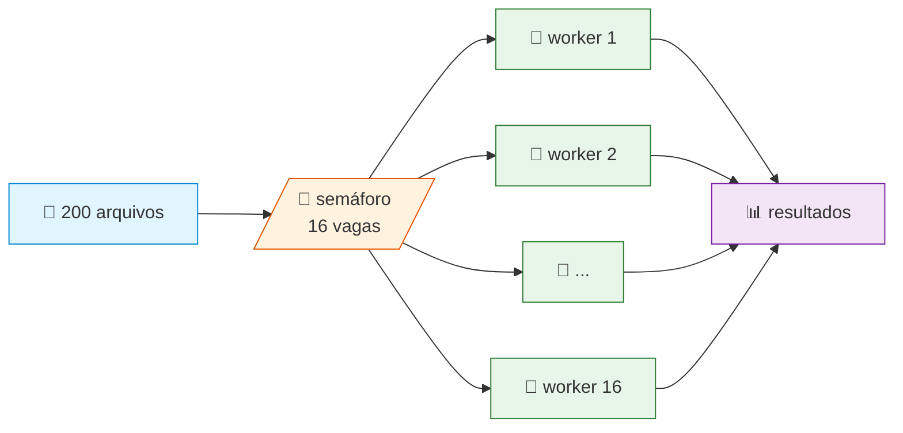
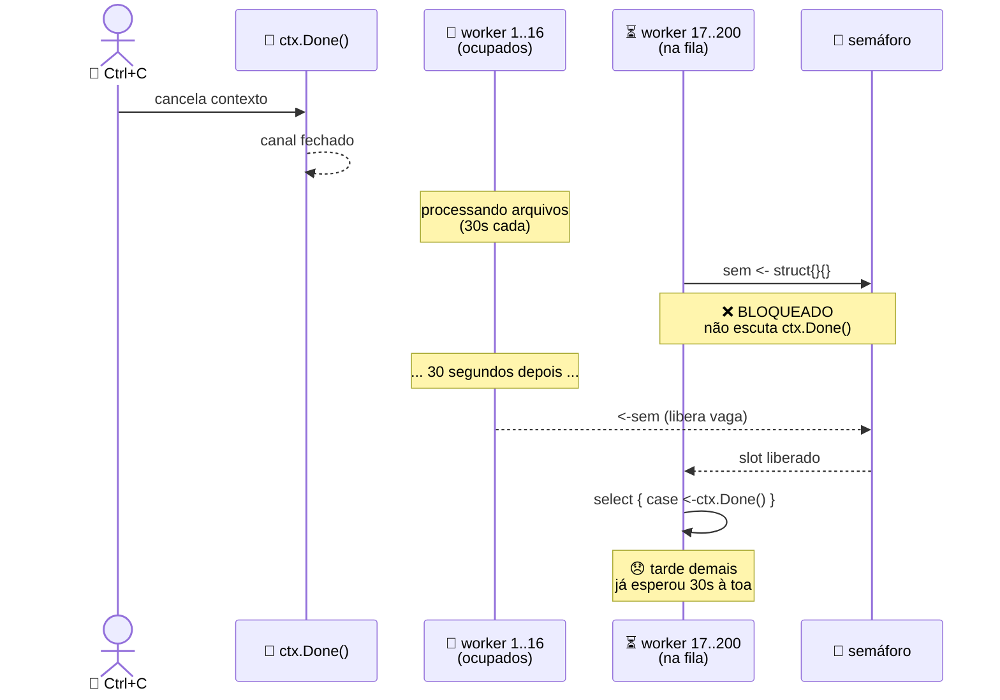
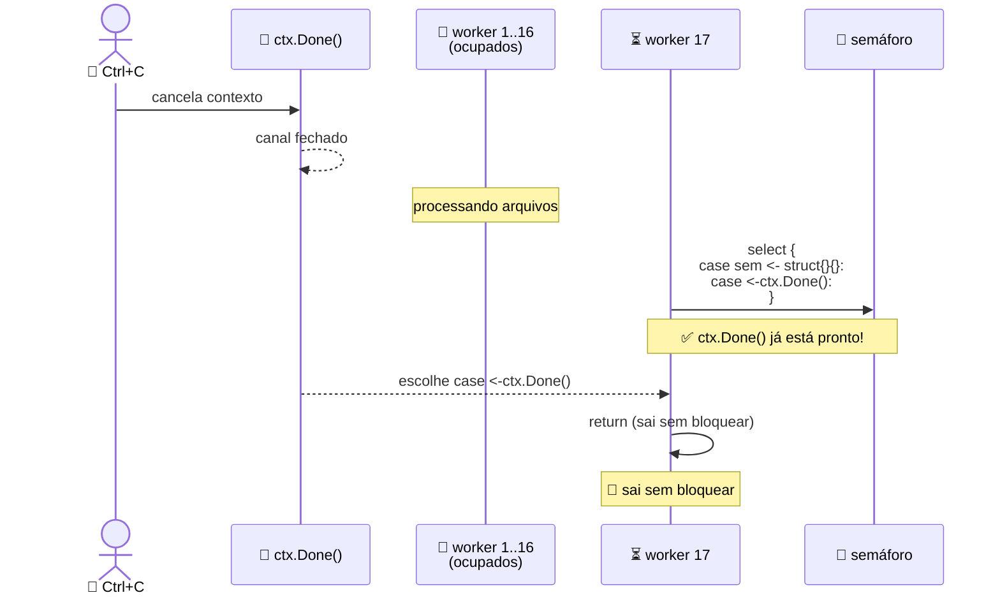

+++
title = "Resolução de um bug silencioso em Go"
description = "Como um select ausente quase matou o graceful shutdown do projeto"
date = 2026-05-07T10:00:00-03:00
tags = ["Go", "concurrency", "channels", "static-analysis", "ollanta"]
draft = false
weight = 1
author = "Vitor Lobo Ramos"
+++

# Um canal que não escuta

[Canais](https://go.dev/tour/concurrency/2) em Go é uma daquelas features que parecem simples até você precisar usá-la em produção com centenas de [goroutines](https://go.dev/tour/concurrency/1) concorrentes. E é aí que "a jiripoca começa a piar".

Este artigo conta a história de um bug silencioso que encontrei durante uma revisão de código no [Ollanta](https://github.com/scovl/Ollanta), um projeto pessoal de análise de código estático multi-linguagem escrito em Go. O bug não quebrava testes, não produzia [panic](https://go.dev/blog/defer-panic-and-recover), não gerava erro no [linter](https://golangci-lint.run). Mas, em condições específicas, impedia o [graceful shutdown](https://learn.microsoft.com/pt-br/dotnet/core/extensions/graceful-shutdown) do scanner por tempo indeterminado.


> **saiba mais:** *graceful shutdown* é quando um programa para de aceitar trabalho novo e conclui o que já está em andamento antes de desligar. O contrário seria matar o processo abruptamente, perdendo trabalho pela metade. Em Go, isso geralmente se faz com [`context.Context`](https://pkg.go.dev/context) e [`signal.NotifyContext`](https://pkg.go.dev/os/signal#NotifyContext).

## O contexto

O Ollanta precisa analisar centenas de arquivos fonte em paralelo. Para isso, usa um [worker pool](https://gobyexample.com/worker-pools), um conjunto fixo de goroutines que processam tarefas de uma fila com semáforo implementado via [channel](https://go.dev/tour/concurrency/2):

```go
// application/scan/executor.go

type Executor struct {
    parser    port.IParser
    analyzers []port.IAnalyzer
    workers   int
}

func NewExecutor(p port.IParser, analyzers []port.IAnalyzer) *Executor {
    w := runtime.NumCPU() * 2
    return &Executor{parser: p, analyzers: analyzers, workers: w}
}
```

O número de workers é [`runtime.NumCPU()`](https://pkg.go.dev/runtime#NumCPU) `* 2`. Numa máquina com 8 cores, 16 goroutines processam arquivos simultaneamente. O semáforo controla esse limite. Visualmente, o fluxo é uma fila com gargalo controlado: os 200 arquivos descobertos em disco são empurrados para o semáforo, que só deixa passar 16 de cada vez. Cada worker que pega um arquivo o analisa e devolve o resultado. Os outros 184 ficam esperando na porta.



Esse desenho é bom: colocar 200 goroutines para disputar CPU ao mesmo tempo seria pior do que serializar tudo, porque o sistema gastaria mais tempo trocando de contexto do que analisando código. O semáforo resolve isso. O problema é que ele também introduz um ponto cego e é nele que o bug se esconde.

> **saiba mais:** um **semáforo** é um mecanismo de controle de concorrência que limita quantas goroutines podem acessar um recurso ao mesmo tempo. Pense nele como um estacionamento: se tem 16 vagas e 200 carros querem estacionar, os 184 excedentes esperam na entrada. Em Go, um channel bufferizado (`make(chan struct{}, vagas)`) faz esse papel: cada goroutine "estaciona" enviando um token vazio (`sem <- struct{}{}`) e "sai" retirando-o (`<-sem`). Enquanto o canal estiver cheio, o [send bloqueia](https://go.dev/tour/concurrency/2).

## O semáforo ingênuo

O padrão é conhecido:

```go
sem := make(chan struct{}, e.workers)
```

Um channel bufferizado de structs vazias. Cada goroutine envia um token antes de começar e retira ao terminar. Até aqui, nenhum problema. A questão está em **onde** o código verifica se o usuário pediu para cancelar tudo. O código original do executor era assim:

```go
func (e *Executor) Run(ctx context.Context, files []DiscoveredFile) ([]*model.Issue, error) {
    sem := make(chan struct{}, e.workers)       // semáforo: limite de concorrência
    out := make(chan result, len(files))        // canal de saída com buffer

    var wg sync.WaitGroup
    for _, f := range files {
        f := f                                  // captura pro loop
        wg.Add(1)
        go func() {
            defer wg.Done()
            sem <- struct{}{}                   // (1) espera slot livre
            defer func() { <-sem }()            //    libera ao final

            defer func() {
                if r := recover(); r != nil {   // recupera de panic
                    out <- result{}
                }
            }()

            select {
            case <-ctx.Done():                  // (2) verifica cancelamento após acquire
                out <- result{}
                return
            default:
            }

            out <- result{issues: e.analyzeFile(ctx, f, policy)}
        }()
    }

    go func() {
        wg.Wait()
        close(out)
    }()

    for r := range out { /* coleta resultados */ }
}
```

As APIs que esse código usa `WaitGroup`, `defer`, `recover` são corretas e bem aplicadas. O isolamento de falha por arquivo impede que um panic derrube a análise inteira. A sincronização com `wg.Wait()` e `close(out)` garante que o coletor de resultados nunca leia de um canal fechado antes da hora. Do ponto de vista de threading tradicional, está tudo certo. O problema é de **ordenação**: o cancelamento é verificado no passo errado.

> **saiba mais:** [`sync.WaitGroup`](https://pkg.go.dev/sync#WaitGroup) é um contador atômico usado para esperar que várias goroutines terminem. Cada `wg.Add(1)` incrementa, cada `defer wg.Done()` decrementa ao sair da goroutine, e `wg.Wait()` bloqueia até o contador zerar. O [`defer`](https://go.dev/tour/flowcontrol/12) garante que `wg.Done()` seja chamado mesmo se a goroutine retornar por erro ou [`panic`](https://go.dev/blog/defer-panic-and-recover). Já `recover()` captura um panic e evita que ele derrube o programa inteiro, aqui ele serve para isolar a falha a um único arquivo sem abortar a análise dos demais.

## O problema

Repare nos passos marcados como `(1)` e `(2)`. A sequência que cada goroutine executa é:

1. **Bloqueia** no `sem <- struct{}{}` até conseguir um slot
2. **Depois** verifica se o contexto foi cancelado

Essa ordem é fatal. Se o contexto for cancelado enquanto TODAS as vagas do semáforo estão ocupadas, as goroutines que esperam na fila **não têm como saber que o cancelamento aconteceu**, elas estão travadas no passo 1 e nunca chegam ao passo 2. O diagrama abaixo mostra essa tragédia em câmera lenta. Acompanhe a timeline de cima para baixo: o `Ctrl+C` chega, o canal de cancelamento fecha, mas as goroutines da fila estão olhando para o semáforo, não para o contexto.



Veja o que acontece no último quadro: a goroutine finalmente chega ao `select` e descobre que `ctx.Done()` está fechado. Ela retorna. Mas isso só aconteceu porque um worker terminou e liberou uma vaga, não porque o cancelamento foi detectado. A goroutine esperou 30 segundos para descobrir algo que já era verdade no primeiro milissegundo. Num cenário concreto, o estrago é proporcional ao tamanho do pool e dos arquivos:

- Máquina com 8 cores → 16 workers
- 200 arquivos para analisar
- 16 arquivos grandes (30 segundos cada) ocupam todas as goroutines
- As 184 goroutines restantes estão bloqueadas em `sem <- struct{}{}`
- O `Ctrl+C` chega → contexto é cancelado
- As 184 goroutines **continuam bloqueadas** até que uma das 16 termine e libere um slot
- Isso pode levar **até 30 segundos** de shutdown travado

> **saiba mais:** [`context.Context`](https://pkg.go.dev/context) é o mecanismo padrão de Go para propagar cancelamento, deadlines e valores entre goroutines. Quando você cria um contexto com [`WithTimeout`](https://pkg.go.dev/context#WithTimeout) ou [`WithCancel`](https://pkg.go.dev/context#WithCancel), o canal `ctx.Done()` é fechado quando o prazo expira ou quando `cancel()` é chamado. Um `select` com `case <-ctx.Done()` detecta isso. O problema aqui é que o `select` está **depois** de uma operação bloqueante — ele nunca chega a rodar se a goroutine travar antes.

## O contraste com o que parece "certo"

O código tem `ctx.Done()`. O [`select`](https://go.dev/tour/concurrency/5) com `default` também existe. A intenção estava lá, e eu sabia que precisava verificar o cancelamento. Mas a ordem errada transforma um graceful shutdown numa espera potencialmente longa. Esse é um padrão enganoso porque ataca em três frentes que nenhuma ferramenta pega:

- **Testes unitários não pegam**: a menos que você force o pool inteiro a ficar ocupado **e** cancele o contexto ao mesmo tempo, o caminho de cancelamento nunca é exercitado. Um teste com 2 arquivos e 16 workers nunca vai encher o semáforo.
- **Operação normal não revela**: o cancelamento só acontece em shutdown. Em desenvolvimento, você raramente espera o pool encher completamente antes de o programa terminar naturalmente.
- **O linter não alerta**: não há regra no [golangci-lint](https://golangci-lint.run) que detecte "context check after blocking channel operation" — você está por conta própria.

> **saiba mais:** `select` em Go funciona como um multiplexador de canais. Ele espera até que **um** dos `case` esteja pronto e executa esse bloco. Se vários estiverem prontos, escolhe um aleatoriamente. O `default` faz o `select` ser não-bloqueante: se nenhum canal estiver pronto, executa o `default` imediatamente. Isso é útil para "tentar" sem travar, mas não substitui um `select` bloqueante que de fato aguarda o canal ficar disponível.

## A correção

A solução é fundir os dois passos — adquirir slot e verificar cancelamento — num único `select`:

```go
go func() {
    defer wg.Done()
    select {                                   // (1) TENTA adquirir OU cancela
    case sem <- struct{}{}:
        defer func() { <-sem }()               // adquiriu slot, libera ao final
    case <-ctx.Done():
        out <- result{}
        return                                 // cancelado: sai sem adquirir
    }

    defer func() {
        if r := recover(); r != nil {
            slog.Warn("panic analyzing file", "path", f.Path, "panic", r)
            out <- result{}
        }
    }()

    out <- result{issues: e.analyzeFile(ctx, f, policy)}
}()
```

A diferença parece cosmética, mas é profunda. Antes, a goroutine fazia `sem <- struct{}{}` e **depois** olhava para `ctx.Done()`. Agora, ela pergunta para o runtime: "tem vaga no semáforo OU o contexto foi cancelado?" e obedece quem responder primeiro. O diagrama abaixo mostra a mesma cena de antes, mas com a correção aplicada. Dessa vez, quando o `Ctrl+C` chega, as goroutines da fila percebem na hora:



Compare com o diagrama do bug: lá a goroutine da fila ficava 30 segundos olhando para o semáforo; aqui ela olha para os dois ao mesmo tempo e o cancelamento vence. As 184 goroutines da fila saem imediatamente — liberam memória e param de disputar o semáforo à toa. Os 16 workers ativos, porém, continuam processando: `analyzeFile` não verifica `ctx.Done()` em cada etapa (`os.ReadFile`, `parseGoFile`, e o `AnalyzerBridge.Check` também ignora o contexto recebido). 

O `wg.Wait()` espera os ativos terminarem. O tempo total de shutdown continua nos mesmos ~30 segundos. O que muda é o **custo** da espera: sem a correção, além dos 16 workers ativos, mais 184 goroutines ficavam presas no semáforo, ocupando stacks no *runtime* sem fazer nada útil.

Por que o runtime escolhe `ctx.Done()` e não o semáforo? Porque quando o contexto é cancelado, `ctx.Done()` é fechado e um canal fechado que está **permanentemente pronto para leitura**. O semáforo, por outro lado, está cheio e portanto **não está pronto para escrita**. O `select` sempre escolhe um caso pronto. Vitória do cancelamento.

> **saiba mais:** a ordem dos `case` em um `select` **não** determina prioridade — o runtime escolhe pseudo-aleatoriamente entre os canais prontos. Mas quando `ctx.Done()` já está fechado, ele está permanentemente pronto, enquanto o semáforo cheio está permanentemente bloqueado. Isso garante que o cancelamento **sempre** vence a espera.

## O diff completo

```bash
- sem <- struct{}{}
- defer func() { <-sem }()
+ select {
+ case sem <- struct{}{}:
+     defer func() { <-sem }()
+ case <-ctx.Done():
+     out <- result{}
+     return
+ }

- select {
- case <-ctx.Done():
-     out <- result{}
-     return
- default:
- }
+ // removido — ctx.Done() já é tratado no acquire do semáforo
```

Duas mudanças, ambas no mesmo arquivo, zero linhas de lógica de negócio alteradas:

1. O send no semáforo virou um `select` que escuta também `ctx.Done()`
2. O `select { default: }` separado de cancelamento foi removido — agora é redundante

O `defer func() { <-sem }()` continua no caminho feliz: a goroutine que adquiriu o slot ainda precisa liberá-lo. E, crucialmente, ele está **dentro** do `case sem <- struct{}{}:` só executa se o slot foi de fato adquirido. Se a goroutine caiu no `case <-ctx.Done()`, não há token para devolver, e o `defer` dentro do `case` simplesmente não roda.

## Por que isso é um padrão (e como evitar)

Esse tipo de bug não é exclusivo do Ollanta. É comum em Go porque a linguagem te dá blocos de construção poderosos com goroutines, channels, `select`, `context` mas não te protege da ordem em que você os combina. Você pode escrever código que compila, passa nos testes e funciona há meses, mas que esconde uma bomba-relógio de concorrência. Algumas heurísticas que adotei depois dessa descoberta:

**1. Todo `channel send` bloqueante que depende de contexto deveria ser um `select`**

```go
// suspeito:
ch <- value

// resiliente:
select {
case ch <- value:
case <-ctx.Done():
    return
}
```

**2. `ctx.Done()` antes de bloquear, não depois**

Se você precisa verificar cancelamento, faça-o **antes ou durante** a operação bloqueante. Um `select` que combina o send e o cancelamento anula os dois riscos de uma vez.

**3. Teste o caminho do cancelamento forçando o pool ao limite**

```go
func TestExecutorShutdownWhenPoolFull(t *testing.T) {
    e := NewExecutor(nil, nil)
    e.workers = 1  // só uma vaga — força contenção

    files := make([]DiscoveredFile, 2)
    files[0] = DiscoveredFile{Path: "slow.go"}   // ocupa a vaga por 10s
    files[1] = DiscoveredFile{Path: "fast.go"}   // vai esperar na fila

    ctx, cancel := context.WithTimeout(context.Background(), 100*time.Millisecond)
    defer cancel()

    _, err := e.Run(ctx, files, AllowAllProfilePolicy())
    if !errors.Is(err, context.DeadlineExceeded) {
        t.Fatal("esperava deadline exceeded, obteve", err)
    }
}
```

Sem a correção, esse teste **trava por 10 segundos**, tempo suficiente para ninguém nunca rodá-lo. Com a correção, ele termina em 100ms. Um teste que demora 10 segundos é um teste que não existe na prática.

---

## O que aprendi com isso

Canais em Go parecem simples, mas o diabo está na ordem. O padrão de semáforo com channel é ensinado em todos os tutoriais de [concorrência em Go](https://go.dev/tour/concurrency/1), mas poucos mencionam a interação com [contextos canceláveis](https://pkg.go.dev/context). A maioria dos exemplos assume que a operação vai completar rápido, mas em produção não vai!

O resumo em números: duas linhas de diff, zero mudanças de lógica. A diferença não está no tempo total de shutdown — que continua limitado pelos workers ativos (~30 segundos nos piores casos) — mas em **quem** ocupa recursos durante a espera. 

Antes, 184 goroutines ociosas ficavam empilhadas no semáforo; depois, elas saem de cena no primeiro milissegundo, deixando apenas o trabalho realmente útil consumindo CPU e memória. Os workers que já estão processando continuam até terminar, e isso é exatamente o comportamento esperado de um graceful shutdown.

| | Workers ocupados | Goroutines na fila | Shutdown total |
|---|---|---|---|
| ❌ Antes (`sem <-` puro) | 30s processando | 30s travadas esperando vaga | **~30 segundos** |
| ✅ Depois (`select` + `ctx`) | 30s processando | 0s — detectam cancelamento | **~30 segundos**\* |

* O tempo total de shutdown é gated pelos workers ativos via `wg.Wait()`. A correção elimina o **custo adicional** de 184 goroutines zumbis disputando o semáforo sem necessidade.

No Ollanta, essa correção de duas linhas eliminou 184 goroutines ociosas que sobreviviam ao `Ctrl+C` sem propósito, reduzindo o consumo de memória durante o shutdown e evitando a cascata de passagens pelo semáforo após os workers terminarem. Se você está escrevendo um worker pool em Go, lembre-se: o semáforo bloqueia. E bloqueio sem `select` não escuta o cancelamento.

> Este artigo foi escrito a partir de uma correção real no repositório do [Ollanta](https://github.com/scovl/Ollanta). O diff completo está em [https://github.com/scovl/Ollanta/blob/main/application/scan/executor.go](https://github.com/scovl/Ollanta/commit/3d95d5399b5cb0143637cce51e787ce8bb752285).
