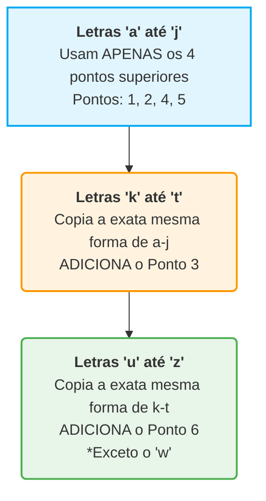

+++
title = "Base01 - Códigos e Combinações"
description = "A lógica binária do código morse"
date = 2026-05-12T18:40:00-03:00
tags = ["morse","historia","computação"]
draft = true
weight = 1
author = "Vitor Lobo Ramos"
+++

O Código Morse foi inventado por volta de 1837 por [Samuel Finley Breese Morse](https://pt.wikipedia.org/wiki/Samuel_Morse) (1791–1872). Ele foi aprimorado por outros inventores, notavelmente [Alfred Vail](https://en.wikipedia.org/wiki/Alfred_Vail) (1807–1859), e evoluiu para algumas versões diferentes. O sistema que utilizamos e estudamos hoje é mais formalmente conhecido como **[Código Morse Internacional](https://pt.wikipedia.org/wiki/Código_Morse)**.

Mais de 180 anos depois, o Código Morse continua tão relevante que, em maio de 2026, um hacker o utilizou para enganar um agente de inteligência artificial. A técnica foi a [injeção de prompt](https://pt.wikipedia.org/wiki/Injeção_de_prompt): comandos maliciosos em código Morse foram enviados ao sistema, que os interpretou como instruções legítimas e transferiu US$ 213 mil (R$ 1 milhão) em criptomoedas ([Livecoins](https://livecoins.com.br/hacker-usa-codigo-morse-para-fazer-agente-autonomo-de-ia-lhe-enviar-r-1-milhao-em-criptomoeda/)). O caso mostra que a estrutura binária de pontos e traços que você aprenderá a seguir não é apenas história — ela ainda povoa o submundo da segurança digital.

A invenção do código Morse caminha lado a lado com a invenção do [telégrafo](https://pt.wikipedia.org/wiki/Telégrafo).  Assim como o código Morse fornece uma excelente introdução à natureza dos códigos e da informação, o telégrafo inclui um hardware que consegue imitar o funcionamento básico de um computador.

## O Desafio da Tradução: Enviar vs. Receber

A maioria das pessoas acha muito mais fácil **enviar** código Morse do que **receber**. Mesmo que você não tenha o código memorizado, para enviar uma mensagem basta usar uma tabela de tradução organizada em ordem alfabética. Você olha a letra "A", vê que é `Ponto-Traço` (`.-`), e transmite.

No entanto, **receber** o código Morse e traduzi-lo de volta para palavras é consideravelmente mais difícil e demorado. Por quê? Porque você precisa trabalhar de trás para frente. O problema é que possuímos uma tabela que faz esta tradução:

> **Letra do Alfabeto → Pontos e Traços do Código Morse**

Mas não temos uma tabela natural que nos permita fazer o caminho inverso:

> **Pontos e Traços do Código Morse → Letra do Alfabeto**

Se você recebe a sequência `Traço-Ponto-Traço-Traço` (`-.--`), e não tem o código decorado, terá que escanear a tabela inteira, letra por letra, até descobrir finalmente que se trata da letra **Y**. Não há nada nos pontos e traços que possamos simplesmente colocar em "ordem alfabética".

Para facilitar, vamos esquecer a ordem alfabética. Uma abordagem muito melhor e mais didática para organizar esses códigos é agrupá-los com base em **quantos pontos e traços eles possuem**. Começando pelo mais simples: uma sequência de apenas um ponto ou um traço pode representar **duas** letras:

Uma combinação de exatamente dois pontos ou traços nos fornece **quatro** novas letras:

Um padrão de três pontos ou traços nos dá **oito** letras adicionais:
*(Ex: `...` para S, `---` para O, etc.)*. Sequências de quatro pontos e traços permitem mais **16** caracteres. Se somarmos tudo isso, essas quatro categorias nos dão:
**2 + 4 + 8 + 16 = 30 letras disponíveis.** Isso é mais do que suficiente para as 26 letras do alfabeto latino (os 4 códigos extras são usados para letras acentuadas em alguns idiomas).

## O Padrão Matemático: Potências de 2

Você conseguiu notar um padrão no tamanho das categorias acima? **Cada grupo possui exatamente o dobro de códigos do grupo anterior.** Isso faz total sentido lógico: cada novo nível pega todos os códigos do nível anterior e adiciona um Ponto no final, e depois pega todos os códigos do nível anterior e adiciona um Traço no final. 

Podemos resumir essa tendência fascinante da seguinte forma:

| Quantidade de Símbolos (Pontos/Traços) | Cálculo | Número de Códigos Possíveis |
| --- | --- | --- |
| 1 | 2 | **2** |
| 2 | 2 × 2 | **4** |
| 3 | 2 × 2 × 2 | **8** |
| 4 | 2 × 2 × 2 × 2 | **16** |

Sempre que multiplicamos um número por ele mesmo várias vezes, podemos usar **[expoentes](https://pt.wikipedia.org/wiki/Exponenciação)**. Por exemplo, `2 × 2 × 2 × 2` pode ser escrito como **2⁴** (2 elevado à 4ª potência). A matemática dos códigos se resume a esta fórmula elegante:

> **Número de códigos = 2^(número de pontos e traços)**

## A Árvore de Decodificação (O Método Visual)

Para tornar o processo de decodificação ainda mais fácil e para visualizar essa matemática perfeitamente, podemos desenhar um diagrama em formato de árvore. Abaixo está a representação de como as letras se ramificam a cada novo símbolo adicionado. Para decodificar uma sequência, você começa à esquerda e segue as setas para a direita, escolhendo "Ponto" ou "Traço" a cada passo:

*Exemplo prático:* Suponha que você queira saber qual letra corresponde ao código `.-.` (Ponto-Traço-Ponto).

1. Comece no `Início`.
2. Siga a seta do **Ponto** (chegando no E).
3. Siga a seta do **Traço** (chegando no A).
4. Siga a seta do **Ponto**. Você chegará à letra **R** (destacada em azul acima).

Construir essa estrutura mental (ou em papel) garante que não se cometa o erro bobo de usar o mesmo código para duas letras diferentes, além de garantir o aproveitamento de todas as combinações possíveis sem criar sequências desnecessariamente longas.

O que acontece se precisarmos incluir números e sinais de pontuação? Nós apenas continuamos seguindo a fórmula:

* Uma sequência de **5** pontos e traços nos dá **32** códigos adicionais (2⁵). Isso cobre os dez números e vários acentos.
* Para incluir toda a pontuação, expandimos para **6** pontos e traços, o que nos dá **64** códigos adicionais (2⁶).

No total, teríamos `2 + 4 + 8 + 16 + 32 + 64 = 126` caracteres possíveis (a soma cumulativa de todas as combinações de 1 a 6 símbolos). Isso é mais do que o código Morse precisa! Muitos desses códigos mais longos são "indefinidos" — se você receber um, provavelmente alguém cometeu um erro de digitação no telégrafo.

### A Conexão com os Computadores

O código Morse é dito ser **[binário](https://pt.wikipedia.org/wiki/Sistema_binário)** porque seus componentes têm apenas duas opções: ponto ou traço. É como uma moeda, que só pode cair em cara ou coroa — se você a jogar 10 vezes, existem 2¹⁰ (1024) sequências possíveis. Essa lógica de dois estados é a mesma que os computadores usam para processar, armazenar e transmitir toda a informação do mundo digital.

O código Morse representa letras como sequências que se desenrolam no tempo (pontos e traços sucessivos). O próximo sistema que veremos faz o oposto: representa letras como padrões que existem no espaço, percebidos de uma só vez pelo tato — e foi inventado por um adolescente francês cego mais de uma década antes de Morse apresentar seu telégrafo.

[Louis Braille](https://pt.wikipedia.org/wiki/Louis_Braille) (1809–1852) publicou seu sistema de pontos em relevo aos 15 anos. Seu código não é apenas uma lição de superação; é uma aula magna sobre lógica binária e design de sistemas. O maior obstáculo na educação de crianças cegas no século XIX era a incapacidade de ler livros impressos. Até então, a solução tentada por [Valentin Haüy](https://pt.wikipedia.org/wiki/Valentin_Haüy) (fundador da escola para cegos em Paris, onde Braille estudou) era imprimir letras normais do alfabeto em um formato grande e em alto-relevo.

O problema? Para quem enxerga, um "A" tem que ter a forma de um "A". Mas apalpar as curvas complexas de letras tradicionais com os dedos é um processo incrivelmente lento e frustrante. Haüy estava preso a um paradigma visual. Ele não percebeu que um **código alternativo**, e não a cópia da letra em si, seria muito mais eficiente.

A verdadeira inspiração de Louis Braille veio do exército francês. O [Capitão Charles Barbier](https://pt.wikipedia.org/wiki/Charles_Barbier) havia inventado a *écriture nocturne* (escrita noturna), um sistema de pontos em alto-relevo no papel para que soldados pudessem ler mensagens no escuro, em silêncio. Braille conheceu o sistema aos 12 anos. Aos 15, já o havia aprimorado e criado o sistema incrivelmente lógico que usamos até hoje.

## A Célula Braille: Uma Matriz Binária

No sistema Braille, cada símbolo (letras, números e pontuação) é codificado como um ou mais pontos em alto-relevo dentro de uma pequena matriz retangular de 2 colunas por 3 linhas, chamada de **célula**. Os pontos são numerados de 1 a 6:

| Coluna Esquerda | Coluna Direita |
| --- | --- |
| Ponto **1** | Ponto **4** |
| Ponto **2** | Ponto **5** |
| Ponto **3** | Ponto **6** |

O que torna isso brilhante para nós, que estamos estudando a natureza dos códigos, é que **os pontos são binários**. Um ponto específico pode estar apenas em um de dois estados: **plano** ou em **alto-relevo**. Lembra da regra matemática das potências de 2 que vimos com o Código Morse? Podemos aplicá-la perfeitamente aqui. Se temos 6 pontos e cada ponto tem 2 estados possíveis, o número total de combinações é:

> **2 × 2 × 2 × 2 × 2 × 2 = 2⁶ = 64 combinações possíveis**

Com uma única célula, o sistema Braille é capaz de representar **64 códigos únicos**. (Um deles é o espaço em branco, onde nenhum ponto é elevado).

## A Lógica Elegante do Alfabeto

Louis Braille não distribuiu os pontos de forma aleatória. Como o sistema original era perfurado à mão com um punção (o que podia gerar imprecisões), ele criou padrões focados em formas reconhecíveis e redundância, reduzindo a chance de erros de leitura (erros de decodificação). Ele organizou o alfabeto latino básico em uma estrutura lógica em blocos:

> (Nota: A letra 'w' não fazia parte do alfabeto clássico francês na época, por isso ficou de fora dessa regra sequencial original).

Mesmo com letras, espaços e algumas pontuações, não chegamos a 64 códigos. Em sistemas modernos, como o **[Braille Grau 2](https://pt.wikipedia.org/wiki/Braille#Graus_do_braille)** (usado em livros em inglês), nada é desperdiçado. O sistema usa combinações para representar palavras inteiras (como "and", "the", "with") ou pedaços de palavras (como "ble"), para economizar papel e acelerar a leitura.

Mas como diferenciamos uma pontuação de uma letra, se os códigos se sobrepõem? É aqui que o Braille se mostra um verdadeiro predecessor da ciência da computação moderna, usando **indicadores de contexto**.

As letras de "a" a "j" também são usadas para representar os números de "1" a "0". Para que o leitor saiba que não está lendo letras, existe um código especial de número (pontos 3, 4, 5, 6).
Quando esse código aparece, ele altera o significado de **todos os códigos que o seguem** (de letras para números) até que outro código o disfaça. É exatamente a mesma lógica de segurar a tecla **Shift** ou o *Caps Lock* no seu teclado!

Como indicamos uma letra maiúscula? Usando o ponto 6 sozinho. Esse indicador de maiúscula diz que **apenas a próxima letra** deve ser interpretada de forma diferente (como maiúscula). Em computação, chamamos isso de código de escape: ele permite que você "escape" da interpretação normal apenas para o próximo caractere.

Essa ideia de que sequências binárias podem mudar de significado conforme o contexto — shift para números, escape para maiúsculas — parece uma descoberta moderna. Mas a humanidade já codificava significados em padrões binários muito antes de existir um teclado.

---

## Milênios de Binário: O I Ching e a China Antiga

Muito antes de Morse, Braille ou qualquer computador, a civilização chinesa já havia codificado o pensamento binário no **[I Ching](https://pt.wikipedia.org/wiki/I_Ching)** (易经, *O Livro das Mutações*), compilado há mais de três mil anos. No I Ching, cada linha de um diagrama pode assumir dois estados:

* **Linha Yang (⚊):** contínua, sólida — representa o 1, o ativo, o firme.
* **Linha Yin (⚋):** partida, quebrada — representa o 0, o receptivo, o flexível.

Três linhas empilhadas formam um **trigrama** (卦). Com 3 linhas binárias, existem 2³ = 8 trigramas possíveis — exatamente a mesma lógica da árvore de decodificação de três níveis que vimos no Código Morse. Seis linhas empilhadas formam um **hexagrama**, com 2⁶ = **64 combinações possíveis** — o mesmo número de células do Braille e o mesmo número de valores que um byte de 6 bits poderia representar.

Quando o matemático e filósofo alemão [Gottfried Wilhelm Leibniz](https://pt.wikipedia.org/wiki/Gottfried_Wilhelm_Leibniz) tomou contato com o I Ching através de missionários jesuítas no século XVII, reconheceu imediatamente a correspondência entre os hexagramas e seu próprio sistema binário recém-desenvolvido. Leibniz viu na sabedoria chinesa antiga a confirmação de que a lógica de dois estados não era uma invenção arbitrária, mas um princípio fundamental do pensamento humano.

O Código Morse (século XIX) e o Braille (século XIX) são manifestações modernas de uma intuição que a civilização chinesa já dominava milênios antes. O binário não nasceu com os computadores — ele sempre esteve ali, esperando para ser descoberto.

---

## O Futuro: Expandindo o Binário

Assim como nossos computadores evoluíram, o Braille também precisou crescer. Códigos de turno e escape são geniais, mas adicionam complexidade: você não pode ler um caractere isolado sem saber o que veio antes dele. Para resolver isso em áreas complexas (como notação musical, ideogramas japoneses Kanji ou programação de computadores), foi criado o **Braille de 8 pontos** (adicionando mais uma linha à matriz). A matemática ataca novamente:

> **2⁸ = 256 combinações possíveis**

Com 256 códigos únicos, letras maiúsculas, minúsculas, números e pontuações têm seu próprio código exclusivo, eliminando a necessidade de indicadores de contexto. 

E se o número 256 soa familiar para você, não é coincidência: **256 é exatamente o número de valores que cabem em 1 [Byte](https://pt.wikipedia.org/wiki/Byte) (8 bits) da memória do seu computador ou smartphone atual.** A revolução binária começou muito antes das telas brilharem. O que a princípio eram apenas abstrações matemáticas — códigos de dois estados, combinações, potências de dois — logo encontraria seu lar em fios, interruptores e circuitos elétricos.

---

### Fonte

- [Code: The Hidden Language of Computer Hardware and Software](https://a.co/d/0a3DsSsn), 2ª ed. — Charles Petzold
