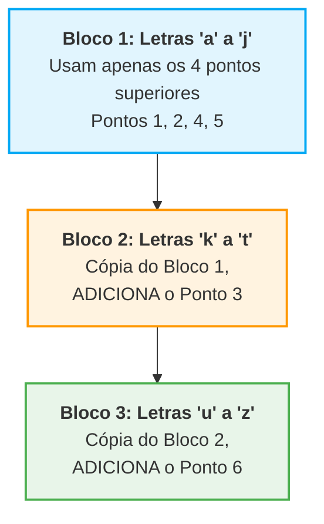
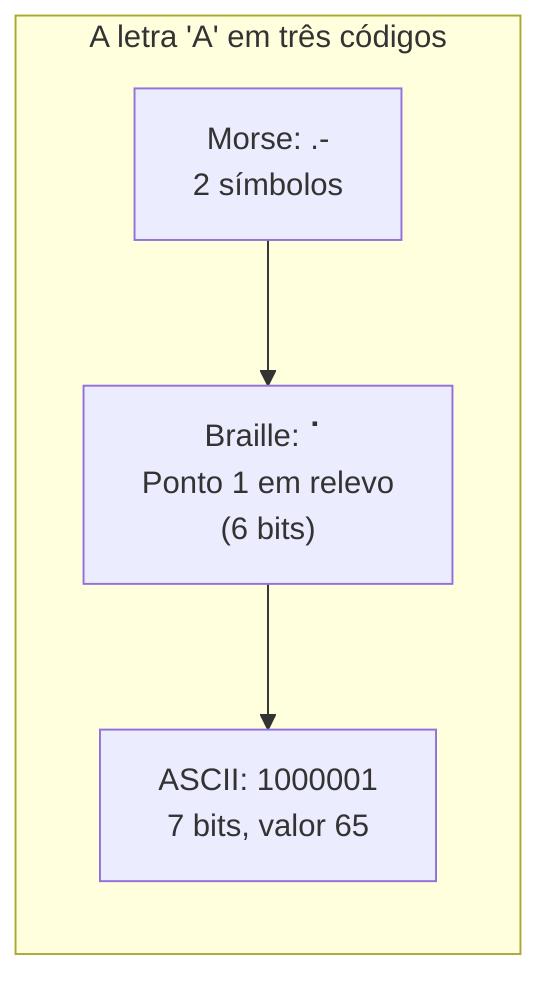

+++
title = "Petzold01 - Códigos e Combinações"
description = "A lógica binária do código morse"
date = 2026-05-12T18:40:00-03:00
tags = ["morse","historia","computação"]
draft = true
weight = 1
author = "Vitor Lobo Ramos"
+++

Ao concluir a leitura do livro [Code: The Hidden Language of Computer Hardware and Software](https://a.co/d/0a3DsSsn) 2ª ed. de Charles Petzold, decidi criar uma série de artigos sintetizando seu conteúdo e em Português. Então vamos ao ponto de partida:

O Código Morse foi inventado por volta de 1837 por [Samuel Finley Breese Morse](https://pt.wikipedia.org/wiki/Samuel_Morse) (1791–1872). Ele foi aprimorado por outros inventores, notavelmente [Alfred Vail](https://en.wikipedia.org/wiki/Alfred_Vail) (1807–1859), e evoluiu para algumas versões diferentes. O sistema que utilizamos e estudamos hoje é mais formalmente conhecido como **[Código Morse Internacional](https://pt.wikipedia.org/wiki/Código_Morse)**.

Mais de 180 anos depois, o Código Morse continua tão relevante que, em maio de 2026, um hacker o utilizou para enganar um agente de inteligência artificial. A técnica foi a [injeção de prompt](https://pt.wikipedia.org/wiki/Injeção_de_prompt): comandos maliciosos em código Morse foram enviados ao sistema, que os interpretou como instruções legítimas e transferiu US$ 213 mil (R$ 1 milhão) em criptomoedas ([Livecoins](https://livecoins.com.br/hacker-usa-codigo-morse-para-fazer-agente-autonomo-de-ia-lhe-enviar-r-1-milhao-em-criptomoeda/)). O caso mostra que a estrutura binária de pontos e traços que você aprenderá a seguir não é apenas história, ela ainda povoa o submundo da segurança digital.

A invenção do código Morse caminha lado a lado com a invenção do [telégrafo](https://pt.wikipedia.org/wiki/Telégrafo), o primeiro sistema a transmitir informação codificada por impulsos elétricos através de fios. Essa união entre **código binário** (ponto/traço) e **sinal elétrico** (pulso curto/pulso longo) é exatamente a base de como os computadores funcionam, a diferença é que o telégrafo era operado manualmente, enquanto o computador faz tudo automaticamente e bilhões de vezes mais rápido.

## O Desafio da Tradução: Enviar vs. Receber

A maioria das pessoas acha muito mais fácil **enviar** código Morse do que **receber**. Mesmo que você não tenha o código memorizado, para enviar uma mensagem basta usar uma tabela de tradução organizada em ordem alfabética. Você olha a letra "A", vê que é `Ponto-Traço` (`.-`), e transmite.

No entanto, **receber** o código Morse e traduzi-lo de volta para palavras é consideravelmente mais difícil e demorado. Por quê? Porque você precisa trabalhar de trás para frente. O problema é que possuímos uma tabela que faz esta tradução:

> **Letra do Alfabeto → Pontos e Traços do Código Morse**

Mas não temos uma tabela natural que nos permita fazer o caminho inverso:

> **Pontos e Traços do Código Morse → Letra do Alfabeto**

Se você recebe a sequência `Traço-Ponto-Traço-Traço` (`-.--`), e não tem o código decorado, terá que escanear a tabela inteira, letra por letra, até descobrir finalmente que se trata da letra **Y**. Não há nada nos pontos e traços que possamos simplesmente colocar em "ordem alfabética".

Para facilitar, vamos esquecer a ordem alfabética. Uma abordagem muito melhor e mais didática para organizar esses códigos é agrupá-los com base em **quantos pontos e traços eles possuem**. Começando pelo mais simples: uma sequência de apenas um ponto ou um traço pode representar **duas** letras:

Uma combinação de exatamente dois pontos ou traços nos fornece **quatro** novas letras:

Um padrão de três pontos ou traços nos dá **oito** letras adicionais:
*(Ex: `...` para S, `---` para O, etc.)*. Sequências de quatro pontos e traços permitem mais **16** caracteres. Se somarmos tudo isso, essas quatro categorias nos dão:
**2 + 4 + 8 + 16 = 30 letras disponíveis.** Isso é mais do que suficiente para as 26 letras do alfabeto latino, os 4 códigos restantes na verdade representam três letras com tremas (umlauts: ä, ö, ü) e o dígrafo **CH** (usado em alemão e em outras línguas).

## O Padrão Matemático: Potências de 2

Você conseguiu notar um padrão no tamanho das categorias acima? **Cada grupo possui exatamente o dobro de códigos do grupo anterior.** Cada novo nível pega todos os códigos do nível anterior, adiciona um Ponto no final, repete o processo com um Traço, e dobra.

Podemos estender esta tabela para visualizar o crescimento exponencial até o ponto em que o número de combinações atinge a marca de 1024:

| Pontos/Traços | Potência | Número de Códigos |
| --- | --- | --- |
| 1 | 2¹ | **2** |
| 2 | 2² | **4** |
| 3 | 2³ | **8** |
| 4 | 2⁴ | **16** |
| 5 | 2⁵ | **32** |
| 6 | 2⁶ | **64** |
| 7 | 2⁷ | **128** |
| 8 | 2⁸ | **256** |
| 9 | 2⁹ | **512** |
| 10 | 2¹⁰ | **1024** |

A palavra "binário", do latim *binarius*, significa literalmente "dois a dois" (*two by two*). É exatamente isso: a cada novo símbolo, o número de combinações **dobra**. A matemática é simples, mas as consequências são profundas:

> **Número de códigos = 2^(número de pontos e traços)**

## A Árvore de Decodificação (O Método Visual)

Para tornar o processo de decodificação ainda mais fácil e para visualizar essa matemática perfeitamente, podemos desenhar um diagrama em formato de árvore. Abaixo está a representação de como as letras se ramificam a cada novo símbolo adicionado. Para decodificar uma sequência, você começa à esquerda e segue as setas para a direita, escolhendo "Ponto" ou "Traço" a cada passo:

*Exemplo prático:* Suponha que você queira saber qual letra corresponde ao código `.-.` (Ponto-Traço-Ponto).

1. Comece no `Início`.
2. Siga a seta do **Ponto** (chegando no E).
3. Siga a seta do **Traço** (chegando no A).
4. Siga a seta do **Ponto**. Você chegará à letra **R** (destacada em azul acima).

Construir essa estrutura mental (ou em papel) garante que não se cometa o erro bobo de usar o mesmo código para duas letras diferentes, além de garantir o aproveitamento de todas as combinações possíveis sem criar sequências desnecessariamente longas. O que acontece se precisarmos incluir números e sinais de pontuação? Nós apenas continuamos seguindo a fórmula:

* Sequências de **5** símbolos (2⁵ = 32 códigos) cobrem os dez números, mas a maioria desses 32 códigos é usada para letras acentuadas adicionais, não para pontuação.
* Sinais como ponto final, vírgula e interrogação acabam precisando de **6** símbolos (2⁶ = 64 códigos). Isso é intencional: como a pontuação é menos frequente que letras e números, atribuir-lhe códigos mais longos segue a mesma lógica de compressão por frequência que Vail usou para o 'E'.

No total, teríamos `2 + 4 + 8 + 16 + 32 + 64 = 126` caracteres possíveis (a soma cumulativa de todas as combinações de 1 a 6 símbolos). Isso é mais do que o código Morse precisa! Muitos desses códigos mais longos são "indefinidos", se você receber um, provavelmente alguém cometeu um erro de digitação no telégrafo.

### O Fator Tempo: Onde uma Letra Termina?

Se o código Morse usa apenas pontos e traços, como o receptor sabe onde uma letra termina e a outra começa? Se você ouvir `...`, é um "S" (três pontos) ou são três letras "E" (`. . .`)?

A resposta está no **silêncio**. O Morse não é feito apenas de pontos e traços, mas também de **pausas** com durações rigorosamente definidas:

| Elemento | Duração relativa |
|---|---|
| Ponto (.) | 1 unidade |
| Traço (−) | 3 unidades |
| Silêncio entre elementos da mesma letra | 1 unidade |
| Silêncio entre letras | 3 unidades |
| Silêncio entre palavras | 7 unidades |

Assim, a letra "R" (`.-.`) é transmitida como: **sinal (1) + silêncio (1) + sinal (3) + silêncio (1) + sinal (1)**. Já três letras "E" seriam: **sinal (1) + silêncio (3) + sinal (1) + silêncio (3) + sinal (1)**. A diferença no silêncio entre os elementos é o que permite distinguir "R" de "EEE".

Este é o mesmo princípio dos protocolos de comunicação digital modernos: bits são transmitidos em intervalos de tempo fixos, e o receptor usa um relógio sincronizado com o transmissor para saber onde cada símbolo termina. [USB](https://pt.wikipedia.org/wiki/USB), [Ethernet](https://pt.wikipedia.org/wiki/Ethernet) e [Wi-Fi](https://pt.wikipedia.org/wiki/Wi-Fi) usam versões sofisticadas deste mesmo mecanismo.

### A Origem da Compressão: Por que o 'E' é um Ponto

Alfred Vail, colaborador de Morse, percebeu que enviar mensagens longas seria cansativo. Ele visitou uma tipografia e literalmente **contou as letras de chumbo** usadas para imprimir jornais, um inventário rudimentar da frequência de cada letra no inglês.

O resultado foi um código de **comprimento variável**: a letra **E** (a mais comum) recebeu o código mais curto, um único ponto. A letra **T** (a segunda mais comum) recebeu um traço. Letras raras como **Q** (`--.-`) e **Z** (`--..`) ficaram com sequências longas e portanto mais lentas de transmitir.

Esta foi a primeira aplicação prática de **[codificação por entropia](https://pt.wikipedia.org/wiki/Codificação_por_entropia)**, atribuir símbolos mais curtos a eventos mais frequentes. O mesmo princípio, formalizado matematicamente por [David Huffman](https://pt.wikipedia.org/wiki/David_Huffman) em 1952, é o coração dos algoritmos de compressão modernos:

* **[Codificação de Huffman](https://pt.wikipedia.org/wiki/Codificação_de_Huffman)** → ZIP, JPEG, PNG
* **[Codificação aritmética](https://pt.wikipedia.org/wiki/Codificação_aritmética)** → MP4, H.264
* **[Lempel-Ziv (LZ77)](https://pt.wikipedia.org/wiki/LZ77)** → GIF, gzip, PDF

O Morse não é apenas o primeiro código binário; é o ancestral direto da compressão de dados.

### A Conexão com os Computadores

O código Morse é **binário**: seus componentes têm apenas dois valores possíveis, ponto ou traço. É como uma moeda, que só pode cair em cara ou coroa. Se você a jogar 10 vezes, existem 2¹⁰ = 1024 sequências possíveis.

Esta é a mesma lógica que os computadores usam. A diferença é que, em vez de pontos e traços, os computadores usam **níveis de tensão**: 0 volts representa o bit `0`, e uma tensão de referência (como 3,3V ou 5V) representa o bit `1`. Agrupe 8 bits e você tem um byte, capaz de representar 256 valores diferentes, como letras, números ou cores.

Assim como a árvore de decodificação do Morse garante que cada código seja único, a tabela de encoding (como ASCII) mapeia cada padrão de bits a um símbolo específico. O princípio é exatamente o mesmo, o que muda é o meio físico (fios em vez de sinais sonoros) e a velocidade (bilhões de bits por segundo em vez de alguns pontos por segundo).

---

## O Sistema Braille: Uma Codificação Paralela

Se o código Morse representa letras como sequências no **tempo** (pontos e traços sucessivos), outra invenção, criada por um menino francês em 1824, faz o oposto: representa letras como padrões **espaciais**, percebidos de uma só vez pelo tato.

### A Tragédia e a Invenção

[Louis Braille](https://pt.wikipedia.org/wiki/Louis_Braille) (1809–1852) perdeu a visão aos três anos de idade em um acidente na oficina de arreios de seu pai: uma **sovela** (ferramenta perfurante de couro) escorregou e atingiu seu olho. A infecção se espalhou para o outro olho, deixando-o completamente cego.

Aos dez anos, ganhou uma bolsa para o Instituto Real para Jovens Cegos em Paris. Lá, o ensino era baseado no sistema de [Valentin Haüy](https://pt.wikipedia.org/wiki/Valentin_Haüy), que consistia em imprimir letras do alfabeto comum em alto-relevo no papel, para que fossem sentidas pelo tato. O problema? Apalpar as curvas complexas das letras tradicionais era extremamente lento, impreciso e frustrante, e os livros eram caríssimos de produzir.

Aos doze anos, Braille conheceu o sistema *écriture nocturne* (escrita noturna), inventado pelo capitão do exército francês [Charles Barbier](https://en.wikipedia.org/wiki/Charles_Barbier) para que soldados pudessem ler mensagens no escuro. Era um código de 12 pontos em relevo representando sons, não letras. Braille enxergou o potencial, mas simplificou o sistema radicalmente: reduziu a matriz para **6 pontos** (2 colunas, 3 linhas) e o adaptou para representar letras reais.

Aos **quinze anos**, em 1824, ele já tinha seu sistema pronto.

### A Célula Braille: Uma Matriz Binária

Cada símbolo é codificado por pontos em relevo dentro de uma célula de 2 colunas por 3 linhas:

| Coluna Esquerda | Coluna Direita |
| --- | --- |
| Ponto **1** | Ponto **4** |
| Ponto **2** | Ponto **5** |
| Ponto **3** | Ponto **6** |

Cada ponto pode estar em **um de dois estados**: plano (0) ou relevo (1). Aplicando a regra das potências de 2:

> **2⁶ = 64 combinações possíveis**

Destas, 26 são letras do alfabeto, mas o francês clássico da época não usava o **W**, que só foi incorporado depois. Braille organizou as letras que restaram em blocos hierárquicos:

> Nota: O 'W' não aparece na tabela original porque não faz parte do alfabeto francês clássico. Quando o Braille foi adaptado para o inglês e outros idiomas, o W foi acrescentado rearranjando algumas combinações.

### Lições de Engenharia do Braille

O sistema de Braille ensina conceitos que a computação moderna redescobriria décadas depois:

**1. Codificação hierárquica.** Os blocos não reinventam cada letra do zero. O Bloco 2 copia exatamente o padrão do Bloco 1 e adiciona o Ponto 3. O Bloco 3 copia o Bloco 2 e adiciona o Ponto 6. Isto é **design incremental**: aproveitar a estrutura existente em vez de partir do zero, o mesmo princípio usado em [paginação hierárquica de memória](https://pt.wikipedia.org/wiki/Tabela_de_páginas), [sistemas de arquivos](https://pt.wikipedia.org/wiki/Sistema_de_arquivos) e [bancos de dados](https://pt.wikipedia.org/wiki/Banco_de_dados).

**2. Indicadores de contexto (shift e escape).** Com apenas 64 códigos para letras, números e pontuação, Braille precisou de um truque: código especial de número (pontos 3,4,5,6) que altera a interpretação de *todos* os símbolos seguintes (como **Shift** ou **Caps Lock**), e o ponto 6 isolado como **escape** para maiúsculas (altera apenas o próximo caractere). Esta ideia sobrevive no HTTP (%20), no **[UTF-8](https://pt.wikipedia.org/wiki/UTF-8)** (prefixos 110, 1110) e no ASCII (caractere ESC).

**3. Compressão por contração ([Grade 2 Braille](https://en.wikipedia.org/wiki/English_Braille)).** Como apenas 26 letras + números + pontuação não preenchem as 64 combinações, os códigos extras foram reaproveitados para criar **atalhos**. No Braille Grau 2, que domina as publicações em inglês, combinações únicas representam palavras inteiras frequentes como *but*, *can*, *do*, *every*, *from* e *have*, além de contrações como *ch*, *sh*, *th*, *ed*, *er* e *ou*. Isto economiza papel (cerca de 25%) e acelera a leitura, uma forma de compressão de dados por substituição, exatamente como a codificação de Huffman que vimos no Morse e os dicionários do algoritmo LZ usados em ZIP e PNG.

**4. Tolerância a erros de leitura.** Braille sabia que a perfuração manual com sovela podia gerar imprecisões, e que o papel amassado podia achatar pontos. Por isso, ele distribuiu os padrões de forma a **minimizar ambiguidades**: letras que poderiam ser confundidas receberam padrões visualmente distintos. Isso é análogo aos **[bits de paridade](https://pt.wikipedia.org/wiki/Bit_de_paridade)**, **[checksums](https://pt.wikipedia.org/wiki/Soma_de_verificação)** e **[códigos corretores de erro](https://pt.wikipedia.org/wiki/Código_corretor_de_erro)** (como [Reed-Solomon](https://pt.wikipedia.org/wiki/Reed-Solomon), usado em CDs e QR Codes) que a computação moderna usa para detectar e corrigir dados corrompidos.

O Braille provou que um código bem projetado não precisa ser complexo, precisa ser **sistemático**. E, como Morse, mostrou que com 6 bits binários é possível representar qualquer informação textual básica. A diferença é que Braille faz isso no espaço, não no tempo: todos os 6 pontos são lidos simultaneamente pelo tato, como bytes na memória de um computador.

---

## O Mesmo Princípio, 3.000 Anos Antes: O I Ching

Antes de Morse, Braille ou circuitos elétricos, a civilização chinesa já explorava combinações binárias no **[I Ching](https://pt.wikipedia.org/wiki/I_Ching)** (易经), *O Livro das Mutações*.

No I Ching, cada linha de um diagrama pode ser **Yang (⚊)**, contínua, firme, ou **Yin (⚋)**, partida, flexível. Três linhas formam um **trigrama** (卦), com 2³ = 8 possibilidades. Seis linhas formam um **hexagrama**, com 2⁶ = 64 combinações.

A coincidência numérica com as 64 células do Braille não é mágica, é matemática. Seis posições binárias sempre geram 64 combinações, independentemente de serem pontos em relevo ou linhas num livro de oráculo. Quando o matemático [Gottfried Wilhelm Leibniz](https://pt.wikipedia.org/wiki/Gottfried_Wilhelm_Leibniz) tomou contato com o I Ching no século XVII, reconheceu imediatamente a correspondência com seu sistema binário recém-desenvolvido e viu nisso a confirmação de que a lógica de dois estados não era arbitrária, mas fundamental.

---

## O Elo Perdido: O Código Baudot

O Morse era genial para humanos, mas terrível para máquinas. Como decodificar automaticamente um sinal de comprimento variável, dependente de temporização precisa, usando relés do século XIX?

Em 1870, o engenheiro francês [Émile Baudot](https://pt.wikipedia.org/wiki/Émile_Baudot) resolveu o problema radicalmente: em vez de códigos de tamanho variável, criou um código de **tamanho fixo**, exatos **5 bits** por caractere, capaz de representar 2⁵ = 32 caracteres. O operador usava um teclado de 5 teclas (como um piano simplificado), e a máquina convertia cada combinação de teclas em 5 sinais elétricos sequenciais. Pela primeira vez na história, uma **máquina**, não um humano, podia codificar e decodificar texto automaticamente.

O código Baudot deu origem aos **[teletipos](https://pt.wikipedia.org/wiki/Teleimpressor)** (teleprinters), que dominaram as comunicações empresariais até meados do século XX, e às **[fitas perfuradas](https://pt.wikipedia.org/wiki/Fita_perfurada)**, que foram o principal meio de armazenamento dos primeiros computadores. O termo "[baud](https://pt.wikipedia.org/wiki/Baud)" (medida de taxa de transmissão em telecomunicações, como "9600 baud") deriva diretamente do nome de Baudot.

Do Morse ao Baudot, a evolução é cristalina: o Morse provou que informação pode ser binária; o Baudot provou que pode ser **uniforme**, cada caractere ocupa exatamente o mesmo número de bits, permitindo que máquinas processem texto sem ambiguidade. O ASCII, que veremos a seguir, é o herdeiro direto dessa ideia.

---

## A Ponte para os Computadores Modernos: ASCII

Morse e Braille são códigos binários, mas não são códigos *de computador*. A ponte entre esses mundos é o **[ASCII](https://pt.wikipedia.org/wiki/ASCII)** (American Standard Code for Information Interchange), publicado em 1963.

O ASCII usa **7 bits** para representar 128 caracteres: letras maiúsculas e minúsculas, números, pontuação e códigos de controle. Observe a correspondência direta com os princípios que aprendemos:

A tabela ASCII revela padrões que só fazem sentido quando entendemos a lógica binária dos códigos:

* A diferença entre `'A'` (65 = `1000001`) e `'a'` (97 = `1100001`) é exatamente **32**, ou **um único bit** (o sexto). Inverter esse bit converte maiúsculas em minúsculas, uma operação que a CPU faz com uma única instrução, sem tabelas de consulta.
* O caractere `'0'` tem valor 48. `'1'` é 49, `'2'` é 50... Os dígitos são sequenciais. Para converter o caractere `'3'` no número 3, basta subtrair 48, outra operação de custo zero.
* Os 32 primeiros valores (0 a 31) são códigos de **controle**, análogos aos códigos de shift e escape do Braille: `10` = Line Feed (pula linha), `13` = Carriage Return (volta ao início), `27` = Escape.

O Morse nos deu a árvore binária. O Braille nos deu a matriz de bits e os indicadores de contexto. O ASCII aplicou esses mesmos princípios à computação eletrônica. E com 7 bits por caractere, um arquivo de texto ASCII pode ser armazenado, transmitido e processado por qualquer computador do mundo, exatamente porque todos concordam com a mesma tabela de códigos.

---

## O Futuro: Expandindo o Binário

Assim como nossos computadores evoluíram, o Braille também precisou crescer. Códigos de turno e escape são geniais, mas adicionam complexidade: você não pode ler um caractere isolado sem saber o que veio antes dele. Para resolver isso em áreas complexas (como notação musical, ideogramas japoneses [Kanji](https://pt.wikipedia.org/wiki/Kanji) ou programação de computadores), foi criado o **Braille de 8 pontos** (adicionando mais uma linha à matriz). A matemática ataca novamente:

> **2⁸ = 256 combinações possíveis**

Com 256 códigos únicos, letras maiúsculas, minúsculas, números e pontuações têm seu próprio código exclusivo, eliminando a necessidade de indicadores de contexto. 

E se o número 256 soa familiar para você, não é coincidência: **256 é exatamente o número de valores que cabem em 1 [Byte](https://pt.wikipedia.org/wiki/Byte) (8 bits) da memória do seu computador ou smartphone atual.** A revolução binária começou muito antes das telas brilharem. O que a princípio eram apenas abstrações matemáticas, códigos de dois estados, combinações, potências de dois, logo encontraria seu lar em fios, interruptores e circuitos elétricos.

---

### 🔧 Exercícios

**1. Codifique seu nome:** Usando a árvore de decodificação da seção 3 (ou a imagem morse-map), escreva seu primeiro nome em código Morse. Cada letra deve ser separada por um espaço, cada palavra por dois espaços. Exemplo: `VITOR` → `...- .. - --- .-.`.

**2. Potências de 2:** Quantos códigos diferentes existem no código Morse com exatamente 4 pontos-e-traços? *(Dica: use a fórmula 2ⁿ.)*

**3. Árvore de decodificação:** Usando a lógica da árvore binária, decodifique a sequência Morse `-. .- - ..-.` letra por letra.

**4. Bits no Braille:** Se o Braille tivesse 4 pontos em vez de 6 (numa matriz 2,2), quantos símbolos seriam possíveis? E se cada ponto pudesse ter 3 estados (plano, alto relevo, baixo relevo)?

**5. Códigos de escape:** Explique por que o código de número no Braille (pontos 3, 4, 5, 6) é análogo à tecla **Shift** do teclado de um computador.

<b>Respostas</b>

1. (Depende do seu nome. Verifique cada letra na árvore: E = `.`, T = `-`, A = `.-`, N = `-.`, etc.)
2. Com 4 símbolos: 2⁴ = **16 códigos**.
3. `-.` = N, `.-` = A, `-` = T, `..-.` = F. Forma a palavra **NATF** (não é uma palavra inglesa comum, mas demonstra o processo de decodificação).
4. Com 4 pontos: 2⁴ = **16 símbolos**. Com 3 estados por ponto: 3⁴ = **81 símbolos**.
5. O código de número (como o Shift) altera a interpretação de **todos os códigos seguintes** até que outro código especial o desfaça, exatamente como segurar Shift transforma letras em maiúsculas.

