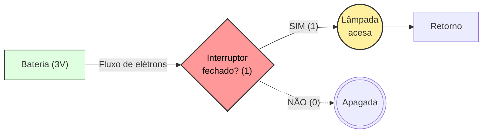
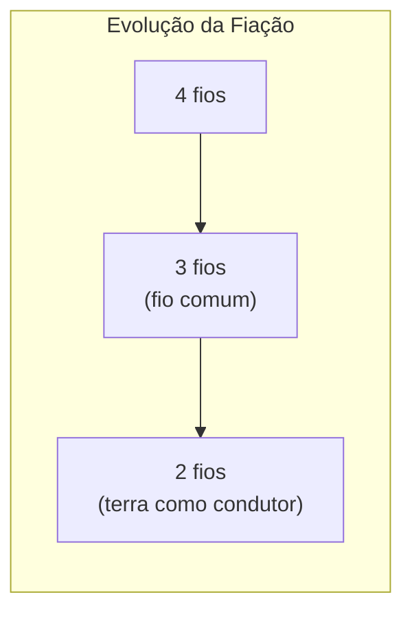
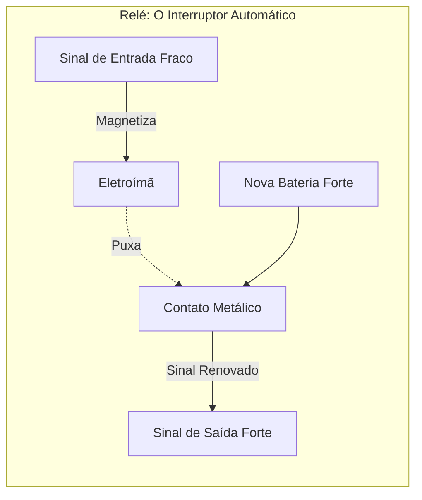
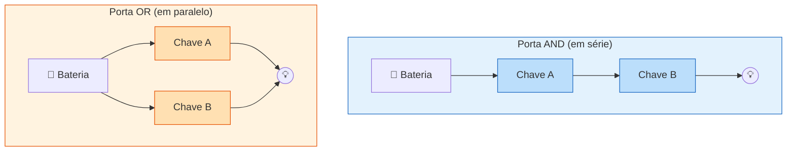
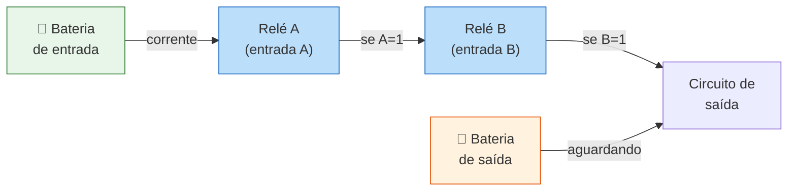
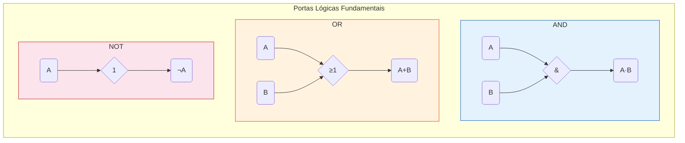

+++
title = "Petzold02 - A Linguagem Oculta do Hardware"
description = "Como interruptores, relés e álgebra booleana deram origem aos computadores"
date = 2026-05-12T18:40:00-03:00
tags = ["hardware", "portas lógicas", "álgebra booleana", "história", "computação"]
draft = true
weight = 1
author = "Vitor Lobo Ramos"
+++

No [artigo anterior](/post/histcomp01) vimos que informação pode ser codificada em padrões binários — pontos e traços no Morse, pontos em relevo no Braille, bits 0 e 1 no ASCII. Mas codificar é só metade da história. A pergunta agora é: como construir uma máquina que **processa** fisicamente esses 0s e 1s?

A resposta começa com uma lanterna.

## A Anatomia de uma Lanterna e a Dança dos Elétrons

Uma lanterna comum é um dos aparelhos elétricos mais simples que existem. Desmonte-a e você encontrará baterias, uma lâmpada, algumas peças de metal e, o mais importante, um **interruptor**.

### O que é Eletricidade, de Fato?

Toda matéria é feita de [átomos](https://pt.wikipedia.org/wiki/Átomo), e cada átomo é como um sistema solar em miniatura: um núcleo de **[nêutrons](https://pt.wikipedia.org/wiki/Nêutron)** (sem carga) e **[prótons](https://pt.wikipedia.org/wiki/Próton)** (carga positiva), orbitado por **[elétrons](https://pt.wikipedia.org/wiki/Elétron)** (carga negativa). Todos os elétrons do universo são idênticos e indistinguíveis entre si.

Em condições normais, cada átomo tem o mesmo número de prótons e elétrons, mantendo-se eletricamente neutro. Mas se um átomo perde um elétron, ele fica positivamente carregado e tentará roubar um elétron de um átomo vizinho. Este, por sua vez, roubará de outro, e assim por diante. Uma **corrente elétrica** é exatamente isso: um efeito cascata de elétrons sendo passados de átomo em átomo através de um material condutor. Os elétrons não percorrem o fio inteiro como bolas de gude num cano, eles empurram seus vizinhos, que empurram os próximos, num efeito dominó quase instantâneo.

Há uma diferença crucial entre dois tipos de eletricidade:

* **Eletricidade estática:** Um desequilíbrio momentâneo de elétrons tentando se corrigir. É o choque ao tocar uma maçaneta, ou um raio durante uma tempestade. A carga se acumula e se descarrega de uma vez.
* **Eletricidade em circuito:** Um fluxo contínuo e controlado de elétrons através de um caminho fechado (fios e componentes). É o que alimenta sua lanterna e seu computador.

No circuito, os elétrons viajam do terminal **negativo** da bateria para o terminal **positivo** (sentido anti-horário no diagrama). Por convenção histórica, a engenharia desenha a corrente no sentido oposto (do positivo para o negativo), mas a realidade física é que os elétrons vão do negativo para o positivo.

### Tensão, Corrente e Resistência


Para entender esse fluxo, usamos a analogia clássica da água encanada:

* **[Tensão](https://pt.wikipedia.org/wiki/Tensão_elétrica) (Volts - E):** É a "pressão" da água. Uma bateria tem o potencial de realizar trabalho, como uma caixa d'água no alto de um prédio.
* **[Corrente](https://pt.wikipedia.org/wiki/Corrente_elétrica) (Amperes - I):** É a quantidade de água (elétrons) fluindo pelo cano.
* **[Resistência](https://pt.wikipedia.org/wiki/Resistência_elétrica) (Ohms - R):** É o "estreitamento" do cano. Quanto mais fino ou mais longo o cano, maior a resistência, menos água passa.

A famosa [Lei de Ohm](https://pt.wikipedia.org/wiki/Lei_de_Ohm) conecta essas grandezas:

**I = E / R**

Quanto maior a resistência, menor a corrente. É por isso que fios muito longos não conseguem acender uma lâmpada no outro extremo.

### A Lâmpada Incandescente

Embora [Thomas Edison](https://pt.wikipedia.org/wiki/Thomas_Edison) costume levar o crédito, foi o britânico [Joseph Swan](https://pt.wikipedia.org/wiki/Joseph_Swan) quem de fato inventou a lâmpada incandescente prática. Dentro do bulbo de vidro há um fino **[filamento de tungstênio](https://pt.wikipedia.org/wiki/Tungstênio)** que brilha quando aquecido pela passagem de corrente elétrica. O bulbo é preenchido com um **gás inerte** ([argônio](https://pt.wikipedia.org/wiki/Árgon) ou [nitrogênio](https://pt.wikipedia.org/wiki/Nitrogénio)) para evitar que o filamento entre em combustão e queime instantaneamente ao entrar em contato com o oxigênio.

O filamento de uma lâmpada comum tem uma resistência de aproximadamente **4 ohms** quando frio (a resistência aumenta quando o filamento aquece). É essa resistência que transforma energia elétrica em luz e calor.

### Potência, Baterias e Curto-Circuito

A potência consumida por um componente é dada pela **[Lei de Watt](https://pt.wikipedia.org/wiki/James_Watt)** (homenagem a [James Watt](https://pt.wikipedia.org/wiki/James_Watt), o inventor da [máquina a vapor](https://pt.wikipedia.org/wiki/Máquina_a_vapor)):

**P = R × I²**

Ou seja, a potência (em Watts) é a resistência multiplicada pelo quadrado da corrente. Um filamento de 4 ohms com 0,5 amperes dissipa 1 Watt.

Quanto às baterias, a forma como você as conecta muda completamente o comportamento do circuito:

* **Em série:** As tensões se somam. Duas pilhas de 1,5V em série fornecem **3V**, com a mesma duração de uma só.
* **Em paralelo:** A tensão permanece **1,5V**, mas a duração **dobra**, pois cada pilha contribui com metade da corrente.

Se você conectar o fio positivo diretamente ao negativo sem nenhuma resistência no caminho (resistência ≈ 0), a corrente dispara para valores altíssimos (I = E / R, e R é quase zero). Isso é um **curto-circuito**: o fio esquenta, pode brilhar e até derreter. É por isso que **[fusíveis](https://pt.wikipedia.org/wiki/Fusível)** e **[disjuntores](https://pt.wikipedia.org/wiki/Disjuntor)** existem, para interromper o circuito antes que o fio vire um incêndio.

### O Interruptor: A Primeira Porta Lógica

Com tudo conectado, para que a lâmpada brilhe, o caminho da bateria até a lâmpada e de volta à bateria deve ser contínuo. É um **circuito** (um círculo). O papel do interruptor é quebrar ou completar esse círculo.

Aqui há uma pegadinha de terminologia que confunde iniciantes: em eletrônica, uma chave **fechada** (*closed*) permite o fluxo de eletricidade, enquanto uma chave **aberta** (*open*) impede o fluxo. É o oposto da intuição com portas físicas, onde uma porta fechada bloqueia a passagem e uma aberta permite.

O interruptor é puramente **binário**: ligado ou desligado, 1 ou 0, sem meio-termo. Dentro de um chip moderno, bilhões de interruptores microscópicos (transistores) fazem exatamente a mesma coisa, apenas muito menores e muito mais rápidos.



## Telégrafos, Relés e a Comunicação a Distância

Imagine que você queira usar lanternas para se comunicar em código Morse com um vizinho, mas as janelas de vocês não se alinham. A solução? Estender os fios da sua bateria até a lâmpada no quarto dele.

Mas há um problema: fios longos têm resistência. Um fio de cobre de [bitola 20 AWG](https://pt.wikipedia.org/wiki/American_wire_gauge) (típico de instalações elétricas) tem cerca de 10 ohms de resistência a cada 300 metros. Se a casa do vizinho estiver a 1,5 km, o fio terá mais de **100 ohms** de resistência. Pela Lei de Ohm (I = 3V / 100Ω = 0,03A), uma bateria de 3V mal conseguiria gerar corrente suficiente para fazer uma lâmpada de 4 ohms brilhar. Por isso o telégrafo não usava lâmpadas: em vez disso, usava **[eletroímãs](https://pt.wikipedia.org/wiki/Eletroímã)** que emitiam "cliques" audíveis, dispositivos que exigem muito menos corrente para operar.

### Reduzindo Custos: A Evolução da Fiação

Entre duas casas, o sistema mais simples usa **4 fios**: dois circuitos completos e independentes (um para enviar, outro para receber). Mas engenheiros logo perceberam que os terminais negativos de ambas as baterias poderiam compartilhar um único fio **comum** (*common*), reduzindo o sistema para **3 fios**, uma economia de 25% em cobre.

Pode-se reduzir ainda mais? Sim. O planeta Terra é um condutor massivo de eletricidade. Enterrando uma haste de cobre no solo em cada extremidade e conectando o fio comum a elas, o **solo** passa a completar o circuito. Agora bastam **2 fios** entre as casas.



### O Conceito de Terra (Ground)

O **[aterramento](https://pt.wikipedia.org/wiki/Terra_(eletricidade))** é um dos conceitos mais importantes da engenharia elétrica. A terra é considerada um ponto de **potencial zero** (0 volts), um oceano virtualmente infinito de elétrons onde a adição ou remoção de alguns não altera o nível total. É como despejar um balde d'água no oceano: o volume do oceano não muda de forma mensurável.

O símbolo clássico de aterramento são três linhas horizontais decrescentes:

```
───
──
─
```

Quando o terminal negativo da bateria está conectado à terra, o terminal positivo pode ser representado simplesmente por um **V** (de *Voltage*), já que a referência de potencial zero está implícita.

### O Relé: Amplificando o Sinal

Mesmo com 2 fios, a resistência em longas distâncias continua sendo um problema. Foi exatamente esse o desafio enfrentado na criação do [telégrafo](https://pt.wikipedia.org/wiki/Telégrafo). A solução genial foi o **[Relé](https://pt.wikipedia.org/wiki/Relé)** (Relay).


Um relé é um interruptor acionado pela própria *eletricidade*. Ele usa um **eletroímã**, uma bobina de fio que se comporta como um ímã quando a corrente passa por ela. Quando a corrente fraca do sinal original entra no eletroímã, ele magnetiza uma barra de ferro, que puxa um contato metálico, fechando um segundo circuito alimentado por uma bateria nova e forte.



O relé permitiu que o sinal do telégrafo cruzasse continentes, sendo "amplificado" (retransmitido) de estação em estação.

### Comunicação Bidirecional

Com este sistema de 2 fios e relés, ambas as casas podem **enviar e receber** mensagens simultaneamente pela mesma infraestrutura física compartilhada. Cada lado tem seu próprio eletroímã receptor que emite cliques quando a outra parte fecha seu interruptor. É o início da **comunicação bidirecional** ([*full-duplex*](https://pt.wikipedia.org/wiki/Duplex_(telecomunicações))), o mesmo princípio que permite que você baixe um arquivo enquanto envia um email pelo mesmo cabo de rede.

Mas a verdadeira revolução do relé ocorreu quando engenheiros perceberam que, se a eletricidade pode controlar interruptores, podemos construir máquinas que processam **lógica**.

## A Álgebra de Boole

Em 1854, o matemático inglês [George Boole](https://pt.wikipedia.org/wiki/George_Boole) publicou *Uma Investigação das Leis do Pensamento*. Seu objetivo não tinha nada a ver com computadores ou circuitos elétricos — a eletricidade mal era utilizável na época. Boole queria capturar as **leis do raciocínio humano** em forma matemática.

O insight de Boole foi tratar conceitos como **conjuntos**. Imagine que a variável *x* represente o conjunto de todos os gatos, e *y* represente o conjunto de todos os cães. Então:

* **x × y (interseção):** O conjunto do que é simultaneamente gato E cão. Resultado: conjunto vazio. Assim como 0 × 1 = 0 na multiplicação comum, a interseção de dois conjuntos sem sobreposição é vazia.
* **x + y (união):** O conjunto do que é gato OU cão. Resultado: todos os gatos e todos os cães. A união acumula membros, assim como a adição acumula quantidades.

Boole percebeu que poderia aplicar essa lógica a **proposições** (afirmações que são verdadeiras ou falsas), criando uma álgebra completa com regras consistentes. Eis as três operações fundamentais:

* **AND (E)** equivale à interseção/multiplicação: 0·0=0, 0·1=0, 1·1=1. O resultado só é 1 quando *todos* os fatores são 1.
* **OR (OU)** equivale à união/adição, com uma diferença crucial: 1+1=1 (em vez de 2, porque a união de um conjunto consigo mesmo não cria membros novos). O resultado é 1 quando *qualquer* operando é 1.
* **NOT (NÃO)** é o complemento: 0 vira 1, 1 vira 0. O que está fora do conjunto.


O brilho da engenharia veio em 1938, quando [Claude Shannon](https://pt.wikipedia.org/wiki/Claude_Shannon), então um estudante de mestrado no MIT, escreveu uma tese provando que a álgebra de Boole — aquela matemática obscura do século XIX sobre gatos, cães e proposições lógicas — mapeava perfeitamente para o comportamento de relés e circuitos elétricos. Foi Shannon quem percebeu que um relé energizado é 1, um relé desenergizado é 0, e que conectar relés em série e paralelo produz exatamente as operações AND e OR da álgebra booleana.

Veja como dois interruptores podem implementar AND e OR:

### Conexão em Série (A Porta AND)

Se ligarmos dois interruptores um após o outro (em série), a lâmpada só acenderá se o Interruptor A **E** o Interruptor B estiverem fechados. Se qualquer um estiver aberto, o circuito se quebra e a lâmpada apaga. Isso é uma multiplicação booleana (A, B): o resultado só é 1 (aceso) quando ambos os fatores são 1.

### Conexão em Paralelo (A Porta OR)

Se ligarmos os interruptores lado a lado (em paralelo), a corrente terá dois caminhos possíveis. A lâmpada acenderá se o Interruptor A **OU** o Interruptor B estiver fechado (ou ambos). Isso é uma adição booleana (A + B): basta um dos operandos ser 1 para o resultado ser 1.



## O Nascimento das Portas Lógicas

Como os relés podem atuar como interruptores controlados por eletricidade, podemos substituir os interruptores manuais por relés em cascata. Isso cria o que chamamos de **Portas Lógicas** (Logic Gates), os blocos fundamentais de construção de qualquer computador.

O diagrama abaixo mostra como dois relés ligados **em série** implementam a porta AND: a corrente só chega à saída se o Relé A **E** o Relé B estiverem energizados simultaneamente.



Antes de mergulharmos nas tabelas verdade com 0 e 1, vale a pena fazer uma **transição gradual**. A mesma porta lógica pode ser descrita em três níveis de abstração, do mais físico ao mais abstrato:

| Chave A | Chave B | Circuito (AND) | Lâmpada | Lógico (0/1) |
|:---:|:---:|:---:|:---:|:---:|
| Aberta | Aberta | Interrompido | Apagada | 0 |
| Aberta | Fechada | Interrompido | Apagada | 0 |
| Fechada | Aberta | Interrompido | Apagada | 0 |
| Fechada | Fechada | Completo | **Acesa** | **1** |

O que Shannon percebeu é que as três colunas da direita — Circuito, Lâmpada, e 0/1 — são intercambiáveis. O relé não "sabe" se está representando um bit, uma proposição lógica ou um conjunto; ele simplesmente conduz ou bloqueia corrente. A **interpretação** é nossa.

Aqui estão as portas primárias com suas tabelas verdade:

1. **AND (E):** Dois relés em série. A saída só é 1 se *todas* as entradas forem 1.

| Entrada A | Entrada B | Saída (A AND B) |
|:---:|:---:|:---:|
| 0 | 0 | 0 |
| 0 | 1 | 0 |
| 1 | 0 | 0 |
| 1 | 1 | **1** |

2. **OR (OU):** Dois relés em paralelo. A saída é 1 se *qualquer* entrada for 1.

| Entrada A | Entrada B | Saída (A OR B) |
|:---:|:---:|:---:|
| 0 | 0 | 0 |
| 0 | 1 | **1** |
| 1 | 0 | **1** |
| 1 | 1 | **1** |

3. **NOT (Inversor):** Enquanto a AND e a OR usam contatos que fecham quando o eletroímã é ativado, a NOT usa um contato que *abre* quando ativado. Se a entrada tem corrente (1), o eletroímã puxa o contato e corta a corrente na saída, gerando 0. Ele simplesmente inverte o sinal.

| Entrada | Saída (NOT A) |
|:---:|:---:|
| 0 | **1** |
| 1 | **0** |

### Portas Universais: NAND e NOR

Combinando um inversor (NOT) com uma porta AND ou OR, obtemos as portas **NAND** e **NOR**, regidas pelas **[Leis de Morgan](https://pt.wikipedia.org/wiki/Leis_de_De_Morgan)**:

**¬(A ∧ B) = ¬A ∨ ¬B** (Não ser A e B é o mesmo que Não A ou Não B)

**¬(A ∨ B) = ¬A ∧ ¬B** (Não ser A ou B é o mesmo que Não A e Não B)

Estas leis não são apenas curiosidade teórica, elas permitem **simplificar circuitos**. Por exemplo, suponha que você queira um circuito que acenda uma lâmpada quando A=1 e B=0. A expressão é S = A ∧ ¬B. Usando De Morgan, podemos reescrever ¬(A ∧ ¬B) = ¬A ∨ B, o que significa que S = ¬(¬A ∨ B), uma expressão que pode ser implementada com apenas portas NOR, que são mais baratas de fabricar que AND + NOT separados.

Na prática, isso significa:

| Entrada A | Entrada B | NAND (¬(A∧B)) | NOR (¬(A∨B)) |
|:---:|:---:|:---:|:---:|
| 0 | 0 | **1** | **1** |
| 0 | 1 | **1** | 0 |
| 1 | 0 | **1** | 0 |
| 1 | 1 | 0 | 0 |

Isso não é só teoria, na engenharia, se você tiver apenas relés configurados como portas NAND (ou NOR), pode construir literalmente todas as outras portas combinando-as.



### 🔧 Exercícios

**1. Complete a tabela verdade** para a porta **NAND** (NOT AND) e **NOR** (NOT OR). Use as Leis de De Morgan para verificar suas respostas.

| A | B | A NAND B | A NOR B |
|---|---|---|---|
| 0 | 0 | ? | ? |
| 0 | 1 | ? | ? |
| 1 | 0 | ? | ? |
| 1 | 1 | ? | ? |

**2. Aplicando De Morgan:** Simplifique a expressão ¬(A ∨ B) usando apenas portas AND e NOT. (Dica: por onde começar?)

**3. Projetando lógica:** Você quer um circuito que acenda uma lâmpada apenas quando o interruptor A estiver ligado **E** o interruptor B estiver desligado. Escreva a expressão booleana e desenhe o circuito com portas AND, OR e NOT.

**4. Portas universais:** Projetar um inversor (NOT) usando apenas portas NAND. *(Dica: o que acontece se você ligar as duas entradas de uma NAND juntas?)*

<details>
<summary><b>Respostas</b></summary>

1. NAND: 1, 1, 1, 0. NOR: 1, 0, 0, 0.
2. ¬(A ∨ B) = ¬A ∧ ¬B (segunda lei de De Morgan). Isto é: "Não ser (A ou B) é o mesmo que (Não A) e (Não B)".
3. Expressão: S = A ∧ ¬B. Implementação: use uma porta NOT para inverter B e uma porta AND para combinar A com ¬B.
4. Ligue as duas entradas da NAND juntas: se A=0, NAND(0,0)=1; se A=1, NAND(1,1)=0. A NAND com entradas curto-circuitadas funciona exatamente como um inversor.
</details>

---

## Conclusão: Da Lanterna ao Computador

No [primeiro artigo](/post/histcomp01), vimos que qualquer informação pode ser reduzida a sequências de 0s e 1s — Morse, Braille, ASCII, todos são códigos binários. A pergunta natural era: como uma máquina **processa** esses símbolos?

A resposta: com interruptores. A lanterna nos ensinou que um circuito fechado (1) permite o fluxo de elétrons; um circuito aberto (0) o bloqueia. O telégrafo nos mostrou como estender esse princípio por quilômetros usando o relé — um interruptor controlado por eletricidade, não por dedos humanos. E ao organizar relés em série (AND) ou em paralelo (OR), materializamos a Álgebra de Boole em hardware físico.

Agora sabemos duas coisas: informação pode ser codificada como bits; e bits podem ser processados por portas lógicas feitas de interruptores. Mas nossos circuitos até aqui só manipulam **um único bit** — ligado ou desligado, 1 ou 0. Como representar o número 5? E o 42? E um bilhão?

No próximo artigo abandonaremos nossos dez dedos e mergulharemos nos sistemas de numeração que os computadores realmente usam: binário, hexadecimal, e a organização de bits em bytes e palavras. A álgebra de Boole já está pronta para processar os sinais; agora precisamos de números para alimentá-la.

---

**Fonte:** [Code: The Hidden Language of Computer Hardware and Software](https://a.co/d/0a3DsSsn), 2ª ed., Charles Petzold
