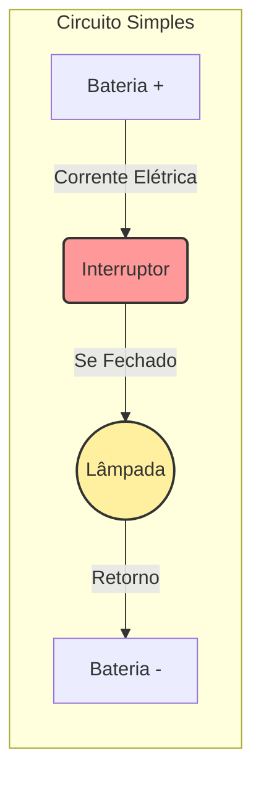
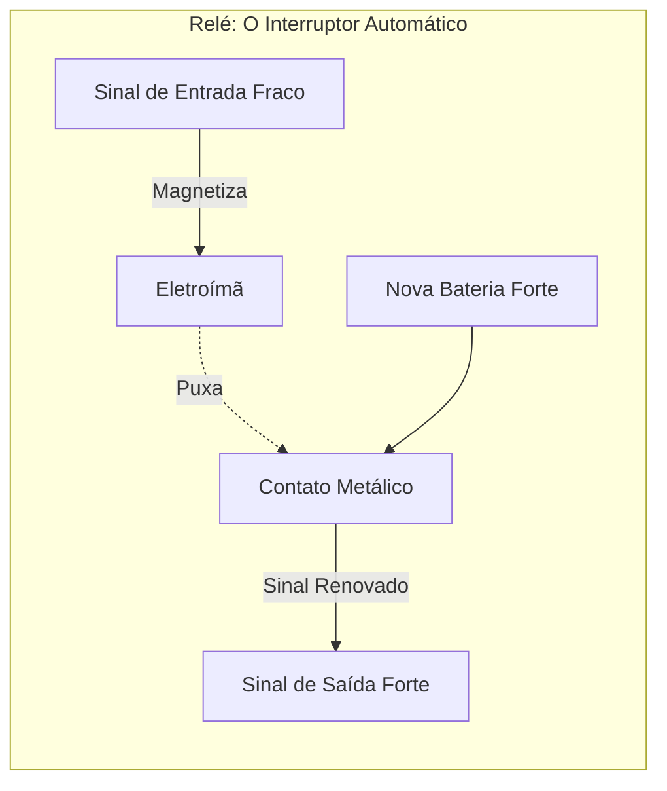
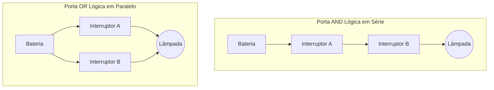
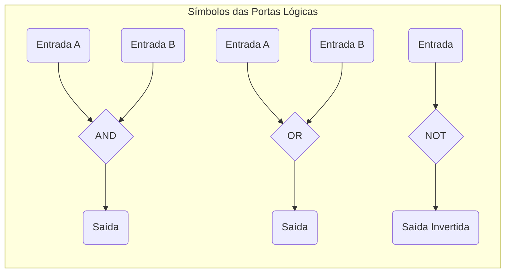

+++
title = "Base02 - A Linguagem Oculta do Hardware"
description = "Como interruptores, relés e álgebra booleana deram origem aos computadores"
date = 2026-05-12T18:40:00-03:00
tags = ["hardware", "portas lógicas", "álgebra booleana", "história", "computação"]
draft = true
weight = 1
author = "Vitor Lobo Ramos"
+++

Os computadores parecem caixas mágicas, mas em seu núcleo absoluto, eles operam sob princípios incrivelmente simples e tangíveis. Para compreender como a eletricidade se transforma em lógica e, eventualmente, em computação, precisamos dar um passo atrás. Vamos esquecer os microprocessadores por um momento e olhar para algo muito mais simples: uma lanterna.

## A Anatomia de uma Lanterna e a Dança dos Elétrons

Uma lanterna comum é um dos aparelhos elétricos mais simples que existem. Desmonte-a e você encontrará baterias, uma lâmpada, algumas peças de metal e, o mais importante, um **interruptor**. A eletricidade não é magia; é o fluxo de [elétrons](https://pt.wikipedia.org/wiki/Elétron) através de materiais condutores (como o cobre). Para entender esse fluxo, precisamos da analogia clássica da água encanada, definida por três grandezas fundamentais:

* **[Tensão](https://pt.wikipedia.org/wiki/Tensão_elétrica) (Volts - E):** É a "pressão" da água. Uma bateria tem o potencial de realizar trabalho (como uma caixa d'água no alto de um prédio).
* **[Corrente](https://pt.wikipedia.org/wiki/Corrente_elétrica) (Amperes - I):** É a quantidade de água (elétrons) fluindo pelo cano.
* **[Resistência](https://pt.wikipedia.org/wiki/Resistência_elétrica) (Ohms - R):** É o "estreitamento" do cano. Quanto mais fino ou mais longo o cano, maior a resistência — menos água passa. O mesmo vale para os fios: fios mais longos ou mais finos oferecem maior resistência à corrente.

A famosa [Lei de Ohm](https://pt.wikipedia.org/wiki/Lei_de_Ohm) conecta essas grandezas matematicamente:

**I = E / R**

Em português: a corrente (I) é igual à tensão (E) dividida pela resistência (R). Na prática, quanto maior a resistência, menor a corrente — por isso fios muito longos não conseguem acender uma lâmpada no outro extremo.

Para que a lâmpada brilhe, o caminho da bateria até a lâmpada e de volta à bateria deve ser contínuo. É um **circuito** (um círculo). O papel do interruptor é simplesmente quebrar ou completar esse círculo. Ele é puramente binário: ligado ou desligado. Sem meio-termo.

## Telégrafos, Relés e a Comunicação a Distância

Imagine que você queira usar lanternas para se comunicar em código Morse com um vizinho, mas as janelas de vocês não se alinham. A solução? Estender os fios da sua bateria até a lâmpada no quarto dele.

No entanto, fios muito longos possuem muita resistência. Se você esticar um fio por quilômetros, a corrente elétrica (I) cairá drasticamente, e a lâmpada não acenderá. Foi exatamente esse o problema enfrentado na criação do [telégrafo](https://pt.wikipedia.org/wiki/Telégrafo). A solução genial para isso foi o **[Relé](https://pt.wikipedia.org/wiki/Relé)** (Relay).

Um relé é essencialmente um interruptor, mas em vez de ser acionado por um dedo humano, ele é acionado pela própria *eletricidade*. Ele usa um [eletroímã](https://pt.wikipedia.org/wiki/Eletroímã): quando uma corrente fraca entra, ela magnetiza uma barra de ferro, que puxa um contato metálico, fechando um segundo circuito alimentado por uma bateria nova e forte.

O relé permitiu que o sinal do telégrafo cruzasse continentes, sendo "amplificado" (retransmitido) de estação em estação. Mas a verdadeira revolução do relé ocorreu quando engenheiros perceberam que, se a eletricidade pode controlar interruptores, podemos construir máquinas que processam **lógica**.

## A Álgebra de Boole

No século XIX, o matemático [George Boole](https://pt.wikipedia.org/wiki/George_Boole) inventou uma forma de álgebra onde os operandos não são números (como 3 ou 5), mas sim *classes* (verdadeiro/falso, 1 ou 0). Na [Álgebra Booleana](https://pt.wikipedia.org/wiki/Álgebra_booliana), operamos com conceitos como **E** (AND) e **OU** (OR). O brilho da engenharia foi perceber que circuitos elétricos são a manifestação física perfeita dessa álgebra. Veja como:

### Conexão em Série (A Porta AND)

Se ligarmos dois interruptores um após o outro (em série), a lâmpada só acenderá se o Interruptor A **E** o Interruptor B estiverem fechados. Se qualquer um estiver aberto, o circuito se quebra e a lâmpada apaga. Isso é uma multiplicação booleana (A × B): o resultado só é 1 (aceso) quando ambos os fatores são 1.

### Conexão em Paralelo (A Porta OR)

Se ligarmos os interruptores lado a lado (em paralelo), a corrente terá dois caminhos possíveis. A lâmpada acenderá se o Interruptor A **OU** o Interruptor B estiver fechado (ou ambos). Isso é uma adição booleana (A + B): basta um dos operandos ser 1 para o resultado ser 1.

## O Nascimento das Portas Lógicas

Como os relés podem atuar como interruptores controlados por eletricidade, podemos substituir os interruptores manuais por relés em cascata. Isso cria o que chamamos de **Portas Lógicas** (Logic Gates), os blocos fundamentais de construção de qualquer computador. Aqui estão as portas primárias:

1. **AND (E):** Dois relés em série. A saída só é 1 se *todas* as entradas forem 1.

| Entrada A | Entrada B | Saída (A AND B) |
|:---:|:---:|:---:|
| 0 | 0 | 0 |
| 0 | 1 | 0 |
| 1 | 0 | 0 |
| 1 | 1 | **1** |

2. **OR (OU):** Dois relés em paralelo. A saída é 1 se *qualquer* entrada for 1.

| Entrada A | Entrada B | Saída (A OR B) |
|:---:|:---:|:---:|
| 0 | 0 | 0 |
| 0 | 1 | **1** |
| 1 | 0 | **1** |
| 1 | 1 | **1** |

3. **NOT (Inversor):** Enquanto a AND e a OR usam contatos que fecham quando o eletroímã é ativado, a NOT usa um contato que *abre* quando ativado. Se a entrada tem corrente (1), o eletroímã puxa o contato e corta a corrente na saída, gerando 0. Ele simplesmente inverte o sinal.

| Entrada | Saída (NOT A) |
|:---:|:---:|
| 0 | **1** |
| 1 | **0** |

### Portas Universais: NAND e NOR

Combinando um inversor (NOT) com uma porta AND ou OR, obtemos as portas **NAND** e **NOR**. Elas têm um comportamento fascinante regido pelas **[Leis de De Morgan](https://pt.wikipedia.org/wiki/Leis_de_De_Morgan)**:

Em português, a primeira lei diz: "Não ser (A e B) é o mesmo que (Não A) ou (Não B)". A segunda: "Não ser (A ou B) é o mesmo que (Não A) e (Não B)". Em símbolos:

**¬(A ∧ B) = ¬A ∨ ¬B**

**¬(A ∨ B) = ¬A ∧ ¬B**

Na prática, isso significa:

| Entrada A | Entrada B | NAND (¬(A∧B)) | NOR (¬(A∨B)) |
|:---:|:---:|:---:|:---:|
| 0 | 0 | **1** | **1** |
| 0 | 1 | **1** | 0 |
| 1 | 0 | **1** | 0 |
| 1 | 1 | 0 | 0 |

Isso não é só teoria — na engenharia, se você tiver apenas relés configurados como portas NAND (ou NOR), pode construir literalmente todas as outras portas combinando-as.

---

## Conclusão: Da Lanterna ao Computador

A lanterna nos ensinou que um circuito fechado permite o fluxo de elétrons. O telégrafo nos introduziu ao relé, um interruptor controlado remotamente. Ao organizar esses relés em série ou em paralelo, materializamos a Álgebra de Boole em hardware físico.

Quando você digita no seu teclado ou clica em uma tela hoje, bilhões de minúsculos interruptores ([transistores](https://pt.wikipedia.org/wiki/Transístor) modernos, que substituíram os antigos relés barulhentos) estão abrindo e fechando de acordo com essas exatas mesmas regras fundamentais de AND, OR e NOT. Toda a complexidade da computação moderna, do seu smartphone aos servidores na nuvem, é apenas uma orquestração maciça dessas operações lógicas incrivelmente simples — a mesma lógica que começou com uma lanterna, alguns fios e um interruptor. Agora que o hardware sabe como pensar em termos de 0 e 1, a pergunta seguinte é inevitável: como representar números maiores que 1 nessa linguagem de dois estados?

---

**Fonte:** [Code: The Hidden Language of Computer Hardware and Software](https://a.co/d/0a3DsSsn), 2ª ed. — Charles Petzold
