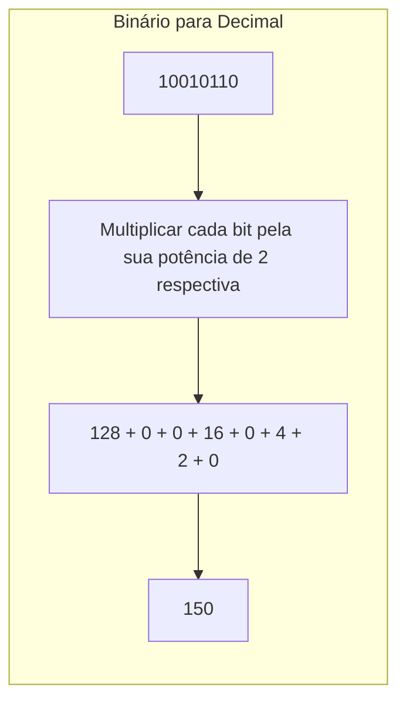
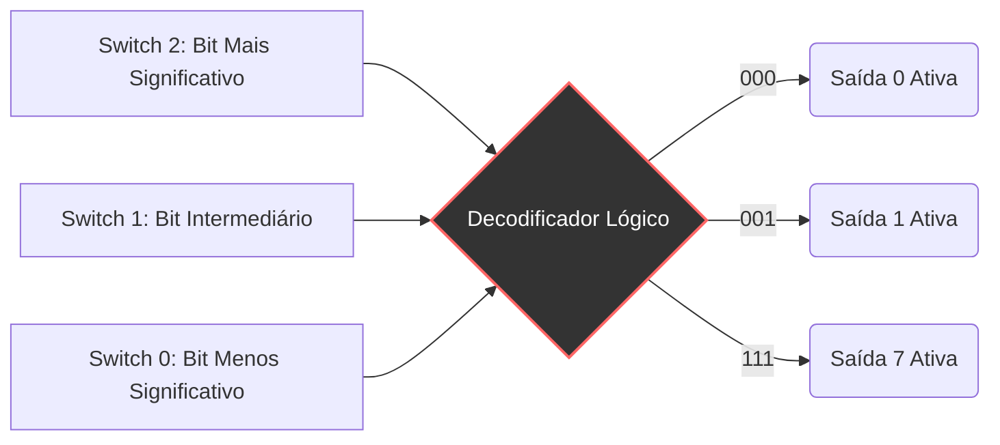

+++
title = "Base03 - Dos nossos dez dedos aos Bits e Bytes"
description = "Sistemas de numeração, binário e hexadecimal para computação"
date = 2026-05-12T18:40:00-03:00
tags = ["numeração", "binário", "hexadecimal", "bits", "história", "computação"]
draft = true
weight = 1
author = "Vitor Lobo Ramos"
+++

A ideia de que a linguagem é apenas um código é facilmente aceitável para a maioria de nós. Sabemos que o animal que chamamos de "gato" pode ser *cat*, *chat*, *Katze*, *кошка* ou *γάτα* dependendo do idioma. Os números, no entanto, parecem menos maleáveis culturalmente. A matemática é frequentemente chamada de "linguagem universal" porque, independentemente de como pronunciamos, escrevemos nossos algarismos da mesma forma em quase todo o planeta: **0, 1, 2, 3, 4, 5, 6, 7, 8, 9**.

Mas será que o nosso sistema numérico tem algo de intrinsecamente mágico ou especial? A verdade é que a fundação de toda a computação moderna exige que abandonemos o nosso apego ao número dez.

## 1. A Ilusão da Base 10

Os números são abstrações puras. Quando vemos o símbolo **3**, não precisamos relacioná-lo imediatamente a 3 maçãs. Pode ser um canal de televisão, um dia do mês ou o número de xícaras em uma receita.

Historicamente, os números foram inventados para contar posses e transações. Se alguém tivesse quatro patos, desenhava quatro patos. Eventualmente, para simplificar, usaram-se marcas ou riscos. E quando alguém tinha 27 patos? Fazer 27 riscos era inviável. Foi assim que os sistemas numéricos evoluíram.

A maioria dos sistemas antigos, como os numerais romanos, era péssima para matemática avançada. Experimente multiplicar `MCMLIII` por `XIV`. O sistema que usamos hoje, o **[Hindu-Arábico](https://pt.wikipedia.org/wiki/Sistema_de_numeração_hindu-arábico)**, revolucionou a matemática por três motivos:

1. **Notação Posicional:** A posição do dígito altera seu valor. O "1" em 100 vale muito mais que o "1" em 10.
2. **Ausência de um Símbolo para Dez:** O dez é representado por dois dígitos (1 e 0), mudando a posição do 1.
3. **O Zero:** A invenção do zero é um dos maiores marcos da história. Ele serve como marcador de posição, permitindo distinguir instantaneamente 25, 205 e 250, facilitando imensamente a multiplicação e a divisão.

A estrutura do nosso sistema decimal (base 10) é baseada em potências de dez. O número 4825, por exemplo, é lido e decomposto matematicamente como:

**4825 = 4 × 10³ + 8 × 10² + 2 × 10¹ + 5 × 10⁰**

> **Curiosidade:** Usamos a base 10 puramente por um acidente anatômico: temos dez dedos nas mãos. Se fôssemos personagens de desenhos animados com apenas quatro dedos em cada mão, acharíamos perfeitamente natural usar um sistema de base 8.

---

## 2. Bases Alternativas: Octal e Quaternário

Se fôssemos personagens de desenho animado e contássemos na base 8 (Sistema Octal), os símbolos **8** e **9** simplesmente não existiriam. A contagem seria: `0, 1, 2, 3, 4, 5, 6, 7...` e, ao esgotarmos os símbolos, passaríamos para o **10** (que equivaleria ao nosso 8 decimal).

O sistema octal possui a mesma estrutura posicional, mas usa potências de 8:

**3725₈ = 3 × 8³ + 7 × 8² + 2 × 8¹ + 5 × 8⁰**

Se fôssemos lagostas e usássemos apenas nossas duas pinças principais para contar, usaríamos a base 4 (Sistema Quaternário), contando com os dígitos `0, 1, 2, 3`. E se fôssemos golfinhos, contando apenas com duas nadadeiras? Chegaríamos à base da computação moderna.

---

## 3. A Linguagem dos Computadores: O Sistema Binário

O sistema binário (base 2) usa apenas dois dígitos: **0** e **1**. O maior problema do binário é que esgotamos os dígitos rapidamente. A contagem é assim: `0, 1, 10, 11, 100, 101, 110, 111, 1000...`

Os números binários ficam longos muito depressa, mas sua estrutura posicional segue as potências de 2:

**1101₂ = 1 × 2³ + 1 × 2² + 0 × 2¹ + 1 × 2⁰ = 13₁₀**

### Convertendo Binário para Decimal e Vice-Versa

Para converter decimal para binário, fazemos divisões sucessivas pelo maior valor de potência de 2 possível, anotando os quocientes (que serão sempre 0 ou 1) e passando o resto adiante.

---

## 4. O "Bit": A Menor Unidade de Informação

A palavra **[bit](https://pt.wikipedia.org/wiki/Bit)** foi cunhada pelo matemático [John Tukey](https://en.wikipedia.org/wiki/John_Tukey) na década de 1940 como uma contração de *binary digit* (dígito binário).

Um bit é a menor quantidade possível de informação: uma escolha entre duas alternativas mutuamente exclusivas. Sim ou Não. Verdadeiro ou Falso. Luz acesa ou apagada. Quando Paul Revere precisou saber como os britânicos atacariam, usou lanternas:

* 1 lanterna = por terra
* 2 lanternas = pelo mar
* Nenhuma lanterna = sem ataque

Com múltiplos bits, aumentamos exponencialmente a quantidade de possibilidades (2ⁿ).

* **1 bit:** 2 estados (0, 1)
* **2 bits:** 4 estados (00, 01, 10, 11)
* **3 bits:** 8 estados (000 a 111)
* **8 bits:** 256 estados

### Decodificadores: Conectando Lógica e Hardware

Na eletrônica, agrupamentos de bits controlam circuitos físicos através de portas lógicas (AND, OR, NOT). Um decodificador *3-to-8* lê 3 interruptores (bits) e ilumina 1 de 8 lâmpadas (estados).

---

## 5. Bits no Mundo Real: Código de Barras e QR Code

Bits não estão apenas nos fios. Eles estão ao nosso redor em representações físicas.

### O Código de Barras (UPC)

O **[Código de Barras](https://pt.wikipedia.org/wiki/Código_de_barras) (UPC)** que vemos nos supermercados é uma string de 95 bits. O scanner não lê números; ele lê uma fatia horizontal onde:

* **Barra Preta Fina** = `1`
* **Espaço Branco Fino** = `0`
* **Barras mais grossas** = `11`, `111` ou `1111`

O UPC utiliza **bits de paridade** (garantindo número par ou ímpar de uns) e padrões de guarda (nas pontas e no centro, ex: `101`) para permitir a leitura de trás para frente e garantir consistência, evitando adulterações simples com uma caneta preta.

### QR Codes

O [QR Code](https://pt.wikipedia.org/wiki/Código_QR) move os bits para duas dimensões. Quadrados pretos são `1` e brancos são `0`. Ele possui:

1. **Padrões Fixos:** Os grandes quadrados nos cantos (finder patterns) para orientação do leitor.
2. **Máscaras:** A leitura ótica funciona melhor se houver equilíbrio entre áreas claras e escuras. O QR aplica um "padrão de máscara" matematicamente para inverter bits estrategicamente antes da leitura.
3. **Indicadores de Tipo:** Bits que dizem ao leitor se a informação é texto, número, link, etc.

---

## 6. Bytes e Hexadecimal

À medida que os computadores evoluíram, organizar os bits individualmente tornou-se caótico. A indústria começou a agrupar bits no que chamamos de **Word** (Palavra). O tamanho ideal estabelecido para a computação geral foi o agrupamento de 8 bits: o **[Byte](https://pt.wikipedia.org/wiki/Byte)**.

Um Byte pode representar 2⁸ (256) valores diferentes, indo de `00000000` a `11111111` (0 a 255 em decimal). É o tamanho perfeito para codificar caracteres de texto ocidentais (ASCII) e intensidades de cores em uma tela (onde RGB = 3 bytes).

### O Sistema Hexadecimal (Base 16)

Ler grandes cadeias de bits (`1011011001010111`) é insano para humanos. O sistema Octal (agrupamento de 3 bits) foi tentado, mas existe uma incompatibilidade estrutural: 8 bits não dividem igualmente por 3.

A solução? O **[Hexadecimal](https://pt.wikipedia.org/wiki/Sistema_hexadecimal)** (base 16). Cada dígito hexadecimal mapeia perfeitamente um grupo de 4 bits (um *[nibble](https://en.wikipedia.org/wiki/Nibble)*). Dois dígitos hexadecimais formam exatamente 1 Byte.

Como nosso alfabeto decimal acaba no 9, o hexadecimal empresta as seis primeiras letras do alfabeto latino:

| Decimal | Binário | Hex |  | Decimal | Binário | Hex |
| --- | --- | --- | --- | --- | --- | --- |
| 0 | 0000 | **0** |  | 8 | 1000 | **8** |
| 1 | 0001 | **1** |  | 9 | 1001 | **9** |
| 2 | 0010 | **2** |  | 10 | 1010 | **A** |
| 3 | 0011 | **3** |  | 11 | 1011 | **B** |
| 4 | 0100 | **4** |  | 12 | 1100 | **C** |
| 5 | 0101 | **5** |  | 13 | 1101 | **D** |
| 6 | 0110 | **6** |  | 14 | 1110 | **E** |
| 7 | 0111 | **7** |  | 15 | 1111 | **F** |

Assim, a longa string binária `0010010001101000101011001110` pode ser separada em blocos de 4 e traduzida instantaneamente:
`0010` `0100` `0110` `1000` `1010` `1100` `1110`

**2**           **4**          **6**         **8**          **A**         **C**         **E**

O número é `2468ACEh` (o 'h' é um sufixo comum para identificar hexadecimais, assim como o `#` no HTML, ex: `#E74536`).

A matemática posicional do Hexadecimal funciona igual a todas as outras bases:

**9A48C₁₆ = 9 × 16⁴ + 10 × 16³ + 4 × 16² + 8 × 16¹ + 12 × 16⁰ = 631948₁₀**

Nossa familiaridade com os números baseados em "dez" nos cega para a elegância abstrata da matemática posicional. Ao dominarmos a maleabilidade das bases numéricas, compreendemos o segredo fundamental por trás de todos os sistemas computacionais já criados. Com os números representados em bits e os bits agrupados em bytes, surge o próximo desafio: como usar esses bytes para representar não apenas números, mas letras, símbolos e todo o texto que lemos na tela?

---

**Fonte:** [Code: The Hidden Language of Computer Hardware and Software](https://a.co/d/0a3DsSsn), 2ª ed. — Charles Petzold
