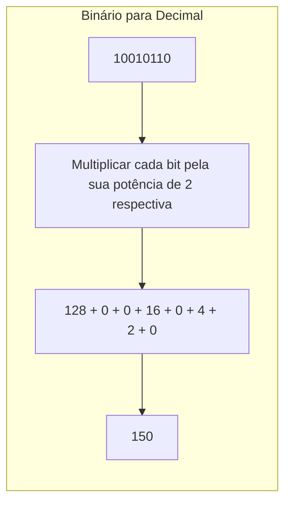
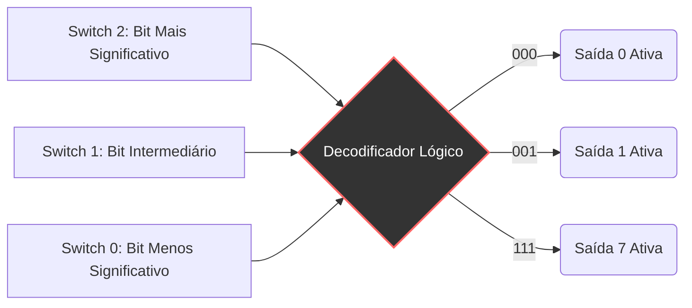
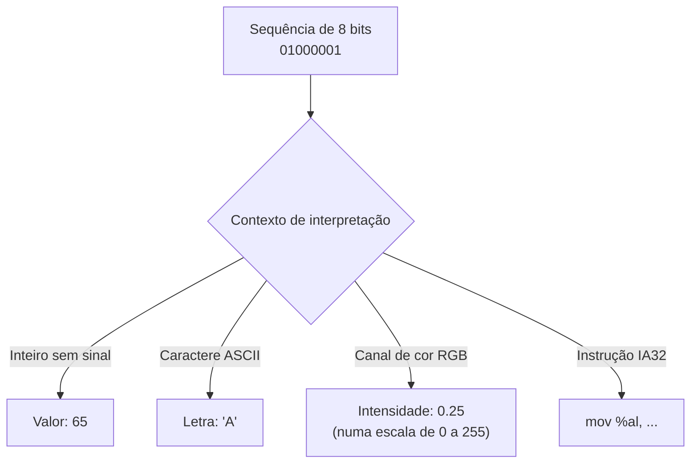
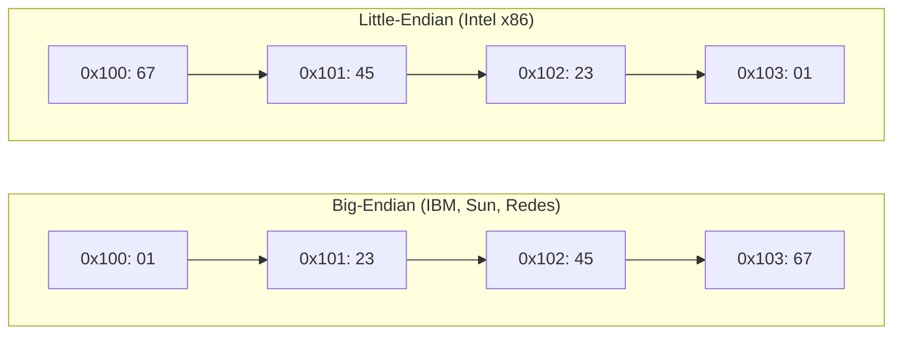

+++
title = "Petzold03 - Dos nossos dez dedos aos Bits e Bytes"
description = "Sistemas de numeração, binário e hexadecimal para computação"
date = 2026-05-12T18:40:00-03:00
tags = ["numeração", "binário", "hexadecimal", "bits", "história", "computação"]
draft = true
weight = 1
author = "Vitor Lobo Ramos"
+++

A ideia de que a linguagem é apenas um código é facilmente aceitável para a maioria de nós. Sabemos que o animal que chamamos de "gato" pode ser *cat*, *chat*, *Katze*, *кошка* ou *γάτα* dependendo do idioma. Os números, no entanto, parecem menos maleáveis culturalmente. A matemática é frequentemente chamada de "linguagem universal" porque, independentemente de como pronunciamos, escrevemos nossos algarismos da mesma forma em quase todo o planeta: **0, 1, 2, 3, 4, 5, 6, 7, 8, 9**.

Mas será que o nosso sistema numérico tem algo de intrinsecamente mágico ou especial? A verdade é que a fundação de toda a computação moderna exige que abandonemos o nosso apego ao número dez.

## 1. A Ilusão da Base 10

Os números são abstrações puras. Quando vemos o símbolo **3**, não precisamos relacioná-lo imediatamente a 3 maçãs. Pode ser um canal de televisão, um dia do mês ou o número de xícaras em uma receita.

Historicamente, os números foram inventados para contar posses e transações. Se alguém tivesse quatro patos, desenhava quatro patos. Eventualmente, para simplificar, usaram-se marcas ou riscos. E quando alguém tinha 27 patos? Fazer 27 riscos era inviável. Foi assim que os sistemas numéricos evoluíram.

A maioria dos sistemas antigos, como os numerais romanos, era péssima para matemática avançada. Experimente multiplicar `MCMLIII` por `XIV`. O sistema que usamos hoje, o **[Hindu-Arábico](https://pt.wikipedia.org/wiki/Sistema_de_numeração_hindu-arábico)**, revolucionou a matemática por três motivos:

1. **Notação Posicional:** A posição do dígito altera seu valor. O "1" em 100 vale muito mais que o "1" em 10.
2. **Ausência de um Símbolo para Dez:** O dez é representado por dois dígitos (1 e 0), mudando a posição do 1.
3. **O Zero:** A invenção do zero é um dos maiores marcos da história. Ele serve como marcador de posição, permitindo distinguir instantaneamente 25, 205 e 250, facilitando imensamente a multiplicação e a divisão.

A estrutura do nosso sistema decimal (base 10) é baseada em potências de dez. O número 4825, por exemplo, é lido e decomposto matematicamente como:

**4825 = 4, 10³ + 8, 10² + 2, 10¹ + 5, 10⁰**

> **Curiosidade:** Usamos a base 10 puramente por um acidente anatômico: temos dez dedos nas mãos. Se fôssemos personagens de desenhos animados com apenas quatro dedos em cada mão, acharíamos perfeitamente natural usar um sistema de base 8.

---

## 2. Bases Alternativas: Octal e Quaternário

Se fôssemos personagens de desenho animado e contássemos na base 8 (Sistema Octal), os símbolos **8** e **9** simplesmente não existiriam. A contagem seria: `0, 1, 2, 3, 4, 5, 6, 7...` e, ao esgotarmos os símbolos, passaríamos para o **10** (que equivaleria ao nosso 8 decimal).

O sistema octal possui a mesma estrutura posicional, mas usa potências de 8:

**3725₈ = 3, 8³ + 7, 8² + 2, 8¹ + 5, 8⁰**

Se fôssemos lagostas e usássemos apenas nossas duas pinças principais para contar, usaríamos a base 4 (Sistema Quaternário), contando com os dígitos `0, 1, 2, 3`. E se fôssemos golfinhos, contando apenas com duas nadadeiras? Chegaríamos à base da computação moderna.

---

## 3. A Linguagem dos Computadores: O Sistema Binário

O sistema binário (base 2) usa apenas dois dígitos: **0** e **1**. O maior problema do binário é que esgotamos os dígitos rapidamente. A contagem é assim: `0, 1, 10, 11, 100, 101, 110, 111, 1000...`

Os números binários ficam longos muito depressa, mas sua estrutura posicional segue as potências de 2:

**1101₂ = 1, 2³ + 1, 2² + 0, 2¹ + 1, 2⁰ = 13₁₀**

### Convertendo Binário para Decimal e Vice-Versa

Para converter decimal para binário, fazemos divisões sucessivas pelo maior valor de potência de 2 possível, anotando os quocientes (que serão sempre 0 ou 1) e passando o resto adiante.

---

## 4. O "Bit": A Menor Unidade de Informação

A palavra **[bit](https://pt.wikipedia.org/wiki/Bit)** foi cunhada pelo matemático [John Tukey](https://en.wikipedia.org/wiki/John_Tukey) na década de 1940 como uma contração de *binary digit* (dígito binário).

Um bit é a menor quantidade possível de informação: uma escolha entre duas alternativas mutuamente exclusivas. Sim ou Não. Verdadeiro ou Falso. Luz acesa ou apagada. Quando Paul Revere precisou saber como os britânicos atacariam, usou lanternas:

* 1 lanterna = por terra
* 2 lanternas = pelo mar
* Nenhuma lanterna = sem ataque

Com múltiplos bits, aumentamos exponencialmente a quantidade de possibilidades (2ⁿ).

* **1 bit:** 2 estados (0, 1)
* **2 bits:** 4 estados (00, 01, 10, 11)
* **3 bits:** 8 estados (000 a 111)
* **8 bits:** 256 estados

### Decodificadores: Conectando Lógica e Hardware

Na eletrônica, agrupamentos de bits controlam circuitos físicos através de portas lógicas (AND, OR, NOT). Um decodificador *3-to-8* lê 3 interruptores (bits) e ilumina 1 de 8 lâmpadas (estados).

---

## 5. Bits São Apenas Bits: O Contexto é Tudo

Um bit, isoladamente, significa absolutamente nada. É apenas 0 ou 1, um pulso elétrico baixo ou alto, uma marca magnética numa direção ou noutra. O significado surge quando **interpretamos** grupos de bits dentro de um contexto.

A mesma sequência de 8 bits `01000001` pode representar:

* O número **65** (se interpretada como inteiro sem sinal)
* O caractere **'A'** (se interpretada como ASCII)
* Uma cor específica (se interpretada como canal de um pixel RGB)
* Uma instrução de máquina que move dados (se interpretada como código)

O hardware não sabe qual dessas interpretações é a "correta". Quem decide é o **programa**, através do tipo de dado que ele declara e das instruções que ele usa para manipular aquela posição de memória.

Isso explica um fenômeno que confunde iniciantes: por que `200 * 300 * 400 * 500` num computador 32 bits resulta num número **negativo** (`−884.901.888`). A CPU executou a multiplicação corretamente em termos de bits, mas a interpretação como inteiro com sinal (two's complement) transformou um resultado que estourou a capacidade de 32 bits num número negativo. O hardware não errou; a interpretação é que gerou a surpresa.

### Representações Comuns de Bits no Computador

| Tipo de dado | Bits usados | Exemplo | Interpretação |
|---|---|---|---|
| Inteiro sem sinal | 32 | `00000000 00000000 00000000 00001010` | 10 |
| Inteiro com sinal | 32 | `11111111 11111111 11111111 11110110` | −10 |
| Caractere ASCII | 8 | `01000001` | 'A' |
| Float (IEEE 754) | 32 | `01000001001000000000000000000000` | 10.0 |
| Instrução IA32 | 8 | `11101000` | `call` (chamar função) |
| Cor RGB (um pixel) | 24 | `11111111 00000000 00000000` | Vermelho puro |

A tabela acima ilustra o ponto central: **o mesmo hardware, os mesmos fios, os mesmos bits, o que muda é o contrato de interpretação**. Quando você declara uma variável como `int` em vez de `float`, você está dizendo ao compilador: "trate estes 32 bits como um inteiro, não como um número de ponto flutuante". A CPU não sabe nem se importa; ela apenas executa as instruções que o compilador gerou.

---

## 6. Bytes e Hexadecimal

À medida que os computadores evoluíram, organizar os bits individualmente tornou-se caótico. A indústria começou a agrupar bits no que chamamos de **Word** (Palavra). O tamanho ideal estabelecido para a computação geral foi o agrupamento de 8 bits: o **[Byte](https://pt.wikipedia.org/wiki/Byte)**.

Um Byte pode representar 2⁸ (256) valores diferentes, indo de `00000000` a `11111111` (0 a 255 em decimal). É o tamanho perfeito para codificar caracteres de texto ocidentais (ASCII) e intensidades de cores em uma tela (onde RGB = 3 bytes).

### O Sistema Hexadecimal (Base 16)

Ler grandes cadeias de bits (`1011011001010111`) é insano para humanos. O sistema Octal (agrupamento de 3 bits) foi tentado, mas existe uma incompatibilidade estrutural: 8 bits não dividem igualmente por 3.

A solução? O **[Hexadecimal](https://pt.wikipedia.org/wiki/Sistema_hexadecimal)** (base 16). Cada dígito hexadecimal mapeia perfeitamente um grupo de 4 bits (um *[nibble](https://en.wikipedia.org/wiki/Nibble)*). Dois dígitos hexadecimais formam exatamente 1 Byte.

Como nosso alfabeto decimal acaba no 9, o hexadecimal empresta as seis primeiras letras do alfabeto latino:

| Decimal | Binário | Hex | | Decimal | Binário | Hex |
| --- | --- | --- | --- | --- | --- | --- |
| 0 | 0000 | **0** | | 8 | 1000 | **8** |
| 1 | 0001 | **1** | | 9 | 1001 | **9** |
| 2 | 0010 | **2** | | 10 | 1010 | **A** |
| 3 | 0011 | **3** | | 11 | 1011 | **B** |
| 4 | 0100 | **4** | | 12 | 1100 | **C** |
| 5 | 0101 | **5** | | 13 | 1101 | **D** |
| 6 | 0110 | **6** | | 14 | 1110 | **E** |
| 7 | 0111 | **7** | | 15 | 1111 | **F** |

Assim, a longa string binária `0010010001101000101011001110` pode ser separada em blocos de 4 e traduzida instantaneamente:
`0010` `0100` `0110` `1000` `1010` `1100` `1110`

**2**           **4**          **6**         **8**          **A**         **C**         **E**

O número é `2468ACEh` (o 'h' é um sufixo comum para identificar hexadecimais, assim como o `#` no HTML, ex: `#E74536`).

A matemática posicional do Hexadecimal funciona igual a todas as outras bases:

**9A48C₁₆ = 9, 16⁴ + 10, 16³ + 4, 16² + 8, 16¹ + 12, 16⁰ = 631948₁₀**

## 7. Words, Endianness e a Ordem dos Bytes

Byte a byte, já chegamos longe. Mas um único byte só representa até 255, insuficiente para endereçar os milhões de posições de memória que um computador moderno possui. A solução está no próprio nome "byte": ele é um *pedaço* de algo maior. Esse algo maior é a **Word** (Palavra).

O tamanho da *word* é o parâmetro mais fundamental de um processador. Uma CPU de 32 bits manipula naturalmente palavras de 4 bytes; uma de 64 bits, palavras de 8 bytes. Esse número define diretamente o limite de memória endereçável: 32 bits alcançam no máximo 4 GB; 64 bits alcançam 18,4 exabytes, tão grande que nenhum chip de memória atual chega perto.

### A Guerra dos Bytes: Big-Endian vs. Little-Endian

Quando armazenamos um número maior que um byte na memória, surge uma pergunta sutil: em que ordem colocamos os bytes? Tome o valor hexadecimal `0x01234567`. Ele ocupa quatro endereços consecutivos (digamos, 0x100, 0x101, 0x102 e 0x103). Mas qual byte vai em cada um?

Existem duas convenções, e os fabricantes se dividem entre elas:

Os nomes vêm d'*As Viagens de Gulliver*, de Jonathan Swift, onde dois reinos guerreiam sobre se os ovos devem ser quebrados pela ponta maior (*big end*) ou pela menor (*little end*). O cientista Danny Cohen importou os termos para a computação nos anos 80, e, como na sátira, não há razão técnica definitiva para escolher um ou outro. O importante é ser consistente.

A distinção se torna prática em dois cenários:

* **Comunicação em rede:** Protocolos como o TCP/IP adotam big-endian como padrão (*network byte order*). Programas que enviam inteiros pela rede devem usar funções como `htonl()` para converter antes de transmitir.

* **Engenharia reversa:** Ao examinar um dump hexadecimal de código de máquina num sistema Intel, os números aparecem "de trás para frente". A sequência `64 94 04 08` representa, na verdade, o endereço `0x08049464`, um lembrete de que a ordem que vemos na tela nem sempre é a ordem que a máquina enxerga.

### 🔧 Exercícios

**1. Binário para decimal:** Converta `1101101₂` para decimal.

**2. Decimal para binário:** Converta `156₁₀` para binário.

**3. Hexadecimal para decimal:** Converta `3F2A₁₆` para decimal.

**4. Identificando Endianness:** Você recebeu um dump de memória de 4 bytes: `78 56 34 12`. Sabendo que o processador é **little-endian** (Intel), qual é o valor hexadecimal de 32 bits armazenado? E se fosse **big-endian**?

**5. Bits na prática:** Quantos bytes são necessários para armazenar a string "Olá, mundo!" em UTF-8? (Lembre-se que cada caractere ASCII ocupa 1 byte, e caracteres acentuados como "á" ocupam 2 bytes.)

<b>Respostas</b>

1. 1101101₂ = 64 + 32 + 0 + 8 + 4 + 0 + 1 = **109₁₀**.
2. 156 ÷ 2 = 78 (resto 0), 78 ÷ 2 = 39 (resto 0), 39 ÷ 2 = 19 (resto 1), 19 ÷ 2 = 9 (resto 1), 9 ÷ 2 = 4 (resto 1), 4 ÷ 2 = 2 (resto 0), 2 ÷ 2 = 1 (resto 0), 1 ÷ 2 = 0 (resto 1). Lendo de baixo para cima: **10011100₂**.
3. 3F2A₁₆ = 3,16³ + 15,16² + 2,16¹ + 10,16⁰ = 12288 + 3840 + 32 + 10 = **16170₁₀**.
4. Little-endian: o primeiro byte é o menos significativo. Valor lido: **0x12345678**. Big-endian: o primeiro byte é o mais significativo. Valor lido: **0x78563412**.
5. A string tem 12 caracteres. 'O', 'l', 'á' (2 bytes), ',', ' ', 'm', 'u', 'n', 'd', 'o', '!', '\n'? Na verdade "Olá, mundo!" tem 12 caracteres: O(1) + l(1) + á(2) +,(1) + (1) + m(1) + u(1) + n(1) + d(1) + o(1) + !(1) = **13 bytes**.

---

Nossa familiaridade com os números baseados em "dez" nos cega para a elegância abstrata da matemática posicional. Ao dominarmos a maleabilidade das bases numéricas, compreendemos o segredo fundamental por trás de todos os sistemas computacionais já criados. Com os números representados em bits, os bits agrupados em bytes e estes organizados em palavras, surge o próximo desafio: como usar esses bytes para representar não apenas números, mas letras, símbolos e todo o texto que lemos na tela?

---

**Fonte:** [Code: The Hidden Language of Computer Hardware and Software](https://a.co/d/0a3DsSsn), 2ª ed., Charles Petzold
