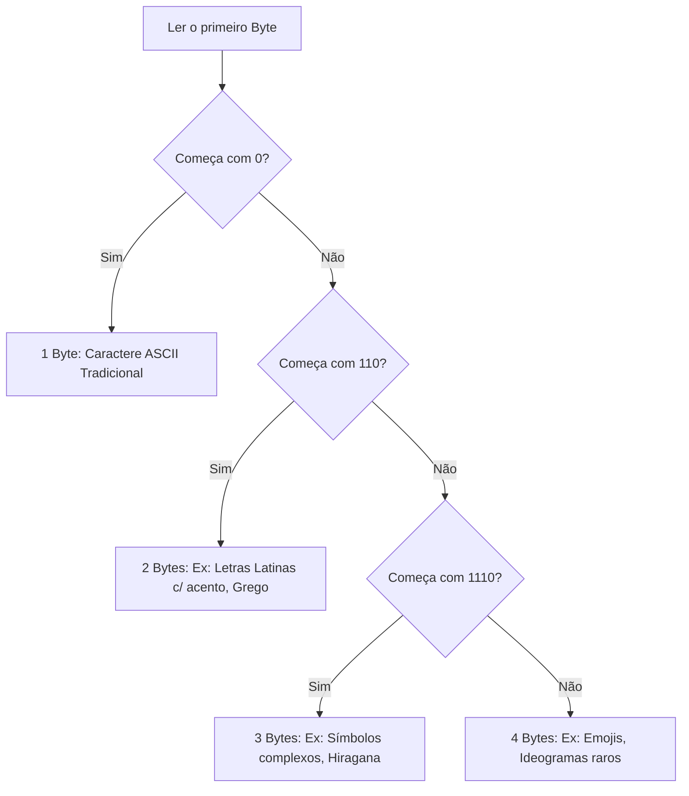
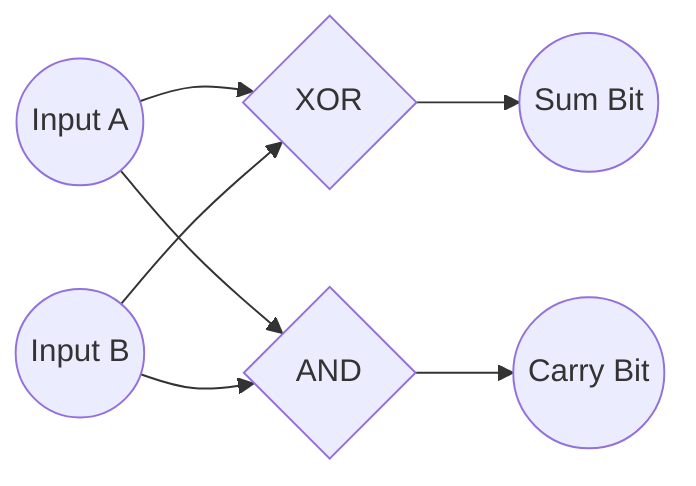
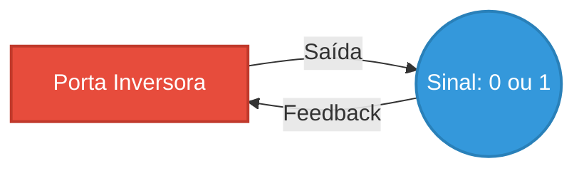
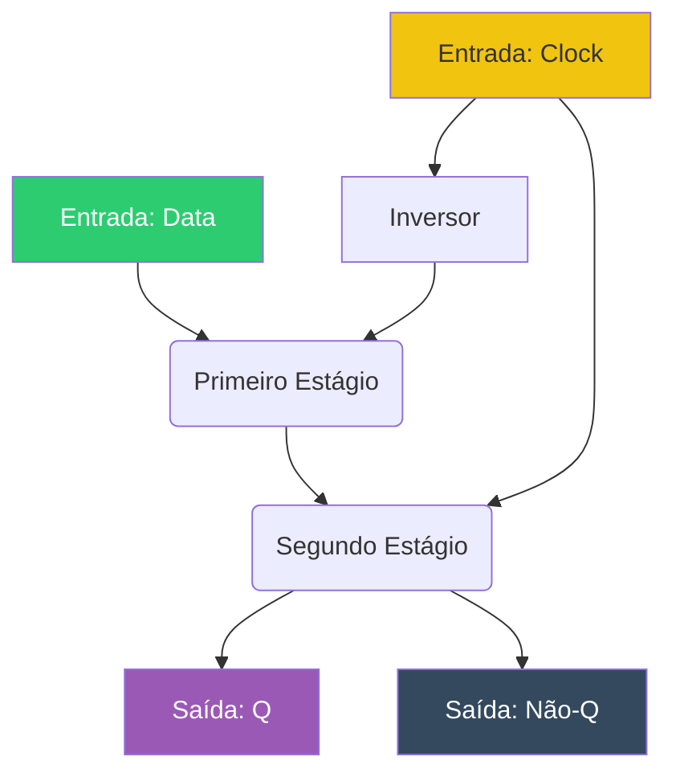

+++
title = "Base04 - Do Bit ao Símbolo, do Relé ao Chip"
description = "A fundação da computação moderna"
date = 2026-05-12T18:40:00-03:00
tags = ["hardware", "portas lógicas", "álgebra booleana", "história", "computação"]
draft = true
weight = 1
author = "Vitor Lobo Ramos"
+++

Como desenvolvedores, passamos a maior parte do nosso tempo em abstrações elevadas, escrevendo código em Go, C#, Elixir ou Rust, e confiando que o compilador e o sistema operacional farão a mágica acontecer. Mas, sob as camadas de frameworks e interfaces, tudo se resume a uma dança perfeitamente orquestrada de elétrons, portas lógicas e convenções de bits.

Este artigo é um mergulho profundo nas fundações de duas das engrenagens mais vitais da computação: **como representamos a linguagem humana em zeros e uns** e **como construímos o hardware capaz de processar esses dados**. Prepare o seu café, pois vamos descer ao escovão de bits.

Toda vez que você digita em um teclado ou lê um texto na tela, está confiando em um sistema padronizado de codificação de caracteres. Sem isso, a comunicação moderna entre sistemas operacionais e arquiteturas diferentes seria impossível.

### A Era do Telégrafo e o Código Baudot

Muito antes dos computadores modernos, a necessidade de transmitir texto via cabos elétricos gerou o **[Código Baudot](https://pt.wikipedia.org/wiki/Código_Baudot)** (usado em teletipos). Diferente do Código Morse (que tem tamanho variável), o Baudot era um código de **5 bits**. Com 5 bits, você só consegue representar 2⁵ = 32 caracteres.

Como encaixar o alfabeto, números e pontuação em 32 slots? A solução foi o uso de **Shift Codes** (Códigos de Mudança). Havia um código para "Letter Shift" e outro para "Figure Shift".

* Se o teletipo recebesse o código de *Figure Shift*, tudo que viesse a seguir seria interpretado como números ou pontuação.
* Se recebesse *Letter Shift*, voltava para letras.

O problema? Se um código de *Shift* fosse perdido ou se você começasse a ler o fluxo de dados na metade, o texto virava lixo. A frase `I SPENT $25 TODAY.` poderia sair como `8 '03,5 $25 TODAY.` se a máquina não soubesse em qual "estado" estava. Precisávamos de algo melhor, sem a dependência de estados (stateless).

### A Ascensão do ASCII

Para evitar os problemáticos Shift Codes e acomodar letras maiúsculas, minúsculas, números e pontuações do inglês, a indústria chegou a um número mágico: **7 bits** (128 combinações possíveis).

Assim nasceu o **[ASCII](https://pt.wikipedia.org/wiki/ASCII)** (American Standard Code for Information Interchange).
No ASCII, os caracteres gráficos (letras, números) convivem com caracteres de controle (como `Carriage Return - 0Dh` e `Line Feed - 0Ah`, heranças diretas das máquinas de escrever mecânicas).

Uma sacada genial do ASCII: a diferença entre uma letra maiúscula (ex: `A` = `41h` ou `1000001`) e sua versão minúscula (`a` = `61h` ou `1100001`) é de exatos `20h` (ou apenas um bit, o sexto bit, invertido). Isso tornou a conversão entre caixas incrivelmente rápida em nível de processador: basta uma operação lógica simples, sem tabelas de conversão complexas.

Enquanto o ASCII dominava o mundo, a IBM tentou emplacar o **EBCDIC** (um código de 8 bits derivado dos cartões perfurados), mas suas sequências de letras tinham "buracos" não lineares, tornando a ordenação alfabética um pesadelo computacional. O ASCII venceu essa batalha.

### O Caos das Extensões e a Solução Unicode

O ASCII era perfeito... se você falasse apenas inglês americano. Não havia `£`, `ç`, `á` ou suporte para cirílico, árabe ou mandarim.

Como a memória passou a ser organizada em *bytes* de 8 bits (256 valores), o bit extra que sobrava no ASCII (que usava 7) começou a ser usado para criar as **Code Pages** (Páginas de Código), como a famigerada `Windows-1252` ou `ISO-8859-1`. Os primeiros 128 caracteres eram ASCII, os 128 seguintes variavam de acordo com o país. Foi a era de ouro de abrir um site e ver `We’ve` no lugar de `We've`.

A verdadeira salvação foi o **[Unicode](https://pt.wikipedia.org/wiki/Unicode)**. Originalmente pensado como um código fixo de 16 bits (65.536 caracteres), ele logo precisou ser expandido para 21 bits (chegando ao limite de `U+10FFFF`), permitindo mais de 1 milhão de caracteres — de hieróglifos egípcios ao emoji de gatinho chorando de rir 😹.

Mas como salvar tudo isso sem triplicar o tamanho de todos os arquivos de texto do mundo e sem quebrar sistemas legados?

### A Mágica do UTF-8

A solução elegante foi o **[UTF-8](https://pt.wikipedia.org/wiki/UTF-8)**, um formato de transformação de tamanho variável. Ele é brilhante porque é 100% retrocompatível com o ASCII puro.

A regra é simples e determinada pelos bits iniciais do primeiro byte:

1. Se o byte começa com `0`, é um caractere ASCII de 1 byte (exatamente igual ao ASCII tradicional).
2. Se começa com `110`, é o primeiro de **2 bytes**.
3. Se começa com `1110`, é o primeiro de **3 bytes**.
4. Se começa com `11110`, é o primeiro de **4 bytes**.
5. Qualquer byte de continuação *sempre* começa com `10`.

Se um programa tropeçar no meio de um arquivo UTF-8, ele consegue se sincronizar rapidamente apenas procurando um byte que não comece com `10`. É um design robusto e tolerante a falhas.

---

## Parte 2: A Matemática Ganhando Vida

Saber representar a informação é apenas metade da equação. Como uma máquina realmente a manipula? Na sua essência, tudo o que um computador faz é somar. Se você sabe somar, sabe subtrair (somando o complemento), multiplicar (somando repetidamente) e, a partir daí, renderizar gráficos 3D ou treinar redes neurais.

### Adição em Binário e Portas Lógicas

A tabela de adição binária é extremamente simples:

* 0 + 0 = 0
* 0 + 1 = 1
* 1 + 0 = 1
* 1 + 1 = 0 (e "vai um" / carry 1)

Se mapearmos isso para lógica booleana, percebemos que o bit de **Soma** (Sum) comporta-se exatamente como uma porta lógica **XOR** (Exclusive OR), enquanto o bit de **Carry** (Vai-um) comporta-se como uma porta **AND**.

Se juntarmos uma porta XOR e uma AND, criamos o bloco fundamental da computação: o **Half Adder** (Meio Somador).

O problema do *Half Adder* é que ele não aceita um "Carry In" (o "vai-um" da coluna anterior). Para somar números maiores, precisamos de um **Full Adder** (Somador Completo), que utiliza dois Half Adders e uma porta OR.

Ao conectar 8 Full Adders em cascata — ligando o `Carry Out` de um no `Carry In` do próximo — temos um **Ripple Carry Adder de 8 bits**.

### A Evolução: Da Mecânica ao Estado Sólido

Como implementamos essas portas lógicas no mundo físico? A evolução do hardware é a verdadeira "batalha dos milissegundos" e, posteriormente, dos nanossegundos.

**1. Relés Eletromecânicos:**
Os primeiros computadores digitais, como o Harvard Mark I e as criações de George Stibitz na Bell Labs, usavam relés de telefonia. Eram máquinas gigantescas e barulhentas. Um relé demora cerca de 1 milissegundo para mudar de estado. E eles falhavam fisicamente (o famoso caso de Grace Hopper encontrando uma mariposa — o primeiro "bug" literal — presa em um relé do Mark II).

**2. Válvulas a Vácuo:**
Substituindo componentes mecânicos por fluxos de elétrons no vácuo, as válvulas (usadas no monstruoso ENIAC de 30 toneladas) saltaram a velocidade de comutação para a casa dos microssegundos. Foi aqui que John von Neumann ajudou a formalizar a arquitetura que usamos até hoje: a ideia de um *stored-program* (dados e instruções residindo na mesma memória). O grande gargalo? Válvulas queimavam constantemente, gastavam muita energia e geravam calor extremo.

**3. Transistores:**
Em 1947, [Bardeen, Brattain e Shockley](https://pt.wikipedia.org/wiki/Transístor) (Bell Labs) mudaram a história da humanidade ao inventar o [transistor](https://pt.wikipedia.org/wiki/Transístor). Feitos de material semicondutor (como Germânio ou Silício) dopado com impurezas para formar áreas N (negativas) e P (positivas), eles permitiam controlar uma grande corrente usando uma pequena corrente na base. Sendo estado sólido, não queimavam como válvulas, não esquentavam quase nada e eram microscópicos em comparação.

Na prática, o transistor funciona como um relé, mas sem partes móveis: uma pequena corrente aplicada na base (equivalente ao eletroímã do relé) abre ou fecha o caminho entre o coletor e o emissor (equivalente aos contatos do relé). Se pensarmos no transistor como um interruptor controlado por eletricidade, podemos construir as mesmas portas lógicas que vimos com relés — AND, OR, NOT — mas ocupando uma fração do espaço e consumindo uma fração da energia. Dois transistores podem formar uma porta NAND; seis podem formar um flip-flop. O relé era barulhento, lento e frágil; o transistor é silencioso, rápido e dura décadas.

### Como se Fabrica um Transistor

A fabricação de um transistor começa com uma pastilha (wafer) de **silício ultrapuro** — o elemento mais abundante na crosta terrestre depois do oxigênio, extraído da areia e refinado até atingir pureza de 99,9999999% (grau eletrônico). Sobre essa base de silício puro, o processo de **dopagem** introduz átomos de outros elementos (como fósforo ou boro) para criar regiões com excesso de elétrons (tipo N) ou falta deles (tipo P). A junção entre uma região N e uma região P forma uma barreira que a corrente só atravessa em uma direção — a essência do semicondutor.

Para construir um transistor planar (o tipo usado em circuitos integrados), o processo segue estas etapas:

1. **Oxidação:** A pastilha de silício é aquecida em forno com oxigênio, formando uma camada de dióxido de silício (SiO₂) — isolante elétrico.
2. **Fotolitografia:** A pastilha é coberta com um material fotossensível (fotorresiste). Uma máscara contendo o desenho do transistor (uma fotografia em escala microscópica) é projetada sobre a pastilha com luz ultravioleta. As áreas expostas à luz tornam-se solúveis e são removidas por um revelador químico, abrindo "janelas" no fotorresiste.
3. **Corrosão (Etch):** Um ácido corrói o dióxido de silício nas áreas abertas pela janela, expondo o silício puro abaixo.
4. **Dopagem:** A pastilha é exposta a um gás contendo os átomos dopantes em um forno de alta temperatura. Os átomos difundem-se no silício exposto, criando as regiões N e P.
5. **Metalização:** Uma fina camada de alumínio ou cobre é depositada sobre toda a pastilha. Uma segunda fotolitografia remove o metal onde não é necessário, deixando apenas os contatos elétricos (os "fios" que conectam o transistor aos seus vizinhos).
6. **Repetição:** Camadas sucessivas de óxido, polissilício e metal são depositadas e esculpidas, construindo um transistor tridimensional com dezenas de camadas sobrepostas — como um edifício de centenas de andares em escala nanométrica.

Um transistor moderno mede entre 3 e 10 nanômetros de comprimento — cerca de 10.000 vezes mais fino que um fio de cabelo humano. Um chip de processador atual pode conter **dezenas de bilhões** desses transistores, todos fabricados por esse mesmo processo de dopagem, luz e corrosão química, repetido dezenas de vezes sobre a mesma pastilha de silício.

**4. Circuitos Integrados (O Chip):**
Fazer portas lógicas soldando transistores individuais era um pesadelo logístico. No final dos anos 1950, [Jack Kilby](https://pt.wikipedia.org/wiki/Jack_Kilby) (Texas Instruments) e [Robert Noyce](https://pt.wikipedia.org/wiki/Robert_Noyce) (Fairchild Semiconductor) perceberam que múltiplos transistores e resistores poderiam ser gravados em uma única placa de silício. Nascia o **[Circuito Integrado](https://pt.wikipedia.org/wiki/Circuito_integrado)** (IC).

A partir dos anos 70, componentes pré-fabricados revolucionaram a engenharia. Com um catálogo como o *TTL Data Book*, engenheiros podiam comprar chips da série 7400. Um chip `7400` trazia quatro portas NAND puras. Um `7483` trazia um somador completo de 4 bits empacotado.

O tempo de propagação do sinal nesses chips já era medido em **nanossegundos** (bilionésimos de segundo). Para contexto: a luz viaja cerca de 30 centímetros em um nanossegundo.

A computação moderna não surgiu por acaso. Ela é o resultado do empilhamento cuidadoso de abstrações.

O silício dopado forma transistores. Transistores formam portas lógicas (AND, XOR). Portas lógicas formam somadores matemáticos. Esses processadores lêem bytes da memória. Esses bytes, por sua vez, obedecem a padrões geniais como o UTF-8 para garantir que, não importa onde você esteja no mundo, a máquina saiba exatamente como pintar os pixels corretos na sua tela.

É quando entendemos essa ponte contínua — da física dos semicondutores à arquitetura do software — que deixamos de ser apenas digitadores de código e passamos a dominar verdadeiramente a máquina.

---

## A Máquina Que Pensa e Lembra: Desmistificando a Subtração, Flip-Flops e Relógios Digitais

Depois de se convencer de que relés, válvulas ou transistores podem ser interligados para somar números binários, uma pergunta natural e perspicaz costuma surgir: *"E quanto à subtração?"*.

A adição flui elegantemente da direita para a esquerda, levando o "vai-um" (carry) de uma coluna para a próxima. A subtração, no entanto, possui uma mecânica intrinsecamente diferente e bagunçada. Nós não levamos um valor adiante; nós *pegamos emprestado*. E implementar esse mecanismo de "vai-e-vem" em portas lógicas parece, à primeira vista, um verdadeiro pesadelo.

Como convencer um monte de transistores a fazer isso? A resposta é brilhante: **nós não tentamos**.

---

## 1. A Ilusão da Subtração e o Complemento de Nove

Imagine o seguinte problema em decimal:

> 253
> − 176
> -------
> ???

Ao olhar para a coluna da direita, você vê que 6 é maior que 3. Instantaneamente, você sabe que precisa pegar emprestado da próxima coluna, que por sua vez precisará de outro empréstimo. O resultado final é 77. Em vez de criar circuitos complexos para lidar com isso, usamos um truque engenhoso para subtrair sem nunca precisar pegar emprestado.

Sabemos que subtrair é o mesmo que somar um número negativo. Podemos reescrever o problema matemático injetando números neutros no meio da equação sem alterar o resultado. O que acontece se somarmos e subtrairmos 1000 ao mesmo tempo? E se reescrevermos 1000 como 999 + 1?

**999 − 176 + 253 + 1 − 1000 =**

Parece uma bagunça, mas observe a primeira operação da esquerda para a direita: **999 − 176**. Subtrair qualquer número de uma sequência de noves **nunca exige empréstimo!** É incrivelmente fácil calcular que 999 − 176 = 823. Esse resultado é chamado de **Complemento de Nove**.

Substituindo na nossa equação:

* 823 + 253 + 1 − 1000
* 1076 + 1 − 1000
* **1077 − 1000 = 77**

Chegamos à mesma resposta, usando apenas uma subtração incrivelmente simples no início (sem nenhum empréstimo) seguida apenas de adições!

---

## 2. O Mundo Binário: Complementos e Sinais

Nos computadores, essa técnica não só se aplica aos números binários, como é absurdamente mais fácil. O nosso problema original (253 - 176) em binário se parece com isso:

> 11111101 (253)
> − 10110000 (176)

Aplicando a mesma lógica do complemento, vamos adicionar 11111111 (255) no início, e depois somar 00000001 (1) e subtrair 100000000 (256):

**11111111 − 10110000 + 11111101 + 00000001 − 100000000 =**

Subtrair um número binário de uma string de 1s é chamado de **Complemento de Um**. E a grande mágica do hardware é que não precisamos fazer conta nenhuma! Subtrair de 11111111 é exatamente o mesmo que **inverter todos os bits**. Todo 0 vira 1 e todo 1 vira 0.

O complemento de um de 10110000 é 01001111. O hardware faz isso instantaneamente passando o sinal por portas lógicas inversoras. Se adicionarmos o "+ 1" final, obtemos o **Complemento de Dois**. Este é o padrão universal que os computadores usam para representar números negativos, permitindo que o processador use o *mesmo* circuito de soma para fazer subtrações.

### O Contexto dos Bits

Bits são apenas 0s e 1s. Eles não carregam etiquetas explicando o que são. Um byte como 10110110 precisa de contexto:

* Se for um inteiro **sem sinal (unsigned)**, ele representa 182.
* Se for um inteiro **com sinal (signed)** usando Complemento de Dois, o bit mais à esquerda atua como o "bit de sinal" (1 = negativo, 0 = positivo). Nesse caso, ele vale -74.

---

## 3. Feedback e Osciladores: O Coração da Máquina

Até agora, nossos circuitos apenas reagem a interruptores que humanos pressionam. Para criar automação, o circuito precisa agir por conta própria. A chave para isso é o **Feedback** — quando a saída de um circuito alimenta a sua própria entrada.

Se você ligar a saída de um inversor (que transforma 0 em 1, e 1 em 0) na sua própria entrada, ele tentará mudar de estado infinitamente. Ele se tornará 1, o que fará a entrada ser 1, forçando a saída a ser 0, e assim por diante.

Isso cria um **Oscilador** (ou *Clock*).

A taxa com que ele altera de estado é medida em Hertz (Hz). Este "Clock" é o metrônomo que dita o ritmo de todo o computador.

---

## 4. Flip-Flops: A Origem da Memória

Se conectarmos duas portas lógicas NOR cruzadas (a saída de uma alimenta a entrada da outra), criamos um circuito com dois estados estáveis: o **Flip-Flop R-S (Reset-Set)**.

* Acionar a entrada **Set (1)** faz a saída principal (Q) virar 1. E assim permanece, mesmo se o Set voltar para 0.
* Acionar a entrada **Reset (1)** faz Q virar 0. E assim permanece.

O Flip-Flop é mágico: **ele lembra qual botão foi apertado por último.** É o bloco fundamental de uma memória.

### O Flip-Flop Tipo D (Edge-Triggered)

Para um computador, o Flip-Flop R-S é muito rústico. Precisamos de controle exato sobre *quando* a memória deve ser gravada. Entra em cena o **Flip-Flop Tipo D** (D de *Data*). Nele, adicionamos uma porta de "Clock" (ou *Hold That Bit*). O circuito só lê a entrada "Data" quando o sinal de Clock permite.

Para evitar que a informação fique circulando em loops infinitos, usamos uma versão refinada chamada **Edge-Triggered** (Acionado por Borda). Em vez de deixar a porta aberta enquanto o Clock for 1, ele tira uma "fotografia" do dado *exatamente no instante* em que o Clock transita de 0 para 1.

---

## 5. Contadores e o Relógio Digital

Se ligarmos o Clock de um flip-flop a um Oscilador e alimentarmos sua entrada Data com sua própria saída invertida (Não-Q), o flip-flop alternará de estado exatamente na metade da velocidade do oscilador original. Ele atua como um **Divisor de Frequência**.

Se encadearmos vários flip-flops assim (o Clock do segundo ligado à saída do primeiro), eles começarão a contar em binário de forma fluida: 0000, 0001, 0010, 0011... Isso é um **Ripple Counter**.

### O Problema do Tempo Humano (BCD)

Com um oscilador de 1 Hz, podemos contar segundos. Mas há um problema: não queremos exibir as horas convertendo enormes números binários como 101111 (47 segundos) de cabeça.

A solução é o **BCD (Binary-Coded Decimal)**. Em vez de um grande contador binário, usamos pequenos contadores independentes para cada dígito decimal:

* **Dígito baixo dos segundos:** Um contador de 4 bits que vai de 0 a 9. Usamos uma porta lógica AND configurada para detectar o padrão 1010 (10). Assim que atinge 10, a porta manda um sinal de "Clear", zerando esse dígito.
* **Dígito alto dos segundos:** O sinal de "Clear" do dígito baixo serve como Clock para este. Ele vai de 0 a 5. Uma porta AND detecta o 0110 (6) e o zera, incrementando os minutos.

Esse processo se repete para os minutos. Para as horas, a lógica é levemente mais complexa, pois um relógio de 12 horas não começa no 0, mas transita de 12:59:59 para 1:00:00. Isso exige portas lógicas adicionais para detectar quando o dígito alto é 1 e o baixo é 2.

---

## 6. O Toque Final: Matrizes e Displays

Como transformar nossa saída BCD de 4 bits em uma representação visual?

No passado, usávamos o **Tubo Nixie**, onde um decodificador energizava um pino específico para acender um filamento de neon no formato do número. Hoje, usamos **Displays de 7 Segmentos** ou **Matrizes de Pontos (LED)**.

Em uma matriz 5x7 (35 LEDs), criar circuitos lógicos manuais para acender os LEDs exatos de cada dígito exigiria milhares de componentes. A solução industrial foi a criação da **Memória ROM de Matriz de Diodos**.

Nesta abordagem, cruzamos fios de linhas e colunas e colocamos diodos (que permitem a passagem de corrente em apenas uma direção) nas interseções específicas que formam o desenho de um número (como o "3"). Quando o contador seleciona o dígito 3, a corrente flui por essa matriz e acende apenas os LEDs corretos no display.

> **A Ilusão da Matriz:** Para economizar fios, não acendemos todos os LEDs de uma vez. O circuito varre as colunas do display de LEDs de forma absurdamente rápida, sincronizando a energia nas linhas através da ROM de Diodos e conectando a coluna ao terra através de transistores (*Sinkers*). A velocidade é tão alta que o olho humano não percebe a piscada, enxergando o número completamente aceso.

A matemática binária da subtração nos permitiu construir processadores eficientes. Mas foi a invenção do oscilador e do flip-flop — a capacidade de fazer a eletricidade pulsar ritmicamente e "lembrar" do seu estado anterior — que transformou calculadoras estáticas nas máquinas dinâmicas e vivas que temos hoje. O flip-flop é a menor semente da memória; o próximo passo é entender como multiplicamos essa semente até construir uma arquitetura completa de processamento.

---

**Fonte:** [Code: The Hidden Language of Computer Hardware and Software](https://a.co/d/0a3DsSsn), 2ª ed. — Charles Petzold
