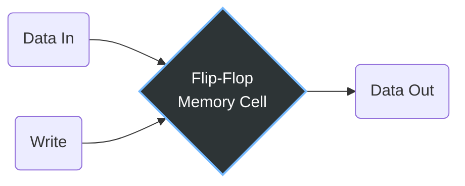
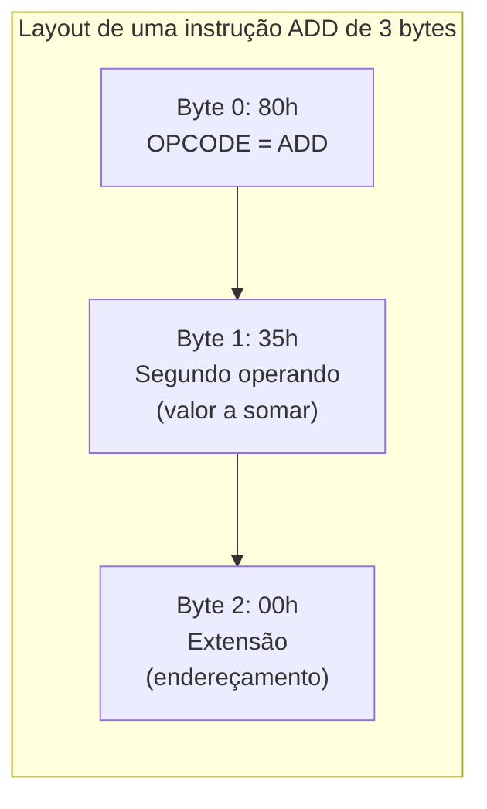
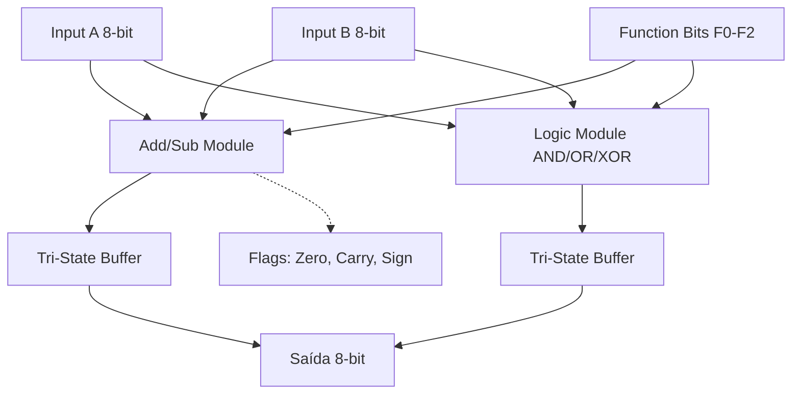
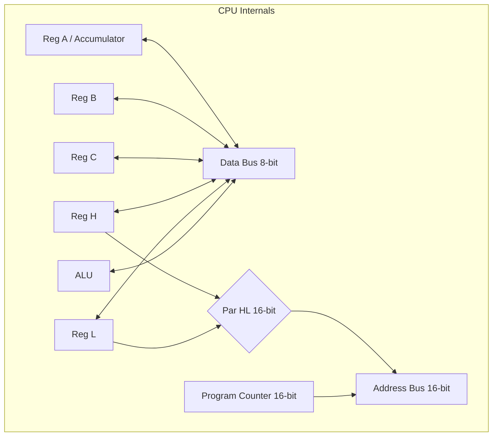
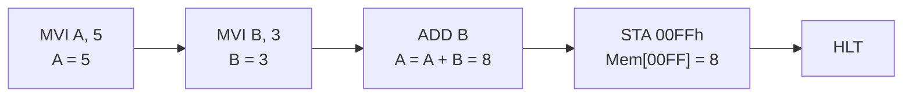

+++
title = "Petzold05 - Flip Flop"
description = "Como construir memória RAM, ALU e a arquitetura de uma CPU"
date = 2026-05-12T18:40:00-03:00
tags = ["memória", "RAM", "ALU", "arquitetura", "assembly", "história", "computação"]
draft = true
weight = 1
author = "Vitor Lobo Ramos"
+++

Quando acordamos todas as manhãs, nossa memória preenche as lacunas. Lembramos onde estamos, o que fizemos no dia anterior e o que planejamos para hoje. Podemos levar alguns minutos para juntar as peças, mas, no geral, conseguimos remontar nossas vidas e obter continuidade suficiente para iniciar mais um dia.

A memória humana, claro, não é muito ordenada e nem infalível. Na verdade, a escrita provavelmente foi inventada de forma específica para compensar as falhas da nossa memória. Nós escrevemos e lemos depois; salvamos e recuperamos. A função da memória é manter a informação intacta entre esses dois eventos.

Ao abrir o Emacs para compilar um projeto em Rust ou Zig, ou ao analisar os bytes de uma DLL durante a engenharia reversa de um mecanismo de *anti-cheat*, o que estamos manipulando em sua essência mais fundamental é a memória do computador. E essa memória, em seu nível mais baixo, não passa de um intrincado arranjo de portas lógicas.

Neste artigo, vamos descer ao nível do silício e entender como saímos de um simples interruptor para formar a memória RAM, a Unidade Lógica e Aritmética (ALU) e, por fim, a arquitetura fundamental de uma CPU.

---

## 1. O Bloco Fundacional: O Flip-Flop

Tudo começa com o armazenamento de **1 bit**. Como vimos no estudo de portas lógicas, um *[flip-flop](https://pt.wikipedia.org/wiki/Flip-flop)* tipo D (acionado por nível) é construído com um inversor, duas portas AND e duas portas NOR.

Para o nosso propósito, vamos simplificar a nomenclatura de suas entradas e saídas:

* **Data In (DI):** O bit que queremos salvar.
* **Write (W):** O sinal de controle (antes chamado de Clock).
* **Data Out (DO):** O bit armazenado.

Normalmente, o sinal `Write` é `0`, e qualquer mudança no `Data In` não afeta a saída. Mas, quando queremos armazenar um bit, nós elevamos o `Write` para `1` e depois de volta para `0`. O circuito "captura" (ou *latches*, por isso também é chamado de *latch*) aquele bit de dados.



Isso é **1 bit de memória**. Isolado, não faz muito. Mas se conectarmos oito desses flip-flops lado a lado e unirmos todos os seus sinais `Write`, teremos um armazenamento de **1 byte**.

## 2. Construindo a RAM (Random Access Memory)

Imagine que queremos armazenar não apenas 1 byte, mas oito valores separados de 1 bit. Poderíamos ter oito sinais `Write` separados, mas isso seria ineficiente. Em vez disso, usamos um componente chamado **Decodificador 3-para-8**.

Com três sinais (que chamaremos de S0, S1 e S2), podemos representar em binário os números de 0 a 7. O decodificador pega esses três sinais e garante que apenas *uma* de suas oito saídas seja acionada por vez.

Se aplicarmos esses mesmos sinais para selecionar qual bit queremos *ler*, criamos o conceito de **Endereço (Address)**. É como um endereço postal: as combinações `000`, `001`, `010`, etc., apontam para "caixas" específicas onde nosso bit mora.

```mermaid
graph TD
  subgraph RAM de 8x1 (8 endereços de 1 bit)
    A[Address 3-bits] --> DEC[Decodificador 3-para-8]
    W[Write Signal] --> DEC
    
    DEC -->|000| C0[Cell 0]
    DEC -->|001| C1[Cell 1]
    DEC -->|...| Cdots[...]
    DEC -->|111| C7[Cell 7]
    
    DI[Data In] --> C0 & C1 & Cdots & C7
    
    C0 & C1 & Cdots & C7 --> SEL[Seletor 8-para-1]
    A --> SEL
    SEL --> DO[Data Out]
  end

```

Quando você pode alterar os sinais de endereço à vontade para ler ou escrever em qualquer local instantaneamente, você tem uma **[RAM](https://pt.wikipedia.org/wiki/RAM)** (Random Access Memory).

### Expandindo a Memória e o Problema do Curto-Circuito

Para escalar essa memória (de 16 bytes para 64 Kilobytes), encontramos um obstáculo elétrico. Se tentarmos juntar as saídas de várias células de memória em um único fio de `Data Out`, criaremos curtos-circuitos (voltagens ligadas diretamente ao terra).

A solução mágica da eletrônica para isso é o **[Buffer Tri-State](https://en.wikipedia.org/wiki/Three-state_logic)** (Três Estados).

Um buffer tri-state tem três saídas possíveis:

1. Voltagem (1 lógico)
2. Terra (0 lógico)
3. **Nada (Flutuante)** - como se o fio estivesse cortado.

Isso nos permite conectar milhares de saídas no mesmo barramento (bus). Desde que apenas *um* buffer tri-state esteja ativado (Enable = 1) em um dado momento, não haverá conflito. É essa mágica que permite que módulos de memória escalem para 64KB (e muito além, seguindo a lógica de potências de 2, onde 1 Kilobyte = 1024 bytes).

## 3. Automatizando a Aritmética

Os seres humanos são incrivelmente inventivos, mas também profundamente preguiçosos. Digitar números manualmente em interruptores para somá-los é tedioso.

Se acoplarmos nossa RAM a um **Somador de 8 bits**, e usarmos um contador (acionado por um oscilador, ou *clock*) para percorrer os endereços da memória sequencialmente, podemos automatizar a soma. A cada pulso de clock, a máquina lê um byte da RAM, soma ao valor salvo em um latch (*o acumulador*) e guarda o resultado.

### O Problema do Tamanho: Juntando Bytes

Um byte só vai até 255. Para representar números maiores, a CPU combina bytes consecutivos. Um valor de 16 bits usa 2 bytes; um de 32 bits usa 4. Mas **em que ordem** os bytes são armazenados na memória? Existem duas convenções, e os fabricantes历史上 se dividem entre elas:

* **Big-endian:** O byte mais significativo vem primeiro. É a ordem natural para humanos, o número `0x1234` é armazenado como `12 34`.
* **Little-endian:** O byte menos significativo vem primeiro. O `0x1234` vira `34 12` na memória. É a ordem dos processadores Intel.

Por que a Intel adotou little-endian? Por razões históricas de compatibilidade com o 8008 (1972). Na prática, não há vantagem técnica absoluta, o que importa é que todos os componentes do sistema concordem com a mesma convenção. Protocolos de rede (TCP/IP) usam big-endian como padrão (*network byte order*), e é por isso que programadores precisam usar funções como `htonl()` ao enviar inteiros pela rede.

### Separando Instruções de Dados

Até agora, nossa máquina somava números fixos emendereços fixos. Para torná-la programável, precisamos que a **própria operação** (somar, subtrair, mover) seja armazenada na memória junto com os números. É aqui que nasce o conceito de **instrução de máquina**.

Cada instrução é um número que ocupa um ou mais bytes na RAM. O primeiro byte é o **código de operação (opcode)**, ele diz ao hardware o que fazer:

* `80h` = somar dois números
* `90h` = subtrair
* `A0h` = mover dados da memória para o acumulador

Os bytes seguintes são os **operandos**, os valores ou endereços sobre os quais a operação age:



Neste momento, a RAM deixa de ser apenas um depósito de números para se tornar algo mais poderoso: um repositório de **instruções** e **dados** indistinguíveis entre si. A CPU não sabe se um byte é código ou dado, ela simplesmente busca o próximo byte apontado pelo Program Counter e o executa. A mesma sequência de bytes pode ser uma instrução em um contexto e um número em outro. É o programador (e o compilador) que organiza a memória para que essa distinção faça sentido.

## 4. A Unidade Lógica e Aritmética (ALU)

Uma CPU não faz apenas contas de padaria. Onde entra a lógica? A lógica booleana é vital. Pense na conversão de caracteres ASCII.

O "A" maiúsculo é `41h` (`01000001`). O "a" minúsculo é `61h` (`01100001`).
A única diferença é um único bit. Em vez de fazer adições matemáticas complexas para manipular strings, a CPU possui portas lógicas dedicadas:

* **OR bit-a-bit:** Força bits a 1 (ex: converter para minúsculas usando OR com `20h`).
* **AND bit-a-bit:** Isola bits ou força a 0 (ex: converter para maiúsculas usando AND com `DFh`).
* **XOR bit-a-bit:** Inverte bits específicos.

Além disso, a ALU tem a função **Compare (CMP)**. Se queremos saber se o Jogador A tem mais vida que o Jogador B, a ALU os subtrai. Ela descarta o resultado numérico, mas salva os **Flags**:

* **Zero Flag (Z):** Se o resultado foi 0 (são iguais).
* **Carry Flag (CY):** Se houve empréstimo na subtração (um é menor que o outro).
* **Sign Flag (S):** Se o bit mais significativo é 1 (negativo).



## 5. Registradores e Barramentos: A Arquitetura 8080

Para alimentar a [ALU](https://pt.wikipedia.org/wiki/Unidade_lógica_e_aritmética) rapidamente sem depender do acesso lento à RAM o tempo todo, a CPU possui "bancadas de trabalho" internas super-rápidas chamadas **[Registradores](https://pt.wikipedia.org/wiki/Registrador_(inform%C3%A1tica))**.

Baseando-nos na arquitetura histórica do **Intel 8080** (o avô da arquitetura x86 e pedra fundamental dos PCs), temos sete registradores de 8 bits: **A, B, C, D, E, H, L**.

O registrador **A** é especial. É o **Acumulador**. Todas as operações da ALU recebem o Acumulador como entrada primária, e o resultado é inevitavelmente salvo de volta nele.

### Endereçamento Indireto: A dupla HL

Os registradores H (High) e L (Low) recebem esse nome porque frequentemente são usados juntos para formar um endereço de memória de 16 bits (`[HL]`). Se `H = 20h` e `L = 44h`, o par HL aponta para o endereço `2044h` da RAM.

Para coordenar tudo isso, a CPU utiliza **[Barramentos](https://pt.wikipedia.org/wiki/Barramento_(inform%C3%A1tica))** (Buses):

1. **Data Bus (Barramento de Dados):** Uma "rodovia" de 8 bits por onde trafegam os valores entre os registradores, a ALU e a RAM.
2. **Address Bus (Barramento de Endereço):** Uma rodovia paralela de 16 bits que diz à RAM *onde* o Data Bus deve atuar.



### O Conjunto de Instruções em Ação (Assembly)

Em vez de decorar opcodes hexadecimais (como `3Eh`), usamos mnemônicos do *Assembly*, uma representação legível dessas portas lógicas abrindo e fechando:

* `LDA 2044h` (Load Accumulator): Coloca o valor do endereço 2044h no Acumulador (Reg A).
* `MVI B, 33h` (Move Immediate): Coloca o valor 33h no registrador B.
* `ADD B`: A ALU soma A + B, e o resultado volta para o A.
* `STA 2044h` (Store Accumulator): Salva o resultado do Acumulador de volta na RAM.

No coração dessa orquestra está o **Program Counter (PC)**, um registrador especial de 16 bits que diz qual é o endereço da próxima instrução. Ele conta inexoravelmente, incrementando a cada leitura, movendo o fluxo da execução para frente através de instruções e dados, até encontrar a instrução `HLT` (Halt), interrompendo o ciclo.

### Mão na Massa: Executando um Programa

Até aqui falamos sobre instruções em abstrato. Vamos executar um programa inteiro passo a passo. O programa abaixo soma dois números, 5 e 3, e armazena o resultado na memória:

```asm
; Programa: Soma 5 + 3 e armazena na memória
0000: MVI A, 05  ; Carrega 5 no Acumulador (A)
0002: MVI B, 03  ; Carrega 3 no registrador B
0004: ADD B    ; Soma B ao A: A = A + B
0005: STA 00FFh  ; Armazena A no endereço 00FFh da RAM
0008: HLT     ; Para a execução
```

A tabela abaixo mostra o estado interno da CPU após **cada instrução executada**. Experimente acompanhar linha a linha:

| Instrução executada | PC (aponta para) | Acumulador A | Reg B | Mem[00FFh] |
|---|---|---|---|---|
| *(estado inicial)* | 0000 | `??` | `??` | `??` |
| `MVI A, 05` | 0002 | `05` | `??` | `??` |
| `MVI B, 03` | 0004 | `05` | `03` | `??` |
| `ADD B` | 0005 | `08` | `03` | `??` |
| `STA 00FFh` | 0008 | `08` | `03` | `08` |
| `HLT` |, | `08` | `03` | `08` |

Observe alguns detalhes importantes:

* O **PC** é incrementado automaticamente após cada instrução. Cada instrução ocupa um número diferente de bytes: `MVI` (2 bytes), `ADD` (1 byte), `STA` (3 bytes), `HLT` (1 byte).
* O **Acumulador** é o centro das operações: `ADD B` sempre soma o registrador B ao Acumulador, e o resultado fica no Acumulador.
* `STA 00FFh` não modifica registrador algum, ela apenas copia o Acumulador para a memória RAM.
* Após `HLT`, o processador simplesmente para. O PC não é incrementado.

O fluxo do programa pode ser visualizado como uma máquina de estados:



### 🔧 Exercícios

**1. Rastreamento:** Qual o valor final do Acumulador ao executar este programa?
```asm
MVI A, 10
MVI B, 07
ADD B
ADD B
HLT
```

**2. Modificação:** Partindo do programa original (5 + 3), como você faria para calcular 5 + 3 + 2? Quais instruções seriam necessárias?

**3. Subtração:** Sabendo que existe a instrução `SUB B` (subtrai o registrador B do Acumulador), escreva um programa que calcule 15 − 8 e armazene o resultado no endereço 2000h.

**4. Decifrando:** O que o programa abaixo calcula? *(Dica: rastreie os valores de A a cada passo.)*
```asm
MVI A, 01
MVI B, 01
ADD B
ADD B
STA 2000h
HLT
```

<details>
<summary><b>Respostas</b></summary>

1. A começa em 10, soma 7 (17), soma 7 novamente. Resultado: **24** (hex 0x18).
2. Adicione `MVI C, 02` e `ADD C`. O registrador C extra guarda o valor 2, e `ADD C` o soma ao Acumulador.
3. `MVI A, 15` / `MVI B, 8` / `SUB B` / `STA 2000h` / `HLT`. Resultado: 7.
4. Calcula 1 + 1 + 1 = **3** e armazena em 2000h. (O valor inicial 1 é somado três vezes.)
</details>

---

O que começamos como uma simples reflexão sobre a memória e um arranjo rudimentar de portas NAND se transformou em uma máquina formidável. Ao abstrair decodificadores em registradores e somadores em uma ALU, destilamos a complexidade elétrica em algo que podemos programar. E é exatamente essa ponte entre o estado dos transistores e os códigos de operação que torna a computação a disciplina fascinante que é. Mas ainda falta um ingrediente: o maestro invisível que orquestra todos esses componentes para que eles executem cada instrução no momento certo.

---

**Fonte:** [Code: The Hidden Language of Computer Hardware and Software](https://a.co/d/0a3DsSsn), 2ª ed., Charles Petzold
