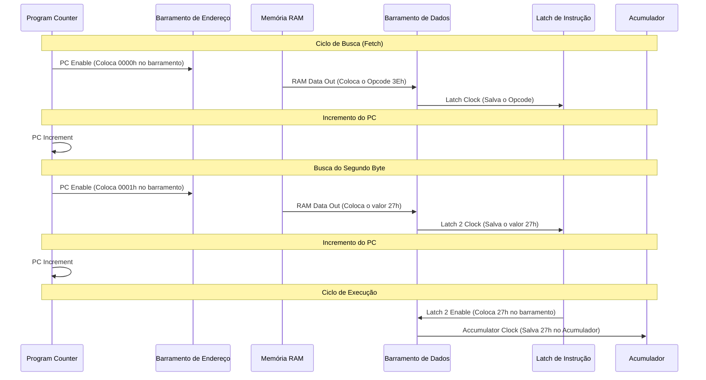
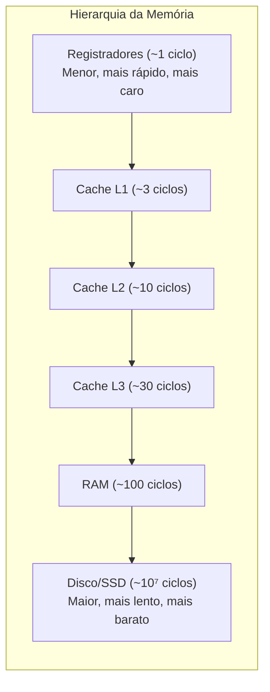
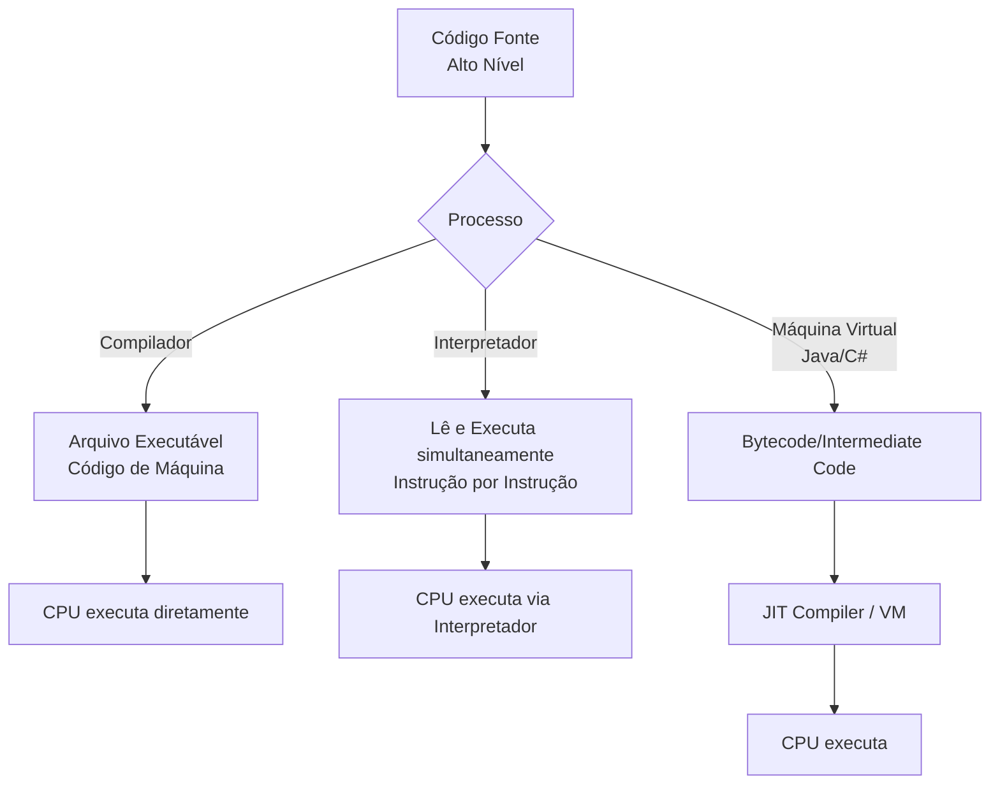
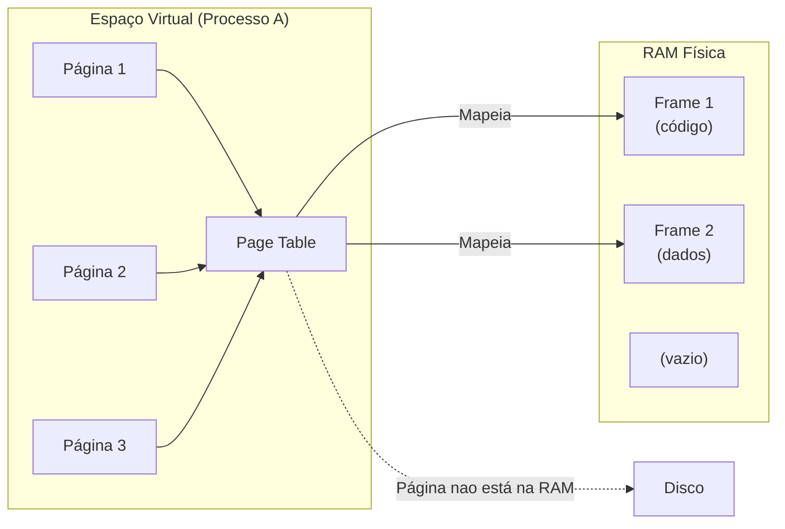
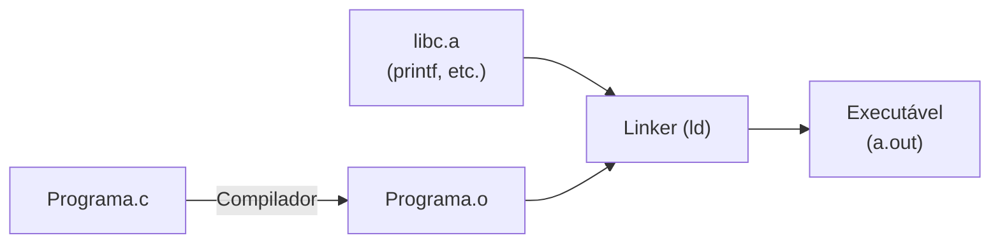
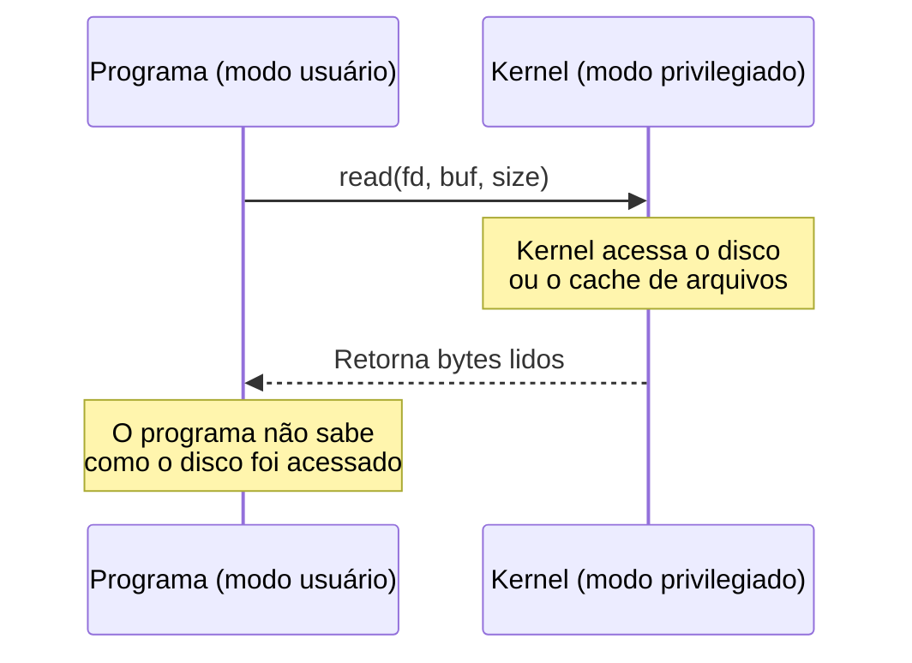
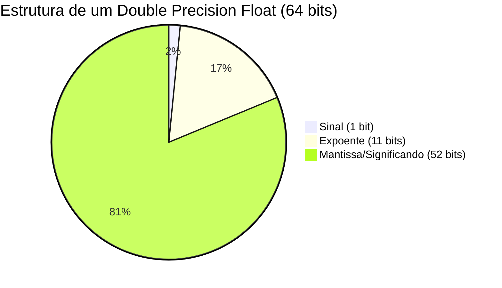
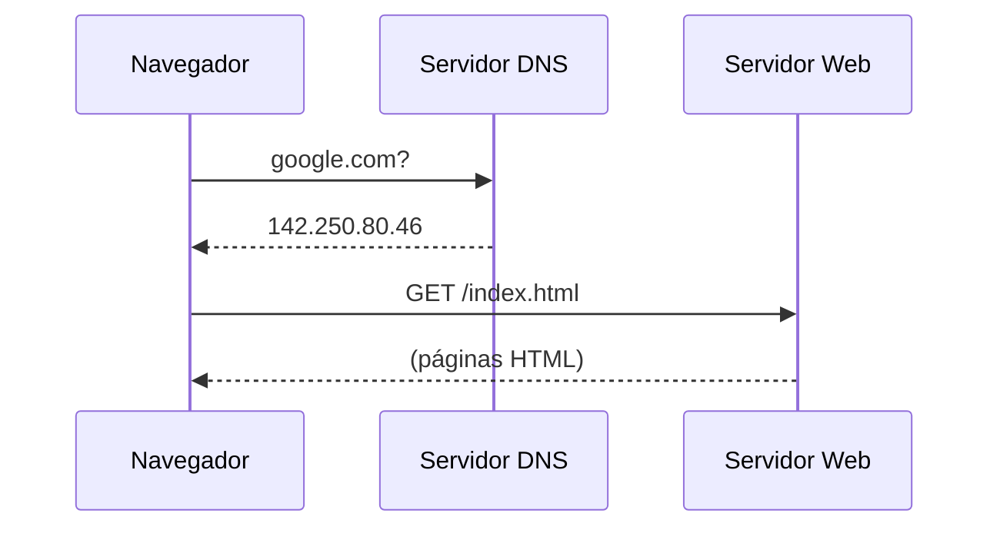

+++
title = "Petzold06 - Do Silício ao Software"
description = "Sinais de controle, fluxo de execução, periféricos, sistemas operacionais e a história da computação"
date = 2026-05-12T18:40:00-03:00
tags = ["arquitetura", "CPU", "sistema operacional", "rede", "compiladores", "história", "computação"]
draft = true
weight = 1
author = "Vitor Lobo Ramos"
+++


# Do Silício ao Software: Desvendando a Arquitetura dos Computadores

Na engenharia, costuma-se dizer que os últimos 10% de um projeto exigem 90% do esforço. Quando olhamos para a construção de um computador a partir de portas lógicas, a Unidade Lógica e Aritmética (ALU) e os registradores parecem ser o coração de tudo. No entanto, conectar essas partes e fazê-las dançar em sincronia para executar um programa exige uma infraestrutura invisível, porém vital: os **[sinais de controle](https://en.wikipedia.org/wiki/Control_unit)**.

Este artigo explora, com profundidade e didática, a ponte fundamental entre o hardware nu e o software interativo, partindo dos sinais elétricos mais básicos de uma CPU (usando o clássico Intel 8080 como guia), passando pelo gerenciamento de periféricos, até chegar à abstração dos Sistemas Operacionais.

---

## 1. A Dança dos Sinais de Controle

Uma CPU como o Intel 8080 é composta por várias peças autônomas: o *Program Counter* (PC), a ALU, a matriz de registradores (A, B, C, D, E, H, L) e os *latches* de instruções. Eles se comunicam através de duas vias principais:

* **Barramento de Dados (8 bits):** Transporta os bytes de informação.
* **Barramento de Endereço (16 bits):** Aponta para onde a informação deve ir ou de onde deve vir na Memória RAM.

Mas como a CPU garante que dois componentes não tentem "falar" no barramento ao mesmo tempo? É aqui que entram os **sinais de controle**, que agem como as cordas de uma marionete. Eles se dividem em dois tipos fundamentais:

1. **Sinais que *colocam* um valor no barramento:** Conectados aos *Enable* (Habilitadores) de *buffers* tri-state.
2. **Sinais que *salvam* um valor do barramento:** Conectados aos *Clock* (Relógios) dos *latches* ou ao sinal de *Write* (Escrita) da RAM.

### A Anatomia de uma Instrução

Vamos analisar a execução da instrução `MVI A, 27h` (Mover o valor Imediato `27h` para o Acumulador). A execução não é mágica; ela ocorre em ciclos de máquina rigorosos.



Nesta coreografia, o relógio (oscilador) do sistema gera pulsos constantes. Circuitos decodificadores traduzem o *Opcode* (código de operação, como `3Eh`) em uma sequência exata de aberturas e fechamentos de *buffers*, garantindo que os dados fluam da RAM para o Acumulador.

---

## 2. Quebrando a Sequência: Saltos, Loops e a Pilha

Um computador que apenas executa instruções linearmente seria apenas uma calculadora superdimensionada. A verdadeira essência da computação, e o que torna uma máquina **Turing Completa** (capaz de computar qualquer coisa computável, desde que tenha memória e tempo suficientes), é a capacidade de repetição (loops) e de tomada de decisão.

### Jumps Condicionais e Incondicionais

A instrução `JMP` (Jump) altera o fluxo do programa substituindo o valor do *Program Counter* por um novo endereço de 16 bits fornecido logo após a instrução. Mas o poder real reside nos saltos condicionais, como `JZ` (Jump if Zero) e `JC` (Jump if Carry).

Essas instruções consultam as **Flags da ALU**. Se você subtrai 1 de um contador e o resultado chega a zero, a Flag *Zero* é ativada. Um `JZ` lerá essa flag; se for 1, o salto ocorre. Se for 0, o programa segue para a próxima linha.

> **O Famoso "Off-By-One":** Ao programar loops em baixo nível, é extremamente comum errar o número de iterações por um valor (ex: inicializar o contador com 200 quando deveria ser 199), dependendo de onde a avaliação da condição `JNZ` ocorre no código.

### Sub-rotinas e a Estrutura de Pilha (Stack)

Para evitar a repetição de código, criamos sub-rotinas (ou funções). O problema é: ao pular para uma sub-rotina usando `CALL`, como o processador sabe para onde voltar depois?

A resposta é a **[Pilha](https://pt.wikipedia.org/wiki/Pilha_(inform%C3%A1tica)) (Stack)**, uma estrutura LIFO (*Last-In-First-Out*) mantida na RAM, gerenciada por um registrador especial chamado *[Stack Pointer](https://en.wikipedia.org/wiki/Stack_register)* (SP).

```mermaid
graph TD
  subgraph Memória RAM (Final do Endereçamento)
    FFFF["Endereço FFFFh (Vazio)"]
    FFFE["Endereço FFFEh (High Byte Retorno)"]
    FFFD["Endereço FFFDh (Low Byte Retorno)"]
    FFFC["Endereço FFFCh <-- Stack Pointer (SP) Atual"]
  end
  
  CALL_Inst["Instrução CALL 14F8h"] --> |1. Decrementa SP<br>2. Salva endereço atual| FFFE
  RET_Inst["Instrução RET"] --> |1. Lê endereço<br>2. Incrementa SP<br>3. Pula de volta| FFFC

```

Quando um `CALL` é executado:

1. O *Stack Pointer* é decrementado.
2. O endereço da próxima instrução (endereço de retorno) é guardado ("pushed") na memória.
3. O `PC` assume o novo endereço da sub-rotina.

Quando um `RET` é executado, o processo inverso ("pop") ocorre, devolvendo a execução exatamente para onde estava. Falhas no balanceamento de `CALL/RET` ou `PUSH/POP` causam os temidos *Stack Overflows* (estouro de pilha) ou *Underflows*.

---

## 3. A Evolução da CPU: Do 8080 aos Processadores Modernos

O Intel 8080 que usamos como modelo executa uma instrução por vez: busca, decodifica, executa, busca a próxima. É simples, didático e lento. As CPUs modernas empregam truques de engenharia que as tornam ordens de grandeza mais rápidas sem alterar o conjunto de instruções visível ao programador.

**Pipeline:** Em vez de esperar uma instrução terminar para começar a próxima, a CPU divide cada instrução em estágios (busca, decodificação, execução, escrita do resultado) e sobrepõe a execução. Enquanto a instrução 1 está no estágio de execução, a instrução 2 já está sendo decodificada e a instrução 3 já está sendo buscada na memória. Um pipeline de 5 estágios pode, idealmente, completar uma instrução por ciclo de clock, cinco vezes mais rápido que o 8080.

**Cache:** Buscar dados da RAM leva dezenas de ciclos de clock, tempo suficiente para a CPU executar centenas de operações. Para evitar essa espera, as CPUs modernas incorporam pequenas memórias ultrarrápidas na própria pastilha de silício: os caches L1, L2 e L3. O cache L1, o mais rápido e menor (dezenas de kilobytes), opera quase na velocidade dos registradores. O L2 é maior (centenas de kilobytes), e o L3, maior ainda (megabytes), é compartilhado entre todos os núcleos do processador.

A eficácia do cache depende de um fenômeno chamado **localidade de referência**: programas tendem a acessar dados e instruções em regiões próximas da memória. Quando você itera um array, ao acessar o elemento `[0]`, o cache carrega um bloco inteiro de elementos adjacentes, e a chance de o próximo acesso (`[1]`) já estar no cache é altíssima. Programadores experientes exploram esse princípio organizando dados de forma sequencial, maximizando os *cache hits* e evitando buscas lentas à RAM.

**Hierarquia da Memória:** Esse conceito de usar memórias menores e rápidas como cache para memórias maiores e lentas se estende por todo o sistema computacional. Os registradores da CPU são o nível mais rápido (acesso em ~1 ciclo). Abaixo vêm L1, L2, L3 (alguns ciclos cada), depois a RAM (dezenas de ciclos), e por fim o disco rígido ou SSD (milhões de ciclos). Cada nível serve como cache para o próximo: a RAM cacheia dados do disco, o cache L3 cacheia dados da RAM, e assim por diante. Um programador que entende essa hierarquia consegue ganhos enormes de desempenho apenas reorganizando loops e escolhendo estruturas de dados que respeitem a localidade.



**Execução Fora de Ordem:** Se a instrução 3 precisa de um dado que ainda está sendo carregado da RAM, a CPU não precisa esperar parada. Ela analisa as instruções seguintes, identifica quais não dependem desse dado, e as executa antes. O resultado final respeita a ordem original, mas internamente a execução foi reordenada para manter o pipeline cheio.

**Múltiplos Núcleos:** Em vez de um único pipeline, colocamos vários processadores completos (núcleos) no mesmo chip e conectamos cada um ao cache compartilhado. O sistema operacional pode então distribuir programas entre os núcleos, executando múltiplas tarefas verdadeiramente em paralelo, algo que o 8080, com sua execução estritamente sequencial, jamais poderia fazer.

---

## 4. O Mundo Exterior: Periféricos e I/O

Até agora, nossa CPU é um cérebro enclausurado. Para ser útil, ela precisa de Entrada/Saída (I/O).

### Portas Mapeadas vs. Memória Mapeada

Existem duas formas principais de comunicação com periféricos:

* **I/O Mapeado em Memória:** O periférico (como a placa de vídeo) ocupa endereços normais da RAM. Escrever no endereço `A000h` pode, na verdade, acender um pixel na tela.
* **I/O em Portas Isoladas:** Instruções específicas como `IN` e `OUT` (usadas no 8080) se comunicam com um barramento secundário. O comando `IN 25h` lê o teclado na porta 25h, sem consumir endereços da memória RAM principal.

### Polling vs. Interrupções

Como saber se uma tecla foi pressionada?

* **Polling:** A CPU pergunta repetidamente: "Tecla pressionada? Tecla pressionada?". Isso desperdiça ciclos de processamento.
* **Interrupts:** O hardware do teclado envia um sinal de *Interrupção* para a CPU. A CPU pausa o que está fazendo, salva o estado atual na Pilha, executa uma rotina específica (handler do teclado) e depois volta. É muito mais eficiente.

### Vídeo e Áudio: Traduzindo o Mundo

Tudo no computador é digital, mas o mundo é analógico.

* **Monitores:** Um monitor Full HD (1920x1080) possui cerca de 2 milhões de pixels. Se cada pixel usa 3 bytes (RGB, totalizando 16,7 milhões de cores), precisamos de pelo menos 6 MB de *Video RAM*. Conversões de sinal são feitas por Conversores Digital-Analógico (DACs).
* **Áudio:** O som é captado por um microfone e traduzido para números por um ADC (*Analog-to-Digital Converter*). Seguindo o Teorema de Nyquist, um CD grava áudio a 44.100 amostras por segundo, com 16 bits por amostra (estéreo), permitindo capturar frequências de até 22 kHz com excelente faixa dinâmica.

### Armazenamento Persistente: Discos e SSDs

A RAM é volátil, quando a energia acaba, tudo se apaga. Para manter dados entre reinicializações, precisamos de armazenamento persistente.

**Discos Magnéticos (HDD):** Um disco rígido armazena bits em finas camadas de material magnético sobre discos de metal ou vidro que giram a até 15.000 RPM. Uma cabeça de leitura/gravação, montada na ponta de um braço mecânico, voa a nanômetros de distância da superfície. A direção do campo magnético em cada região minúscula da superfície define se aquele bit é 0 ou 1. A superfície do disco é organizada em trilhas concêntricas, divididas em setores (tipicamente 512 bytes cada). O controlador do disco traduz um endereço lógico (como o setor 1.234) em uma coordenada física (trilha X, setor Y). Esse mapeamento é uma abstração, o sistema operacional nunca precisa saber onde a cabeça leitora está.

**Unidades de Estado Sólido (SSD):** SSDs não têm partes móveis. Eles usam células de memória flash NAND, onde cada célula é um transistor de porta flutuante capaz de reter elétrons (e portanto um valor binário) mesmo sem energia. A grande diferença em relação à RAM é que a leitura é rápida, a escrita é mais lenta, e cada célula suporta um número finito de ciclos de gravação (desgaste). Para contornar isso, o controlador do SSD usa um *wear-leveling* (nivelamento de desgaste): espalha as gravações por todo o chip para que nenhuma região se desgaste antes das outras.

**Sistemas de Arquivos:** Um setor bruto de 512 bytes é inútil sem organização. O sistema operacional (seja FAT32, NTFS, ext4 ou APFS) impõe uma estrutura: divide o disco em clusters (grupos de setores), mantém uma tabela que mapeia quais clusters pertencem a qual arquivo, e registra metadados como nome, tamanho, data de criação e permissões. Quando você salva um arquivo, o OS consulta essa tabela, encontra espaço livre e escreve os dados; quando o lê, segue o caminho inverso. Tudo isso acontece sem que o programador precise saber em qual setor físico o byte está.

---

## 5. O Maestro do Sistema: O Sistema Operacional

Você terminou de montar seu computador, ligou a energia e olhou para a tela. O que aparece? *Lixo*. Pixels aleatórios e caracteres sem sentido. Isso acontece porque a RAM acorda em um estado imprevisível e não há software carregado.

Antigamente, usavam-se painéis frontais cheios de chaves para inserir, bit a bit, um pequeno programa na memória. Esse pequeno código (o *Bootstrap Loader*) tinha uma única função: ler o primeiro setor do disco magnético e executá-lo. O código do disco, por sua vez, carregava o resto do **Sistema Operacional (OS)**.

### A Revolução da Abstração

O OS é essencial por gerenciar o *File System* (organizando blocos dispersos do disco rígido em arquivos nomeados) e por fornecer **APIs**.

Sistemas históricos como o **CP/M** (de Gary Kildall) introduziram uma arquitetura dividida:

1. **BIOS (Basic I/O System):** O código específico que falava diretamente com o hardware.
2. **BDOS (Basic Disk Operating System):** O código de alto nível que gerenciava arquivos.

Se você fosse criar um software, não precisaria saber qual tela ou qual disco o usuário tinha. Bastava chamar a API do sistema operacional (no CP/M, a famosa interrupção `CALL 5`). Essa "independência de dispositivo" permitiu o nascimento da indústria de software comercial.

### Da Linha de Comando à Interface Gráfica

Sistemas como o CP/M, MS-DOS e o próprio UNIX (projetado para ser elegante, modular e focado em texto) operavam por **Interface de Linha de Comando (CLI)**. A interação era focada no teclado.

A mudança de paradigma ocorreu em laboratórios como o Xerox PARC com o projeto *Alto*, seguido pela Apple (Lisa/Macintosh). A tela deixou de ser um simples terminal de texto para se tornar uma matriz bidimensional densa gerenciada por uma **Interface Gráfica do Usuário (GUI)**.

Um OS gráfico moderno é monumentalmente mais complexo. Em vez de simplesmente "imprimir um caractere", a API gráfica desenha linhas, calcula preenchimentos e mapeia fontes em bitmaps variados. Ele unifica a forma como janelas, botões e menus são desenhados, oferecendo uma interface coesa para o usuário e ferramentas robustas para o programador.

A jornada do hardware ao software é uma odisseia de abstração empilhada. Relés e transistores formam portas lógicas; portas lógicas formam ALUs e registradores. Sinais de controle orquestram esses elementos, decodificando Opcodes para acessar a memória e interagir com o mundo externo através de interrupções e ADCs/DACs. Por fim, o Sistema Operacional doma todo esse hardware bruto, fornecendo um ambiente amigável e um sistema de arquivos coeso.

## Da Escovação de Bits à Mente Global: A Evolução do Código e da Internet

Programar diretamente em código de máquina é como tentar almoçar usando apenas um palito de dentes: as porções são minúsculas, o processo é exaustivamente trabalhoso e a refeição parece durar uma eternidade. No fundo, todo computador executa apenas instruções primárias, mover um byte da memória para o processador, somar dois valores, guardar o resultado,, mas a abstração dessas tarefas foi o que nos permitiu construir desde simples calculadoras até a rede global que hoje interliga a humanidade.

---

## 6. A Escada da Abstração: Do Silício à Semântica

Nos primórdios da computação, a entrada de dados era feita literalmente alterando chaves em um painel frontal. O primeiro grande salto de abstração foi a **Linguagem Assembly**. Em vez de decorar que o byte `46h` do Intel 8080 fazia o processador mover um dado da memória para o registrador B, os programadores começaram a usar mnemônicos como `MOV B,M`.

O problema? A CPU não entende Assembly. Inicialmente, o programador escrevia o código no papel e fazia o *hand-assembling* (a conversão manual para hexadecimal), calculando na unha os endereços de memória para cada instrução de pulo (`JMP`) ou chamada (`CALL`).

A virada de jogo foi ensinar o próprio computador a fazer esse trabalho sujo através de um programa chamado **Assembler** (Montador). Em sistemas operacionais clássicos como o CP/M, você usava um editor de texto (`ED.COM`) para escrever um arquivo `.ASM` e, em seguida, rodava o `ASM.COM`. O montador lia o texto, realizava o *parsing* (separando comandos e argumentos) e gerava o arquivo `.COM` executável, substituindo o trabalho monótono por eficiência de máquina.

### Linguagens de Alto Nível: Falando (Quase) como Humanos

O Assembly ainda tinha dois gargalos cruciais: era maçante (você precisava microgerenciar a CPU) e não era portável (um código de Intel 8080 não rodava num Motorola 6800). A solução lógica foi criar **linguagens de alto nível**.

A pioneira na compilação prática foi [Grace Hopper](https://pt.wikipedia.org/wiki/Grace_Hopper), que em 1952 criou o A-0 para o UNIVAC. Logo surgiram gigantes como FORTRAN (focado em engenharia e cálculos de ponto flutuante), COBOL (focado em negócios) e ALGOL. O ALGOL, em especial, introduziu a **programação estruturada**, estabelecendo blocos lógicos como `if` e `for`, banindo a necessidade de espaguetes de código baseados em pulos diretos (`goto`).

Abaixo, podemos ver como um fluxo de execução difere entre linguagens compiladas e interpretadas:



Linguagens como Pascal (popularizada pelo Turbo Pascal e sua revolucionária IDE integrada) e C (que manteve o perigoso, porém poderoso, conceito de *ponteiros* de memória) pavimentaram o caminho. O C inspirou quase tudo que usamos hoje: C++, Java, C# e, claro, o onipresente **JavaScript**.

---

## 7. A Grande Ilusão: Memória Virtual

Todo programa que você escreve acredita que tem a memória inteira só para si. Um programa em C pode usar o endereço `0x1000` para uma variável, e outro programa rodando ao mesmo tempo pode usar o **mesmo** endereço `0x1000` para uma variável diferente, sem conflito. Como isso é possível?

A resposta é a **memória virtual**, uma das ideias mais engenhosas da computação.

O sistema operacional, com ajuda de hardware especializado (a **MMU**, Memory Management Unit), cria para cada processo a ilusão de um espaço de endereçamento privado e contínuo. Na realidade, esses endereços virtuais são mapeados para posições físicas reais da RAM, possivelmente fragmentadas e compartilhadas.

### Page Tables: O Tradutor

O mapeamento de endereços virtuais para físicos é feito através de uma estrutura chamada **page table** (tabela de páginas). A memória virtual é dividida em blocos de tamanho fixo chamados **páginas** (tipicamente 4 KB). Cada entrada na page table diz:

* **Válida?** Esta página virtual existe ou não foi alocada?
* **Presente na RAM?** Se sim, qual o endereço físico correspondente?
* **Permissões:** Leitura? Escrita? Execução?



### Page Faults: Quando a Memória Mente

Quando um programa acessa um endereço virtual cuja página não está na RAM, a MMU dispara uma exceção chamada **page fault**. O sistema operacional então:

1. Interrompe o programa.
2. Localiza a página necessária no disco (no arquivo de *swap* ou no executável original).
3. Escolhe uma página na RAM para sacrificar (a **vítima**).
4. Se a vítima foi modificada, copia-a de volta ao disco.
5. Carrega a nova página do disco para a RAM.
6. Atualiza a page table.
7. Retoma o programa exatamente de onde parou.

O programa nunca sabe que isso aconteceu, a ilusão é perfeita.

### TLB: O Cache do Tradutor

Traduzir endereços virtuais toda hora seria lentíssimo se exigisse uma ida à RAM a cada acesso. Por isso, a CPU possui um cache minúsculo e ultrarrápido dentro da MMU chamado **TLB** (Translation Lookaside Buffer). Ele guarda as traduções mais usadas recentemente. Para a maioria dos acessos, a tradução ocorre em um único ciclo de clock, sem ida à RAM, sem page fault.

### Por Que Isso Importa?

A memória virtual não é apenas uma curiosidade técnica, ela é o que torna possível:

* **Isolamento entre processos:** Um programa não pode ler ou corromper a memória de outro.
* **Compartilhamento seguro:** Bibliotecas compartilhadas (como `libc.so`) ocupam uma única cópia na RAM física, mas aparecem no espaço virtual de cada processo.
* **Programação simplificada:** Cada programa age como se tivesse um espaço contínuo gigantesco, sem se preocupar com os outros processos.

---

## 8. Como um Programa se Torna Processo

Você escreve código em C, o compilador gera assembly, o montador gera código de máquina. Agora você tem um arquivo executável no disco. Como ele vira um processo rodando na memória?

### O Linking

Primeiro, o **linker** (ligador) entra em cena. Seu programa chama funções como `printf`, que estão em bibliotecas separadas. O linker costura seu código com essas bibliotecas, resolve os endereços e gera o executável final.



### O Loading

Quando você digita `./programa` no shell, o sistema operacional faz:

1. **Cria um novo processo** com seu próprio espaço de endereçamento.
2. **Mapeia o executável na memória virtual**, as páginas do código e dos dados são ligadas ao arquivo no disco via page tables, mas ainda não carregadas na RAM.
3. **Inicia a execução** pulando para a primeira instrução.

Conforme o programa executa e acessa novas páginas, o mecanismo de **page fault** descrito acima as carrega da memória **sob demanda** (*demand paging*). É por isso que programas enormes podem iniciar quase instantaneamente: apenas as páginas realmente necessárias são carregadas.

### System Calls: A Porta de Entrada para o Kernel

Programas de usuário não podem acessar hardware diretamente, isso quebraria o isolamento. Quando seu programa precisa ler um arquivo, criar um processo ou alocar memória, ele faz uma **chamada de sistema** (system call):



A chave aqui é o **modo de execução**: o processador alterna entre modo usuário (restrito) e modo kernel (privilegiado) através de uma instrução especial de *trap*. É a única maneira de um programa de usuário realizar operações que exigem privilégio.

---

## 9. Números Reais no Mundo Digital: IEEE 754

Experimente `0.1 + 0.2` em JavaScript, Python ou C com float. O resultado não é `0.3`, é `0.30000000000000004`. Isso não é um bug; é uma consequência inevitável de como os computadores representam números reais.

O padrão **IEEE 754** define como números de ponto flutuante são armazenados em 32 bits (float) ou 64 bits (double). Um número de precisão dupla (64 bits) é dividido assim:



O valor real é calculado por:

**(-1)^s, 1.f, 2^(e−1023)**

* **s (Sinal):** 0 para positivo, 1 para negativo.
* **e (Expoente):** Armazenado com um *viés* (bias) de 1023, permitindo representar expoentes negativos sem usar um bit de sinal separado.
* **1.f (Significando):** Como em binário normalizado o primeiro dígito antes da vírgula é sempre 1, ele é omitido ("implied leading 1"). Ganhamos um bit extra de precisão gratuitamente.

O erro de `0.1 + 0.2` ocorre porque `0.1` em decimal é uma dízima periódica em binário: `0.00011001100110011...`. Não importa quantos bits você use, nunca conseguirá representá-lo exatamente. O IEEE 754 corta em 52 bits de mantissa, daí a pequena diferença.

O padrão define também **casos especiais**: infinito (+∞, −∞), NaN (Not a Number, para resultados como 0/0), e valores denormalizados para números muito próximos de zero.

---

## 10. Redes: O Computador como Parte de um Todo

Nenhum computador moderno é uma ilha. A capacidade de conectar máquinas em rede é o que possibilitou a internet, a web, o email e praticamente tudo que torna os computadores úteis hoje.

Os dados trafegam em **pacotes**, pequenos blocos de bytes com cabeçalho (endereço de origem/destino) e payload (dados). Estes pacotes são roteados através de uma série de roteadores até chegar ao destino. Se um pacote se perde, ele é retransmitido.

O modelo de camadas organiza a comunicação:

* **Camada de Aplicação:** HTTP (web), SMTP (email), DNS (nomes).
* **Camada de Transporte:** TCP (conexão confiável) ou UDP (mensagens rápidas).
* **Camada de Rede:** IP (endereçamento e roteamento).
* **Camada de Enlace:** Ethernet, Wi-Fi (meio físico).

Cada máquina na internet possui um **endereço IP** único (como `192.168.1.1`). Como seres humanos preferem nomes a números, o **DNS** (Domain Name System) traduz nomes como `google.com` para endereços IP.



Quando você digita uma URL no navegador, é isso que acontece: seu computador consulta o DNS, descobre o IP do servidor, e então troca pacotes TCP/IP com ele para baixar e exibir a página.

---

### 🔧 Exercícios

**1. Page Table:** Um sistema tem espaço virtual de 32 bits e páginas de 4 KB. Quantos bits tem o número de página virtual (VPN)? Quantas entradas há em uma page table de um único nível?

**2. Sob demanda:** Por que um executável de 100 MB pode iniciar em milissegundos, enquanto carregar 100 MB do disco levaria segundos?

**3. IEEE 754:** Quantos números diferentes podem ser representados com um float de 32 bits (1 bit de sinal, 8 de expoente, 23 de mantissa)? (Dica: 2³².) Isso significa que a reta real é totalmente coberta? Explique.

**4. Camadas:** Quando você envia um email, em qual camada do modelo de redes ele é encapsulado? E o endereço IP do destinatário, em qual camada ele pertence?

**5. Linking:** Por que um linker consegue detectar que você chamou `printf` mas esqueceu de incluir `#include <stdio.h>`? (Dica: pense em quando o erro aparece, é na compilação ou na linkedição?)

<details>
<summary><b>Respostas</b></summary>

1. VPN = 32 − 12 (offset) = **20 bits**. A page table tem 2²⁰ = **1.048.576 entradas**.
2. **Demand paging:** apenas as páginas efetivamente acessadas são carregadas. Um executável de 100 MB pode ter apenas 1-2 MB de código realmente executado na inicialização.
3. 2³² = **4.294.967.296 valores distintos**. Porém, a reta real é infinita e contínua, então mesmo 2³² valores são um subconjunto infinitesimal, daí os erros de arredondamento.
4. O email (aplicação) está na **camada de aplicação**. O endereço IP está na **camada de rede**.
5. O linker só detecta o erro na **etapa de linkedição** (ld), não na compilação. O compilador aceita a declaração implícita de `printf` (ou um protótipo sem corpo), mas o linker não encontra o código objeto da função e gera *"undefined reference"*.
</details>

---

## O Quadro Completo

Este artigo percorreu um caminho imenso: começamos nos sinais de controle que coordenam a CPU, passamos pela pilha de execução, cache e memória virtual, até chegar à internet. Se há um tema unificador, é a **abstração em camadas**.

Cada nível esconde a complexidade do anterior e oferece uma interface mais simples ao próximo. O programador em C não precisa saber em que frame da RAM física sua variável está; o usuário do navegador não precisa saber quantos roteadores seu pacote atravessou. Mas alguém, em cada nível, *precisa* saber, e esse alguém é o engenheiro de sistemas que entende a máquina de cima a baixo.

O processador 8080 que começou esta série como um modelo didático de 6.000 transistores evoluiu para chips com bilhões. As instruções assembly que ocupavam bytes agora são traduzidas por pipelines superscalares que executam múltiplas instruções por ciclo. Nada disso seria possível sem as abstrações que construímos: portas lógicas, flip-flops, barramentos, endereçamento virtual, camadas de rede. Cada uma apoia-se na anterior.

---

**Fonte:** [Code: The Hidden Language of Computer Hardware and Software](https://a.co/d/0a3DsSsn), 2ª ed., Charles Petzold
