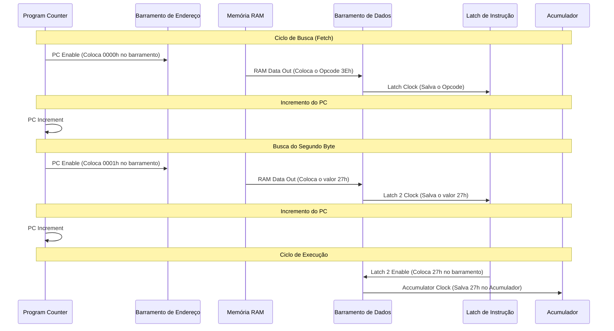
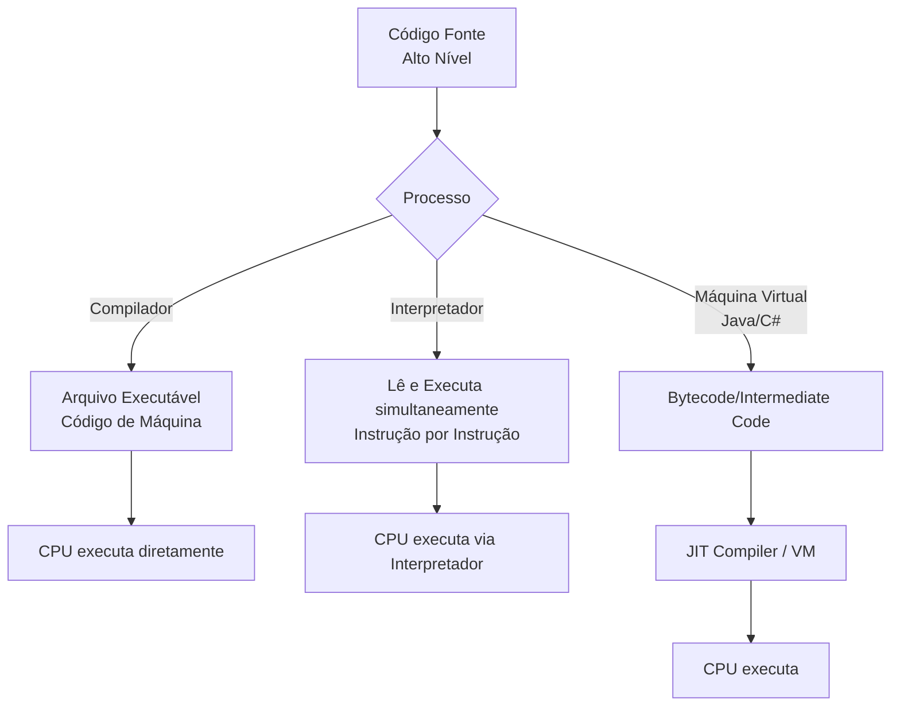
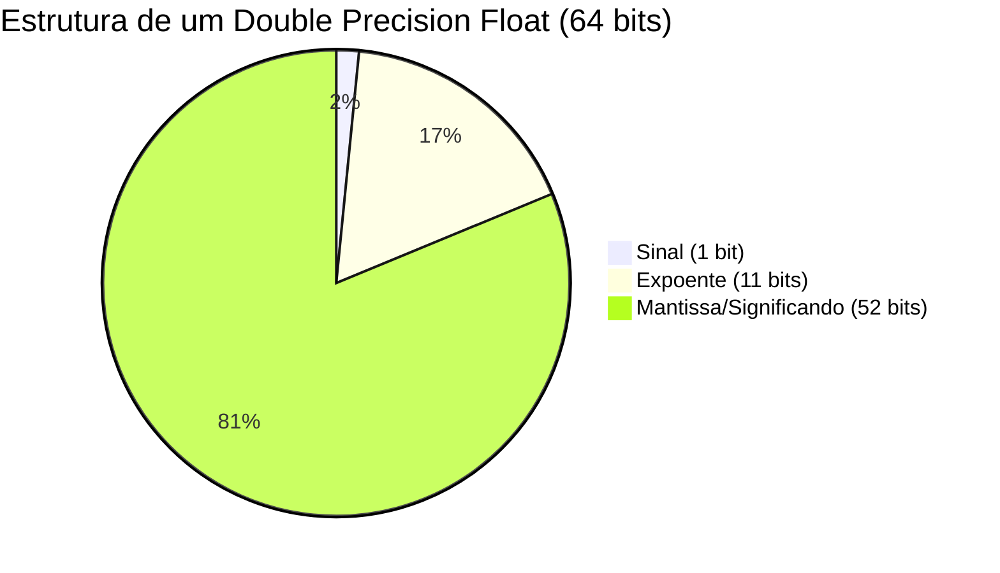
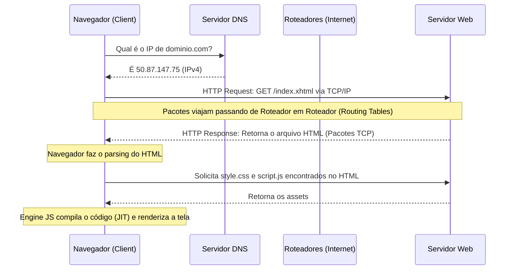

+++
title = "Base06 - Do Silício ao Software"
description = "Sinais de controle, fluxo de execução, periféricos, sistemas operacionais e a história da computação"
date = 2026-05-12T18:40:00-03:00
tags = ["arquitetura", "CPU", "sistema operacional", "rede", "compiladores", "história", "computação"]
draft = true
weight = 1
author = "Vitor Lobo Ramos"
+++


# Do Silício ao Software: Desvendando a Arquitetura dos Computadores

Na engenharia, costuma-se dizer que os últimos 10% de um projeto exigem 90% do esforço. Quando olhamos para a construção de um computador a partir de portas lógicas, a Unidade Lógica e Aritmética (ALU) e os registradores parecem ser o coração de tudo. No entanto, conectar essas partes e fazê-las dançar em sincronia para executar um programa exige uma infraestrutura invisível, porém vital: os **[sinais de controle](https://en.wikipedia.org/wiki/Control_unit)**.

Este artigo explora, com profundidade e didática, a ponte fundamental entre o hardware nu e o software interativo, partindo dos sinais elétricos mais básicos de uma CPU (usando o clássico Intel 8080 como guia), passando pelo gerenciamento de periféricos, até chegar à abstração dos Sistemas Operacionais.

---

## 1. A Dança dos Sinais de Controle

Uma CPU como o Intel 8080 é composta por várias peças autônomas: o *Program Counter* (PC), a ALU, a matriz de registradores (A, B, C, D, E, H, L) e os *latches* de instruções. Eles se comunicam através de duas vias principais:

* **Barramento de Dados (8 bits):** Transporta os bytes de informação.
* **Barramento de Endereço (16 bits):** Aponta para onde a informação deve ir ou de onde deve vir na Memória RAM.

Mas como a CPU garante que dois componentes não tentem "falar" no barramento ao mesmo tempo? É aqui que entram os **sinais de controle**, que agem como as cordas de uma marionete. Eles se dividem em dois tipos fundamentais:

1. **Sinais que *colocam* um valor no barramento:** Conectados aos *Enable* (Habilitadores) de *buffers* tri-state.
2. **Sinais que *salvam* um valor do barramento:** Conectados aos *Clock* (Relógios) dos *latches* ou ao sinal de *Write* (Escrita) da RAM.

### A Anatomia de uma Instrução

Vamos analisar a execução da instrução `MVI A, 27h` (Mover o valor Imediato `27h` para o Acumulador). A execução não é mágica; ela ocorre em ciclos de máquina rigorosos.



Nesta coreografia, o relógio (oscilador) do sistema gera pulsos constantes. Circuitos decodificadores traduzem o *Opcode* (código de operação, como `3Eh`) em uma sequência exata de aberturas e fechamentos de *buffers*, garantindo que os dados fluam da RAM para o Acumulador.

---

## 2. Quebrando a Sequência: Saltos, Loops e a Pilha

Um computador que apenas executa instruções linearmente seria apenas uma calculadora superdimensionada. A verdadeira essência da computação—e o que torna uma máquina *[Turing Completa](https://pt.wikipedia.org/wiki/Turing_completude)*—é a capacidade de repetição (loops) e de tomada de decisão.

### Jumps Condicionais e Incondicionais

A instrução `JMP` (Jump) altera o fluxo do programa substituindo o valor do *Program Counter* por um novo endereço de 16 bits fornecido logo após a instrução. Mas o poder real reside nos saltos condicionais, como `JZ` (Jump if Zero) e `JC` (Jump if Carry).

Essas instruções consultam as **Flags da ALU**. Se você subtrai 1 de um contador e o resultado chega a zero, a Flag *Zero* é ativada. Um `JZ` lerá essa flag; se for 1, o salto ocorre. Se for 0, o programa segue para a próxima linha.

> **O Famoso "Off-By-One":** Ao programar loops em baixo nível, é extremamente comum errar o número de iterações por um valor (ex: inicializar o contador com 200 quando deveria ser 199), dependendo de onde a avaliação da condição `JNZ` ocorre no código.

### Sub-rotinas e a Estrutura de Pilha (Stack)

Para evitar a repetição de código, criamos sub-rotinas (ou funções). O problema é: ao pular para uma sub-rotina usando `CALL`, como o processador sabe para onde voltar depois?

A resposta é a **[Pilha](https://pt.wikipedia.org/wiki/Pilha_(inform%C3%A1tica)) (Stack)**, uma estrutura LIFO (*Last-In-First-Out*) mantida na RAM, gerenciada por um registrador especial chamado *[Stack Pointer](https://en.wikipedia.org/wiki/Stack_register)* (SP).

```mermaid
graph TD
    subgraph Memória RAM (Final do Endereçamento)
        FFFF["Endereço FFFFh (Vazio)"]
        FFFE["Endereço FFFEh (High Byte Retorno)"]
        FFFD["Endereço FFFDh (Low Byte Retorno)"]
        FFFC["Endereço FFFCh <-- Stack Pointer (SP) Atual"]
    end
    
    CALL_Inst["Instrução CALL 14F8h"] --> |1. Decrementa SP<br>2. Salva endereço atual| FFFE
    RET_Inst["Instrução RET"] --> |1. Lê endereço<br>2. Incrementa SP<br>3. Pula de volta| FFFC

```

Quando um `CALL` é executado:

1. O *Stack Pointer* é decrementado.
2. O endereço da próxima instrução (endereço de retorno) é guardado ("pushed") na memória.
3. O `PC` assume o novo endereço da sub-rotina.

Quando um `RET` é executado, o processo inverso ("pop") ocorre, devolvendo a execução exatamente para onde estava. Falhas no balanceamento de `CALL/RET` ou `PUSH/POP` causam os temidos *Stack Overflows* (estouro de pilha) ou *Underflows*.

---

## 3. A Evolução da CPU: Do 8080 aos Processadores Modernos

O Intel 8080 que usamos como modelo executa uma instrução por vez: busca, decodifica, executa, busca a próxima. É simples, didático e lento. As CPUs modernas empregam truques de engenharia que as tornam ordens de grandeza mais rápidas sem alterar o conjunto de instruções visível ao programador.

**Pipeline:** Em vez de esperar uma instrução terminar para começar a próxima, a CPU divide cada instrução em estágios (busca, decodificação, execução, escrita do resultado) e sobrepõe a execução. Enquanto a instrução 1 está no estágio de execução, a instrução 2 já está sendo decodificada e a instrução 3 já está sendo buscada na memória. Um pipeline de 5 estágios pode, idealmente, completar uma instrução por ciclo de clock — cinco vezes mais rápido que o 8080.

**Cache:** Buscar dados da RAM leva dezenas de ciclos de clock. Para evitar essa espera, as CPUs modernas incorporam pequenas memórias ultrarrápidas na própria pastilha de silício: os caches L1, L2 e L3. O cache L1, o mais rápido e menor (alguns kilobytes), fica dentro do núcleo da CPU; o L3 é maior (megabytes) e compartilhado entre núcleos. A CPU verifica o cache antes de buscar na RAM — e na maioria das vezes o dado está lá (*cache hit*).

**Execução Fora de Ordem:** Se a instrução 3 precisa de um dado que ainda está sendo carregado da RAM, a CPU não precisa esperar parada. Ela analisa as instruções seguintes, identifica quais não dependem desse dado, e as executa antes. O resultado final respeita a ordem original — mas internamente a execução foi reordenada para manter o pipeline cheio.

**Múltiplos Núcleos:** Em vez de um único pipeline, colocamos vários processadores completos (núcleos) no mesmo chip e conectamos cada um ao cache compartilhado. O sistema operacional pode então distribuir programas entre os núcleos, executando múltiplas tarefas verdadeiramente em paralelo — algo que o 8080, com sua execução estritamente sequencial, jamais poderia fazer.

---

## 4. O Mundo Exterior: Periféricos e I/O

Até agora, nossa CPU é um cérebro enclausurado. Para ser útil, ela precisa de Entrada/Saída (I/O).

### Portas Mapeadas vs. Memória Mapeada

Existem duas formas principais de comunicação com periféricos:

* **I/O Mapeado em Memória:** O periférico (como a placa de vídeo) ocupa endereços normais da RAM. Escrever no endereço `A000h` pode, na verdade, acender um pixel na tela.
* **I/O em Portas Isoladas:** Instruções específicas como `IN` e `OUT` (usadas no 8080) se comunicam com um barramento secundário. O comando `IN 25h` lê o teclado na porta 25h, sem consumir endereços da memória RAM principal.

### Polling vs. Interrupções

Como saber se uma tecla foi pressionada?

* **Polling:** A CPU pergunta repetidamente: "Tecla pressionada? Tecla pressionada?". Isso desperdiça ciclos de processamento.
* **Interrupts:** O hardware do teclado envia um sinal de *Interrupção* para a CPU. A CPU pausa o que está fazendo, salva o estado atual na Pilha, executa uma rotina específica (handler do teclado) e depois volta. É muito mais eficiente.

### Vídeo e Áudio: Traduzindo o Mundo

Tudo no computador é digital, mas o mundo é analógico.

* **Monitores:** Um monitor Full HD (1920x1080) possui cerca de 2 milhões de pixels. Se cada pixel usa 3 bytes (RGB, totalizando 16,7 milhões de cores), precisamos de pelo menos 6 MB de *Video RAM*. Conversões de sinal são feitas por Conversores Digital-Analógico (DACs).
* **Áudio:** O som é captado por um microfone e traduzido para números por um ADC (*Analog-to-Digital Converter*). Seguindo o Teorema de Nyquist, um CD grava áudio a 44.100 amostras por segundo, com 16 bits por amostra (estéreo), permitindo capturar frequências de até 22 kHz com excelente faixa dinâmica.

### Armazenamento Persistente: Discos e SSDs

A RAM é volátil — quando a energia acaba, tudo se apaga. Para manter dados entre reinicializações, precisamos de armazenamento persistente.

**Discos Magnéticos (HDD):** Um disco rígido armazena bits em finas camadas de material magnético sobre discos de metal ou vidro que giram a até 15.000 RPM. Uma cabeça de leitura/gravação, montada na ponta de um braço mecânico, voa a nanômetros de distância da superfície. A direção do campo magnético em cada região minúscula da superfície define se aquele bit é 0 ou 1. A superfície do disco é organizada em trilhas concêntricas, divididas em setores (tipicamente 512 bytes cada). O controlador do disco traduz um endereço lógico (como o setor 1.234) em uma coordenada física (trilha X, setor Y). Esse mapeamento é uma abstração — o sistema operacional nunca precisa saber onde a cabeça leitora está.

**Unidades de Estado Sólido (SSD):** SSDs não têm partes móveis. Eles usam células de memória flash NAND, onde cada célula é um transistor de porta flutuante capaz de reter elétrons (e portanto um valor binário) mesmo sem energia. A grande diferença em relação à RAM é que a leitura é rápida, a escrita é mais lenta, e cada célula suporta um número finito de ciclos de gravação (desgaste). Para contornar isso, o controlador do SSD usa um *wear-leveling* (nivelamento de desgaste): espalha as gravações por todo o chip para que nenhuma região se desgaste antes das outras.

**Sistemas de Arquivos:** Um setor bruto de 512 bytes é inútil sem organização. O sistema operacional (seja FAT32, NTFS, ext4 ou APFS) impõe uma estrutura: divide o disco em clusters (grupos de setores), mantém uma tabela que mapeia quais clusters pertencem a qual arquivo, e registra metadados como nome, tamanho, data de criação e permissões. Quando você salva um arquivo, o OS consulta essa tabela, encontra espaço livre e escreve os dados; quando o lê, segue o caminho inverso. Tudo isso acontece sem que o programador precise saber em qual setor físico o byte está.

---

## 5. O Maestro do Sistema: O Sistema Operacional

Você terminou de montar seu computador, ligou a energia e olhou para a tela. O que aparece? *Lixo*. Pixels aleatórios e caracteres sem sentido. Isso acontece porque a RAM acorda em um estado imprevisível e não há software carregado.

Antigamente, usavam-se painéis frontais cheios de chaves para inserir, bit a bit, um pequeno programa na memória. Esse pequeno código (o *Bootstrap Loader*) tinha uma única função: ler o primeiro setor do disco magnético e executá-lo. O código do disco, por sua vez, carregava o resto do **Sistema Operacional (OS)**.

### A Revolução da Abstração

O OS é essencial por gerenciar o *File System* (organizando blocos dispersos do disco rígido em arquivos nomeados) e por fornecer **APIs**.

Sistemas históricos como o **CP/M** (de Gary Kildall) introduziram uma arquitetura dividida:

1. **BIOS (Basic I/O System):** O código específico que falava diretamente com o hardware.
2. **BDOS (Basic Disk Operating System):** O código de alto nível que gerenciava arquivos.

Se você fosse criar um software, não precisaria saber qual tela ou qual disco o usuário tinha. Bastava chamar a API do sistema operacional (no CP/M, a famosa interrupção `CALL 5`). Essa "independência de dispositivo" permitiu o nascimento da indústria de software comercial.

### Da Linha de Comando à Interface Gráfica

Sistemas como o CP/M, MS-DOS e o próprio UNIX (projetado para ser elegante, modular e focado em texto) operavam por **Interface de Linha de Comando (CLI)**. A interação era focada no teclado.

A mudança de paradigma ocorreu em laboratórios como o Xerox PARC com o projeto *Alto*, seguido pela Apple (Lisa/Macintosh). A tela deixou de ser um simples terminal de texto para se tornar uma matriz bidimensional densa gerenciada por uma **Interface Gráfica do Usuário (GUI)**.

Um OS gráfico moderno é monumentalmente mais complexo. Em vez de simplesmente "imprimir um caractere", a API gráfica desenha linhas, calcula preenchimentos e mapeia fontes em bitmaps variados. Ele unifica a forma como janelas, botões e menus são desenhados, oferecendo uma interface coesa para o usuário e ferramentas robustas para o programador.

A jornada do hardware ao software é uma odisseia de abstração empilhada. Relés e transistores formam portas lógicas; portas lógicas formam ALUs e registradores. Sinais de controle orquestram esses elementos, decodificando Opcodes para acessar a memória e interagir com o mundo externo através de interrupções e ADCs/DACs. Por fim, o Sistema Operacional doma todo esse hardware bruto, fornecendo um ambiente amigável e um sistema de arquivos coeso.

## Da Escovação de Bits à Mente Global: A Evolução do Código e da Internet

Programar diretamente em código de máquina é como tentar almoçar usando apenas um palito de dentes: as porções são minúsculas, o processo é exaustivamente trabalhoso e a refeição parece durar uma eternidade. No fundo, todo computador executa apenas instruções primárias — mover um byte da memória para o processador, somar dois valores, guardar o resultado —, mas a abstração dessas tarefas foi o que nos permitiu construir desde simples calculadoras até a rede global que hoje interliga a humanidade.

---

## 1. A Escada da Abstração: Do Silício à Semântica

Nos primórdios da computação, a entrada de dados era feita literalmente alterando chaves em um painel frontal. O primeiro grande salto de abstração foi a **Linguagem Assembly**. Em vez de decorar que o byte `46h` do Intel 8080 fazia o processador mover um dado da memória para o registrador B, os programadores começaram a usar mnemônicos como `MOV B,M`.

O problema? A CPU não entende Assembly. Inicialmente, o programador escrevia o código no papel e fazia o *hand-assembling* (a conversão manual para hexadecimal), calculando na unha os endereços de memória para cada instrução de pulo (`JMP`) ou chamada (`CALL`).

A virada de jogo foi ensinar o próprio computador a fazer esse trabalho sujo através de um programa chamado **Assembler** (Montador). Em sistemas operacionais clássicos como o CP/M, você usava um editor de texto (`ED.COM`) para escrever um arquivo `.ASM` e, em seguida, rodava o `ASM.COM`. O montador lia o texto, realizava o *parsing* (separando comandos e argumentos) e gerava o arquivo `.COM` executável, substituindo o trabalho monótono por eficiência de máquina.

### Linguagens de Alto Nível: Falando (Quase) como Humanos

O Assembly ainda tinha dois gargalos cruciais: era maçante (você precisava microgerenciar a CPU) e não era portável (um código de Intel 8080 não rodava num Motorola 6800). A solução lógica foi criar **linguagens de alto nível**.

A pioneira na compilação prática foi [Grace Hopper](https://pt.wikipedia.org/wiki/Grace_Hopper), que em 1952 criou o A-0 para o UNIVAC. Logo surgiram gigantes como FORTRAN (focado em engenharia e cálculos de ponto flutuante), COBOL (focado em negócios) e ALGOL. O ALGOL, em especial, introduziu a **programação estruturada**, estabelecendo blocos lógicos como `if` e `for`, banindo a necessidade de espaguetes de código baseados em pulos diretos (`goto`).

Abaixo, podemos ver como um fluxo de execução difere entre linguagens compiladas e interpretadas:



Linguagens como Pascal (popularizada pelo Turbo Pascal e sua revolucionária IDE integrada) e C (que manteve o perigoso, porém poderoso, conceito de *ponteiros* de memória) pavimentaram o caminho. O C inspirou quase tudo que usamos hoje: C++, Java, C# e, claro, o onipresente **JavaScript**.

---

## 2. JavaScript e o Caos Controlado dos Números Fracionários

O JavaScript, criado por Brendan Eich em 1995, começou como uma forma de dar interatividade a páginas HTML estáticas. Hoje, engines JIT (Just-In-Time) dentro dos navegadores compilam o JS sob demanda, transformando-o em uma potência que roda em quase toda a web.

Para entender o poder do controle de fluxo de uma linguagem de alto nível, considere o **[Crivo de Eratóstenes](https://pt.wikipedia.org/wiki/Crivo_de_Eratóstenes)**, um algoritmo clássico para encontrar números primos. Em JS, manipulamos o *DOM* (Document Object Model) da página HTML para exibir resultados dinamicamente:

```javascript
let primes = new Array(10000).fill(true);

for (let i1 = 2; i1 <= 100; i1++) {
    if (primes[i1]) {
        for (let i2 = 2; i2 < 10000 / i1; i2++) {
            primes[i1 * i2] = false;
        }
    }
}
// Exibição na página web
for (let index = 2; index < 10000; index++) {
    if (primes[index]) {
        document.getElementById("result").innerHTML += index + " ";
    }
}

```

No entanto, linguagens de alto nível mascaram complexidades brutais do hardware. Experimente rodar o seguinte no JS: `55.2 * 27.8`. O resultado não será o exato `1534.56`, mas sim `1534.5600000000002`. Por quê? Bem-vindo ao padrão **[IEEE 754](https://pt.wikipedia.org/wiki/IEEE_754)**.

### O Padrão IEEE 754 (Ponto Flutuante)

Para representar números com casas decimais, os computadores usam a notação científica binária. O Javascript utiliza exclusivamente precisão dupla (64 bits). Esses 64 bits são divididos de forma engenhosa:



A fórmula matemática que o processador utiliza para calcular o valor real a partir desses bits é:

**(-1)^s × 1.f × 2^(e-1023)**

* **s (Sinal):** Define se é positivo (0) ou negativo (1).
* **e (Expoente):** Um valor *biased* (adiciona-se 1023 ao expoente real para lidar com negativos sem sinal extra).
* **1.f (Significando):** Como em binário normalizado o primeiro dígito antes da vírgula é *sempre* 1, ele é omitido da memória. Ganhamos um bit de graça! Os 52 bits armazenam apenas a parte fracionária (a resolução chega a cerca de 16 casas decimais).

O erro de `0.0000000000002` ocorre porque a vasta maioria das frações decimais (como `1.1`) tornam-se dízimas periódicas infinitas quando convertidas para frações binárias (somas de 2⁻¹, 2⁻², 2⁻³...). A memória corta aos 52 bits de precisão, causando leves arredondamentos. Antigamente, operações como senos e cossenos (calculadas através de complexas expansões em série como sen(x) = x − x³/3! + x⁵/5! − ...) eram feitas inteiramente por software. Tudo mudou em 1980 com o **Intel 8087**, um coprocessador matemático (FPU) dedicado inteiramente a mastigar cálculos de ponto flutuante via hardware.

---

## 3. O Cérebro Mundial: Das Fichas à Fibra Óptica

Muito antes do primeiro bit viajar pela rede, visionários já sonhavam com o conhecimento interconectado. Em 1938, H.G. Wells propôs o *World Brain*, uma enciclopédia global, viva e colaborativa. Em 1945, Vannevar Bush imaginou o **Memex**, uma mesa mecanizada de microfilmes onde pesquisadores criariam "trilhas associativas" entre documentos. Duas décadas depois, Ted Nelson cunhou o termo **Hipertexto** para descrever ligações de informação impossíveis de mapear no papel.

O que esses gênios não sabiam é *como* isso seria construído. A resposta veio nos anos 60 com a ARPANET e a brilhante invenção da **Comutação de Pacotes** (Packet Switching).

### Cortando o Arquivo: A Comutação de Pacotes

Em vez de monopolizar uma linha direta entre o Computador A e B para enviar um arquivo de 30KB, o protocolo divide o arquivo em pequenos pacotes de, digamos, 1500 bytes.

Cada pacote carrega um **Cabeçalho** contendo:

* Endereços de origem e destino.
* Número da sequência (ex: pacote 7 de 20).
* Um **Checksum** (cálculo matemático dos bytes do payload). Se o computador receptor calcula o checksum e ele não bate com o do cabeçalho, ele sabe que o pacote foi corrompido no caminho e pede apenas aquele trecho novamente. Isso traz resiliência e permite que múltiplos dispositivos compartilhem a mesma rede simultaneamente.

### Modulações e Fibras: O Meio Físico

A infraestrutura inicial surfou nas costas das linhas telefônicas de voz (300 a 3400 Hz). Aparelhos como o lendário modem Bell 103 (1962) usavam FSK (*Frequency-Shift Keying*). Para transmitir dados, o modem convertia bits em frequências audíveis: no terminal de origem, um sinal de 1070 Hz significava o bit `0`, e 1270 Hz significava o bit `1`. Essa conversão de sinal digital para analógico e vice-versa é o que dá o nome ao **Mo**dulador-**Dem**odulador.

Hoje, as espinhas dorsais da internet (backbones) são cabos submarinos de **Fibra Óptica**, onde feixes de luz infravermelha refletem nas paredes internas de tubos capilares de vidro puro. A luz acesa é `1`, apagada é `0`, permitindo velocidades colossais inimagináveis na era dos 300 *bauds*.

---

## 4. Anatomia de um Request HTTP

A internet moderna, popularizada pela **World Wide Web** (criada por [Tim Berners-Lee](https://pt.wikipedia.org/wiki/Tim_Berners-Lee) em 1989), é um amálgama de protocolos complexos trabalhando em uníssono. A topologia não é centralizada; é uma teia descentralizada de Servidores, Clientes e Roteadores.

Quando você acessa um site digitando uma **URL** (Uniform Resource Locator) no navegador, eis a mágica que acontece em milissegundos:



Nesse trajeto, dois identificadores cruciais coexistem:

1. **Endereço IP (Internet Protocol):** O endereço lógico que orienta a rota do pacote pelas estradas virtuais da internet (Pense no seu CEP).
2. **Endereço MAC (Media Access Control):** Um identificador de 12 dígitos hexadecimais fisicamente embutido na sua placa de rede (NIC). Conforme o pacote pula de roteador em roteador pela teia, os endereços MAC de origem e destino no cabeçalho são atualizados a cada salto, como uma corrida de revezamento local, enquanto o IP permanece o mesmo do início ao fim.

### A Concretização do Sonho

H.G. Wells estaria orgulhoso? Projetos como o Google Books digitalizaram o passado, mas falham em usabilidade de catalogação. Bases como o JSTOR são incríveis repositórios acadêmicos. Mas talvez a realização mais visceral e próxima do ideal do "Cérebro Mundial" de Wells seja a **Wikipedia**. Em suas palestras originais, Wells descreveu uma base que precisava rechaçar propaganda e dogmas agressivamente, focando na organização em prol de uma comunidade global.

O fato de termos saído de chaves elétricas rudimentares para linguagens expressivas, e de frequências de áudio em linhas de cobre para a vastidão óptica do conhecimento compartilhado, é o verdadeiro triunfo da engenharia e do software. O código abstraiu as limitações da máquina, e a internet abstraiu as limitações da mente humana.

---

**Fonte:** [Code: The Hidden Language of Computer Hardware and Software](https://a.co/d/0a3DsSsn), 2ª ed. — Charles Petzold
