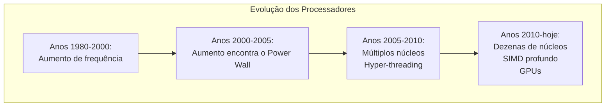
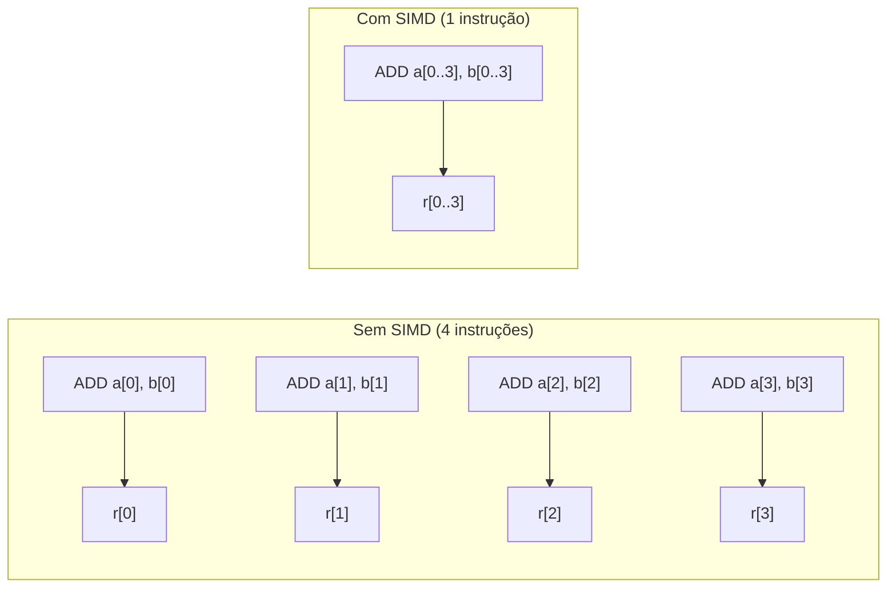
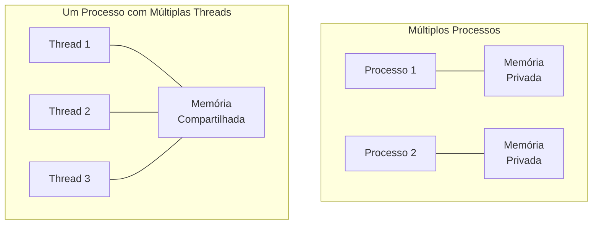
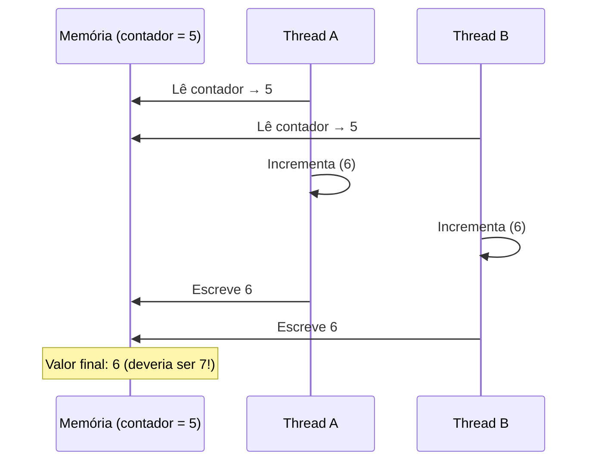
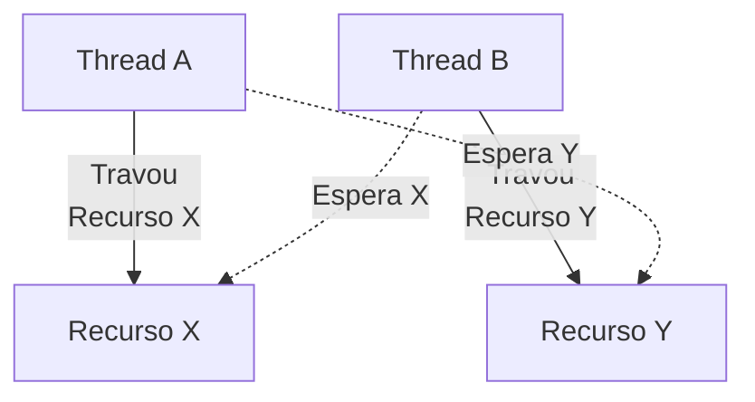

+++
title = "Petzold07 - Múltiplos Fluxos, Múltiplos Núcleos"
description = "Concorrência e paralelismo: como máquinas executam múltiplas tarefas ao mesmo tempo"
date = 2026-05-14T18:40:00-03:00
tags = ["concorrência", "paralelismo", "threads", "SIMD", "sincronização", "história", "computação"]
draft = true
weight = 1
author = "Vitor Lobo Ramos"
+++

Imagine uma cozinha com um único chef. Ele pica os vegetais, depois prepara o molho, depois coloca a água para ferver, depois corta a carne. Tudo em sequência, uma tarefa após a outra. O jantar demora.

Agora imagine a mesma cozinha com três chefs trabalhando lado a lado. Enquanto um pica os vegetais, outro prepara o molho e o terceiro coloca a água no fogo. O jantar fica pronto muito mais rápido, desde que os chefs não disputem a mesma faca, não sujem a tábua um do outro e não esperem eternamente que o colega libere o fogão.

Esta é a essência da computação moderna: **concorrência** (múltiplas tarefas progredindo ao mesmo tempo) e **paralelismo** (múltiplas tarefas executando literalmente em simultâneo). Nas últimas décadas, a indústria descobriu que fazer processadores rodarem mais rápido está ficando cada vez mais difícil, e a saída foi colocar mais "cozinheiros" dentro da máquina.

Este artigo é um mergulho nos diferentes níveis de paralelismo que existem em um computador moderno, desde truques invisíveis que a CPU faz sozinha até o desafio mais espinhoso da programação contemporânea: fazer múltiplos fluxos de execução cooperarem sem se destruir.

---

## 1. O Gargalo da Sequencialidade

Durante décadas, a lei de [Moore](https://pt.wikipedia.org/wiki/Lei_de_Moore) e o aumento da frequência do relógio foram a receita mágica do progresso: a cada nova geração, processadores rodavam mais rápido e programas antigos simplesmente aceleravam sem precisar de modificação.

Isso mudou por volta de 2003. Os chips começaram a esbarrar no que ficou conhecido como **"Power Wall"** (Muro da Energia). Aumentar a frequência exige mais tensão, que gera mais calor, que derrete o chip. Os fabricantes perceberam que não conseguiriam mais fazer um único núcleo rodar significativamente mais rápido sem gastar energia demais.

A solução? Em vez de um chef monstruoso, colocar vários chefs modestos trabalhando lado a lado. Nasceu a era dos **processadores multi-core** (multinúcleo). Mas isso transferiu um problema enorme para os programadores: para aproveitar esses núcleos, o software precisa ser escrito de forma **concorrente**, e isso é muito mais difícil do que parece.



Antes de falarmos de múltiplos núcleos, porém, precisamos entender que o paralelismo já existia dentro de um único núcleo, escondido do programador, mas absolutamente real.

---

## 2. Paralelismo em Nível de Instrução (ILP)

O processador Intel 8080, que usamos como modelo nos artigos anteriores, executa uma instrução por vez: busca, decodifica, executa, busca a próxima. É simples, correto e lento. Processadores modernos fazem algo muito mais esperto: **executam várias instruções ao mesmo tempo**, mantendo a ilusão de que tudo ocorre em sequência.

### Pipeline: A Linha de Montagem

O truque mais básico é o **pipeline**. Em vez de esperar uma instrução terminar completamente para começar a próxima, a CPU divide cada instrução em estágios (busca, decodificação, execução, acesso à memória, escrita do resultado) e sobrepõe a execução. Enquanto a instrução 1 está no estágio de execução, a instrução 2 já está sendo decodificada e a instrução 3 já está sendo buscada na memória.

```mermaid
gantt
  title Pipeline de 5 estágios
  dateFormat HH:mm
  axisFormat %H:%M
  
  section Instrução 1
  Busca   :i1f, 00:00, 1m
  Decodifica :i1d, after i1f, 1m
  Executa  :i1e, after i1d, 1m
  Memória  :i1m, after i1e, 1m
  Escreve  :i1w, after i1m, 1m
  
  section Instrução 2
  Busca   :i2f, after i1f, 1m
  Decodifica :i2d, after i2f, 1m
  Executa  :i2e, after i2d, 1m
  Memória  :i2m, after i2e, 1m
  Escreve  :i2w, after i2m, 1m
  
  section Instrução 3
  Busca   :i3f, after i2f, 1m
  Decodifica :i3d, after i3f, 1m
  Executa  :i3e, after i3d, 1m
  Memória  :i3m, after i3e, 1m
  Escreve  :i3w, after i3m, 1m
```



### Superscalar e Execução Fora de Ordem

O pipeline acelera as coisas, mas ainda executa uma instrução por ciclo no máximo. Processadores **superscalares** vão além: eles têm múltiplas unidades funcionais (somadores, multiplicadores, unidades de carga/armazenamento) e podem emitir várias instruções num mesmo ciclo de clock, desde que elas não dependam umas das outras.

O nome disso é **paralelismo em nível de instrução** (ILP), e ele é explorado automaticamente pelo hardware. Um Core i7 moderno pode manter até 6 instruções por ciclo em situações ideais. Mais impressionante ainda: a CPU faz *especulação*. Ela adivinha o resultado de desvios condicionais (branch prediction), executa instruções adiante, e se errar, descarta tudo e recomeça, como um xadrezista que calcula lances antecipados.

---

## 3. SIMD: Uma Instrução, Múltiplos Dados

O ILP acelera programas sem que o programador precise fazer nada. Mas há outro nível de paralelismo que exige colaboração explícita: o **SIMD** (Single Instruction, Multiple Data, uma única instrução operando sobre múltiplos dados simultaneamente).

A ideia é simples: se você precisa somar dois vetores de 4 números, por que executar 4 instruções de soma se o hardware pode fazer tudo de uma vez?



Em 1997, a Intel introduziu o conjunto de instruções **MMX** (MultiMedia eXtensions), seguido pelo **SSE** (Streaming SIMD Extensions) em 1999. Versões modernas como **AVX** (Advanced Vector Extensions) trabalham com registradores de 256 e até 512 bits, capazes de processar 8 números de ponto flutuante de 32 bits em paralelo com uma única instrução.

Onde o SIMD brilha:

* **Processamento de áudio e vídeo:** Cada frame de vídeo é uma matriz de pixels, operações SIMD ideais.
* **Criptografia:** Algoritmos como AES se beneficiam enormemente de operações paralelas.
* **Aprendizado de máquina:** Redes neurais realizam essencialmente multiplicações de matrizes, o paraíso do SIMD.
* **Jogos:** Cálculos de transformação geométrica e iluminação são intrinsecamente paralelos.

Programadores que dominam SIMD conseguem ganhos de desempenho de 4, a 8, em operações numéricas sem trocar de processador.

---

## 4. Concorrência entre Processos e Threads

Até aqui falamos de paralelismo que acontece dentro de um único fluxo de execução. Mas o tipo mais visível de concorrência é aquele em que **múltiplos fluxos de execução** compartilham o processador.

### Processos: Ilhas Isoladas

Como vimos no artigo anterior, o sistema operacional cria **processos** para executar programas. Cada processo tem seu próprio espaço de endereçamento, memória, pilha, registradores, completamente isolado dos demais. Um processo não pode ler ou escrever na memória de outro sem mecanismos explícitos de comunicação (IPC).

Isolamento é seguro, mas torna a comunicação lenta. Para compartilhar dados entre processos, é preciso usar pipes, filas de mensagens, memória compartilhada ou soquetes, cada operação custando uma chamada ao kernel.

### Threads: Vizinhos no Mesmo Andar

**Threads** são uma alternativa mais leve. Uma thread é uma linha de execução que roda **dentro** de um processo. Todas as threads de um mesmo processo compartilham o mesmo espaço de endereçamento, código, dados e arquivos abertos. Cada thread tem apenas sua própria pilha, seus registradores e seu contador de programa.



A vantagem é enorme: threads podem compartilhar dados simplesmente lendo e escrevendo nas mesmas variáveis globais. A desvantagem é que esse compartilhamento é uma faca de dois gumes, e é aí que mora o perigo.

A tabela abaixo resume as diferenças:

| Característica | Processos | Threads |
|---|---|---|
| Espaço de endereçamento | Independente | Compartilhado |
| Comunicação | IPC (lento) | Memória compartilhada (rápido) |
| Criação | Mais lenta (fork) | Mais rápida (pthread_create) |
| Chaveamento | Contexto pesado (kernel) | Contexto leve (kernel, mesmo processo) |
| Isolamento | Total (seguro) | Nenhum (perigoso) |
| Sincronização | Necessária (IPC) | Crucial (variáveis compartilhadas) |

### O Modelo de Memória Compartilhada

Em um programa com múltiplas threads, tudo que está no espaço de endereçamento é acessível a todas as threads. Variáveis globais, objetos no heap, código, arquivos abertos, tudo é compartilhado. Apenas as variáveis locais (na pilha) de cada thread são privadas.

```c
#include <stdio.h>
#include <pthread.h>

int contador_global = 0; // Compartilhado entre todas as threads

void *minha_thread(void *arg) {
  int local = 0; // Privado desta thread
  for (int i = 0; i < 1000000; i++)
    contador_global++; // Perigo! Acesso concorrente
  return NULL;
}

int main() {
  pthread_t t1, t2;
  pthread_create(&t1, NULL, minha_thread, NULL);
  pthread_create(&t2, NULL, minha_thread, NULL);
  pthread_join(t1, NULL);
  pthread_join(t2, NULL);
  printf("Contador: %d (esperado: 2000000)\n", contador_global);
  return 0;
}
```

O código acima parece inofensivo, duas threads incrementam um contador. Mas na prática, o resultado quase nunca é o esperado. Executando o programa compilado, vemos algo como:

```
$ ./contador 1000000
Contador: 1445085 (esperado: 2000000)
$ ./contador 1000000
Contador: 1915220 (esperado: 2000000)
$ ./contador 1000000
Contador: 1404746 (esperado: 2000000)
```

Cada execução produz um resultado **diferente e incorreto**. O valor nunca é 2.000.000. Isso não é um bug do compilador ou do hardware, é uma **condição de corrida** entre as duas threads.

> **Para testar você mesmo:** salve o código como `contador.c`, compile com `gcc contador.c -lpthread -o contador` e execute `./contador 1000000`. O resultado provavelmente será diferente de 2000000, e diferente a cada execução.

---

## 5. O Desafio da Sincronização

O problema do contador ilustra um dos conceitos mais sutis da programação concorrente: a **race condition** (condição de corrida).

### A Condição de Corrida

Para entender por que o contador falha, vejamos o que acontece nos bastidores. Incrementar uma variável (`contador++`) não é uma operação atômica. A máquina executa três passos:

1. **Ler** o valor da memória para um registrador
2. **Incrementar** o registrador
3. **Escrever** o registrador de volta na memória

Se duas threads executam esses três passos simultaneamente, o interleave (entrelaçamento) pode ser desastroso:



Ambas as threads leram o mesmo valor 5, ambas incrementaram para 6, e ambas escreveram 6. Perdeu-se um incremento. Se isso acontece 50.000 vezes durante a execução, o resultado final pode ser qualquer coisa entre 1.000.000 e 2.000.000, imprevisível e incorreto.

### A Solução: Exclusão Mútua com Semáforos

Para impedir essas condições de corrida, precisamos garantir que apenas uma thread execute a seção crítica (o trecho de código que acessa a variável compartilhada) por vez. A ferramenta clássica para isso é o **semáforo**, proposto por Edsger Dijkstra em 1965.

Um semáforo funciona como um sinaleiro de trânsito: ele pode estar verde (liberado) ou vermelho (bloqueado). A operação `P` (do holandês *Proberen*, testar) tenta passar, se o sinal está vermelho, a thread espera. A operação `V` (*Verhogen*, incrementar) libera o sinal, acordando uma thread que esteja esperando.

```c
#include <semaphore.h>

sem_t mutex;

void *minha_thread(void *arg) {
  for (int i = 0; i < 1000000; i++) {
    sem_wait(&mutex); // P: tenta entrar
    contador_global++; // Seção crítica
    sem_post(&mutex); // V: libera
  }
  return NULL;
}

int main() {
  sem_init(&mutex, 0, 1); // Inicia verde (valor 1)
  // ... cria threads, espera, imprime
}
```

Com o semáforo, a execução se torna segura: quando a Thread A está na seção crítica, a Thread B que tentar entrar será bloqueada até que A termine. O resultado passa a ser sempre 2.000.000, como esperado:

```
$ ./contador_sync 1000000
Contador: 2000000 (esperado: 2000000)
$ ./contador_sync 1000000
Contador: 2000000 (esperado: 2000000)
```

A desvantagem é que o programa fica mais lento, cada incremento agora requer duas chamadas de sistema (P e V), e as threads passam parte do tempo bloqueadas esperando o mutex ser liberado. Este é o **preço da correção**: sincronizar é mais lento, mas não sincronizar é simplesmente errado.

### O Preço da Sincronização

Garantir exclusão mútua resolve a correção, mas tem um custo. Se as threads passam muito tempo esperando umas pelas outras, o paralelismo diminui. Em casos extremos, o programa pode rodar *mais devagar* com múltiplas threads do que com uma só, um paradoxo conhecido como **contenção de lock**.

É por isso que programação concorrente é considerada uma arte: é preciso equilibrar a segurança dos dados com a eficiência da execução. Escolher o tamanho certo das seções críticas, minimizar o compartilhamento e usar estruturas de dados projetadas para concorrência são habilidades que separam programadores experientes dos demais.

---

## 6. Deadlocks: O Abraço Fatal

Se a condição de corrida é o problema mais comum da concorrência, o **deadlock** é o mais temido.

Um deadlock ocorre quando duas ou mais threads ficam esperando eternamente por recursos que uma detém e a outra precisa. É o "abraço fatal": você precisa do que eu tenho, eu preciso do que você tem, e ninguém cede.



O exemplo clássico é o **jantar dos filósofos**, proposto por Dijkstra. Cinco filósofos estão sentados em uma mesa redonda, cada um com um garfo à sua esquerda. Para comer, um filósofo precisa dos dois garfos, o da esquerda e o da direita. Se todos pegam o garfo da esquerda simultaneamente, ninguém consegue pegar o da direita, e todos ficam esperando eternamente.

Na prática, deadlocks acontecem quando:

1. **Exclusão mútua:** Recursos não podem ser compartilhados
2. **Posse e espera:** Threads seguram recursos enquanto esperam por outros
3. **Não preempção:** Recursos não podem ser tomados à força
4. **Espera circular:** Existe um ciclo de threads esperando umas pelas outras

A boa notícia é que existem estratégias para evitar deadlocks: adquirir todos os recursos de uma vez, estabelecer uma ordem global de aquisição (sempre travar o Recurso X antes do Y), ou usar algoritmos de detecção que matam threads emperradas.

### 🔧 Exercícios

**1. Condição de corrida:** Duas threads executam o seguinte código concorrentemente, onde `cont` começa em 0:
```c
// Thread A e Thread B executam isso:
int tmp = cont;
tmp = tmp + 1;
cont = tmp;
```
Qual é O MENOR valor possível de `cont` ao final? E o MAIOR? (Desconsidere reordenações do compilador.)

**2. Semáforos na prática:** No problema do contador (seção 5), o que aconteceria se esquecêssemos de chamar `sem_post(&mutex)` dentro do loop? E se esquecêssemos `sem_wait(&mutex)`?

**3. Detectando deadlock:** Dois processos, P1 e P2, acessam dois arquivos, A e B. P1 abre A, depois B. P2 abre B, depois A. Em que circunstância ocorre um deadlock? Como quebrá-lo?

**4. Produtor-consumidor:** Escreva uma sequência de operações P e V em um buffer de 1 slot (um semáforo `slots` iniciado em 1, um semáforo `items` iniciado em 0) que permita a um produtor e um consumidor alternarem sem race condition.

<details>
<summary><b>Respostas</b></summary>

1. **Menor:** 1 (ambas leem 0, ambas escrevem 1). **Maior:** 2 (execução sequencial ideal). A race faz o resultado variar entre 1 e 2.
2. Sem `sem_post`: a primeira thread trava o mutex, executa a seção crítica, e depois nunca libera, a segunda thread fica bloqueada eternamente (**deadlock**). Sem `sem_wait`: não há exclusão mútua, ambas acessam `cont` simultaneamente e a race condition retorna.
3. Deadlock ocorre se P1 abre A e P2 abre B simultaneamente: cada um espera pelo recurso que o outro detém. Soluções: (a) ambos adquirirem os recursos na mesma ordem (sempre A antes de B); (b) usar um timeout que libera o primeiro recurso se o segundo não for obtido.
4. Produtor: `P(slots)`, produz item, `V(items)`. Consumidor: `P(items)`, consome item, `V(slots)`. O buffer de 1 slot garante alternância forçada.
</details>

---

## 7. O Futuro dos Múltiplos Fluxos

Onde estamos hoje e para onde vamos?

**Processadores many-core:** CPUs com dezenas de núcleos já são realidade. O processador de servidor AMD EPYC tem até 96 núcleos, 192 threads com hyper-threading. Aproveitar todo esse potencial exige software altamente concorrente.

**GPUs como aceleradores paralelos:** Uma GPU moderna como a NVIDIA RTX 4090 tem mais de 16.000 núcleos SIMD. Programadas corretamente (via CUDA, OpenCL ou Vulkan), elas executam milhares de operações matemáticas em paralelo, ideais para aprendizado de máquina e simulações científicas.

**Paralelismo em nível de tarefa:** Linguagens modernas como Go, Rust e Java incorporam primitivas de concorrência diretamente na linguagem, tornando mais seguro para programadores comuns escrever código concorrente sem medo de condições de corrida.

O hardware não vai parar de adicionar núcleos, e a pressão sobre os programadores para escrever código paralelo só aumenta. Entender concorrência, seus mecanismos, seus perigos e suas soluções, não é mais uma especialidade; é uma habilidade fundamental.

---

## Conclusão

Começamos este artigo com uma cozinha de três chefs. Vimos que o paralelismo existe em múltiplos níveis: dentro do processador (ILP, SIMD), entre processos (isolamento total) e entre threads (memória compartilhada). Em cada nível, o desafio é o mesmo: coordenar os fluxos para que trabalhem juntos sem atrapalhar uns aos outros.

Por décadas, programadores puderam ignorar esses problemas, a frequência dos processadores dobrava a cada 18 meses e programas velhos rodavam mais rápido em máquinas novas. Esse mundo acabou. Hoje, escrever código que realmente aproveita o hardware exige entender concorrência, sincronização e deadlocks.

A boa notícia é que as ferramentas estão amadurecendo. Semáforos, mutexes, monitores, canais e atores são abstrações que tornam a programação concorrente cada vez mais segura. Cabe a nós, programadores, dominá-las.

---

**Fonte:** [Code: The Hidden Language of Computer Hardware and Software](https://a.co/d/0a3DsSsn), 2ª ed., Charles Petzold<br>
[Computer Systems: A Programmer's Perspective](https://csapp.cs.cmu.edu), 2ª ed., Randal E. Bryant e David R. O'Hallaron
