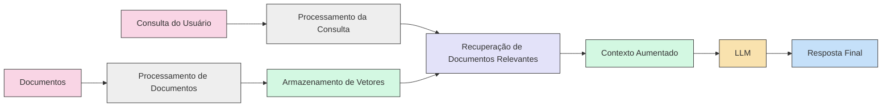

+++
title = "RAG Simples com Clojure e Ollama"
description = "Um protótipo funcional do zero"
date = 2024-01-23T19:00:00-00:00
tags = ["RAG", "LLM", "AI", "Langchain"]
draft = false
weight = 1
author = "Vitor Lobo Ramos"
+++

# Sumário

- **[O que é RAG e por que precisamos dele?](#o-que-é-rag-e-por-que-precisamos-dele)**
    - [Por que isso é um problema?](#por-que-isso-é-um-problema)
    - [E é aí que entra o RAG!](#e-é-aí-que-entra-o-rag)
    - **[Construindo uma aplicação RAG simples](#construindo-uma-aplicação-rag-simples)**
        - [Preparando o ambiente](#preparando-o-ambiente)
        - [Estrutura do projeto](#estrutura-do-projeto)
        - [Usando Ollama para LLMs locais sem API keys](#usando-ollama-para-llms-locais-sem-api-keys)
        - [Como usar?](#como-usar)
- **[Considerações importantes](#considerações-importantes)**
- **[Próximos passos](#próximos-passos)**
- **[Langchain4j para simplificar a criação de RAG](#langchain4j-para-simplificar-a-criação-de-rag)**


Olá, pessoal! 👋 

Neste artigo, vamos explorar como construir uma aplicação [RAG (Retrieval-Augmented Generation)](https://pt.wikipedia.org/wiki/Geração_aumentada_por_recuperação) completa do zero usando [Clojure](https://clojure.org/). Vamos mergulhar em uma implementação prática que combina processamento de texto, busca semântica e geração de respostas com LLMs locais. Se você está interessado em melhorar a precisão e relevância das respostas dos seus modelos de linguagem com informações atualizadas, este guia é para você!

## O que é RAG e por que precisamos dele? 

Os Modelos de Linguagem de Grande Escala (LLMs), como o GPT, ChatGPT e outros, revolucionaram a forma como interagimos com a inteligência artificial. Eles são capazes de gerar textos coerentes, responder perguntas complexas e até mesmo criar conteúdo criativo. No entanto, esses modelos possuem uma limitação fundamental: seu conhecimento é "congelado" no tempo.

Quando um LLM é treinado, ele absorve informações disponíveis até um determinado momento - sua data de corte de treinamento. Após esse ponto, o modelo não tem acesso a nenhuma informação nova. É como se ele tivesse uma foto do mundo quando foi treinado, e não conseguisse ver nada que aconteceu depois disso. Por exemplo, se um LLM foi treinado em 2022, ele não vai saber nada sobre:

- Eventos que aconteceram em 2023
- Novas tecnologias que surgiram
- Aquela série nova que todo mundo tá assistindo
- O último filme que ganhou o Oscar


### Por que isso é um problema? 

Ao desenvolver aplicações inteligentes, como assistentes financeiros que precisam de cotações de ações em tempo real, chatbots de suporte que devem conhecer os produtos mais recentes da empresa ou sistemas de recomendação que se baseiam nas últimas tendências, nos deparamos com uma limitação crucial dos Modelos de Linguagem de Grande Escala (LLMs) tradicionais: seu conhecimento estático. 

O problema fundamental reside no fato de que esses modelos, por mais sofisticados que sejam, possuem uma base de conhecimento "congelada" no momento de seu treinamento. Eles carecem de acesso inerente a informações atualizadas, o que restringe drasticamente sua aplicabilidade em cenários que exigem dados em tempo real ou conhecimento sobre eventos recentes.

> Confiar exclusivamente em um LLM "puro" nesses contextos resultará em respostas desatualizadas, potencialmente imprecisas e, consequentemente, em uma experiência do usuário comprometida. A eficácia da aplicação é diretamente afetada. 

É nesse contexto que a técnica de Recuperação de Geração Aumentada (RAG - Retrieval-Augmented Generation) se torna não apenas vantajosa, mas essencial. RAG permite superar a limitação temporal inerente aos LLMs, garantindo que as aplicações inteligentes entreguem informações relevantes e atualizadas.

### E é aí que entra o RAG!

Imagine um LLM como um erudito com vasto conhecimento enciclopédico, mas que viveu isolado em uma biblioteca por décadas. Ele possui um conhecimento profundo de muitos assuntos, mas está desatualizado sobre os eventos recentes e desenvolvimentos em diversas áreas. O RAG, nesse contexto, seria como fornecer a esse erudito um par de óculos de última geração que não apenas corrigem sua visão, mas também o conectam a um fluxo constante de informações atualizadas. 

Ele agora pode ler jornais, artigos científicos recentes, consultar bases de dados em tempo real e, assim, responder a perguntas com uma precisão e relevância muito maiores.

**Os Três Pilares do RAG**:

1. **Conexão com uma base de dados atual:** Em vez de depender apenas do conhecimento estático adquirido durante seu treinamento (que pode se tornar obsoleto rapidamente), o LLM ganha acesso a uma fonte de informações dinâmica e constantemente atualizada. Isso pode ser uma base de dados de notícias, um repositório de documentos corporativos, uma coleção de artigos científicos, ou qualquer outra fonte relevante para a tarefa em questão.

2. **Pesquisa em tempo real:** O LLM não está mais limitado a "lembrar" de informações. Ele adquire a capacidade de "procurar" ativamente por dados relevantes para responder a uma pergunta ou gerar um texto. Isso é semelhante a como nós, humanos, usamos mecanismos de busca para encontrar informações que não temos memorizadas. O LLM, equipado com RAG, pode formular consultas, analisar os resultados e selecionar as informações mais pertinentes.

3. **Combinação de conhecimento base com dados novos:** Este é o ponto crucial que diferencia o RAG de uma simples busca em uma base de dados. O LLM não apenas recupera informações, mas também as integra ao seu conhecimento pré-existente. Ele usa sua capacidade de raciocínio e compreensão para contextualizar os novos dados, identificar contradições, e formular respostas coerentes e informadas. O erudito agora não apenas lê as notícias, mas as interpreta à luz de seu vasto conhecimento.

Segundo um [whitepaper recente dos pesquisadores do Google](https://arxiv.org/abs/2309.01066), existem várias técnicas para turbinar o desempenho dos LLMs, e o RAG é uma das mais promissoras. Isso ocorre porque o RAG aborda algumas das limitações fundamentais desses modelos:

* **Redução de "alucinações":** LLMs, sem acesso a informações externas, podem "inventar" respostas (as chamadas "alucinações") quando confrontados com perguntas sobre tópicos que estão fora de seu conhecimento base. O RAG, ao fornecer dados factuais, diminui drasticamente a probabilidade de alucinações.
* **Respostas mais atualizadas:** O conhecimento de um LLM treinado em um determinado momento fica congelado no tempo. O RAG garante que as respostas reflitam as informações mais recentes disponíveis.
* **Maior transparência e explicabilidade:** Ao citar as fontes de informação utilizadas, o RAG torna as respostas dos LLMs mais transparentes e verificáveis. Isso aumenta a confiança no modelo, pois podemos entender de onde vieram as informações.
* **Melhora no desempenho em tarefas especificas:** O RAG aumenta a capacidade do LLM de lidar com tarefas que requerem acesso e entendimento de bases de dados ou informações especificas, como responder perguntas sobre documentos ou dados de uma empresa.

> O RAG representa um avanço significativo na evolução dos LLMs, permitindo que eles se tornem ferramentas mais confiáveis, precisas e úteis para uma ampla gama de aplicações. Ele transforma o LLM de um "sabe-tudo" desatualizado em um pesquisador ágil e bem-informado, capaz de combinar conhecimento profundo com informações atualizadas em tempo real.

O RAG também é uma maneira de você nichar seu LLM em uma área específica, seja ela um assunto, uma empresa, uma linguagem, uma tecnologia, etc. O RAG é uma técnica que combina a capacidade de geração de texto dos LLMs com um sistema de recuperação de informações. Em vez de depender apenas do conhecimento interno do modelo, o RAG busca informações relevantes em uma base de dados externa antes de gerar uma resposta. A imagem abaixo mostra o fluxo de um sistema RAG:



O diagrama acima ilustra o fluxo de um sistema RAG, desde a ingestão de documentos até a geração da resposta final. Primeiro, os documentos são processados e armazenados como vetores. Quando um usuário faz uma consulta, o sistema processa essa pergunta, recupera os documentos mais relevantes do armazenamento vetorial e cria um contexto aumentado que é enviado ao LLM.

---

### Construindo uma aplicação RAG simples

Vamos construir uma aplicação RAG simples usando Clojure! Nosso objetivo é criar um assistente inteligente que possa responder perguntas sobre documentação técnica de projetos open source. Vou te mostrar como fazer isso passo a passo.

#### Preparando o ambiente

Pre-requisitos:
- [Clojure](https://clojure.org/guides/getting_started): Linguagem de programação funcional que vamos usar para construir a aplicação
- [Leiningen](https://leiningen.org/): Ferramenta de build para Clojure
- [Ollama](https://ollama.com/): Modelo de linguagem local

Primeiro, vamos criar um novo projeto Clojure usando Leiningen:

```bash
lein new app docai
cd docai
```

Agora, vamos adicionar as dependências necessárias no arquivo `project.clj`:

```clojure
(defproject docai "0.1.0-SNAPSHOT"
  :description "Um assistente RAG para consulta de documentação técnica"
  :url "http://example.com/FIXME"
  :license {:name "EPL-2.0 OR GPL-2.0-or-later WITH Classpath-exception-2.0"
            :url "https://www.eclipse.org/legal/epl-2.0/"}
  :dependencies [[org.clojure/clojure "1.11.1"]
                 [markdown-to-hiccup "0.6.2"]    ; Para processar Markdown
                 [hickory "0.7.1"]              ; Para processar HTML
                 [org.clojure/data.json "2.4.0"]  ; Para JSON
                 [http-kit "2.6.0"]             ; Para requisições HTTP
                 [org.clojure/tools.logging "1.2.4"]  ; Para logging
                 [org.clojure/tools.namespace "1.4.4"]  ; Para reloading
                 [org.clojure/core.async "1.6.681"]  ; Para operações assíncronas
                 [org.clojure/core.memoize "1.0.257"]  ; Para cache
                 [org.clojure/core.cache "1.0.225"]]  ; Para cache
  :main ^:skip-aot docai.core
  :target-path "target/%s"
  :profiles {:uberjar {:aot :all
                       :jvm-opts ["-Dclojure.compiler.direct-linking=true"]}})
```

> Curiosidade: Porque Clojure? Por ser uma linguagem funcional, facilita a implementação de pipelines de processamento de dados.

#### Estrutura do projeto

Nossa aplicação terá três componentes principais:
1. **Processamento de documentação (Markdown/HTML)**
   - Extração de texto
   - Pré-processamento de texto
2. **Sistema de embeddings**
   - Criação de embeddings para o texto usando [TF-IDF](https://pt.wikipedia.org/wiki/TF-IDF)
   - Busca por similaridade semântica
3. **Interface com o LLM**
   - Geração de resposta usando o LLM

> **Observação:** Embora o RAG moderno utilize embeddings densos gerados por modelos de linguagem para capturar a semântica de forma mais rica, neste artigo, usaremos uma implementação simplificada de [TF-IDF (Term Frequency-Inverse Document Frequency)](https://pt.wikipedia.org/wiki/TF-IDF). 

O TF-IDF é uma técnica que nos permite representar documentos como vetores, calculando a importância de cada palavra com base em sua frequência no documento e em todo o corpus. Isso nos permite realizar uma busca por similaridade, sem depender de APIs externas para a geração de embeddings. É importante ressaltar que essa é uma abordagem didática e simplificada. Para um sistema RAG de produção, o ideal seria utilizar embeddings gerados pelo próprio modelo de linguagem (ou um modelo compatível), em conjunto com um banco de dados vetorial. 

No entanto, para a parte de geração de respostas, continuaremos usando o [Ollama](https://ollama.com/) com o modelo [deepseek-r1](https://ollama.com/models/deepseek-r1). Vamos criar os namespaces necessários começando pelo módulo de processamento de documentos:

```clojure
;; src/docai/document.clj
(ns docai.document
  (:require [markdown-to-hiccup.core :as md]
            [hickory.core :as html]
            [clojure.string :as str]))

(defn is-string? [x]
  (instance? String x))

(defn extract-text-from-markdown [content]
  (try
    (let [hiccup-result (md/md->hiccup content)
          text-nodes (filter is-string? (flatten hiccup-result))]
      text-nodes)
    (catch Exception e
      (println "Erro ao processar Markdown:" (.getMessage e))
      [content])))

(defn extract-text-from-html [content]
  (try
    (let [dom (html/parse content)
          hiccup-result (html/as-hiccup dom)
          text-nodes (filter is-string? (flatten hiccup-result))]
      text-nodes)
    (catch Exception e
      (println "Erro ao processar HTML:" (.getMessage e))
      [content])))

(defn extract-text
  "Extrai texto de documentação (Markdown ou HTML)"
  [doc-path]
  (println "Extraindo texto de:" doc-path)
  (let [content (slurp doc-path)
        _ (println "Tamanho do conteúdo:" (count content) "caracteres")
        _ (println "Amostra do conteúdo:" (subs content 0 (min 100 (count content))))
        text (if (.endsWith doc-path ".md")
               (extract-text-from-markdown content)
               (extract-text-from-html content))
        _ (println "Quantidade de nós de texto extraídos:" (count text))
        chunks (partition-all 512 text)]  ; 512 tokens por chunk
    (println "Quantidade de chunks gerados:" (count chunks))
    chunks))

(defn preprocess-chunks
  "Limpa e prepara os chunks de texto"
  [chunks]
  (let [processed (map #(-> %
                            (str/join " ")
                            (str/replace #"\s+" " ")
                            (str/trim))
                       chunks)]
    (println "Primeiro chunk processado:" (first processed))
    processed))
```

Em seguida, vamos implementar o módulo de embeddings que vai permitir procurar informações semanticamente relevantes. Aqui estamos usando uma implementação própria de TF-IDF, que é uma técnica eficiente para representar documentos em vetores, sem depender de APIs externas:

```clojure
;; src/docai/embedding.clj
(ns docai.embedding
  (:require [clojure.string :as str]
            [clojure.core.memoize :as memo]))

;; Implementação de embeddings usando TF-IDF simples
;; Não depende de modelos externos, ao contrário do Ollama que usa o deepseek-r1 para o LLM

(defn tokenize
  "Divide o texto em tokens"
  [text]
  (if (string? text)
    (-> text
        str/lower-case
        (str/split #"\s+")
        (->> (filter #(> (count %) 2))))
    []))

(defn term-freq
  "Calcula a frequência dos termos"
  [tokens]
  (frequencies tokens))

(defn string-doc? [x]
  (instance? String x))

(defn doc-freq
  "Calcula a frequência dos documentos"
  [docs]
  (let [string-docs (filter string-doc? docs)  ; Use our own predicate function
        _ (println (str "Processando " (count string-docs) " documentos válidos de " (count docs) " total"))
        doc-tokens (map tokenize string-docs)  
        all-tokens (distinct (flatten doc-tokens))
        doc-count (count string-docs)]
    (if (zero? doc-count)
      {}
      (zipmap all-tokens
              (map #(count (filter (fn [tokens] (some #{%} tokens)) doc-tokens))
                   all-tokens)))))

(defn tf-idf
  "Calcula TF-IDF para um documento"
  [doc doc-freq]
  (if (empty? doc-freq)
    {}
    (let [tokens (tokenize doc)
          tf (term-freq tokens)
          n-docs (count (keys doc-freq))]
      (zipmap (keys tf)
              (map #(* (get tf %) (Math/log (/ n-docs (get doc-freq % 1))))
                   (keys tf))))))

(defn vectorize
  "Converte um documento em um vetor TF-IDF"
  [doc doc-freq]
  (let [tf-idf-scores (tf-idf doc doc-freq)]
    (if (empty? doc-freq)
      []
      (map #(get tf-idf-scores % 0.0)
           (keys doc-freq)))))

(defn create-embeddings
  "Gera embeddings para uma lista de textos usando TF-IDF"
  [texts]
  (try
    (let [doc-freq (doc-freq texts)]
      (map #(vectorize % doc-freq) texts))
    (catch Exception e
      (println "Erro ao criar embeddings: " (.getMessage e))
      (vec (repeat (count texts) [])))))

(defn cosine-similarity
  "Calcula a similaridade do cosseno entre dois vetores"
  [v1 v2]
  (if (or (empty? v1) (empty? v2))
    0.0
    (let [dot-product (reduce + (map * v1 v2))
          norm1 (Math/sqrt (reduce + (map #(* % %) v1)))
          norm2 (Math/sqrt (reduce + (map #(* % %) v2)))]
      (if (or (zero? norm1) (zero? norm2))
        0.0
        (/ dot-product (* norm1 norm2))))))

(defn similarity-search
  "Encontra os N chunks mais similares"
  [query-embedding doc-embeddings n]
  (if (or (empty? query-embedding) (empty? doc-embeddings))
    (take (min n (count doc-embeddings)) (range))
    (let [scores (map #(cosine-similarity query-embedding %) doc-embeddings)]
      (->> (map vector scores (range))
           (sort-by first >)
           (take n)
           (map second)))))
```

O código acima implementa uma técnica chamada [TF-IDF (Term Frequency-Inverse Document Frequency)](https://pt.wikipedia.org/wiki/TF-IDF) para criar representações vetoriais dos textos. Esta abordagem permite calcular a similaridade entre documentos sem depender de modelos externos. No entanto, para a parte de geração, ainda usamos o Ollama com o modelo deepseek-r1.

#### Usando Ollama para LLMs locais sem API keys

Uma vantagem importante dessa abordagem é que vamos utilizar o [Ollama](https://ollama.com/) para executar nossos modelos localmente. O Ollama é uma ferramenta incrível que permite rodar LLMs diretamente na sua máquina, sem depender de serviços em nuvem ou API keys. Vamos implementar a interface com o Ollama:

```clojure
;; src/docai/llm.clj
(ns docai.llm
  (:require [clojure.data.json :as json]
            [org.httpkit.client :as http]))

(def ollama-url "http://localhost:11434/api/generate")
(def model-name "deepseek-r1") ; Modelo DeepSeek para melhor qualidade

(defn call-ollama-api
  "Chama a API do Ollama para gerar uma resposta"
  [prompt]
  (let [request-body {:model model-name
                      :prompt prompt
                      :stream false}
        options {:headers {"Content-Type" "application/json"}
                 :body (json/write-str request-body)}
        response @(http/post ollama-url options)]
    (if (= (:status response) 200)
      (-> response
          :body
          (json/read-str :key-fn keyword)
          :response)
      (str "Erro ao chamar a API do Ollama: " (:status response) " - " (:body response)))))

;; Funções de utilidade para uso futuro:
;;
;; extract-code-blocks: Extrai blocos de código do texto usando regex
;; exemplo de uso:
;;   (extract-code-blocks "```clojure\n(+ 1 2)\n```") => ["(+ 1 2)"]
;;
;; extract-summary: Cria um resumo de texto com tamanho máximo especificado
;; exemplo de uso:
;;   (extract-summary "# Título\nConteúdo longo..." 50) => "Conteúdo longo..."

(defn format-prompt
  "Formata o prompt para o LLM"
  [context query]
  (str "Você é um assistente especializado em documentação técnica. Com base no seguinte contexto da documentação:\n\n"
       context
       "\n\nPergunta: " query
       "\n\nForneça uma resposta técnica precisa e, se possível, inclua exemplos de código. "
       "Se a documentação não contiver informações relevantes para a pergunta, "
       "indique isso claramente e forneça uma resposta geral com base em seu conhecimento."))

(defn generate-response
  "Gera resposta usando o LLM com base no contexto"
  [query context]
  (try
    (let [prompt (format-prompt context query)]
      (println "DEBUG - Enviando prompt para o Ollama usando o modelo" model-name)
      (call-ollama-api prompt))
    (catch Exception e
      (str "Erro ao gerar resposta: " (.getMessage e) 
           "\n\nPor favor, verifique se o Ollama está em execução no endereço " 
           ollama-url 
           "\n\nVocê pode iniciar o Ollama com o comando: ollama serve"))))
```

Note que o módulo `llm.clj` inclui funções utilitárias adicionais como `extract_code_blocks` para extrair blocos de código das respostas e `extract_summary` para criar resumos do texto, além de melhor tratamento de erros na comunicação com o Ollama. Por fim, vamos criar o módulo principal que integra todos os componentes:

```clojure
;; src/docai/core.clj
(ns docai.core
  (:require [docai.document :as doc]
            [docai.embedding :as emb]
            [docai.llm :as llm]
            [clojure.java.io :as io]
            [clojure.string :as str])
  (:gen-class))

(def docs-path "resources/docs")

(defn load-documentation
  "Carrega todos os arquivos de documentação do diretório"
  []
  (->> (file-seq (io/file docs-path))
       (filter #(.isFile %))
       (map #(.getPath %))))

(defn setup-knowledge-base
  "Configura a base de conhecimento inicial"
  []
  (let [doc-files (load-documentation)
        _ (when (empty? doc-files)
            (println "Aviso: Nenhum arquivo de documentação encontrado em resources/docs/"))
        _ (doseq [file doc-files]
            (println "Arquivo encontrado:" file))
        all-chunks (mapcat doc/extract-text doc-files)
        processed-chunks (doc/preprocess-chunks all-chunks)
        _ (println (str "Processando " (count processed-chunks) " chunks de texto..."))
        _ (when (< (count processed-chunks) 5)
            (println "DEBUG - Primeiros chunks:")
            (doseq [chunk (take 5 processed-chunks)]
              (println (str "Chunk: '" (subs chunk 0 (min 50 (count chunk))) "...'"))))
        embeddings (emb/create-embeddings processed-chunks)]
    {:chunks processed-chunks
     :embeddings embeddings
     :original-files doc-files}))

(defn get-file-content
  "Lê o conteúdo completo de um arquivo"
  [file-path]
  (try
    (slurp file-path)
    (catch Exception _
      (println "Erro ao ler arquivo:" file-path)
      "")))

(defn query-rag
  "Processa uma query usando o pipeline RAG"
  [knowledge-base query]
  (println "DEBUG - Processando query:" query)
  (if (and (seq (:chunks knowledge-base)) 
           (seq (:embeddings knowledge-base)))
    (let [query-emb (first (emb/create-embeddings [query]))
          similar-idxs (emb/similarity-search query-emb 
                                            (:embeddings knowledge-base)
                                            3)
          _ (println "DEBUG - Índices similares:" similar-idxs)
          
          ;; Obter contexto relevante
          context-chunks (->> similar-idxs
                              (map #(nth (:chunks knowledge-base) %))
                              (str/join "\n\n"))
          
          ;; Se não houver chunks relevantes, use o conteúdo original
          context (if (str/blank? context-chunks)
                    (if (seq (:original-files knowledge-base))
                      (get-file-content (first (:original-files knowledge-base)))
                      "Não foi possível encontrar informações relevantes.")
                    context-chunks)]
      
      (println "DEBUG - Tamanho do contexto:" (count context) "caracteres")
      (println "DEBUG - Amostra do contexto:" (subs context 0 (min 200 (count context))) "...")
      
      ;; Gerar resposta usando o LLM
      (llm/generate-response query context))
    "Não foi possível encontrar informações relevantes na base de conhecimento."))

(defn -main
  "Função principal que inicializa a aplicação DocAI"
  [& _]
  (println "Inicializando DocAI...")
  
  ;; Verificar se o Ollama está acessível
  (println "Para usar o Ollama, certifique-se de que ele está em execução com o comando: ollama serve")
  (println "Usando o modelo deepseek-r1. Se você ainda não o baixou, execute: ollama pull deepseek-r1")
  
  (let [kb (setup-knowledge-base)]
    (println "Base de conhecimento pronta! Faça sua pergunta:")
    (try
      (loop []
        (when-let [input (read-line)]
          (when-not (= input "sair")
            (println "Processando...")
            (println (query-rag kb input))
            (println "\nPróxima pergunta (ou 'sair' para terminar):")
            (recur))))
      (catch Exception e
        (println "Erro: " (.getMessage e))
        (println "Detalhes: " (ex-data e))))
    (println "Obrigado por usar o DocAI. Até a próxima!")))
```

Note que o módulo principal inclui mais logs com emojis, melhor tratamento de erros e verificações adicionais para garantir que o sistema não falhe quando não há chunks ou embeddings disponíveis.

A estrutura de pastas do projeto fica assim:

```bash
docai/
├── src/
│ ├── docai/
│ │ ├── document.clj  # Processamento de documentos
│ │ ├── embedding.clj # Sistema de embeddings usando TF-IDF
│ │ ├── llm.clj       # Interface com o Ollama
│ │ └── core.clj      # Módulo principal
├── resources/
│ └── docs/           # Onde ficam os documentos
│ │ ├── rag.md        # Este documento sobre RAG
│ │ └── example.md    # Exemplo de documentação JWT
├── project.clj       # Configuração do projeto
└── README.md
```

### Como usar?

1. Instale o Ollama seguindo as instruções em [ollama.com](https://ollama.com)
2. Inicie o servidor Ollama:
```bash
ollama serve
```

É necessário rodar o servidor do Ollama antes de executar o projeto pois, caso contrário, o projeto não conseguirá se conectar ao modelo.

3. Baixe o modelo DeepSeek R1 (ou qualquer outro modelo que preferir):

```bash
ollama pull deepseek-r1
```

4. Coloque seus documentos na pasta `resources/docs/` (já incluímos dois exemplos: rag.md e example.md)
5. Execute o projeto:
```bash
lein run
```

6. Faça suas perguntas! Exemplo:
```
Inicializando DocAI...
Base de conhecimento pronta! Faça sua pergunta:
Como implementar autenticação JWT em Clojure?
Processando...
[Resposta do modelo sobre JWT baseada no example.md]
```

> **NOTA:** A propósito, o projeto docai está disponível no [https://github.com/scovl/docai](https://github.com/scovl/docai) caso você queira contribuir com o projeto ou usar em outro projeto.

### Considerações importantes 

1. **Performance**: Esta implementação é básica e pode ser otimizada:
   - Usando um banco de dados vetorial como [Milvus](https://milvus.io/) ou [FAISS](https://github.com/facebookresearch/faiss)
   - Implementando cache de embeddings
   - Paralelizando o processamento de chunks

2. **Memória**: Para documentações muito extensas, considere:
   - Processar os chunks em lotes
   - Implementar indexação incremental
   - Usar streaming para arquivos grandes

3. **Modelos**: Diferentes modelos do Ollama têm diferentes características:
   - DeepSeek R1: Bom para compreensão geral e geração de texto
   - DeepSeek Coder: Especializado em código
   - Llama 3: Boa alternativa geral
   - Mistral: Bom para tarefas específicas
   - Gemma: Leve e eficiente


---

### Próximos passos

Algumas ideias para expandir o projeto:

1.  **Tokenização Avançada:** Usar um tokenizador de *subpalavras* (como BPE ou WordPiece) para melhorar a busca semântica. Idealmente, o mesmo usado no treinamento do modelo (ex: `deepseek-r1`).
2.  **Embeddings Pré-treinados:** Usar embeddings do próprio modelo (via Ollama) em vez de TF-IDF.  Mais simples e *muito* melhor para busca semântica.
3.  **Banco de Dados Vetorial:** Usar um banco de dados vetorial (Milvus, FAISS, Qdrant, etc.) para lidar com *muitos* documentos de forma eficiente.
4.  **Cache:** Usar cache para os embeddings (e, opcionalmente, respostas) para acelerar o sistema.
5.  **Erros:** Tratar mais erros (Ollama offline, modelo indisponível, rede, arquivos inválidos).
6.  **Logging:** Usar um framework de logging para rastreamento e depuração.
7.  **Testes:** Adicionar testes unitários e de integração.
8.  **Prompt Engineering:** Refinar o prompt (em `format-prompt`) para melhorar as respostas.
9.  **Usar langchain4j:** criar RAG através do [langchain4j](https://github.com/langchain4j/langchain4j) via interop java com o clojure.
  Experimentar com:
    *   Exemplos no prompt (few-shot learning).
    *   Instruções passo a passo (chain-of-thought).
    *   Instruções claras sobre formato, tamanho, etc.
    *   Pedir a fonte da informação (qual chunk).

Bastante mais coisas podem ser feitas, mas essas são as mais importantes.

---

## Langchain4j para simplificar a criação de RAG

Até aqui utilizei a abordagem TF-IDF para criar embeddings e a abordagem manual para criar o RAG com intuito de apenas demonstrar o processo. O ideal, é usar embeddings pré-treinados e um banco de dados vetorial para armazenar os embeddings e realizar a busca por similaridade. Para isso, vamos usar a biblioteca [Langchain4j](https://github.com/langchain4j/langchain4j).

Langchain4j é uma biblioteca Java que oferece uma abstração de alto nível para construir aplicações de IA generativa, incluindo sistemas RAG. Ela se integra bem com Clojure através da interoperabilidade Java. Embora a implementação manual que fizemos anteriormente seja um ótimo exercício de aprendizado, usar Langchain4j pode simplificar significativamente o desenvolvimento, especialmente para aplicações mais complexas.

Vantagens de usar Langchain4j:

- **Abstração:** Langchain4j fornece componentes pré-construídos para tarefas comuns como carregamento de documentos, divisão de texto, criação de embeddings, armazenamento vetorial e interação com LLMs.
- **Modularidade:** Você pode facilmente trocar diferentes implementações (por exemplo, usar diferentes modelos de embedding ou bancos de dados vetoriais) sem alterar o código principal da aplicação.
- **Integração:** Langchain4j oferece integrações com várias ferramentas e serviços populares, incluindo Ollama, bancos de dados vetoriais (como Chroma, Weaviate, Qdrant), e modelos de linguagem de diferentes provedores.
- **Comunidade e Suporte:** Langchain4j possui uma comunidade ativa e boa documentação, facilitando a obtenção de ajuda e a resolução de problemas.

> Em um próximo artigo, escreverei sobre como usar [Langchain4j](https://github.com/langchain4j/langchain4j) para criar um sistema RAG ainda neste mesmo projeto.


---

## Referências

- [RAG](https://www.pinecone.io/learn/rag/) - Documentação do Pinecone
- [Embedding](https://www.pinecone.io/learn/embeddings/) - Documentação do Pinecone
- [LLM](https://www.pinecone.io/learn/llms/) - Documentação do Pinecone
- [Ollama](https://ollama.com/) - Ferramenta para rodar LLMs localmente
- [Clojure](https://clojure.org/) - Documentação do Clojure
- [http-kit](https://github.com/http-kit/http-kit) - Cliente HTTP para Clojure
- [data.json](https://github.com/clojure/data.json) - Biblioteca JSON para Clojure
- [clojure.test](https://clojure.github.io/clojure/clojure.test-api.html) - Documentação da biblioteca de testes do Clojure
- [clj-kondo](https://github.com/clj-kondo/clj-kondo) - Linter para Clojure