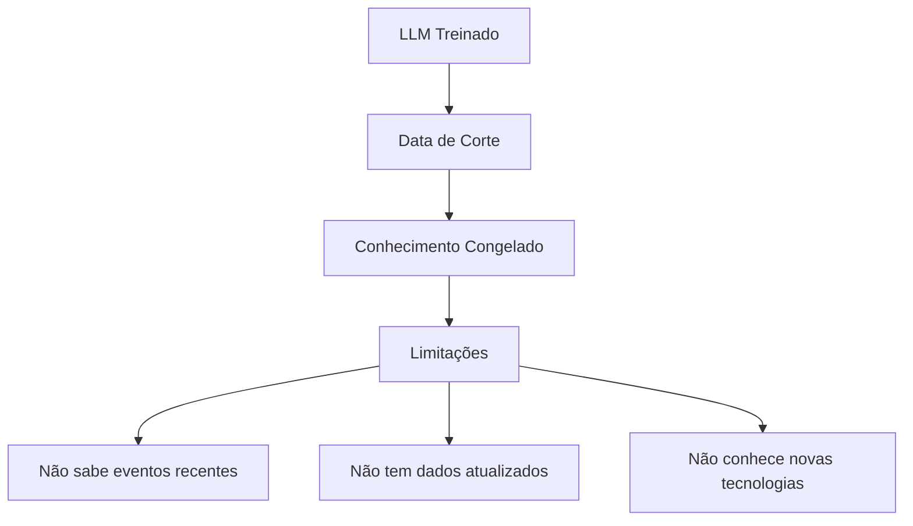
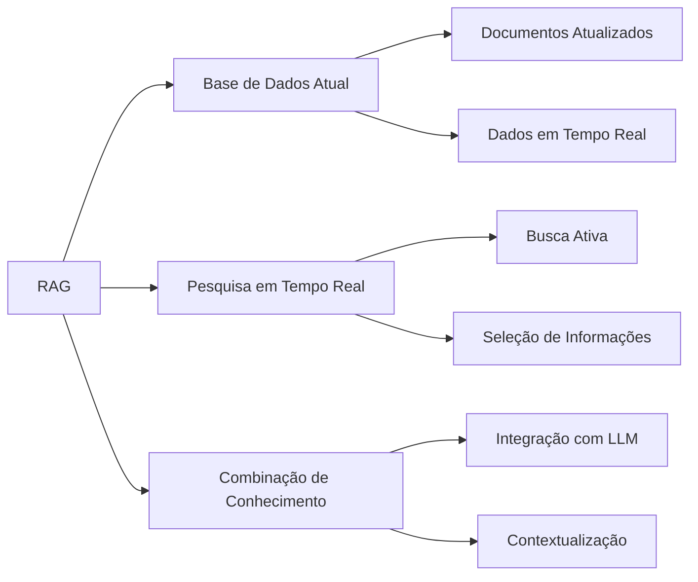
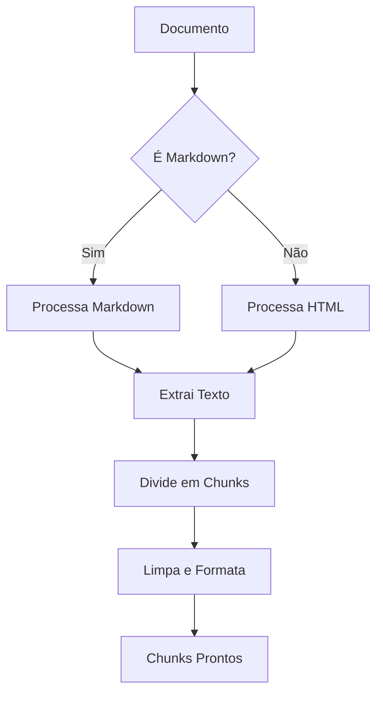
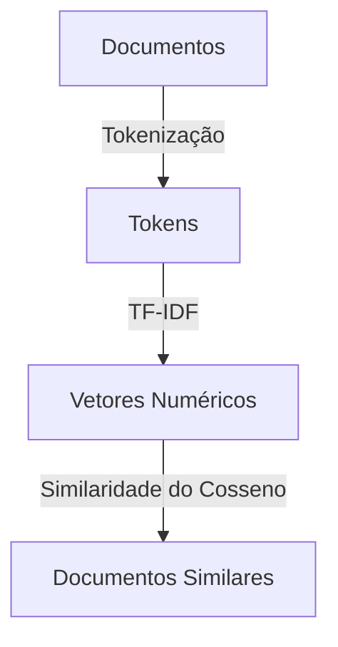
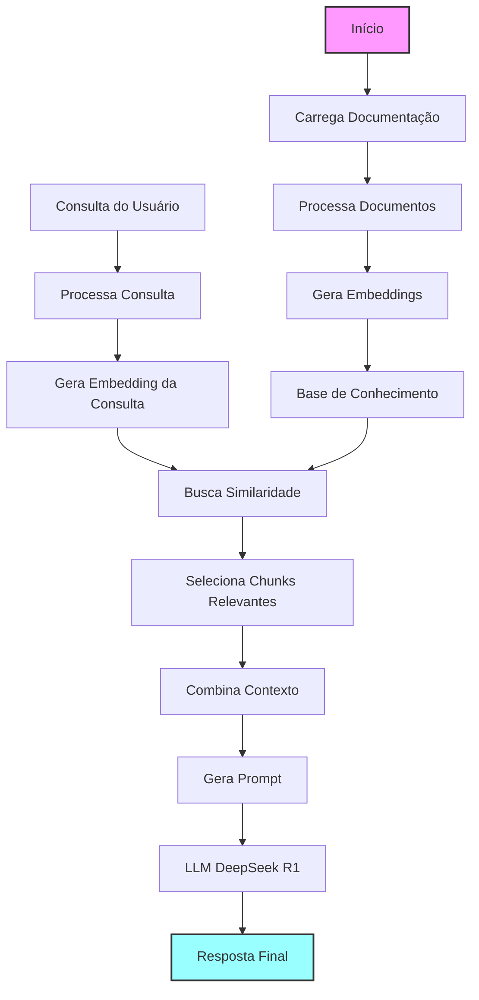
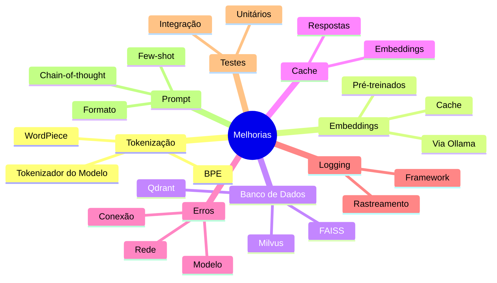

+++
title = "01 - RAG Simples com Clojure e Ollama"
description = "Um protótipo funcional do zero"
date = 2025-03-23T19:00:00-00:00
tags = ["RAG", "LLM", "AI", "Langchain"]
draft = false
weight = 1
author = "Vitor Lobo Ramos"
+++


## Introdução

Olá, pessoal! 👋 

Neste artigo, vamos explorar como construir uma aplicação [RAG (Retrieval-Augmented Generation)](https://pt.wikipedia.org/wiki/Geração_aumentada_por_recuperação) completa do zero usando [Clojure](https://clojure.org/). Vamos mergulhar em uma implementação prática que combina processamento de texto, busca semântica e geração de respostas com LLMs locais. Se você está interessado em melhorar a precisão e relevância das respostas dos seus modelos de linguagem com informações atualizadas, este guia é para você!

## Fundamentos do RAG

### O que é RAG?

Os Modelos de Linguagem de Grande Escala ([LLMs](https://en.wikipedia.org/wiki/Large_language_model)), como o [GPT](https://openai.com/api/), [ChatGPT](https://openai.com/api/) e outros, revolucionaram a forma como interagimos com a inteligência artificial. Eles são capazes de gerar textos coerentes, responder perguntas complexas e até mesmo criar conteúdo criativo. No entanto, esses modelos possuem uma limitação fundamental: seu conhecimento é "congelado" no tempo.



### Por que precisamos do RAG?

Ao desenvolver aplicações inteligentes, como assistentes financeiros que precisam de cotações de ações em tempo real, chatbots de suporte que devem conhecer os produtos mais recentes da empresa ou sistemas de recomendação que se baseiam nas últimas tendências, nos deparamos com uma limitação crucial dos Modelos de Linguagem de Grande Escala ([LLMs](https://en.wikipedia.org/wiki/Large_language_model)) tradicionais: seu conhecimento estático.

O problema fundamental reside no fato de que esses modelos, por mais sofisticados que sejam, possuem uma base de conhecimento "congelada" no momento de seu treinamento. Eles carecem de acesso inerente a informações atualizadas, o que restringe drasticamente sua aplicabilidade em cenários que exigem dados em tempo real ou conhecimento sobre eventos recentes.

> Confiar exclusivamente em um [LLM "puro"](https://en.wikipedia.org/wiki/Large_language_model) nesses contextos resultará em respostas desatualizadas, potencialmente imprecisas e, consequentemente, em uma experiência do usuário comprometida. A eficácia da aplicação é diretamente afetada.

### Os Três Pilares do RAG



1. **Conexão com uma base de dados atual:** Em vez de depender apenas do conhecimento estático adquirido durante seu treinamento (que pode se tornar obsoleto rapidamente), o [LLM](https://en.wikipedia.org/wiki/Large_language_model) ganha acesso a uma fonte de informações dinâmica e constantemente atualizada. Isso pode ser uma base de dados de notícias, um repositório de documentos corporativos, uma coleção de artigos científicos, ou qualquer outra fonte relevante para a tarefa em questão.
2. **Pesquisa em tempo real:** O [LLM](https://en.wikipedia.org/wiki/Large_language_model) não está mais limitado a "lembrar" de informações. Ele adquire a capacidade de "procurar" ativamente por dados relevantes para responder a uma pergunta ou gerar um texto. Isso é semelhante a como nós, humanos, usamos mecanismos de busca para encontrar informações que não temos memorizadas. O [LLM](https://en.wikipedia.org/wiki/Large_language_model), equipado com RAG, pode formular consultas, analisar os resultados e selecionar as informações mais pertinentes.
3. **Combinação de conhecimento base com dados novos:** Este é o ponto crucial que diferencia o [RAG](https://pt.wikipedia.org/wiki/Geração_aumentada_por_recuperação) de uma simples busca em uma base de dados. O [LLM](https://en.wikipedia.org/wiki/Large_language_model) não apenas recupera informações, mas também as integra ao seu conhecimento pré-existente. Ele usa sua capacidade de raciocínio e compreensão para contextualizar os novos dados, identificar contradições, e formular respostas coerentes e informadas.

### RAG em Produção

Sistemas RAG em produção frequentemente incluem etapas adicionais para melhorar a precisão: **re-ranking** (onde um modelo especializado re-avalia a relevância dos documentos recuperados) e **merge-rerank** (que combina resultados de múltiplas estratégias de busca como semântica, lexical e híbrida). Essas técnicas aumentam significativamente a qualidade das respostas, mas adicionam complexidade ao sistema.

> **Nota**: Nossa implementação atual usa apenas busca semântica simples com TF-IDF, focando na compreensão dos fundamentos do RAG. Para aplicações em produção, considere implementar essas técnicas avançadas.

Segundo um [whitepaper recente dos pesquisadores do Google](https://arxiv.org/abs/2309.01066), existem várias técnicas para turbinar o desempenho dos [LLMs](https://en.wikipedia.org/wiki/Large_language_model), e o RAG é uma das mais promissoras. Isso ocorre porque o RAG aborda algumas das limitações fundamentais desses modelos:

O RAG resolve vários problemas de uma vez só: diminui aquelas "viagens" dos [LLMs](https://en.wikipedia.org/wiki/Large_language_model) quando inventam respostas (as famosas alucinações), mantém tudo atualizado em vez de ficar preso no passado, deixa as respostas mais transparentes porque você sabe de onde veio a informação, e ainda melhora o desempenho do modelo quando ele precisa lidar com documentos ou dados específicos da sua empresa. É como dar ao modelo um Google particular que ele pode consultar antes de responder!

> O RAG representa um avanço significativo na evolução dos [LLMs](https://en.wikipedia.org/wiki/Large_language_model), permitindo que eles se tornem ferramentas mais confiáveis, precisas e úteis para uma ampla gama de aplicações. Ele transforma o [LLM](https://en.wikipedia.org/wiki/Large_language_model) de um "sabe-tudo" desatualizado em um pesquisador ágil e bem-informado, capaz de combinar conhecimento profundo com informações atualizadas em tempo real.

### Por que o DeepSeek R1?

Ele trabalha muito bem com documentação técnica, o que é perfeito para nosso sistema [RAG](https://pt.wikipedia.org/wiki/Geração_aumentada_por_recuperação) focado em docs técnicas. O DeepSeek R1 consegue equilibrar qualidade e velocidade melhor que outros modelos do Ollama, rodando na sua máquina sem ficar alucinando com respostas que não fazem sentido.

O modelo também se dá super bem com várias linguagens de programação, incluindo [Clojure](https://clojure.org/), então ele responde numa boa sobre implementações técnicas e documentação de código. E o melhor: mesmo quando você joga informações pela metade ou todas bagunçadas, ele ainda consegue manter o contexto e dar respostas que fazem sentido. Por isso ele é perfeito para o que estamos construindo!

## Implementação Prática

### Preparando o Ambiente

Pre-requisitos:
- [Clojure](https://clojure.org/guides/getting_started): Linguagem de programação funcional que vamos usar para construir a aplicação
- [Leiningen](https://leiningen.org/): Ferramenta de build para Clojure
- [Ollama](https://ollama.com/): Modelo de linguagem local

### Estrutura do Projeto

Nossa aplicação terá três componentes principais:
1. **Processamento de documentação (Markdown/HTML)**
   - Extração de texto
   - Pré-processamento de texto
2. **Sistema de embeddings**
   - Criação de embeddings para o texto usando [TF-IDF](https://pt.wikipedia.org/wiki/TF-IDF)
   - Busca por similaridade semântica
3. **Interface com o LLM**
   - Geração de resposta usando o LLM

> **Observação:** Embora o RAG moderno utilize embeddings densos gerados por modelos de linguagem para capturar a semântica de forma mais rica, neste artigo, usaremos uma implementação simplificada de [TF-IDF (Term Frequency-Inverse Document Frequency)](https://pt.wikipedia.org/wiki/TF-IDF) como **prova de conceito**. Para aplicações em produção, recomendamos fortemente o uso de embeddings densos.


### TF-IDF

O [TF-IDF](https://pt.wikipedia.org/wiki/TF-IDF) (Term Frequency-Inverse Document Frequency) é uma técnica estatística usada para avaliar a importância de uma palavra em um documento, em relação a uma coleção de documentos. Vamos entender como funciona:

1. **Term Frequency (TF)**: Mede a frequência de uma palavra em um documento.
   ```
   TF(termo) = (Número de vezes que o termo aparece no documento) / (Total de termos no documento)
   ```

2. **Inverse Document Frequency (IDF)**: Mede a raridade de um termo na coleção de documentos.
   ```
   IDF(termo) = log(Número total de documentos / Número de documentos contendo o termo)
   ```

3. **TF-IDF**: É o produto desses dois valores.
   ```
   TF-IDF(termo) = TF(termo) × IDF(termo)
   ```

Vamos imaginar um cenário prático com três documentos técnicos: 

- Doc1: "Clojure é uma linguagem funcional baseada em [Lisp](https://en.wikipedia.org/wiki/Lisp_(programming_language))"
- Doc2: "Python é uma linguagem de programação versátil"
- Doc3: "Clojure e Python são linguagens de programação populares"

O TF-IDF é uma técnica que nos ajuda a identificar quais palavras são mais importantes em cada documento, comparando a frequência de um termo no documento (TF) com a raridade desse termo em toda a coleção (IDF). Por exemplo, se "Clojure" aparece uma vez em um documento de oito palavras, seu TF é 0,125; como está presente em dois de três documentos, seu IDF é log(3/2) ≈ 0,176, resultando em um TF-IDF de aproximadamente 0,022. Já termos muito comuns, como "linguagem", acabam com TF-IDF zero, pois não ajudam a diferenciar os documentos.

Esse método é fundamental em sistemas de busca, pois destaca os termos que realmente caracterizam cada texto. No contexto do RAG, o TF-IDF permite indexar e encontrar rapidamente os documentos mais relevantes para uma consulta, servindo como uma base simples e eficiente para recuperação de informações, que pode ser aprimorada com técnicas mais avançadas como embeddings densos.

### Requisitos Mínimos

Este experimento funciona com hardware básico: **4 cores de CPU e 8GB de RAM** são suficientes. Para máquinas mais lentas, use `ollama pull deepseek-r1:3b` (versão otimizada). 

> Para requisitos detalhados de produção e otimizações avançadas, consulte o [apêndice de hardware](#requisitos-de-hardware-detalhados) ao final do artigo.

### Configuração do Projeto

1. Crie um novo projeto Clojure:
```bash
lein new app docai
cd docai
```

2. Configure o `project.clj`:
```clojure
(defproject docai "0.1.0-SNAPSHOT"
  :description "Um assistente RAG para consulta de documentação técnica"
  :url "http://example.com/FIXME"
  :license {:name "EPL-2.0 OR GPL-2.0-or-later WITH Classpath-exception-2.0"
            :url "https://www.eclipse.org/legal/epl-2.0/"}
  :dependencies [[org.clojure/clojure "1.11.1"]
                 [markdown-to-hiccup "0.6.2"]
                 [hickory "0.7.1"]
                 [org.clojure/data.json "2.4.0"]
                 [http-kit "2.6.0"]
                 [org.clojure/tools.logging "1.2.4"]
                 [org.clojure/tools.namespace "1.4.4"]
                 [org.clojure/core.async "1.6.681"]
                 [org.clojure/core.memoize "1.0.257"]
                 [org.clojure/core.cache "1.0.225"]]
  :main ^:skip-aot docai.core
  :target-path "target/%s"
  :profiles {:uberjar {:aot :all
                       :jvm-opts ["-Dclojure.compiler.direct-linking=true"]}})
```

A estrutura do projeto acima define um aplicativo Clojure para RAG (Retrieval-Augmented Generation) com várias dependências essenciais. Entre elas, `markdown-to-hiccup` e `hickory` são usadas para processar documentos em Markdown e HTML, enquanto `data.json` e `http-kit` facilitam a comunicação com APIs externas, como a do Ollama. Além disso, `tools.logging` é responsável pelo registro de eventos e logs, e `tools.namespace` auxilia no gerenciamento de namespaces do projeto.

Já `core.async` permite operações assíncronas, o que é especialmente útil ao lidar com o processamento de documentos grandes. Por fim, `core.memoize` e `core.cache` são utilizados para implementar cache de resultados, como embeddings ou respostas do LLM, melhorando significativamente a performance ao evitar recálculos desnecessários, principalmente em consultas repetidas ou similares.

### Implementação dos Componentes

Agora vamos implementar os três componentes principais do nosso sistema RAG e vamos começar com o processamento de documentos. Pois, ele é o ponto de entrada para o RAG onde vamos processar os documentos e extrair o texto para ser usado nos outros componentes.

#### Processamento de Documentos

```clojure
;; src/docai/document.clj
(ns docai.document
  (:require [markdown-to-hiccup.core :as md]
            [hickory.core :as html]
            [clojure.string :as str]))

(defn extract-text-from-markdown [content]
  (try
    (let [hiccup-result (md/md->hiccup content)
          text-nodes (filter string? (flatten hiccup-result))]
      text-nodes)
    (catch Exception e
      (println "Erro ao processar Markdown:" (.getMessage e))
      [content])))

(defn extract-text-from-html [content]
  (try
    (let [dom (html/parse content)
          hiccup-result (html/as-hiccup dom)
          text-nodes (filter string? (flatten hiccup-result))]
      text-nodes)
    (catch Exception e
      (println "Erro ao processar HTML:" (.getMessage e))
      [content])))

;; Declare functions that will be defined later
(declare create-token-aware-chunks)

(defn extract-text
  "Extrai texto de documentação (Markdown ou HTML)"
  [doc-path]
  (println "Extraindo texto de:" doc-path)
  (let [content (slurp doc-path)
        _ (println "Tamanho do conteúdo:" (count content) "caracteres")
        _ (println "Amostra do conteúdo:" (subs content 0 (min 100 (count content))))
        text (if (.endsWith doc-path ".md")
               (extract-text-from-markdown content)
               (extract-text-from-html content))
        _ (println "Quantidade de nós de texto extraídos:" (count text))
        ;; Usar tokens reais em vez de caracteres para chunking preciso
        chunks (create-token-aware-chunks text 512)]
    (println "Quantidade de chunks gerados:" (count chunks))
    chunks))

(defn count-tokens
  "Conta tokens usando heurística (para desenvolvimento)"
  [text]
  ;; ⚠️ ATENÇÃO: Esta é uma heurística aproximada
  ;; Para produção, use [clojure-tiktoken](https://github.com/justone/clojure-tiktoken)
  ;; ou API do Ollama para contagem precisa
  (try
    (let [words (str/split text #"\s+")
          ;; Estimativa melhorada para português brasileiro
          ;; Ainda pode errar 2x em textos muito curtos/longos
          estimated-tokens (reduce + 
                                 (map (fn [word]
                                        (cond
                                          ;; Palavras muito longas (composição)
                                          (> (count word) 15) (* (count word) 0.8)
                                          ;; Palavras longas (derivação)
                                          (> (count word) 10) (* (count word) 0.6)
                                          ;; Palavras médias
                                          (> (count word) 5) (* (count word) 0.4)
                                          ;; Palavras curtas
                                          :else 1.0))
                                      words))]
      (int estimated-tokens))
    (catch Exception e
      (println "Erro ao contar tokens:" (.getMessage e))
      ;; Fallback conservador: 1 token por caractere
      (count text))))

(defn create-token-aware-chunks
  "Cria chunks baseados em tokens reais, não caracteres"
  [text-nodes max-tokens]
  (loop [nodes text-nodes
         current-chunk []
         current-tokens 0
         all-chunks []]
    (if (empty? nodes)
      (if (seq current-chunk)
        (conj all-chunks (str/join " " current-chunk))
        all-chunks)
      (let [node (first nodes)
            node-tokens (count-tokens node)
            new-total (+ current-tokens node-tokens)]
        (if (and (> new-total max-tokens) (seq current-chunk))
          ;; Chunk cheio, salva e inicia novo
          (recur (rest nodes)
                 [node]
                 node-tokens
                 (conj all-chunks (str/join " " current-chunk)))
          ;; Adiciona ao chunk atual
          (recur (rest nodes)
                 (conj current-chunk node)
                 new-total
                 all-chunks))))))

(defn preprocess-chunks
  "Limpa e prepara os chunks de texto"
  [chunks]
  (let [processed (map #(-> %
                            (str/replace #"\s+" " ")
                            (str/trim))
                       chunks)]
    (println "Primeiro chunk processado:" (first processed))
    processed))
```

Este trecho de código implementa a parte de processamento de documentos do nosso sistema RAG. Basicamente, ele pega arquivos Markdown ou HTML e extrai o texto puro deles para que possamos usar depois na busca semântica. O código usa bibliotecas como `markdown-to-hiccup` e `hickory` para converter os documentos em estruturas de dados que facilitam a extração do texto.



O fluxo é bem direto: primeiro verificamos se estamos lidando com Markdown ou HTML, depois extraímos o texto usando a função apropriada, dividimos em pedaços menores (chunks) baseados em tokens reais (não caracteres), e finalmente limpamos esses chunks removendo espaços extras e formatando tudo direitinho. 

O código também inclui bastante logging para ajudar a depurar o processo, mostrando informações como o tamanho do documento, quantidade de texto extraído e número de chunks gerados. 

Essa abordagem de dividir o texto em pedaços menores é crucial para o RAG, já que permite processar documentos grandes sem sobrecarregar o modelo de linguagem.

> **Importante**: Dividimos o texto em chunks usando tokens (não caracteres) para não ultrapassar o limite do modelo. A contagem de tokens é aproximada. Para produção, use uma biblioteca como [clojure-tiktoken](https://github.com/justone/clojure-tiktoken) para maior precisão.

#### Sistema de Embeddings

Agora vamos implementar o sistema de embeddings. Ele é responsável por criar embeddings para o texto para que possamos usar na busca semântica.

```clojure
;; src/docai/embedding.clj
(ns docai.embedding
  (:require [clojure.string :as str]
            [clojure.core.memoize :as memo]))

;; Implementação de embeddings usando TF-IDF simples
;; Não depende de modelos externos, ao contrário do Ollama que usa o deepseek-r1 para o LLM

(defn tokenize
  "Divide o texto em tokens"
  [text]
  (if (string? text)
    (-> text
        str/lower-case
        (str/split #"\s+")
        (->> (filter #(> (count %) 2))))
    []))

(defn term-freq
  "Calcula a frequência dos termos"
  [tokens]
  (frequencies tokens))


(defn doc-freq
  "Calcula a frequência dos documentos"
  [docs]
  (let [string-docs (filter string? docs)  ; Use Clojure's built-in string? function
        _ (println (str "Processando " (count string-docs) " documentos válidos de " (count docs) " total"))
        doc-tokens (map tokenize string-docs)  
        all-tokens (distinct (flatten doc-tokens))
        doc-count (count string-docs)]
    (if (zero? doc-count)
      {}
      (zipmap all-tokens
              (map #(count (filter (fn [tokens] (some #{%} tokens)) doc-tokens))
                   all-tokens)))))

(defn tf-idf
  "Calcula TF-IDF para um documento"
  [doc doc-freq doc-count]
  (if (empty? doc-freq)
    {}
    (let [tokens (tokenize doc)
          tf (term-freq tokens)]
      (zipmap (keys tf)
              (map #(* (get tf %) (Math/log (/ doc-count (get doc-freq % 1))))
                   (keys tf))))))

(defn vectorize
  "Converte um documento em um vetor TF-IDF"
  [doc doc-freq doc-count vocab]
  (let [tf-idf-scores (tf-idf doc doc-freq doc-count)]
    (if (empty? vocab)
      []
      (map #(get tf-idf-scores % 0.0) vocab))))

(defn create-embeddings
  "Gera embeddings para uma lista de textos usando TF-IDF"
  [texts]
  (try
    (let [doc-freq (doc-freq texts)
          doc-count (count (filter string? texts))
          ;; Vocabulário ordenado para garantir ordem estável
          vocab (sort (keys doc-freq))]
      (map #(vectorize % doc-freq doc-count vocab) texts))
    (catch Exception e
      (println "Erro ao criar embeddings: " (.getMessage e))
      (vec (repeat (count texts) [])))))

(defn cosine-similarity
  "Calcula a similaridade do cosseno entre dois vetores"
  [v1 v2]
  (if (or (empty? v1) (empty? v2))
    0.0
    (let [dot-product (reduce + (map * v1 v2))
          norm1 (Math/sqrt (reduce + (map #(* % %) v1)))
          norm2 (Math/sqrt (reduce + (map #(* % %) v2)))]
      (if (or (zero? norm1) (zero? norm2))
        0.0
        (/ dot-product (* norm1 norm2))))))

(defn similarity-search
  "Encontra os N chunks mais similares"
  [query-embedding doc-embeddings n]
  (if (or (empty? query-embedding) (empty? doc-embeddings))
    (take (min n (count doc-embeddings)) (range))
    (let [scores (map #(cosine-similarity query-embedding %) doc-embeddings)]
      (->> (map vector scores (range))
           (sort-by first >)
           (take n)
           (map second)))))
```

O código acima implementa um sistema simples de embeddings usando TF-IDF (Term Frequency-Inverse Document Frequency) para transformar textos em vetores numéricos. 

Basicamente, ele pega documentos de texto, quebra em palavras (tokens), calcula a importância de cada palavra considerando tanto sua frequência no documento quanto sua raridade na coleção inteira, e cria vetores que representam cada documento. É como transformar textos em coordenadas matemáticas para que o computador possa entender a "semelhança" entre eles.



A parte mais legal é a função `similarity_search`, que usa a similaridade do cosseno para encontrar documentos parecidos com uma consulta. Imagine que cada documento é um ponto num espaço multidimensional – quanto menor o ângulo entre dois pontos, mais similares eles são.

O código não usa nenhum modelo de IA sofisticado para isso, apenas matemática básica, o que o torna leve e rápido, embora menos poderoso que embeddings modernos baseados em redes neurais. É como um GPS simples que te leva ao destino sem todos os recursos de um Google Maps.

O TF-IDF transforma textos em vetores numéricos ao combinar a frequência de cada palavra em um documento (TF) com o quanto essa palavra é rara em toda a coleção (IDF): palavras comuns como "linguagem" têm peso baixo, enquanto termos mais exclusivos como "Clojure" ganham peso alto, permitindo que o computador compare documentos de forma eficiente e encontre os mais relevantes para cada consulta.

Outra abordagem, é por meio da similaridade do cosseno, que compara dois vetores TF-IDF calculando o ângulo entre eles: quanto menor o ângulo, mais parecidos são os textos, usando a fórmula cos(θ) = (A·B) / (||A|| ||B||), onde A·B é o produto escalar e ||A|| e ||B|| são os tamanhos dos vetores; porém, o TF-IDF tem limitações, pois não entende sinônimos, contexto ou ordem das palavras, tratando termos como "carro" e "automóvel" como diferentes e podendo gerar vetores grandes.

> **Importante**: Esta implementação TF-IDF é uma **prova de conceito** para demonstrar os fundamentos do RAG. Em aplicações reais, embeddings densos modernos como [SBERT](https://www.sbert.net/), [E5](https://huggingface.co/intfloat/e5-large), [BGE](https://huggingface.co/BAAI/bge-large-en) ou modelos via Ollama superam significativamente o TF-IDF em tarefas de busca semântica e question-answering.

#### Interface com Ollama

Agora vamos implementar a interface com o Ollama. Ele é responsável por gerar a resposta para a query do usuário (essa parte aqui é super divertida, pois é onde vamos usar o LLM).

```clojure
;; src/docai/llm.clj
(ns docai.llm
  (:require [clojure.data.json :as json]
            [org.httpkit.client :as http]))

(def ollama-url "http://localhost:11434/api/generate")
(def model-name "deepseek-r1") ; Modelo DeepSeek para melhor qualidade

(defn call-ollama-api
  "Chama a API do Ollama para gerar uma resposta"
  [prompt]
  (let [request-body {:model model-name
                      :prompt prompt
                      :stream false}
        options {:headers {"Content-Type" "application/json"}
                 :body (json/write-str request-body)}
        response @(http/post ollama-url options)]
    (if (= (:status response) 200)
      (-> response
          :body
          (json/read-str :key-fn keyword)
          ;; Compatível com versões antigas (:response) e novas (:message) do Ollama
          (#(or (:response %) (:message %))))
      (str "Erro ao chamar a API do Ollama: " (:status response) " - " (:body response)))))

;; Funções de utilidade para uso futuro:
;;
;; extract-code-blocks: Extrai blocos de código do texto usando regex
;; exemplo de uso:
;;   (extract-code-blocks "```clojure\n(+ 1 2)\n```") => ["(+ 1 2)"]
;;
;; extract-summary: Cria um resumo de texto com tamanho máximo especificado
;; exemplo de uso:
;;   (extract-summary "# Título\nConteúdo longo..." 50) => "Conteúdo longo..."

(defn format-prompt
  "Formata o prompt para o LLM com delimitação segura do contexto"
  [context query]
  (str "Você é um assistente especializado em documentação técnica. "
       "Use APENAS as informações do contexto fornecido para responder.\n\n"
       "DOCUMENTO:\n"
       "```\n"
       context
       "\n```\n\n"
       "Pergunta: " query
       "\n\n"
       "Instruções:\n"
       "- Responda baseado APENAS no contexto fornecido\n"
       "- Se a informação não estiver no contexto, indique claramente\n"
       "- Forneça exemplos de código quando relevante\n"
       "- Se o contexto for limitado, mencione essa limitação\n"
       "- NÃO invente informações que não estão no contexto"))

(defn generate-response
  "Gera resposta usando o LLM com base no contexto"
  [query context]
  (try
    (let [prompt (format-prompt context query)]
      (println "DEBUG - Enviando prompt para o Ollama usando o modelo" model-name)
      (call-ollama-api prompt))
    (catch Exception e
      (str "Erro ao gerar resposta: " (.getMessage e) 
           "\n\nPor favor, verifique se o Ollama está em execução no endereço " 
           ollama-url 
           "\n\nVocê pode iniciar o Ollama com o comando: ollama serve"))))

;; Exemplo de prompt seguro gerado:
;; Você é um assistente especializado em documentação técnica. 
;; Use APENAS as informações do contexto fornecido para responder.
;;
;; DOCUMENTO:
;; ```
;; [contexto aqui]
;; ```
;;
;; Pergunta: [pergunta do usuário]
;;
;; Instruções:
;; - Responda baseado APENAS no contexto fornecido
;; - Se a informação não estiver no contexto, indique claramente
;; - Forneça exemplos de código quando relevante
;; - Se o contexto for limitado, mencione essa limitação
;; - NÃO invente informações que não estão no contexto
```

A parte mais importante aqui é a função `call-ollama-api`, que faz uma requisição HTTP para o servidor Ollama rodando na máquina local. Ela envia um prompt de texto e recebe de volta a resposta gerada pelo modelo DeepSeek R1. O código também inclui uma função `format-prompt` super importante, que estrutura a mensagem enviada ao modelo. 

Ela combina o contexto (os trechos de documentação relevantes que encontramos) com a pergunta do usuário, e adiciona instruções específicas para o modelo se comportar como um assistente técnico. Essa "engenharia de prompt" é crucial para obter respostas de qualidade - estamos essencialmente ensinando o modelo a responder no formato que queremos.

A função `generate-response` amarra tudo isso, pegando a pergunta e o contexto, formatando o prompt, enviando para o Ollama e tratando possíveis erros. Tem até uma mensagem amigável caso o Ollama não esteja rodando, sugerindo como iniciar o serviço. É um exemplo clássico de como interfaces com LLMs funcionam: você prepara um prompt bem estruturado, envia para o modelo, e recebe de volta texto gerado que (esperamos!) responda à pergunta original com base no contexto fornecido.


#### Módulo Principal

Agora vamos implementar o módulo principal que vai ser o ponto de entrada para o RAG. Ele vai ser responsável por carregar os documentos, processar os chunks, criar os embeddings e gerar a resposta para a query do usuário. 

```clojure
;; src/docai/core.clj
(ns docai.core
  (:require [docai.document :as doc]
            [docai.embedding :as emb]
            [docai.llm :as llm]
            [clojure.java.io :as io]
            [clojure.string :as str])
  (:gen-class))

(def docs-path "resources/docs")

(defn load-documentation
  "Carrega todos os arquivos de documentação do diretório"
  []
  (->> (file-seq (io/file docs-path))
       (filter #(.isFile %))
       (map #(.getPath %))))

(defn setup-knowledge-base
  "Configura a base de conhecimento inicial"
  []
  (let [doc-files (load-documentation)
        _ (when (empty? doc-files)
            (println "Aviso: Nenhum arquivo de documentação encontrado em resources/docs/"))
        _ (doseq [file doc-files]
            (println "Arquivo encontrado:" file))
        all-chunks (mapcat doc/extract-text doc-files)
        processed-chunks (doc/preprocess-chunks all-chunks)
        _ (println (str "Processando " (count processed-chunks) " chunks de texto..."))
        _ (when (< (count processed-chunks) 5)
            (println "DEBUG - Primeiros chunks:")
            (doseq [chunk (take 5 processed-chunks)]
              (println (str "Chunk: '" (subs chunk 0 (min 50 (count chunk))) "...'"))))
        doc-freq (emb/doc-freq processed-chunks)
        doc-count (count (filter string? processed-chunks))
        ;; Vocabulário ordenado para garantir ordem estável entre execuções
        vocab (sort (keys doc-freq))
        embeddings (map #(emb/vectorize % doc-freq doc-count vocab) processed-chunks)]
          {:chunks processed-chunks
       :embeddings embeddings
       :doc-freq doc-freq
       :doc-count doc-count
            :vocab vocab  ; Persistir vocabulário ordenado
     :original-files doc-files}))

;; Função para forçar recálculo (útil para desenvolvimento)
(defn force-recalculate-kb []
  (let [kb-file "resources/knowledge-base.json"]
    (when (.exists (io/file kb-file))
      (.delete (io/file kb-file)))
  (setup-knowledge-base))

(defn get-file-content
  "Lê o conteúdo completo de um arquivo"
  [file-path]
  (try
    (slurp file-path)
    (catch Exception _
      (println "Erro ao ler arquivo:" file-path)
      "")))

(defn get-limited-fallback-content
  "Obtém conteúdo limitado para fallback (evita estourar contexto)"
  [file-path]
  (try
    (let [content (slurp file-path)
          max-chars 8000  ; Limite de ~8KB para evitar estourar contexto
          limited-content (if (> (count content) max-chars)
                           (str (subs content 0 max-chars) 
                                "\n\n[Conteúdo truncado - arquivo muito grande]")
                           content)]
      (str "Informações limitadas da documentação:\n\n" limited-content))
    (catch Exception _
      (println "Erro ao ler arquivo para fallback:" file-path)
      "Não foi possível acessar a documentação.")))

(defn query-rag
  "Processa uma query usando o pipeline RAG"
  [knowledge-base query]
  (cond
    (str/blank? query)
    "Por favor, digite uma pergunta válida."
    
    (and (seq (:chunks knowledge-base)) 
         (seq (:embeddings knowledge-base)))
    (let [query-emb (emb/vectorize query (:doc-freq knowledge-base) (:doc-count knowledge-base) (:vocab knowledge-base))
          similar-idxs (emb/similarity-search query-emb 
                                            (:embeddings knowledge-base)
                                            3)
          _ (println "DEBUG - Índices similares:" similar-idxs)
          
          ;; Obter contexto relevante
          context-chunks (->> similar-idxs
                              (map #(nth (:chunks knowledge-base) %))
                              (str/join "\n\n"))
          
          ;; Se não houver chunks relevantes, use fallback inteligente
          context (if (str/blank? context-chunks)
                    (if (seq (:original-files knowledge-base))
                      (get-limited-fallback-content (first (:original-files knowledge-base)))
                      "Não foi possível encontrar informações relevantes.")
                    context-chunks)]
      
      (println "DEBUG - Tamanho do contexto:" (count context) "caracteres")
      (println "DEBUG - Amostra do contexto:" (subs context 0 (min 200 (count context))) "...")
      
      ;; Gerar resposta usando o LLM
      (llm/generate-response query context))
    
    :else
    "Não foi possível encontrar informações relevantes na base de conhecimento."))

(defn -main
  "Função principal que inicializa a aplicação DocAI"
  [& _]
  (println "Inicializando DocAI...")
  
  ;; Verificar se o Ollama está acessível
  (println "Para usar o Ollama, certifique-se de que ele está em execução com o comando: ollama serve")
  (println "Usando o modelo deepseek-r1. Se você ainda não o baixou, execute: ollama pull deepseek-r1")
  
  (let [kb (setup-knowledge-base)]
    (println "Base de conhecimento pronta! Faça sua pergunta:")
    (try
      (loop []
        (when-let [input (read-line)]
          (cond
            (= input "sair") 
            (println "Obrigado por usar o DocAI. Até a próxima!")
            
            (str/blank? input)
            (do
              (println "Digite uma pergunta ou 'sair' para terminar.")
              (recur))
            
            :else
            (do
              (println "Processando...")
              (println (query-rag kb input))
              (println "\nPróxima pergunta (ou 'sair' para terminar):")
              (recur)))))
      (catch Exception e
        (println "Erro: " (.getMessage e))
        (println "Detalhes: " (ex-data e))))
    (println "Obrigado por usar o DocAI. Até a próxima!")))
```

Basicamente, quando você faz uma pergunta, o sistema primeiro transforma sua pergunta em números (embeddings) e depois procura nos documentos quais partes são mais parecidas com o que você perguntou. 

É como se ele estivesse destacando os trechos mais relevantes de um livro para responder sua dúvida. Você pode ver isso acontecendo quando ele imprime os "índices similares" no console - são as posições dos pedaços de texto que ele achou mais úteis.

Depois de encontrar os trechos relevantes, o sistema junta tudo em um "contexto" - que é basicamente um resumo das informações importantes. Se ele não achar nada parecido com sua pergunta, ele tenta usar o documento inteiro ou avisa que não tem informação suficiente. 

Dá para ver que ele é bem transparente, mostrando no console o tamanho do contexto e até uma amostra do que encontrou, para você entender o que está acontecendo nos bastidores.

Por fim, ele passa sua pergunta original junto com o contexto encontrado para o modelo de linguagem (LLM) gerar uma resposta personalizada. É como dar a um especialista tanto a sua pergunta quanto as páginas relevantes de um manual técnico - assim ele pode dar uma resposta muito mais precisa e fundamentada. 

Todo esse processo acontece em segundos, permitindo que você tenha uma conversa fluida com seus documentos, como se estivesse conversando com alguém que leu tudo e está pronto para responder suas dúvidas específicas. 

---

## Como Usar

Abaixo um guia para você instalar e usar o DocAI (e ver o processo em ação).

### Instalação do Ollama

1. **Instalação**:
   - **Windows**: Baixe o instalador do [site oficial do Ollama](https://ollama.com/download) e execute-o
   - **Linux**: Execute o comando:
     ```bash
     curl https://ollama.ai/install.sh | sh
     ```
   - **macOS**: Use o Homebrew:
     ```bash
     brew install ollama
     ```

2. **Iniciando o Servidor**:
   ```bash
   ollama serve
   ```

3. **Baixando o Modelo**:
   ```bash
   ollama pull deepseek-r1
   ```

4. **Verificando a Instalação**:
   - Execute um teste simples:
     ```bash
     ollama run deepseek-r1 "Olá! Como você está?"
     ```
   - Se tudo estiver funcionando, você receberá uma resposta do modelo

> **Dica**: O Ollama mantém os modelos em cache local. Se você precisar liberar espaço, pode usar `ollama rm deepseek-r1` para remover o modelo.

### Executando a Aplicação

1. Coloque seus documentos na pasta `resources/docs/` (já incluímos dois exemplos: `example.md`)
2. Execute o projeto:

```bash
lein run
```

3. Faça suas perguntas! Exemplo:

```bash
Como implementar autenticação JWT em Clojure?
Como implementar auth saml em python?
Como integrar o auth0 em uma aplicação Clojure?
etc...
``` 	

O DocAI processa sua pergunta em várias etapas:



1. **Processamento da Consulta**: A pergunta é convertida em um vetor TF-IDF
2. **Busca por Similaridade**: O sistema encontra os chunks mais relevantes
3. **Geração de Contexto**: Os chunks são combinados em um contexto coeso
4. **Geração de Resposta**: O LLM gera uma resposta baseada no contexto

Você pode ver o processo em ação nos logs:

```bash
DEBUG - Processando query: Como implementar autenticação JWT em Clojure?
DEBUG - Índices similares: [2, 5, 8]
DEBUG - Tamanho do contexto: 1234 caracteres
DEBUG - Amostra do contexto: "Para implementar autenticação JWT em Clojure..."
```

> **NOTA:** A propósito, o projeto docai está disponível no [https://github.com/scovl/docai](https://github.com/scovl/docai) caso você queira contribuir com o projeto ou usar em outro projeto.

---

## Considerações Técnicas

### Performance e Otimizações

Nossa implementação atual oferece uma base funcional, mas pode ser significativamente otimizada em termos de performance através da adoção de bancos de dados vetoriais como [Milvus](https://milvus.io/) ou [FAISS](https://github.com/facebookresearch/faiss), implementação de cache de embeddings e paralelização do processamento de chunks, permitindo consultas mais rápidas mesmo com grandes volumes de dados.

Para lidar com documentações extensas, recomendo estratégias específicas de gerenciamento de memória, como o processamento de chunks em lotes menores, implementação de indexação incremental que constrói a base de conhecimento gradualmente, e utilização de técnicas de streaming para processar arquivos grandes sem sobrecarregar a memória disponível.

Quanto à escolha de modelos no ecossistema Ollama, cada um apresenta características distintas que podem ser exploradas conforme a necessidade: o [DeepSeek R1](https://ollama.com/models/deepseek-r1) destaca-se na compreensão geral e geração de texto, o [DeepSeek Coder](https://ollama.com/models/deepseek-coder) é especializado em código, o [Llama 3](https://ollama.com/models/llama3) serve como excelente alternativa geral, o [Mistral](https://ollama.com/models/mistral) demonstra eficácia em tarefas específicas, enquanto o [Gemma](https://ollama.com/models/gemma) oferece uma solução leve e eficiente para ambientes com recursos limitados.

Outra questão importante é como estou tratando os erros. O sistema implementa várias camadas de tratamento de erros para lidar com diferentes cenários:

1. **Ollama Offline**
   - **Sintoma**: O sistema não consegue se conectar ao servidor Ollama
   - **Tratamento**: O código verifica a disponibilidade do servidor e fornece mensagens claras de erro:
   ```clojure
   (catch Exception e
     (str "Erro ao gerar resposta: " (.getMessage e) 
          "\n\nPor favor, verifique se o Ollama está em execução no endereço " 
          ollama-url 
          "\n\nVocê pode iniciar o Ollama com o comando: ollama serve"))
   ```

2. **Documentação Muito Grande**
   - **Sintoma**: Arquivos de documentação que excedem a memória disponível
   - **Tratamento**: O sistema implementa:
     - Chunking de documentos (512 tokens por chunk)
     - Processamento em lotes
     - Logs de progresso para monitoramento
   ```clojure
   (let [content (slurp doc-path)
         chunks (partition-all 512 text)]
     (println "Quantidade de chunks gerados:" (count chunks)))
   ```

3. **Consultas sem Relação com a Documentação**
   - **Sintoma**: Nenhum chunk relevante é encontrado para a consulta
   - **Tratamento**: O sistema:
     - Verifica se há chunks disponíveis
     - Usa fallback para conteúdo original se necessário
     - Fornece feedback claro ao usuário
   ```clojure
   (if (str/blank? context-chunks)
     (if (seq (:original-files knowledge-base))
       (get-file-content (first (:original-files knowledge-base)))
       "Não foi possível encontrar informações relevantes.")
     context-chunks)
   ```

4. **Melhorias Futuras** - Implementar [retry com backoff exponencial](https://en.wikipedia.org/wiki/Exponential_backoff) para falhas de conexão, adicionar [cache de embeddings](https://en.wikipedia.org/wiki/Cache_(computing)) para melhor performance, implementar [streaming](https://en.wikipedia.org/wiki/Streaming_media) para arquivos muito grandes, adicionar [validação de formato de documentos](https://en.wikipedia.org/wiki/Document_validation) e implementar [rate limiting](https://en.wikipedia.org/wiki/Rate_limiting) para evitar sobrecarga do Ollama.

---

### Melhorando os Prompts

Para obter melhores respostas do sistema RAG, você pode usar prompts mais estruturados:

```clojure
(defn format-advanced-prompt
  "Prompt otimizado com diretrizes claras"
  [context query]
  (str "Você é um especialista em documentação técnica de software.\n\n"
       "DOCUMENTO:\n```\n" context "\n```\n\n"
       "Pergunta: " query "\n\n"
       "Diretrizes:\n"
       "1. Use APENAS informações do contexto fornecido\n"
       "2. Seja preciso e técnico\n"
       "3. Inclua exemplos de código quando relevante\n"
       "4. Se a informação não estiver no contexto, indique claramente\n"
       "5. Use formatação Markdown para melhor legibilidade"))
```

> Para técnicas avançadas de prompt engineering, consulte o [Guia Completo de Prompt Engineering](https://www.promptingguide.ai/).

## Próximos Passos

Abaixo uma lista de melhorias que podem ser feitas no projeto atual.

### Melhorias Rápidas (Implementação Imediata)

#### **1. Persistência da Base de Conhecimento**
```clojure
;; src/docai/persistence.clj
(ns docai.persistence
  (:require [clojure.data.json :as json]
            [clojure.edn :as edn]))

(defn calculate-checksum
  "Calcula checksum dos arquivos de documentação"
  [doc-files]
  (let [checksums (map #(hash (slurp %)) doc-files)]
    (hash checksums)))

(defn save-knowledge-base
  "Salva a base de conhecimento em disco com checksum"
  [kb filename]
  (let [doc-files (:original-files kb)
        checksum (calculate-checksum doc-files)
        serializable-kb (-> kb
                           (select-keys [:chunks :embeddings :doc-freq :doc-count :vocab])
                           (assoc :checksum checksum :doc-files doc-files))]
    (spit filename (json/write-str serializable-kb))))

(defn load-knowledge-base
  "Carrega a base de conhecimento do disco com verificação de mudanças"
  [filename doc-files]
  (try
    (let [content (slurp filename)
          data (json/read-str content :key-fn keyword)
          cached-checksum (:checksum data)
          current-checksum (calculate-checksum doc-files)]
      (if (= cached-checksum current-checksum)
        (do
          (println "Cache válido - carregando embeddings...")
          (assoc data :original-files doc-files))
        (do
          (println "Arquivos modificados - recalculando embeddings...")
          nil)))
    (catch Exception e
      (println "Erro ao carregar KB:" (.getMessage e))
      nil)))

;; Uso no core.clj
(defn setup-knowledge-base
  "Configura a base de conhecimento (com cache inteligente)"
  []
  (let [kb-file "resources/knowledge-base.json"
        doc-files (load-documentation)]
    (if (.exists (io/file kb-file))
      (if-let [cached-kb (load-knowledge-base kb-file doc-files)]
        cached-kb
        (do
          (println "Recriando KB devido a mudanças nos arquivos...")
          (let [kb (create-knowledge-base)]
            (save-knowledge-base kb kb-file)
            kb)))
      (do
        (println "Criando nova KB...")
        (let [kb (create-knowledge-base)]
          (save-knowledge-base kb kb-file)
          kb)))))
```

#### **2. Testes Unitários**
```clojure
;; test/docai/embedding_test.clj
(ns docai.embedding-test
  (:require [clojure.test :refer :all]
            [docai.embedding :as emb]))

(deftest test-tokenize
  (testing "Tokenização básica"
    (is (= ["hello" "world"] (emb/tokenize "Hello World!")))
    (testing "Filtra palavras curtas"
      (is (= [] (emb/tokenize "a b c")))))

(deftest test-tf-idf
  (testing "Cálculo TF-IDF"
    (let [doc "hello world hello"
          doc-freq {"hello" 2 "world" 1}
          doc-count 2
          result (emb/tf-idf doc doc-freq doc-count)]
      (is (contains? result "hello"))
      (is (contains? result "world")))))

(deftest test-cosine-similarity
  (testing "Similaridade do cosseno"
    (is (= 1.0 (emb/cosine-similarity [1 0] [1 0])))
    (is (= 0.0 (emb/cosine-similarity [1 0] [0 1])))
    (is (= 0.707 (emb/cosine-similarity [1 1] [1 0]) :delta 0.001))))
```

#### **3. Streaming de Respostas**
```clojure
;; src/docai/streaming.clj
(ns docai.streaming
  (:require [clojure.data.json :as json]
            [org.httpkit.client :as http]))

(defn stream-ollama-response
  "Streaming de resposta do Ollama"
  [prompt]
  (let [url "http://localhost:11434/api/generate"
        request-body {:model "deepseek-r1"
                     :prompt prompt
                     :stream true}]
    (with-open [conn @(http/post url {:body (json/write-str request-body)
                                      :as :stream})]
      (doseq [line (line-seq (:body conn))]
        (when-not (str/blank? line)
          (let [data (json/read-str line :key-fn keyword)]
            ;; Compatível com versões antigas (:response) e novas (:message) do Ollama
            (when-let [content (or (:response data) (:message data))]
              (print content)
              (flush))))))))
```

#### **4. Cache de Embeddings**
```clojure
;; src/docai/cache.clj
(ns docai.cache
  (:require [clojure.core.cache :as cache]))

;; Cache LRU com limite de memória (evita vazamentos)
(def embedding-cache (atom (cache/lru-cache-factory {} :threshold 1000))) ; Máximo 1000 embeddings

(defn cached-embedding
  "Embedding com cache LRU"
  [text doc-freq doc-count vocab]
  (if-let [cached (cache/lookup @embedding-cache text)]
    cached
    (let [embedding (emb/vectorize text doc-freq doc-count vocab)]
      (swap! embedding-cache cache/miss text embedding)
      embedding)))

;; Cache para respostas do LLM (também LRU)
(def response-cache (atom (cache/lru-cache-factory {} :threshold 500))) ; Máximo 500 respostas

(defn cached-llm-response
  "Resposta do LLM com cache LRU"
  [prompt]
  (if-let [cached (cache/lookup @response-cache prompt)]
    cached
    (let [response (llm/call-ollama-api prompt)]
      (swap! response-cache cache/miss prompt response)
      response)))

;; Função para limpar cache manualmente se necessário
(defn clear-caches []
  (reset! embedding-cache (cache/lru-cache-factory {} :threshold 1000))
  (reset! response-cache (cache/lru-cache-factory {} :threshold 500))
  (println "Caches limpos!"))

;; Monitoramento de cache
(defn cache-stats []
  (let [embedding-size (count @embedding-cache)
        response-size (count @response-cache)]
    (println (str "Embedding cache: " embedding-size "/1000"))
    (println (str "Response cache: " response-size "/500"))))
```

**Vantagens do Cache LRU:**
- **🔄 Auto-limpeza**: Remove itens menos usados automaticamente
- **💾 Controle de memória**: Limite máximo de itens
- **⚡ Performance**: Acesso rápido a dados frequentes
- **🛡️ Estabilidade**: Evita vazamentos de memória

**Cache Inteligente de Embeddings:**
- **📁 Persistência**: Embeddings salvos em disco
- **🔍 Verificação de Mudanças**: Checksum dos arquivos
- **⚡ Recarregamento Rápido**: Só recalcula se necessário
- **🔄 Invalidação Automática**: Detecta modificações nos arquivos

#### **5. Banco Vetorial Simples (BM25 Manual)**
```clojure
;; src/docai/vector_store.clj
(ns docai.vector-store
  (:require [clojure.string :as str]))

(defn create-simple-vector-store
  "Store vetorial simples com BM25 (implementação manual)"
  [documents]
  (let [index (atom {})
        doc-freq (emb/doc-freq documents)
        vocab (sort (keys doc-freq))]  ; Vocabulário ordenado
    (doseq [[idx doc] (map-indexed vector documents)]
      (let [tokens (emb/tokenize doc)
            tf (emb/term-freq tokens)]
        (swap! index assoc idx {:doc doc :tf tf})))
    {:index index :doc-freq doc-freq :vocab vocab}))

(defn calculate-bm25
  "Calcula score BM25 para um documento"
  [query-tokens doc-tf doc-freq]
  (let [k1 1.2  ; Parâmetro de saturação de termo
        b 0.75   ; Parâmetro de normalização de comprimento
        avg-doc-len 100  ; Comprimento médio do documento (aproximação)
        doc-len (reduce + (vals doc-tf))
        
        ;; IDF para cada termo da query
        idf-scores (map (fn [term]
                          (let [df (get doc-freq term 0)
                                n (count doc-freq)]
                            (if (zero? df)
                              0
                              (Math/log (/ (- n df 0.5) (+ df 0.5)))))
                        query-tokens)
        
        ;; TF para cada termo da query no documento
        tf-scores (map (fn [term]
                         (let [tf (get doc-tf term 0)]
                           (/ (* tf (+ k1 1))
                              (+ tf (* k1 (- 1 b (* b (/ doc-len avg-doc-len)))))))
                       query-tokens)]
    
    ;; Soma ponderada de IDF * TF
    (reduce + (map * idf-scores tf-scores))))

(defn search-bm25
  "Busca híbrida: BM25 + similaridade semântica"
  [query vector-store top-k]
  (let [query-tokens (emb/tokenize query)
        query-embedding (emb/vectorize query (:doc-freq vector-store) (:doc-count vector-store) (:vocab vector-store))
        
        ;; BM25 scores
        bm25-scores (map-indexed 
                      (fn [idx {:keys [tf]}]
                        [idx (calculate-bm25 query-tokens tf (:doc-freq vector-store))])
                      (vals @(:index vector-store)))
        
        ;; Semantic scores
        semantic-scores (map-indexed
                          (fn [idx _]
                            [idx (emb/cosine-similarity query-embedding 
                                                       (emb/vectorize (get-in @(:index vector-store) [idx :doc])
                                                                      (:doc-freq vector-store)
                                                                      (:doc-count vector-store)
                                                                      (:vocab vector-store)))])
                          (vals @(:index vector-store)))
        
        ;; Combine scores (weighted average)
        combined-scores (map (fn [[idx bm25] [idx2 semantic]]
                              [idx (+ (* 0.3 bm25) (* 0.7 semantic))])
                            bm25-scores semantic-scores)]
    
    (->> combined-scores
         (sort-by second >)
         (take top-k)
         (map first))))
```

**Sobre o Algoritmo BM25:**
- **k1 = 1.2**: Controla saturação de frequência de termos
- **b = 0.75**: Normaliza pelo comprimento do documento
- **IDF**: Mede raridade dos termos na coleção
- **TF**: Frequência dos termos no documento
- **Combinação**: 30% BM25 + 70% similaridade semântica

**Nota**: Esta é uma implementação manual do BM25. Para produção, considere usar Apache Lucene (veja dependências acima) que oferece BM25 nativo e otimizado.

### Melhorias Avançadas



### Dependências e Próximos Passos

#### **Dependências Recomendadas**

Para implementar as funcionalidades avançadas mencionadas no artigo, adicione estas dependências ao `project.clj`:

```clojure
;; Dependências para produção
[com.github.justone/clojure-tiktoken "0.1.0"]  ; Contagem precisa de tokens
[org.apache.lucene/lucene-core "9.10.0"]       ; Busca textual avançada
[org.apache.lucene/lucene-analyzers-common "9.10.0"]  ; Analisadores de texto
[org.apache.lucene/lucene-queryparser "9.10.0"] ; Parser de queries
[com.github.clojure-lsp/clojure-lsp "2024.01.15-20.32.45"]  ; LSP para IDE
```

#### **Implementação com Lucene**

```clojure
;; src/docai/lucene_store.clj
(ns docai.lucene-store
  (:import [org.apache.lucene.analysis.standard StandardAnalyzer]
           [org.apache.lucene.document Document Field Field$Store]
           [org.apache.lucene.index IndexWriter IndexWriterConfig DirectoryReader]
           [org.apache.lucene.search IndexSearcher QueryParser]
           [org.apache.lucene.store RAMDirectory]))

(defn create-lucene-index
  "Cria índice Lucene para busca textual"
  [documents]
  (let [analyzer (StandardAnalyzer.)
        directory (RAMDirectory.)
        config (IndexWriterConfig. analyzer)
        writer (IndexWriter. directory config)]
    
    ;; Adiciona documentos ao índice
    (doseq [[idx doc] (map-indexed vector documents)]
      (let [document (Document.)]
        (.add document (Field. "content" doc Field$Store/YES))
        (.add document (Field. "id" (str idx) Field$Store/YES))
        (.addDocument writer document)))
    
    (.close writer)
    
    {:directory directory
     :analyzer analyzer
     :reader (DirectoryReader/open directory)
     :searcher (IndexSearcher. (DirectoryReader/open directory))}))

(defn search-lucene
  "Busca textual usando Lucene"
  [index query top-k]
  (let [parser (QueryParser. "content" (:analyzer index))
        query-obj (.parse parser query)
        hits (.search (:searcher index) query-obj top-k)]
    (map #(.doc (:searcher index) %) (.scoreDocs hits))))
```

### Upgrade para Embeddings Densos

Para evoluir de TF-IDF para embeddings densos modernos, considere estas opções:

#### 1. **Via Ollama Embeddings API**
```clojure
;; Exemplo de upgrade usando Ollama embeddings
(defn create-dense-embeddings [texts]
  (let [embeddings-url "http://localhost:11434/api/embeddings"]
    (map #(call-ollama-embeddings embeddings-url %) texts)))

(defn call-ollama-embeddings [url text]
  (let [request-body {:model "deepseek-r1" :prompt text}
        response @(http/post url {:body (json/write-str request-body)})]
    (if (= (:status response) 200)
      (-> response :body (json/read-str :key-fn keyword) :embedding)
      (throw (ex-info "Erro ao gerar embedding" {:status (:status response)})))))

;; Token counting preciso via Ollama API
(defn count-tokens-ollama [text]
  (let [url "http://localhost:11434/api/generate"
        request-body {:model "deepseek-r1" 
                     :prompt text 
                     :stream false
                     :options {:num_predict 0}}]
    (try
      (let [response @(http/post url {:body (json/write-str request-body)})]
        (if (= (:status response) 200)
          (-> response :body (json/read-str :key-fn keyword) :eval_count)
          0))
      (catch Exception _ 0))))

;; Implementação com clojure-tiktoken (recomendado para produção)
(defn count-tokens-precise [text]
  (try
    ;; Requer: [com.github.justone/clojure-tiktoken "0.1.0"]
    ;; (require '[com.github.justone.clojure-tiktoken :as tiktoken])
    ;; (tiktoken/count-tokens text "cl100k_base")
    (count-tokens text) ; Fallback para implementação atual
    (catch Exception e
      (println "Erro ao usar tiktoken:" (.getMessage e))
      (count-tokens text))))

;; Exemplo de implementação com API do Ollama (mais preciso)
(defn count-tokens-ollama-precise [text]
  (let [url "http://localhost:11434/api/generate"
        request-body {:model "deepseek-r1" 
                     :prompt text 
                     :stream false
                     :options {:num_predict 0}}]
    (try
      (let [response @(http/post url {:body (json/write-str request-body)})]
        (if (= (:status response) 200)
          (-> response :body (json/read-str :key-fn keyword) :eval_count)
          (count-tokens text))) ; Fallback para heurística
      (catch Exception _
        (count-tokens text))))) ; Fallback para heurística
```

#### 2. **Via HuggingFace Transformers**
```clojure
;; Exemplo usando interop com Python/HuggingFace
(defn create-hf-embeddings [texts]
  (let [model-name "sentence-transformers/all-MiniLM-L6-v2"]
    ;; Usar interop com Python para carregar modelo
    ;; e gerar embeddings densos
    ))

;; Token counting preciso com tiktoken
(defn count-tokens-tiktoken [text]
  ;; Requer interop com Python tiktoken
  ;; pip install tiktoken
  ;; python -c "import tiktoken; print(len(tiktoken.get_encoding('cl100k_base').encode('texto aqui')))"
  )
```

#### 3. **Comparação de Performance**

| Método | Semântica | Contexto | Performance | Complexidade | Hardware Mínimo | Precisão Tokens |
|--------|-----------|----------|-------------|--------------|-----------------|-----------------|
| TF-IDF | ❌ | ❌ | ⚡⚡⚡ | ⚡ | CPU 4 cores, 8GB RAM | ⚠️ Heurística |
| Ollama Embeddings | ✅ | ✅ | ⚡⚡ | ⚡⚡ | CPU 8 cores, 16GB RAM | ✅ Preciso |
| SBERT/E5 | ✅✅ | ✅✅ | ⚡ | ⚡⚡⚡ | GPU 8GB VRAM, 32GB RAM | ✅ Preciso |

> **Recomendação**: Para aplicações em produção, comece com Ollama embeddings (simples de implementar) e evolua para modelos especializados como SBERT ou E5 conforme necessário. Considere seus recursos de hardware ao escolher a abordagem.
> 
> **⚠️ Importante**: A contagem de tokens heurística pode errar até 2x. Para produção, use `count-tokens-ollama-precise` ou `clojure-tiktoken` para precisão.

Olha, dá pra turbinar esse nosso RAG de várias formas! Primeiro, a gente poderia melhorar a tokenização usando aqueles métodos mais avançados tipo [BPE](https://en.wikipedia.org/wiki/Byte_pair_encoding) ou [WordPiece](https://en.wikipedia.org/wiki/WordPiece) - idealmente o mesmo que o modelo usa. 

E os embeddings? Seria muito mais eficiente pegar direto do Ollama em vez de fazer na mão. A diferença na busca semântica seria absurda! O TF-IDF que implementamos é ótimo para entender os conceitos, mas embeddings densos modernos capturam nuances semânticas que fazem toda a diferença em aplicações reais.

Quando o projeto crescer, vai ser essencial ter um banco de dados vetorial decente. Imagina lidar com milhares de documentos usando nossa implementação atual? Seria um pesadelo! [Milvus](https://milvus.io/), [FAISS](https://github.com/facebookresearch/faiss) ou [Qdrant](https://qdrant.tech/) resolveriam isso numa boa. E não podemos esquecer do cache - tanto para embeddings quanto para respostas. Economiza um tempão e reduz a carga no sistema.

A parte de tratamento de erros e logging também precisa de carinho. Já pensou o usuário esperando resposta e o Ollama tá offline? Ou um arquivo corrompido? Precisamos de mensagens amigáveis e um sistema de logging decente pra rastrear problemas. E claro, testes! Sem testes unitários e de integração, qualquer mudança vira uma roleta-russa.

O prompt engineering é outro ponto crucial - dá pra refinar bastante o formato atual. Poderíamos experimentar com exemplos no prompt (few-shot), instruções passo a passo (chain-of-thought), e ser mais específico sobre o formato da resposta.

## Apêndice

### Requisitos de Hardware Detalhados

A performance do sistema RAG depende significativamente do hardware disponível. Aqui estão as configurações recomendadas:

| Componente | Mínimo | Recomendado | Alto Desempenho |
|------------|--------|-------------|-----------------|
| **CPU** | 4 cores (Intel i5/AMD Ryzen 5) | 8 cores (Intel i7/AMD Ryzen 7) | 16+ cores (Intel i9/AMD Ryzen 9) |
| **RAM** | 8 GB | 16 GB | 32+ GB |
| **GPU** | Integrada | NVIDIA RTX 3060 (8GB VRAM) | NVIDIA RTX 4090 (24GB VRAM) |
| **VRAM** | - | 8 GB | 16+ GB |
| **Storage** | SSD 256 GB | SSD 512 GB | NVMe 1 TB+ |
| **Rede** | 100 Mbps | 1 Gbps | 10 Gbps |

#### **Configurações por Caso de Uso**

**🟢 Desenvolvimento/Teste**
- CPU: 4 cores, RAM: 8GB
- Modelo: `deepseek-r1` (CPU only)
- Documentos: < 1GB
- Performance: ~2-5 segundos por consulta

**🟡 Produção Pequena**
- CPU: 8 cores, RAM: 16GB, GPU: RTX 3060
- Modelo: `deepseek-r1` (GPU)
- Documentos: 1-10GB
- Performance: ~1-3 segundos por consulta

**🔴 Produção Grande**
- CPU: 16+ cores, RAM: 32GB+, GPU: RTX 4090
- Modelo: `deepseek-r1` + embeddings densos
- Documentos: 10GB+
- Performance: < 1 segundo por consulta

#### **Otimizações por Hardware**

**CPU Only:**
```bash
# Usar modelo otimizado para CPU
ollama pull deepseek-r1:3b  # Versão menor
```

**GPU Disponível:**
```bash
# Usar versão completa com aceleração GPU
ollama pull deepseek-r1
```

**Múltiplas GPUs:**
```bash
# Distribuir carga entre GPUs
CUDA_VISIBLE_DEVICES=0,1 ollama serve
```

---

## Referências

- [RAG](https://www.pinecone.io/learn/rag/) - Documentação do Pinecone
- [Embedding](https://www.pinecone.io/learn/embeddings/) - Documentação do Pinecone
- [LLM](https://www.pinecone.io/learn/llms/) - Documentação do Pinecone
- [Ollama](https://ollama.com/) - Ferramenta para rodar LLMs localmente
- [Clojure](https://clojure.org/) - Documentação do Clojure
- [http-kit](https://github.com/http-kit/http-kit) - Cliente HTTP para Clojure
- [data.json](https://github.com/clojure/data.json) - Biblioteca JSON para Clojure
- [clojure.test](https://clojure.github.io/clojure/clojure.test-api.html) - Documentação da biblioteca de testes do Clojure
- [clj-kondo](https://github.com/clj-kondo/clj-kondo) - Linter para Clojure
