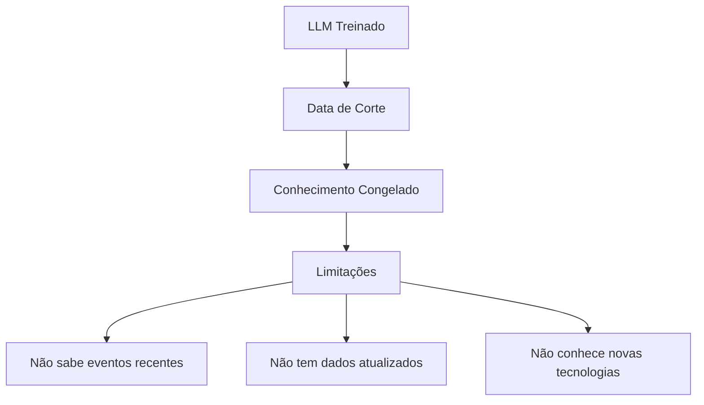
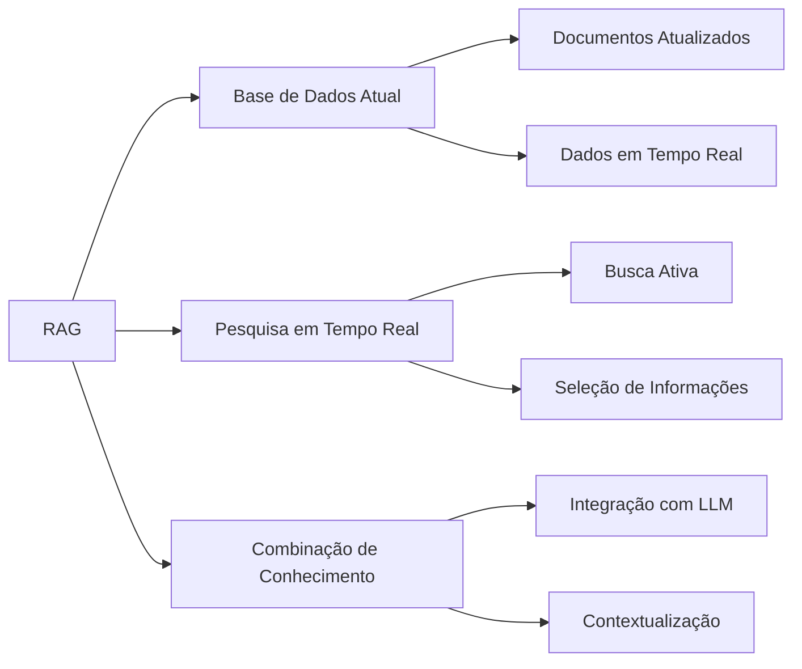
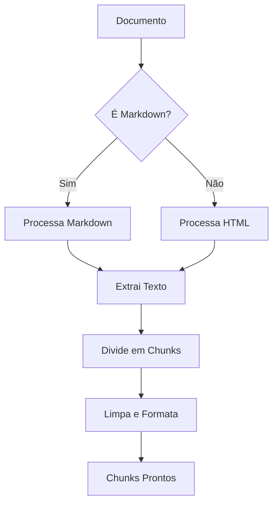
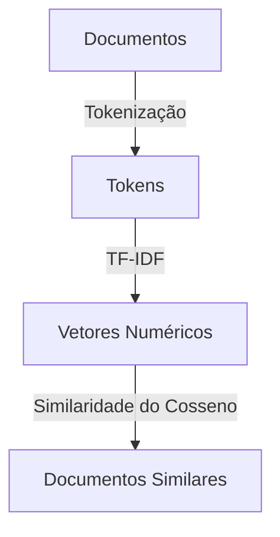
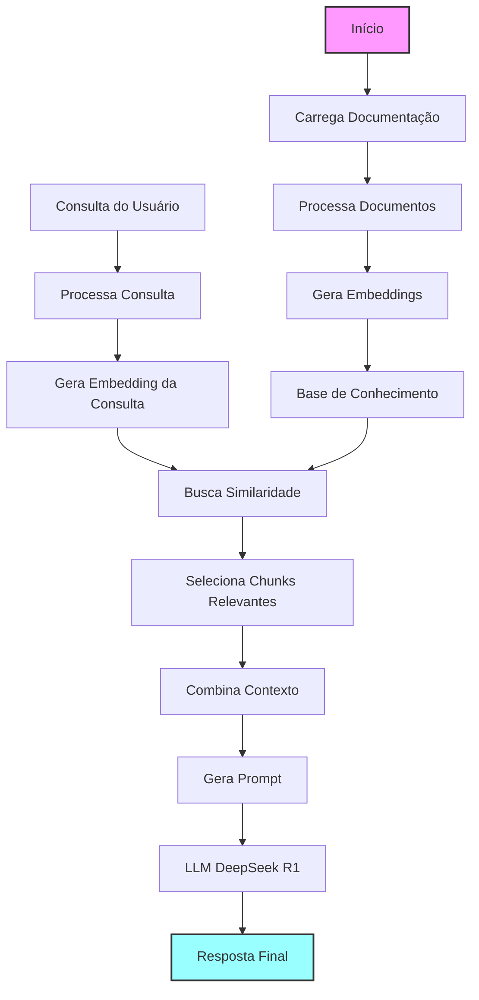
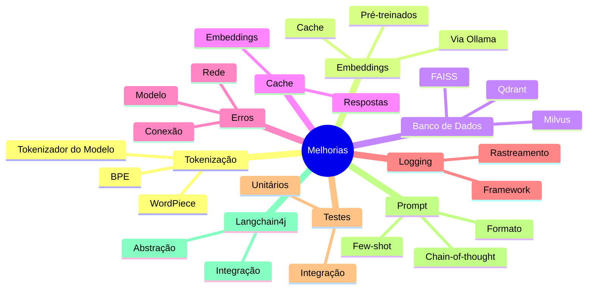

+++
title = "RAG Simples com Clojure e Ollama"
description = "Um protótipo funcional do zero"
date = 2024-01-23T19:00:00-00:00
tags = ["RAG", "LLM", "AI", "Langchain"]
draft = false
weight = 1
author = "Vitor Lobo Ramos"
+++

# Sumário

- **[Introdução](#introdução)**
- **[Fundamentos do RAG](#fundamentos-do-rag)**
    - [O que é RAG?](#o-que-é-rag)
    - [Por que precisamos do RAG?](#por-que-precisamos-do-rag)
    - [Os Três Pilares do RAG](#os-três-pilares-do-rag)
    - [Por que o DeepSeek R1?](#por-que-o-deepseek-r1)
- **[Implementação Prática](#implementação-prática)**
    - [Preparando o Ambiente](#preparando-o-ambiente)
    - [Estrutura do Projeto](#estrutura-do-projeto)
    - [Processamento de Documentos](#processamento-de-documentos)
    - [Sistema de Embeddings](#sistema-de-embeddings)
    - [Interface com Ollama](#interface-com-ollama)
    - [Módulo Principal](#módulo-principal)
- **[Como Usar](#como-usar)**
    - [Instalação do Ollama](#instalação-do-ollama)
    - [Configuração do Projeto](#configuração-do-projeto)
    - [Executando a Aplicação](#executando-a-aplicação)
- **[Considerações Técnicas](#considerações-técnicas)**
    - [Performance e Otimizações](#performance-e-otimizações)
    - [Tratamento de Erros](#tratamento-de-erros)
    - [Prompt Engineering](#prompt-engineering)
- **[Próximos Passos](#próximos-passos)**
    - [Melhorias Propostas](#melhorias-propostas)
    - [Usando Langchain4j](#usando-langchain4j)
- **[Referências](#referências)**

## Introdução

Olá, pessoal! 👋 

Neste artigo, vamos explorar como construir uma aplicação [RAG (Retrieval-Augmented Generation)](https://pt.wikipedia.org/wiki/Geração_aumentada_por_recuperação) completa do zero usando [Clojure](https://clojure.org/). Vamos mergulhar em uma implementação prática que combina processamento de texto, busca semântica e geração de respostas com LLMs locais. Se você está interessado em melhorar a precisão e relevância das respostas dos seus modelos de linguagem com informações atualizadas, este guia é para você!

## Fundamentos do RAG

### O que é RAG?

Os Modelos de Linguagem de Grande Escala (LLMs), como o GPT, ChatGPT e outros, revolucionaram a forma como interagimos com a inteligência artificial. Eles são capazes de gerar textos coerentes, responder perguntas complexas e até mesmo criar conteúdo criativo. No entanto, esses modelos possuem uma limitação fundamental: seu conhecimento é "congelado" no tempo.



### Por que precisamos do RAG?

Ao desenvolver aplicações inteligentes, como assistentes financeiros que precisam de cotações de ações em tempo real, chatbots de suporte que devem conhecer os produtos mais recentes da empresa ou sistemas de recomendação que se baseiam nas últimas tendências, nos deparamos com uma limitação crucial dos Modelos de Linguagem de Grande Escala (LLMs) tradicionais: seu conhecimento estático.

O problema fundamental reside no fato de que esses modelos, por mais sofisticados que sejam, possuem uma base de conhecimento "congelada" no momento de seu treinamento. Eles carecem de acesso inerente a informações atualizadas, o que restringe drasticamente sua aplicabilidade em cenários que exigem dados em tempo real ou conhecimento sobre eventos recentes.

> Confiar exclusivamente em um LLM "puro" nesses contextos resultará em respostas desatualizadas, potencialmente imprecisas e, consequentemente, em uma experiência do usuário comprometida. A eficácia da aplicação é diretamente afetada.

### Os Três Pilares do RAG



1. **Conexão com uma base de dados atual:** Em vez de depender apenas do conhecimento estático adquirido durante seu treinamento (que pode se tornar obsoleto rapidamente), o LLM ganha acesso a uma fonte de informações dinâmica e constantemente atualizada. Isso pode ser uma base de dados de notícias, um repositório de documentos corporativos, uma coleção de artigos científicos, ou qualquer outra fonte relevante para a tarefa em questão.
2. **Pesquisa em tempo real:** O LLM não está mais limitado a "lembrar" de informações. Ele adquire a capacidade de "procurar" ativamente por dados relevantes para responder a uma pergunta ou gerar um texto. Isso é semelhante a como nós, humanos, usamos mecanismos de busca para encontrar informações que não temos memorizadas. O LLM, equipado com RAG, pode formular consultas, analisar os resultados e selecionar as informações mais pertinentes.
3. **Combinação de conhecimento base com dados novos:** Este é o ponto crucial que diferencia o RAG de uma simples busca em uma base de dados. O LLM não apenas recupera informações, mas também as integra ao seu conhecimento pré-existente. Ele usa sua capacidade de raciocínio e compreensão para contextualizar os novos dados, identificar contradições, e formular respostas coerentes e informadas.

Segundo um [whitepaper recente dos pesquisadores do Google](https://arxiv.org/abs/2309.01066), existem várias técnicas para turbinar o desempenho dos LLMs, e o RAG é uma das mais promissoras. Isso ocorre porque o RAG aborda algumas das limitações fundamentais desses modelos:

O RAG resolve vários problemas de uma vez só: diminui aquelas "viagens" dos LLMs quando inventam respostas (as famosas alucinações), mantém tudo atualizado em vez de ficar preso no passado, deixa as respostas mais transparentes porque você sabe de onde veio a informação, e ainda melhora o desempenho do modelo quando ele precisa lidar com documentos ou dados específicos da sua empresa. É como dar ao modelo um Google particular que ele pode consultar antes de responder!

> O RAG representa um avanço significativo na evolução dos LLMs, permitindo que eles se tornem ferramentas mais confiáveis, precisas e úteis para uma ampla gama de aplicações. Ele transforma o LLM de um "sabe-tudo" desatualizado em um pesquisador ágil e bem-informado, capaz de combinar conhecimento profundo com informações atualizadas em tempo real.

### Por que o DeepSeek R1?

Ele trabalha muito bem com documentação técnica, o que é perfeito para nosso sistema [RAG](https://pt.wikipedia.org/wiki/Geração_aumentada_por_recuperação) focado em docs técnicas. O DeepSeek R1 consegue equilibrar qualidade e velocidade melhor que outros modelos do Ollama, rodando na sua máquina sem ficar alucinando com respostas que não fazem sentido.

O modelo também se dá super bem com várias linguagens de programação, incluindo [Clojure](https://clojure.org/), então ele responde numa boa sobre implementações técnicas e documentação de código. E o melhor: mesmo quando você joga informações pela metade ou todas bagunçadas, ele ainda consegue manter o contexto e dar respostas que fazem sentido. Por isso ele é perfeito para o que estamos construindo!

## Implementação Prática

### Preparando o Ambiente

Pre-requisitos:
- [Clojure](https://clojure.org/guides/getting_started): Linguagem de programação funcional que vamos usar para construir a aplicação
- [Leiningen](https://leiningen.org/): Ferramenta de build para Clojure
- [Ollama](https://ollama.com/): Modelo de linguagem local

### Estrutura do Projeto

Nossa aplicação terá três componentes principais:
1. **Processamento de documentação (Markdown/HTML)**
   - Extração de texto
   - Pré-processamento de texto
2. **Sistema de embeddings**
   - Criação de embeddings para o texto usando [TF-IDF](https://pt.wikipedia.org/wiki/TF-IDF)
   - Busca por similaridade semântica
3. **Interface com o LLM**
   - Geração de resposta usando o LLM

> **Observação:** Embora o RAG moderno utilize embeddings densos gerados por modelos de linguagem para capturar a semântica de forma mais rica, neste artigo, usaremos uma implementação simplificada de [TF-IDF (Term Frequency-Inverse Document Frequency)](https://pt.wikipedia.org/wiki/TF-IDF).

### Configuração do Projeto

1. Crie um novo projeto Clojure:
```bash
lein new app docai
cd docai
```

2. Configure o `project.clj`:
```clojure
(defproject docai "0.1.0-SNAPSHOT"
  :description "Um assistente RAG para consulta de documentação técnica"
  :url "http://example.com/FIXME"
  :license {:name "EPL-2.0 OR GPL-2.0-or-later WITH Classpath-exception-2.0"
            :url "https://www.eclipse.org/legal/epl-2.0/"}
  :dependencies [[org.clojure/clojure "1.11.1"]
                 [markdown-to-hiccup "0.6.2"]
                 [hickory "0.7.1"]
                 [org.clojure/data.json "2.4.0"]
                 [http-kit "2.6.0"]
                 [org.clojure/tools.logging "1.2.4"]
                 [org.clojure/tools.namespace "1.4.4"]
                 [org.clojure/core.async "1.6.681"]
                 [org.clojure/core.memoize "1.0.257"]
                 [org.clojure/core.cache "1.0.225"]]
  :main ^:skip-aot docai.core
  :target-path "target/%s"
  :profiles {:uberjar {:aot :all
                       :jvm-opts ["-Dclojure.compiler.direct-linking=true"]}})
```

A estrutura do projeto acima define um aplicativo Clojure para RAG (Retrieval-Augmented Generation) com várias dependências essenciais: `markdown-to-hiccup` e `hickory` para processar documentos em Markdown e HTML, `data.json` e `http-kit` para comunicação com APIs (como a do Ollama), `tools.logging` para registro de eventos, `tools.namespace` para gerenciamento de namespaces, `core.async` para operações assíncronas (útil ao lidar com processamento de documentos grandes), e `core.memoize` e `core.cache` para implementar cache de resultados (como embeddings ou respostas do LLM), o que melhora significativamente a performance ao evitar recálculos desnecessários, especialmente em consultas repetidas ou similares.


### Implementação dos Componentes

Agora vamos implementar os três componentes principais do nosso sistema RAG e vamos começar com o processamento de documentos. Pois, ele é o ponto de entrada para o RAG onde vamos processar os documentos e extrair o texto para ser usado nos outros componentes.

#### Processamento de Documentos

```clojure
;; src/docai/document.clj
(ns docai.document
  (:require [markdown-to-hiccup.core :as md]
            [hickory.core :as html]
            [clojure.string :as str]))

(defn is-string? [x]
  (instance? String x))

(defn extract-text-from-markdown [content]
  (try
    (let [hiccup-result (md/md->hiccup content)
          text-nodes (filter is-string? (flatten hiccup-result))]
      text-nodes)
    (catch Exception e
      (println "Erro ao processar Markdown:" (.getMessage e))
      [content])))

(defn extract-text-from-html [content]
  (try
    (let [dom (html/parse content)
          hiccup-result (html/as-hiccup dom)
          text-nodes (filter is-string? (flatten hiccup-result))]
      text-nodes)
    (catch Exception e
      (println "Erro ao processar HTML:" (.getMessage e))
      [content])))

(defn extract-text
  "Extrai texto de documentação (Markdown ou HTML)"
  [doc-path]
  (println "Extraindo texto de:" doc-path)
  (let [content (slurp doc-path)
        _ (println "Tamanho do conteúdo:" (count content) "caracteres")
        _ (println "Amostra do conteúdo:" (subs content 0 (min 100 (count content))))
        text (if (.endsWith doc-path ".md")
               (extract-text-from-markdown content)
               (extract-text-from-html content))
        _ (println "Quantidade de nós de texto extraídos:" (count text))
        chunks (partition-all 512 text)]  ; 512 tokens por chunk
    (println "Quantidade de chunks gerados:" (count chunks))
    chunks))

(defn preprocess-chunks
  "Limpa e prepara os chunks de texto"
  [chunks]
  (let [processed (map #(-> %
                            (str/join " ")
                            (str/replace #"\s+" " ")
                            (str/trim))
                       chunks)]
    (println "Primeiro chunk processado:" (first processed))
    processed))
```

Este trecho de código implementa a parte de processamento de documentos do nosso sistema RAG. Basicamente, ele pega arquivos Markdown ou HTML e extrai o texto puro deles para que possamos usar depois na busca semântica. O código usa bibliotecas como `markdown-to-hiccup` e `hickory` para converter os documentos em estruturas de dados que facilitam a extração do texto.



O fluxo é bem direto: primeiro verificamos se estamos lidando com Markdown ou HTML, depois extraímos o texto usando a função apropriada, dividimos em pedaços menores (chunks) de 512 tokens cada, e finalmente limpamos esses chunks removendo espaços extras e formatando tudo direitinho. O código também inclui bastante logging para ajudar a depurar o processo, mostrando informações como o tamanho do documento, quantidade de texto extraído e número de chunks gerados. Essa abordagem de dividir o texto em pedaços menores é crucial para o RAG, já que permite processar documentos grandes sem sobrecarregar o modelo de linguagem.


#### Sistema de Embeddings

Agora vamos implementar o sistema de embeddings. Ele é responsável por criar embeddings para o texto para que possamos usar na busca semântica.

```clojure
;; src/docai/embedding.clj
(ns docai.embedding
  (:require [clojure.string :as str]
            [clojure.core.memoize :as memo]))

;; Implementação de embeddings usando TF-IDF simples
;; Não depende de modelos externos, ao contrário do Ollama que usa o deepseek-r1 para o LLM

(defn tokenize
  "Divide o texto em tokens"
  [text]
  (if (string? text)
    (-> text
        str/lower-case
        (str/split #"\s+")
        (->> (filter #(> (count %) 2))))
    []))

(defn term-freq
  "Calcula a frequência dos termos"
  [tokens]
  (frequencies tokens))

(defn string-doc? [x]
  (instance? String x))

(defn doc-freq
  "Calcula a frequência dos documentos"
  [docs]
  (let [string-docs (filter string-doc? docs)  ; Use our own predicate function
        _ (println (str "Processando " (count string-docs) " documentos válidos de " (count docs) " total"))
        doc-tokens (map tokenize string-docs)  
        all-tokens (distinct (flatten doc-tokens))
        doc-count (count string-docs)]
    (if (zero? doc-count)
      {}
      (zipmap all-tokens
              (map #(count (filter (fn [tokens] (some #{%} tokens)) doc-tokens))
                   all-tokens)))))

(defn tf-idf
  "Calcula TF-IDF para um documento"
  [doc doc-freq]
  (if (empty? doc-freq)
    {}
    (let [tokens (tokenize doc)
          tf (term-freq tokens)
          n-docs (count (keys doc-freq))]
      (zipmap (keys tf)
              (map #(* (get tf %) (Math/log (/ n-docs (get doc-freq % 1))))
                   (keys tf))))))

(defn vectorize
  "Converte um documento em um vetor TF-IDF"
  [doc doc-freq]
  (let [tf-idf-scores (tf-idf doc doc-freq)]
    (if (empty? doc-freq)
      []
      (map #(get tf-idf-scores % 0.0)
           (keys doc-freq)))))

(defn create-embeddings
  "Gera embeddings para uma lista de textos usando TF-IDF"
  [texts]
  (try
    (let [doc-freq (doc-freq texts)]
      (map #(vectorize % doc-freq) texts))
    (catch Exception e
      (println "Erro ao criar embeddings: " (.getMessage e))
      (vec (repeat (count texts) [])))))

(defn cosine-similarity
  "Calcula a similaridade do cosseno entre dois vetores"
  [v1 v2]
  (if (or (empty? v1) (empty? v2))
    0.0
    (let [dot-product (reduce + (map * v1 v2))
          norm1 (Math/sqrt (reduce + (map #(* % %) v1)))
          norm2 (Math/sqrt (reduce + (map #(* % %) v2)))]
      (if (or (zero? norm1) (zero? norm2))
        0.0
        (/ dot-product (* norm1 norm2))))))

(defn similarity-search
  "Encontra os N chunks mais similares"
  [query-embedding doc-embeddings n]
  (if (or (empty? query-embedding) (empty? doc-embeddings))
    (take (min n (count doc-embeddings)) (range))
    (let [scores (map #(cosine-similarity query-embedding %) doc-embeddings)]
      (->> (map vector scores (range))
           (sort-by first >)
           (take n)
           (map second)))))
```

O código acima implementa um sistema simples de embeddings usando TF-IDF (Term Frequency-Inverse Document Frequency) para transformar textos em vetores numéricos. Basicamente, ele pega documentos de texto, quebra em palavras (tokens), calcula a importância de cada palavra considerando tanto sua frequência no documento quanto sua raridade na coleção inteira, e cria vetores que representam cada documento. É como transformar textos em coordenadas matemáticas para que o computador possa entender a "semelhança" entre eles.



A parte mais legal é a função `similarity_search`, que usa a similaridade do cosseno para encontrar documentos parecidos com uma consulta. Imagine que cada documento é um ponto num espaço multidimensional - quanto menor o ângulo entre dois pontos, mais similares eles são. O código não usa nenhum modelo de IA sofisticado para isso, apenas matemática básica, o que o torna leve e rápido, embora menos poderoso que embeddings modernos baseados em redes neurais. É como um GPS simples que te leva ao destino sem todos os recursos de um Google Maps.


#### Entendendo o TF-IDF

O TF-IDF é uma técnica fundamental para representar documentos como vetores numéricos. Vamos entender como ele funciona através de um exemplo prático:

##### Exemplo Numérico

Suponha que temos três documentos sobre programação:

1. Doc1: "Clojure é uma linguagem funcional"
2. Doc2: "Clojure é uma linguagem Lisp"
3. Doc3: "Python é uma linguagem dinâmica"

Vamos calcular o TF-IDF passo a passo:

1. **Tokenização e TF (Term Frequency)**
   - Primeiro, convertemos para minúsculas e dividimos em palavras
   - Removemos palavras muito curtas (menos de 3 caracteres)
   - Calculamos a frequência de cada termo em cada documento

   ```
   Doc1: {"clojure": 1, "linguagem": 1, "funcional": 1}
   Doc2: {"clojure": 1, "linguagem": 1, "lisp": 1}
   Doc3: {"python": 1, "linguagem": 1, "dinâmica": 1}
   ```

2. **IDF (Inverse Document Frequency)**
   - Contamos em quantos documentos cada termo aparece
   - Aplicamos a fórmula: IDF = log(N/DF), onde:
     - N = número total de documentos (3)
     - DF = número de documentos que contêm o termo

   ```bash
   "clojure": log(3/2) = 0.405
   "linguagem": log(3/3) = 0
   "funcional": log(3/1) = 1.099
   "lisp": log(3/1) = 1.099
   "python": log(3/1) = 1.099
   "dinâmica": log(3/1) = 1.099
   ```

3. **TF-IDF Final**
   - Multiplicamos TF pelo IDF para cada termo

   ```bash
   Doc1: {"clojure": 0.405, "linguagem": 0, "funcional": 1.099}
   Doc2: {"clojure": 0.405, "linguagem": 0, "lisp": 1.099}
   Doc3: {"python": 1.099, "linguagem": 0, "dinâmica": 1.099}
   ```

4. **Vetorização**
   - Convertemos para vetores usando todos os termos únicos como dimensões
   - Preenchemos com 0 para termos ausentes

   ```bash
   Doc1: [0.405, 0, 1.099, 0, 0, 0]
   Doc2: [0.405, 0, 0, 1.099, 0, 0]
   Doc3: [0, 0, 0, 0, 1.099, 1.099]
   ```

##### Por que usar logaritmo no IDF?

O logaritmo no IDF serve para dois propósitos principais:

1. **Suavização**: Reduz o impacto de termos muito raros ou muito comuns
2. **Escala**: Mantém os valores em uma faixa mais gerenciável

Por exemplo, sem o logaritmo:
- Um termo que aparece em 1/1000 documentos teria IDF = 1000
- Um termo que aparece em 1/2 documentos teria IDF = 2

Com o logaritmo:
- `log(1000) ≈ 6.9`
- `log(2) ≈ 0.7`

#### Similaridade do Cosseno

A similaridade do cosseno mede o ângulo entre dois vetores TF-IDF. Quanto menor o ângulo, mais similares são os documentos. A fórmula é:

```bash
cos(θ) = (A·B) / (||A|| ||B||)
```

Onde:
- `A·B` é o produto escalar dos vetores
- `||A||` e `||B||` são as normas (comprimentos) dos vetores

#### Limitações do TF-IDF

1. **Semântica**: TF-IDF não captura o significado das palavras. Por exemplo:
   - "carro" e "automóvel" são tratados como palavras diferentes
   - "bom" e "ruim" são tratados como palavras diferentes
2. **Ordem**: Não considera a ordem das palavras
   - "gato come rato" e "rato come gato" teriam o mesmo vetor TF-IDF
3. **Contexto**: Não captura o contexto das palavras
   - "banco" (financeiro) e "banco" (assento) são tratados como a mesma palavra
4. **Dimensão**: O vetor final pode ser muito grande (uma dimensão para cada termo único)

> Por isso, em sistemas RAG modernos, é mais comum usar embeddings gerados por modelos de linguagem, que capturam melhor a semântica e o contexto das palavras.

#### Interface com Ollama

Agora vamos implementar a interface com o Ollama. Ele é responsável por gerar a resposta para a query do usuário (essa parte aqui é super divertida, pois é onde vamos usar o LLM).

```clojure
;; src/docai/llm.clj
(ns docai.llm
  (:require [clojure.data.json :as json]
            [org.httpkit.client :as http]))

(def ollama-url "http://localhost:11434/api/generate")
(def model-name "deepseek-r1") ; Modelo DeepSeek para melhor qualidade

(defn call-ollama-api
  "Chama a API do Ollama para gerar uma resposta"
  [prompt]
  (let [request-body {:model model-name
                      :prompt prompt
                      :stream false}
        options {:headers {"Content-Type" "application/json"}
                 :body (json/write-str request-body)}
        response @(http/post ollama-url options)]
    (if (= (:status response) 200)
      (-> response
          :body
          (json/read-str :key-fn keyword)
          :response)
      (str "Erro ao chamar a API do Ollama: " (:status response) " - " (:body response)))))

;; Funções de utilidade para uso futuro:
;;
;; extract-code-blocks: Extrai blocos de código do texto usando regex
;; exemplo de uso:
;;   (extract-code-blocks "```clojure\n(+ 1 2)\n```") => ["(+ 1 2)"]
;;
;; extract-summary: Cria um resumo de texto com tamanho máximo especificado
;; exemplo de uso:
;;   (extract-summary "# Título\nConteúdo longo..." 50) => "Conteúdo longo..."

(defn format-prompt
  "Formata o prompt para o LLM"
  [context query]
  (str "Você é um assistente especializado em documentação técnica. Com base no seguinte contexto da documentação:\n\n"
       context
       "\n\nPergunta: " query
       "\n\nForneça uma resposta técnica precisa e, se possível, inclua exemplos de código. "
       "Se a documentação não contiver informações relevantes para a pergunta, "
       "indique isso claramente e forneça uma resposta geral com base em seu conhecimento."))

(defn generate-response
  "Gera resposta usando o LLM com base no contexto"
  [query context]
  (try
    (let [prompt (format-prompt context query)]
      (println "DEBUG - Enviando prompt para o Ollama usando o modelo" model-name)
      (call-ollama-api prompt))
    (catch Exception e
      (str "Erro ao gerar resposta: " (.getMessage e) 
           "\n\nPor favor, verifique se o Ollama está em execução no endereço " 
           ollama-url 
           "\n\nVocê pode iniciar o Ollama com o comando: ollama serve"))))
```

#### Módulo Principal

Agora vamos implementar o módulo principal que vai ser o ponto de entrada para o RAG. Ele vai ser responsável por carregar os documentos, processar os chunks, criar os embeddings e gerar a resposta para a query do usuário. 

```clojure
;; src/docai/core.clj
(ns docai.core
  (:require [docai.document :as doc]
            [docai.embedding :as emb]
            [docai.llm :as llm]
            [clojure.java.io :as io]
            [clojure.string :as str])
  (:gen-class))

(def docs-path "resources/docs")

(defn load-documentation
  "Carrega todos os arquivos de documentação do diretório"
  []
  (->> (file-seq (io/file docs-path))
       (filter #(.isFile %))
       (map #(.getPath %))))

(defn setup-knowledge-base
  "Configura a base de conhecimento inicial"
  []
  (let [doc-files (load-documentation)
        _ (when (empty? doc-files)
            (println "Aviso: Nenhum arquivo de documentação encontrado em resources/docs/"))
        _ (doseq [file doc-files]
            (println "Arquivo encontrado:" file))
        all-chunks (mapcat doc/extract-text doc-files)
        processed-chunks (doc/preprocess-chunks all-chunks)
        _ (println (str "Processando " (count processed-chunks) " chunks de texto..."))
        _ (when (< (count processed-chunks) 5)
            (println "DEBUG - Primeiros chunks:")
            (doseq [chunk (take 5 processed-chunks)]
              (println (str "Chunk: '" (subs chunk 0 (min 50 (count chunk))) "...'"))))
        embeddings (emb/create-embeddings processed-chunks)]
    {:chunks processed-chunks
     :embeddings embeddings
     :original-files doc-files}))

(defn get-file-content
  "Lê o conteúdo completo de um arquivo"
  [file-path]
  (try
    (slurp file-path)
    (catch Exception _
      (println "Erro ao ler arquivo:" file-path)
      "")))

(defn query-rag
  "Processa uma query usando o pipeline RAG"
  [knowledge-base query]
  (println "DEBUG - Processando query:" query)
  (if (and (seq (:chunks knowledge-base)) 
           (seq (:embeddings knowledge-base)))
    (let [query-emb (first (emb/create-embeddings [query]))
          similar-idxs (emb/similarity-search query-emb 
                                            (:embeddings knowledge-base)
                                            3)
          _ (println "DEBUG - Índices similares:" similar-idxs)
          
          ;; Obter contexto relevante
          context-chunks (->> similar-idxs
                              (map #(nth (:chunks knowledge-base) %))
                              (str/join "\n\n"))
          
          ;; Se não houver chunks relevantes, use o conteúdo original
          context (if (str/blank? context-chunks)
                    (if (seq (:original-files knowledge-base))
                      (get-file-content (first (:original-files knowledge-base)))
                      "Não foi possível encontrar informações relevantes.")
                    context-chunks)]
      
      (println "DEBUG - Tamanho do contexto:" (count context) "caracteres")
      (println "DEBUG - Amostra do contexto:" (subs context 0 (min 200 (count context))) "...")
      
      ;; Gerar resposta usando o LLM
      (llm/generate-response query context))
    "Não foi possível encontrar informações relevantes na base de conhecimento."))

(defn -main
  "Função principal que inicializa a aplicação DocAI"
  [& _]
  (println "Inicializando DocAI...")
  
  ;; Verificar se o Ollama está acessível
  (println "Para usar o Ollama, certifique-se de que ele está em execução com o comando: ollama serve")
  (println "Usando o modelo deepseek-r1. Se você ainda não o baixou, execute: ollama pull deepseek-r1")
  
  (let [kb (setup-knowledge-base)]
    (println "Base de conhecimento pronta! Faça sua pergunta:")
    (try
      (loop []
        (when-let [input (read-line)]
          (when-not (= input "sair")
            (println "Processando...")
            (println (query-rag kb input))
            (println "\nPróxima pergunta (ou 'sair' para terminar):")
            (recur))))
      (catch Exception e
        (println "Erro: " (.getMessage e))
        (println "Detalhes: " (ex-data e))))
    (println "Obrigado por usar o DocAI. Até a próxima!")))
```

---

## Como Usar

### Instalação do Ollama

1. **Instalação**:
   - **Windows**: Baixe o instalador do [site oficial do Ollama](https://ollama.com/download) e execute-o
   - **Linux**: Execute o comando:
     ```bash
     curl https://ollama.ai/install.sh | sh
     ```
   - **macOS**: Use o Homebrew:
     ```bash
     brew install ollama
     ```

2. **Iniciando o Servidor**:
   ```bash
   ollama serve
   ```

3. **Baixando o Modelo**:
   ```bash
   ollama pull deepseek-r1
   ```

4. **Verificando a Instalação**:
   - Execute um teste simples:
     ```bash
     ollama run deepseek-r1 "Olá! Como você está?"
     ```
   - Se tudo estiver funcionando, você receberá uma resposta do modelo

> **Dica**: O Ollama mantém os modelos em cache local. Se você precisar liberar espaço, pode usar `ollama rm deepseek-r1` para remover o modelo.

### Executando a Aplicação

1. Coloque seus documentos na pasta `resources/docs/` (já incluímos dois exemplos: `example.md`)
2. Execute o projeto:

```bash
lein run
```

3. Faça suas perguntas! Exemplo:

```bash
Como implementar autenticação JWT em Clojure?
Como implementar auth saml em python?
Como integrar o auth0 em uma aplicação Clojure?
etc...
``` 	

O DocAI processa sua pergunta em várias etapas:



1. **Processamento da Consulta**: A pergunta é convertida em um vetor TF-IDF
2. **Busca por Similaridade**: O sistema encontra os chunks mais relevantes
3. **Geração de Contexto**: Os chunks são combinados em um contexto coeso
4. **Geração de Resposta**: O LLM gera uma resposta baseada no contexto

Você pode ver o processo em ação nos logs:

```bash
DEBUG - Processando query: Como implementar autenticação JWT em Clojure?
DEBUG - Índices similares: [2, 5, 8]
DEBUG - Tamanho do contexto: 1234 caracteres
DEBUG - Amostra do contexto: "Para implementar autenticação JWT em Clojure..."
```

> **NOTA:** A propósito, o projeto docai está disponível no [https://github.com/scovl/docai](https://github.com/scovl/docai) caso você queira contribuir com o projeto ou usar em outro projeto.

## Considerações Técnicas

### Performance e Otimizações

1. **Performance**: Esta implementação é básica e pode ser otimizada:
   - Usando um banco de dados vetorial como [Milvus](https://milvus.io/) ou [FAISS](https://github.com/facebookresearch/faiss)
   - Implementando cache de embeddings
   - Paralelizando o processamento de chunks

2. **Memória**: Para documentações muito extensas, considere:
   - Processar os chunks em lotes
   - Implementar indexação incremental
   - Usar streaming para arquivos grandes

3. **Modelos**: Diferentes modelos do Ollama têm diferentes características:
   - DeepSeek R1: Bom para compreensão geral e geração de texto
   - DeepSeek Coder: Especializado em código
   - Llama 3: Boa alternativa geral
   - Mistral: Bom para tarefas específicas
   - Gemma: Leve e eficiente

### Tratamento de Erros

O sistema implementa várias camadas de tratamento de erros para lidar com diferentes cenários:

1. **Ollama Offline**
   - **Sintoma**: O sistema não consegue se conectar ao servidor Ollama
   - **Tratamento**: O código verifica a disponibilidade do servidor e fornece mensagens claras de erro:
   ```clojure
   (catch Exception e
     (str "Erro ao gerar resposta: " (.getMessage e) 
          "\n\nPor favor, verifique se o Ollama está em execução no endereço " 
          ollama-url 
          "\n\nVocê pode iniciar o Ollama com o comando: ollama serve"))
   ```

2. **Documentação Muito Grande**
   - **Sintoma**: Arquivos de documentação que excedem a memória disponível
   - **Tratamento**: O sistema implementa:
     - Chunking de documentos (512 tokens por chunk)
     - Processamento em lotes
     - Logs de progresso para monitoramento
   ```clojure
   (let [content (slurp doc-path)
         chunks (partition-all 512 text)]
     (println "Quantidade de chunks gerados:" (count chunks)))
   ```

3. **Consultas sem Relação com a Documentação**
   - **Sintoma**: Nenhum chunk relevante é encontrado para a consulta
   - **Tratamento**: O sistema:
     - Verifica se há chunks disponíveis
     - Usa fallback para conteúdo original se necessário
     - Fornece feedback claro ao usuário
   ```clojure
   (if (str/blank? context-chunks)
     (if (seq (:original-files knowledge-base))
       (get-file-content (first (:original-files knowledge-base)))
       "Não foi possível encontrar informações relevantes.")
     context-chunks)
   ```

4. **Melhorias Futuras**
   - Implementar retry com backoff exponencial para falhas de conexão
   - Adicionar cache de embeddings para melhor performance
   - Implementar streaming para arquivos muito grandes
   - Adicionar validação de formato de documentos
   - Implementar rate limiting para evitar sobrecarga do Ollama

### Prompt Engineering

O Prompt Engineering é uma habilidade crucial para obter bons resultados com LLMs. Um prompt bem estruturado pode fazer a diferença entre uma resposta vaga e uma resposta precisa e útil.

#### Estrutura do Prompt

```clojure
(defn format-prompt
  "Formata o prompt para o LLM"
  [context query]
  (str "Você é um assistente especializado em documentação técnica. "
       "Com base no seguinte contexto da documentação:\n\n"
       context
       "\n\nPergunta: " query
       "\n\nForneça uma resposta técnica precisa e, se possível, "
       "inclua exemplos de código. Se a documentação não contiver "
       "informações relevantes para a pergunta, indique isso claramente "
       "e forneça uma resposta geral com base em seu conhecimento."))
```

#### Técnicas de Prompt Engineering

- **Role Prompting**: Define um papel específico para o modelo ("Você é um especialista em...")
- **Few-shot Learning**: Fornece exemplos de entradas e saídas desejadas
- **Chain of Thought**: Pede ao modelo para explicar seu raciocínio
- **Format Specification**: Especifica o formato desejado da resposta
- **Constraints**: Define limites e requisitos para a resposta

#### Exemplo de Prompt Avançado

```clojure
(defn format-advanced-prompt
  "Formata um prompt mais sofisticado para o LLM"
  [context query]
  (str "Você é um especialista em documentação técnica de software, "
       "com foco em Clojure e desenvolvimento web.\n\n"
       "Contexto da documentação:\n"
       context
       "\n\nPergunta: " query
       "\n\nPor favor, siga estas diretrizes:\n"
       "1. Seja preciso e técnico\n"
       "2. Inclua exemplos de código quando relevante\n"
       "3. Cite as partes da documentação que você está usando\n"
       "4. Se a informação não estiver na documentação, indique claramente\n"
       "5. Mantenha a resposta concisa mas completa\n"
       "6. Use formatação Markdown para melhor legibilidade"))
```

#### Dicas para Prompts Efetivos

- Seja específico e claro nas instruções
- Use formatação para melhorar a legibilidade
- Inclua exemplos quando possível
- Defina limites e restrições claras
- Peça ao modelo para explicar seu raciocínio
- Use iteração para refinar o prompt

#### Avaliação de Prompts

- Teste diferentes variações do mesmo prompt
- Compare as respostas para identificar a melhor estrutura
- Colete feedback dos usuários
- Mantenha um registro dos prompts que funcionam bem

> **Nota**: O [Prompt Engineering](https://www.promptingguide.ai/) é uma área em constante evolução. Novas técnicas e melhores práticas surgem regularmente à medida que os modelos evoluem.

## Próximos Passos

### Melhorias Propostas



1. **Tokenização Avançada**
   - Usar um tokenizador de *subpalavras* (como BPE ou WordPiece)
   - Idealmente, o mesmo usado no treinamento do modelo (ex: `deepseek-r1`)

2. **Embeddings Pré-treinados**
   - Usar embeddings do próprio modelo (via Ollama)
   - Mais simples e *muito* melhor para busca semântica

3. **Banco de Dados Vetorial**
   - Usar um banco de dados vetorial (Milvus, FAISS, Qdrant, etc.)
   - Para lidar com *muitos* documentos de forma eficiente

4. **Cache**
   - Usar cache para os embeddings
   - Opcionalmente, cache de respostas

5. **Erros**
   - Tratar mais erros (Ollama offline, modelo indisponível, rede, arquivos inválidos)

6. **Logging**
   - Usar um framework de logging para rastreamento e depuração

7. **Testes**
   - Adicionar testes unitários e de integração

8. **Prompt Engineering**
   - Refinar o prompt (em `format-prompt`)
   - Experimentar com:
     * Exemplos no prompt (few-shot learning)
     * Instruções passo a passo (chain-of-thought)
     * Instruções claras sobre formato, tamanho, etc.
     * Pedir a fonte da informação (qual chunk)

9. **Usar langchain4j**
   - Criar RAG através do [langchain4j](https://github.com/langchain4j/langchain4j)
   - Via interop java com o clojure

### Usando Langchain4j

Langchain4j é uma biblioteca Java que oferece uma abstração de alto nível para construir aplicações de IA generativa, incluindo sistemas RAG. Ela se integra bem com Clojure através da interoperabilidade Java.

Vantagens de usar Langchain4j:
- **Abstração**: Fornece componentes pré-construídos para tarefas comuns
- **Modularidade**: Permite trocar implementações facilmente
- **Integração**: Oferece integrações com várias ferramentas e serviços
- **Comunidade e Suporte**: Possui uma comunidade ativa e boa documentação

> Em um próximo artigo, escreverei sobre como usar [Langchain4j](https://github.com/langchain4j/langchain4j) para criar um sistema RAG ainda neste mesmo projeto.

## Referências

- [RAG](https://www.pinecone.io/learn/rag/) - Documentação do Pinecone
- [Embedding](https://www.pinecone.io/learn/embeddings/) - Documentação do Pinecone
- [LLM](https://www.pinecone.io/learn/llms/) - Documentação do Pinecone
- [Ollama](https://ollama.com/) - Ferramenta para rodar LLMs localmente
- [Clojure](https://clojure.org/) - Documentação do Clojure
- [http-kit](https://github.com/http-kit/http-kit) - Cliente HTTP para Clojure
- [data.json](https://github.com/clojure/data.json) - Biblioteca JSON para Clojure
- [clojure.test](https://clojure.github.io/clojure/clojure.test-api.html) - Documentação da biblioteca de testes do Clojure
- [clj-kondo](https://github.com/clj-kondo/clj-kondo) - Linter para Clojure
