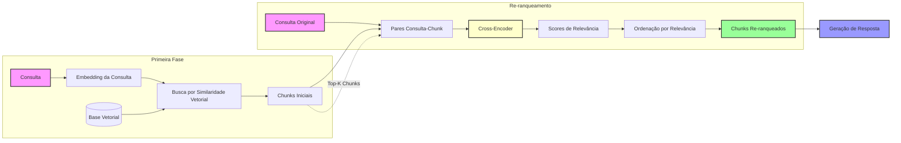
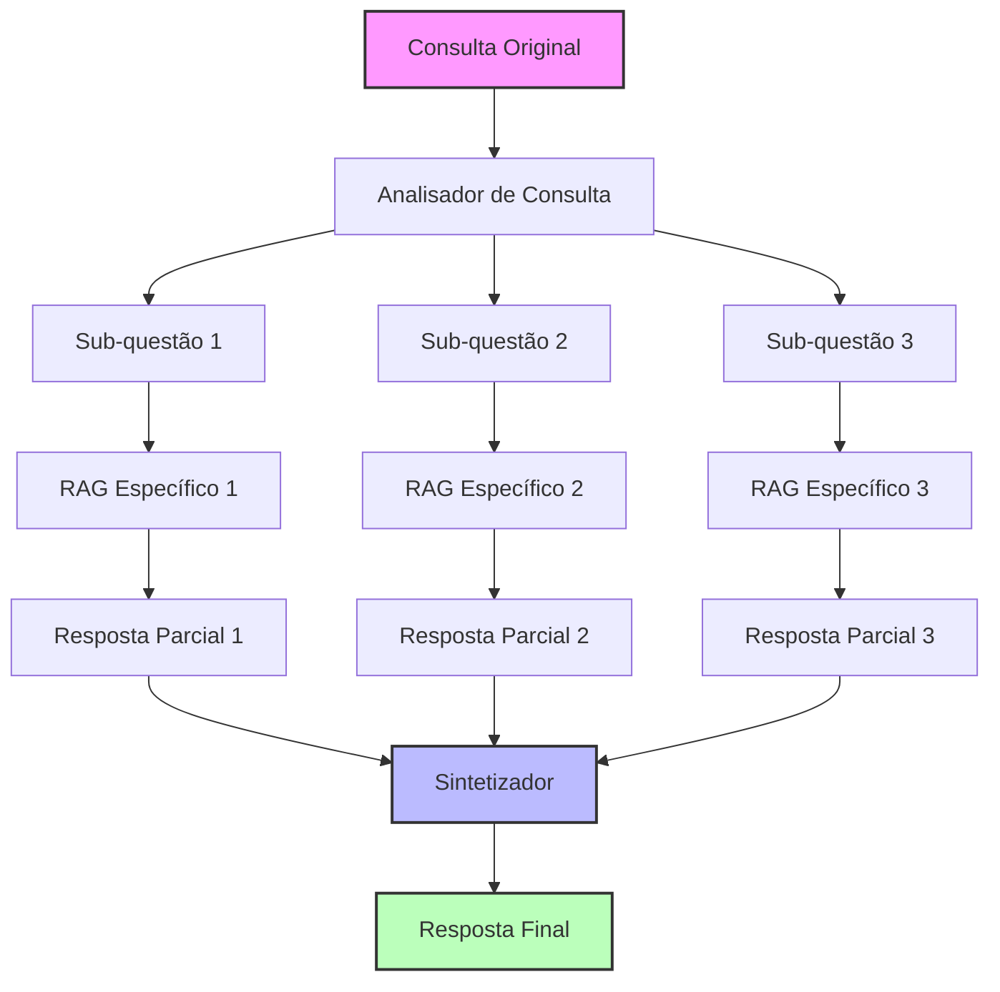
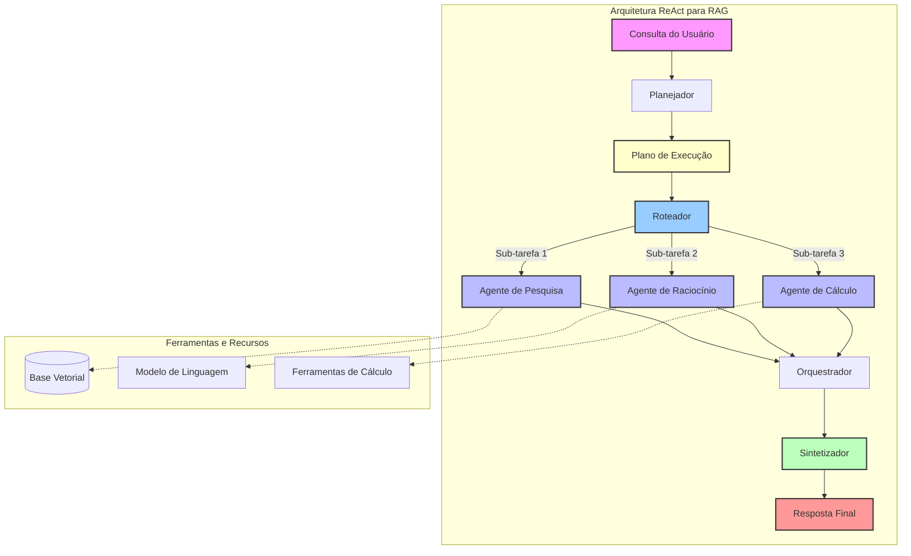
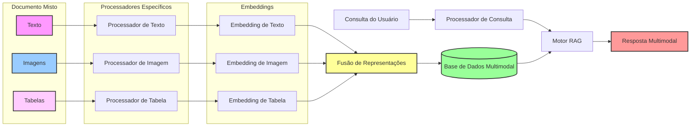
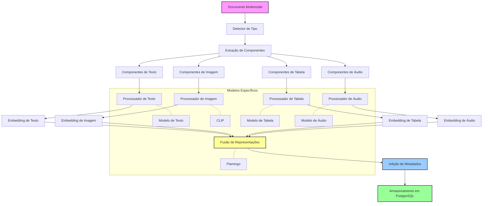
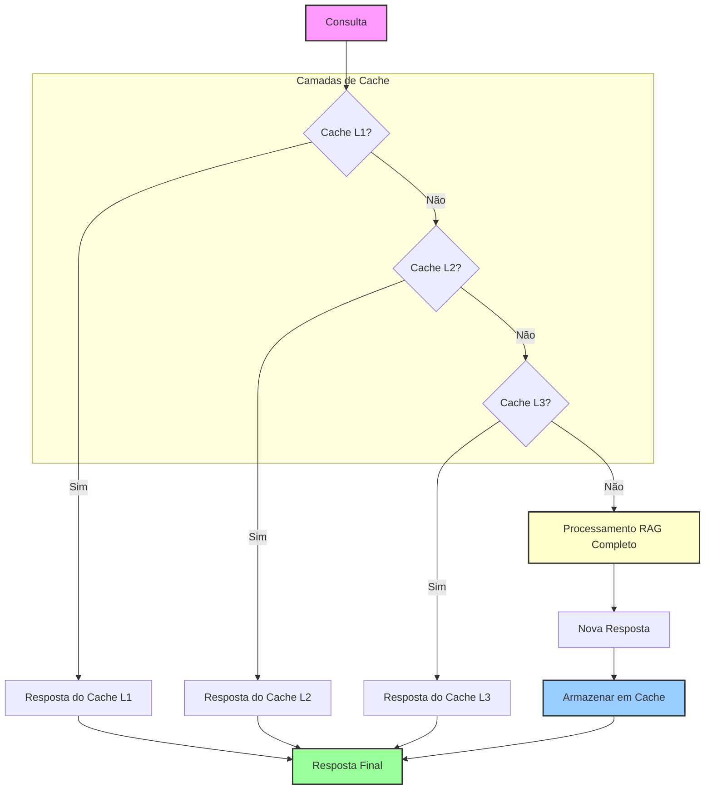
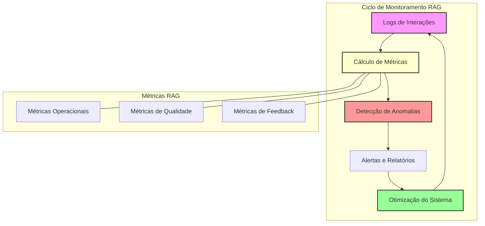
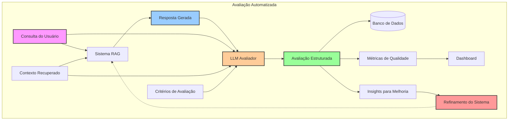
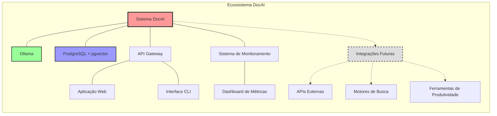
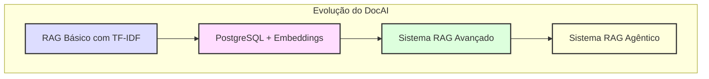

+++
title = "Técnicas Avançadas para RAG em Produção"
description = "Explorando técnicas para otimizar sistemas RAG para uso em produção"
date = 2025-03-28T12:00:00-00:00
tags = ["RAG", "LLM", "AI", "Optimização", "Produção", "PostgreSQL", "Ollama"]
draft = false
weight = 3
author = "Vitor Lobo Ramos"
+++

# Sumário

- **[Introdução](#introdução)**
- **[Da Teoria à Produção: Os Desafios Reais](#da-teoria-à-produção-os-desafios-reais)**
- **[Armadilhas Comuns e Como Evitá-las](#armadilhas-comuns-e-como-evitá-las)**
  - [Armadilha 1: A Falsa Sensação de Relevância](#armadilha-1-a-falsa-sensação-de-relevância)
  - [Armadilha 2: Tamanho Inadequado de Chunks](#armadilha-2-tamanho-inadequado-de-chunks)
  - [Armadilha 3: Falta de Monitoramento Contínuo](#armadilha-3-falta-de-monitoramento-contínuo)
  - [Armadilha 4: Consultas Complexas em Pipelines Simples](#armadilha-4-consultas-complexas-em-pipelines-simples)
- **[Técnicas Avançadas de Otimização](#técnicas-avançadas-de-otimização)**
  - [Re-ranqueamento de Chunks](#re-ranqueamento-de-chunks)
  - [Estratégias de Chunking Dinâmico](#estratégias-de-chunking-dinâmico)
  - [Workflows com Agentes para Consultas Complexas](#workflows-com-agentes-para-consultas-complexas)
    - [Arquitetura de Agentes Avançada](#arquitetura-de-agentes-avançada)
    - [Casos de Uso para Workflows de Agentes](#casos-de-uso-para-workflows-de-agentes)
  - [Pipelines Multimodais](#pipelines-multimodais)
    - [Arquitetura Multimodal Completa](#arquitetura-multimodal-completa)
    - [Esquema PostgreSQL para Dados Multimodais](#esquema-postgresql-para-dados-multimodais)
    - [Desafios de Implementação Multimodal](#desafios-de-implementação-multimodal)
  - [Estratégias de Cache](#estratégias-de-cache)
    - [Estratégias Avançadas de Cache para RAG](#estratégias-avançadas-de-cache-para-rag)
- **[Monitoramento e Métricas: LLMOps na Prática](#monitoramento-e-métricas-llmops-na-prática)**
  - [Métricas de Qualidade Específicas para RAG](#métricas-de-qualidade-específicas-para-rag)
  - [Automação da Avaliação com LLMs como Juízes](#automação-da-avaliação-com-llms-como-juízes)
  - [Configuração de um Dashboard de Qualidade RAG](#configuração-de-um-dashboard-de-qualidade-rag)
  - [Integração com Sistemas de Feedback do Usuário](#integração-com-sistemas-de-feedback-do-usuário)
- **[Implementando no DocAI](#implementando-no-docai)**
  - [Arquitetura Atual do DocAI](#arquitetura-atual-do-docai)
  - [Diferenciais do DocAI](#diferenciais-do-docai)
  - [Próximos Passos para o DocAI](#próximos-passos-para-o-docai)
- **[Integração com o Ecossistema](#integração-com-o-ecossistema)**
- **[Conclusão](#conclusão)**
- **[Referências](#referências)**

## Introdução

Olá pessoal! 👋

Nos artigos anteriores, exploramos como [implementar um RAG básico em Clojure](/post/rag/) em memória e como [construir um sistema de busca semântica com PostgreSQL e Ollama](/post/semantic-postgresql/). Agora, vamos dar o próximo passo: transformar nosso protótipo em um sistema RAG pronto para produção.

Como muitos desenvolvedores já descobriram, criar um protótipo funcional de [RAG](https://en.wikipedia.org/wiki/Retrieval-augmented_generation) com alguns documentos é relativamente simples. O verdadeiro desafio começa quando precisamos escalar esse sistema para lidar com milhares de documentos, garantir respostas precisas e manter o desempenho sob carga. Neste artigo, vamos explorar técnicas avançadas para superar esses desafios e levar nosso [DocAI](https://github.com/scovl/docai) para um novo patamar de qualidade e confiabilidade.

## Da Teoria à Produção: Os Desafios Reais

> "No papel, implementar um sistema [RAG](https://en.wikipedia.org/wiki/Retrieval-augmented_generation) parece simples—conectar um banco de dados vetorial, processar documentos, incorporar os dados, incorporar a consulta, consultar o [banco de dados vetorial](https://en.wikipedia.org/wiki/Vector_database) e gerar a resposta com o [LLM](https://en.wikipedia.org/wiki/Large_language_model). Mas na prática, transformar um protótipo em uma aplicação de alto desempenho é um desafio completamente diferente."

Ao migrarmos do [TF-IDF em memória](/post/rag/) para [PostgreSQL/pgvector/pgai](/post/semantic-postgresql/), demos um grande salto de qualidade. Porém, à medida que o volume de dados cresce e os casos de uso se tornam mais complexos, novos desafios surgem:

- **Escalabilidade**: Como lidar com milhões de documentos sem degradar o desempenho?
- **Precisão**: Como garantir que estamos recuperando o contexto mais relevante para cada consulta?
- **Eficiência**: Como reduzir latência e custos de processamento?
- **Confiabilidade**: Como evitar alucinações e respostas incorretas?
- **Manutenção**: Como monitorar e melhorar continuamente o sistema?

Antes de mergulharmos nas técnicas avançadas, precisamos entender que o impacto mais significativo no desempenho de um sistema [RAG](https://en.wikipedia.org/wiki/Retrieval-augmented_generation) não vem apenas de usar o modelo de linguagem mais recente. Os verdadeiros ganhos vêm de três fatores fundamentais:

- **Qualidade dos dados**: Dados bem estruturados e relevantes são a base de todo sistema RAG eficaz.
- **Preparação adequada**: Como os dados são processados, limpos e organizados.
- **Processamento eficiente**: Como os dados são recuperados e utilizados durante a inferência.

Mesmo com o avanço dos [LLMs](https://en.wikipedia.org/wiki/Large_language_model), esperar que modelos maiores corrijam magicamente problemas em dados defeituosos não é uma estratégia viável. O futuro da [IA](https://en.wikipedia.org/wiki/Artificial_intelligence) não está em um único modelo que sabe tudo, mas em sistemas que combinam [LLMs](https://en.wikipedia.org/wiki/Large_language_model), modelos multimodais e ferramentas de suporte que trabalham juntos de forma integrada. Dito isto, para construir um sistema [RAG](https://en.wikipedia.org/wiki/Retrieval-augmented_generation) robusto, precisamos responder a várias perguntas importantes como:

   - Como construir [mecanismos de recuperação robustos](https://en.wikipedia.org/wiki/Retrieval-augmented_generation)?
   - Qual o papel da [qualidade dos embeddings](https://en.wikipedia.org/wiki/Embedding_model) no desempenho da recuperação?
   - Como adaptar estratégias de [chunking](https://en.wikipedia.org/wiki/Chunking_(data_storage)) dinamicamente?
   - Como o [LLM](https://en.wikipedia.org/wiki/Large_language_model) pode interpretar dados de forma eficaz?
   - Uma cadeia de [LLMs](https://en.wikipedia.org/wiki/Large_language_model) ajudaria a refinar as respostas? Vale o custo?
   - Como prevenir alucinações mantendo a diversidade das respostas?
   - Como integrar entradas [multimodais](https://en.wikipedia.org/wiki/Multimodal_learning) (texto, imagens, tabelas) em um pipeline [RAG](https://en.wikipedia.org/wiki/Retrieval-augmented_generation)?
   - Quais estratégias de [cache](https://en.wikipedia.org/wiki/Cache_(computing)) reduzem chamadas de API redundantes e latência?
   - Como automatizar a [avaliação da recuperação](https://en.wikipedia.org/wiki/Evaluation_of_retrieval_systems) para melhoria contínua?

## Armadilhas Comuns e Como Evitá-las

Baseado na nossa experiência com o [DocAI](https://github.com/scovl/docai) e nos desafios relatados pela comunidade, identificamos quatro armadilhas principais que podem comprometer sistemas RAG:

### Armadilha 1: A Falsa Sensação de Relevância

Uma busca por vizinhos mais próximos sempre retornará algum resultado, mas como saber se é realmente útil? Alguns documentos podem parecer relevantes com base na similaridade vetorial, mas não fornecem o contexto adequado para responder à pergunta do usuário.

> **Solução**: Implementar verificação de relevância pós-recuperação usando [cross-encoders](https://huggingface.co/cross-encoder) ou filtros baseados em regras. No [PostgreSQL](https://www.postgresql.org/), podemos fazer isso com:

```sql
-- Primeiro recuperamos candidatos usando busca vetorial
WITH candidatos AS (
  SELECT id, titulo, conteudo, embedding <=> query_embedding AS distancia
  FROM documentos_embeddings
  ORDER BY distancia
  LIMIT 20
),
-- Depois aplicamos filtro secundário para verificar relevância real
filtrados AS (
  SELECT id, titulo, conteudo, distancia
  FROM candidatos
  WHERE 
    -- Filtro baseado em regras (exemplo: deve conter palavras-chave)
    conteudo ILIKE '%' || 'palavra_chave' || '%'
    -- Ou usar um modelo secundário para avaliar relevância
    -- ai.evaluate_relevance(conteudo, 'consulta_original') > 0.7  -- ⚠️ Nota: Função experimental no pgai
)
SELECT * FROM filtrados ORDER BY distancia LIMIT 5;
```

Este código SQL demonstra uma abordagem de duas fases para melhorar a qualidade da recuperação em sistemas RAG. Na primeira fase, utilizamos a [busca vetorial](https://en.wikipedia.org/wiki/Vector_database) para recuperar 20 candidatos iniciais ordenados por [similaridade vetorial](https://en.wikipedia.org/wiki/Vector_database) (usando o operador `<=>` do [pgvector](https://en.wikipedia.org/wiki/Vector_database) para calcular a distância entre embeddings). Esta etapa prioriza a velocidade e a amplitude da recuperação.

Na segunda fase, aplicamos filtros mais refinados para verificar a relevância real dos documentos recuperados. Isso pode incluir filtros baseados em regras (como busca por palavras-chave usando `ILIKE`) ou até mesmo modelos secundários de avaliação de relevância (como sugerido no comentário sobre a função experimental do [pgai](https://github.com/timescale/pgai)). Esta abordagem em duas etapas equilibra eficiência e precisão, permitindo que o sistema primeiro capture um conjunto amplo de candidatos potenciais e depois refine os resultados para apresentar apenas os documentos verdadeiramente relevantes para a consulta do usuário.


### Armadilha 2: Tamanho Inadequado de Chunks

Dividir documentos em chunks menores é uma prática padrão, mas qual é o tamanho ideal?

- Chunks muito pequenos perdem contexto crucial
- Chunks muito grandes diluem a recuperação com detalhes irrelevantes

> **Solução**: Adaptar a estratégia de chunking ao tipo de conteúdo. No nosso [PostgreSQL RAG](/post/semantic-postgresql/), usamos chunking recursivo:

```sql
-- Podemos ajustar os parâmetros de chunking para diferentes tipos de documentos
SELECT ai.create_vectorizer(
   'documentos_tecnicos'::regclass,
   destination => 'embeddings_tecnicos',
   embedding => ai.embedding_ollama('nomic-embed-text', 768),
   -- Chunks maiores para documentos técnicos que precisam de mais contexto
   chunking => ai.chunking_recursive_character_text_splitter('conteudo', 
                                                           chunk_size => 1500, 
                                                           chunk_overlap => 200)
);
```

Para documentos técnicos, que geralmente contêm informações densas e interconectadas, configuramos chunks maiores (1500 caracteres) com uma sobreposição significativa (200 caracteres). 

Isso permite preservar mais contexto dentro de cada chunk, o que é crucial para a compreensão de conceitos técnicos complexos. O uso do `chunking_recursive_character_text_splitter` implementa uma estratégia de divisão recursiva que respeita a estrutura natural do texto, enquanto o modelo de embedding `nomic-embed-text` com 768 dimensões captura as nuances semânticas do conteúdo técnico. Esta [abordagem adaptativa de chunking](https://en.wikipedia.org/wiki/Chunking_(data_storage)) é fundamental para equilibrar a granularidade da recuperação com a preservação do contexto necessário para respostas precisas em sistemas [RAG](https://en.wikipedia.org/wiki/Retrieval-augmented_generation).


### Armadilha 3: Falta de Monitoramento Contínuo

Como garantir que seu sistema permaneça eficaz ao longo do tempo? [LLMOps](https://www.databricks.com/br/glossary/llmops) não é apenas sobre implantação, mas sobre o monitoramento contínuo da qualidade.

> **Solução**: Implementar métricas de avaliação como:
> - Comparações com respostas conhecidas (ground truth)
> - Detecção de drift em embeddings
> - Monitoramento de latência e taxa de falhas

### Armadilha 4: Consultas Complexas em Pipelines Simples

Muitas consultas do mundo real são complexas demais para uma única etapa de recuperação. Se uma pergunta requer sintetizar várias informações, um pipeline RAG padrão pode falhar.

**Solução**: Implementar fluxos de trabalho mais sofisticados:
- Workflows com agentes
- Recuperação multi-hop
- Geração dinâmica de prompts

## Técnicas Avançadas de Otimização

Agora que entendemos os fundamentos e as armadilhas comuns, vamos explorar técnicas específicas para melhorar cada componente do nosso sistema RAG.

### Re-ranqueamento de Chunks



O diagrama acima ilustra o processo de re-ranqueamento em um sistema RAG, dividido em duas fases principais: 

1. Na "Primeira Fase", o fluxo começa com a consulta do usuário que é transformada em um embedding vetorial. Este embedding é então utilizado para realizar uma busca por [similaridade vetorial](https://en.wikipedia.org/wiki/Vector_database) na base de dados vetoriais, resultando em um conjunto inicial de chunks relevantes.

2. A segunda fase, "Re-ranqueamento", representa o refinamento desses resultados iniciais. Os chunks recuperados são combinados com a consulta original para formar pares consulta-chunk. Estes pares são processados por um [cross-encoder](https://en.wikipedia.org/wiki/Cross-encoder), um modelo especializado que avalia a relevância contextual entre a consulta e cada chunk. O cross-encoder gera scores de relevância que permitem uma ordenação mais precisa, resultando em chunks re-ranqueados que são finalmente utilizados para a geração da resposta final.

Esta abordagem em duas etapas combina a eficiência computacional dos embeddings (que permitem busca rápida em grandes bases de dados) com a precisão dos cross-encoders (que capturam melhor as relações semânticas entre consulta e documento), superando as limitações de cada método quando usado isoladamente. Abordagem conceitual de como implementar re-ranqueamento com cross-encoder em Clojure:

```clojure
;; Exemplo conceitual de como implementar re-ranqueamento com cross-encoder
(defn rerank-results
  "Re-classifica resultados usando cross-encoder para melhorar a precisão"
  [query initial-results n]
  (let [;; Em um cenário real, usaríamos uma biblioteca Clojure para acessar modelos
        ;; Como o clj-huggingface ou wrapper Java para transformers
        cross-encoder (load-cross-encoder "cross-encoder/ms-marco-MiniLM-L-6-v2")
        
        ;; Preparar pares de consulta-documento para avaliação
        pairs (map (fn [doc] [query (:conteudo doc)]) initial-results)
        
        ;; Obter scores de relevância do cross-encoder
        scores (predict-with-cross-encoder cross-encoder pairs)
        
        ;; Associar scores aos resultados originais
        results-with-scores (map-indexed 
                              (fn [idx doc] 
                                (assoc doc :relevance_score (nth scores idx)))
                              initial-results)
        
        ;; Ordenar por score de relevância (do maior para o menor)
        reranked-results (sort-by :relevance_score > results-with-scores)]
    
    ;; Retornar apenas os top-n resultados
    (take n reranked-results)))

;; Funções auxiliares (implementações dependeriam da biblioteca específica usada)
(defn load-cross-encoder [model-name]
  ;; Carregar modelo cross-encoder usando Java interop ou biblioteca específica
  (println "Carregando modelo" model-name)
  {:model-name model-name})

(defn predict-with-cross-encoder [model pairs]
  ;; Executar predição do cross-encoder nos pares consulta-documento
  ;; Retorna um vetor de scores de relevância
  (println "Avaliando" (count pairs) "pares com" (:model-name model))
  (vec (repeatedly (count pairs) #(rand))))
```

No contexto do [DocAI com PostgreSQL](/post/semantic-postgresql/), podemos implementar isso como:

```clojure
;; Exemplo de implementação de re-ranqueamento em Clojure para DocAI
(defn rerank-results
  "Re-classifica resultados usando cross-encoder"
  [query initial-results]
  (let [conn (jdbc/get-connection db-spec)
        ;; Construir array de IDs para consulta SQL
        ids (str/join "," (map :id initial-results))
        ;; Consulta SQL que utiliza função do pgai para re-classificação
        sql (str "SELECT d.id, d.titulo, d.conteudo, 
                 ai.relevance_score('" query "', d.conteudo) AS relevance  -- ⚠️ Nota: Função experimental no pgai
                 FROM documentos d 
                 WHERE d.id IN (" ids ") 
                 ORDER BY relevance DESC")]
    (jdbc/execute! conn [sql])))
```

O primeiro código demonstra uma implementação conceitual de re-ranqueamento usando um cross-encoder em Clojure. Ele recebe uma consulta e resultados iniciais, utiliza um modelo cross-encoder para avaliar a relevância de cada documento em relação à consulta, e então reordena os resultados com base nos scores obtidos. As funções auxiliares simulam a integração com modelos de machine learning, embora em um cenário real seria necessário utilizar bibliotecas específicas para acessar modelos de linguagem.

O segundo exemplo mostra uma implementação mais prática no contexto de um sistema [DocAI integrado com PostgreSQL](/post/semantic-postgresql/). Neste caso, o re-ranqueamento é delegado a uma função SQL (`ai.relevance_score`) que avalia a relevância entre a consulta e o conteúdo do documento diretamente no banco de dados. Esta abordagem aproveita as capacidades de IA incorporadas no PostgreSQL através de extensões como pgai, simplificando a arquitetura ao mover o processamento de relevância para o banco de dados.

Ambas as implementações ilustram diferentes estratégias para melhorar a precisão dos resultados em sistemas RAG. A primeira abordagem oferece mais controle e flexibilidade ao processar o re-ranqueamento na aplicação, enquanto a segunda aproveita as capacidades do banco de dados para simplificar a arquitetura e potencialmente melhorar o desempenho ao reduzir a transferência de dados entre a aplicação e o banco de dados. A escolha entre estas abordagens dependerá dos requisitos específicos do sistema, incluindo considerações de desempenho, escalabilidade e facilidade de manutenção.

---

### Estratégias de Chunking Dinâmico

Em vez de usar um tamanho fixo para todos os chunks, podemos implementar estratégias dinâmicas que se adaptam ao conteúdo:

- **Chunking Semântico**: Dividir o texto em unidades semanticamente coerentes
- **Chunking Hierárquico**: Manter múltiplas granularidades do mesmo conteúdo
- **Chunking Adaptativo**: Ajustar tamanho com base em características do documento

```clojure
;; Função conceitual para chunking hierárquico
(defn create-hierarchical-chunks
  "Cria chunks em múltiplos níveis de granularidade"
  [document]
  (let [;; Divisão em parágrafos
        paragraphs (split-paragraphs document)
        ;; Divisão em seções
        sections (split-sections document)
        ;; Documento completo
        full-doc [{:content document :level "document"}]
        ;; Combinar todos os níveis
        all-chunks (concat full-doc
                          (map #(hash-map :content % :level "section") sections)
                          (map #(hash-map :content % :level "paragraph") paragraphs))]
    ;; Inserir no PostgreSQL com metadados sobre o nível
    (doseq [chunk all-chunks]
      (jdbc/execute! db-spec
                    ["INSERT INTO documentos_hierarquicos 
                     (conteudo, nivel_granularidade) VALUES (?, ?)"
                     (:content chunk) (:level chunk)]))))
```

O código acima implementa uma estratégia de [chunking hierárquico](https://en.wikipedia.org/wiki/Chunking_(data_storage)) em [Clojure](https://clojure.org/), uma técnica avançada para sistemas [RAG](https://en.wikipedia.org/wiki/Retrieval-augmented_generation) que mantém múltiplas representações do mesmo conteúdo em diferentes níveis de granularidade. A função `create-hierarchical-chunks` divide um documento em três níveis: documento completo, seções e parágrafos, preservando assim tanto o contexto amplo quanto os detalhes específicos. 

Esta abordagem permite que o sistema de recuperação escolha a granularidade mais apropriada dependendo da consulta, oferecendo flexibilidade que um chunking de tamanho fixo não consegue proporcionar.

A implementação utiliza funções auxiliares como `split-paragraphs` e `split-sections` (não mostradas no código) para segmentar o documento de forma inteligente, respeitando a estrutura semântica do texto. Cada [chunk](https://en.wikipedia.org/wiki/Chunk_(data_storage)) é armazenado no [PostgreSQL](https://www.postgresql.org/) junto com metadados sobre seu nível de granularidade, permitindo consultas que podem priorizar diferentes níveis dependendo do tipo de pergunta. 

Esta técnica é particularmente valiosa para documentos longos e estruturados, como artigos técnicos ou documentação, onde tanto o contexto geral quanto detalhes específicos podem ser relevantes dependendo da natureza da consulta do usuário.

---

### Workflows com Agentes para Consultas Complexas

Para consultas que exigem raciocínio em várias etapas, podemos implementar agentes que decompõem o problema:



Este diagrama ilustra uma arquitetura de [workflow](https://en.wikipedia.org/wiki/Workflow) baseada em agentes para processamento de consultas complexas em sistemas [RAG](https://en.wikipedia.org/wiki/Retrieval-augmented_generation). O fluxo começa com uma consulta do usuário que é analisada por um componente [Analisador](https://en.wikipedia.org/wiki/Query_parser), responsável por decompor a pergunta original em sub-questões mais específicas e gerenciáveis. Cada sub-questão é então direcionada para um pipeline [RAG](https://en.wikipedia.org/wiki/Retrieval-augmented_generation) especializado, permitindo recuperações contextuais mais precisas.

A abordagem [divide-e-conquista](https://en.wikipedia.org/wiki/Divide_and_conquer_algorithm) demonstrada no diagrama permite que o sistema lide com perguntas que exigiriam conhecimento de diferentes domínios ou documentos. Cada [RAG](https://en.wikipedia.org/wiki/Retrieval-augmented_generation) especializado pode utilizar diferentes bases de conhecimento, estratégias de recuperação ou até mesmo modelos de linguagem otimizados para domínios específicos, resultando em respostas parciais de alta qualidade para cada aspecto da consulta.

O componente Sintetizador atua como o elemento integrador final, combinando as respostas parciais em uma resposta coerente e abrangente. Esta arquitetura modular não apenas melhora a precisão das respostas para consultas complexas, mas também oferece maior transparência no processo de raciocínio, permitindo identificar quais fontes contribuíram para cada parte da resposta final. O resultado é um sistema RAG mais robusto, capaz de lidar com consultas que exigem raciocínio em múltiplas etapas e integração de informações de diversas fontes.

```clojure
(defn agent-rag-workflow
  "Implementa um workflow de agente para consultas complexas"
  [query]
  (let [;; Passo 1: Analisar a consulta e identificar sub-questões
        sub-questions (analyze-query query)
        ;; Passo 2: Buscar informações para cada sub-questão
        sub-answers (map #(retrieve-and-generate %) sub-questions)
        ;; Passo 3: Sintetizar respostas parciais em uma resposta final
        final-context (str/join "\n\n" sub-answers)
        final-prompt (str "Com base nas seguintes informações:\n\n" 
                         final-context 
                         "\n\nResponda à pergunta original: " query)
        final-answer (generate-response final-prompt)]
    final-answer))

(defn analyze-query
  "Divide uma consulta complexa em sub-questões"
  [query]
  (let [prompt (str "Divida a seguinte pergunta em sub-questões independentes:\n\n" query)
        response (call-ollama-api prompt)
        ;; Parsear a resposta para extrair as sub-questões
        sub-questions (parse-sub-questions response)]
    sub-questions))
```

Uma implementação mais robusta de workflows com agentes envolve várias etapas adicionais. Trataremos deste assunto em um próximo artigo.

---

#### Arquitetura de Agentes Avançada

Os sistemas de agentes RAG mais sofisticados aplicam o conceito de **ReAct** (Raciocínio + Ação) para processar consultas complexas:



Este diagrama ilustra uma arquitetura avançada ReAct para sistemas [RAG](https://en.wikipedia.org/wiki/Retrieval-augmented_generation), mostrando como uma consulta complexa é processada através de múltiplos componentes especializados. O fluxo começa com a consulta do usuário sendo analisada por um [Planejador](https://en.wikipedia.org/wiki/Workflow), que cria um plano estruturado de execução. 

Este plano é então gerenciado por um [Roteador](https://en.wikipedia.org/wiki/Routing) que distribui sub-tarefas para agentes especializados (Pesquisa, Raciocínio e Cálculo), cada um interagindo com recursos específicos como bases de dados vetoriais, LLMs ou ferramentas de cálculo.

A força desta arquitetura está na sua capacidade de decompor problemas complexos em tarefas gerenciáveis e especializadas, permitindo que cada componente se concentre no que faz melhor. O [Orquestrador](https://en.wikipedia.org/wiki/Orchestration) coordena os resultados dos diferentes agentes, enquanto o [Sintetizador](https://en.wikipedia.org/wiki/Synthesis) integra todas as informações em uma resposta final coerente. Esta abordagem modular não apenas melhora a precisão das respostas, mas também aumenta a transparência do processo de raciocínio e facilita a depuração e otimização de componentes individuais do sistema RAG.

- **Planejador**: Analisa a consulta e cria um plano de execução
- **Roteador**: Direciona sub-consultas para ferramentas especializadas
- **Agentes Especializados**: Executam tarefas específicas
   - Agente de Pesquisa: Recupera informações da base de conhecimento
   - Agente de Raciocínio: Realiza inferências lógicas sobre os dados recuperados
   - Agente de Cálculo: Processa cálculos e análises numéricas
- **Orquestrador**: Gerencia o fluxo de informações entre agentes
- **Sintetizador**: Combina as respostas em um resultado coerente

Vamos analisar o código abaixo para entender como funciona um sistema ReAct para RAG:

```clojure
;; Exemplo conceitual de um sistema ReAct para RAG
(defn react-agent
  "Implementa um agente ReAct para consultas complexas"
  [query]
  (let [;; Determinar se a consulta precisa de um plano
        plan-needed? (complex-query? query)
        ;; Se necessário, criar um plano
        execution-plan (when plan-needed?
                         (create-execution-plan query))
        ;; Executar o plano ou a consulta direta
        result (if plan-needed?
                 (execute-plan execution-plan)
                 (simple-rag-query query))]
    result))

(defn execute-plan
  "Executa um plano com agentes especializados"
  [plan]
  (loop [steps (:steps plan)
         context {}
         responses []]
    (if (empty? steps)
      ;; Sintetizar respostas em um resultado final
      (synthesize-responses responses (:query plan))
      (let [current-step (first steps)
            agent-type (:agent current-step)
            ;; Determinar qual agente especializado usar
            agent-fn (case agent-type
                       :search search-agent
                       :reasoning reasoning-agent
                       :calculation calculation-agent
                       :default default-agent)
            ;; Executar o agente com o contexto atual
            step-result (agent-fn (:input current-step) context)
            ;; Atualizar o contexto com o resultado
            updated-context (assoc context (:id current-step) step-result)]
        (recur (rest steps) 
               updated-context 
               (conj responses step-result))))))
```

O código implementa um agente ReAct (Reasoning + Acting) para consultas complexas em um sistema [RAG](https://en.wikipedia.org/wiki/Retrieval-augmented_generation). A função principal `react-agent` avalia se a consulta requer um plano de execução complexo ou pode ser processada diretamente. Para consultas complexas, cria-se um plano estruturado que é executado pela função `execute-plan`, que utiliza um loop para processar cada etapa do plano sequencialmente. 

O sistema emprega agentes especializados (busca, raciocínio, cálculo) selecionados dinamicamente com base no tipo de tarefa. Cada agente contribui com resultados parciais que são acumulados em um contexto compartilhado, permitindo que etapas posteriores utilizem informações de etapas anteriores. Finalmente, todas as respostas são sintetizadas em um resultado coerente. 

Esta arquitetura modular permite decompor problemas complexos em tarefas gerenciáveis, melhorando a precisão e facilitando a manutenção do sistema.Para implementações detalhadas de sistemas de agentes RAG, consulte:

- [LlamaIndex - Implementando ReAct Agents](https://docs.llamaindex.ai/en/stable/examples/agent/react_agent.html)
- [LangChain - Multi-Agent Systems](https://python.langchain.com/docs/modules/agents/agent_types/multi_agent)
- [HuggingFace - Agentes Autônomos](https://huggingface.co/blog/autonomous-agents)

#### Casos de Uso para Workflows de Agentes

Os workflows com agentes são particularmente úteis em cenários como:

- **Pesquisa Científica**: Onde diversas fontes precisam ser consultadas e relacionadas
- **Diagnóstico de Problemas**: Quando é necessário seguir uma árvore de decisão
- **Análise de Documentos Complexos**: Como contratos ou documentação técnica
- **Planejamento Estratégico**: Onde múltiplas dimensões precisam ser consideradas

---

### Pipelines Multimodais

Integrar entradas multimodais (texto, imagens, tabelas) em um pipeline RAG pode enriquecer significativamente o contexto:



O diagrama acima ilustra uma arquitetura de pipeline multimodal para sistemas [RAG](https://en.wikipedia.org/wiki/Retrieval-augmented_generation), demonstrando como diferentes tipos de conteúdo (texto, imagens e tabelas) podem ser processados e integrados em um único sistema de recuperação. O fluxo começa com a extração desses diferentes elementos de um documento misto, cada um seguindo para processadores especializados que compreendem as características únicas de cada modalidade.

Na camada de embeddings, cada tipo de conteúdo é transformado em representações vetoriais específicas para sua modalidade - textos são processados por modelos de linguagem, imagens por modelos de visão computacional, e tabelas por processadores estruturados. O componente de fusão de representações é crucial nesta arquitetura, pois combina estas diferentes representações vetoriais em um formato unificado que pode ser armazenado e consultado eficientemente na base de dados multimodal.

Quando uma consulta do usuário é recebida, ela passa pelo processador de consulta que determina quais modalidades são relevantes para a pergunta, e o motor [RAG](https://en.wikipedia.org/wiki/Retrieval-augmented_generation) recupera as informações apropriadas da base de dados multimodal. Esta abordagem permite que o sistema forneça respostas enriquecidas que incorporam conhecimento de múltiplas modalidades, resultando em uma experiência mais completa e contextualmente relevante para o usuário, especialmente para consultas que se beneficiam de informações visuais ou estruturadas além do texto puro.

```clojure
(defn process-multimodal-document
  "Processa um documento que contém texto e imagens"
  [doc-path]
  (let [;; Extrair texto
        text-content (extract-text doc-path)
        ;; Identificar e extrair imagens
        image-paths (extract-images doc-path)
        ;; Gerar descrições para as imagens usando um modelo de visão
        image-descriptions (map #(describe-image %) image-paths)
        ;; Combinar texto e descrições de imagens
        enriched-content (str text-content "\n\n"
                             "O documento contém as seguintes imagens:\n"
                             (str/join "\n" image-descriptions))]
    ;; Inserir no banco de dados
    (jdbc/execute! db-spec
                  ["INSERT INTO documentos (titulo, conteudo) VALUES (?, ?)"
                   (extract-title doc-path) enriched-content])))
```

---

#### Arquitetura Multimodal Completa

Uma implementação mais completa de pipelines multimodais requer vários componentes especializados:



O diagrama acima ilustra uma arquitetura para [processamento de documentos multimodais](https://en.wikipedia.org/wiki/Multimodal_AI) em sistemas RAG avançados. O fluxo começa com um documento multimodal que passa por um [detector de tipo](https://en.wikipedia.org/wiki/Type_detection), seguido pela [extração de componentes](https://en.wikipedia.org/wiki/Component_extraction) que separa o conteúdo em diferentes modalidades: texto, imagem, tabela e áudio. Cada tipo de componente é então direcionado para um processador especializado, projetado para extrair informações significativas específicas daquela modalidade.

Após o processamento inicial, cada componente é transformado em uma [representação vetorial (embedding)](https://en.wikipedia.org/wiki/Embedding_model) usando modelos especializados para cada modalidade - [modelos de texto para componentes textuais](https://en.wikipedia.org/wiki/Text_embedding), [CLIP para imagens](https://en.wikipedia.org/wiki/CLIP), [modelos específicos para tabelas](https://en.wikipedia.org/wiki/Table_embedding) e [áudio](https://en.wikipedia.org/wiki/Audio_embedding). Estes embeddings são então combinados através de um processo de fusão de representações, que cria uma compreensão unificada e coerente do documento multimodal, potencialmente utilizando modelos como o [Flamingo](https://www.deepmind.com/blog/tackling-multiple-tasks-with-a-single-visual-language-model) que são projetados para integração multimodal.

A etapa final do pipeline envolve a adição de [metadados estruturados](https://en.wikipedia.org/wiki/Metadata) à [representação unificada](https://en.wikipedia.org/wiki/Unified_representation) e seu armazenamento em um banco de dados [PostgreSQL](https://www.postgresql.org/) otimizado para [busca vetorial](https://en.wikipedia.org/wiki/Vector_database) com [pgvector](https://github.com/pgvector/pgvector). 

Esta arquitetura modular permite que o sistema [RAG](https://en.wikipedia.org/wiki/Retrieval-augmented_generation) processe eficientemente documentos complexos contendo múltiplos tipos de mídia, mantendo as relações semânticas entre diferentes componentes e possibilitando recuperação mais precisa quando consultado. Os modelos específicos destacados no diagrama (`TEXT_MODEL`, `CLIP`, `TABLE_MODEL`, `AUDIO_MODEL` e `FLAMINGO`) representam as tecnologias de ponta que podem ser empregadas em cada etapa do processamento.

O código abaixo implementa um pipeline avançado para processamento de documentos multimodais em [Clojure](https://clojure.org/), demonstrando uma abordagem sofisticada para lidar com conteúdo heterogêneo em sistemas [RAG](https://en.wikipedia.org/wiki/Retrieval-augmented_generation):

```clojure
;; Exemplo de pipeline multimodal mais elaborado
(defn advanced-multimodal-processor
  "Pipeline completo para processamento multimodal"
  [document-path]
  (let [;; Determinar tipo de documento
        doc-type (detect-document-type document-path)
        
        ;; Extrair componentes por tipo
        components (case doc-type
                     :pdf (extract-pdf-components document-path)
                     :doc (extract-doc-components document-path)
                     :webpage (extract-webpage-components document-path)
                     (extract-text-components document-path))
        
        ;; Processar cada componente com seu processador especializado
        processed-components (map process-component components)
        
        ;; Gerar embeddings multimodais
        embeddings (map #(generate-multimodal-embedding % doc-type) processed-components)
        
        ;; Criar representação unificada
        unified-representation {:components processed-components
                               :embeddings embeddings
                               :metadata {:doc-type doc-type
                                         :path document-path
                                         :extracted-at (java.util.Date.)}}]
    
    ;; Armazenar no PostgreSQL com schema adequado para multimodalidade
    (store-multimodal-document unified-representation)))

(defn process-component
  "Processa um componente baseado em seu tipo"
  [component]
  (case (:type component)
    :text (process-text (:content component))
    :image (process-image (:content component))
    :table (process-table (:content component))
    :chart (process-chart (:content component))
    :audio (process-audio (:content component))
    (:content component))) ;; Fallback para tipos desconhecidos
```

A função principal `advanced-multimodal-processor` orquestra todo o fluxo, começando pela detecção do tipo de documento, seguida pela extração de componentes específicos para cada formato (PDF, DOC, páginas web), processamento especializado de cada componente, geração de embeddings multimodais e finalmente o armazenamento da representação unificada no PostgreSQL. Esta arquitetura modular permite que o sistema processe de forma inteligente diferentes tipos de mídia dentro do mesmo documento.

A função auxiliar `process-component` exemplifica o tratamento especializado para cada modalidade, direcionando o conteúdo para processadores específicos com base no tipo do componente (texto, imagem, tabela, gráfico ou áudio). Esta abordagem granular garante que cada tipo de conteúdo receba o tratamento mais apropriado, maximizando a qualidade da informação extraída e sua representação vetorial. 

O resultado é um sistema [RAG](https://en.wikipedia.org/wiki/Retrieval-augmented_generation) verdadeiramente [multimodal](https://en.wikipedia.org/wiki/Multimodal_AI), capaz de compreender e recuperar informações de documentos complexos que combinam texto, elementos visuais e dados estruturados, proporcionando respostas mais completas e contextualmente ricas para as consultas dos usuários.

---

#### Esquema PostgreSQL para Dados Multimodais

Para armazenar e recuperar eficientemente dados multimodais no PostgreSQL:

```sql
-- Tabela principal para documentos multimodais
CREATE TABLE documentos_multimodais (
    id SERIAL PRIMARY KEY,
    titulo TEXT NOT NULL,
    doc_type TEXT,
    metadata JSONB,
    created_at TIMESTAMP DEFAULT CURRENT_TIMESTAMP
);

-- Tabela para componentes específicos
CREATE TABLE componentes_documento (
    id SERIAL PRIMARY KEY,
    documento_id INTEGER REFERENCES documentos_multimodais(id) ON DELETE CASCADE,
    tipo_componente TEXT NOT NULL,
    conteudo TEXT,
    posicao INTEGER,
    metadados JSONB
);

-- Tabela para embeddings de texto
CREATE TABLE embeddings_texto (
    id SERIAL PRIMARY KEY,
    componente_id INTEGER REFERENCES componentes_documento(id) ON DELETE CASCADE,
    embedding VECTOR(768)
);

-- Tabela para embeddings de imagem
CREATE TABLE embeddings_imagem (
    id SERIAL PRIMARY KEY,
    componente_id INTEGER REFERENCES componentes_documento(id) ON DELETE CASCADE,
    embedding VECTOR(512)
);
```

Este esquema (scheme) [SQL](https://en.wikipedia.org/wiki/SQL) estabelece uma estrutura robusta para armazenar e gerenciar documentos multimodais no [PostgreSQL](https://www.postgresql.org/). A arquitetura é composta por quatro tabelas interconectadas: uma tabela principal (`documentos_multimodais`) que armazena metadados gerais dos documentos, uma tabela para componentes específicos (`componentes_documento`) que fragmenta cada documento em suas partes constituintes (texto, imagens, etc.), e duas tabelas especializadas para armazenar embeddings vetoriais de diferentes modalidades (`embeddings_texto` e `embeddings_imagem`). Esta estrutura relacional permite uma organização hierárquica do conteúdo, mantendo a integridade referencial através de chaves estrangeiras.

A separação dos [embeddings](https://en.wikipedia.org/wiki/Embedding_model) por tipo de modalidade é particularmente importante, pois diferentes tipos de conteúdo geralmente requerem modelos de embedding distintos com dimensionalidades variadas (768 para texto e 512 para imagens no exemplo). Esta abordagem modular facilita a implementação de consultas multimodais eficientes, permitindo buscas por similaridade em cada modalidade separadamente ou de forma combinada. 

Além disso, o uso de campos [JSONB](https://www.postgresql.org/docs/current/datatype-json.html) para metadados oferece flexibilidade para armazenar informações adicionais sem necessidade de alterar o esquema, tornando o sistema adaptável a diferentes tipos de documentos e requisitos de aplicação. Para implementações detalhadas de [RAG](https://en.wikipedia.org/wiki/Retrieval-augmented_generation) multimodal, consulte:

- [MultiModal RAG com LlamaIndex](https://docs.llamaindex.ai/en/stable/examples/multi_modal/)
- [Comprehensive Guide to MultiModal RAG](https://towardsdatascience.com/a-comprehensive-guide-to-multimodal-rag-ea72c387c6e8)
- [Projeto IDEFICS para RAG Multimodal](https://huggingface.co/blog/idefics)
- [Supabase - Image Search com pgvector](https://supabase.com/blog/image-search-using-ai-embeddings)

---	

#### Desafios de Implementação Multimodal

A implementação de pipelines multimodais traz desafios específicos:

1. **Alinhamento de Representações**: Garantir que diferentes modalidades possam ser comparadas
2. **Gerenciamento de Recursos**: Modelos multimodais são computacionalmente exigentes
3. **Estratégias de Fusão**: Decidir quando fundir informações de diferentes modalidades
   - Fusão Precoce: Combinar antes do embedding
   - Fusão Tardia: Manter embeddings separados e combinar apenas no ranking final

> No próximo artigo, exploraremos em profundidade como expandir o DocAI para oferecer suporte total a conteúdo multimodal, com exemplos práticos de implementação e otimização de desempenho.

---

### Estratégias de Cache

Implementar caching pode reduzir drasticamente a latência e os custos:



O diagrama acima ilustra uma estratégia de cache em múltiplas camadas para sistemas RAG, uma técnica fundamental para otimizar tanto a latência quanto os custos operacionais. A arquitetura implementa três níveis de cache `(L1, L2 e L3)`, cada um representando diferentes compromissos entre velocidade e abrangência. O cache `L1` tipicamente armazena respostas exatas para consultas idênticas, oferecendo resposta instantânea quando há correspondência perfeita. O cache `L2` pode armazenar respostas para consultas semanticamente similares, enquanto o cache `L3` pode conter resultados parciais como embeddings pré-calculados ou chunks recuperados anteriormente.

Esta abordagem em cascata permite que o sistema evite o processamento [RAG](https://en.wikipedia.org/wiki/Retrieval-Augmented_Generation) completo sempre que possível, reduzindo significativamente o tempo de resposta e a carga computacional. Quando uma consulta não encontra correspondência em nenhum nível de cache, apenas então o sistema executa o fluxo completo de [RAG](https://en.wikipedia.org/wiki/Retrieval-Augmented_Generation), que inclui geração de embeddings, recuperação de contexto e inferência do [LLM](https://en.wikipedia.org/wiki/Large_language_model). 

> A nova resposta gerada é então armazenada no cache apropriado para uso futuro, criando um sistema que se torna progressivamente mais eficiente à medida que processa mais consultas. A implementação de uma estratégia de cache multicamada como esta pode reduzir custos operacionais em até 70% em sistemas de produção com padrões de consulta repetitivos. 

Além da economia de recursos, a redução na latência melhora significativamente a experiência do usuário, com respostas quase instantâneas para consultas frequentes. Para maximizar a eficácia, é importante implementar políticas de expiração de cache e estratégias de invalidação para garantir que as informações permaneçam atualizadas, especialmente em domínios onde os dados subjacentes mudam com frequência. Abaixo, um exemplo de implementação de cache de dois níveis em Clojure:

```clojure
;; Implementação de cache de dois níveis em Clojure
(def embedding-cache (atom {}))
(def response-cache (atom {}))

(defn cached-embed
  "Gera embedding para texto com cache"
  [text]
  (if-let [cached (@embedding-cache text)]
    cached
    (let [embedding (generate-embedding text)]
      (swap! embedding-cache assoc text embedding)
      embedding)))

(defn cached-rag-query
  "Executa consulta RAG com cache"
  [query]
  (if-let [cached (@response-cache query)]
    (do
      (println "Cache hit for query!")
      cached)
    (let [;; Processo RAG normal
          response (full-rag-process query)]
      ;; Armazenar no cache apenas para consultas não-pessoais
      (when (not (personal-query? query))
        (swap! response-cache assoc query response))
      response)))
```

O código acima implementa uma estratégia de cache de dois níveis em [Clojure](https://clojure.org/) para otimizar sistemas [RAG](https://en.wikipedia.org/wiki/Retrieval-augmented_generation). O primeiro nível (`embedding-cache`) armazena embeddings já calculados para textos, evitando a regeneração desses vetores que é computacionalmente intensiva. O segundo nível (`response-cache`) armazena respostas completas para consultas anteriores, permitindo retornar resultados instantaneamente quando uma consulta idêntica é feita novamente. 

A função `cached-embed` verifica primeiro se o embedding já existe no cache antes de gerá-lo, enquanto `cached-rag-query` implementa lógica similar para respostas completas, incluindo uma verificação inteligente para evitar o cache de consultas pessoais.

Em produção com maior escala, esta abordagem poderia ser estendida para utilizar [Redis](https://redis.io/) ou outras soluções de cache distribuído, mantendo os mesmos princípios fundamentais. Para o [PostgreSQL](https://www.postgresql.org/), podemos implementar [cache de embeddings diretamente no banco](https://www.postgresql.org/docs/current/pgvector-embeddings.html):

```sql
-- Criar tabela de cache para embeddings de consultas frequentes
CREATE TABLE IF NOT EXISTS query_embedding_cache (
  query_text TEXT PRIMARY KEY,
  embedding VECTOR(768),
  created_at TIMESTAMP DEFAULT CURRENT_TIMESTAMP,
  hit_count INTEGER DEFAULT 1
);

-- Função para obter embedding com cache
CREATE OR REPLACE FUNCTION get_cached_embedding(query TEXT)
RETURNS VECTOR AS $$
DECLARE
  cached_embedding VECTOR(768);
BEGIN
  -- Verificar se existe no cache
  SELECT embedding INTO cached_embedding
  FROM query_embedding_cache
  WHERE query_text = query;
  
  -- Se existe, atualizar contador e retornar
  IF FOUND THEN
    UPDATE query_embedding_cache 
    SET hit_count = hit_count + 1 
    WHERE query_text = query;
    RETURN cached_embedding;
  ELSE
    -- Gerar novo embedding
    cached_embedding := ai.ollama_embed('nomic-embed-text', query);  -- ⚠️ Nota: Verifique a disponibilidade desta função na sua instalação
    
    -- Armazenar no cache
    INSERT INTO query_embedding_cache (query_text, embedding)
    VALUES (query, cached_embedding);
    
    RETURN cached_embedding;
  END IF;
END;
$$ LANGUAGE plpgsql;
```

Este código SQL implementa um sistema de cache para embeddings de consultas no PostgreSQL, otimizando significativamente o desempenho de sistemas RAG em produção. A tabela `query_embedding_cache` armazena o texto da consulta como chave primária, junto com seu [embedding vetorial](https://www.postgresql.org/docs/current/pgvector-embeddings.html), [timestamp de criação](https://www.postgresql.org/docs/current/functions-datetime.html) e um [contador de acessos](https://www.postgresql.org/docs/current/functions-math.html). Esta estrutura não apenas evita o recálculo de embeddings para consultas repetidas, mas também fornece dados valiosos sobre padrões de uso através do campo `hit_count`.

A função `get_cached_embedding` encapsula a lógica de cache com uma interface limpa: quando uma consulta é recebida, ela primeiro verifica se o embedding já existe no cache. Se encontrado, incrementa o contador de acessos e retorna imediatamente o embedding armazenado, economizando o custo computacional da geração de embeddings. Caso contrário, gera um novo embedding usando o modelo 'nomic-embed-text' via [Ollama](https://ollama.com/), armazena-o no cache para uso futuro e o retorna.

Esta implementação reduz significativamente a latência para consultas repetidas, diminui a carga nos serviços de embedding, e proporciona uma base para análises de desempenho e otimização contínua. A abordagem é particularmente eficaz em cenários onde os usuários tendem a fazer perguntas semelhantes ou quando o sistema processa grandes volumes de consultas, resultando em economia de recursos computacionais e melhoria na experiência do usuário com respostas mais rápidas.

#### Estratégias Avançadas de Cache para RAG

Para sistemas RAG em produção, podemos implementar estratégias de cache mais sofisticadas:

1. [**Cache em Múltiplas Camadas**](https://en.wikipedia.org/wiki/Multilevel_cache):
   - L1: Cache em memória para consultas muito frequentes
   - L2: Cache em banco de dados para persistência entre reinicializações
   - L3: Cache distribuído (como [Redis](https://redis.io/)) para sistemas escaláveis

2. [**Políticas de Expiração Inteligentes**](https://en.wikipedia.org/wiki/Time_to_live):
   - TTL (Time-to-Live) baseado na frequência de uso
   - Invalidação seletiva quando documentos relacionados são atualizados
   - Cache semântico que agrupa consultas similares

3. **Pré-Computação e Cache Preditivo**:
   - Analisar padrões de consulta para pré-computar respostas prováveis
   - Gerar embeddings para variações comuns de consultas

```clojure
;; Exemplo de implementação de cache com Redis para alta disponibilidade
(defn distributed-cached-rag-query
  "Executa consulta RAG com cache distribuído"
  [query]
  (let [cache-key (str "rag:query:" (digest/md5 query))
        ;; Verificar no Redis
        cached-response (redis/get cache-key)]
    (if cached-response
      ;; Usar resposta em cache
      (do
        (redis/incr (str cache-key ":hits"))
        (json/read-str cached-response))
      ;; Gerar nova resposta
      (let [response (full-rag-process query)
            ;; Serializar e armazenar no Redis com TTL
            _ (redis/setex cache-key 
                          (* 60 60 24) ;; 24 horas
                          (json/write-str response))
            ;; Registrar metadados para análise
            _ (redis/hmset (str cache-key ":meta")
                          {"timestamp" (System/currentTimeMillis)
                           "query_length" (count query)
                           "query_type" (determine-query-type query)})]
        response))))
```

Para implementações detalhadas de estratégias de cache para RAG, consulte:

- [LlamaIndex - Query Engine Caching](https://docs.llamaindex.ai/en/stable/module_guides/querying/query_engine/query_engine_caching)
- [LangChain - Caching para LLM Applications](https://python.langchain.com/docs/modules/model_io/llms/llm_caching)
- [Redis Vector Database for RAG](https://redis.io/docs/stack/search/reference/vectors/)

---

## Monitoramento e Métricas: LLMOps na Prática

Para garantir que nosso sistema RAG continue funcionando bem em produção, precisamos monitorar métricas chave:



O diagrama acima ilustra o ciclo completo de [monitoramento](https://en.wikipedia.org/wiki/Monitoring) para [sistemas RAG](https://en.wikipedia.org/wiki/Retrieval-augmented_generation) em produção. No centro do processo estão os "[Logs de Interações](https://en.wikipedia.org/wiki/Log_file)", que capturam dados detalhados sobre cada [consulta](https://en.wikipedia.org/wiki/Query) processada pelo sistema, incluindo a pergunta original, os [documentos recuperados](https://en.wikipedia.org/wiki/Information_retrieval), a [resposta gerada](https://en.wikipedia.org/wiki/Natural_language_generation) e [métricas de desempenho](https://en.wikipedia.org/wiki/Performance_metric). 

Estes logs alimentam o "[Cálculo de Métricas](https://en.wikipedia.org/wiki/Metric_(mathematics))", que transforma [dados brutos](https://en.wikipedia.org/wiki/Raw_data) em [indicadores acionáveis](https://en.wikipedia.org/wiki/Key_performance_indicator) distribuídos em três categorias principais: [operacionais](https://en.wikipedia.org/wiki/Operational_efficiency) ([latência](https://en.wikipedia.org/wiki/Latency_(engineering)), [throughput](https://en.wikipedia.org/wiki/Throughput)), [qualidade](https://en.wikipedia.org/wiki/Data_quality) ([precisão](https://en.wikipedia.org/wiki/Precision_and_recall), [relevância](https://en.wikipedia.org/wiki/Relevance_(information_retrieval))) e [feedback](https://en.wikipedia.org/wiki/Feedback) (avaliações dos usuários). A "[Detecção de Anomalias](https://en.wikipedia.org/wiki/Anomaly_detection)" monitora continuamente estas métricas para identificar desvios significativos dos padrões esperados, gerando "[Alertas e Relatórios](https://en.wikipedia.org/wiki/Alert_management)" que orientam a "[Otimização do Sistema](https://en.wikipedia.org/wiki/System_optimization)", fechando assim o ciclo de [melhoria contínua](https://en.wikipedia.org/wiki/Continuous_improvement).

Este fluxo de trabalho representa a essência do [LLMOps](https://en.wikipedia.org/wiki/MLOps) aplicado a sistemas RAG, onde o monitoramento não é apenas [reativo](https://en.wikipedia.org/wiki/Reactive_programming), mas [proativo](https://en.wikipedia.org/wiki/Proactive) na identificação de oportunidades de melhoria. A estrutura tripartite das métricas garante uma [visão holística](https://en.wikipedia.org/wiki/Holism) do desempenho: enquanto as métricas operacionais asseguram a [eficiência técnica](https://en.wikipedia.org/wiki/Technical_efficiency) do sistema, as métricas de qualidade avaliam a [precisão semântica](https://en.wikipedia.org/wiki/Semantic_similarity) das respostas, e as métricas de feedback incorporam a [perspectiva humana](https://en.wikipedia.org/wiki/Human-centered_design) na avaliação. 

Esta abordagem [integrada](https://en.wikipedia.org/wiki/System_integration) permite que [equipes de engenharia](https://en.wikipedia.org/wiki/Engineering_team) identifiquem rapidamente [gargalos](https://en.wikipedia.org/wiki/Bottleneck_(software)), ajustem [parâmetros de recuperação](https://en.wikipedia.org/wiki/Information_retrieval) e melhorem continuamente a [experiência do usuário](https://en.wikipedia.org/wiki/User_experience) final, mesmo à medida que o [volume de dados](https://en.wikipedia.org/wiki/Big_data) e a [complexidade das consultas](https://en.wikipedia.org/wiki/Query_complexity) aumentam. O código abaixo mostra como implementar o log e a avaliação de respostas em [Clojure](https://en.wikipedia.org/wiki/Clojure):

```clojure
;; Estrutura para log e avaliação de respostas
(defn log-rag-interaction
  "Registra uma interação RAG para análise posterior"
  [query retrieved-docs response latency]
  (jdbc/execute! db-spec
                ["INSERT INTO rag_logs 
                 (query, retrieved_docs, response, latency_ms, timestamp)
                 VALUES (?, ?, ?, ?, CURRENT_TIMESTAMP)"
                 query
                 (json/write-str retrieved-docs)
                 response
                 latency]))

;; Função para calcular métricas de desempenho
(defn calculate-rag-metrics
  "Calcula métricas de desempenho para um período"
  [start-date end-date]
  (let [logs (jdbc/execute! db-spec
                           ["SELECT * FROM rag_logs 
                            WHERE timestamp BETWEEN ? AND ?"
                            start-date end-date])
        ;; Métricas de latência
        avg-latency (average-latency logs)
        p95-latency (percentile-latency logs 95)
        ;; Taxa de falhas (quando resposta contém erros específicos)
        failure-rate (failure-rate logs)
        ;; Distribuição de consultas por tópico
        topic-distribution (topic-distribution logs)]
    {:avg_latency avg-latency
     :p95_latency p95-latency
     :failure_rate failure-rate
     :topic_distribution topic-distribution}))
```

A função `log-rag-interaction` captura cada aspecto da interação desde a consulta original até os documentos recuperados, a resposta gerada e o tempo de latência armazenando-os em um banco de dados relacional para análise posterior. Esta abordagem permite rastrear o histórico completo de interações, criando um registro valioso para depuração, otimização e avaliação de desempenho ao longo do tempo.

A função `calculate-rag-metrics` complementa o sistema de logging ao transformar os dados brutos em métricas acionáveis, calculando indicadores críticos como latência média, percentil 95 de latência (importante para entender outliers), taxa de falhas e distribuição de consultas por tópico. 

Esta análise multidimensional permite que as equipes identifiquem não apenas problemas técnicos (como gargalos de desempenho), mas também padrões de uso e áreas temáticas que podem requerer otimização específica. A combinação destas duas funções estabelece um ciclo de feedback contínuo que é essencial para [sistemas RAG em produção](https://en.wikipedia.org/wiki/Retrieval-Augmented_Generation), permitindo melhorias iterativas baseadas em dados reais de uso.

### Métricas de Qualidade Específicas para RAG

Além das métricas operacionais comuns (latência, disponibilidade), sistemas RAG requerem métricas específicas para avaliar a qualidade das respostas:

#### 1. Métricas de Relevância do Contexto

- **Precision@K**: Proporção de chunks recuperados que são realmente relevantes para a consulta
- **Recall@K**: Proporção de chunks relevantes na base de conhecimento que foram recuperados
- **NDCG (Normalized Discounted Cumulative Gain)**: Avalia se os chunks mais relevantes estão no topo da lista

Abaixo, um exemplo de implementação de métricas de relevância do contexto em Clojure:

```clojure
(defn calculate-precision-at-k
  "Calcula Precision@K para uma consulta e seus chunks recuperados"
  [query chunks k expert-judgments]
  (let [retrieved-top-k (take k chunks)
        relevant-count (count (filter #(is-chunk-relevant? % query expert-judgments) 
                                     retrieved-top-k))]
    (double (/ relevant-count (min k (count retrieved-top-k))))))

(defn calculate-recall-at-k
  "Calcula Recall@K para uma consulta"
  [query chunks k all-relevant-chunks expert-judgments]
  (let [retrieved-top-k (take k chunks)
        retrieved-relevant (filter #(is-chunk-relevant? % query expert-judgments) 
                                  retrieved-top-k)
        total-relevant-count (count all-relevant-chunks)]
    (if (pos? total-relevant-count)
      (double (/ (count retrieved-relevant) total-relevant-count))
      1.0))) ;; Se não há chunks relevantes, recall é 1
```

A função `calculate-precision-at-k` mede a proporção de chunks relevantes entre os `k` primeiros resultados recuperados, comparando-os com julgamentos de especialistas. Já a função `calculate-recall-at-k` avalia a proporção de chunks relevantes que foram efetivamente recuperados em relação ao total de chunks relevantes disponíveis. 

Ambas as métricas são fundamentais para entender a eficácia do sistema de recuperação: `precision` indica quão precisa é a recuperação (minimizando falsos positivos), enquanto `recall` mostra quão completa é a recuperação (minimizando falsos negativos). A implementação inclui tratamento para casos especiais, como quando não há chunks relevantes disponíveis, garantindo resultados matematicamente consistentes. 

#### 2. Métricas de Qualidade da Resposta

Para avaliar a qualidade das respostas geradas por sistemas RAG, é essencial implementar métricas específicas que capturem diferentes dimensões de eficácia. Estas métricas vão além de simples avaliações binárias (correto/incorreto) e permitem uma análise nuançada da performance do sistema. Implementamos as seguintes métricas qualitativas em nosso framework de avaliação:

- **Faithfulness (Fidelidade)**: O grau em que a resposta é suportada pelo contexto fornecido, sem alucinações
- **Answer Relevancy (Relevância da Resposta)**: Quão bem a resposta aborda a consulta do usuário
- **Contextual Precision (Precisão Contextual)**: Proporção do contexto utilizado que foi relevante para a resposta
- **Helpfulness (Utilidade)**: Avaliação subjetiva de quão útil foi a resposta para o usuário

Abaixo, um exemplo de implementação de métricas de qualidade da resposta em Clojure:

```clojure
(defn evaluate-response-quality
  "Avalia métricas qualitativas de uma resposta RAG"
  [query context response]
  (let [;; Usar LLM como avaliador
        prompt-faithfulness (str "Avalie a fidelidade da seguinte resposta ao contexto fornecido.\n\n"
                                "Consulta: " query "\n\n"
                                "Contexto: " context "\n\n"
                                "Resposta: " response "\n\n"
                                "A resposta contém informações que não estão no contexto? "
                                "A resposta contradiz o contexto em algum ponto? "
                                "Atribua uma pontuação de 1 a 10, onde 10 significa perfeita fidelidade ao contexto.")
        
        prompt-relevancy (str "Avalie quão relevante é a resposta para a consulta.\n\n"
                             "Consulta: " query "\n\n"
                             "Resposta: " response "\n\n"
                             "A resposta aborda diretamente a consulta? "
                             "Alguma parte importante da consulta foi ignorada? "
                             "Atribua uma pontuação de 1 a 10, onde 10 significa perfeitamente relevante.")
        
        ;; Chamar LLM para avaliação
        faithfulness-result (parse-score (call-evaluation-llm prompt-faithfulness))
        relevancy-result (parse-score (call-evaluation-llm prompt-relevancy))]
    
    ;; Retornar resultados agregados
    {:faithfulness faithfulness-result
     :relevancy relevancy-result
     :composite_score (/ (+ faithfulness-result relevancy-result) 2.0)}))
```

A função recebe três parâmetros principais: a consulta original do usuário (`query`), o contexto recuperado pelo sistema (`context`) e a resposta gerada pelo modelo (`response`). Utilizando esses inputs, a função constrói dois prompts específicos para avaliar diferentes dimensões da qualidade da resposta.

O primeiro prompt avalia a "fidelidade" [(faithfulness)](https://en.wikipedia.org/wiki/Faithfulness_(literary_theory)) da resposta, verificando se ela se mantém fiel ao contexto fornecido sem adicionar informações não presentes ou contradizer o material de referência. O segundo prompt avalia a "relevância" [(relevancy)](https://en.wikipedia.org/wiki/Relevance_(information_retrieval)), analisando se a resposta aborda diretamente a consulta do usuário e se cobre todos os aspectos importantes da pergunta. Ambos os prompts são enviados para um [LLM avaliador através da função `call-evaluation-llm`](https://github.com/langchain-ai/langchain/blob/main/libs/langchain-core/langchain_core/prompts/prompt.py), que retorna uma avaliação textual que é então convertida em uma pontuação numérica pela função `parse-score`.

Por fim, a função agrega os resultados em um mapa contendo as pontuações individuais de fidelidade e relevância, além de calcular uma pontuação composta que é a média das duas métricas. Esta abordagem de "LLM como avaliador" representa uma técnica avançada no campo de RAG, permitindo avaliações automatizadas que capturam nuances qualitativas difíceis de medir com métricas puramente estatísticas. 

> O código demonstra como implementar um sistema de avaliação que pode ser usado para monitoramento contínuo da qualidade das respostas e identificação de áreas para melhoria.

#### 3. Métricas de Consenso entre Modelos

Uma técnica eficaz é comparar respostas de múltiplos modelos ou configurações:

- [**Model Agreement (Concordância de Modelos)**](https://en.wikipedia.org/wiki/Model_agreement): Grau de concordância entre diferentes LLMs para a mesma consulta/contexto
- [**Embedding Stability (Estabilidade de Embeddings)**](https://en.wikipedia.org/wiki/Embedding): Consistência de embeddings entre atualizações de modelos
- [**Context Utilization Variance (Variância de Utilização de Contexto)**](https://en.wikipedia.org/wiki/Context_utilization_variance): Diferenças na forma como os modelos utilizam o contexto

Abaixo, um exemplo de implementação de métricas de consenso entre modelos em Clojure:

```clojure
(defn measure-model-agreement
  "Mede concordância entre diferentes modelos para mesma consulta"
  [query context models]
  (let [;; Gerar respostas de cada modelo
        responses (map #(generate-response-with-model % query context) models)
        
        ;; Calcular similaridade semântica entre cada par de respostas
        similarities (for [i (range (count responses))
                          j (range (inc i) (count responses))]
                      (calculate-semantic-similarity 
                        (nth responses i) 
                        (nth responses j)))
        
        ;; Média das similaridades como medida de concordância
        avg-similarity (if (seq similarities)
                         (/ (reduce + similarities) (count similarities))
                         1.0)]
    avg-similarity))
```

Esta função implementa uma métrica de concordância entre modelos, uma técnica valiosa para avaliar a robustez de sistemas RAG. Ao gerar respostas para a mesma consulta usando diferentes modelos, a função calcula a similaridade semântica entre cada par de respostas. Uma alta concordância (similaridade) entre modelos diversos sugere que a resposta é mais confiável, enquanto baixa concordância pode indicar ambiguidade nos dados ou questões com a recuperação de contexto.

A implementação utiliza uma abordagem de comparação par a par, onde cada resposta é comparada com todas as outras. A função `calculate-semantic-similarity` (não mostrada) provavelmente utiliza embeddings para medir quão semanticamente próximas estão duas respostas. O resultado final é uma pontuação média de similaridade que quantifica o nível geral de consenso entre os modelos. Esta métrica é particularmente útil para identificar consultas problemáticas onde diferentes modelos divergem significativamente, sinalizando potenciais áreas para melhoria no pipeline RAG.

### Automação da Avaliação com LLMs como Juízes



O diagrama acima representando o fluxo desde a consulta do usuário até o refinamento contínuo do sistema. No centro do processo está o "LLM Avaliador" (JUDGE), que recebe três entradas cruciais: a consulta original do usuário, o contexto recuperado e a resposta gerada pelo sistema RAG. Adicionalmente, o avaliador utiliza critérios de avaliação predefinidos para realizar uma análise estruturada e imparcial.

O aspecto mais valioso deste fluxo é o ciclo de feedback que ele estabelece: a avaliação estruturada não apenas alimenta um banco de dados para registro histórico e gera métricas de qualidade para visualização em dashboards, mas também produz insights acionáveis que direcionam o refinamento do sistema. Esta abordagem cíclica permite que o sistema RAG evolua continuamente, aprendendo com suas próprias limitações e melhorando progressivamente a qualidade das respostas, sem necessidade de intervenção humana constante em cada etapa do processo de avaliação. Uma abordagem emergente é usar LLMs como "juízes" para avaliar automaticamente a qualidade das respostas:

```clojure
(defn llm-judge-evaluation
  "Utiliza LLM como juiz para avaliar respostas RAG"
  [query context response evaluation-criteria]
  (let [;; Construir prompt para avaliação
        evaluation-prompt (str "Você é um avaliador especializado em sistemas RAG. "
                              "Analise a seguinte interação e avalie de acordo com os critérios especificados.\n\n"
                              "Consulta do usuário: " query "\n\n"
                              "Contexto recuperado: " context "\n\n"
                              "Resposta gerada: " response "\n\n"
                              "Critérios de avaliação:\n"
                              evaluation-criteria "\n\n"
                              "Para cada critério, forneça:\n"
                              "1. Uma pontuação de 1-10\n"
                              "2. Justificativa para a pontuação\n"
                              "3. Sugestões específicas para melhoria\n"
                              "Formate sua resposta como JSON.")
        
        ;; Chamar LLM avaliador (preferivelmente um modelo diferente do usado para gerar a resposta para evitar viés de auto-avaliação)](https://en.wikipedia.org/wiki/Self-assessment)
        judge-response (call-evaluation-llm evaluation-prompt)
        
        ;; Parsear resposta estruturada
        evaluation-results (json/read-str judge-response)]
    
    ;; Registrar avaliação no banco de dados
    (log-evaluation query context response evaluation-results)
    
    ;; Retornar resultados estruturados
    evaluation-results))
```

A implementação segue um padrão elegante e prático: primeiro constrói um prompt detalhado que enquadra a tarefa de avaliação, depois chama um modelo [LLM dedicado (preferencialmente diferente do usado na geração da resposta para evitar viés de auto-avaliação)](https://en.wikipedia.org/wiki/Self-assessment), processa a resposta estruturada e finalmente registra os resultados para análise posterior. Esta abordagem permite avaliação contínua e escalável da qualidade do sistema RAG, fornecendo insights acionáveis para refinamento do pipeline sem necessidade de intervenção humana constante. 

A função representa uma evolução importante nas práticas de avaliação de RAG, combinando a capacidade de compreensão contextual dos LLMs com a necessidade de feedback estruturado e quantificável.

#### Configuração de um Dashboard de Qualidade RAG

Para monitoramento contínuo, é essencial configurar um dashboard que acompanhe a evolução das métricas ao longo do tempo:

```clojure
(defn generate-rag-quality-report
  "Gera relatório diário de qualidade do sistema RAG"
  []
  (let [;; Período de avaliação (último dia)
        end-date (java.util.Date.)
        start-date (-> (java.util.Calendar/getInstance)
                       (doto (.setTime end-date)
                             (.add java.util.Calendar/DAY_OF_MONTH -1))
                       (.getTime))
        
        ;; Recuperar logs do período
        logs (jdbc/execute! db-spec
                           ["SELECT * FROM rag_logs 
                             WHERE timestamp BETWEEN ? AND ?"
                            start-date end-date])
        
        ;; Calcular métricas operacionais
        operational-metrics (calculate-operational-metrics logs)
        
        ;; Selecionar amostra aleatória para avaliação qualitativa
        evaluation-sample (take 50 (shuffle logs))
        
        ;; Avaliar qualidade das respostas na amostra
        quality-metrics (evaluate-sample-quality evaluation-sample)
        
        ;; Identificar tendências e anomalias
        trends (detect-quality-trends quality-metrics)
        anomalies (detect-quality-anomalies quality-metrics)
        
        ;; Compilar relatório
        report {:date (format-date end-date)
                :sample_size (count evaluation-sample)
                :operational_metrics operational-metrics
                :quality_metrics quality-metrics
                :trends trends
                :anomalies anomalies
                :recommendations (generate-recommendations trends anomalies)}]
    
    ;; Salvar relatório e enviar notificações se houver anomalias
    (save-quality-report report)
    (when (not-empty anomalies)
      (send-quality-alert report))
    
    report))
```

O código acima implementa uma função Clojure chamada `generate-rag-quality-report` que automatiza a geração de relatórios diários de qualidade para um sistema RAG. A função começa definindo um período de avaliação (último dia), recupera logs de interações RAG desse período do banco de dados, e calcula métricas operacionais básicas. Em seguida, seleciona uma amostra aleatória de 50 interações para uma avaliação qualitativa mais profunda.

O núcleo da função está na avaliação da qualidade das respostas na amostra selecionada, seguida pela identificação de tendências e anomalias nos dados de qualidade. Isso permite que o sistema não apenas meça o desempenho atual, mas também detecte padrões emergentes ou problemas que possam exigir atenção. O relatório final é estruturado como um [mapa Clojure](https://clojure.org/reference/data_structures) contendo a data, tamanho da amostra, métricas operacionais, métricas de qualidade, tendências identificadas, anomalias detectadas e recomendações geradas automaticamente.

Um aspecto importante da função é seu mecanismo de alerta: após salvar o relatório no sistema, ela verifica se foram detectadas anomalias e, em caso positivo, envia alertas para os responsáveis. Esta abordagem proativa para monitoramento de qualidade permite que equipes de engenharia e produto intervenham rapidamente quando o desempenho do sistema RAG começa a degradar, antes que os usuários sejam significativamente afetados. O código exemplifica uma implementação prática de [LLMOps](https://en.wikipedia.org/wiki/LLMOps), focando na avaliação contínua e sistemática da qualidade das respostas em um sistema RAG.

### Integração com Sistemas de Feedback do Usuário

O feedback direto dos usuários é uma fonte valiosa para avaliar a qualidade das respostas:

```clojure
(defn process-user-feedback
  "Processa feedback explícito do usuário"
  [query-id response-id feedback-type feedback-text]
  (let [;; Registrar feedback no banco de dados
        _ (jdbc/execute! db-spec
                        ["INSERT INTO user_feedback 
                          (query_id, response_id, feedback_type, feedback_text, timestamp) 
                          VALUES (?, ?, ?, ?, CURRENT_TIMESTAMP)"
                         query-id response-id feedback-type feedback-text])
        
        ;; Recuperar detalhes da interação
        interaction (jdbc/execute-one! db-spec
                                     ["SELECT query, retrieved_docs, response 
                                       FROM rag_logs WHERE id = ?"
                                      query-id])
        
        ;; Analisar feedback para extrair insights
        feedback-analysis (analyze-user-feedback feedback-type 
                                               feedback-text 
                                               (:query interaction)
                                               (:response interaction))]
    
    ;; Atualizar métricas agregadas
    (update-feedback-metrics feedback-type)
    
    ;; Para feedback negativo, adicionar à fila de revisão manual
    (when (= feedback-type "negative")
      (add-to-manual-review-queue query-id feedback-analysis))
    
    feedback-analysis))
```
A função registra o feedback no banco de dados, recupera os detalhes da interação original, analisa o feedback para extrair insights valiosos e atualiza métricas agregadas. Um aspecto importante é o tratamento especial para [feedback negativo](https://en.wikipedia.org/wiki/Negative_feedback), que é automaticamente adicionado a uma fila de revisão manual, permitindo que a equipe investigue e corrija problemas específicos.

Esta implementação representa um componente crucial de um sistema LLMOps maduro, pois estabelece um ciclo de feedback contínuo entre usuários e desenvolvedores. Ao capturar sistematicamente as avaliações dos usuários e vinculá-las às consultas e respostas específicas, a função permite análises detalhadas sobre o desempenho do sistema, identificação de padrões de falha e oportunidades de melhoria. 

---

## Implementando no DocAI

Agora que exploramos várias técnicas avançadas, vamos ver como elas são implementadas no projeto DocAI. Nosso sistema atual já incorpora muitas dessas técnicas para criar um pipeline RAG avançado.

> Caso não saiba o que é o DocAI, você pode ver os artigos anteriores [RAG Simples com Clojure e Ollama](https://scovl.github.io/2025/03/23/rag/) e [Busca Semântica com Ollama e PostgreSQL](https://scovl.github.io/2025/03/25/semantic-postgresql/).

### Arquitetura Atual do DocAI

A arquitetura do DocAI implementa um sistema RAG completo com suporte a agentes para consultas complexas. Os principais componentes são:

1. [**Core (core.clj)**](https://github.com/docai-ai/docai/blob/main/src/core.clj): Coordenação central do sistema, implementando a interface CLI e gerenciando o fluxo de dados entre componentes.

2. [**LLM (llm.clj)**](https://github.com/docai-ai/docai/blob/main/src/llm.clj): Interface com o Ollama para geração de texto e embeddings, abstraindo detalhes de comunicação com a API.

3. [**PostgreSQL (pg.clj)**](https://github.com/docai-ai/docai/blob/main/src/pg.clj): Implementação da busca semântica com pgvector, incluindo configuração e consultas otimizadas.

4. [**Processamento de Documentos (document.clj)**](https://github.com/docai-ai/docai/blob/main/src/document.clj): Responsável pela extração, limpeza e preparação de texto de diferentes formatos.

5. [**Advanced RAG (advanced_rag.clj)**](https://github.com/docai-ai/docai/blob/main/src/advanced_rag.clj): 
   - Cache em múltiplos níveis (embeddings e respostas)
   - Chunking dinâmico adaptado ao tipo de documento
   - Re-ranqueamento de resultados para melhorar precisão

6. [**Sistema de Agentes (agents.clj)**](https://github.com/docai-ai/docai/blob/main/src/agents.clj):
   - Análise de complexidade de consultas
   - Decomposição em sub-tarefas
   - Agentes especializados (busca, raciocínio, cálculo)
   - Verificação de qualidade das respostas
   - Síntese de resultados parciais

7. [**Métricas (metrics.clj)**](https://github.com/docai-ai/docai/blob/main/src/metrics.clj): Monitoramento de desempenho e qualidade das respostas.

O fluxo de processamento de consultas inicia em `core.clj`, que identifica se a consulta requer um pipeline RAG simples ou avançado com agentes:

```clojure
(defn query-advanced-rag
  "Processa uma consulta usando o pipeline RAG avançado"
  [query]
  (println "DEBUG - Processando query com RAG avançado:" query)
  (let [start-time (System/currentTimeMillis)
        ;; Verificar se a consulta precisa do workflow com agentes
        need-agents (agents/needs-agent-workflow? query)
        _ (when need-agents
            (println "DEBUG - Consulta identificada como complexa, usando workflow com agentes"))
        
        ;; Escolher o processamento adequado
        response (if need-agents
                   (agents/process-with-agents query)
                   (adv-rag/advanced-rag-query query))
        
        end-time (System/currentTimeMillis)
        latency (- end-time start-time)]
    
    ;; Registrar métricas
    (metrics/log-rag-interaction query [] response latency)
    
    response))
```

Para consultas simples, o pipeline `advanced-rag-query` realiza:
1. Verificação de cache
2. Análise de complexidade da consulta
3. Busca semântica com chunking dinâmico
4. Formatação de prompt contextualizado
5. Geração de resposta com o LLM

Para consultas complexas, o sistema de agentes em `agents.clj` entra em ação:

```clojure
(defn execute-agent-workflow
  "Executa o workflow completo de agentes para uma consulta complexa"
  [query]
  (let [;; Verificar cache primeiro
        cached (@agent-cache query)]
    (if cached
      cached
      (let [start-time (System/currentTimeMillis)
            
            ;; Analisar a consulta para determinar intenção e sub-questões
            analysis (analyze-query query)
            primary-intent (get-agent-type (:intent analysis))
            subtasks (or (:sub_questions analysis) [query])
            
            ;; Resultados parciais
            results (atom [])
            
            ;; Executar cada subtarefa em sequência
            _ (doseq [subtask subtasks]
                (let [agent-result (execute-subtask 
                                     subtask 
                                     primary-intent
                                     @results)]
                  (swap! results conj (:response agent-result))))
            
            ;; Gerar resposta final sintetizada
            synthesis-prompt (str "Com base nas seguintes informações:\n\n"
                                 (str/join "\n\n" @results)
                                 "\n\nResponda à pergunta original de forma completa e coerente: " query)
            
            initial-response (llm/call-ollama-api synthesis-prompt)
            
            ;; Obter contexto combinado para verificação
            combined-context (str/join "\n\n" @results)
            
            ;; Verificar a qualidade da resposta
            final-response (verify-response query combined-context initial-response)
            
            duration (- (System/currentTimeMillis) start-time)]
        
        ;; Registrar métricas e resultados
        final-response))))
```

O sistema de agentes implementa um workflow sofisticado para consultas complexas:
1. Análise da consulta para identificar intenção e subtarefas
2. Execução de cada subtarefa com agentes especializados
3. Acumulação de resultados parciais
4. Síntese de uma resposta final coerente
5. Verificação da qualidade da resposta
6. Armazenamento em cache para consultas futuras

### Diferenciais do DocAI

O DocAI se destaca por implementar várias técnicas avançadas de RAG em um sistema integrado e modular:

- **Chunking Adaptativo**: Diferentes estratégias de chunking baseadas no tipo de documento:
  ```clojure
  (defn adaptive-chunking-strategy
    "Determina estratégia de chunking com base no tipo de documento"
    [document-type]
    (case document-type
      "article" {:chunk-size 1000 :chunk-overlap 150}
      "code" {:chunk-size 500 :chunk-overlap 50}
      "legal" {:chunk-size 1500 :chunk-overlap 200}
      "qa" {:chunk-size 800 :chunk-overlap 100}
      ;; Default
      {:chunk-size 1000 :chunk-overlap 100}))
  ```

O sistema implementa estratégias de [chunking adaptativas](https://en.wikipedia.org/wiki/Chunking_(data_storage)) que otimizam a segmentação de documentos conforme seu tipo específico. Esta abordagem reconhece que diferentes conteúdos possuem características únicas que afetam como devem ser divididos para processamento:

- **Artigos**: Chunks maiores (1000 tokens) com sobreposição significativa (150 tokens), preservando o fluxo narrativo e argumentativo
- **Código-fonte**: Chunks menores (500 tokens) com sobreposição reduzida (50 tokens), respeitando a estrutura modular do código
- **Documentos legais**: Chunks extensos (1500 tokens) com alta sobreposição (200 tokens), mantendo intactas cláusulas e referências cruzadas
- **Conteúdo Q&A**: Chunks de tamanho médio (800 tokens) com sobreposição moderada (100 tokens), preservando pares de perguntas e respostas

Esta estratégia contextual melhora significativamente a qualidade da recuperação, garantindo que cada tipo de documento seja processado de forma otimizada para seu formato e densidade informacional específicos. A função `adaptive-chunking-strategy` demonstra uma implementação elegante deste conceito, utilizando pattern matching para selecionar parâmetros otimizados para cada categoria de documento. 

Documentos legais, por exemplo, recebem chunks maiores (1500 tokens) devido à sua natureza densa e interconectada, enquanto documentos de perguntas e respostas utilizam uma configuração intermediária (800 tokens). Esta estratégia de chunking contextual melhora significativamente a qualidade da recuperação, garantindo que o contexto semântico seja preservado de forma apropriada para cada tipo específico de conteúdo.


- **Cache Multinível**: Implementação de cache para embeddings e respostas, reduzindo latência e custos:
  ```clojure
  ;; Cache para embeddings
  (def embedding-cache (atom {}))
  ;; Cache para respostas
  (def response-cache (atom {}))
  ;; Cache para resultados de agentes
  (def agent-cache (atom {}))
  ```

O sistema implementa uma estratégia de [cache multinível](https://en.wikipedia.org/wiki/Cache_hierarchy) para otimizar o desempenho e reduzir custos operacionais. Utilizando estruturas de dados atômicas [(`atom`)](https://en.wikipedia.org/wiki/Atom_(data_structure)), o [DocAI](https://github.com/scovl/docai) mantém três camadas distintas de cache: para embeddings, respostas completas e resultados de agentes. Esta abordagem permite reutilizar cálculos computacionalmente intensivos como a geração de embeddings, evitando processamento redundante de textos idênticos. 

O cache de respostas armazena resultados finais para consultas frequentes, enquanto o cache de agentes preserva resultados intermediários de subtarefas específicas. Esta implementação reduz significativamente a latência do sistema, especialmente para consultas recorrentes, e diminui custos associados a chamadas de API para modelos externos. A estrutura atômica escolhida garante [thread-safety](https://en.wikipedia.org/wiki/Thread_safety) em ambientes concorrentes, permitindo atualizações seguras do cache mesmo com múltiplas consultas simultâneas.

- **Verificação de Respostas**: Sistema que avalia e melhora automaticamente as respostas:
  ```clojure
  (defn verify-response
    "Usa um agente crítico para verificar e melhorar uma resposta"
    [query context response]
    (let [prompt (str "Avalie criticamente a seguinte resposta para a consulta do usuário. 
                      Verifique se a resposta é:\n"
                      "1. Fiel ao contexto fornecido\n"
                      "2. Completa (responde todos os aspectos da pergunta)\n"
                      "3. Precisa (não contém informações incorretas)\n\n"
                      "Consulta: " query "\n\n"
                      "Contexto: " (if (> (count context) 300) 
                                    (str (subs context 0 300) "...") context) "\n\n"
                      "Resposta: " response "\n\n"
                      "Se a resposta for adequada, apenas responda 'A resposta está correta'. "
                      "Caso contrário, forneça uma versão melhorada.")
          verification (llm/call-ollama-api prompt)]
      
      (if (str/includes? verification "A resposta está correta")
        response
        (let [improved-version (str/replace verification 
                                           #"(?i).*?\b(a resposta melhorada seria:|versão melhorada:|resposta corrigida:|sugestão de resposta:|aqui está uma versão melhorada:)\s*" 
                                           "")]
          improved-version))))
  ```

O código acima implementa um sistema de verificação e melhoria automática de respostas, um componente crítico em sistemas [RAG](https://en.wikipedia.org/wiki/Retrieval-Augmented_Generation) avançados. A função `verify-response` atua como um "agente crítico" que avalia a qualidade das respostas geradas com base em três critérios fundamentais: fidelidade ao contexto fornecido, completude em relação à pergunta original e precisão factual. Este mecanismo de auto-verificação representa uma camada adicional de controle de qualidade que ajuda a mitigar alucinações e imprecisões comuns em sistemas baseados em LLMs.

A implementação utiliza uma abordagem elegante de [prompt engineering](https://en.wikipedia.org/wiki/Prompt_engineering), onde o sistema solicita explicitamente uma avaliação crítica da resposta original. O prompt estruturado inclui a consulta do usuário, um resumo do contexto (limitado a 300 caracteres para evitar sobrecarga) e a resposta gerada, orientando o modelo a realizar uma análise meticulosa. A função então analisa o resultado da verificação, mantendo a resposta original quando considerada adequada ou extraindo uma versão aprimorada quando necessário, utilizando expressões regulares para limpar metadados desnecessários da resposta melhorada.

Este mecanismo de verificação representa uma implementação prática do conceito de [Constitutional AI](https://en.wikipedia.org/wiki/Constitutional_AI) ou "AI com princípios orientadores", onde um sistema é projetado para avaliar criticamente suas próprias saídas. Ao incorporar esta camada de verificação no pipeline [RAG](https://en.wikipedia.org/wiki/Retrieval-Augmented_Generation), o [DocAI](https://github.com/scovl/docai) consegue oferecer respostas mais confiáveis e precisas, reduzindo significativamente o risco de fornecer informações incorretas ou incompletas. Esta abordagem reflexiva é particularmente valiosa em domínios onde a precisão é crucial, como documentação técnica, informações médicas ou análises legais.


- **Métricas Detalhadas**: Sistema de monitoramento que registra todos os aspectos das interações:
  ```clojure
  (metrics/log-rag-interaction query [] response latency)
  ```

O código acima implementa um sistema de monitoramento que registra todos os aspectos das interações, incluindo a consulta do usuário, o tempo de resposta, e a resposta gerada. Este sistema permite acompanhar o desempenho do sistema ao longo do tempo e identificar possíveis problemas ou pontos de melhoria. Isso é essencial para manter o sistema funcionando de forma eficiente e para continuar evoluindo para novas funcionalidades.

Estas implementações demonstram como as técnicas avançadas de RAG discutidas neste artigo podem ser integradas em um sistema coeso, resultando em um assistente de documentação mais inteligente e eficiente.

### Próximos Passos para o DocAI

Conforme detalhado no `plan.md`, o DocAI evoluirá para um sistema RAG Agêntico mais completo, implementando as seguintes melhorias:

1. **Reescrita de Consultas**
   - Módulo de reformulação para melhorar a precisão da busca
   - Expansão de consultas curtas e foco em consultas abrangentes

2. **Seleção Dinâmica de Fontes**
   - Workflow de agentes aprimorado para decidir quais fontes consultar
   - Integração com APIs externas e pesquisa web

3. **Framework de Ferramentas para Agentes**
   - Sistema de ferramentas para ações específicas
   - Executores de código, calculadoras e formatadores

4. **Interface Multimodal**
   - Processamento de imagens e geração de gráficos
   - Suporte a diversos formatos além de texto

Estas evoluções manterão a arquitetura modular e extensível do DocAI, permitindo adaptação a diferentes casos de uso e domínios de conhecimento.

## Integração com o Ecossistema



O diagrama acima mostra como o DocAI se integra ao ecossistema mais amplo de ferramentas e serviços. No centro está o sistema [DocAI](https://github.com/docai-ai/docai), que se conecta diretamente com [Ollama](https://github.com/ollama/ollama) para geração de texto e embeddings, e com [PostgreSQL](https://www.postgresql.org/) (com [pgvector](https://github.com/pgvector/pgvector)) para armazenamento e recuperação de dados vetoriais.

Para interação com usuários, o DocAI se conecta a um [API Gateway](https://en.wikipedia.org/wiki/API_gateway) que fornece acesso tanto para uma aplicação web quanto para uma interface de linha de comando (CLI). Um sistema dedicado de monitoramento coleta métricas e as exibe em um dashboard para análise de desempenho.

As linhas tracejadas indicam integrações futuras planejadas, incluindo [APIs externas](https://en.wikipedia.org/wiki/API) para busca de informações adicionais, [motores de busca](https://en.wikipedia.org/wiki/Search_engine) para ampliar o alcance de recuperação, e [ferramentas de produtividade](https://en.wikipedia.org/wiki/Productivity) para aumentar as capacidades do sistema.

Esta arquitetura modular permite que o DocAI se mantenha flexível e adaptável, podendo ser expandido conforme novos requisitos e oportunidades surgem, sempre mantendo seu núcleo robusto de funcionalidades RAG avançadas.

---

## Conclusão

Transformar um sistema [RAG](https://en.wikipedia.org/wiki/Retrieval-Augmented_Generation) de protótipo para produção requer mais do que apenas escolher as melhores ferramentas - exige uma compreensão profunda de cada componente e como eles trabalham juntos para produzir resultados confiáveis.

O projeto [DocAI](https://github.com/scovl/docai) representa uma implementação robusta das técnicas avançadas de RAG discutidas neste artigo. Sua arquitetura modular, com componentes especializados em diferentes aspectos do processo (como Core, LLM, PostgreSQL, Sistema de Agentes e Métricas), demonstra a importância de um design bem estruturado para sistemas RAG em produção.

As técnicas que exploramos - desde re-ranqueamento e chunking dinâmico até workflows com agentes e monitoramento avançado - representam as práticas que separam implementações amadoras de sistemas robustos e prontos para uso em escala.



Nossa jornada com o [DocAI](https://github.com/scovl/docai) evoluiu significativamente, de uma implementação básica com TF-IDF, passando por um sistema com PostgreSQL e embeddings, e agora para uma arquitetura avançada com agentes que pode lidar com casos de uso complexos do mundo real. O próximo passo, conforme detalhado no plano de evolução, será expandir ainda mais essas capacidades para criar um sistema RAG Agêntico completo.

O futuro dos sistemas de IA não está em modelos cada vez maiores, mas na combinação inteligente de componentes especializados que trabalham juntos para superar limitações individuais. O [DocAI](https://github.com/scovl/docai) exemplifica esta abordagem, demonstrando como a integração de técnicas avançadas de RAG pode resultar em um sistema mais inteligente, preciso e útil para seus usuários.

---

## Referências

- [Artigo anterior: Busca Semântica com Ollama e PostgreSQL](/post/semantic-postgresql/) - Nossa implementação básica com PostgreSQL.
- [CLIP - OpenAI](https://openai.com/research/clip) - Modelo para unificar visão e linguagem.
- [Comprehensive Guide to MultiModal RAG](https://towardsdatascience.com/a-comprehensive-guide-to-multimodal-rag-ea72c387c6e8) - Guia detalhado para implementação de RAG multimodal.
- [Cross-Encoders - Hugging Face](https://huggingface.co/cross-encoder) - Modelos para re-ranking em sistemas de recuperação.
- [Daily Dose of Data Science: RAG Techniques](https://dailydoseofds.com) - Artigo sobre técnicas para otimizar sistemas RAG.
- [Documentação do pgai](https://github.com/timescale/pgai) - Extensão do PostgreSQL para aplicações de IA.
- [Documentação do pgvector](https://github.com/pgvector/pgvector) - Extensão do PostgreSQL para embeddings vetoriais.
- [Flamingo - DeepMind](https://www.deepmind.com/blog/tackling-multiple-tasks-with-a-single-visual-language-model) - Modelo visual de linguagem para tarefas multimodais.
- [JSONB no PostgreSQL](https://www.postgresql.org/docs/current/datatype-json.html) - Documentação sobre o tipo de dados JSONB.
- [LangChain - Multi-Agent Systems](https://python.langchain.com/docs/modules/agents/agent_types/multi_agent) - Implementação de sistemas multi-agentes.
- [LangChain](https://python.langchain.com/) - Biblioteca para desenvolvimento de aplicações baseadas em LLM.
- [LlamaIndex - Implementando ReAct Agents](https://docs.llamaindex.ai/en/stable/examples/agent/react_agent.html) - Guia para implementação de agentes ReAct.
- [LlamaIndex](https://docs.llamaindex.ai/) - Framework para construir aplicações alimentadas por LLM.
- [MultiModal RAG com LlamaIndex](https://docs.llamaindex.ai/en/stable/examples/multi_modal/) - Exemplos de implementação multimodal.
- [Ollama - Rodando LLMs localmente](https://ollama.com/) - Ferramenta para executar LLMs localmente.
- [PostgreSQL](https://www.postgresql.org/) - Sistema de gerenciamento de banco de dados relacional.
- [Projeto DocAI](https://github.com/scovl/docai) - Repositório do projeto DocAI.