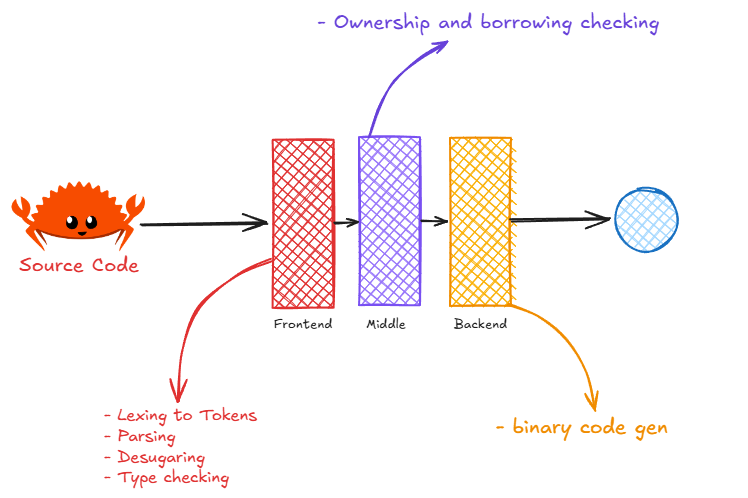
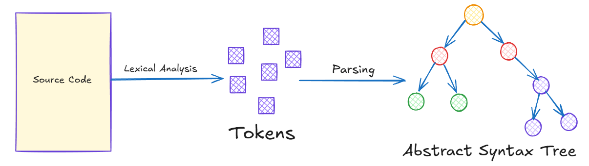
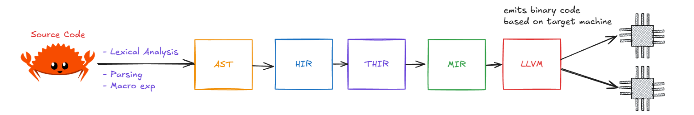
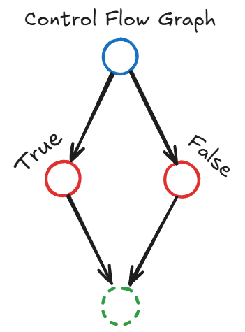

+++
title = "Como o compilador do Rust funciona?"
description = "Uma visão geral do compilador do Rust"
date = 2025-07-21T12:00:00-00:00
tags = ["Rust", "Compiladores", "LLVM", "Memória", "Segurança"]
draft = true
weight = 1
author = "Vitor Lobo Ramos"
+++

O Rust é famoso por ser uma linguagem que evita muitos erros de memória sem precisar de um coletor de lixo rodando em segundo plano. Mas como ele faz isso? O segredo está no compilador, que passa seu código por várias etapas até virar um programa que o computador entende. Neste artigo, explicarei de forma simples cada fase desse processo: desde a leitura do código **[lexing](https://en.wikipedia.org/wiki/Lexical_analysis)**, passando pela análise da estrutura **[parsing](https://en.wikipedia.org/wiki/Parsing)**, até a geração do código final pelo **[LLVM](https://llvm.org/)**. 

Mostrarei como o famoso **[borrow checker](https://doc.rust-lang.org/reference/borrow-checker.html)** (aquele que reclama dos seus empréstimos de variáveis), as representações intermediárias (com nomes esquisitos como [HIR](https://en.wikipedia.org/wiki/High-level_intermediate_representation), [THIR](https://en.wikipedia.org/wiki/Typed_high_level_intermediate_representation) e [MIR](https://en.wikipedia.org/wiki/Mid-level_intermediate_representation)) e as otimizações finais trabalham juntos para impedir problemas como dois lugares mexendo na mesma memória ao mesmo tempo **[data race](https://en.wikipedia.org/wiki/Race_condition)** ou acessar algo que já foi apagado **[use-after-free](https://en.wikipedia.org/wiki/Use-after-free)**. No fim das contas, a arquitetura em camadas do compilador do Rust permite que ele seja rápido como C, mas com muito mais garantias de que seu programa não vai dar pau por causa de bugs difíceis de achar. Tudo isso graças a essas etapas intermediárias e checagens automáticas que acontecem antes mesmo do programa rodar.

Sabe aquelas linguagens que ficam no meio do caminho entre o “super baixo nível” (tipo Assembly) e as linguagens que cuidam de tudo pra você (tipo Java ou C#)? C, Go e Rust são assim. Todas dão bastante controle sobre o que acontece na máquina, mas cada uma tem seu próprio jeito de lidar com a memória: C deixa você mexer em ponteiros à vontade (e se virar com os perigos), Go tem um coletor de lixo que limpa a bagunça automaticamente, e Rust inventou um sistema de “posse e empréstimo” que impede muitos erros antes mesmo do programa rodar.

Quando a gente fala de compilador, normalmente ele é dividido em três partes: **frontend** (a parte que entende o seu código e transforma em uma estrutura de árvore chamada AST), **middle-end** (que faz otimizações que valem pra qualquer computador) e **backend** (que transforma tudo em código de máquina pra rodar no seu PC). O Rust segue esse modelo, mas adiciona umas etapas extras só pra garantir que ninguém vai fazer besteira com a memória.

> Pra explicar tudo isso, usei como base o artigo “Rust Compiler For Dummies” (BAINDLA, 2024), além de livros clássicos de compiladores e a documentação oficial do Rust e do LLVM. O objetivo aqui é mostrar, de um jeito simples, como cada etapa intermediária funciona e como o compilador verifica se está tudo certo, ligando a teoria com o que acontece de verdade na prática.

Quando você manda o Rust compilar seu arquivo `.rs`, a primeira coisa que acontece é que o compilador lê o texto e separa tudo em “palavrinhas” chamadas *tokens* (nomes de variáveis, números, símbolos, etc). Isso é o trabalho do **[analisador léxico](https://en.wikipedia.org/wiki/Lexical_analysis)**. 

Depois, o **[analisador sintático](https://en.wikipedia.org/wiki/Parsing)** pega esses tokens e monta uma árvore chamada **[AST](https://en.wikipedia.org/wiki/Abstract_syntax_tree)** (Árvore de Sintaxe Abstrata), que é tipo um desenho mostrando como as partes do seu código se encaixam — mas sem se preocupar com detalhes bobos como parênteses. Pense na AST como um esqueleto do seu programa, só com o que importa pra entender a lógica (WIKIPEDIA, 2025a).

Nessa etapa, o compilador também já expande as **macros**. Ou seja, se você usou algum “atalho” ou macro, ele já troca pelo código real, pra facilitar as próximas fases. Depois disso, a AST ainda tem comandos de alto nível, tipo o `for`. O compilador então faz um “rebaixamento” **[lowering](https://en.wikipedia.org/wiki/Code_lowering)**: transforma a AST numa versão mais simples chamada **[HIR](https://en.wikipedia.org/wiki/High-level_intermediate_representation)** (High-level IR), que é mais próxima do que a linguagem realmente entende (BAINDLA, 2024). Em seguida, ele faz a análise de tipos e gera a **[THIR](https://en.wikipedia.org/wiki/Typed_high_level_intermediate_representation)** (Typed HIR), onde cada pedacinho do código já tem um tipo definido (int, string, etc).

Antes de seguir, o compilador faz uma checagem de segurança chamada **unsafety**: ele olha a THIR pra garantir que coisas perigosas (tipo mexer direto na memória com ponteiros) só aconteçam dentro de blocos marcados como `unsafe` (RUST REFERENCE, 2025). Assim, ele já barra muita coisa errada antes mesmo de virar código de verdade.

A **[MIR](https://en.wikipedia.org/wiki/Mid-level_intermediate_representation)** converte o programa num **[Grafo de Fluxo de Controle (CFG)](https://en.wikipedia.org/wiki/Control-flow_graph)** explícito. Esse grafo permite ao **[borrow checker](https://doc.rust-lang.org/reference/borrow-checker.html)** rastrear, ao longo de todos os caminhos de execução, o estado de cada valor: possuído, emprestado mutável, emprestado imutável ou movido.

Caso uma violação ocorra (uso de valor após movimento, criação de dados mutáveis e imutáveis simultâneos, etc.), o compilador rejeita o código. Esse mecanismo previne **[data races](https://en.wikipedia.org/wiki/Race_condition)** e **[use‑after‑free](https://en.wikipedia.org/wiki/Use-after-free)** sem custo em tempo de execução.

Após otimizações em MIR (eliminação de código morto, **[inlining](https://en.wikipedia.org/wiki/Inline_function)** local, etc.), a IR é traduzida para **[LLVM IR](https://llvm.org/docs/LangRef.html)**. O LLVM aplica otimizações específicas de arquitetura e, por fim, gera código objeto para a plataforma‑alvo, como x86‑64 ou AArch64. Como consequência, um binário Rust é normalmente específico à arquitetura de destino, a menos que se utilize camadas de emulação.

Beleza, mas por que tanta etapa intermediária? Pense assim: cada IR (representação intermediária) é como um filtro diferente que o compilador usa para checar seu código. Primeiro, a HIR guarda bastante informação para que o compilador possa te dar mensagens de erro detalhadas e entender o contexto do seu programa. Depois, a MIR simplifica tudo, deixando o código mais “quadradinho” e fácil de analisar — é nessa hora que o **[borrow checker](https://doc.rust-lang.org/reference/borrow-checker.html)** entra em ação, garantindo que ninguém vai mexer na memória de um jeito perigoso.

Essa divisão em camadas faz com que cada parte do compilador só precise se preocupar com um tipo de problema por vez. Isso facilita encontrar erros antes mesmo do programa rodar, sem deixar o código final mais lento. E, pra fechar com chave de ouro, o Rust entrega a última etapa (gerar o código de máquina de verdade) pro LLVM, que já é um especialista em otimização e velocidade. Assim, o Rust foca em garantir segurança e o LLVM em deixar tudo rápido.

No fim das contas, o compilador do Rust funciona como uma linha de montagem cheia de inspeções: cada etapa checa uma coisa diferente, pegando vários erros que em outras linguagens só apareceriam quando o programa já estivesse rodando (ou pior, em produção!). Por isso, muita gente acredita que esse modelo de “camadas inteligentes” vai ser cada vez mais comum nas linguagens do futuro, juntando robustez e desempenho sem dor de cabeça.

Por fim, vale destacar: linguagens como C e C++ não adotam esse modelo de múltiplas camadas de checagem automática durante a compilação. Nelas, o compilador faz análises mais simples e deixa a maior parte dos cuidados com memória e segurança por conta do programador. Isso significa que muitos erros perigosos — como acessar memória já liberada, criar *data races* ou sobrescrever dados sem querer — só aparecem quando o programa já está rodando, e às vezes nem são detectados. O Rust, ao contrário, pega esses problemas antes mesmo do código virar um executável, tornando o desenvolvimento mais seguro sem sacrificar desempenho.

---

## REFERÊNCIAS

ABNT. **NBR 6023:2018 — Informação e documentação — Referências — Elaboração**. Rio de Janeiro: ABNT, 2018.

AHO, Alfred V.; LAM, Monica S.; SETHI, Ravi; ULLMAN, Jeffrey D. **Compilers: Principles, Techniques, and Tools**. 2. ed. Boston: Addison‑Wesley, 2007.

BAINDLA, Pranay Raj. **Rust Compiler For Dummies**. 2024. Disponível em: [https://github.com/baindlapranayraj/rektoff](https://github.com/baindlapranayraj/rektoff). Acesso em: 20 jul. 2025.

KLABNIK, Steve; NICHOLS, Carol. **The Rust Programming Language**. 2. ed. Raleigh: No Starch Press, 2023.

LLVM PROJECT. **LLVM Language Reference Manual**. 2025. Disponível em: [https://llvm.org/docs/LangRef.html](https://llvm.org/docs/LangRef.html). Acesso em: 19 jul. 2025.

MATSUMOTO, Bryan. **Memory management strategies in modern systems programming languages**. *Journal of Systems Software*, v. 182, p. 1‑15, 2021.

RUST REFERENCE. **The Rust Reference**. Versão *nightly* de 18 jul. 2025. Disponível em: [https://doc.rust-lang.org/reference/](https://doc.rust-lang.org/reference/). Acesso em: 19 jul. 2025.

WIKIPEDIA. **Abstract syntax tree**. 2025a. Disponível em: [https://en.wikipedia.org/wiki/Abstract\_syntax\_tree](https://en.wikipedia.org/wiki/Abstract_syntax_tree). Acesso em: 18 jul. 2025.

WIKIPEDIA. **Control‑flow graph**. 2025b. Disponível em: [https://en.wikipedia.org/wiki/Control-flow\_graph](https://en.wikipedia.org/wiki/Control-flow_graph). Acesso em: 18 jul. 2025.

---

*(Esta versão textual atende aos critérios de estrutura, citações autor‑data e listagem de referências segundo a ABNT NBR 6023:2018. Ajuste numeração de página, inserção de figuras e demais elementos gráficos no processador de texto antes da submissão.)*
