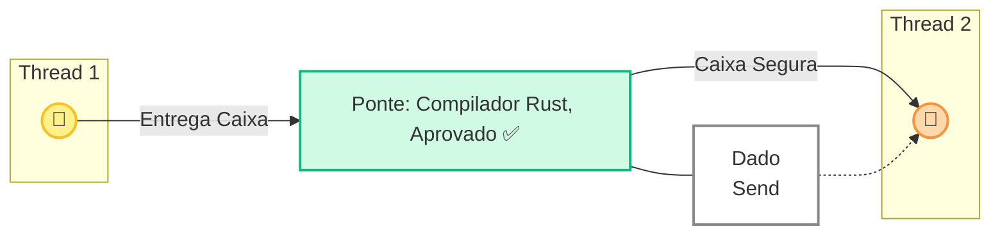
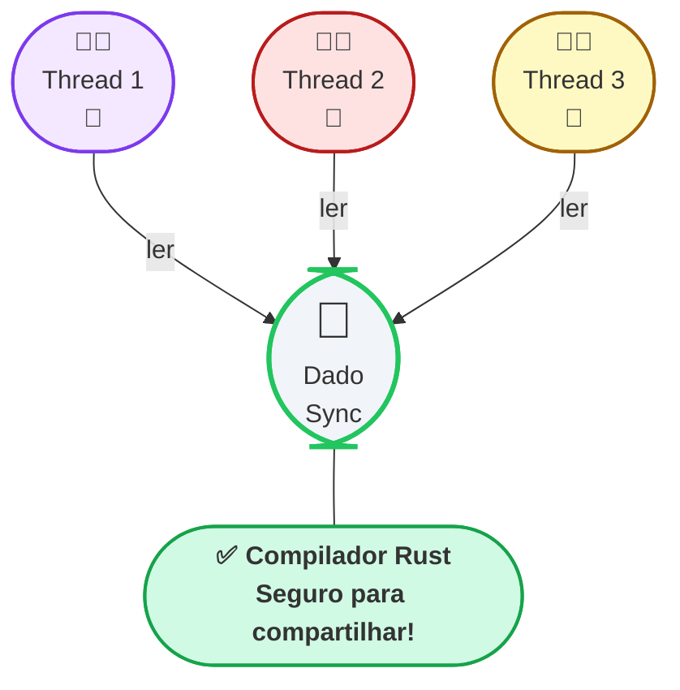
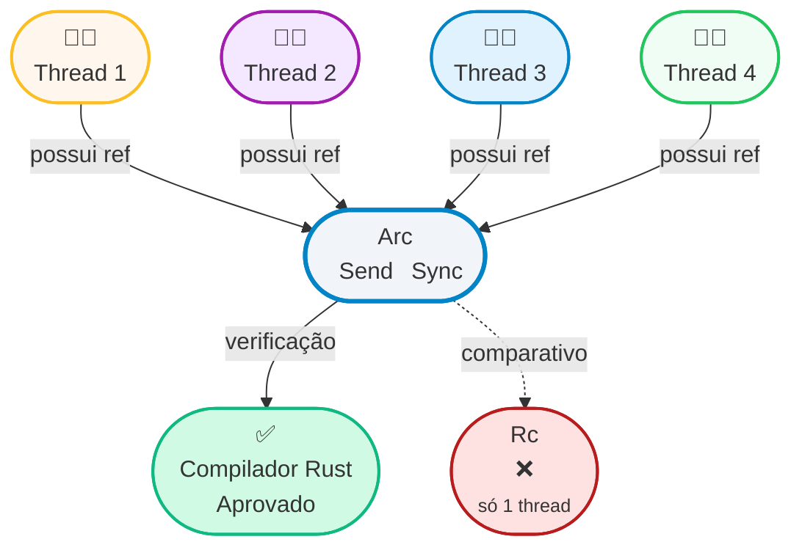
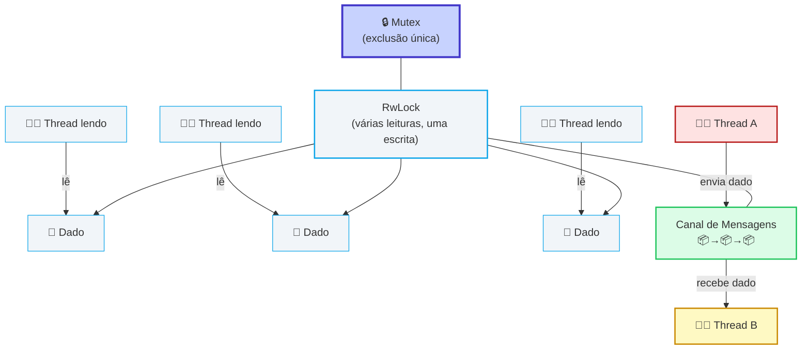
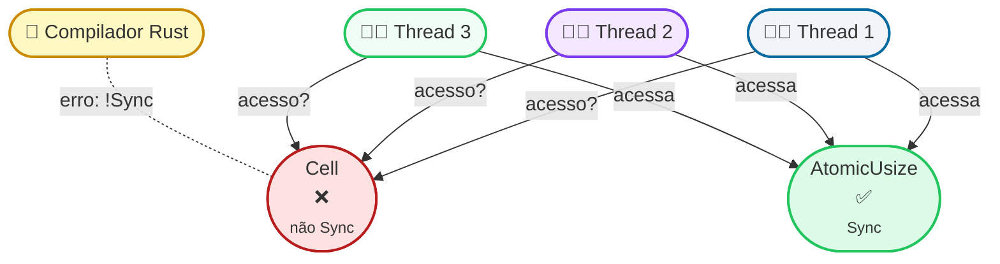
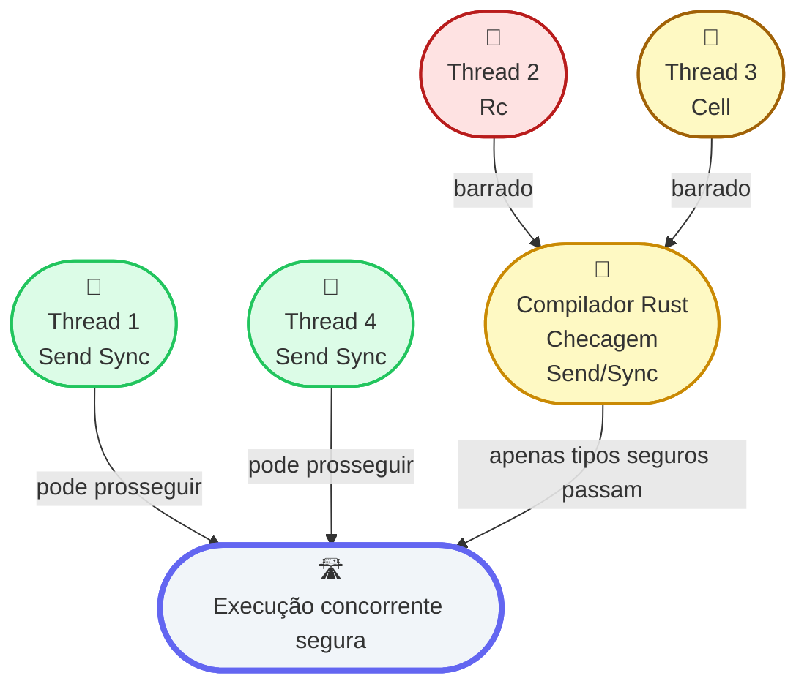
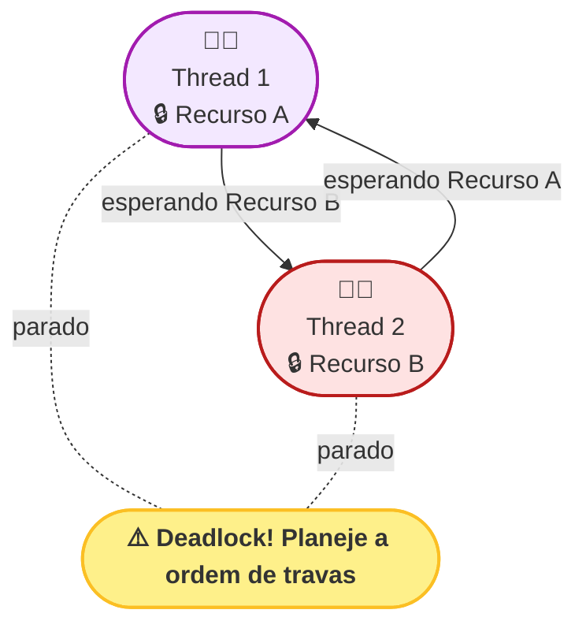

+++
title = "Compreendendo a concorrência em Rust"
description = "Thread safety em Rust não é magia: é matemática"
date = 2025-07-23T12:00:00-00:00
tags = ["Rust", "Concorrência", "Segurança", "Threads", "Async"]
draft = false
weight = 1
author = "Vitor Lobo Ramos"
+++

O Rust costuma ser apresentado como **a linguagem que impede aqueles bugs de memória cabeludos** antes mesmo do seu código rodar. Mas essa história não para no **[borrow checker](https://doc.rust-lang.org/book/ch04-00-understanding-ownership.html#the-borrow-checker)**: ela se estende à concorrência. O pessoal da comunidade fala em **fearless concurrenc** — “concorrência sem medo”. Mas o que isso significa realmente? Como explicar isso para alguém que vem de outras linguagens? Em resumo, Rust transforma muitos erros de concorrência em erros de compilação em vez de runtime, graças ao seu sistema de *ownership* e tipos. Esse aspecto é o que chamamos de **concorrência sem medo**, onde escrever código concorrente não precisa ser uma roleta-russa de bugs sutis.

## 1. Por que concorrência costuma dar ruim?

Um exemplo clássico de problema de concorrência aconteceu no [Linux](https://www.kernel.org/), documentado no [CVE‑2022‑49443](https://bugzilla.redhat.com/show_bug.cgi?id=CVE-2022-49443). Nesse caso, duas partes diferentes do sistema tentaram acessar e modificar a mesma lista na memória ao mesmo tempo, sem nenhum mecanismo de sincronização para coordenar esse acesso. Como resultado, ocorreu um [data race](https://en.wikipedia.org/wiki/Data_race), em que as operações simultâneas causaram inconsistências e corromperam o estado interno da lista. 

O kernel do Linux detectou esse acesso inseguro e emitiu um alerta, mostrando exatamente onde a leitura e a escrita concorrentes aconteceram. Esse tipo de bug é difícil de prever e reproduzir, pois depende do momento exato em que as threads acessam o recurso compartilhado, podendo causar falhas imprevisíveis e difíceis de depurar. Abaixo está o alerta gerado pelo [KCSAN](https://www.kernel.org/doc/html/latest/dev-tools/kcsan.html):

```text
BUG: KCSAN: data-race in do_epoll_wait / do_epoll_wait
write to 0xffff88810480c7d8 ...
    ep_poll fs/eventpoll.c:1806
read to 0xffff88810480c7d8 ...
    list_empty_careful include/linux/list.h:329
```

Para resolver esse tipo de problema, é preciso adicionar mecanismos de sincronização — como se fosse um "sinal vermelho" — para garantir que apenas uma thread por vez possa acessar ou modificar o recurso compartilhado, evitando a bagunça causada por acessos simultâneos. Ferramentas como o **[ThreadSanitizer (TSan)](https://www.chromium.org/developers/testing/threadsanitizer-tsan-v2/)** e o **[KCSAN](https://www.kernel.org/doc/html/latest/dev-tools/kcsan.html)** ajudam a identificar essas [race conditions](https://en.wikipedia.org/wiki/Race_condition) durante os testes, monitorando a execução do programa e apontando exatamente onde ocorreu o acesso inseguro como mostra a imagem abaixo:


No entanto, essas ferramentas só conseguem flagrar o erro se ele realmente acontecer durante os testes; caso contrário, o bug pode passar despercebido e só se manifestar depois que o sistema já estiver em produção, como já ocorreu em projetos conhecidos como [cURL](https://github.com/curl/curl/issues/4915) e [gRPC](https://github.com/grpc/grpc/issues/21729) onde o problema só foi detectado após subir em produção. Em Rust, olha só o que acontece se você tentar rodar esse código que é um exemplo de um [data race](https://en.wikipedia.org/wiki/Data_race):

```rust
use std::{rc::Rc, thread};

fn main() {
    let rc = Rc::new(5);
    thread::spawn(move || println!("{rc}"));
}
```

O compilador já reclama assim:

```
error[E0277]: `Rc<i32>` cannot be sent between threads safely
```

O Rust impede esse tipo de erro já na compilação! Mas vale lembrar: se você recorrer a trechos `unsafe`, a responsabilidade volta para você — e aí, se não tomar cuidado, ainda pode acabar com bugs difíceis, como já aconteceu [evmap](https://github.com/m-ou-se/evmap/issues/1), em que o programa travou por causa de um [data race](https://en.wikipedia.org/wiki/Data_race). Ou seja, mesmo com as ferramentas certas, atenção e boas práticas continuam essenciais. Mas, como o Rust impede esse tipo de erro? como ele sabe que o `Rc<i32>` não é seguro de ser enviado entre threads? Que bruxaria é essa?


## Por baixo do capô: a mágica dos traits `Send` e `Sync`

A segurança de concorrência do Rust vem de regras inteligentes no sistema de tipos, usando **[traits especiais](https://doc.rust-lang.org/book/ch16-03-shared-state.html#using-traits-to-define-shared-state)**. A documentação oficial do Rust explica: *"Cada tipo de dado sabe se pode ser enviado ou compartilhado entre threads com segurança, e o Rust força essas regras. Não há corridas de dados!"*. 

Em outras palavras, o compilador verifica automaticamente, em tempo de compilação, se um tipo pode ou não ser usado por múltiplas threads ao mesmo tempo. Esses verificadores são dois *marker traits* (traits de marcação) chamados `Send` e `Sync`. Eles não têm funções nem implementações ativas em tempo de execução; são apenas etiquetas que dizem ao compilador: "Este tipo é seguro para enviar para outra thread" ou "Este tipo é seguro para compartilhar entre threads".

**`Send`:** Indica que um tipo pode **ser enviado** (transferido em propriedade) de uma thread para outra com segurança. Se um tipo implementa `Send`, você pode movê-lo para outra thread (por exemplo, passando como argumento para `std::thread::spawn`) sem risco de corromper dados. A maior parte dos tipos básicos do Rust é `Send`: números primitivos (`i32`, `f64` etc.), booleanos, *strings* (`String`), vetores (`Vec<T>` se `T` for `Send`), entre outros. Isso equivale a dizer: "Pode levar este dado para outra thread que não vai ter problema – ele é seguro para transferência!".

No diagrama abaixo, ilustramos a verificação do compilador para o trait `Send`. A "Thread 1" quer enviar um dado (caixa) para a "Thread 2". O compilador Rust atua como uma ponte de inspeção: ele confere se o tipo do dado tem o selo `Send`. Se tiver, a transferência é permitida, isto é, a caixa atravessa a ponte e chega à outra thread. Caso contrário, o compilador emite um erro em tempo de compilação e não deixa o programa seguir. No desenho, representamos o dado com a etiqueta `Send` sendo entregue através da ponte (compilador) da Thread 1 para a Thread 2, indicando que a passagem foi aprovada.



No exemplo acima, a Thread 1 (esquerda) está enviando um dado para a Thread 2 (direita). A “ponte” representa o compilador Rust checando o tipo desse dado. Como o dado possui o marcador `Send`, o compilador permite a transferência (indicada pelo símbolo ✅). Se o tipo não fosse `Send`, essa transferência seria barrada com um erro de compilação. 

> Esse mecanismo garante que não existirá *data race* simplesmente por mover dados de uma thread para outra, pois somente tipos seguros (ou seja, que não têm referências não sincronizadas apontando para dados compartilhados) podem ser movidos entre threads.

**`Sync`:** Indica que um tipo pode **ser compartilhado** entre threads através de referências imutáveis de forma segura. Mais formalmente, um tipo `T` é `Sync` se uma referência imutável `&T` pode ser enviada para outra thread (ou seja, `&T` implementa `Send`). Na prática, se vários threads podem acessar simultaneamente o mesmo dado **sem modificar**, esse tipo é `Sync`. 

Tipos primitivos como números e referências imutáveis a qualquer `Send` também são `Sync` naturalmente, já que lê-los simultaneamente não causa condição de corrida. Por exemplo, uma referência imutável (`&String`) de uma string pode ser compartilhada entre threads diferentes para leitura, se `String` for `Sync` (e é, pois você não pode modificá-la através de uma `&String`).

O diagrama a seguir representa visualmente a verificação do trait `Sync`. Temos um dado (representado pela bola com a etiqueta `Sync`) que várias threads tentam acessar ao mesmo tempo para leitura. O compilador Rust, indicado pelo selo verde de "OK seguro para compartilhar", garante que isso só é possível porque o tipo do dado é `Sync`. Assim, Thread 1, Thread 2 e Thread 3 conseguem observar (acessar) o mesmo dado simultaneamente sem conflito, pois todas apenas leem o valor, e o compilador certificou-se de que esse acesso concorrente é seguro.



O `Send` e `Sync` funcionam como etiquetas de segurança verificadas em tempo de compilação. O compilador do Rust age como um fiscal rigoroso: se você tentar transferir para outra thread um tipo que **não** implemente `Send`, ou se tentar compartilhar entre threads um tipo que **não** seja `Sync`, o compilador emitirá um erro de compilação e recusará rodar o programa. 

Por exemplo, se você tentar enviar um ponteiro inteligente `Rc<i32>` (contador de referência não atômico) para outra thread, o Rust vai reclamar com um erro parecido com `E0277`, indicando que aquele tipo não implementa `Send` ou `Sync`. Isso evita, já na compilação, as chamadas **data races** – situação em que duas threads acessam e modificam o mesmo dado simultaneamente, causando corrupção de memória ou resultados imprevisíveis.

Para concretizar, veja o caso do `Rc<T>` abaixo. O tipo `Rc` (Reference Counted) da biblioteca padrão **não** implementa `Send` nem `Sync`. Ele foi projetado apenas para uso em single-thread, pois não utiliza travas ou atomicidade para atualizar seu contador de referências. O diagrama seguinte ilustra o compilador barrando o uso de `Rc<i32>` em contexto multi-thread: o compilador (representado pelo fiscal) detecta um `Rc<i32>` sendo compartilhado e imediatamente levanta uma placa de “proibido”, impedindo a passagem desse valor para outra thread:


Acima, o `Rc<i32>` aparece em vermelho com um "X", indicando que falha nos requisitos de segurança. O compilador Rust exibe uma placa de aviso proibindo enviar esse tipo para outra thread. Essa imagem traduz visualmente a mensagem de erro que o Rust daria nesse caso, reforçando: se um tipo não for seguro para uso concorrente, o Rust nem permite compilar o código que tentasse fazê-lo, garantindo assim a segurança em *tempo de compilação*.

## Quando o `Rc` falha, entra o `Arc`!

Como vimos, `Rc<T>` não pode ser usado entre threads diferentes. Então, o que fazer se você **precisa** compartilhar dados entre várias threads? A resposta do Rust é usar **`Arc<T>`** – que significa *Atomic Reference Counted*. O `Arc` é uma variante do `Rc` projetada para ambientes concorrentes: ele realiza a contagem de referências de forma **atômica**, isto é, usando instruções de hardware que garantem atualização consistente mesmo quando múltiplas threads tentam incrementar ou decrementar o contador ao mesmo tempo. 

> Graças a essa sincronização interna, `Arc<T>` implementa `Send` e `Sync` (desde que o tipo `T` contido também seja seguro para enviar/compartilhar). Em termos simples, você pode imaginar o `Arc` como um `Rc` com colete à prova de balas para threads: ele faz o mesmo trabalho de compartilhar posse de um valor, só que de forma segura em ambientes multi-thread.

**Exemplo de uso:** Suponha que você tinha um `Rc<Algo>` no seu código single-thread e quer portar para multi-thread. Basta trocar para `Arc<Algo>`. Assim, diferentes threads podem possuir clones do `Arc` apontando para o mesmo dado. O compilador, que antes bloqueava o `Rc`, agora vai permitir o `Arc` porque reconhece que ele é thread-safe. Internamente, cada incremento ou decremento no contador de referências do `Arc` é feito atomicamente (isso tem um pequeno custo de desempenho em comparação ao `Rc`, mas garante a segurança). Portanto, use `Arc` somente quando for realmente necessário compartilhar dados entre threads; se o seu código é single-thread ou não precisa dividir posse de dados, prefira `Rc` pelo menor overhead.

No diagrama abaixo, visualizamos o funcionamento seguro do `Arc`. A caixa maior representa um valor protegido por `Arc<T>`, ostentando os selos `Send` e `Sync` (porque `Arc` implementa essas traits quando o conteúdo é apropriado). O compilador Rust (novamente como fiscal) confere e **aprova** o uso do `Arc`, permitindo que várias threads tenham acesso ao dado. 

Cada thread está conectada à caixa por uma espécie de corda, ilustrando que elas compartilham a posse daquele mesmo valor por meio de referências do tipo `Arc<T>`. Em contraste, ao lado, um caixote menor rotulado `Rc` com um "X" vermelho lembra que `Rc` não pode fazer isso – ele serve apenas para uma thread única. A comparação destaca que, em cenário multi-thread, deve-se usar `Arc` no lugar de `Rc`.



No diagrama, vemos claramente que o `Arc<T>` permite múltiplas threads acessando o mesmo dado: cada thread segura uma "corda" ligada à caixa `Arc<T>`, simbolizando um ponteiro compartilhado. O compilador dá o sinal verde (✅) para essa configuração. Já o `Rc` aparece riscado em vermelho ao lado, indicando que ele ficaria de fora numa situação de threads concorrentes. Em suma, quando `Rc` falha por não ser `Send/Sync`, o `Arc` entra como a alternativa segura, embora com um custo de desempenho um pouco maior devido ao uso de operações atômicas para manter a contagem de referências consistente entre threads.

## Outros ajudantes para threads

Além de `Arc`, o Rust oferece várias estruturas na biblioteca padrão para garantir segurança e sincronização ao compartilhar ou trocar dados entre threads. Cada uma serve a propósitos diferentes, e escolher a ferramenta correta ajuda a manter seu código conciso e seguro:

**`Mutex<T>`:** Mutual Exclusion (exclusão mútua). Um `Mutex` é essencialmente um cadeado que protege um dado do tipo `T`. Apenas uma thread por vez pode adquirir o lock (trancar o mutex) e acessar ou modificar o valor dentro do `Mutex`. Enquanto uma thread está com o cadeado, as outras que tentarem acessá-lo vão esperar. Isso previne que duas threads alterem o mesmo dado simultaneamente. 

O `Mutex<T>` implementa `Send` e `Sync` *desde que* `T` seja `Send` – ou seja, você pode enviar um `Mutex` para outra thread ou compartilhar sua referência, contanto que o conteúdo também possa ser enviado com segurança. Quando uma thread termina de usar o dado e libera o cadeado, outra thread pode então adquiri-lo e acessar o dado. Em resumo, é como uma porta com fechadura: só um pode entrar de cada vez.

**`RwLock<T>`:** Leitura/Escrita com bloqueio. É parecido com um `Mutex`, mas mais flexível em termos de acesso concorrente. Um `RwLock` (Read-Write Lock) permite que várias threads adquiram simultaneamente um *lock* de leitura imutável para inspecionar o dado (várias pessoas podem ler um livro ao mesmo tempo, se nenhuma estiver escrevendo nele). Porém, se alguma thread precisar escrever/modificar o valor, ela deve adquirir um *lock* de escrita exclusivo – e enquanto a escrita não terminar, nenhuma outra thread pode acessar (nem para ler nem para escrever). 

> Em termos de thread safety, um `RwLock<T>` é `Sync` (se `T` for `Send`), pois múltiplas threads podem ter referências de leitura simultaneamente com segurança garantida pelo mecanismo de lock interno. Use `RwLock` quando o padrão de acesso for muitas leituras e poucas escritas, pois assim você evita bloquear leitores entre si desnecessariamente.

**Tipos Atômicos (`AtomicBool`, `AtomicUsize`, etc.):** Esses são tipos primitivos especializados que suportam operações atômicas de forma segura entre threads, sem necessidade de um mutex. Por exemplo, um `AtomicUsize` é como um número inteiro cujo incremento, decremento ou comparação são feitas de modo *atômico* (indivisível), garantindo que duas threads não consigam interferir uma na outra nessas operações. Os tipos atômicos implementam `Sync` e `Send` (são projetados para uso thread-safe intrínseco) e costumam ser muito eficientes para casos simples, como contadores, flags booleanas ou índices compartilhados. Porém, eles só funcionam para dados simples (geralmente números ou ponteiros). 

> Pense neles como variáveis globais thread-safe que utilizam instruções de hardware para sincronização. Por exemplo, um `AtomicBool` pode ser usado para um “flag” que várias threads verificam e definem sem precisar de trava.

**Canais de Mensagem (ex: `std::sync::mpsc`):** Em muitos casos, a forma mais fácil e segura de coordenar threads é **não compartilhar** diretamente a posse de dados, mas sim mandar mensagens de uma thread para outra. O módulo `mpsc` (multiple producer, single consumer) fornece canais de comunicação pelo qual você pode **enviar** valores de um thread (produtor) e recebê-los em outro thread (consumidor). 

Pense em um canal como uma esteira transportadora ou uma fila: em vez de duas threads acessarem o mesmo objeto em memória, a thread A envia uma cópia ou propriedade do dado para a thread B processar. Assim, evita-se completamente condições de corrida, já que cada dado só é possuído por uma thread de cada vez (transferido pelo canal). Os canais são excelentes para designs baseados em passagem de mensagens (similar ao modelo do Erlang ou Go) e muitas vezes simplificam a sincronização, pois não requerem locks manuais. O diagrama a seguir ilustra essas diferentes ferramentas de sincronização de forma visual:



Na imagem acima, cada componente ilustra um mecanismo diferente de gerenciar concorrência:

* O **Mutex** (à esquerda) aparece como uma caixa com um cadeado, indicando que o conteúdo está protegido e apenas uma thread por vez pode acessar. Imagine que uma thread tenha a chave do cadeado: enquanto ela estiver usando o recurso dentro do `Mutex`, nenhuma outra entra. Quando termina, ela libera o cadeado para outra thread poder usar.

* O **RwLock** (centro) é mostrado como uma estante de livros onde várias threads (pessoas) leem em paralelo. Isso representa que várias threads podem ter acesso de leitura simultaneamente ao dado. Se alguma delas precisasse escrever, teríamos que “fechar a estante” para todos os leitores e dar acesso exclusivo ao escritor (no diagrama não tem um escritor desenhado, mas essa é a ideia). Só depois de terminar a escrita é que outros leitores podem pegar os livros novamente. Assim funciona o `RwLock`: múltiplos leitores ou um único escritor de cada vez.

* O **Canal** (à direita) é simbolizado por uma esteira transportadora passando caixas da Thread A para a Thread B. Cada caixa seria uma mensagem ou dado sendo transferido. Note que a Thread B recebe a caixa inteira – ou seja, ela agora tem posse daquele dado, e a Thread A não precisa mais acessá-lo. Isso evita compartilhamento simultâneo. Na prática, usar canais é uma forma de **transferir** dados entre threads em vez de compartilhá-los, o que elimina a necessidade de locks e simplifica muito o raciocínio (não tem duas threads brigando pelo mesmo dado, uma entregou para a outra processar).

E os tipos **Atômicos** (`AtomicUsize`, `AtomicBool`, etc.)? Eles não estão ilustrados explicitamente no diagrama, mas podemos imaginar um cenário simples: se quiséssemos representar um contador atômico, poderíamos desenhar um contador cujo valor várias threads podem incrementar sem conflitos. 

> O ponto-chave é que uma operação atômica age como se tivesse um mini-lock invisível embutido em nível de hardware apenas para aquele valor, garantindo que, por exemplo, duas threads incrementando um contador ao mesmo tempo não causem erro (cada incremento será realizado completamente um após o outro, mesmo sem um mutex explícito no código). Por isso, no texto do diagrama mencionamos "Atomic\*" ao lado do Mutex e do RwLock: os tipos atômicos são outra ferramenta na caixa de ferramentas do Rust para garantir segurança, mas aplicados a casos específicos de variáveis simples.

## Mutabilidade interior e o `Sync`

Até agora falamos de acesso concorrente a dados considerando que as referências compartilhadas são imutáveis (exceto quando usamos locks para mutar). Entretanto, o Rust possui tipos especiais que permitem modificar um valor mesmo através de referências imutáveis – é o chamado **interior mutability** (mutabilidade interna). 

Esses tipos usam artifícios como operações não seguras (*unsafe*) ou checagens em tempo de execução para contornar as restrições usualmente impostas pelo sistema de empréstimo do Rust. Exemplos incluem `Cell<T>` e `RefCell<T>`. Embora sejam muito úteis em contextos de single-thread (permitindo mutação onde o compilador normalmente não deixaria, como dentro de um `&T`), eles trazem implicações para o mundo multi-thread.

Em termos de `Send` e `Sync`, a **regra geral** é: se um tipo permite *interior mutability* sem garantir sincronização entre threads, ele **não será `Sync`**. O motivo é claro – se várias threads acessassem simultaneamente um mesmo objeto que pode mudar internamente de forma não sincronizada, teríamos uma condição de corrida. Vamos aos casos comuns:

* **`Cell<T>` e `RefCell<T>`:** não são `Sync`. Você não pode compartilhar referências a um `Cell` ou `RefCell` entre threads ao mesmo tempo, nem mesmo só para leitura, porque internamente eles permitem modificações ou verificações de empréstimo que não são protegidas contra acesso concorrente. O `RefCell` em particular realiza checagens de empréstimo em tempo de execução (panica se violar regras de referência única mutável ou múltiplas imutáveis), mas essas checagens não são implementadas para funcionar com múltiplas threads – são apenas dentro de uma única thread. 

Portanto, o compilador marca esses tipos como não `Sync` exatamente para prevenir que alguém tente compartilhá-los entre threads (seria inseguro). Inclusive, `RefCell` e `Cell` também não implementam `Send` se o tipo contido não for `Copy`, porque mover eles para outra thread poderia quebrar invariantes de empréstimo pendentes.

* **Tipos Atômicos (`AtomicX`):** são `Sync`. Apesar de permitirem mutação interna (você pode alterar o valor atômico através de uma referência compartilhada, já que os métodos deles recebem `&self` em vez de `&mut self`), eles fazem isso de forma segura para threads, utilizando instruções atômicas. Assim, você pode ter múltiplas threads segurando referências ao mesmo `AtomicUsize`, por exemplo, e realizando operações nele concorrentemente, que estará tudo bem – não haverá data race. Por isso, os atômicos implementam `Sync` (e `Send` também).

* **`Mutex<T>` e `RwLock<T>`:** também são `Sync` (desde que `T` seja `Send`). Parece contra-intuitivo à primeira vista, pois tanto o `Mutex` quanto o `RwLock` permitem mudança do valor interno mesmo através de uma referência imutável ao lock (por exemplo, você pode chamar `lock()` em um `&Mutex<T>` e então obter um `&mut T`). Contudo, a diferença é que essa mutação interna está *sincronizada* por mecanismos de lock. 

Ou seja, se duas threads tiverem referências (imutáveis) ao mesmo `Mutex<T>`, quando uma thread entrar no lock, a outra ficará esperando, garantindo exclusão mútua. Assim, o `Mutex` em si pode ser compartilhado entre threads (`Sync`) com segurança, pois evita acesso simultâneo ao interior. O mesmo vale para `RwLock`: várias threads podem compartilhar um `&RwLock<T>`; internamente o lock gerencia quem pode ler ou escrever de cada vez, mantendo a segurança.

O diagrama abaixo exemplifica a diferença de comportamento entre um tipo com mutabilidade interna **não** segura (`Cell`) e um tipo atômico que fornece mutabilidade interna **segura**:



No diagrama, o `Cell<i32>` aparece marcado com um X vermelho e a indicação de que não é `Sync`. As três threads 1, 2 e 3 tentam acessá-lo simultaneamente, mas o compilador (o "guarda" representado) impede isso, gerando um erro em tempo de compilação. Já do lado direito, temos um `AtomicUsize` marcado com ✅ (pois é `Sync`): as três threads conseguem acessá-lo "normalmente" ao mesmo tempo. Essa figura ajuda a fixar que tipos com mutabilidade interna só serão considerados seguros para compartilhamento (`Sync`) se incluírem mecanismos internos de sincronização. Caso contrário, o Rust proíbe seu uso simultâneo entre threads, prevenindo possíveis condições de corrida.

## Dica de ouro

Diante de tantas ferramentas de concorrência, pode surgir a dúvida: **qual usar e quando?** Uma dica de ouro para projetar programas multi-thread em Rust (e em geral) é preferir a solução mais simples que atenda ao seu caso de uso, privilegiando a transferência de dados entre threads em vez de compartilhamento, sempre que possível. Em termos práticos:

* **Prefira usar canais (`mpsc`) para comunicar threads** sempre que isso fizer sentido. Mandar mensagens evita muitos dos problemas de sincronização porque, ao transferir a posse de um dado de uma thread para outra, você não precisa lidar com locks naquele dado específico – a lógica passa a ser "um produtor envia, um consumidor recebe". Muitas vezes dá para estruturar o programa de forma que threads trabalhem em pipeline (cada uma fazendo uma parte do trabalho e passando resultados adiante), o que é naturalmente seguro e fácil de entender.

* Se realmente for necessário que várias threads acessem o **mesmo dado** (por exemplo, um cache compartilhado, um contador global, ou uma configuração global que várias threads leem), escolha a estrutura apropriada:

  * Para **contadores simples ou flags booleanas**, considere usar os tipos **Atômicos**. Eles são leves e muito eficientes para esses propósitos específicos.
  * Para estruturas de dados mais complexas que muitas threads precisam **ler frequentemente e raramente escrever**, um **`RwLock<T>`** pode oferecer melhor desempenho, pois permite múltiplas leituras simultâneas.
  * Para casos em que pode haver necessidade de **escrita frequente ou acesso exclusivo**, um **`Mutex<T>`** simples pode ser mais adequado, garantindo que apenas uma thread por vez modifique ou leia o dado protegido (às vezes um Mutex acaba sendo suficiente e mais simples do que um RwLock, dependendo do padrão de acesso).

* **Evite compartilhar desnecessariamente.** Muitas vezes, duplicar alguns dados para cada thread ou organizar seu programa para minimizar compartilhamento pode eliminar a necessidade de sincronização complexa. Lembre-se: dados que estão confinados a uma única thread não precisam de `Arc` ou `Mutex` – eles podem ser usados livremente. Use mecanismos de compartilhamento apenas quando o design exigir realmente acesso concorrente ao mesmo recurso.

A grande vantagem do Rust é que ele atua como um guardião em tempo de compilação. Se você seguir as regras e usar essas ferramentas, o compilador vai **impedir** que você cometa enganos como esquecer de proteger um dado compartilhado. Por exemplo, se tentar compartilhar um tipo que não seja `Sync` sem proteção, não compila; se tentar enviar um tipo não `Send` para outra thread, não compila. 

Assim, boa parte dos problemas de concorrência são pegos antes mesmo de rodar o programa. O desenvolvedor fica então livre para se concentrar no *design* da sincronização (como dividir tarefas, onde realmente precisa de compartilhamento etc.), e não em caçar *race conditions* na depuração.

Para visualizar essa ideia, o diagrama a seguir mostra uma “estrada” hipotética onde threads trafegam. As threads que carregam apenas dados marcados como `Send`/`Sync` recebem sinal verde do "Guarda (compilador) Rust" e podem prosseguir. Já as threads que tentam carregar algo como um `Rc` ou um `Cell` (que não são seguras para multiplas threads) são barradas pelo compilador – não podem entrar na via de multi-threading. 

Somente após resolver isso (por exemplo, trocando `Rc` por `Arc`, ou removendo o `Cell` ou encapsulando em um `Mutex`) o compilador permitirá o tráfego. Essa metáfora reforça: siga a sinalização (as traits) que o Rust providencia, e você evitará acidentes na estrada da concorrência!



## Cuidado com o `unsafe`

Todas as garantias que discutimos sobre `Send` e `Sync` se aplicam apenas ao código Rust **seguro** (safe). Ou seja, quando você programa sem recorrer a `unsafe`, pode contar que o compilador não vai deixar passar nenhuma violação das regras de thread safety estabelecidas pelos traits. **Porém**, o Rust também permite, em casos necessários, utilizar código marcado como `unsafe` para realizar operações que fogem à verificação normal do compilador. 

Isso inclui implementar manualmente traits como `Send` e `Sync` para seus próprios tipos. Ao fazer isso, você está dizendo ao Rust: "Confie em mim, eu garanto que isto é seguro". A partir desse ponto, a responsabilidade é toda sua – se estiver enganado, as consequências podem ser graves (comportamento indefinido, crashes, corrupção de memória etc.).

Portanto, use `unsafe` com extrema cautela, especialmente no contexto de concorrência. Só deve-se implementar `Send` ou `Sync` manualmente (via `unsafe impl`) se você tiver absoluta certeza do que está fazendo. Um exemplo real foi o caso de uma biblioteca (crate) que fez um `unsafe impl Send` para um tipo que na verdade não era seguro para threads, resultando em travamentos e comportamento incorreto quando usado em cenários concorrentes. 

Esse tipo de erro escapa do compilador porque você essencialmente burlou o guardião. Então, a dica é: confie no sistema de tipos do Rust e nas abstrações fornecidas; evite reinventar a roda com `unsafe` a não ser que seja realmente necessário e, se for, siga rigorosamente as referências do Rustonomicon (guia de coisas perigosas do Rust) para não violar invariantes de segurança.

## O que `Send` e `Sync` **não** evitam

Com `Send` e `Sync`, o Rust resolve de forma robusta o problema de *data races* (duas threads escrevendo/lendo o mesmo dado simultaneamente sem sincronização). No entanto, é importante entender que essas regras não previnem todos os problemas possíveis em programação concorrente. Dois problemas notórios que ainda podem ocorrer são:

* **Deadlocks (impasses):** Isso acontece quando duas ou mais threads ficam bloqueadas esperando umas às outras indefinidamente. Por exemplo, a Thread A adquire o Mutex X e em seguida tenta adquirir o Mutex Y, enquanto simultaneamente a Thread B já tem o Mutex Y e tenta adquirir o Mutex X. Nenhuma das duas libera o que a outra precisa, e assim elas ficam travadas para sempre. 

> O Rust não tem como detectar ou impedir deadlocks automaticamente, porque eles resultam da lógica de travas adquiridas em ordem desfavorável, algo que está além da análise de tipo local. Portanto, mesmo que `Mutex` e `RwLock` lhe protejam de condições de corrida, você deve planejar o uso deles cuidadosamente para evitar deadlocks (por exemplo, seguindo sempre a mesma ordem ao adquirir múltiplos locks, ou usando ferramentas de tempo de execução para detectar deadlocks durante testes).

* **Outras condições de sincronização incorreta:** Por exemplo, *starvation* (quando uma thread nunca consegue tempo de execução porque outras monopolizam recursos), ou ainda erros lógicos na divisão de trabalho (como esquecer de enviar um sinal ou mensagem, deixando outra thread esperando eternamente). Essas questões também não são magicamente resolvidas por `Send`/`Sync` – elas exigem cuidado do desenvolvedor na arquitetura do programa.

O diagrama a seguir ilustra um caso de deadlock simples entre duas threads. Cada thread está segurando um recurso (representado pelo cadeado 🔒) que a outra precisa, e ambas estão esperando pela outra liberar. Nenhuma das duas pode prosseguir, caracterizando o impasse. Colocamos um sinal de alerta para lembrar: mesmo com toda a ajuda do compilador, cabe a nós projetarmos bem a interação entre threads para que situações assim não ocorram.



Em resumo, `Send` e `Sync` nos livram de uma classe enorme de problemas (as condições de corrida de dados), o que já é um alívio enorme para quem lida com múltiplas threads. Mas eles não substituem o bom design de concorrência. Ainda precisamos pensar na coordenação entre threads: qual vai esperar por qual, que recurso deve ser bloqueado primeiro, quando usar um canal em vez de um lock, etc. 

O Rust fornece as ferramentas e garantias de baixo nível, mas o alto nível da lógica concorrente – garantir progresso sem deadlocks, sem starvation e com corretude lógica – fica sob nossa responsabilidade. A boa notícia é que, livre das preocupações com *data races*, podemos focar nesses aspectos de design com muito mais tranquilidade.

O Rust, com seus traits `Send` e `Sync` e suas primitivas de sincronização, praticamente elimina os erros de concorrência mais comuns antes mesmo que seu programa rode. Isso permite escrever código multithreaded eficiente e, principalmente, confiável. Adotar uma mentalidade de "segurança em primeiro lugar" – seguindo as regras do compilador e usando as estruturas adequadas – nos dá a base sólida para então construir lógicas de paralelismo mais complexas de forma controlada. 

> Em outras linguagens, é fácil cair em armadilhas sutis de concorrência; em Rust, o compilador age como um guardião incansável que nos protege do descuido, restando a nós projetar conscientemente a interação entre threads. Com atenção e as abstrações corretas, é possível aproveitar o potencial do paralelismo sem abrir mão da segurança e previsibilidade do software. Boa programação concorrente!


## 2. Ownership além da memória: banindo *data races*

O Rust garante segurança de memória com duas regras fundamentais:

1. Cada valor tem um único dono responsável por sua liberação.
2. Você só pode ter várias referências imutáveis **ou** uma referência mutável exclusiva a um dado — nunca ambos ao mesmo tempo.


O **[borrow checker](https://doc.rust-lang.org/book/ch04-00-understanding-ownership.html#the-borrow-checker)** do compilador fiscaliza essas regras, impedindo que duas partes do mesmo programa modifiquem um valor simultaneamente. Isso já elimina muitos bugs de concorrência dentro de uma única thread.Quando o assunto é multithread, essas mesmas regras continuam valendo, mas o Rust vai além: ele utiliza dois marcadores especiais, chamados de **traits** `Send` e `Sync`, para garantir que apenas tipos seguros possam ser compartilhados ou transferidos entre threads. 


Assim, o compilador consegue detectar em tempo de compilação se um dado pode causar problemas de concorrência, bloqueando usos inseguros antes mesmo do programa rodar.

### `Send` e `Sync` em uma frase

* **`Send`** → “Posso ser **movido** com segurança para outra thread.” (Ou seja, é seguro transferir a posse desse valor para uma outra thread).
* **`Sync`** → “Posso ser **acessado** de múltiplas threads ao mesmo tempo (desde que você só leia ou use sincronização adequada).” Em outras palavras, um tipo `T` é `Sync` se, e somente se, `&T` (referência a ele) for `Send`.

A maioria dos tipos “normais” – números primitivos (`i32`, `f64`...), `String`, `Vec<T>` etc. – implementa `Send` e `Sync` automaticamente. Isso porque eles não guardam *ponteiros brutos* ou outros recursos que poderiam causar condições de corrida por baixo dos panos. O Rust possui uma derivação automática dessas *traits*: se todas as partes internas de um tipo são `Send`, o tipo em si torna-se `Send` (mesma lógica para `Sync`). Assim, praticamente todos os tipos que você usa no dia a dia acabam sendo `Send`/`Sync` sem esforço, exceto algumas **notáveis exceções**:

* Tipos como `std::rc::Rc<T>` **não** implementam `Send`/`Sync`. O `Rc` mantém um contador de referências **não atômico**; usá-lo em duas threads sem proteção causaria atualizações concorrentes nesse contador – algo inseguro. Portanto, `Rc<T>` é deliberadamente marcado como não-thread-safe (nem `Send` nem `Sync`).
* Da mesma forma, `Cell<T>` e `RefCell<T>` (que usam internamente `UnsafeCell`) permitem mutação interior não sincronizada e por isso **não** são `Sync`.
* Ponteiros brutos (`*const T`/`*mut T`) também não são `Send`/`Sync` por si sós, pois o compilador não tem como garantir nada sobre o que eles apontam.


O compilador usa essas *marker traits* para restringir o que pode ser compartilhado ou enviado entre threads. Por exemplo, se você tentar enviar um `Rc<T>` para outra thread, verá um **erro de compilação** informando que `Rc<T>` não implementa `Send`. Considere este código:

```rust
use std::rc::Rc;
use std::thread;

fn main() {
    let rc = Rc::new(5);

    // Erro de compilação: Rc<i32> não é Send
    thread::spawn(move || {
        println!("{}", rc);
    });
}
```

Aqui, o closure da nova thread tenta capturar `rc` (um `Rc<i32>`) por movimento. Como `Rc<i32>` não é `Send`, o Rust se recusa a compilar o programa – em vez de permitir um possível acesso concorrente errado. De fato, o erro é detectado estaticamente: *"`Rc<..>` cannot be sent between threads safely ... trait `Send` is not implemented for `Rc<..>`"*. Ou seja, o Rust previne a situação antes que ela aconteça, em vez de você descobrir o bug durante a execução.


Para compartilhar dados entre threads de forma segura, o Rust oferece alternativas apropriadas. Por exemplo, o tipo `Arc<T>` (Atomic Reference Counted) é uma versão thread-safe de `Rc<T>`, usando contador atômico. Ele implementa `Send` e `Sync`, podendo ser utilizado em múltiplas threads simultaneamente. Se você **precisa compartilhar** um valor entre threads (mesmo que apenas para leitura), use `std::sync::Arc<T>` em vez de `Rc<T>` – o compilador, novamente, força você a fazer a coisa certa.

## 3. Três jeitos de fazer concorrência sem perder o sono

O Rust não impõe um único estilo de concorrência; em vez disso, oferece várias ferramentas de baixo nível para você construir o modelo que preferir. Vamos abordar três abordagens comuns no Rust *moderno* para coordenar computações concorrentes, todas beneficiando-se da segurança garantida pelo compilador.

### 3.1 Threads nativas (`std::thread`)

O modelo mais básico de concorrência é trabalhar com **threads do sistema operacional**. Em Rust, isso é feito via `std::thread`. Você lança uma nova thread chamando `thread::spawn` com um closure que será executado em paralelo. Exemplo simples e seguro:

```rust
use std::thread;

fn main() {
    let v = vec![1, 2, 3];       // Vec<i32> é Send
    let handle = thread::spawn(move || {
        println!("Vector = {:?}", v);
    });
    handle.join().unwrap();
}
```

Acima, criamos um vetor `v` no thread principal e então geramos uma thread filha com `spawn`. Repare no `move ||`: isso faz com que o closure capture `v` por **movimento**, transferindo a posse do vetor para a thread nova. Como `Vec<i32>` implementa `Send` (inteiros são `Send`, então `Vec` de inteiro também é), essa transferência é permitida. Após o `spawn`, a variável `v` **não pode mais ser usada** na thread original – ela foi movida. 

Assim, evitamos qualquer aliasing simultâneo: apenas a thread filha acessa o vetor, garantindo segurança sem necessidade de locks. No final, usamos `handle.join().unwrap()` para esperar a thread terminar antes de encerrar o programa.

### 3.2 Async/Await: O modelo moderno de concorrência

No ecossistema Rust moderno, **async/await** é frequentemente preferido para I/O concorrente. Diferente de threads do SO, async permite ter milhares de tarefas concorrentes executando em um pool limitado de threads através de um executor (como Tokio ou async-std).

```rust
use tokio;

#[tokio::main]
async fn main() {
    let v = vec![1, 2, 3];
    
    // Spawn de uma task async
    let handle = tokio::spawn(async move {
        println!("Vector = {:?}", v);
    });
    
    handle.await.unwrap();
}
```

**O trait `Send` continua sendo crucial em async/await!** Quando você usa um executor multi-thread (como o Tokio por padrão), as futures podem ser movidas entre threads diferentes durante a execução. Isso significa que qualquer dado capturado pela future deve implementar `Send`.

```rust
use tokio;
use std::rc::Rc;

#[tokio::main]
async fn main() {
    let rc = Rc::new(5);
    
    // ERRO: Rc não é Send!
    tokio::spawn(async move {
        println!("{}", rc);
    });
}
```

O compilador barra esse código porque `Rc<T>` não implementa `Send`, e o executor multi-thread pode mover a future para outra thread entre pontos de await.

**Pontos de await são críticos**: Cada `.await` marca onde uma task pode ser suspensa e retomada em uma thread diferente. O Rust exige que dados não-`Send` não atravessem pontos de await em futures que precisam ser `Send`:

```rust
use tokio;
use std::rc::Rc;

async fn problematic_function() {
    let rc = Rc::new(5);
    
    // ERRO: Rc não pode atravessar .await em future Send
    tokio::time::sleep(std::time::Duration::from_secs(1)).await;
    
    println!("{}", rc); // rc não é mais válido aqui!
}
```

Para resolver, use `Arc<T>` em vez de `Rc<T>` quando precisar compartilhar dados em contextos async multi-thread.


> **Dica:** Se você precisa que múltiplas threads **compartilhem leitura** de alguns dados (ao invés de mover a posse para uma única thread), pode usar um `Arc<T>` para encapsular esses dados e então cloná-lo para cada thread. O `Arc` fornece contagem de referência atômica, permitindo referência imutável de múltiplas threads com segurança. Apenas lembre-se: quando qualquer thread precisar *mutar* um valor compartilhado, aí já entramos no próximo tópico (locks).

Em resumo, `thread::spawn` em Rust já garante em tempo de compilação que qualquer dado capturado pelo novo thread seja seguro de acessar lá. Isso ocorre porque a assinatura da função `spawn` exige que o closure (e seu retorno) implementem `Send + 'static` – ou seja, que possam ser movidos para outra thread e que não tenham referências não válidas. 

Esses bounds impedem, por exemplo, que você passe um ponteiro ou referência para algo na stack da thread original (que poderia não existir mais) ou um tipo não thread-safe. O Rust só deixa você enviar para outra thread valores que ele sabe que podem ser usados com segurança lá. Resultado: **se compila, provavelmente está correto** no que tange a uso de memória entre threads.

### 3.3 Passagem de mensagens (`std::sync::mpsc`)

Muitas vezes é **mais simples mandar dados entre threads do que compartilhar estado mutable**. A biblioteca padrão do Rust segue o estilo CSP (comunicação por passagem de mensagem) oferecendo *channels* (canais) multi-produtor, single-consumer (*mpsc*). A ideia é: uma ou mais threads **enviam** mensagens, e uma thread as **recebe** do outro lado. Assim, evitamos compartilhar memória; em vez disso, transferimos a propriedade das mensagens de um lugar para outro.


Um canal é criado com `mpsc::channel()`, que retorna uma dupla `(tx, rx)` – o transmissor e o receptor, respectivamente. Enviar uma mensagem com `tx.send(msg)` **move** a mensagem para dentro do canal (o `msg` sai da posse do sender), e fazer `rx.recv()` do outro lado bloqueia até receber e então **retorna a posse** ao thread receptor. Veja um exemplo:

```rust
use std::sync::mpsc;
use std::thread;

fn main() {
    let (tx, rx) = mpsc::channel();

    thread::spawn(move || {
        tx.send(String::from("Olá, de outra thread!")).unwrap();
    });

    // rx é Drop‑based; a chamada abaixo bloqueia até chegar uma msg
    println!("Recebi: {}", rx.recv().unwrap());
}
```

No código acima, a thread filha envia uma `String` para o canal, e a thread principal espera recebê-la. Note que após fazer `tx.send(val)`, você não pode mais usar `val` na thread emissora – ele foi movido (se tentar, dará erro de uso de valor movido). De fato, se tentássemos usar a variável `val` depois do `send`, o compilador reclamaria: ele sabe que o valor agora pertence a outro thread. Esse mecanismo de transferência de ownership garante que **nenhuma thread fique com um ponteiro “pendurado” para dados que agora estão em posse de outra**. Sem locks, sem necessidade de cópias manuais desnecessárias – e tudo verificado na compilação.

Outra vantagem de canais é a **sincronização implícita**: no exemplo, `rx.recv()` bloqueou a thread principal até que a mensagem chegasse. Isso nos poupa de usar outras primitivas de sincronização para coordenar o momento de leitura. Quando o `tx` é dropado (todas as senders são dropadas), o `rx.recv()` começa a retornar erro, indicando que não haverá mais mensagens.


Em suma, canais promovem um estilo de concorrência onde dados têm **um dono por vez**, saltando de thread em thread. Esse modelo elimina condições de corrida porque, por construção, duas threads nunca acessam o mesmo dado simultaneamente – a posse está sempre com apenas uma (até ser transferida). O Rust ainda checa em tempo de compilação que os tipos das mensagens são `Send` (senão, você nem conseguiria criar o thread ou enviar pelo canal). Isso possibilita **concorrência sem medo** também via passagem de mensagens.

### 3.4 Memória compartilhada com locks (`Mutex`, `RwLock`)

Quando você *realmente* precisa de estado mutável compartilhado entre threads (por exemplo, um contador global sendo incrementado por vários threads), o padrão idiomático é usar um **mutex** (exclusão mútua) para proteger esse dado. Em Rust, os mutexes vivem no módulo `std::sync`. O combo típico é usar `Arc<Mutex<T>>`: um `Arc` para permitir múltiplas owners do mesmo dado, e um `Mutex` para serializar o acesso a ele. Exemplo clássico, incrementando um contador de forma concorrente em 10 threads:

```rust
use std::sync::{Arc, Mutex};
use std::thread;

fn main() {
    let counter = Arc::new(Mutex::new(0));
    let mut handles = vec![];

    for _ in 0..10 {
        let counter = Arc::clone(&counter);
        let h = thread::spawn(move || {
            let mut num = counter.lock().unwrap();
            *num += 1;
        });
        handles.push(h);
    }
    for h in handles {
        h.join().unwrap();
    }

    println!("Resultado = {}", *counter.lock().unwrap());
}
```

Nesse código, `counter` é um `Arc<Mutex<i32>>`. Cada thread clona o `Arc` (incrementando o contador atômico de referência) e, dentro do closure, chama `counter.lock().unwrap()`. O método `lock()` trava o mutex e retorna um **`MutexGuard`** – um guardião que representa a permissão exclusiva de acesso ao dado. Enquanto esse *guard* (aqui chamado `num`) está em scope, ele empresta uma referência mutável para o valor interno (`i32`), permitindo-nos fazer `*num += 1`. 


Nenhuma outra thread consegue travar o mutex nesse meio tempo – se tentasse, ficaria bloqueada até o guard ser liberado. Quando o guard sai de escopo (no fim do closure ou se fosse dropado antes), ele automaticamente libera o lock do mutex. Alguns detalhes importantes:

* `Mutex::lock()` devolve um `Result<MutexGuard<T>, _>`; usamos `.unwrap()` apenas por simplicidade. Em caso de outro thread ter panicado dentro do mutex, você receberia um erro (mutex “envenenado”). Ignorando isso por ora, o ponto é que você obtém um `MutexGuard`. Esse guard implementa `Deref` e `DerefMut` para permitir acesso ao dado protegido (como vimos, podemos usar `*num` para acessar o `i32`).
* O `MutexGuard` também implementa o trait `Drop`. Quando é dropado, ele automaticamente libera o lock. Isso significa que não há risco de esquecermos de chamar `unlock()` – a lib garante o unlock no fim do scope do guard. Esse é o idioma de RAII: aquisição de recurso (lock) e liberação acopladas na própria vida do objeto guard.
* Enquanto um thread estiver com o mutex travado, outros que chamarem `lock()` vão bloquear até poder prosseguir. Assim, garantimos exclusão mútua: só um thread por vez altera (ou lê, se for um Mutex normal) o valor dentro do lock.


Uma variação do mutex é o `RwLock` (lock de leitura/escrita), que permite múltiplos leitores simultâneos ou um único escritor de cada vez. Em casos onde o acesso de leitura é muito mais frequente que escrita, um `RwLock` pode aumentar desempenho permitindo paralelismo nas leituras. O uso em Rust é semelhante (também via `Arc` para compartilhar, e métodos `read()`/`write()` que fornecem guards de leitura ou escrita).

> Um detalhe de implementação: `Mutex<T>` em Rust só implementa `Sync` se `T` também for `Send` (ou `Sync`). Faz sentido – não adiantaria proteger um tipo que em si não pode ser acessado entre threads. Por baixo dos panos, o Rust usa um truque de *interior mutability* seguro: o `Mutex` contém um `UnsafeCell` internamente (permite mutação através de referência imutável, necessária para a implementação), mas como o acesso é protegido pelo lock, isso é “domado”. 

O compilador confia na corretude do `Mutex` porque ele foi escrito usando `unsafe` de forma sound, então marca `Mutex<T>` como `Send + Sync` se possível. Tudo isso para dizer: você pode guardar qualquer coisa que seja Send dentro de um Mutex e compartilhar entre threads via Arc, com garantia de que está protegido.


Resumindo, com `Arc<Mutex<T>>` conseguimos **compartilhar e mutar** um valor `T` entre várias threads de forma segura. O mesmo compilador que impede aliasing mutável em uma thread garante que, se você precisar mutação entre threads, você vai usar as ferramentas certas (como Mutex) para sincronizar. O resultado é um código concorrente **sem *data races***, mesmo usando memória compartilhada. A contrapartida é que problemas de **deadlock** podem acontecer se você não tomar cuidado (mais sobre isso adiante). Mas novamente, o Rust lhe fornece as ferramentas (e até patterns, como RAII) para minimizar esses riscos.

## 4. E o `async`/`await`?

Concorrência não é sinônimo apenas de threads de SO. Rust também suporta **programação assíncrona** usando `async/await` e *executors* (como Tokio, async-std, etc.). Nesse modelo, você pode ter milhares de tarefas concorrentes executando em um número limitado de threads, através de um agendador. A grande sacada: **o mesmo alicerce de segurança vale para tasks assíncronas**. Alguns pontos de engenharia sobre o async em Rust:

* O tipo fundamental é o `Future`. Quando você escreve uma função `async fn`, por baixo dos panos ela retorna um tipo que implementa a trait `Future`. Importante: um `Future` em Rust **pode ou não ser `Send`/`Sync`**, dependendo de seus campos internos. Se todos os dados usados na state machine do futuro forem `Send`, o futuro será marcado automaticamente como `Send`. Se não, não será. Isso significa que você **pode ter futures que não são seguros de enviar para outra thread** – e o Rust vai usar essa informação. Por exemplo, um `Future` que contém um `Rc<T>` capturado em um `.await` *não* será `Send`.
* Um runtime multithread (como o Tokio por padrão) exige que os futures que ele move entre threads sejam `Send`. De fato, se você tentar usar `.spawn()` de Tokio em uma future que não é `Send`, não vai compilar. O compilador verifica no momento em que você tenta mover a futura para outro thread (similar ao `thread::spawn`) e acusa erro se ela não for `Send`. Isso força você, por exemplo, a não segurar referências não thread-safe através de pontos de espera.
* Falando em pontos de espera: cada `.await` marca claramente onde uma tarefa assíncrona pode pausar e eventualmente retomar em outra thread. O Rust impõe que **nenhuma variável capturada que não seja `Send` atravesse um `.await`** se a future precisar ser sendável. Se você tentar manter um `Rc` vivo entre dois awaits e depois mandar a task para o executor multi-thread, será erro de compilação. Esse comportamento evita situações onde uma task poderia suspender segurando, por exemplo, uma referência para algo no stack e retomar em outra thread acessando algo inválido – novamente, o Rust proíbe no compile time.
* Em suma, **futures e tasks Rust também não têm *data races***. Se você conseguir rodar seu código async, ele obedece as mesmas regras: ou só há acesso único/mutável a um dado, ou acessos simultâneos ocorrem somente a dados sincronizados (por exemplo, usando `Arc<Mutex<_>` mesmo dentro de async, se necessário). Não é porque usamos um modelo cooperativo que magicamente escapa das garantias – o Rust estende a lei a esse reino também. Como disse Aaron Turon, *“Thread safety isn't just documentation; it's law.”*. O resultado prático é que você obtém **I/O assíncrono com zero \_data race**\* – tasks podem trocar mensagens, compartilhar Arcs, tudo com a tranquilidade de que se compilar, as condições de corrida de dados foram eliminadas.

Naturalmente, o código async pode interagir com threads nativas. Por exemplo, você pode ter uma tarefa async que dentro usa `spawn_blocking` para delegar trabalho pesado a uma threadpool, ou pode controlar tasks em múltiplos cores. O importante é: **as mesmas regras de `Send`/`Sync` continuam valendo**. 


A combinação de Rust + Tokio consegue atingir concorrência altamente eficiente (evitando custos de thread onde não precisa) sem sacrificar a segurança. Mais uma vez, erros como “ duas tasks acessaram ao mesmo tempo um objeto e corromperam-no” são evitados antes de virar bug.

## 5. Nem tudo são flores: deadlocks e lógica de concorrência

O compilador barra *data races*, mas **não** pode detectar outros problemas clássicos de concorrência, por exemplo:

* **Deadlocks** – quando duas ou mais threads ficam esperando eternamente por locks em ordem invertida. Por exemplo, thread A trava `Mutex A` e em seguida `Mutex B`, enquanto thread B trava `Mutex B` e depois quer `Mutex A`. Nenhuma libera o que a outra precisa, e ambas congelam. O Rust **não** detecta isso em tempo de compilação (problema indecidível em geral). Esses erros ainda podem ocorrer se você não planejar bem seu locking. (Vale notar: isso não viola segurança de memória – é um *liveness bug*, não um *safety bug*. Por isso, Rust permite deadlocks acontecerem, assim como permite leaks de memória, por exemplo.)
* **Starvation** – uma thread ou task fica eternamente sem acesso ao recurso porque outra domina (por exemplo, um mutex que é sempre adquirido rapidamente por outras threads e nunca libera chance para uma certa thread). Também entra na conta do desenvolvedor evitar.
* **Erros de lógica** – aqui entram todas as condições de corrida não relacionadas à memória. Por exemplo, ler valores em ordem errada (mesmo com locks, você pode implementar lógica incorreta), perder mensagens em um sistema de filas, não tratar corretamente a simultaneidade de eventos etc. O compilador não tem como saber se seu protocolo de comunicação entre threads está certo.

Esses continuam sendo problemas difíceis que exigem cuidado de engenharia, testes, design adequado. As dicas clássicas para mitigá-los continuam valendo no mundo Rust:

* Mantenha uma **ordem global de travamento** de recursos. Se sua aplicação tem vários mutexes, defina uma ordem (por exemplo, sempre travar primeiro o de ID menor, depois o de ID maior) e **siga essa ordem consistentemente** em todos os lugares. Isso evita deadlock circular. Essa recomendação é agnóstica de linguagem, mas no Rust é igualmente aplicável (lembre-se: Rust não impede deadlocks!).
* Prefira usar **channels** e passagem de mensagem sempre que possível, em vez de ficar compartilhando estado mutável. Se você consegue modelar o problema com threads isoladas trocando mensagens, você elimina uma grande categoria de problemas – não há deadlock se não há dois locks 😉. Go popularizou esse conceito com o slogan “não compartilhe memória, passe mensagens” (que o Rust também cita).
* Se performance for crítica e você quiser evitar bloqueios, considere usar **primitivas atômicas** ou tentar dividir o trabalho de forma que não precise de lock. O Rust oferece coisas como `std::sync::atomic` (tipos atômicos de inteiros, booleans, etc.) que permitem algumas operações lock-free de forma segura. Porém, use com cautela: embora atômicos individuais não causem *data race*, você ainda pode introduzir *race conditions* lógicas. Além disso, atômicos além de muito simples (como incrementos) podem ficar complexos rapidamente.
* Timeout e *try\_lock*: Ao usar locks, às vezes é saudável programar timeouts ou usar tentativas não bloqueantes (`try_lock`) para evitar esperar para sempre por um recurso que talvez indique um deadlock. Claro, isso não resolve a condição de corrida em si, mas pode tornar o sintoma menos catastrófico (o thread pode detectar que não conseguiu o lock e talvez logar um aviso, etc.).

Resumindo: Rust te blinda dos problemas de **segurança de memória** em concorrência (ou seja, *data races* virando corrupção de dados), mas **não elimina a necessidade de projetar bem a sincronização**. Você continua responsável por garantir que a concorrência faça a coisa certa em termos de lógica e progresso do programa.

## 6. Comparativo rápido

Para colocar em perspectiva, vejamos como Rust se compara a algumas outras linguagens populares quanto à segurança da concorrência:

| Linguagem | *Data race* em código seguro?      | Verificação                                                                  | GC? | Observações                                                                                                                                                                                                          |
| --------- | ---------------------------------- | ---------------------------------------------------------------------------- | --- | -------------------------------------------------------------------------------------------------------------------------------------------------------------------------------------------------------------------- |
| **Rust**  | **Impossível** (em Rust *safe*) 🔒 | 100% em tempo de compilação (via `Send`/`Sync` + borrow checker)             | Não | Zero-cost: sem overhead de runtime; deadlocks ainda são possíveis e precisam de cuidado                                                                                                                              |
| **C/C++** | Possível → **UB** 💣               | Nenhuma verificação estática (precisa de ferramentas como TSAN em runtime)   | Não | Máximo desempenho, porém **qualquer data race invalida o programa**; responsabilidade toda do programador                                                                                                            |
| **Go**    | Possível ⚠️                        | Detectável em runtime com opção `-race` (não obrigatório)                    | Sim | Goroutines + canais incentivam evitar compartilhamento, mas não impedem – data races produzem comportamento indefinido no modelo de memória Go também (embora com consequências limitadas)                           |
| **Java**  | Possível ⚠️                        | Nenhuma verificação estática (depende de `volatile`/`synchronized` corretos) | Sim | Modelo de memória define que data races produzem resultados imprevisíveis; dev deve usar `synchronized` para exclusão mútua. Sem uso correto, condições de corrida ocorrem e são bugs de lógica difíceis de rastrear |

**Legenda:** 🔒 *Data race* proibido pelo compilador; 💣 *Data race* causa comportamento indefinido explosivo; ⚠️ *Data race* possível, mas linguagem/plataforma fornece alguma ajuda (ferramentas ou runtime) para detectar ou mitigar.

> Em Go, por exemplo, se você habilitar o detector de corrida, a runtime pode avisar e até matar o programa se detectar duas goroutines acessando memória compartilhada sem sincronização. Mas se você não usar a flag `-race`, o programa roda e pode produzir resultados incorretos de forma sutil. Já Java opta por um modelo onde data races não quebram a memória completamente como em C++, porém as leituras podem retornar valores desatualizados ou incoerentes. Em ambos os casos, a carga de evitar esses bugs recai sobre o desenvolvedor, enquanto no Rust o compilador não te deixa nem começar algo potencialmente problemático.

## 7. Conclusão

O mesmo compilador que te impede de acessar memória liberada **também** impede duas threads de corromperem o mesmo valor ao mesmo tempo. No Rust, **“se compila, você já eliminou uma classe inteira de bugs”** – e isso sem precisar de *sanitizers* em runtime nem pagar o preço de um coletor de lixo para gerenciar memória compartilhada. A linguagem, através do seu sistema de tipos e ownership, consegue encapsular invariantes matemáticos que garantem segurança em cenários onde, historicamente, era muito fácil errar.

Claro, isso não significa que escrever código concorrente em Rust é **fácil**. Concorrência continua sendo concorrência: você ainda precisa pensar em possíveis interleavings, planejar comunicação entre threads ou tasks, escolher entre usar threads do SO ou async (ou ambas), evitar deadlocks, etc. O que muda drasticamente é o nível de confiança e tranquilidade: aquele medo crônico de *data race* simplesmente desaparece. Você pode focar nos desafios de alto nível (dividir bem o trabalho, evitar condições de disputa lógicas), certo de que o compilador cobre suas costas nos punhos de ferro (ou melhor, punhos de compilação) no que tange a integridade de memória.

Em suma, **concorrência continua difícil, mas não é mais uma roleta-russa**. Com Rust, nós desenvolvedores ganhamos um parceiro que diz “pode ir sem medo que eu garanto que duas threads não vão pisar no mesmo calo de memória”. E essa garantia – *fearless concurrency* – muda completamente o jogo de escrever sistemas paralelos seguros e eficientes.

---

## REFERÊNCIAS

* [The Rust Programming Language (Rust Book) — **Fearless Concurrency**](https://doc.rust-lang.org/book/ch16-00-concurrency.html) – Capítulo do livro oficial do Rust sobre concorrência segura e paradigmas suportados.
* [Rust Reference — **Behavior considered undefined: Data Races**](https://doc.rust-lang.org/reference/behavior-considered-undefined.html#data-races) – Referência formal: *data race* em Rust é considerado *undefined behavior* (por isso é proibido em código seguro).
* [Documentação Rust – **Send e Sync** (std::marker)](https://doc.rust-lang.org/std/marker/index.html) – Explicação das marker traits `Send` e `Sync` na biblioteca padrão (o compilador implementa automaticamente para a maioria dos tipos).
* [Aaron Turon – **Fearless Concurrency in Rust** (Rust Blog, 2015)](https://blog.rust-lang.org/2015/04/10/Fearless-Concurrency.html) – Post no blog oficial introduzindo o slogan *concorrência sem medo* e discutindo como o modelo de ownership do Rust previne bugs comuns.
* [The Rustonomicon – **Sharing & Mutation**](https://doc.rust-lang.org/nomicon/shared-mutatability.html) – Capítulo do “Rustonomicon” detalhando como Rust lida com mutabilidade compartilhada de forma segura, incluindo o papel de `UnsafeCell`, `Send` e `Sync`.
* [Async in Rust – **Pinning and `Send` in Futures**](https://rust-lang.github.io/async-book/03_async_await/01_chapter.html) – Documentação do Async Book enfatizando que futures precisam ser `Send` para uso em executores multi-thread, e como o compilador verifica isso.
* [Go Language Spec – **The Go Memory Model**](https://go.dev/ref/mem) – Documento oficial do Go descrevendo o modelo de memória. Ressalta que data races são erros e que programas sem data race se comportam como se fossem sequenciais (DRF-SC).
* [C++ Core Guidelines – **CP.2: Avoid data races**](https://isocpp.github.io/CppCoreGuidelines/CppCoreGuidelines#Rconc-avoid-data-races) – Guia de melhores práticas de C++: *“Unless you do, nothing is guaranteed to work.”* Discute o perigo extremo de data races em C/C++.
* [2348240 – (CVE-2022-49443) CVE-2022-49443 kernel: list: fix a data-race around ep->rdllist](https://bugzilla.redhat.com/show_bug.cgi?id=CVE-2022-49443) – Bugzilla do Red Hat com relatório de data race no kernel Linux.
* [list: fix a data-race around ep->rdllist - Red Hat Bugzilla](https://bugzilla.redhat.com/show_bug.cgi?id=CVE-2022-49443&utm_source=chatgpt.com) – Bugzilla do Red Hat com relatório de data race no kernel Linux.
* [ThreadSanitizer (TSan) v. 2 - The Chromium Projects](https://www.chromium.org/developers/testing/threadsanitizer-tsan-v2/?utm_source=chatgpt.com) – Documentação do ThreadSanitizer (TSan) v. 2.
* [PDF ThreadSanitizer: data race detection in practice - Google Research](https://research.google.com/pubs/archive/35604.pdf?utm_source=chatgpt.com) – Artigo do Google Research sobre detecção de data races com ThreadSanitizer.
* [tsan: data race in multi.c when shared connection cache · Issue #4915](https://github.com/curl/curl/issues/4915?utm_source=chatgpt.com) – Issue do GitHub com relatório de data race no cURL.
* [Data race in C++ example greeter_async_client2 #21729 - GitHub](https://github.com/grpc/grpc/issues/21729?utm_source=chatgpt.com) – Issue do GitHub com relatório de data race no gRPC.
* [CVE-2021-29952) ThreadSanitizer: data race @ mozilla::layers ...](https://bugzilla.mozilla.org/show_bug.cgi?id=1704227&utm_source=chatgpt.com) – Issue do Bugzilla do Mozilla com relatório de data race no Firefox.
* [Data race in `WriteBufferFromHTTPServerResponse` · Issue #69520 ...](https://github.com/ClickHouse/ClickHouse/issues/69520?utm_source=chatgpt.com) – Issue do GitHub com relatório de data race no ClickHouse.
* [Rust - Why is Rc not Send in the following scenario? - Stack Overflow](https://stackoverflow.com/questions/72987598/rust-why-is-rc-not-send-in-the-following-scenario?utm_source=chatgpt.com)
* [Current implementation is unsound. Segfault and double free are possible with out-of-sync maps from a bad `PartialEq` implementation. · Issue #1 · jonhoo/evmap · GitHub](https://github.com/jonhoo/evmap/issues/1)
