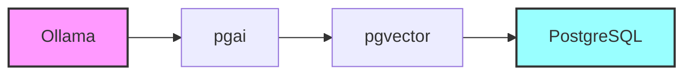

+++
title = "Busca Semântica com Ollama e PostgreSQL"
description = "Implementando busca semântica com PostgreSQL e Ollama"
date = 2025-03-25T12:00:00-00:00
tags = ["RAG", "PostgreSQL", "pgvector", "pgai", "Ollama", "Semantic Search"]
draft = true
weight = 2
author = "Vitor Lobo Ramos"
+++

# Sumário

- **[Introdução](#introdução)**
- **[Entendendo a Arquitetura](#entendendo-a-arquitetura)**
- **[Pré-requisitos](#pré-requisitos)**
- **[Passos para Construir a Busca Semântica](#passos-para-construir-a-busca-semântica)**
   - [1. Habilitando as Extensões](#1-habilitando-as-extensões)
   - [2. Criando a Tabela de Documentos](#2-criando-a-tabela-de-documentos)
   - [3. Inserindo Documentos](#3-inserindo-documentos)
   - [4. Configurando o Vectorizer](#4-configurando-o-vectorizer)
   - [5. Realizando Busca Semântica](#5-realizando-busca-semântica)
- **[Próximos Passos](#próximos-passos)**
- **[Referências](#referências)**

## Introdução

Olá, pessoal! 👋

Em um [artigo anterior](/post/rag/), exploramos como construir um sistema RAG (Retrieval-Augmented Generation) usando [Clojure](https://clojure.org/) e [Ollama](https://ollama.com/) com uma implementação simples de [TF-IDF](/post/tf-idf/). Embora essa abordagem seja excelente para aprender os fundamentos, quando pensamos em soluções de produção, precisamos de algo mais robusto e escalável.

Neste artigo, vamos descobrir como construir um sistema de busca semântica poderoso usando [Ollama](https://ollama.com/), [PostgreSQL](https://www.postgresql.org/) e suas extensões para manipulação de vetores. Esta solução é perfeitamente adequada para aplicações de produção e pode servir como base para sistemas RAG, agentes de IA, assistentes em geral.

A combinação do [PostgreSQL](https://www.postgresql.org/) com extensões como [pgvector](https://github.com/pgvector/pgvector) e [pgai](https://github.com/timescale/pgai), junto com o [Ollama](https://ollama.com/) (que permite executar modelos de linguagem localmente), cria uma solução completa e de alto desempenho para [processamento semântico de dados](https://en.wikipedia.org/wiki/Semantic_search).

## Entendendo a Arquitetura

A busca semântica vai além da simples correspondência de palavras-chave, capturando o significado e o contexto da sua consulta. Em vez de depender apenas de correspondências exatas, ela utiliza [embeddings vetoriais](https://en.wikipedia.org/wiki/Embedding_(machine_learning)) para representar o conteúdo semântico do texto (ou qualquer dado não estruturado). Essa abordagem permite que seu sistema recupere resultados contextualmente relevantes, mesmo quando as palavras-chave exatas não estão presentes.

Por exemplo, se você pesquisar por "melhores lugares para comer", um [sistema de busca semântica](https://en.wikipedia.org/wiki/Semantic_search) pode recuperar documentos sobre "restaurantes bem avaliados nas proximidades" ou "experiências gastronômicas altamente recomendadas", efetivamente capturando sua intenção em vez da formulação exata. A arquitetura para busca semântica com PostgreSQL envolve quatro componentes principais:



- [**Ollama**](https://ollama.com/): Ferramenta open-source que permite executar e gerenciar modelos de linguagem de grande escala (LLMs) e modelos de visão (VLMs) localmente no seu computador ou em um servidor cloud, proporcionando maior privacidade e controle sobre os dados.
- [**pgai**](https://github.com/timescale/pgai): Extensão do PostgreSQL que simplifica o armazenamento e recuperação de dados para RAG e outras aplicações de IA, automatizando a criação e gestão de embeddings, facilitando a busca semântica e permitindo a execução de funções de LLM diretamente dentro de consultas SQL.
- [**pgvector**](https://github.com/pgvector/pgvector): Extensão do PostgreSQL que adiciona suporte para armazenar, indexar e consultar embeddings vetoriais de alta dimensionalidade.
- [**PostgreSQL**](https://www.postgresql.org/): O sistema de banco de dados relacional que serve como fundação robusta e escalável para todo o sistema.

---

## Pré-requisitos

Antes de começar, precisamos garantir que você tenha:

1. **Docker e Docker Compose**: Para configurar o ambiente facilmente
2. **PostgreSQL com pgvector e pgai**: Para armazenar e consultar embeddings
3. **Ollama**: Para gerar embeddings e executar modelos de linguagem

> **NOTA**: Procure na documentação de cada componente para mais detalhes sobre como instalar e configurar cada um deles.

Vamos configurar tudo isso rapidamente usando Docker Compose:

```bash
name: pgai
services:
  db:
    image: timescale/timescaledb-ha:pg17
    environment:
      POSTGRES_PASSWORD: postgres
    ports:
      - "5432:5432"
    volumes:
      - data:/home/postgres/pgdata/data
    command: [ "-c", "ai.ollama_host=http://ollama:11434" ]
  vectorizer-worker:
    image: timescale/pgai-vectorizer-worker:latest
    environment:
      PGAI_VECTORIZER_WORKER_DB_URL: postgres://postgres:postgres@db:5432/postgres
      OLLAMA_HOST: http://ollama:11434
    command: [ "--poll-interval", "5s", "--log-level", "DEBUG" ]
  ollama:
    image: ollama/ollama
volumes:
  data:
```

Basicamente, o que fazemos é criar um ambiente com um banco de dados PostgreSQL, o vectorizer e o ollama. Agora basta colocar o conteúdo do arquivo acima no arquivo `docker-compose.yml` e rodar o comando `docker compose up -d` para iniciar o ambiente. Em seguida, baixamos o modelo de embeddings que vamos usar:

```bash	
docker compose exec ollama ollama pull nomic-embed-text
```

Este setup configura um banco de dados PostgreSQL com as extensões [pgai](https://github.com/timescale/pgai), [pgvector](https://github.com/pgvector/pgvector) e [pgvectorscale](https://github.com/timescale/pgvectorscale). Também configura o Ollama, que você pode usar para implantar LLMs e modelos de embedding.

## Passos para Construir a Busca Semântica

Os passos para implementar a busca semântica no PostgreSQL são relativamente simples. Primeiro, vamos habilitar as extensões necessárias, criar uma tabela para armazenar nossos documentos, configurar o [vectorizer](https://github.com/timescale/pgai/tree/main/vectorizer) para gerar [embeddings](https://en.wikipedia.org/wiki/Embedding_(machine_learning)) automaticamente e, finalmente, realizar consultas semânticas.

### 1. Habilitando as Extensões

Primeiro, precisamos habilitar as extensões necessárias no PostgreSQL:

```sql
CREATE EXTENSION IF NOT EXISTS vector CASCADE; 
CREATE EXTENSION IF NOT EXISTS ai CASCADE;
```

### 2. Criando a Tabela de Documentos

Agora, vamos criar uma tabela para armazenar os documentos que queremos pesquisar:

```sql
CREATE TABLE IF NOT EXISTS documentos (
   id SERIAL PRIMARY KEY,
   titulo TEXT NOT NULL,
   conteudo TEXT,
   categoria TEXT,
   data_criacao TIMESTAMP DEFAULT CURRENT_TIMESTAMP
);
```

Neste exemplo, criamos uma tabela chamada `documentos` com quatro colunas: `id`, `titulo`, `conteudo` e `categoria`. É importante notar que a coluna `id` é a chave primária da tabela. Outro ponto importante é que a coluna `data_criacao` é uma coluna de metadados que é gerada automaticamente pelo PostgreSQL.

### 3. Inserindo Documentos

Podemos inserir documentos manualmente ou usar a função `ai.load_dataset` do [pgai](https://github.com/timescale/pgai) para carregar dados diretamente do [Hugging Face](https://huggingface.co/):

```sql
SELECT ai.load_dataset(
   name => 'Cohere/movies',
   table_name => 'documentos',
   if_table_exists => 'append',
   field_types => '{"title": "titulo", "overview": "conteudo", "genres": "categoria"}'::jsonb
);
```

Alternativamente, podemos inserir registros manualmente:

```sql
INSERT INTO documentos (titulo, conteudo, categoria) VALUES 
('Guia Clojure', 'Clojure é uma linguagem funcional moderna...', 'Programação'),
('Tutorial RAG', 'Sistemas RAG combinam busca e geração...', 'IA'),
('PostgreSQL Avançado', 'Técnicas de otimização para PostgreSQL...', 'Banco de Dados');
```

> **NOTA**: O [Hugging Face](https://huggingface.co/) é uma plataforma de dados e modelos de IA.

Agora vamos configurar o vectorizer para gerar embeddings automaticamente.

### 4. Configurando o Vectorizer

O [pgai](https://github.com/timescale/pgai) inclui uma ferramenta chamada [vectorizer](https://github.com/timescale/pgai/tree/main/vectorizer) que automatiza a criação e sincronização de embeddings. Esta é uma das funcionalidades mais poderosas desta solução, pois elimina a necessidade de ferramentas externas para criar [embeddings](https://en.wikipedia.org/wiki/Embedding_(machine_learning)). Vamos configurá-la:

```sql
SELECT ai.create_vectorizer(
   'public.documentos'::regclass,
   destination => 'documentos_embeddings',
   embedding => ai.embedding_ollama('nomic-embed-text', 768),
   chunking => ai.chunking_recursive_character_text_splitter('conteudo')
);
```

Basicamente, o comando acima faz o seguinte:

1. Cria uma tabela `documentos_embeddings` para armazenar os vetores
2. Configura o modelo `nomic-embed-text` via Ollama para gerar embeddings
3. Define uma estratégia de chunking para dividir textos longos
4. Cria automaticamente uma view `documentos_embeddings_vectorized` que junta os documentos com seus embeddings

O [vectorizer](https://github.com/timescale/pgai/tree/main/vectorizer) também cuida da sincronização automática dos embeddings quando documentos são inseridos, atualizados ou removidos - sem necessidade de código adicional! Isto simplifica enormemente a manutenção do sistema.

### 5. Realizando Busca Semântica

Agora estamos prontos para realizar buscas semânticas. Usaremos a função `ai.ollama_embed` para gerar embeddings para nossa consulta e o operador de distância de cosseno (`<=>`) para encontrar documentos similares:

```sql
WITH query_embedding AS (
    -- Gerar embedding para a consulta
    SELECT ai.ollama_embed('nomic-embed-text', 'Como implementar RAG em sistemas modernos', 
                          host => 'http://ollama:11434') AS embedding
)
SELECT
    d.titulo,
    d.conteudo,
    d.categoria,
    t.embedding <=> (SELECT embedding FROM query_embedding) AS distancia
FROM documentos_embeddings t
LEFT JOIN documentos d ON t.id = d.id
ORDER BY distancia
LIMIT 5;
```

Este código SQL realiza uma [busca semântica](https://en.wikipedia.org/wiki/Semantic_search) em nossa base de documentos utilizando [embeddings](https://en.wikipedia.org/wiki/Embedding_(machine_learning)) gerados pelo modelo `nomic-embed-text` através do [Ollama](https://ollama.com/). Primeiro, criamos uma CTE (Common Table Expression) chamada `query_embedding` que gera o embedding para nossa consulta "Como implementar RAG em sistemas modernos". Em seguida, selecionamos os documentos mais relevantes comparando este embedding de consulta com os embeddings armazenados na tabela `documentos_embeddings` usando o operador de distância de cosseno (`<=>`).

O resultado é uma lista ordenada dos documentos mais semanticamente similares à nossa consulta, independentemente de compartilharem as mesmas palavras exatas. Esta é a essência da busca semântica - encontrar conteúdo conceitualmente relacionado, não apenas correspondências de palavras-chave. A coluna `distancia` nos mostra quão próximo cada documento está da nossa consulta, com valores menores indicando maior similaridade. Limitamos os resultados aos 5 documentos mais relevantes, mas este número pode ser ajustado conforme necessário. O PostgreSQL oferece três operadores para cálculo de similaridade:

- `<->`: [Distância L2 (Euclidiana)](https://en.wikipedia.org/wiki/Euclidean_distance)
- `<#>`: [Produto interno](https://en.wikipedia.org/wiki/Dot_product)
- `<=>`: [Distância de cosseno](https://en.wikipedia.org/wiki/Cosine_distance) (geralmente a melhor opção)

E pronto! Com apenas esses poucos passos, temos um sistema de busca semântica totalmente funcional, diretamente no PostgreSQL. **[Para quem acompanhou o artigo anterior sobre a implementação de RAG em Clojure](/post/rag/)**, vale a pena comparar as duas abordagens:

A diferença entre as duas abordagens é bem clara quando olhamos lado a lado. [No artigo anterior sobre RAG em Clojure](/post/rag/), usamos uma técnica mais simples [(TF-IDF)](/post/tf-idf/) que funciona bem para projetos pequenos e didáticos. É como usar uma bicicleta para se locomover para distâncias curtas. O código em Clojure mantém tudo em memória, o que é ótimo para aprender os conceitos, mas começa a dar problema quando a quantidade de documentos cresce.

Já a abordagem com PostgreSQL + pgai é como trocar a bicicleta por um carro esportivo! Estamos usando embeddings densos gerados por LLMs, que capturam muito melhor o significado semântico dos textos. O PostgreSQL cuida de toda a parte chata de persistência e indexação, permitindo que você escale para milhões de documentos sem suar. Os índices especializados para vetores (como HNSW) fazem buscas em bilhões de embeddings parecerem instantâneas, algo que nossa implementação anterior jamais conseguiria.

O mais legal é que a manutenção fica muito mais simples. Com o [vectorizer do pgai](https://github.com/timescale/pgai/tree/main/vectorizer), você só precisa inserir documentos no banco normalmente, e ele cuida automaticamente de gerar e atualizar os embeddings. 


---

## Integração com Clojure

O objetivo deste artigo é mostrar como é fácil construir um sistema de busca semântica usando PostgreSQL e pgai. No entanto, é mostrar também como podemos evoluir à proposta anterior e construir um sistema de busca semântica mais robusto e escalável usando PostgreSQL e pgai e Clojure.

```clojure
;; src/docai/pg.clj
(ns docai.pg
  (:require [next.jdbc :as jdbc]
            [clojure.data.json :as json]))

(def db-spec
  {:dbtype "postgresql"
   :dbname "postgres"
   :host "localhost"
   :user "postgres"
   :password "password"})

(defn query-semantic-search
  "Realiza busca semântica via PostgreSQL"
  [query limit]
  (let [conn (jdbc/get-connection db-spec)
        sql (str "WITH query_embedding AS ("
                 "  SELECT ai.ollama_embed('nomic-embed-text', ?, host => 'http://ollama:11434') AS embedding"
                 ")"
                 "SELECT"
                 "  d.titulo,"
                 "  d.conteudo,"
                 "  d.categoria,"
                 "  t.embedding <=> (SELECT embedding FROM query_embedding) AS distancia"
                 " FROM documentos_embeddings t"
                 " LEFT JOIN documentos d ON t.id = d.id"
                 " ORDER BY distancia"
                 " LIMIT ?")
        results (jdbc/execute! conn [sql query limit])]
    results))
```

> **NOTA**: O código acima é um exemplo de como integrar a busca semântica no PostgreSQL com uma aplicação Clojure. O código completo está disponível no [https://github.com/scovl/docai](https://github.com/scovl/docai).

A abordagem com PostgreSQL oferece uma solução robusta e escalável para busca semântica, eliminando a necessidade de ferramentas especializadas. A combinação com Ollama permite execução local de modelos, garantindo privacidade e controle sobre os dados. 

Enquanto nossa implementação inicial em Clojure ofereceu uma base educativa para entender os conceitos de RAG, a abordagem com PostgreSQL fornece um caminho claro para sistemas de produção. O melhor de tudo é que você pode começar em apenas 10 minutos!

---

## Referências

- [Documentação do pgvector](https://github.com/pgvector/pgvector) - Extensão do PostgreSQL para armazenar, indexar e consultar embeddings vetoriais de alta dimensionalidade.
- [Documentação do pgai](https://github.com/timescale/pgai) - Extensão do PostgreSQL que simplifica o armazenamento e recuperação de dados para RAG e outras aplicações de IA.
- [Embeddings Eficientes com PostgreSQL](https://supabase.com/blog/openai-embeddings-postgres-vector) - Artigo sobre como usar embeddings com PostgreSQL.
- [HNSW vs. IVFFlat para Busca de Similaridade](https://www.pinecone.io/learn/hnsw-ivfflat/) - Artigo sobre as diferenças entre HNSW e IVFFlat para busca de similaridade.
- [Ollama - Rodando LLMs localmente](https://ollama.com/) - Documentação do Ollama, uma ferramenta open-source para executar modelos de linguagem de grande escala localmente.
- [Artigo anterior sobre RAG com Clojure](/post/rag/) - Artigo sobre como implementar RAG com Clojure.