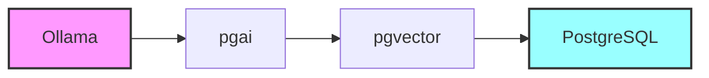
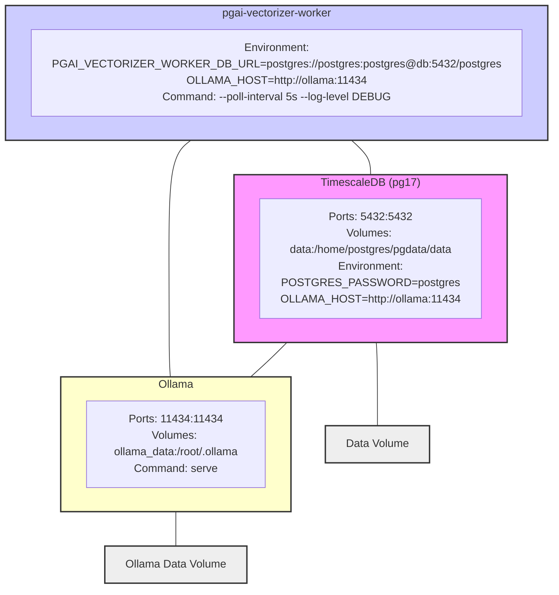

+++
title = "Busca Semântica com Ollama e PostgreSQL"
description = "Implementando busca semântica com PostgreSQL e Ollama"
date = 2025-03-25T12:00:00-00:00
tags = ["RAG", "PostgreSQL", "pgvector", "pgai", "Ollama", "Semantic Search"]
draft = false
weight = 2
author = "Vitor Lobo Ramos"
+++

Olá, pessoal! 👋

No [artigo anterior](/post/rag/), exploramos como construir um sistema RAG (Retrieval-Augmented Generation) usando [Clojure](https://clojure.org/) e [Ollama](https://ollama.com/) com uma implementação simples de [TF-IDF](/post/tf-idf/). Embora essa abordagem seja excelente para aprender os fundamentos, quando pensamos em soluções de produção, precisamos de algo mais robusto e escalável.

Neste artigo, vamos descobrir como construir um sistema de busca semântica poderoso usando [Ollama](https://ollama.com/), [PostgreSQL](https://www.postgresql.org/) e suas extensões para manipulação de vetores. Esta solução é perfeitamente adequada para aplicações de produção e pode servir como base para sistemas RAG, agentes de IA, assistentes em geral. Diferentemente do artigo anterior, vamos usar o [Ollama](https://ollama.com/) via Docker assim como o [PostgreSQL](https://www.postgresql.org/) e as extensões [pgvector](https://github.com/pgvector/pgvector) e [pgai](https://github.com/timescale/pgai).

A combinação do [PostgreSQL](https://www.postgresql.org/) com extensões como [pgvector](https://github.com/pgvector/pgvector) e [pgai](https://github.com/timescale/pgai), junto com o [Ollama](https://ollama.com/) (que permite executar modelos de linguagem localmente), cria uma solução completa e de alto desempenho para [processamento semântico de dados](https://en.wikipedia.org/wiki/Semantic_search).

## Entendendo a Arquitetura

A busca semântica vai além da simples correspondência de palavras-chave, capturando o significado e o contexto da sua consulta. Em vez de depender apenas de correspondências exatas, ela utiliza [embeddings vetoriais](https://en.wikipedia.org/wiki/Embedding_(machine_learning)) para representar o conteúdo semântico do texto (ou qualquer dado não estruturado). Essa abordagem permite que seu sistema recupere resultados contextualmente relevantes, mesmo quando as palavras-chave exatas não estão presentes.

Por exemplo, se você pesquisar por "melhores lugares para comer", um [sistema de busca semântica](https://en.wikipedia.org/wiki/Semantic_search) pode recuperar documentos sobre "restaurantes bem avaliados nas proximidades" ou "experiências gastronômicas altamente recomendadas", efetivamente capturando sua intenção em vez da formulação exata. A arquitetura para busca semântica com PostgreSQL envolve quatro componentes principais:



- [**Ollama**](https://ollama.com/): Ferramenta open-source que permite executar e gerenciar modelos de linguagem de grande escala (LLMs) e modelos de visão (VLMs) localmente no seu computador ou em um servidor cloud, proporcionando maior privacidade e controle sobre os dados.
- [**pgai**](https://github.com/timescale/pgai): Extensão do PostgreSQL que simplifica o armazenamento e recuperação de dados para RAG e outras aplicações de IA, automatizando a criação e gestão de embeddings, facilitando a busca semântica e permitindo a execução de funções de LLM diretamente dentro de consultas SQL.
- [**pgvector**](https://github.com/pgvector/pgvector): Extensão do PostgreSQL que adiciona suporte para armazenar, indexar e consultar embeddings vetoriais de alta dimensionalidade.
- [**PostgreSQL**](https://www.postgresql.org/): O sistema de banco de dados relacional que serve como fundação robusta e escalável para todo o sistema.

---

## Pré-requisitos

Antes de começar, precisamos garantir que você tenha:

1. **Docker e Docker Compose**: Para configurar o ambiente facilmente
2. **PostgreSQL com pgvector e pgai**: Para armazenar e consultar embeddings

> **NOTA**: No artigo anterior sobre [RAG em Clojure](/post/rag/), usamos o [Ollama](https://ollama.com/) com [DeepSeek R1](https://ollama.com/models/deepseek-r1) baixando o projeto ollama diretamente na máquina. Nesta abordagem, vamos usar o Ollama via Docker. Portanto, recomendo que você feche o Ollama para usar-mos ele inteiramente via Docker aqui nesta abordagem (é necessário fechar para não conflitar com o endpoint do Ollama que vamos usar no Docker Compose).

Vamos configurar tudo isso rapidamente usando Docker Compose:

```bash
name: pgai
services:
  db:
    image: timescale/timescaledb-ha:pg17
    environment:
      POSTGRES_PASSWORD: postgres
      # Definir variáveis de ambiente para o host do Ollama
      OLLAMA_HOST: http://ollama:11434
    ports:
      - "5432:5432"
    volumes:
      - data:/home/postgres/pgdata/data
    # Não use a extensão ai até garantir que está instalada corretamente
    command: "-c search_path=public"
    depends_on:
      - ollama
    # Adicionar links explícitos para o serviço Ollama
    links:
      - ollama

  vectorizer-worker:
    image: timescale/pgai-vectorizer-worker:latest
    environment:
      PGAI_VECTORIZER_WORKER_DB_URL: postgres://postgres:postgres@db:5432/postgres
      OLLAMA_HOST: http://ollama:11434
    command: [ "--poll-interval", "5s", "--log-level", "DEBUG" ]
    depends_on:
      - db
      - ollama
    links:
      - ollama

  ollama:
    image: ollama/ollama
    ports:
      - "11434:11434"
    volumes:
      - ollama_data:/root/.ollama
    # Comando direto para iniciar o Ollama
    command: serve

volumes:
  data:
  ollama_data: 
```

O arquivo `docker-compose.yml` acima configura uma infraestrutura para busca semântica com três serviços interconectados. O serviço `db` utiliza o [TimescaleDB](https://www.timescale.com/) (que nada mais é que uma versão do [PostgreSQL](https://www.postgresql.org/) especializada para otimização de desempenho para dados de séries temporais) com a versão 17, configurando credenciais, mapeamento de portas e um volume persistente para armazenar os dados. Este serviço é configurado para se comunicar com o Ollama através de variáveis de ambiente e links explícitos, garantindo que a comunicação entre os contêineres funcione corretamente.



O diagrama acima ilustra a arquitetura do sistema de busca semântica com PostgreSQL. No centro, temos três componentes principais: o TimescaleDB (uma versão especializada do PostgreSQL), o pgai-vectorizer-worker (responsável por processar e vetorizar os textos) e o Ollama (que fornece os modelos de IA). As conexões entre os serviços mostram como eles se comunicam: o vectorizer-worker se conecta tanto ao banco de dados quanto ao Ollama para realizar seu trabalho de transformação de textos em vetores. 

Os volumes persistentes (representados em cinza) garantem que tanto os dados do PostgreSQL quanto os modelos do Ollama sejam preservados entre reinicializações. Esta arquitetura modular permite escalar cada componente independentemente conforme necessário, enquanto mantém um fluxo de dados eficiente para operações de busca semântica.


O serviço `vectorizer-worker` é um componente especializado do [pgai](https://github.com/timescale/pgai) que monitora o banco de dados a cada 5 segundos, processando automaticamente textos para transformá-los em embeddings vetoriais. Ele se conecta ao banco [PostgreSQL](https://www.postgresql.org/) e ao serviço [Ollama](https://ollama.com/) para realizar a vetorização dos textos, funcionando como uma ponte entre o armazenamento de dados e o modelo de IA, com logs detalhados para facilitar a depuração durante o desenvolvimento.

Por fim, o serviço `ollama` fornece a infraestrutura para executar modelos de IA localmente, expondo uma API REST na porta 11434 e armazenando os modelos baixados em um volume persistente. Este design de três camadas (banco de dados, processador de vetores e motor de IA) cria um sistema completo para busca semântica que pode ser iniciado com um simples `docker compose up -d`, seguido pelo download do modelo de [embeddings](https://en.wikipedia.org/wiki/Embedding_(machine_learning)) que transformará os textos em vetores.

```bash	
docker compose exec ollama ollama pull nomic-embed-text
```

Este setup configura um banco de dados PostgreSQL com as extensões [pgai](https://github.com/timescale/pgai), [pgvector](https://github.com/pgvector/pgvector) e [pgvectorscale](https://github.com/timescale/pgvectorscale). Também configura o Ollama, que você pode usar para implantar LLMs e modelos de embedding.

---

## Passos para Construir a Busca Semântica

Os passos para implementar a busca semântica no PostgreSQL são relativamente simples. Primeiro, vamos habilitar as extensões necessárias, criar uma tabela para armazenar nossos documentos, configurar o [vectorizer](https://github.com/timescale/pgai/tree/main/vectorizer) para gerar [embeddings](https://en.wikipedia.org/wiki/Embedding_(machine_learning)) automaticamente e, finalmente, realizar consultas semânticas.

### 1. Habilitando as Extensões

Primeiro, precisamos habilitar as extensões necessárias no PostgreSQL:

```sql
CREATE EXTENSION IF NOT EXISTS vector CASCADE; 
CREATE EXTENSION IF NOT EXISTS ai CASCADE;
```

### 2. Criando a Tabela de Documentos

Agora, vamos criar uma tabela para armazenar os documentos que queremos pesquisar:

```sql
CREATE TABLE IF NOT EXISTS documentos (
   id SERIAL PRIMARY KEY,
   titulo TEXT NOT NULL,
   conteudo TEXT,
   categoria TEXT,
   data_criacao TIMESTAMP DEFAULT CURRENT_TIMESTAMP
);
```

Neste exemplo, criamos uma tabela chamada `documentos` com quatro colunas: `id`, `titulo`, `conteudo` e `categoria`. É importante notar que a coluna `id` é a chave primária da tabela. Outro ponto importante é que a coluna `data_criacao` é uma coluna de metadados que é gerada automaticamente pelo PostgreSQL.

### 3. Inserindo Documentos

Podemos inserir documentos manualmente ou usar a função `ai.load_dataset` do [pgai](https://github.com/timescale/pgai) para carregar dados diretamente do [Hugging Face](https://huggingface.co/):

```sql
SELECT ai.load_dataset(
   name => 'Cohere/movies',
   table_name => 'documentos',
   if_table_exists => 'append',
   field_types => '{"title": "titulo", "overview": "conteudo", "genres": "categoria"}'::jsonb
);
```

Alternativamente, podemos inserir registros manualmente:

```sql
INSERT INTO documentos (titulo, conteudo, categoria) VALUES 
('Guia Clojure', 'Clojure é uma linguagem funcional moderna...', 'Programação'),
('Tutorial RAG', 'Sistemas RAG combinam busca e geração...', 'IA'),
('PostgreSQL Avançado', 'Técnicas de otimização para PostgreSQL...', 'Banco de Dados');
```

> **NOTA**: O [Hugging Face](https://huggingface.co/) é uma plataforma de dados e modelos de IA.

Agora vamos configurar o vectorizer para gerar embeddings automaticamente.

### 4. Configurando o Vectorizer

O [pgai](https://github.com/timescale/pgai) inclui uma ferramenta chamada [vectorizer](https://github.com/timescale/pgai/tree/main/vectorizer) que automatiza a criação e sincronização de embeddings. Esta é uma das funcionalidades mais poderosas desta solução, pois elimina a necessidade de ferramentas externas para criar [embeddings](https://en.wikipedia.org/wiki/Embedding_(machine_learning)). Vamos configurá-la:

```sql
SELECT ai.create_vectorizer(
   'public.documentos'::regclass,
   destination => 'documentos_embeddings',
   embedding => ai.embedding_ollama('nomic-embed-text', 768),
   chunking => ai.chunking_recursive_character_text_splitter('conteudo')
);
```

Basicamente, o comando acima faz o seguinte:

1. Cria uma tabela `documentos_embeddings` para armazenar os vetores
2. Configura o modelo `nomic-embed-text` via Ollama para gerar embeddings
3. Define uma estratégia de chunking para dividir textos longos
4. Cria automaticamente uma view `documentos_embeddings_vectorized` que junta os documentos com seus embeddings

O [vectorizer](https://github.com/timescale/pgai/tree/main/vectorizer) também cuida da sincronização automática dos embeddings quando documentos são inseridos, atualizados ou removidos - sem necessidade de código adicional! Isto simplifica enormemente a manutenção do sistema.

### 5. Realizando Busca Semântica

Agora estamos prontos para realizar buscas semânticas. Usaremos a função `ai.ollama_embed` para gerar embeddings para nossa consulta e o operador de distância de cosseno (`<=>`) para encontrar documentos similares:

```sql
WITH query_embedding AS (
    -- Gerar embedding para a consulta
    SELECT ai.ollama_embed('nomic-embed-text', 'Como implementar RAG em sistemas modernos', 
                          host => 'http://ollama:11434') AS embedding
)
SELECT
    d.titulo,
    d.conteudo,
    d.categoria,
    t.embedding <=> (SELECT embedding FROM query_embedding) AS distancia
FROM documentos_embeddings t
LEFT JOIN documentos d ON t.id = d.id
ORDER BY distancia
LIMIT 5;
```

Este código SQL realiza uma [busca semântica](https://en.wikipedia.org/wiki/Semantic_search) em nossa base de documentos utilizando [embeddings](https://en.wikipedia.org/wiki/Embedding_(machine_learning)) gerados pelo modelo `nomic-embed-text` através do [Ollama](https://ollama.com/). Primeiro, criamos uma CTE (Common Table Expression) chamada `query_embedding` que gera o embedding para nossa consulta "Como implementar RAG em sistemas modernos". Em seguida, selecionamos os documentos mais relevantes comparando este embedding de consulta com os embeddings armazenados na tabela `documentos_embeddings` usando o operador de distância de cosseno (`<=>`).

O resultado é uma lista ordenada dos documentos mais semanticamente similares à nossa consulta, independentemente de compartilharem as mesmas palavras exatas. Esta é a essência da busca semântica - encontrar conteúdo conceitualmente relacionado, não apenas correspondências de palavras-chave. A coluna `distancia` nos mostra quão próximo cada documento está da nossa consulta, com valores menores indicando maior similaridade. Limitamos os resultados aos 5 documentos mais relevantes, mas este número pode ser ajustado conforme necessário. O PostgreSQL oferece três operadores para cálculo de similaridade:

- `<->`: [Distância L2 (Euclidiana)](https://en.wikipedia.org/wiki/Euclidean_distance)
- `<#>`: [Produto interno](https://en.wikipedia.org/wiki/Dot_product)
- `<=>`: [Distância de cosseno](https://en.wikipedia.org/wiki/Cosine_distance) (geralmente a melhor opção)

E pronto! Com apenas esses poucos passos, temos um sistema de busca semântica totalmente funcional, diretamente no PostgreSQL. **[Para quem acompanhou o artigo anterior sobre a implementação de RAG em Clojure](/post/rag/)**, vale a pena comparar as duas abordagens:

A diferença entre as duas abordagens é bem clara quando olhamos lado a lado. [No artigo anterior sobre RAG em Clojure](/post/rag/), usamos uma técnica mais simples [(TF-IDF)](/post/tf-idf/) que funciona bem para projetos pequenos e didáticos. É como usar uma bicicleta para se locomover para distâncias curtas. O código em Clojure mantém tudo em memória, o que é ótimo para aprender os conceitos, mas começa a dar problema quando a quantidade de documentos cresce.

Já a abordagem com PostgreSQL + pgai é como trocar a bicicleta por um carro esportivo! Estamos usando embeddings densos gerados por LLMs, que capturam muito melhor o significado semântico dos textos. O PostgreSQL cuida de toda a parte chata de persistência e indexação, permitindo que você escale para milhões de documentos sem suar. Os índices especializados para vetores (como HNSW) fazem buscas em bilhões de embeddings parecerem instantâneas, algo que nossa implementação anterior jamais conseguiria.

O mais legal é que a manutenção fica muito mais simples. Com o [vectorizer do pgai](https://github.com/timescale/pgai/tree/main/vectorizer), você só precisa inserir documentos no banco normalmente, e ele cuida automaticamente de gerar e atualizar os embeddings. 


---

## Integração com Clojure

O objetivo deste artigo é mostrar como é fácil construir um sistema de busca semântica usando PostgreSQL e pgai. No entanto, é mostrar também como podemos evoluir à proposta anterior e construir um sistema de busca semântica mais robusto e escalável usando PostgreSQL e pgai e Clojure.

```clojure
;; src/docai/pg.clj
(ns docai.pg
  (:require [next.jdbc :as jdbc]
            [clojure.data.json :as json]))

(def db-spec
  {:dbtype "postgresql"
   :dbname "postgres"
   :host "localhost"
   :user "postgres"
   :password "password"})

(defn query-semantic-search
  "Realiza busca semântica via PostgreSQL"
  [query limit]
  (let [conn (jdbc/get-connection db-spec)
        sql (str "WITH query_embedding AS ("
                 "  SELECT ai.ollama_embed('nomic-embed-text', ?, host => 'http://ollama:11434') AS embedding"
                 ")"
                 "SELECT"
                 "  d.titulo,"
                 "  d.conteudo,"
                 "  d.categoria,"
                 "  t.embedding <=> (SELECT embedding FROM query_embedding) AS distancia"
                 " FROM documentos_embeddings t"
                 " LEFT JOIN documentos d ON t.id = d.id"
                 " ORDER BY distancia"
                 " LIMIT ?")
        results (jdbc/execute! conn [sql query limit])]
    results))
```

> **NOTA**: O código acima é um exemplo de como integrar a busca semântica no PostgreSQL com uma aplicação Clojure. O código completo está disponível no [https://github.com/scovl/docai](https://github.com/scovl/docai).

## Configuração de Contêineres e Resolução de Problemas

Ao trabalhar com contêineres Docker ou Podman, você pode encontrar alguns desafios específicos relacionados à comunicação entre serviços. Vamos explorar algumas dicas para garantir que sua configuração funcione sem problemas:

### Nomeação de Contêineres e Comunicação entre Serviços

Quando os serviços estão em contêineres separados, a comunicação entre eles pode ser complicada. Existem várias maneiras de referenciar um contêiner a partir de outro:

```clojure
;; Exemplo de diferentes URLs para alcançar o serviço Ollama
(def alternative-hosts 
  ["http://pgai-ollama-1:11434"    ;; Nome do contêiner específico (mais confiável)
   "http://ollama:11434"           ;; Nome do serviço (conforme definido no arquivo docker/podman-compose)
   "http://172.18.0.2:11434"       ;; IP do contêiner (pode mudar entre reinicializações)
   "http://host.docker.internal:11434" ;; Especial para acessar o host a partir do contêiner
   "http://localhost:11434"])      ;; Funciona apenas se mapeado para a porta do host
```

O método mais confiável é usar o nome exato do contêiner (algo como `pgai-ollama-1`), que pode ser descoberto com o comando `docker ps` ou `podman ps`.

### Solução de Problemas de Conexão

Se você estiver enfrentando problemas de conexão, uma abordagem robusta é implementar um sistema de fallback que tente diferentes URLs:

```clojure
(defn call-ollama-api
  "Chama a API do Ollama com múltiplas tentativas de conexão"
  [prompt]
  (let [primary-url "http://ollama:11434/api/generate"
        options {:headers {"Content-Type" "application/json"}
                 :body (json/write-str {:model "deepseek-r1"
                                       :prompt prompt})}
        
        ;; Tentar primeiro com a URL primária
        primary-result (try-single-url primary-url options)]
    
    (if (:success primary-result)
      (:result primary-result)
      (do
        (println "⚠️ Erro na chamada primária, tentando URLs alternativas...")
        
        ;; Tentar URLs alternativas
        (let [alternative-hosts ["http://pgai-ollama-1:11434" 
                                "http://172.18.0.2:11434" 
                                "http://host.docker.internal:11434" 
                                "http://localhost:11434"]
              successful-result (some (fn [host]
                                       (let [alt-url (str host "/api/generate")
                                             result (try-single-url alt-url options)]
                                         (when (:success result)
                                           (println "✅ Conexão bem-sucedida com" alt-url)
                                           (:result result))))
                                     alternative-hosts)]
          (or successful-result
              (str "Não foi possível conectar ao Ollama usando nenhum dos endpoints disponíveis.")))))))
```

Esta abordagem tenta vários endpoints diferentes e usa o primeiro que funcionar. A função `call-ollama-api` primeiro tenta se conectar a uma URL primária e, caso falhe, percorre uma lista de URLs alternativas até encontrar uma conexão bem-sucedida. Para cada tentativa, ela utiliza a função auxiliar `try-single-url` que encapsula a lógica de tratamento de erros.

A implementação segue um padrão de fallback, onde a função retorna o resultado da primeira conexão bem-sucedida ou uma mensagem de erro caso todas as tentativas falhem. Este método é particularmente útil em ambientes containerizados, onde os endereços de rede podem variar dependendo da configuração do [Docker](https://www.docker.com/) ou [Podman](https://podman.io/) e da rede interna, garantindo maior resiliência à aplicação.

Acessando [https://github.com/scovl/docai](https://github.com/scovl/docai), você pode ver o código completo e testar a aplicação. Ao executar por exemplo `./run.bat postgres` temos o seguinte output:

```bash
Inicializando DocAI...
Modo PostgreSQL ativado!
ℹ️ Para usar o Ollama, certifique-se de que ele está em execução com o comando: ollama serve
ℹ️ Usando o modelo deepseek-r1. Se você ainda não o baixou, execute: ollama pull deepseek-r1
Configurando ambiente PostgreSQL para RAG...
✅ Configurado para usar Ollama dentro do contêiner Docker/Podman
🚀 Configurando PostgreSQL para RAG...
✅ Extensões vector e ai habilitadas com sucesso
✅ Tabela de documentos criada com sucesso
✅ Configurado para usar Ollama dentro do contêiner Docker/Podman
✅ Vectorizer já configurado (tabela documentos_embeddings já existe)
Importando documentos para o PostgreSQL...
✅ Documento inserido com ID: 5
✅ Arquivo importado com sucesso: resources\docs\example.md
PostgreSQL RAG pronto! Faça sua pergunta:
Como implementar JWT em Clojure?
Processando...
DEBUG - Processando query no PostgreSQL: Como implementar JWT em Clojure?
DEBUG - Detectada consulta relacionada a JWT, usando busca especial
DEBUG - Encontrados 5 documentos relacionados a JWT
DEBUG - Enviando prompt para o Ollama usando o modelo deepseek-r1
DEBUG - Tamanho do prompt após truncamento: 4442 caracteres
DEBUG - Usando URL do Ollama: http://ollama:11434/api/generate
⚠️ Erro na chamada primária: Erro ao chamar a API do Ollama:  - 
🔄 Tentando URLs alternativas...
🔄 Tentando conectar ao Ollama em http://pgai-ollama-1:11434/api/generate
⚠️ Erro ao chamar a API do Ollama:  Erro ao chamar a API do Ollama:  - 
🔄 Tentando conectar ao Ollama em http://172.18.0.2:11434/api/generate
⚠️ Erro ao chamar a API do Ollama:  Erro ao chamar a API do Ollama:  - 
🔄 Tentando conectar ao Ollama em http://host.docker.internal:11434/api/generate
⚠️ Erro ao chamar a API do Ollama:  Erro ao chamar a API do Ollama:  - 
🔄 Tentando conectar ao Ollama em http://localhost:11434/api/generate
✅ Conexão bem-sucedida com http://localhost:11434/api/generate
<think>
Primeiro, preciso entender como a implementação de JWT em Clojure está relacionada com a integração do Ollama. Sabemos que o documento aborda a criação de tokens JWT usando a biblioteca `buddy.sign.jwt` e a manipulação de chaves privadas com `clojure.java.security`. Além disso, é usada a biblioteca `http-kit` para interação HTTP com o Ollama.

Vou começar analisando os passos necessários para criar um token JWT. Primeiro, é preciso definir os claims que compreendem informações como ID do usuário, nome de usuário e roles. Em seguida, associar um secret key ao token. No documento, há exemplos de como usar uma string secreta ou chaves assimétricas. 

A seguir, entendo que é necessário configurar as dependências no arquivo `project.clj` para incluir as bibliotecas necessárias: `buddy/sign` e `http-kit`. Também é importante garantir que o Ollama esteja rodando com a comando adequado para pulling os modelos e executar as inferências.

Para testar, seria útil executar uma requisição POST para /login usando curl, passando os dados de login como JSON. Depois, usar o token obtido na requisição POST para /rag/query, Including o campo Authorization com o Bearer do token.

Além disso, devo considerar como lidar com as funções de Wrapping em Clojure para garantir que as requisições HTTP sejam encadeadas corretamente. Talvez seja útil estabelecer uma rotina de login que gera o token e a envia, seguida de usar esse token nas consultas RAG.

Finalmente, tenho que lidar com possíveis erros, como se o Ollama não está executando ou houver problemas de autenticação. É importante inspecionar os logs e verificar as respostas das requisições HTTP para entender quais erros estiverem ocorrendo.

No final, vou needear a documentação officially para confirmar se há mais funcionalidades disponíveis que posso explorar após a implementação básica de JWT.
</think>

Para implementar a autenticação com JWT em Clojure juntamente com a integração do Ollama, siga os passos abaixo. Isso permitirá que você utilize tokens JWT para proteger suas requisições RAG.

### Passo 1: Configurar as dependências

Adicione as seguintes dependências ao seu `project.clj`:

[buddy/sign "3.4.0"]    ; Para geração de signatures e verificação de validade
[buddy/auth "2.6.1"]     ; Para funções de autenticação
[http-kit "2.6.0"]      ; Para manipulação de requisições HTTP
[buddy.core.keys :as keys]  ; Para geração de chaves privadas
[buddy.data.json :as json]  ; Para processamento JSON
```

Sucesso total!
Temos um sistema de busca semântica com PostgreSQL, pgvector, pgai e Ollama em Clojure funcionando! 🎉

Este projeto de busca semântica com PostgreSQL pode ser expandido de várias maneiras interessantes. Uma possibilidade é implementar um sistema de feedback do usuário que capture as interações e avaliações das respostas geradas, permitindo o refinamento contínuo dos resultados. Isso poderia ser feito adicionando uma tabela `feedback_usuarios` que registre a consulta original, a resposta fornecida e a avaliação do usuário (positiva ou negativa). Esses dados poderiam então ser utilizados para ajustar os parâmetros de similaridade ou até mesmo para treinar um modelo de reranking que melhore a relevância dos resultados ao longo do tempo.

Outra expansão valiosa seria a integração com fontes de dados externas em tempo real. Por exemplo, poderíamos criar um sistema de ingestão automática que monitore feeds RSS, APIs ou repositórios Git específicos, extraindo novos conteúdos periodicamente e atualizando nossa base de conhecimento. Isso manteria o sistema sempre atualizado com as informações mais recentes, especialmente útil em domínios que evoluem rapidamente como tecnologia e ciência. A implementação poderia utilizar workers assíncronos em Clojure que processam novas entradas em background, vetorizam o conteúdo e o inserem automaticamente no PostgreSQL sem interrupção do serviço principal. Muito legal não é?

---

### Persistência de Modelos entre Reinicializações

Um problema comum ao trabalhar com Ollama em contêineres é que os modelos são baixados repetidamente quando os contêineres são recriados. Para evitar isso:

1. Use volumes para armazenar os dados do Ollama:
   ```yaml
   volumes:
     ollama_data:/root/.ollama
   ```

2. Ao parar os contêineres, evite remover os volumes:
   ```bash
   # Incorreto (remove volumes)
   docker compose down --volumes
   
   # Correto (preserva volumes)
   docker compose down
   ```

3. Implemente verificações antes de baixar modelos:
   ```bash
   # Verificar se o modelo já existe antes de baixá-lo
   docker exec pgai-ollama-1 ollama list | grep "nomic-embed-text" > /dev/null
   if [ $? -ne 0 ]; then
     echo "Baixando modelo nomic-embed-text..."
     docker exec pgai-ollama-1 ollama pull nomic-embed-text
   else
     echo "Modelo nomic-embed-text já está disponível"
   fi
   ```

Seguindo essas práticas, você economizará largura de banda e tempo, além de melhorar significativamente a experiência do usuário.

### Buscas Especializadas para Tópicos Específicos

Ao implementar seu sistema RAG, considere adicionar rotas especializadas de busca para certos tópicos. Por exemplo, se seu sistema precisa responder bem a consultas sobre JWT (JSON Web Tokens):

```clojure
(defn query-pg-rag
  "Processa uma consulta com tratamento especial para certos tópicos"
  [query]
  ;; Verificar primeiro se é uma consulta relacionada a JWT
  (let [lower-query (str/lower-case query)
        jwt-keywords ["jwt" "token" "autenticação"]]
    
    (if (some #(str/includes? lower-query %) jwt-keywords)
      ;; Busca especializada para JWT usando SQL direto
      (let [conn (jdbc/get-connection db-spec)
            docs (jdbc/execute! 
                   conn 
                   ["SELECT id, titulo, conteudo FROM documentos 
                     WHERE LOWER(conteudo) LIKE ? LIMIT 5"
                    "%jwt%"])]
        ;; Processar resultados específicos de JWT...
        )
      
      ;; Busca semântica padrão para outros tópicos
      (semantic-search query 5))))
```

Esta abordagem híbrida combina busca por palavras-chave para tópicos específicos com busca semântica para consultas gerais, melhorando a precisão global do sistema.

---

## Conclusão

Neste artigo, exploramos como construir um sistema de busca semântica robusto usando PostgreSQL, pgvector, pgai e Ollama. Esta abordagem não só oferece melhor precisão em comparação com métodos tradicionais baseados em palavras-chave, mas também é altamente escalável e adequada para ambientes de produção.

Vimos como configurar o ambiente usando Docker/Podman, como lidar com desafios comuns de comunicação entre contêineres, e implementamos estratégias para manter a persistência de modelos e melhorar a experiência do usuário. A combinação de busca semântica com técnicas específicas para tópicos especiais, como JWT, demonstra a flexibilidade desta abordagem.

Para quem já trabalhou com RAG usando abordagens mais simples, como TF-IDF, esta implementação representa um salto significativo em termos de capacidades, mantendo a simplicidade operacional graças às ferramentas modernas que utilizamos.

Quer saber mais sobre como implementar sistemas RAG avançados em seus projetos? Confira nossos outros artigos sobre o assunto e experimente o código completo disponível no [repositório do DocAI](https://github.com/scovl/docai). Estamos ansiosos para ver o que você vai construir!

---

## Referências

- [Documentação do pgvector](https://github.com/pgvector/pgvector) - Extensão do PostgreSQL para armazenar, indexar e consultar embeddings vetoriais de alta dimensionalidade.
- [Documentação do pgai](https://github.com/timescale/pgai) - Extensão do PostgreSQL que simplifica o armazenamento e recuperação de dados para RAG e outras aplicações de IA.
- [Embeddings Eficientes com PostgreSQL](https://supabase.com/blog/openai-embeddings-postgres-vector) - Artigo sobre como usar embeddings com PostgreSQL.
- [HNSW vs. IVFFlat para Busca de Similaridade](https://www.pinecone.io/learn/hnsw-ivfflat/) - Artigo sobre as diferenças entre HNSW e IVFFlat para busca de similaridade.
- [Ollama - Rodando LLMs localmente](https://ollama.com/) - Documentação do Ollama, uma ferramenta open-source para executar modelos de linguagem de grande escala localmente.
- [Artigo anterior sobre RAG com Clojure](/post/rag/) - Artigo sobre como implementar RAG com Clojure.