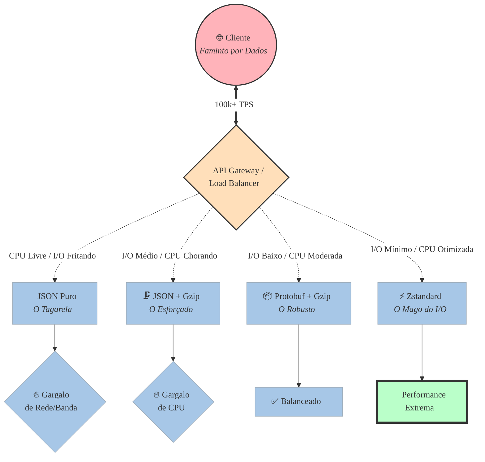

+++
title = "A Batalha dos Milissegundos"
description = "Quando uma arquitetura atinge a marca de dezenas ou centenas de milhares de Transações Por Segundo (TPS), as regras do jogo mudam."
date = 2026-05-05T19:41:45-03:00
tags = ["performance", "latência", "compressão", "protobuf", "zstd", "arquitetura de software"]
draft = false
weight = 3
author = "Vitor Lobo Ramos"
+++

## Otimizando Serialização e Compressão em Cenários de Alto TPS

Quando uma arquitetura atinge a marca de dezenas ou centenas de milhares de Transações Por Segundo (TPS), as regras do jogo mudam. A latência deixa de ser um número abstrato e se torna um teto de vidro para a escalabilidade, enquanto o uso de CPU e banda de rede travam uma guerra de recursos. 

Nesse nível de exigência, a escolha do formato de troca de dados e do algoritmo de compressão pode ser a diferença entre um sistema resiliente e um *outage* em horário de pico. Vamos dissecar os *trade-offs* entre [JSON](https://www.json.org/json-en.html) Puro, JSON com [Gzip](https://www.gzip.org/), [Protobuf](https://protobuf.dev/) com Gzip e a adoção do [Zstandard](https://facebook.github.io/zstd/) (Zstd).

---

## O Paradoxo da Latência

Em sistemas de alta performance, a latência total ($L_{total}$) de uma requisição não é apenas o tempo de rede. Ela pode ser expressa de forma simplificada pela seguinte equação:

$$L_{total} = T_{ser} + T_{comp} + \frac{S_{payload}}{B_{rede}} + T_{decomp} + T_{deser}$$

Onde:
*   $T_{ser}$ / $T_{deser}$: Tempo de serialização/deserialização (CPU/Memória).
*   $T_{comp}$ / $T_{decomp}$: Tempo de compressão/descompressão (CPU).
*   $S_{payload}$: Tamanho do *payload* final (Bytes).
*   $B_{rede}$: Banda disponível ou *throughput* da interface de rede.

Simplificando em miúdos, a equação acima mostra que a latência total é a soma do tempo gasto em CPU para preparar os dados (serializar e comprimir), o tempo de transmissão na rede (que depende do tamanho do *payload* e da banda) e o tempo gasto para processar os dados no destino (descomprimir e desserializar).

> **Para se aprofundar:** Este modelo é uma simplificação do custo de comunicação em sistemas distribuídos. A [Lei de Little](https://en.wikipedia.org/wiki/Little%27s_law) e a [Teoria das Filas](https://en.wikipedia.org/wiki/Queueing_theory) oferecem a base matemática para modelar concorrência e gargalos. A palestra de [Jeffrey Dean (Google, 2012)](https://static.googleusercontent.com/media/research.google.com/en//people/jeff/stanford-2012-talk.pdf) sobre latências em sistemas de larga escala é referência essencial sobre o tema.

Otimizar para alto TPS significa minimizar a soma desses fatores, equilibrando o custo computacional com o custo de I/O. Para ilustrar os caminhos possíveis, vejamos um mapa mental amigável da topologia de decisão:

### 1. [JSON](https://www.json.org/json-en.html) Puro: A Ilusão da Simplicidade
O JSON é onipresente, legível por humanos e possui suporte nativo em praticamente qualquer ecossistema. 

*   **O Cenário:** O payload trafega em texto plano. Não há custo de $T_{comp}$ ou $T_{decomp}$.
*   **O Problema no Alto TPS:** Em linguagens de tipagem estática e alta performance (como [C#](https://learn.microsoft.com/en-us/dotnet/csharp/), [Rust](https://www.rust-lang.org/) ou [Go](https://go.dev/)), o *parsing* de JSON exige alocação excessiva de memória no *heap* e uso intenso de CPU para manipulação de strings e conversão de tipos (ex: parsing de `float64`). Além disso, o $S_{payload}$ é gigantesco devido à repetição de chaves, o que satura placas de rede (NICs) e buffers de socket muito antes da CPU atingir 100%.
*   **Veredito:** Inviável para *core internal services* em alto TPS. O custo de I/O e *Garbage Collection* (GC) destrói o *throughput*.

> **Para se aprofundar:** Para cenários onde o JSON é mandatório (APIs públicas), parsers como [simdjson](https://simdjson.org/) usam instruções SIMD para atingir GB/s na desserialização. Ainda assim, o tamanho do payload na rede e a alocação de memória permanecem gargalos inerentes ao formato.

### 2. JSON + [Gzip](https://www.gzip.org/): O Cobertor Curto
A reação natural ao esgotamento da banda de rede é habilitar o Gzip no *middleware*.

*   **O Cenário:** O payload é reduzido em até 70-80%. A placa de rede respira aliviada.
*   **O Problema no Alto TPS:** O algoritmo [DEFLATE](https://en.wikipedia.org/wiki/Deflate) (base do Gzip) foi criado nos anos 90. Ele é computacionalmente caro. Ao habilitar Gzip em 50.000 TPS, o gargalo transfere-se imediatamente da rede para a CPU. Seus *workers* ou *goroutines* passarão a maior parte do tempo comprimindo bytes, aumentando a latência de *tail* (p99) e reduzindo a capacidade do servidor de processar novas conexões.
*   **Veredito:** Uma solução de legado. Útil para APIs públicas consumidas por navegadores, mas um tiro no pé para microsserviços internos.

### 3. Protobuf + Gzip: A Força Bruta Binária
Mudamos o protocolo de serialização. O [Protocol Buffers](https://protobuf.dev/) ([gRPC](https://grpc.io/)) entra em cena. No ecossistema chinês, o [Apache Dubbo](https://dubbo.apache.org/) cumpre papel equivalente como framework RPC de alta performance, suportando serialização plugável (Hessian, Protobuf, JSON) e compressão customizada.

*   **O Cenário:** Apenas a troca do JSON para Protobuf reduz drasticamente o $T_{ser}$ e $T_{deser}$, além de eliminar nomes de chaves do *payload* (usando *tags* numéricas). O uso de GC cai drasticamente. Adicionar Gzip por cima diminui ainda mais o tamanho.
*   **O Problema no Alto TPS:** Embora o Protobuf seja incrivelmente eficiente, aplicar Gzip em *payloads* pequenos (comuns em microsserviços) é ineficiente. O Gzip precisa construir uma janela de dicionário dinâmica para cada requisição. Em um *payload* de 500 bytes, o cabeçalho do Gzip e o esforço computacional muitas vezes não justificam os poucos bytes salvos.
*   **Veredito:** Muito sólido e padrão de mercado (gRPC default), mas o Gzip impede que a arquitetura atinja seu limite absoluto.

> **Para se aprofundar:** A [documentação de performance do Protocol Buffers](https://developers.google.com/protocol-buffers/docs/performance) detalha custos de serialização por linguagem. O guia de [Benchmarking do gRPC](https://grpc.io/docs/guides/benchmarking/) compara latência e throughput entre gRPC e REST/JSON em cenários reais.

### 4. O Triunfo do Zstandard (Zstd)
Desenvolvido pelo Facebook ([Yann Collet](https://github.com/Cyan4973)), o Zstd mudou o paradigma da compressão, focado em velocidade de descompressão massiva e escalabilidade de níveis.

*   **O Cenário:** Zstd oferece taxas de compressão similares ou superiores ao Gzip, mas consome uma fração ínfima da CPU, especialmente na descompressão (que é até 10x mais rápida).
*   **A "Arma Secreta" para TPS Extremo:** O Zstd possui o modo **[Dictionary Compression](https://github.com/facebook/zstd#the-case-for-small-data-compression)**. Em sistemas de alto TPS, os esquemas (seja JSON ou Protobuf) são repetitivos. Você pode treinar um dicionário Zstd com amostras do seu tráfego e distribuí-lo para os serviços. Ao comprimir um JSON pequeno de 300 bytes usando um dicionário pré-treinado, o $S_{payload}$ pode cair para 40 bytes em microssegundos, algo matematicamente impossível com o Gzip padrão.
*   **Veredito:** A escolha definitiva para a borda do estado da arte em engenharia de software.

> **Para se aprofundar:** O post [How Uber Uses Zstandard for RPC Compression](https://www.uber.com/blog/how-uber-uses-zstandard-for-rpc-compression/) (Uber Engineering, 2021) detalha a implementação de dicionários Zstd em produção. Para um guia técnico completo de treinamento, consulte a [documentação oficial do Zstd](https://github.com/facebook/zstd#training).

Só que, como nem tudo são flores, a adoção do Zstd não é plug-and-play. Requer investimento inicial para treinar dicionários, integração de bibliotecas específicas (nem todas as linguagens têm bindings maduros) e uma curva de aprendizado para entender os parâmetros de compressão. Portanto, é uma decisão que requer a análise cuidadosa do trade-off entre complexidade de implementação e ganho de performance:

## Matriz de Decisão: O Trade-off Final

| Estratégia | Uso de CPU | Custo de Memória (GC/Aloc) | Tamanho na Rede | Complexidade de Implementação | Caso de Uso Ideal |
| :--- | :---: | :---: | :---: | :---: | :--- |
| **JSON Puro** | Baixo | **Crítico** (Parsing pesado) | **Massivo** | Muito Baixa | Prototipagem, Integração com sistemas legados externos. |
| **JSON + Gzip** | **Crítico** | Alto | Moderado | Baixa (Middlewares prontos) | APIs públicas RESTful onde o gargalo é a conexão do cliente (3G/4G). |
| **Protobuf + Gzip** | Moderado | Muito Baixo | Pequeno | Moderada (Requer `.proto` files) | Ecossistemas gRPC padrão, tráfego *cross-region* (onde banda é cara). |
| **Zstd + Protobuf** | Muito Baixo | Quase Nulo (Baixa alocação) | **Mínimo** | Alta (Treino de dicionários, bindings específicos) | **Sistemas de missão crítica, mensageria de alta densidade ([Kafka](https://kafka.apache.org/), [RocketMQ](https://rocketmq.apache.org/)), e TPS extremo.** |

> **Para se aprofundar:** Os [benchmarks oficiais do Zstd](https://facebook.github.io/zstd/#benchmarks) mostram que, no nível 3, a descompressão é 5-10x mais rápida que Gzip no nível 6 com taxa de compressão equivalente — dados concretos que fundamentam as análises deste artigo. No contexto chinês, o **Double 11 (Singles' Day)** do Alibaba — que ultrapassa centenas de milhares de TPS no pico — valida na prática a combinação de serialização binária e compressão eficiente em escala real de produção.

Para um cenário de **TPS realmente alto**, a combinação campeã indiscutível é **[Protobuf](https://protobuf.dev/) (ou similar como [FlatBuffers](https://flatbuffers.dev/)/[Cap'n Proto](https://capnproto.org/)) aliado ao Zstd**, preferencialmente utilizando dicionários pré-treinados se os *payloads* forem pequenos (abaixo de 1KB). 

Essa escolha ataca os três maiores vilões da performance simultaneamente:
1. Elimina o gargalo de *parsing* e *garbage collection* (vantagem do binário estruturado).
2. Minimiza a saturação da placa de rede (vantagem da compressão eficiente).
3. Preserva ciclos preciosos de CPU para a regra de negócio (vantagem do algoritmo Zstd).

A adoção de tecnologias puramente textuais e algoritmos de compressão dos anos 90, embora convenientes, rapidamente se tornam um teto financeiro (custos de infraestrutura) e técnico (limite de escalabilidade vertical) quando submetidos a escalas monumentais.

---

### Fontes e Referências

*   Collet, Y. (2016). [Zstandard - Fast real-time compression algorithm](https://facebook.github.io/zstd/). (Meta/Facebook Open Source).
*   Google Developers. (2023). [Protocol Buffers Documentation](https://protobuf.dev/).
*   Uber Engineering Blog. (2021). [How Uber Uses Zstandard for RPC Compression](https://www.uber.com/blog/how-uber-uses-zstandard-for-rpc-compression/).
*   Dean, J. (2012). [Latency in Large-Scale Systems](https://static.googleusercontent.com/media/research.google.com/en//people/jeff/stanford-2012-talk.pdf). Google/Stanford Talk.
*   Little, J. D. C. (1961). [Little's Law](https://en.wikipedia.org/wiki/Little%27s_law). *Operations Research*.
*   simdjson Project. [simdjson: Parsing JSON at Gigabytes per Second](https://simdjson.org/).
*   Google Developers. (2023). [Protocol Buffers Performance](https://developers.google.com/protocol-buffers/docs/performance).
*   Apache Dubbo. [Apache Dubbo Documentation](https://dubbo.apache.org/).
*   Apache RocketMQ. [Apache RocketMQ Documentation](https://rocketmq.apache.org/).