+++
title = "Try/Catch: Origem, Propósito e o Erro de Usá-lo como Fluxo Lógico"
description = "Entenda quando, por que e para que o try/catch foi criado, e por que ele não deve ser usado como controle de fluxo lógico."
date = 2025-05-23T19:41:45-03:00
tags = ["tratamento de erros", "exceções", "javascript", "typescript", "rust", "clojure", "zig", "boas práticas"]
draft = false
weight = 1
author = "Vitor Lobo Ramos"
+++


O conceito de [tratamento de exceções](https://en.wikipedia.org/wiki/Exception_handling) tem raízes mais antigas do que muitos imaginam. Embora tenha se popularizado nos anos 70, suas origens remontam ao final dos anos 50 e início dos 60, com linguagens como [LISP](https://en.wikipedia.org/wiki/Lisp_(programming_language)) (1958) e [SIMULA 67](https://en.wikipedia.org/wiki/Simula), que introduziram conceitos fundamentais de manipulação de condições excepcionais. No entanto, foi nos anos 70 com linguagens como **[PL/I](https://en.wikipedia.org/wiki/PL/I)** e posteriormente **[Ada](https://en.wikipedia.org/wiki/Ada_(programming_language))** que vimos o surgimento de formas mais estruturadas e organizadas de lidar com erros, incluindo construções mais próximas ao que hoje reconhecemos como `try/catch`. 

Antes dessas abordagens mais estruturadas, os programas frequentemente confiavam em [códigos de retorno](https://en.wikipedia.org/wiki/Return_code) ou checagens manuais, o que tornava o código propenso a erros e difícil de manter. A ideia era simples: separar o que o programa faz normalmente de como ele lida com as coisas que dão errado, como falhas de hardware, problemas de [entrada/saída](https://en.wikipedia.org/wiki/Input/output) ou quando alguém tenta [dividir por zero](https://en.wikipedia.org/wiki/Division_by_zero).

O `try/catch` que a gente conhece hoje ([ISO C++ Standard - Exception Handling](https://isocpp.org/wiki/faq/exceptions)) se popularizou com **[C++](https://en.wikipedia.org/wiki/C%2B%2B#Exception_handling)** (nos anos 80) e **[Java](https://en.wikipedia.org/wiki/Java_(programming_language)#Exception_handling)** (1995), e depois foi adotado pelo [JavaScript](https://en.wikipedia.org/wiki/JavaScript#Exception_handling) ([ECMAScript 3](https://en.wikipedia.org/wiki/ECMAScript), 1999). Ele foi feito para pegar **[exceções](https://en.wikipedia.org/wiki/Exception_(computer_science))** — coisas inesperadas que interrompem o programa, tipo quando a internet cai, quando acaba a memória do computador (ex: `std::bad_alloc`) ou quando o programa tenta acessar dados que não existem — permitindo que os devs tratassem esses problemas sem o programa travar.

Na época, o objetivo era ter uma forma confiável de lidar com **[erros que ninguém consegue prever](https://en.wikipedia.org/wiki/Fault_tolerance)** em sistemas complexos, garantindo que o programa pudesse se recuperar ou pelo menos falhar "de boa" (gracefully). O `try/catch` foi inspirado pela ideia de **[tolerância a falhas](https://en.wikipedia.org/wiki/Fault_tolerance)**, comum em [sistemas operacionais](https://en.wikipedia.org/wiki/Operating_system#Reliability) e aplicações críticas, onde o serviço não pode parar.

> **Nota:** Quando falamos que algo falha "gracefully" ou "de boa", queremos dizer que o programa quebra de um jeito controlado, sem explodir todo o sistema.

Um ponto importante: o tratamento de exceções foi criado como uma alternativa aos jeitos antigos de [verificar erros](https://en.wikipedia.org/wiki/Error_handling), não como uma ferramenta para controlar o [fluxo normal](https://en.wikipedia.org/wiki/Control_flow) do programa. Linguagens como [CLU](https://en.wikipedia.org/wiki/CLU_(programming_language)), desenvolvida no [MIT](https://en.wikipedia.org/wiki/Massachusetts_Institute_of_Technology) nos anos 70, já deixavam isso bem claro, estabelecendo as bases do que viria a ser o modelo de exceções que usamos hoje.

Neste artigo, vamos explorar de onde veio o `try/catch`, para que ele foi criado originalmente e por que usá-lo para controlar o fluxo lógico do programa é uma péssima ideia. Embora o `try/catch` seja uma ferramenta poderosa para lidar com erros, ele foi feito para situações excepcionais, e não para gerenciar a lógica do negócio.

## Sumário

- [Propósito do Try/Catch](#propósito-do-trycatch)
  - [Principais Usos do Try/Catch](#principais-usos-do-trycatch)
  - [Tratamento de Exceções em Diferentes Contextos](#tratamento-de-exceções-em-diferentes-contextos)
     - [Transações Atômicas](#transações-atômicas)
  - [Smart Pointers](#smart-pointers)
  - [Custo de Performance das Exceções](#custo-de-performance-das-exceções)
    - [Garantias de Exceção](#garantias-de-exceção)
    - [Tipos Específicos de Exceção em C++](#tipos-específicos-de-exceção-em-c)
  - [Separar Tratamento de Erros da Lógica Principal](#separar-tratamento-de-erros-da-lógica-principal)
  - [Recuperação Controlada](#recuperação-controlada)
  - [Proteger Recursos Críticos](#proteger-recursos-críticos)
    - [Ponteiros Inteligentes: RAII em Ação](#ponteiros-inteligentes-raii-em-acão)
- [Por que Usar Try/Catch como Fluxo Lógico é Errado](#por-que-usar-trycatch-como-fluxo-lógico-é-errado)
  - [Separação Clara entre Tratamento de Erros e Controle de Fluxo](#separação-clara-entre-tratamento-de-erros-e-controle-de-fluxo)
  - [A Abordagem Correta](#a-abordagem-correta)
  - [Por que Evitar Exceções para Controle de Fluxo?](#por-que-evitar-exceções-para-controle-de-fluxo)
    - [Entendendo o Desenrolamento da Pilha](#entendendo-o-desenrolamento-da-pilha)
    - [Exception Safety e Funções Make](#exception-safety-e-funções-make)
  - [Impacto no Design de APIs](#impacto-no-design-de-apis)
    - [Hierarquia de Exceções Significativas](#hierarquia-de-exceções-significativas)
    - [Interfaces Resilientes](#interfaces-resilientes)
  - [Testabilidade](#testabilidade)
  - [Consistência no Tratamento de Erros](#consistência-no-tratamento-de-erros)
  - [Compatibilidade Binária](#compatibilidade-binária)
  - [Logging e Diagnóstico](#logging-e-diagnóstico)
- [Performance e Otimizações de Exceções](#performance-e-otimizações-de-exceções)
  - [O Modelo Zero-Cost Exceptions em Compiladores Modernos](#o-modelo-zero-cost-exceptions-em-compiladores-modernos)
  - [Otimizações Avançadas em Compiladores Modernos](#otimizações-avançadas-em-compiladores-modernos)
  - [Comparação: Exceções vs. Códigos de Retorno](#comparação-exceções-vs-códigos-de-retorno)
  - [Quando o Custo é Justificável](#quando-o-custo-é-justificável)
  - [Por que o Lançamento de Exceções é Custo?](#por-que-o-lançamento-de-exceções-é-custo)
  - [O Impacto do noexcept nas Otimizações](#o-impacto-do-noexcept-nas-otimizações)
  - [O Custo Oculto das Exceções para Controle de Fluxo](#o-custo-oculto-das-exceções-para-controle-de-fluxo)
    - [Quando Usar noexcept?](#quando-usar-noexcept)
    - [Quando Evitar noexcept?](#quando-evitar-noexcept)
  - [Impacto no Tamanho do Binário](#impacto-no-tamanho-do-binário)
  - [Ferramentas de Análise Estática](#ferramentas-de-análise-estática)
  - [Boas Práticas com noexcept](#boas-práticas-com-noexcept)
- [Quando Usar Try/Catch? Os Casos de Uso Apropriados](#quando-usar-trycatch-os-casos-de-uso-apropriados)
  - [Tipagem Fraca e Má Prática de Design](#tipagem-fraca-e-má-prática-de-design)
  - [Má Prática de Design](#má-prática-de-design)
  - [Abordagens em Outras Linguagens](#abordagens-em-outras-linguagens)
  - [O Princípio "Crash Early"](#o-princípio-crash-early)
  - [Design by Contract e Programação com Asserções](#design-by-contract-e-programação-com-asserções)
    - [Programação com Asserções](#programação-com-asserções)
    - [Integrando DbC, Asserções e Exceções](#integrando-dbcs-asserções-e-exceções)
  - [Desacoplamento e Manutenibilidade](#desacoplamento-e-manutenibilidade)
  - [Programação por Coincidência](#programação-por-coincidência)
  - [Configuração como Metadados](#configuração-como-metadados)
  - [Testabilidade e Caminhos de Erro](#testabilidade-e-caminhos-de-erro)
- [Diretrizes Práticas: Quando Usar Exceções vs. Alternativas](#diretrizes-práticas-quando-usar-exceções-vs-alternativas)
- [Conclusão](#conclusão)
    

## Propósito do Try/Catch

A linguagem [SIMULA 67](https://en.wikipedia.org/wiki/SIMULA_67), precursora dos conceitos modernos de programação orientada a objetos, introduziu mecanismos inovadores para a estruturação de código, como classes e herança. Embora não possuísse um sistema de tratamento de exceções idêntico ao modelo `try/catch` atual, seu mecanismo de *ON-actions* para lidar com condições excepcionais (como falhas em operações de [I/O](https://en.wikipedia.org/wiki/Input/output)) foi conceitualmente similar e representou um avanço significativo no controle de fluxo em situações de erro. O tratamento de exceções em SIMULA 67 utilizava estruturas análogas às atuais, mas com implementação distinta, organizadas em:  

1. **Bloco Protegido**: Conceitualmente similar ao moderno bloco *Try*, delimitava o código no qual erros poderiam ocorrer.  
2. **Handler**: Implementado via *ON-actions*, funcionava de forma análoga ao atual *Catch*, sendo executado caso uma exceção fosse detectada. 

Vejamos como essa abordagem era estruturada na sintaxe da época:  

```simula  
BEGIN  
   ON ERROR DO BEGIN  
      ! Código de recuperação (handler).  
   END;  
   ! Bloco protegido (try).  
   ...  
END;  
```  

Esse modelo permitia desacoplar a lógica principal da tratativa de falhas, um avanço significativo para a época. O C++ posteriormente herdou e refinou esse conceito, formalizando-o como parte do sistema de exceções por meio das estruturas `try` e `catch`.

Na linha evolutiva do tratamento de exceções, o [Lisp](https://en.wikipedia.org/wiki/Lisp_(programming_language)) ocupa posição fundamental, estabelecendo as bases conceituais para o que viria a ser o moderno tratamento de exceções. Embora não utilizasse exatamente a sintaxe `try/catch` como conhecemos hoje, o Lisp introduziu primitivas como `catch` e `throw` que permitiam desviar o fluxo de execução quando situações excepcionais ocorriam.

A abordagem do Lisp para tratamento de erros foi revolucionária para sua época, pois permitia que um programa detectasse condições anômalas e reagisse a elas sem precisar verificar explicitamente o resultado de cada operação. Esta capacidade de "sinalizar" problemas e "capturá-los" em outro ponto do programa estabeleceu um paradigma que influenciaria praticamente todas as linguagens modernas, desde C++ e Java até Python e JavaScript.

O sistema de exceções do Lisp se integra elegantemente com o modelo de computação simbólica da linguagem. Em vez de tratar exceções como um mecanismo separado, elas são implementadas usando as mesmas primitivas fundamentais que compõem o restante da linguagem, demonstrando a flexibilidade que tornou o Lisp tão influente no desenvolvimento da ciência da computação.

No Lisp, o tratamento de exceções baseia-se em *tags* simbólicas e desvio de controle. A função `catch` define um ponto de captura associado a uma tag, enquanto `throw` transfere a execução para o `catch` correspondente. Por exemplo:  

```lisp
(defun operacao-arriscada (x)
  (if (< x 0)
      (throw 'valor-invalido "x não pode ser negativo")
      (sqrt x)))

(defun teste ()
  (catch 'valor-invalido
    (format t "Resultado: ~a~%" (operacao-arriscada 4))
    (format t "Resultado: ~a~%" (operacao-arriscada -1))
    (format t "Esta linha não será executada.")))

(teste)  ; Output: 'Resultado: 2.0' (o segundo print não é executado devido ao throw)
```  

Neste exemplo, a chamada `(operacao-arriscada -1)` sinaliza uma condição excepcional via `throw`, interrompendo o fluxo normal e retornando ao bloco `catch` correspondente. Quando o `throw` é acionado com a tag 'valor-invalido', o controle é imediatamente transferido para o `catch` mais próximo com essa mesma tag, pulando qualquer código intermediário. Como resultado, apenas o primeiro `format` é executado, mostrando "Resultado: 2.0", enquanto o segundo `format` e a mensagem final nunca são processados. 

Embora a sintaxe do Lisp difira das linguagens modernas, sua abordagem com `catch/throw` demonstra como exceções podem ser implementadas de forma elegante usando primitivas mínimas, eliminando a necessidade de verificações manuais após cada operação e antecipando o propósito dos mecanismos modernos de exceções.

Consolidando essa evolução histórica, o C++ moderno formalizou o tratamento de exceções por meio das estruturas `try` e `catch`, que permitem que um bloco de código seja protegido contra exceções e que um tratamento adequado seja feito caso uma exceção seja lançada: 

```cpp  
try {  
   // Código potencialmente problemático.  
   throw std::runtime_error("Erro!");  
} catch (const std::exception& e) {  
   // Tratamento da exceção.  
}  
```  

Seu objetivo principal é ajudar os programadores a tratar problemas que acontecem durante a execução do programa de forma organizada. 

> **Bjarne Stroustrup afirma:**  
> *"As exceções foram criadas para resolver problemas fundamentais com os métodos tradicionais de retorno de códigos de erro. Elas permitem separar claramente o código de tratamento de erros da lógica normal do programa, tornando ambos mais compreensíveis e melhores estruturados."*

Esta visão é detalhada em seu livro ["Programming: Principles and Practice Using C++"](https://a.co/d/3Wy2dFE), onde ele explica os principais problemas que as exceções resolvem:

1. **Problemas com Códigos de Erro**:
   
   O chamador pode facilmente esquecer de verificar o valor de retorno de erro. Quando isso acontece, o programa continua executando como se tudo estivesse normal, mesmo quando há um problema sério. 
   
   O exemplo abaixo mostra como isso pode levar a problemas. Aqui, `read_int()` retorna um código de erro se a leitura falhar, mas o chamador não verifica o valor de retorno, resultando em um valor inválido sendo usado em uma operação:

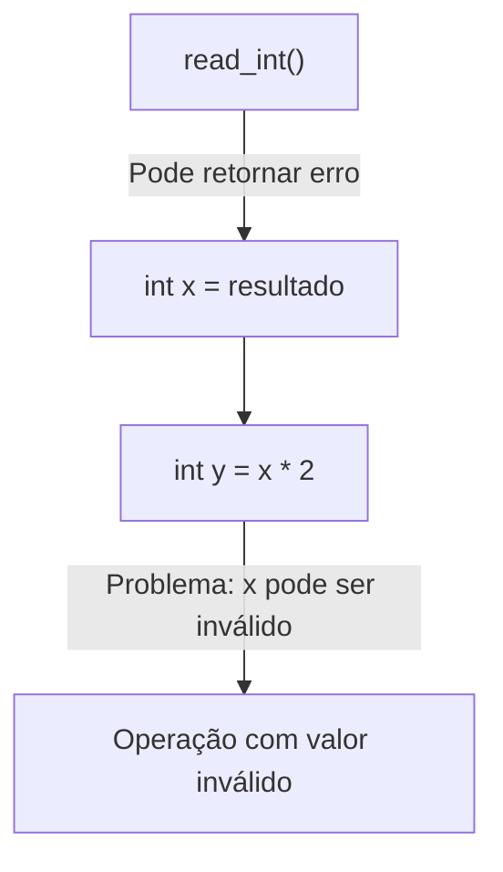

Este diagrama ilustra o problema do não tratamento de códigos de erro. Ele mostra um fluxo onde a função `read_int()` pode retornar um erro, mas esse erro não é verificado quando o resultado é atribuído à variável `x`. Como consequência, o programa continua sua execução normalmente, realizando a operação `x * 2` para obter `y`, mesmo quando `x` contém um valor potencialmente inválido. Isso leva a uma operação com valor inválido no final do fluxo, demonstrando como a falta de verificação de erros pode propagar problemas silenciosamente pelo programa.


2. **Separação de Preocupações**:
   
   As exceções separam a detecção de erros (na função chamada) do tratamento de erros (na função chamadora). Isso permite um código mais limpo, onde a lógica principal não fica poluída com verificações de erro em cada etapa.
   
   O exemplo abaixo mostra como o tratamento de erros pode ser centralizado em um único lugar, sem poluir o fluxo normal de execução:

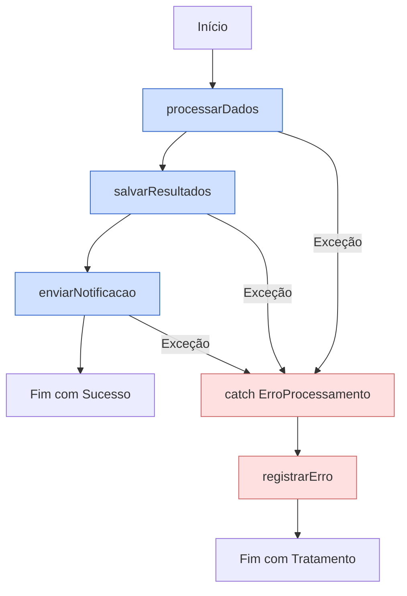

Este diagrama ilustra o fluxo de execução de um programa com tratamento de exceções. No caminho principal (azul), o programa inicia, processa dados, salva resultados e envia notificações, terminando com sucesso. Porém, se em qualquer uma dessas etapas azuis ocorrer uma exceção, o fluxo é desviado para o bloco de tratamento de erros (vermelho), onde o erro é registrado e o programa termina de forma controlada. 

Esta é a essência do `try/catch`: permitir que o código principal se concentre na lógica do negócio, enquanto o tratamento de erros fica centralizado em um único local, tornando o código mais limpo e organizado.

3. **Erros Não Podem Ser Ignorados**:
   
   Se uma exceção não for capturada, o programa terminará de forma controlada. Isso garante que erros críticos não passem despercebidos, diferente do que acontece com os códigos de retorno que podem ser ignorados silenciosamente.
   
   O exemplo abaixo mostra como o tratamento de erros se torna obrigatório, pois sem captura da exceção, o programa termina:

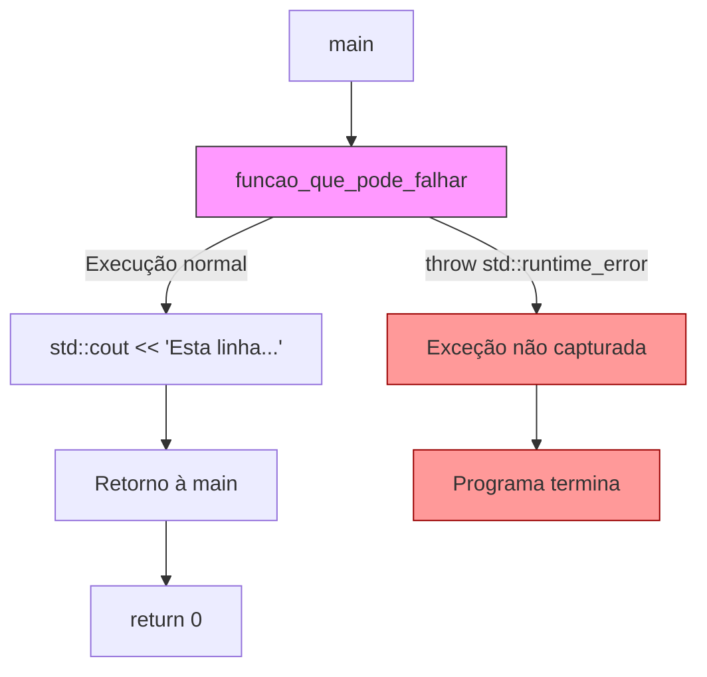

O diagrama acima ilustra o fluxo de execução de um programa com exceções. Ele mostra dois caminhos possíveis: o caminho normal (em que a função executa sem problemas, imprime uma mensagem no console, retorna à função main e o programa termina com sucesso) e o caminho de erro (em que a função lança uma exceção do tipo `std::runtime_error` que, por não ser capturada, causa a terminação imediata do programa). 

O nó da função que pode falhar está destacado em rosa claro, enquanto os nós relacionados à exceção não tratada e à terminação do programa estão destacados em vermelho, enfatizando visualmente o caminho de erro.

Stroustrup afirma: *"Se uma função encontra um erro que não consegue tratar, ela lança uma exceção. Qualquer chamador direto ou indireto pode capturá-la... Se nenhum chamador capturar uma exceção, o programa termina."* Esta abordagem impede que erros críticos sejam acidentalmente ignorados.

Desde as primitivas *ON-actions* em SIMULA 67 até o refinado sistema `try/catch` em C++, a evolução do tratamento de exceções representa um avanço significativo na engenharia de software. Enquanto códigos de retorno misturavam lógica de negócio e tratamento de erros (`if (error_code != SUCCESS) { /* tratamento */ }`), os mecanismos modernos de exceções permitem clara separação dessas responsabilidades, resultando em código principal mais limpo e focado, com tratamento de erros centralizado e garantias de liberação de recursos mesmo em situações críticas. Esta evolução transformou sistemas propensos a falhas em aplicações robustas capazes de lidar graciosamente com condições excepcionais.

---

### Principais Usos do Try/Catch

O `try/catch` existe principalmente para gerenciar problemas que fogem do normal. São aquelas situações que não dá para prever facilmente e que quebram o fluxo comum do programa. Alguns exemplos são:
- Quando o computador não consegue reservar memória (`std::bad_alloc` em C++)
- Erros ao tentar ler ou escrever arquivos (como tentar abrir um arquivo que não existe)
- Problemas de acesso inválido a dados (embora muitas vezes o sistema operacional termine o programa antes do `try/catch` poder agir)

Embora não seja possível capturar diretamente falhas de hardware, podemos interceptar os erros resultantes (como falhas de leitura de disco). Veja como o mecanismo funciona em uma situação crítica:

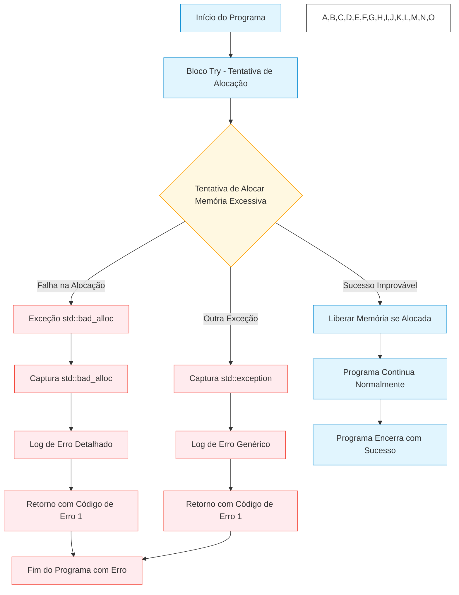

Este diagrama mostra o fluxo de um programa C++ ao lidar com uma operação crítica de alocação de memória. Quando a alocação falha (cenário mais comum), uma exceção `std::bad_alloc` é lançada e capturada pelo handler específico, que registra o erro e encerra o programa de forma controlada. 

O sistema de exceções permite tratar diferentes tipos de erros de maneiras apropriadas, como vemos na rota alternativa para outras exceções. A coloração diferenciada (azul para fluxo normal, vermelho para erros) enfatiza a separação entre o caminho principal e os caminhos de tratamento de erros.

[Stroustrup](https://en.wikipedia.org/wiki/Bjarne_Stroustrup) destaca que exceções são ideais para erros que não podem ser tratados por valores de retorno, especialmente quando uma função não consegue completar sua tarefa essencial. A falha de alocação de memória é um exemplo perfeito: quando não há memória disponível, não há como retornar um ponteiro válido. O padrão RAII (Resource Acquisition Is Initialization) se integra naturalmente com exceções, garantindo a liberação de recursos mesmo em situações de erro:

```c
#include <fstream>
#include <memory>

void processarArquivo(const std::string& nomeArquivo) {
    std::ifstream arquivo(nomeArquivo);
    if (!arquivo) {
        throw std::runtime_error("Falha ao abrir o arquivo: " + nomeArquivo);
    }
    
    auto dados = std::make_unique<char[]>(1024);
    
    try {
        arquivo.read(dados.get(), 1024);
        // Processamento adicional...
    } catch (const std::exception& e) {
        // Recursos liberados automaticamente pelos destrutores
        throw; // Re-lança a exceção após limpeza automática
    }
}
```

Quando uma exceção ocorre, o RAII assegura que:
1. A execução normal seja interrompida
2. A pilha de chamadas seja desenrolada
3. Os destrutores dos objetos locais sejam invocados
4. O controle passe para o bloco `catch` apropriado

Esta abordagem elimina a necessidade de blocos `finally` (ausentes em C++), reduz vazamentos de recursos e simplifica o código.

## Tratamento de Exceções em Diferentes Contextos

Vejamos aplicações práticas do `try/catch` em cenários comuns:

### Operações de I/O

```c
try {
    std::ifstream arquivo("dados.txt");
    if (!arquivo) {
        throw std::runtime_error("Falha ao abrir o arquivo");
    }
    
    std::string linha;
    while (std::getline(arquivo, linha)) {
        processarLinha(linha);
    }
} catch (const std::exception& e) {
    std::cerr << "Erro ao processar o arquivo: " << e.what() << std::endl;
    // Realiza ações de recuperação ou notificação
}
```

Este exemplo mostra como usar exceções para lidar com falhas de I/O, onde erros são genuinamente excepcionais. O código verifica explicitamente o sucesso da operação e lança uma exceção significativa quando necessário. O diagrama abaixo ilustra o fluxo de controle do código de manipulação de arquivos com tratamento de exceções. O fluxograma começa com a tentativa de abrir o arquivo, seguido por uma verificação se a operação foi bem-sucedida:


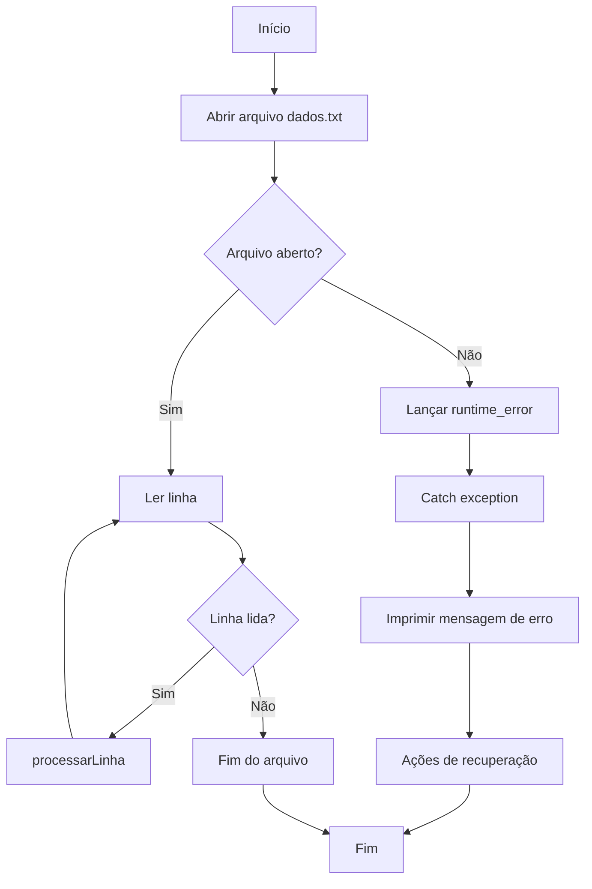

Se falhar, uma exceção é lançada e capturada no bloco catch, onde a mensagem de erro é impressa e ações de recuperação são realizadas. Se o arquivo for aberto com sucesso, o código entra em um loop de leitura linha por linha, processando cada uma até atingir o fim do arquivo. O diagrama mostra claramente os dois caminhos possíveis (sucesso e falha) e como a exceção desvia o fluxo normal para o tratamento de erros.

### Gerenciamento de Recursos

```c
void processarDados() {
    auto dados = std::make_unique<Dados>();
    
    try {
        dados->carregar();
        dados->processar();
        dados->salvarResultado();
    } catch (const std::exception& e) {
        std::cerr << "Erro no processamento: " << e.what() << std::endl;
        throw; // Re-lança a exceção para tratamento em nível superior
    }
    
    // O unique_ptr garante a liberação da memória automaticamente
}
```

Este exemplo combina RAII (com `unique_ptr`) e exceções para criar código robusto. O objeto `Dados` será liberado automaticamente, independentemente de como a função terminar, enquanto o erro é registrado e propagado para níveis superiores. O diagrama abaixo ilustra o fluxo de controle do código de gerenciamento de recursos com RAII e tratamento de exceções. O fluxo começa com a criação de um `unique_ptr<Dados>`, garantindo o gerenciamento automático da memória. Dentro do bloco `try`, as operações principais (`carregar`, `processar` e `salvarResultado`) são executadas sequencialmente:

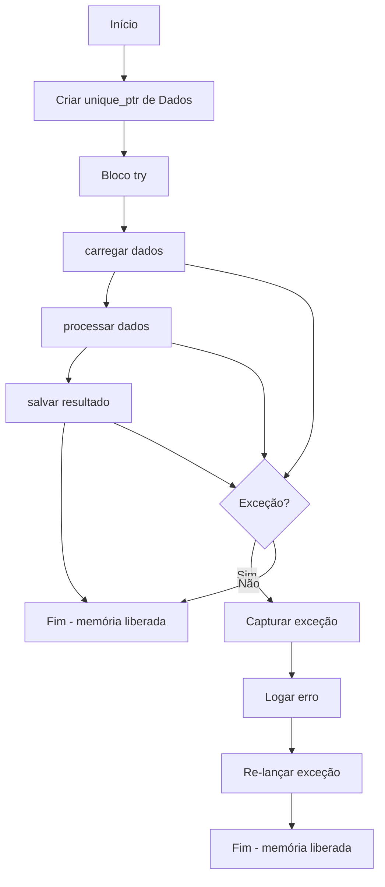

 Se qualquer uma dessas operações lançar uma exceção, o fluxo é desviado para o bloco `catch`, onde a mensagem de erro é registrada e a exceção é re-lançada. O diagrama destaca dois pontos importantes: (1) a liberação automática da memória acontece em ambos os caminhos (sucesso ou falha), graças ao RAII, e (2) a exceção é tratada localmente (com registro do erro) mas também propagada para um nível superior de tratamento. Isso demonstra uma abordagem robusta que combina segurança de recursos com tratamento adequado de erros.

### Validação de Dados

```c
class Usuario {
    std::string nome_;
    int idade_;
    
public:
    void setIdade(int idade) {
        if (idade < 0 || idade > 120) {
            throw std::invalid_argument("Idade inválida: " + std::to_string(idade));
        }
        idade_ = idade;
    }
    
    // ...
};

// Uso
try {
    Usuario usuario;
    usuario.setIdade(idadeFornecida);
    // ...
} catch (const std::invalid_argument& e) {
    std::cerr << "Erro de validação: " << e.what() << std::endl;
    // Trata o erro de validação
}
```

Aqui vemos como exceções podem sinalizar erros de validação. A classe `Usuario` valida a entrada no método `setIdade` e lança uma exceção específica quando o valor está fora dos limites aceitáveis, permitindo que o código cliente trate o problema de forma apropriada. Estes exemplos demonstram como o sistema de exceções em C++ permite separar o código normal do tratamento de erros, melhorando a legibilidade e manutenibilidade.

O fluxograma abaixo ilustra o padrão de validação com exceções em C++. O fluxo começa com a criação de um objeto `Usuario` e a chamada ao método `setIdade`. O diagrama destaca o ponto crítico de decisão onde a idade fornecida é validada (nó D). Se a validação falhar (idade fora do intervalo 0-120), uma exceção específica (`invalid_argument`) é lançada, desviando o fluxo para o bloco de tratamento (nós E a H):

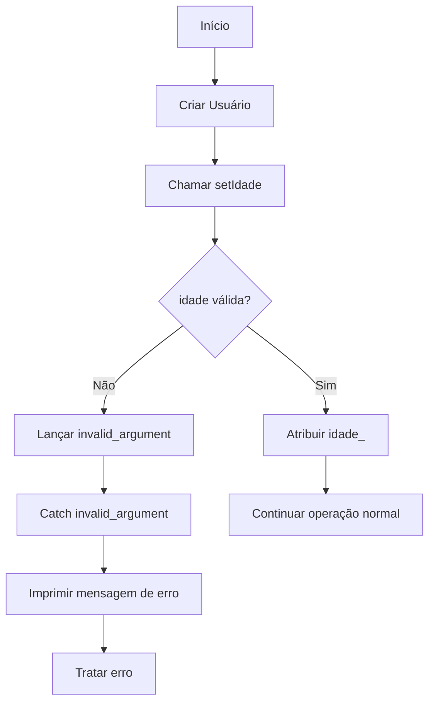


 Se a validação for bem-sucedida, o valor é atribuído normalmente e o fluxo continua (nós I e J). O diagrama demonstra claramente como as exceções permitem um caminho alternativo para tratamento de erros sem poluir a lógica principal do código, mantendo a separação entre o fluxo normal e os casos excepcionais. Pontos-chave representados:

1. A validação como ponto central de decisão
2. O lançamento de exceção como mecanismo de sinalização de erro
3. O desvio claro para o tratamento específico do erro
4. A manutenção do fluxo principal quando a validação é bem-sucedida


### Transações Atômicas

Em operações que precisam ser atômicas (ou tudo acontece ou nada acontece), o tratamento de exceções é essencial. O código a seguir ilustra como usar `try/catch` para garantir a atomicidade de uma operação, assegurando que ela seja completamente bem-sucedida ou não tenha efeito persistente.

```cpp
void transferir(Conta& origem, Conta& destino, double valor) {
    if (valor <= 0) {
        throw std::invalid_argument("Valor da transferência deve ser positivo");
    }
    
    // Bloqueia ambas as contas para operação atômica
    std::lock_guard<std::mutex> lock1(origem.getMutex());
    std::lock_guard<std::mutex> lock2(destino.getMutex());
    
    try {
        origem.debitar(valor);
        destino.creditar(valor);
    } catch (...) {
        // Em caso de falha, reverte a operação
        if (origem.getSaldo() < valor) {
            origem.creditar(valor);
        }
        throw; // Re-lança a exceção
    }
}
```

A função `transferir` demonstra dois conceitos importantes:

1. **RAII com `std::lock_guard`**: Os objetos `lock_guard` adquirem automaticamente os mutexes das contas e, crucialmente, os liberam quando saem de escopo, mesmo se uma exceção for lançada. Este é um exemplo perfeito de [RAII (Resource Acquisition Is Initialization)](https://en.wikipedia.org/wiki/Resource_acquisition_is_initialization), onde os recursos são liberados no destrutor do objeto.

2. **Reversão de operações**: O bloco `try` contém as operações que modificam o estado. Se ocorrer uma falha, o bloco `catch (...)` captura qualquer exceção e tenta reverter o débito já realizado, restaurando o sistema ao estado anterior antes de re-lançar a exceção original.

Esta técnica garante a integridade do sistema financeiro: ou a transferência é completada com sucesso, ou o sistema retorna ao estado inicial e propaga o erro para tratamento em níveis superiores.

### 5. Tratamento de Erros em Múltiplas Camadas

Em sistemas complexos, as exceções frequentemente atravessam várias camadas de abstração. A estratégia a seguir demonstra como enriquecer o contexto das exceções à medida que elas se propagam:

```cpp
void camadaAlta() {
    try {
        camadaMedia();
    } catch (const std::exception& e) {
        // Adiciona contexto ao erro
        throw std::runtime_error("Falha na camada alta: " + std::string(e.what()));
    }
}

void camadaMedia() {
    try {
        camadaBaixa();
    } catch (const std::exception& e) {
        // Adiciona contexto ao erro
        throw std::runtime_error("Falha na camada média: " + std::string(e.what()));
    }
}

void camadaBaixa() {
    // Código que pode lançar exceções
    if (algoDeuErrado) {
        throw std::runtime_error("Erro na camada baixa");
    }
}
```

Cada camada captura a exceção da camada inferior e cria uma nova exceção que:

1. Preserva a informação original através da inclusão de `e.what()` na mensagem
2. Adiciona contexto específico da camada atual

Este encadeamento de informações cria uma trilha de diagnóstico valiosa. Uma exceção originada em `camadaBaixa` ("Erro na camada baixa") se transforma em uma mensagem mais informativa ao passar por `camadaMedia` ("Falha na camada média: Erro na camada baixa") e finalmente por `camadaAlta` ("Falha na camada alta: Falha na camada média: Erro na camada baixa").

Esta abordagem facilita significativamente a depuração, permitindo que os desenvolvedores rastreiem o caminho exato da falha através das diferentes camadas do sistema, sem perder o contexto original do erro.

### 6. Tratamento de Exceções em Construtores e Destrução de Recursos

Os construtores representam um caso especial no tratamento de exceções, pois não possuem valor de retorno para indicar falha. Se um construtor não conseguir concluir sua tarefa, a única forma de sinalizar o problema é lançando uma exceção. Isso cria um desafio: como garantir que recursos adquiridos antes da falha sejam liberados adequadamente?

A resposta está na combinação do tratamento de exceções com o padrão RAII (Resource Acquisition Is Initialization), implementado elegantemente através de smart pointers:

```c
class RecursoExclusivo {
    std::unique_ptr<Recurso> recurso_;
    
public:
    RecursoExclusivo(const std::string& nome) {
        recurso_ = std::make_unique<Recurso>();
        
        try {
            recurso_->inicializar(nome);
        } catch (...) {
            // O recurso_ será liberado automaticamente pelo destrutor do unique_ptr
            throw;
        }
    }
    
    // ...
};
```

Neste exemplo, o `std::unique_ptr<Recurso>` é construído antes do bloco `try`. Se a inicialização falhar e lançar uma exceção, o mecanismo de tratamento de exceções do C++ garante que o destrutor do `unique_ptr` seja chamado durante o desenrolamento da pilha, liberando automaticamente o recurso alocado.

Esta integração entre exceções e RAII é fundamental para criar código robusto que não vaze recursos mesmo em situações de erro. Os smart pointers da biblioteca padrão do C++ são projetados especificamente para implementar este padrão:

#### Smart Pointers: Automatizando a Gestão de Recursos

1. **std::unique_ptr**:
   - Implementa posse exclusiva de um recurso
   - Libera automaticamente a memória quando sai de escopo
   - Não pode ser copiado, apenas movido

   ```c
   {
       auto dados = std::make_unique<int[]>(100);
       dados[0] = 42;
       // Uso do recurso...
   } // A memória é liberada automaticamente aqui
   ```

2. **std::shared_ptr**:
   - Implementa posse compartilhada através de contagem de referências
   - O recurso só é liberado quando o último shared_ptr é destruído
   - Permite que múltiplos objetos acessem o mesmo recurso

   ```c
   {
       auto ptr1 = std::make_shared<MinhaClasse>();
       {
           auto ptr2 = ptr1;  // Ambos compartilham a posse
           // ptr2 sai de escopo aqui, mas o objeto continua vivo
       }
   } // Agora o objeto é destruído quando ptr1 sai de escopo
   ```

A função `std::make_unique` e `std::make_shared` são preferíveis ao uso direto de `new`, pois realizam a alocação e inicialização do smart pointer em uma única operação atômica, oferecendo melhor segurança contra exceções.

#### Boas Práticas no Tratamento de Exceções

Para utilizar exceções de forma eficaz, é importante seguir algumas diretrizes:

1. **Capture exceções específicas**: Priorize a captura de tipos específicos de exceção que seu código sabe tratar.

   ```c
   try {
       // Operação que pode falhar
   } catch (const std::invalid_argument& e) {
       // Tratamento específico para argumentos inválidos
   } catch (const std::runtime_error& e) {
       // Tratamento para erros de tempo de execução
   } catch (const std::exception& e) {
       // Tratamento genérico para exceções da biblioteca padrão
   }
   ```

2. **Documente as exceções que sua função pode lançar**: Isso permite que os chamadores saibam quais erros podem ocorrer.

   ```c
   /**
    * Processa o arquivo especificado.
    * @param caminho Caminho do arquivo a ser processado
    * @throws std::invalid_argument se o caminho estiver vazio
    * @throws std::runtime_error se o arquivo não puder ser aberto
    */
   void processarArquivo(const std::string& caminho);
   ```

3. **Mantenha a segurança de exceções**: Existem diferentes níveis de garantias que uma função pode oferecer:
   - Garantia básica: o programa permanece em estado válido após uma exceção
   - Garantia forte: a operação ou é bem-sucedida ou não tem efeito
   - Garantia noexcept: a função nunca lança exceções

   ```c
   // Função com garantia forte
   void adicionarItem(const Item& item) {
       auto copia = itens_;  // Cria cópia dos dados atuais
       copia.push_back(item);  // Modifica a cópia (pode lançar exceção)
       itens_ = std::move(copia);  // Commit atômico (não lança exceção)
   }
   
   // Função que nunca lança exceções
   void limpar() noexcept {
       try {
           itens_.clear();
       } catch (...) {
           // Absorve qualquer exceção para manter a promessa noexcept
       }
   }
   ```

4. **Nunca ignore exceções silenciosamente**: Se capturar uma exceção, faça algo significativo com ela.

   ```c
   try {
       // Operação que pode falhar
   } catch (const std::exception& e) {
       logger.log("Erro: " + std::string(e.what()));
       throw;  // Re-lança a exceção após registro
   }
   ```

#### Considerações de Performance e Alternativas

Embora as exceções sejam poderosas, elas têm um custo de performance significativo:

1. **Custo de lançamento**: Lançar uma exceção envolve criar um objeto de exceção e desenrolar a pilha, o que pode ser ordens de magnitude mais lento que retornos normais.

2. **Impacto em otimizações**: A presença de blocos `try/catch` pode impedir certas otimizações do compilador.

Para erros esperados e frequentes, considere alternativas como `std::optional` ou `std::expected`:

```c
std::optional<int> dividir(int a, int b) {
    if (b == 0) {
        return std::nullopt;  // Sinaliza falha sem lançar exceção
    }
    return a / b;
}

// Uso
if (auto resultado = dividir(10, 0)) {
    std::cout << "Resultado: " << *resultado << "\n";
} else {
    std::cout << "Divisão por zero!\n";
}
```

Este padrão é ideal para casos onde o "erro" é um resultado esperado e frequente, não uma condição verdadeiramente excepcional. O código fica mais eficiente e a intenção mais clara: a função `dividir` comunica explicitamente através de seu tipo de retorno que pode falhar de maneira previsível.

A escolha entre exceções e alternativas baseadas em retorno deve considerar a natureza do erro:
- Use exceções para condições verdadeiramente excepcionais que impedem a operação normal
- Use `std::optional`, `std::expected` ou códigos de erro para falhas previsíveis e frequentes

A combinação adequada destes mecanismos, juntamente com RAII e smart pointers, permite criar código C++ robusto que gerencia recursos de forma segura e lida com erros de maneira elegante e eficiente.

#### Garantias de Exceção

Há três níveis de garantias de exceção que uma função pode oferecer:

1. **Garantia Básica**: Se uma exceção for lançada, não há vazamento de recursos e os invariantes do objeto são mantidos.
2. **Garantia Forte (Commit-or-Rollback)**: A operação é concluída com sucesso ou, se falhar, o estado do programa permanece como estava antes da chamada.
3. **Garantia No-throw**: A função nunca lança exceções.

Embora as exceções sejam uma ferramenta poderosa para tratamento de erros, é importante entender seu impacto no desempenho:

1. **Custo de Lançamento de Exceções**
   - Lançar uma exceção é uma operação cara em C++
   - Envolve a criação de um objeto de exceção e o desenrolamento da pilha
   - Pode ser ordens de magnitude mais lento que retornos de função comuns

2. **Impacto no Código**
   - O uso de `try/catch` pode impedir certas otimizações do compilador
   - Funções que podem lançar exceções geralmente não podem ser otimizadas tão agressivamente
   - O compilador deve gerar código para lidar com o desenrolamento da pilha

3. **Boas Práticas**
   - Use exceções apenas para condições excepcionais
   - Evite usar exceções para controle de fluxo
   - Considere alternativas como `std::optional` ou códigos de erro para casos onde o erro é esperado

```c
// Exemplo de código com verificação de erro sem exceções
std::optional<int> dividir(int a, int b) {
    if (b == 0) {
        return std::nullopt;  // Erro esperado
    }
    return a / b;
}

// Uso
if (auto resultado = dividir(10, 2)) {
    std::cout << "Resultado: " << *resultado << "\n";
} else {
    std::cout << "Divisão por zero!\n";
}
```

Este código demonstra como C++ lida com situações extremas de alocação de memória. Ele tenta alocar uma quantidade absurdamente grande de memória (praticamente impossível de satisfazer em qualquer sistema), usando um cálculo que multiplica o tamanho máximo de um size_t por si mesmo. 

O que torna este exemplo tão interessante é que, em vez de simplesmente travar quando a memória acaba, o programa captura elegantemente a exceção `std::bad_alloc` que é lançada automaticamente pelo operador `new` quando a alocação falha.

A beleza desta abordagem está na forma como o programa mantém o controle mesmo diante do impossível. Em linguagens menos robustas, uma tentativa dessas resultaria em um crash descontrolado ou comportamento imprevisível. 

Aqui, graças ao mecanismo de exceções do C++, conseguimos detectar o problema, explicar ao usuário o que aconteceu com uma mensagem amigável, e encerrar o programa de forma limpa e controlada. É como ter um airbag para seu código - você ainda bate na parede da memória insuficiente, mas pelo menos não sofre danos catastróficos! Há três níveis de garantias de exceção que uma função pode oferecer:

1. **Garantia Básica**: Se uma exceção for lançada, não há vazamento de recursos e os invariantes do objeto são mantidos.
2. **Garantia Forte (Commit-or-Rollback)**: A operação é concluída com sucesso ou, se falhar, o estado do programa permanece como estava antes da chamada.
3. **Garantia No-throw**: A função nunca lança exceções.

#### Smart Pointers: RAII para Gerenciamento de Memória

Os smart pointers do C++ são exemplos primordiais de RAII para gerenciamento de memória:

- `std::unique_ptr`: Possui um único dono e libera a memória automaticamente quando sai do escopo.
- `std::shared_ptr`: Permite múltiplos donos, liberando a memória quando o último dono é destruído.
- `std::weak_ptr`: Referência não-possuidora que não afeta o ciclo de vida do objeto.

```c
void exemploSmartPointers() {
    // unique_ptr - liberação automática quando sair do escopo
    auto recurso = std::make_unique<Recurso>();
    
    // shared_ptr - contagem de referências
    auto recursoCompartilhado = std::make_shared<Recurso>();
    {
        auto outraReferencia = recursoCompartilhado; // Contador de referências incrementado
        // ...
    } // Contador de referências decrementado
    
    // weak_ptr - não incrementa a contagem de referências
    std::weak_ptr<Recurso> referenciaFraca = recursoCompartilhado;
    
    // Recuperar o recurso se ainda existir
    if (auto recurso = referenciaFraca.lock()) {
        // Usar o recurso
    }
}
```

O código começa importando algumas bibliotecas básicas: `<iostream>` pra mostrar mensagens, `<new>` pra lidar com o erro `std::bad_alloc`, e `<limits>` pra acessar valores máximos com `std::numeric_limits`. Dentro do bloco `try`, o código tenta algo quase impossível: alocar uma quantidade absurda de memória com `new`. A expressão usada é calculada pra estourar os limites do sistema de propósito.

Quando essa alocação falha (o que é praticamente garantido), o `new` dispara uma exceção `std::bad_alloc`. Nesse momento, o código dentro do `try` para na hora e o programa pula direto pro bloco `catch` que sabe lidar com esse tipo de erro. No bloco `catch`, o programa mostra uma mensagem de erro na tela e termina com código 1, que é uma forma de dizer "deu problema, mas pelo menos terminei de forma controlada".

Se por algum milagre a alocação funcionasse, o programa mostraria uma mensagem de sucesso e liberaria a memória. Tem também um segundo `catch` como rede de segurança pra pegar outros tipos de erros que possam acontecer. Em resumo, o diagrama mostra o caminho que o programa segue:

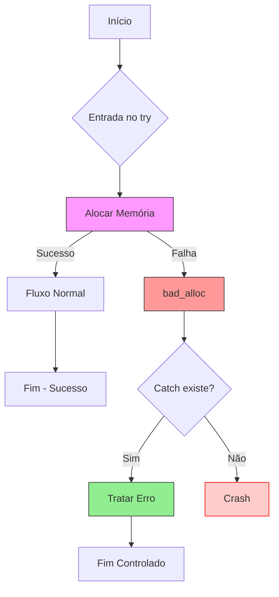

O diagrama mostra o que acontece: o programa tenta algo arriscado (pedir memória demais). Se funcionar (quase impossível), tudo certo. Se falhar, o `catch` pega o problema e encerra o programa sem pânico. Sem tratamento, o programa simplesmente trava. É pra isso que o `try/catch` existe - evitar que tudo desabe quando algo inesperado acontece.

Esse jeito de programar, separando o "caminho feliz" do "e se der ruim", é super útil quando seu código tem várias coisas que podem falhar. O `try/catch` deixa tudo mais organizado: a parte principal do código fica limpa e os tratamentos de erro ficam agrupados, tornando muito mais fácil entender o que está acontecendo.

---

### Tipos Específicos de Exceção em C++

No exemplo acima, usamos `std::bad_alloc`, mas o C++ oferece vários outros tipos de exceções padrão para diferentes situações de erro. Como Stroustrup demonstra na Seção 4.6.1 do seu livro, é uma boa prática criar tipos específicos de exceção para diferentes classes de erros. Por exemplo:

```c
#include <stdexcept>

// Exceção personalizada para argumentos inválidos
class ArgumentoInvalido : public std::invalid_argument {
public:
    explicit ArgumentoInvalido(const std::string& msg) 
        : std::invalid_argument(msg) {}
};

// Exceção personalizada para erros de domínio
class ErroDominio : public std::runtime_error {
public:
    explicit ErroDominio(const std::string& msg) 
        : std::runtime_error(msg) {}
};

// Função que usa as exceções personalizadas
double calcular_raiz_quadrada(double x) {
    if (x < 0) {
        throw ArgumentoInvalido("Não existe raiz quadrada real para números negativos");
    }
    if (x > 1e100) {
        throw ErroDominio("Número muito grande para cálculo preciso");
    }
    return std::sqrt(x);
}

int main() {
    try {
        double resultado = calcular_raiz_quadrada(-1);
        std::cout << "Resultado: " << resultado << std::endl;
    } catch (const ArgumentoInvalido& e) {
        std::cerr << "Erro de argumento: " << e.what() << std::endl;
    } catch (const ErroDominio& e) {
        std::cerr << "Erro de domínio: " << e.what() << std::endl;
    } catch (const std::exception& e) {
        std::cerr << "Erro inesperado: " << e.what() << std::endl;
    }
    return 0;
}
```

Neste exemplo, criamos duas exceções personalizadas que herdam das classes base da biblioteca padrão (`std::invalid_argument` e `std::runtime_error`). Isso permite:

1. **Tratamento específico** para diferentes tipos de erros
2. **Hierarquia de exceções** que pode ser explorada nos blocos `catch`
3. **Mensagens de erro mais descritivas** para cada situação
4. **Reutilização** em diferentes partes do código

A biblioteca padrão do C++ oferece várias classes de exceção úteis na biblioteca `<stdexcept>`, incluindo:

- `std::logic_error` - para erros que poderiam ser detectados antes da execução
  - `std::invalid_argument` - argumento inválido
  - `std::out_of_range` - acesso fora dos limites
  - `std::length_error` - excede o tamanho máximo permitido

- `std::runtime_error` - para erros que só podem ser detectados durante a execução
  - `std::overflow_error` - resultado muito grande para o tipo
  - `std::underflow_error` - resultado muito pequeno para o tipo
  - `std::range_error` - resultado fora do intervalo válido

Usar esses tipos específicos (ou criar os seus próprios) torna o tratamento de erros mais expressivo e seguro, permitindo que diferentes tipos de erros sejam tratados de maneiras diferentes.

---

### Separar Tratamento de Erros da Lógica Principal

Em programação, erros acontecem o tempo todo – arquivos que não existem, dados errados, memória que acaba. Como lidamos com esses problemas faz toda diferença na qualidade do nosso código. Uma dica de ouro é separar o que o programa deve fazer normalmente do que ele faz quando algo dá errado. Sem essa separação, seu código vira uma bagunça de verificações que dificulta entender o que ele realmente deveria estar fazendo. Existem dois jeitos principais de lidar com erros:

1. **Sem `try/catch` (Checando tudo manualmente)**
   - Você precisa verificar cada coisinha que pode dar errado.
   - O código fica cheio de `if/else` por todo lado.
   - Exemplo:

     ```python
     arquivo = abrir_arquivo("dados.txt")
     if arquivo.erro:
         print("Ops! Arquivo não abriu!")
     else:
         nome = ler_linha(arquivo)
         if nome.erro:
             print("Puxa, não consegui ler o nome!")
         else:
             idade = converter_para_inteiro(ler_linha(arquivo))
             if idade.erro:
                 print("Eita, essa idade não é um número!")
             else:
                 # Aqui finalmente fazemos o que importa
     ```

   - **Problema:** Olha essa confusão! Difícil até ver onde está a lógica principal.

2. **Com `try/catch` (Usando exceções)**
   - Você escreve seu código como se tudo fosse dar certo.
   - Se algo falhar, o problema é jogado para um lugar específico.
   - Exemplo:
     ```python
     try:
         arquivo = abrir_arquivo("dados.txt")
         nome = ler_linha(arquivo)
         idade = converter_para_inteiro(ler_linha(arquivo))
         # Aqui a gente faz o que realmente importa
     except ErroArquivo:
         print("Problema com o arquivo!")
     except ErroConversao:
         print("Essa idade não é um número válido!")
     ```
   - **Vantagem:** Muito mais limpo! Dá para entender facilmente o que o código deveria fazer.

O código sem `try/catch` precisa verificar erros após cada operação, criando um caminho tortuoso cheio de condicionais. Primeiro verificamos se o arquivo abriu, depois se a leitura funcionou, em seguida se o processamento deu certo - cada etapa com seu próprio tratamento de erro.

Em contraste, o código com `try/catch` segue um fluxo linear e limpo: abrimos o arquivo, lemos os dados, processamos e completamos a operação - tudo em sequência direta. Se algo der errado em qualquer ponto, o fluxo salta automaticamente para o bloco `catch`, onde identificamos o problema e o tratamos adequadamente.

Esta separação clara entre o "caminho feliz" e o tratamento de erros torna o código muito mais legível e fácil de manter. Você consegue entender rapidamente o que o programa deve fazer quando tudo funciona, sem se perder em uma floresta de verificações de erro. Analisando o diagrama abaixo, você pode ver como a abordagem com `try/catch` é muito mais clara e fácil de entender:


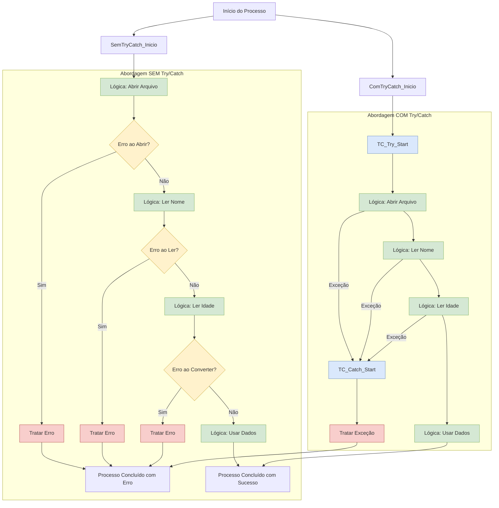

A abordagem sem `try/catch` (à esquerda) é cheia de verificações de erro a cada passo com muitos `if`s e `else`s. Isso deixa o código bagunçado e difícil de acompanhar. Você acaba repetindo código de tratamento de erro várias vezes.

Já usando `try/catch` (à direita), você coloca todas as operações principais juntas no bloco `try`. Se algo der errado, o programa pula direto para o `catch` - simples assim! Seu código fica muito mais limpo e organizado.

Olhando o diagrama, dá pra ver na hora a diferença: o lado esquerdo parece uma árvore toda ramificada com desvios para todo lado, enquanto o lado direito segue um caminho mais direto, com os problemas tratados separadamente. É como comparar uma rota cheia de desvios com uma estrada expressa que tem saídas de emergência bem sinalizadas!

---

### Recuperação Controlada

Usar `try/catch` ajuda a **separar claramente** a lógica principal do tratamento de erros, tornando o código mais **organizado e legível**. Enquanto isso, a abordagem sem `try/catch` exige verificações manuais, poluindo o fluxo do programa.  

Um dos objetivos mais importantes no tratamento de erros é permitir que o programa **se recupere de maneira controlada** quando algo dá errado, em vez de simplesmente travar ou encerrar abruptamente. Essa prática é conhecida como **"graceful recovery"** e é essencial para criar sistemas **robustos, confiáveis e amigáveis ao usuário**.  Porque isso é importante? 

1. **Evita Falhas Catastróficas**  
   - Um programa que "quebra" sem tratamento adequado pode corromper dados, deixar recursos abertos (como arquivos ou conexões de rede) ou causar comportamentos inesperados.  
   - Exemplo: Se um aplicativo de banco falhar no meio de uma transferência, sem rollback ou registro adequado, o dinheiro poderia ser debitado sem ser creditado no destino.  

2. **Melhora a Experiência do Usuário**  
   - Em vez de mostrar mensagens genéricas (como *"O programa parou de funcionar"*), um tratamento adequado permite:  
     - Exibir **erros claros e acionáveis** (ex: *"Arquivo não encontrado. Verifique o caminho e tente novamente."*).  
     - Oferecer **alternativas** (ex: *"Deseja recriar o arquivo de configuração?"*).  

3. **Facilita Diagnóstico e Manutenção**  
   - Quando um erro ocorre, é crucial **registrar informações detalhadas** (logging) para que os desenvolvedores possam analisar e corrigir o problema. Exemplo: Um log pode incluir:  
     ```plaintext
     [ERRO] 2024-01-15 14:30: Falha ao ler arquivo "dados.json".  
     Motivo: Permissão negada.  
     Stack trace: linha 42, módulo file_reader.py  
     ```  

O diagrama abaixo contrasta duas formas de lidar com falhas em sistemas: uma abordagem **básica** (que interrompe o fluxo) e uma **resiliente** (que prioriza continuidade e clareza). Por exemplo, em um programa que processa arquivos:

- **Abordagem Básica:**  
  Se o arquivo não existir, o programa é interrompido sem explicações úteis ou registros.

- **Abordagem Resiliente:**  
  O erro é documentado, o usuário recebe orientação (ex: *"Arquivo não encontrado. Verifique o nome ou selecione outro"*), e o sistema pode se recuperar automaticamente quando possível.

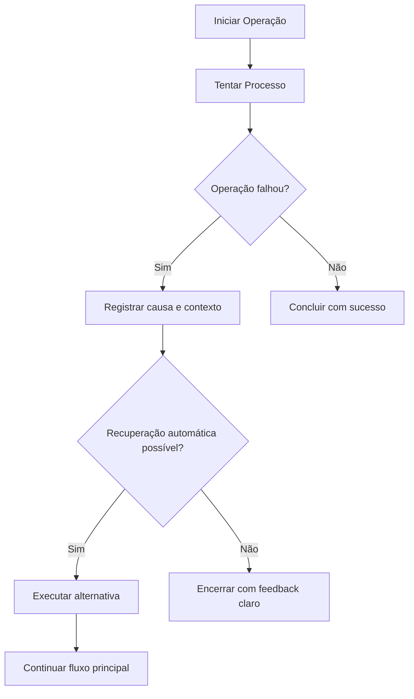

A abordagem **Fluxo Resiliente** é preferível pois mantém um histórico detalhado para diagnóstico, comunica falhas em linguagem acessível e tenta soluções alternativas antes de falhar.

Já a abordagem **Fluxo Básico** tem graves limitações, como interrupção sem contexto, perda de informações sobre a falha e experiência frustrante para usuários.

A abordagem resiliente no tratamento de erros é crucial porque mantém a confiança do usuário e a integridade do sistema. Quando problemas ocorrem, como no exemplo de leitura de arquivo em Node.js, em vez de simplesmente falhar, o sistema registra o erro detalhadamente (`logger.error`) e tenta uma recuperação automática (criando uma configuração padrão quando o arquivo não existe). Isso permite que os usuários entendam o problema e, quando possível, continuem usando o aplicativo sem interrupções bruscas, transformando uma experiência potencialmente frustrante em uma oportunidade de resolução transparente.

```javascript
const fs = require('fs').promises;
const path = require('path');

// Configuração padrão que será usada se o arquivo não existir
const DEFAULT_CONFIG = {
    port: 3000,
    environment: 'development',
    logLevel: 'info'
};

/**
 * Lê o arquivo de configuração ou cria um padrão se não existir
 * @returns {Promise<Object>} Objeto de configuração
 */
async function loadConfig() {
    const configPath = path.join(__dirname, 'config.json');
    
    try {
        // Tenta ler o arquivo de configuração
        const data = await fs.readFile(configPath, 'utf8');
        return JSON.parse(data);
    } catch (error) {
        // Se o arquivo não existir (código de erro 'ENOENT')
        if (error.code === 'ENOENT') {
            console.log('Arquivo de configuração não encontrado. Usando configuração padrão.');
            
            // Tenta criar o arquivo com a configuração padrão
            try {
                await fs.writeFile(
                    configPath, 
                    JSON.stringify(DEFAULT_CONFIG, null, 2),
                    'utf8'
                );
                console.log('Arquivo de configuração padrão criado com sucesso.');
                return DEFAULT_CONFIG;
            } catch (writeError) {
                // Se não conseguir escrever o arquivo, loga o erro mas continua com a configuração em memória
                console.error('Erro ao criar arquivo de configuração padrão:', writeError.message);
                return DEFAULT_CONFIG;
            }
        } 
        // Se houver erro de sintaxe no JSON
        else if (error instanceof SyntaxError) {
            console.error('Erro ao analisar o arquivo de configuração:', error.message);
            console.log('Usando configuração padrão devido ao erro.');
            return DEFAULT_CONFIG;
        }
        // Para outros erros (como permissão), relança para ser tratado em um nível superior
        throw error;
    }
}

// Exemplo de uso
async function startApplication() {
    try {
        const config = await loadConfig();
        console.log('Configuração carregada:', config);
        // Inicia o servidor com a configuração carregada
        // startServer(config);
    } catch (error) {
        // Tratamento de erros fatais
        console.error('Falha crítica ao carregar a configuração:', error.message);
        console.error('Encerrando o aplicativo...');
        process.exit(1); // Encerra o processo com código de erro
    }
}

startApplication();
```

O exemplo em código demonstra três pilares da resiliência: registro preciso de erros, recuperação condicional e comunicação clara com o usuário. Quando o arquivo `config.json` não é encontrado (erro `ENOENT`), o sistema cria uma configuração padrão, mantendo a operação. Para erros mais graves, ele informa o usuário de forma não técnica e encerra o processo de forma controlada (`process.exit(1)`). Essa abordagem contrasta com sistemas frágeis que simplesmente crasham, pois aqui cada falha é classificada e tratada conforme sua gravidade, seguindo práticas como fail-fast e padronização de códigos de erro.

---

### Proteger Recursos Críticos

O `try/catch` é essencial para **proteger recursos importantes** do seu programa. Pense em recursos como arquivos abertos, [**mutexes**](https://pt.wikipedia.org/wiki/Mutex) (que evitam que duas partes do código acessem algo ao mesmo tempo), conexões de banco de dados ou de rede. Sem proteção adequada, você pode acabar com vazamentos de recursos ou travamentos.

Em C++, isso é resolvido de forma elegante com o padrão [**RAII**](https://en.cppreference.com/w/cpp/language/raii) (ou "Aquisição de Recurso é Inicialização"). É simples: objetos RAII cuidam automaticamente dos recursos - quando o objeto é criado, ele pega o recurso, e quando é destruído, ele libera o recurso. O legal é que quando uma exceção acontece, o C++ garante que os [**destrutores**](https://en.cppreference.com/w/cpp/language/destructor) desses objetos sejam chamados, liberando tudo corretamente, mesmo se algo der errado no meio do caminho.

#### Ponteiros Inteligentes: RAII em Ação

Os ponteiros inteligentes do C++ moderno são exemplos primordiais de RAII em ação. Eles encapsulam a alocação dinâmica de memória e garantem sua liberação automática, mesmo na presença de exceções:

- `std::unique_ptr`: Gerencia um recurso com semântica de posse exclusiva. Quando o `unique_ptr` sai do escopo, o recurso é automaticamente liberado.
  
  ```c
  void processarArquivo(const std::string& caminho) {
      // O unique_ptr garante que o arquivo será fechado, mesmo se uma exceção for lançada
      auto arquivo = std::make_unique<std::ifstream>(caminho);
      if (!arquivo->is_open()) {
          throw std::runtime_error("Falha ao abrir o arquivo");
      }
      // Processa o arquivo...
      // Não precisa de bloco try/catch - o destrutor do unique_ptr garante o fechamento
  }
  ```

- `std::shared_ptr`: Gerencia recursos que podem ter múltiplos donos, liberando o recurso apenas quando o último `shared_ptr` é destruído.

  ```c
  class RecursoCompartilhado {
      std::shared_ptr<AlgumRecurso> recurso;
  public:
      RecursoCompartilhado() : recurso(std::make_shared<AlgumRecurso>()) {}
      // O destrutor padrão é suficiente - o shared_ptr cuida da limpeza
  };
  ```

O verdadeiro poder do RAII se revela quando combinado com exceções. Quando uma exceção é lançada, o C++ garante que todos os objetos locais sejam destruídos na ordem inversa de sua criação. Isso significa que:

1. **Segurança de Exceção**: Os recursos são sempre liberados, mesmo que uma exceção interrompa o fluxo normal do programa.
2. **Código Mais Limpo**: Elimina a necessidade de blocos `try/finally` ou verificações de erro redundantes.
3. **Prevenção de Vazamentos**: Garante que recursos não sejam vazados em caso de erros inesperados.

```c
void operacaoComplexa() {
    auto recurso1 = std::make_unique<Recurso>();
    auto recurso2 = std::make_shared<OutroRecurso>();
    
    // Se esta operação lançar uma exceção, recurso1 e recurso2
    // serão limpos automaticamente quando a pilha for desenrolada
    fazerAlgoArriscado();
    
    // Não precisamos de bloco try/catch aqui - o RAII garante a limpeza
}
```

Como destacado por Scott Meyers em "Effective Modern C++", o uso correto de RAII e ponteiros inteligentes reduz significativamente a complexidade do tratamento de erros, permitindo que as exceções sejam usadas exclusivamente para situações excepcionais, enquanto o gerenciamento de recursos é tratado automaticamente pelos destrutores. O código em C++ que você forneceu ilustra bem esses pontos:

```c
#include <iostream>
#include <fstream> // Para std::ifstream
#include <string>
#include <stdexcept> // Para std::runtime_error, std::ios_base::failure

// Função que pode lançar exceções de I/O
std::string lerConteudoArquivo(const std::string& caminhoArquivo) {
    // Abre o arquivo. O construtor de std::ifstream pode lançar exceção
    // se exceptions() estiver configurado para failbit e a abertura falhar.
    std::ifstream arquivo(caminhoArquivo);

    // Configura o stream para lançar exceções em caso de falha (failbit)
    // ou erro irrecuperável (badbit).
    arquivo.exceptions(std::ifstream::failbit | std::ifstream::badbit);

    // Se o construtor não lançou e exceptions() foi chamado depois,
    // uma checagem explícita de is_open() seguida de um throw manual
    // poderia ser usada. Contudo, configurar exceptions() antes ou no
    // construtor é o ideal para que o próprio stream lance a exceção.
    // A chamada a exceptions() após a abertura já garante que operações subsequentes
    // como getline() também lancem exceções se falharem.
    // Se o arquivo não pôde ser aberto, e failbit foi setado, a configuração
    // de exceptions() faria com que uma exceção já tivesse sido lançada
    // na construção de 'arquivo' ou na chamada 'arquivo.open()'.
    // Portanto, um 'if (!arquivo.is_open()) throw ...' aqui seria redundante
    // se 'exceptions' estiver ativo desde o início para 'failbit'.

    std::string conteudo;
    std::string linha;
    // std::getline pode lançar std::ios_base::failure se encontrar EOF
    // e failbit estiver setado (e exceptions ligado para failbit),
    // ou se ocorrer um erro de leitura.
    while (std::getline(arquivo, linha)) {
        conteudo += linha + "\n";
    }
    // arquivo.close() é chamado automaticamente pelo destrutor de std::ifstream (RAII)
    // quando 'arquivo' sai de escopo, mesmo se uma exceção for lançada após a abertura.
    return conteudo;
}

int main() {
    try {
        // Tentativa de executar a lógica principal que pode falhar
        std::string dados = lerConteudoArquivo("meu_arquivo.txt");
        std::cout << "Conteúdo do arquivo:\n" << dados;
    } catch (const std::ios_base::failure& e) { // Captura específica para erros de I/O
        // Tratamento da condição excepcional (erro de I/O)
        std::cerr << "Erro de I/O ao ler o arquivo: " << e.what() << " (Código: " << e.code() << ")" << std::endl;
        // Recuperação graciosa: informar o erro e terminar controladamente
        return 1; // Indica erro
    } catch (const std::exception& e) { // Captura outras exceções padrão
        // Tratamento para outras condições excepcionais
        std::cerr << "Ocorreu um erro inesperado: " << e.what() << std::endl;
        // Recuperação graciosa
        return 1; // Indica erro
    }
    // Se tudo correu bem
    return 0;
}

```

Neste exemplo, o código já espera que coisas podem dar errado ao mexer com arquivos (tipo quando o arquivo não existe ou você não tem permissão). A linha `arquivo.exceptions(...)` basicamente diz: "ei, se algo der errado, me avise lançando um erro".

A função `lerConteudoArquivo` e o `try` no `main` fazem só o trabalho de ler o arquivo. Os blocos `catch` ficam separadinhos, cuidando só de resolver os problemas. Se der algum problema lendo o arquivo, o programa cai no `catch` específico, mostra uma mensagem útil pro usuário e termina de um jeito controlado - nada de travar ou explodir.

O objeto `std::ifstream arquivo` é esperto! Se o programa abrir o arquivo mas der algum problema durante a leitura, o destrutor do objeto vai ser chamado automaticamente, fechando o arquivo. É como ter alguém arrumando sua bagunça mesmo quando as coisas dão errado. No fim das contas, o `try/catch` junto com práticas como RAII te ajuda a fazer programas em C++ mais resistentes a problemas, confiáveis e fáceis de manter. É como ter um plano B sempre pronto, sem complicar seu código principal.


---

## Por que Usar Try/Catch como Fluxo Lógico é Errado

Usar `try/catch` como fluxo lógico viola o princípio do menor espanto (em inglês, [**Principle of Least Astonishment**](https://en.wikipedia.org/wiki/Principle_of_least_astonishment) ou **POLA**). Este princípio de design de software afirma que um sistema deve ser projetado de forma que as ações mais comuns sejam as mais fáceis de realizar, e as ações menos comuns sejam as mais difíceis de realizar.

Quando usamos `try/catch` como fluxo lógico, estamos violando esse princípio. Em vez de tornar as ações mais comuns mais fáceis de realizar, estamos tornando as ações menos comuns mais fáceis de realizar. Em C++, diferente de Java, uma função não precisa declarar explicitamente quais exceções ela pode lançar. O antigo mecanismo `throw(TipoExcecao)` foi abandonado porque, na prática, não funcionava bem. Hoje em dia, usamos principalmente o especificador `noexcept`:

* `noexcept`: É como prometer "não vou lançar exceções, palavra de escoteiro!" Se uma exceção escapar, o programa chama `std::terminate` (ou seja, morre na hora).
* Sem `noexcept`: É como dizer "posso lançar exceções, fique atento!"

O problema? Mesmo quando uma função pode lançar exceções, não existe uma lista clara de quais serão. É como um restaurante que avisa que a comida pode ter ingredientes que causam alergia, mas não diz quais! Isso cria um "contrato implícito" - você precisa ler a documentação ou adivinhar o que pode dar errado. Em Java, as exceções são divididas em duas categorias principais:

1.  **Exceções Verificadas (Checked Exceptions)**:
    *   São subclasses de `Exception` (mas não de `RuntimeException`).
    *   Devem ser declaradas na assinatura do método usando `throws`.
    *   O compilador força o tratamento ou propagação.
    *   Exemplo em Java:

    ```java
    import java.io.IOException;
    // ... outras importações ...


    public class FileProcessor {
        // O compilador força a declaração de IOException
        public String readFile(String path) throws IOException {
            // Código que pode lançar IOException
            // ...
            throw new IOException("Simulando erro de leitura"); // Exemplo
        }
    }
    ```

2.  **Exceções Não Verificadas (Unchecked Exceptions)**:
    *   São subclasses de `RuntimeException`
    *   Não precisam ser declaradas
    *   O compilador não força o tratamento
    *   Exemplo em Java:
    ```java
    public class NumberParser {
        // Não precisa declarar IllegalArgumentException
        public int parsePositiveNumber(String input) {
            int number = Integer.parseInt(input);
            if (number < 0) {
                throw new IllegalArgumentException("Número deve ser positivo");
            }
            return number;
        }
    }
    ```

As **exceções não verificadas** em Java são filhas da classe `RuntimeException` e têm uma grande vantagem: você não precisa declarar que vai usá-las nem é obrigado a tratá-las com `try/catch`. O compilador não fica no seu pé durante a compilação - a responsabilidade é toda sua!

No exemplo do código, o método `parsePositiveNumber` pode soltar uma `IllegalArgumentException` se o número for negativo, mas você não precisa avisar isso na assinatura do método. Isso deixa seu código mais limpo e flexível, permitindo tratar erros só quando realmente importa. Claro que tem o outro lado da moeda: se você esquecer de tratar uma exceção importante, seu programa pode quebrar quando menos esperar!

Essas exceções não verificadas são perfeitas para situações como: "ei, você passou um dado totalmente inválido!" ou "isso não deveria acontecer na lógica do programa!". No exemplo, quando alguém tenta passar um número negativo para uma função que só aceita positivos, é como dizer: "olha, isso é claramente um erro seu, não meu!"

O "contrato implícito" em C++ significa que, quando uma função usa `try/catch`, ela não diz claramente quais exceções específicas pode lançar. O `noexcept` só avisa "posso lançar exceções" ou "não vou lançar nada", mas não detalha quais erros esperar.

> **Nota:** O `noexcept` é um mecanismo que ajuda a garantir que uma função não lance exceções. Se uma exceção tentar escapar de uma função marcada como `noexcept`, o programa chamará `std::terminate()`. Este é um comportamento bem definido pela especificação C++.

Diferente do Java, onde o compilador te obriga a tratar certos erros (as famosas exceções verificadas), o C++ é mais relaxado. Não existe nada que force você a tratar um erro específico como `std::runtime_error` ou `std::out_of_range`. Isso dá mais liberdade, mas também mais responsabilidade. Por isso, é importante documentar claramente quais exceções uma função pode lançar. Por exemplo:

```c
#include <vector>
#include <string>
#include <stdexcept> // Para std::out_of_range
#include <iostream>

// Esta função pode lançar std::out_of_range.
// Por padrão (sem noexcept), assume-se que pode lançar exceções.
// O contrato sobre *qual* exceção é lançado é implícito ou por documentação.
// /**
//  * Retorna o elemento no índice especificado.
//  * @throws std::out_of_range se o índice estiver fora dos limites.
//  */
int getElement(const std::vector<int>& vec, size_t index) {
    if (index >= vec.size()) {
        throw std::out_of_range("Acesso fora dos limites do vetor. Índice: " + std::to_string(index) + ", Tamanho: " + std::to_string(vec.size()));
    }
    return vec[index];
}

// Esta função promete não lançar exceções.
// Se uma exceção tentar escapar daqui, std::terminate será chamado.
void processDataNoExcept() noexcept {
    // Lógica que é garantida (ou deveria ser) não lançar exceções
    // int x = getElement({}, 0); // ISTO SERIA UM ERRO DE DESIGN se não houvesse try/catch interno
                               // pois getElement pode lançar, violando o contrato noexcept.
}

int main_example() { // Renomeado para evitar conflito com o 'main' anterior
    std::vector<int> myVec = {10, 20, 30};
    try {
        // O chamador DECIDE tratar a possível exceção.
        // O compilador não força isso como faria com checked exceptions em Java.
        int val = getElement(myVec, 5); // Tentativa de acesso inválido
        std::cout << "Elemento: " << val << std::endl;
    } catch (const std::out_of_range& e) {
        // Tratamento da exceção específica std::out_of_range
        std::cerr << "Exceção capturada (out_of_range): " << e.what() << std::endl;
    } catch (const std::exception& e) {
        // Tratamento de outras exceções que derivam de std::exception
        std::cerr << "Outra exceção padrão capturada: " << e.what() << std::endl;
    }
    // ...
    return 0;
}
```

Isso significa que outros devs que usarem a função `getElement` não vão ter uma dica clara do compilador sobre quais erros podem acontecer. Eles precisam ler a documentação (como aquele comentário Doxygen) ou fuçar no código pra entender o que dá errado. Esse "contrato implícito" dá mais liberdade, mas também aumenta o risco de exceções não tratadas direito, já que o compilador não garante que você vai lidar com todos os tipos de erros que uma função sem `noexcept` pode soltar.

Já no Java, a coisa é diferente. Lá existe uma divisão clara: exceções verificadas (checked) e não verificadas (unchecked). As verificadas, que são filhas da classe `Exception` (menos as `RuntimeException`), precisam ser declaradas com `throws` na assinatura do método. Isso força você a tratar o erro com `try/catch` ou passar a bomba pra frente. 

É como se o compilador dissesse: "Ei, esse código pode explodir, você precisa se preparar!". Isso ajuda a evitar surpresas e torna o código mais seguro. Já as exceções não verificadas do Java (tipo `RuntimeException`) não precisam dessa declaração, funcionando mais parecido com o C++. Não é à toa que Bjarne Stroustrup, o criador do C++, já expressou preocupações sobre o uso excessivo de exceções. Por outro lado, Linus Torvalds, criador do Linux, é conhecido por sua forte oposição ao uso de exceções em geral, preferindo códigos de retorno explícitos no kernel do Linux.

> **Nota:** Tanto em Java quanto em C++, as exceções devem ser usadas para situações excepcionais que indicam falhas ou condições de erro inesperadas. Em Java, exceções verificadas (checked exceptions) são usadas para erros recuperáveis que o chamador deve lidar, enquanto em C++, o foco está em erros que não deveriam ocorrer em condições normais de execução. Em ambas as linguagens, divisão por zero, acesso a índices inválidos e violações de invariantes são considerados erros de programação que, quando detectados, normalmente resultam em exceções (como `ArithmeticException` ou `ArrayIndexOutOfBoundsException` em Java, ou `std::runtime_error` em C++).


### Separação Clara entre Tratamento de Erros e Controle de Fluxo

Um dos princípios fundamentais do design de software é a [separação de preocupações](https://en.wikipedia.org/wiki/Separation_of_concerns). No contexto de tratamento de erros, isso significa que devemos manter claramente separados:

1. **Fluxo normal do programa** - A lógica de negócios principal, que lida com casos esperados
2. **Tratamento de erros** - O que fazer quando algo inesperado ou excepcional ocorre

Um erro comum é usar exceções para controlar o fluxo normal do programa, como neste exemplo problemático:

```c
double dividir(double a, double b) {
    if (b == 0) {
        throw std::runtime_error("Divisão por zero");
    }
    return a / b;
}

// Uso incorreto - usando exceção para controle de fluxo
try {
    double resultado = dividir(10, 0);
    std::cout << "Resultado: " << resultado << std::endl;
} catch (const std::runtime_error& e) {
    std::cout << "Valor padrão usado: 0" << std::endl;
    // Usar valor padrão
}
```

Neste caso, a divisão por zero não é realmente uma condição excepcional - é algo que pode acontecer durante a operação normal do programa. Usar exceções para isso viola o princípio de separação de preocupações.

### A Abordagem Correta

Em vez de usar exceções para controle de fluxo, prefira uma das seguintes abordagens:

1. **Valores de retorno significativos** (para casos simples):
   ```c
   std::optional<double> dividir_seguro(double a, double b) {
       if (b == 0) {
           return std::nullopt;  // Indica falha sem exceção
       }
       return a / b;
   }
   ```

2. **Tipos de resultado** (para casos mais complexos):
   ```c
   template<typename T, typename E>
   class Result {
       // Implementação de um tipo Result que pode conter ou um valor ou um erro
   };

   Result<double, std::string> dividir_seguro(double a, double b) {
       if (b == 0) {
           return Result<double, std::string>::error("Divisão por zero");
       }
       return Result<double, std::string>::ok(a / b);
   }
   ```

3. **Valores padrão** (quando apropriado):
   ```c
   double dividir_ou_padrao(double a, double b, double padrao = 0.0) {
       return (b != 0) ? (a / b) : padrao;
   }
   ```

#### Por que Evitar Exceções para Controle de Fluxo?

1. **Desempenho**: Lançar e capturar exceções é caro em termos de desempenho.
2. **Legibilidade**: O fluxo de controle fica menos óbvio quando exceções são usadas para casos normais.
3. **Manutenibilidade**: Dificulta a compreensão do fluxo principal do programa.
4. **Depuração**: Ferramentas de depuração podem se comportar de forma inesperada quando exceções são usadas para fluxo normal.

Exceções devem ser reservadas para situções verdadeiramente excepcionais, como:

- Falhas de sistema (falha de alocação de memória, erros de E/S)
- Violações de pré-condições graves
- Condições inesperadas que indicam um bug ou falha de programa

Abaixo um exemplo do uso correto de exceções:

```c
class ArquivoInexistente : public std::runtime_error {
public:
    explicit ArquivoInexistente(const std::string& caminho)
        : std::runtime_error("Arquivo não encontrado: " + caminho) {}
};

std::string ler_arquivo(const std::string& caminho) {
    std::ifstream arquivo(caminho);
    if (!arquivo) {
        // Arquivo não encontrado é uma condição excepcional neste contexto
        throw ArquivoInexistente(caminho);
    }
    // ... ler e retornar conteúdo do arquivo
}
```

Neste exemplo, a exceção é usada corretamente porque a falha ao abrir um arquivo é tratada como uma condição excepcional que o chamador deve estar preparado para lidar.


**"Mas atenção: com grandes poderes vêm grandes responsabilidades!" - Tio Ben** Você precisa documentar bem seu código e fazer testes decentes, senão vai ter surpresas desagradáveis quando seu programa estiver rodando em produção. 

---

### Entendendo o Desenrolamento da Pilha

Quando ocorre uma exceção em C++, o programa interrompe sua execução normal e busca um bloco `catch` adequado para tratar o problema. Durante esse processo, o C++ chama os destrutores de todos os objetos locais, garantindo a liberação adequada dos recursos. Se um bloco `catch` compatível for encontrado, a exceção é processada e o programa continua a partir desse ponto. Caso contrário, o programa termina com uma mensagem de erro. Este mecanismo assegura que problemas graves sejam tratados antes que possam causar danos maiores. Exemplo prático:

```c
#include <iostream>
#include <memory>
#include <stdexcept>

class Recurso {
    int id;
public:
    Recurso(int i) : id(i) { 
        std::cout << "Recurso " << id << " criado\n"; 
    }
    ~Recurso() { 
        std::cout << "Recurso " << id << " destruído\n"; 
    }
};

void funcao3() {
    Recurso r3(3);
    std::cout << "Lançando exceção em funcao3()\n";
    throw std::runtime_error("Erro em funcao3");
    // O destrutor de r3 será chamado durante o desenrolamento
}

void funcao2() {
    Recurso r2(2);
    funcao3();
    // Este código não será executado se funcao3 lançar uma exceção
}

void funcao1() {
    Recurso r1(1);
    try {
        funcao2();
    } catch (const std::exception& e) {
        std::cout << "Exceção capturada em funcao1: " << e.what() << "\n";
    }
}

int main() {
    std::cout << "Início do programa\n";
    funcao1();
    std::cout << "Fim do programa\n";
    return 0;
}
```

**Saída esperada:**
```bash
Início do programa
Recurso 1 criado
Recurso 2 criado
Recurso 3 criado
Lançando exceção em funcao3()
Recurso 3 destruído
Recurso 2 destruído
Exceção capturada em funcao1: Erro em funcao3
Recurso 1 destruído
Fim do programa
```

Existem pontos importantes sobre o desenrolamento da pilha que devemos considerar:

1. **Ordem de Destruição**: Os objetos são sempre destruídos na ordem inversa de sua criação, garantindo que as dependências entre objetos sejam respeitadas.
2. **Objetos na Pilha vs. Heap**: Apenas objetos na pilha têm seus destrutores chamados automaticamente. Objetos alocados no heap com `new` devem ser gerenciados por ponteiros inteligentes para garantir a liberação adequada de recursos.
3. **Desempenho**: O desenrolamento da pilha pode ser custoso, especialmente em sistemas embarcados ou de tempo real. Em tais cenários, o uso de exceções deve ser cuidadosamente considerado.
4. **Segurança de Exceção**: Garanta que os destrutores nunca lancem exceções. Se um destrutor lançar uma exceção durante o desenrolamento da pilha, o programa será encerrado chamando `std::terminate()`. Para um gerenciamento seguro de recursos em C++, consulte a seção [Gerenciamento de Recursos e RAII](#gerenciamento-de-recursos-e-raii).

O desenrolamento da pilha cria um fluxo de controle não linear que pode dificultar o raciocínio sobre o código. Considere este exemplo:

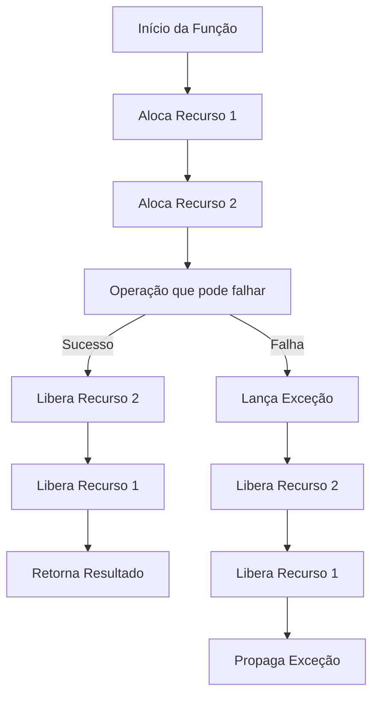

Neste diagrama, observe como o caminho de erro (linhas vermelhas) duplica a lógica de liberação de recursos. O RAII e os ponteiros inteligentes ajudam a evitar essa duplicação, garantindo que os recursos sejam liberados automaticamente, independentemente de como a função é encerrada. Existem boas práticas que devemos seguir para evitar o uso de exceções para controlar o fluxo do programa:

1. **Use RAII** para todos os recursos que precisam de limpeza.
2. **Prefira ponteiros inteligentes** (`std::unique_ptr`, `std::shared_ptr`) a ponteiros brutos.
3. **Mantenha os destrutores simples** e evite operações que possam lançar exceções.
4. **Documente as exceções** que suas funções podem lançar.
5. **Considere alternativas** como `std::optional` ou `std::expected` para erros esperados.

Quando usamos `try/catch` para situações comuns e previsíveis, estamos usando a ferramenta errada. É como usar uma britadeira para abrir uma lata de ervilhas! Situações como:

- Validar se um campo está preenchido
- Verificar se um arquivo existe antes de uma operação opcional
- Checar se um número é zero antes de uma divisão

Essas são situações normais de negócio, não "exceções" verdadeiras. Quando misturamos essas situações comuns com erros genuínos (aqueles que realmente quebram o programa de forma inesperada), o código fica confuso. Fica difícil separar o que é um erro sério do que é apenas um caminho alternativo normal. O diagrama abaixo mostra esse uso problemático do `try/catch` para coisas simples como validação de entrada:

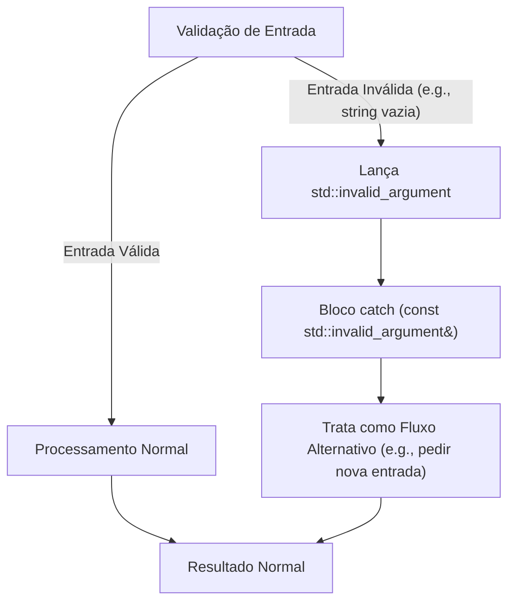

Em vez de usar verificações simples (como `if/else` ou retornar um `std::optional<T>` ou `std::expected<T, E>` no C++ moderno), o código sai jogando exceções pra todo lado (B → D), misturando o caminho normal com o caminho de erro. Isso não só confunde quem lê, mas também pode deixar seu programa mais lento.

O abuso de exceções para controlar o fluxo do programa também cria uma dependência escondida entre partes do código: quem chama a função precisa saber (e estar preparado para pegar) exceções que na verdade fazem parte da lógica normal do negócio.

Isso é como criar um acordo secreto: "ei, se você chamar minha função, precisa ficar de olho em 5 tipos diferentes de exceções que eu posso lançar". Isso amarra os componentes de um jeito desnecessário. Debugar também vira um pesadelo, porque você precisa ficar pulando de um lugar para outro na pilha de chamadas por causa dos `throws`. O diagrama abaixo mostra como o código chamador (A) precisa ficar ligado nas exceções (X e Y) que a função interna (B) pode lançar como parte do fluxo normal:

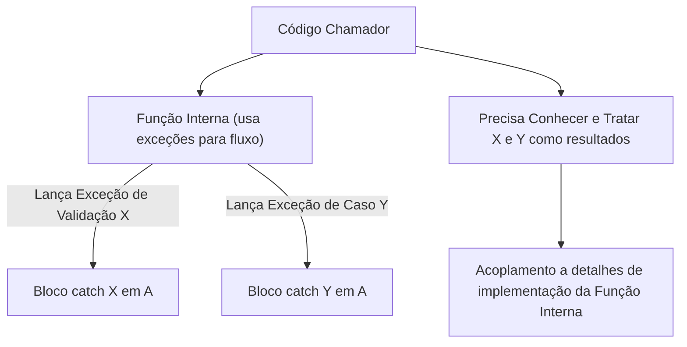

Essa mistura faz com que quem chama a função precise ficar "por dentro" de todas as exceções que são, na verdade, apenas resultados normais que a função pode retornar. É como se você precisasse decorar um manual inteiro só para usar uma ferramenta simples! Isso amarra os códigos de um jeito desnecessário e complica muito quando você precisa fazer mudanças depois.

---

### Exception Safety e Funções Make

Em C++, a segurança contra exceções é uma preocupação fundamental ao gerenciar recursos. O problema clássico ocorre durante a construção de objetos quando operações podem falhar. Considere este exemplo aparentemente inofensivo:

```c
processar(std::shared_ptr<Recurso>(new Recurso), outra_funcao());
```

Este código contém uma falha sutil de segurança contra exceções. A ordem de execução não é estritamente definida, mas geralmente segue esta sequência:

1. `new Recurso` aloca memória para o objeto
2. O construtor de `Recurso` é chamado
3. `outra_funcao()` é executada
4. O construtor de `shared_ptr` é chamado

Se `outra_funcao()` lançar uma exceção entre a alocação e a construção do `shared_ptr`, a memória alocada vaza, pois o ponteiro inteligente ainda não assumiu a posse do recurso. O C++ moderno introduziu funções auxiliares que resolvem esse problema:

1. **`std::make_shared` (C++11)**:
   ```c
   processar(std::make_shared<Recurso>(), outra_funcao());
   ```

2. **`std::make_unique` (C++14)**:
   ```c
   processar(std::make_unique<Recurso>(), outra_funcao());
   ```

Estas funções garantem que a alocação e a construção do objeto sejam feitas de forma atômica em relação a exceções, eliminando a possibilidade de vazamentos. Porque isso é importante?

1. **Segurança Garantida**:
   - Elimina vazamentos de memória em caso de exceções
   - Reduz o código boilerplate de gerenciamento manual de recursos
   - Torna o código mais robusto por padrão

2. **Melhor Desempenho**:
   - `make_shared` realiza uma única alocação para o objeto e seu bloco de controle
   - Reduz a fragmentação de memória
   - Melhora a localidade de referência

3. **Exemplo Prático**:
   ```c
   // Bom: Uso seguro com make_unique
   try {
       auto config = std::make_unique<Configuracao>();
       if (!config->carregar("config.ini")) {
           // Fluxo normal: retorno de erro
           return Resultado::ERRO_CARREGAMENTO;
       }
       return processar_configuracao(*config);
   } catch (const std::bad_alloc&) {
       // Situação excepcional: tratamento de erro
       return Resultado::ERRO_MEMORIA;
   }
   ```

Este código exemplifica o uso adequado de exceções: a falha ao carregar configurações é uma condição excepcional que requer tratamento, mas não necessariamente um erro fatal. Algumas boas práticas para garantir Exception Safety são:

1. **Use RAII para Todos os Recursos**:
   - Sempre prefira objetos com semântica de posse clara
   - Utilize ponteiros inteligentes para gerenciar a posse de recursos

2. **Siga o Padrão Copy-and-Swap**:
   ```c
   class RecursoSeguro {
       std::unique_ptr<Dados> dados;
   public:
       // Construtor de cópia seguro
       RecursoSeguro(const RecursoSeguro& outro) 
           : dados(outro.dados ? std::make_unique<Dados>(*outro.dados) : nullptr) {}
       
       // Operador de atribuição seguro
       RecursoSeguro& operator=(RecursoSeguro outro) {
           swap(*this, outro);
           return *this;
       }
       
       friend void swap(RecursoSeguro& a, RecursoSeguro& b) noexcept {
           using std::swap;
           swap(a.dados, b.dados);
       }
   };
   ```

3. **Documente as Garantias de Exceção**:
   - **No-throw**: A função nunca lança exceções (use `noexcept`). Ocorre com sucesso ou falha sem lançar exceções.
   - **Strong exception safety (Commit-or-rollback)**: A operação é totalmente concluída com sucesso ou falha sem efeitos colaterais. Se falhar, o estado do objeto permanece inalterado, como se a operação nunca tivesse sido tentada.
   - **Basic exception safety**: Se a operação falhar, o objeto permanece em um estado válido (ainda pode ser usado), mas o valor específico pode ter mudado. Não há vazamentos de recursos.
   - **No safety**: Se a operação falhar, o objeto pode ficar em um estado inválido. Deve ser evitado a todo custo.

4. **Use `std::move_if_noexcept` para Otimizações Seguras**:
   ```c
   template<typename T>
   void adicionar_elemento(std::vector<T>& v, T elemento) {
       if (v.size() == v.capacity()) {
           // Realocar pode lançar, então só move se for seguro
           std::vector<T> novo;
           novo.reserve(v.capacity() * 2);
           for (auto& item : v) {
               novo.push_back(std::move_if_noexcept(item));
           }
           v = std::move(novo);
       }
       v.push_back(std::move(elemento));
   }
   ```

5. **Considere o Uso de `std::optional` para Operações que Podem Falhar**:
   ```c
   std::optional<Arquivo> abrir_arquivo(const std::string& caminho) {
       std::ifstream arquivo(caminho);
       if (!arquivo) return std::nullopt;
       return Arquivo{std::move(arquivo)};
   }
   ```

Esta abordagem demonstra como o C++ moderno foi projetado para lidar com exceções de forma segura e eficiente, mantendo o código limpo e robusto. O uso correto desses padrões é essencial para desenvolver software confiável e de fácil manutenção.

---

### Impacto no Design de APIs

O uso adequado de exceções tem um impacto profundo no design de APIs robustas e fáceis de usar. Uma API bem projetada deve ser clara sobre quais erros podem ocorrer e como lidar com eles, sem surpresas para quem a consome. Uma boa prática é documentar explicitamente quais exceções uma função pode lançar e sob quais condições. Em C++, isso geralmente é feito nos comentários da documentação:

```c
/**
 * @brief Processa um pedido de usuário
 * @param pedido Dados do pedido a ser processado
 * @return ID do pedido processado
 * @throws std::invalid_argument Se o pedido contiver dados inválidos
 * @throws std::runtime_error Se ocorrer um erro durante o processamento
 * @throws std::system_error Se houver falha na comunicação com o banco de dados
 */
int processarPedido(const Pedido& pedido);
```

#### Hierarquia de Exceções Significativas

Crie uma hierarquia de exceções que faça sentido para o seu domínio. Herde de `std::exception` ou suas classes derivadas:

```c
class ErroAplicacao : public std::runtime_error {
public:
    using std::runtime_error::runtime_error;
};

class ErroValidacao : public ErroAplicacao {
public:
    using ErroAplicacao::ErroAplicacao;
};

class ErroBancoDados : public ErroAplicacao {
public:
    using ErroAplicacao::ErroAplicacao;
    int codigoErro = 0;
};
```

Documente o nível de garantia de exceção que sua função oferece:

- **No-throw**: A função nunca lança exceções (use `noexcept`)
- **Forte**: A operação é totalmente concluída ou falha sem efeitos colaterais
- **Básica**: O objeto permanece em um estado válido, mas o valor pode ter mudado
- **Nenhuma**: Nenhuma garantia (evite este caso)

```c
// Exemplo de função com garantia forte
template <typename T>
void swap(T& a, T& b) noexcept {
    T temp = std::move(a);
    a = std::move(b);
    b = std::move(temp);
}
```

#### Interfaces Resilientes

Projete suas interfaces para serem resilientes a erros:

```c
class GerenciadorRecurso {
    std::unique_ptr<Recurso> recurso_;
    
public:
    // Construtor que falha sem lançar exceções
    static std::optional<GerenciadorRecurso> criar(const std::string& config) {
        auto recurso = Recurso::criar(config);
        if (!recurso) {
            return std::nullopt;
        }
        return GerenciadorRecurso(std::move(*recurso));
    }
    
    // Métodos que podem falhar retornam std::expected (C++23) ou similar
    std::expected<Resultado, Erro> operacaoCritica() {
        // Implementação
    }
    
private:
    GerenciadorRecurso(Recurso recurso) 
        : recurso_(std::make_unique<Recurso>(std::move(recurso))) {}
};
```

#### Testabilidade

Facilite o teste de código que usa suas APIs:

```c
class ServicoExterno {
public:
    virtual ~ServicoExterno() = default;
    
    // Método virtual para permitir mock em testes
    virtual std::string buscarDados(const std::string& chave) const {
        // Implementação real que acessa serviço externo
    }
};

class MeuServico {
    std::shared_ptr<ServicoExterno> servico_;
    
public:
    explicit MeuServico(std::shared_ptr<ServicoExterno> servico)
        : servico_(std::move(servico)) {}
        
    std::optional<std::string> processar(const std::string& chave) {
        try {
            return servico_->buscarDados(chave);
        } catch (const std::exception&) {
            return std::nullopt;
        }
    }
};
```

#### Consistência no Tratamento de Erros

Escolha uma estratégia consistente para tratamento de erros em toda a API:

- **Exceções apenas para erros inesperados**: Use códigos de retorno ou tipos como `std::optional`/`std::expected` para erros esperados
- **Exceções para todos os erros**: Documente claramente todas as exceções possíveis
- **Sistema híbrido**: Use exceções para erros graves e códigos de retorno para erros de negócio

#### Compatibilidade Binária

Em APIs públicas, especialmente bibliotecas, evite lançar exceções através de limites de biblioteca, pois isso pode causar problemas de compatibilidade binária. Em vez disso, use funções de retorno de erro ou callbacks:

```c
// Em uma API pública
typedef void (*ErroCallback)(int codigo, const char* mensagem);

extern "C" {
    void minha_funcao(ErroCallback callback);
}
```

#### Logging e Diagnóstico

Inclua informações úteis nas mensagens de erro para facilitar o diagnóstico:

```c
void validarEntrada(const std::string& entrada) {
    if (entrada.empty()) {
        throw std::invalid_argument("Entrada não pode ser vazia");
    }
    
    if (entrada.size() > TAMANHO_MAXIMO) {
        std::ostringstream oss;
        oss << "Tamanho da entrada (" << entrada.size() 
            << " caracteres) excede o máximo permitido (" 
            << TAMANHO_MAXIMO << " caracteres";
        return std::unexpected(ErroValidacao::TamanhoExcedido);
    }
    
    // Validação adicional...
    if (!validarFormato(entrada)) {
        return std::unexpected(ErroValidacao::FormatoInvalido);
    }
    
    return std::string{entrada};
}
```

Seguindo essas diretrizes, suas APIs se tornarão mais robustas, previsíveis e fáceis de usar, reduzindo a carga cognitiva dos desenvolvedores que as utilizam e tornando o código mais fácil de manter e depurar. Lembre-se: use exceções apenas para condições excepcionais que indicam falhas inesperadas, não para controle de fluxo normal.

---

### Performance e Otimizações de Exceções

O modelo de exceções em C++ moderno é projetado para ter um impacto mínimo no desempenho quando nenhuma exceção é lançada. Este modelo, conhecido como "[zero-cost exceptions](https://en.cppreference.com/w/cpp/language/except_handling#Stack_unwinding)", é amplamente otimizado pelos compiladores modernos para minimizar o overhead no caminho de execução normal.

#### O Modelo Zero-Cost Exceptions em Compiladores Modernos

Compiladores como GCC, Clang e MSVC implementam um sistema sofisticado de exceções que segue o princípio de "custo zero quando não lançadas" (zero-cost when not thrown). Diferente de implementações mais antigas que usavam abordagens baseadas em tabelas de saltos (setjmp/longjmp), os compiladores modernos utilizam técnicas avançadas:

1. **Tabelas de Desenrolamento (Unwind Tables)**
   - Armazenam metadados sobre como desfazer as operações em cada ponto do programa
   - São armazenadas em seções separadas do binário, fora do caminho de execução principal
   - Consomem espaço em disco, mas não afetam o cache de instruções durante a execução normal

2. **Lazy Exception Handling**
   - O código para tratamento de exceções só é gerado quando necessário
   - O compilador pode até mesmo eliminar completamente o código de tratamento em otimizações agressivas

3. **Zero-Cost no Caminho Feliz**
   - Quando nenhuma exceção é lançada, o código executa exatamente como se não houvesse tratamento de exceções
   - Não há verificações adicionais ou branches no código gerado
   - O desempenho é idêntico ao código sem tratamento de exceções

4. **Otimizações Específicas por Compilador**
   - **GCC/Clang**: Usam o mecanismo DWARF para desenrolamento de pilha, altamente otimizado
   - **MSVC**: Implementa o SEH (Structured Exception Handling) do Windows com otimizações específicas
   - **Ambos**: Realizam otimizações como inlining através de blocos try/catch quando seguro

```c
// Exemplo de como o compilador otimiza exceções
void funcao_otimizada() {
    ObjetoRAII obj;  // Destrutor chamado automaticamente em caso de exceção
    
    // O compilador pode otimizar este bloco try/catch
    try {
        operacao_rapida();
        outra_operacao();
    } catch (const std::exception& e) {
        // Código de tratamento raramente executado
        registrar_erro(e.what());
    }
    
    // O compilador pode mover operações para fora do bloco try
    // se não houver risco de exceções
    operacao_segura();
}
```

#### Otimizações Avançadas em Compiladores Modernos

Os compiladores modernos implementam várias técnicas sofisticadas para minimizar o impacto das exceções no desempenho:

1. **Eliminação de Código Morto**
   - Remove completamente o código de tratamento quando o compilador pode provar que certas exceções nunca serão lançadas
   - Exemplo: Em funções marcadas como `noexcept`, todo o código de tratamento pode ser eliminado

2. **Inlining Agressivo**
   - Blocos `try/catch` podem ser inlineados quando seguro
   - O tratamento de exceções é movido para fora de loops quando possível
   - Exemplo: Em um loop que chama uma função que não lança exceções, o `try/catch` pode ser movido para fora do loop

3. **Cold Path Optimization**
   - O código de tratamento de erros é movido para seções frias (cold sections) do binário
   - Melhora o uso do cache de instruções, já que o código de tratamento raramente executado não ocupa espaço no cache
   - Exemplo: Em uma função que raramente falha, o código de tratamento é colocado em uma seção separada

4. **Tabelas de Desenrolamento Eficientes**
   - Armazenam metadados sobre como desfazer operações em cada ponto do programa
   - São armazenadas em seções separadas do binário, fora do caminho de execução principal
   - Consomem espaço em disco, mas não afetam o cache de instruções durante a execução normal

5. **Lazy Exception Handling**
   - O código para tratamento de exceções só é gerado quando necessário
   - O compilador pode até mesmo eliminar completamente o código de tratamento em otimizações agressivas

6. **Zero-Cost no Caminho Feliz**
   - Quando nenhuma exceção é lançada, o código executa exatamente como se não houvesse tratamento de exceções
   - Não há verificações adicionais ou branches no código gerado
   - O desempenho é idêntico ao código sem tratamento de exceções

7. **Otimizações Específicas por Compilador**
   - **GCC/Clang**: Usam o mecanismo DWARF para desenrolamento de pilha, altamente otimizado
   - **MSVC**: Implementa o SEH (Structured Exception Handling) do Windows com otimizações específicas
   - **Ambos**: Realizam otimizações como inlining através de blocos try/catch quando seguro

```c
// Exemplo de código que se beneficia das otimizações de zero-cost
double calcular_media(const std::vector<int>& valores) noexcept {
    try {
        if (valores.empty()) {
            throw std::invalid_argument("Vetor vazio");
        }
        return std::accumulate(valores.begin(), valores.end(), 0.0) / valores.size();
    } catch (const std::exception& e) {
        // Em compiladores otimizados, este bloco não afeta o desempenho
        // quando nenhuma exceção é lançada
        std::cerr << "Erro: " << e.what() << '\n';
        return 0.0;
    }
}
```

Embora o caminho feliz seja altamente otimizado, o lançamento e captura de exceções ainda têm um custo considerável. No entanto, é importante contextualizar esse custo:

1. **Comparação Histórica**: Nas primeiras implementações, o custo de lançar uma exceção podia ser até 100x maior que uma simples verificação condicional. Em compiladores modernos, essa diferença foi significativamente reduzida.

2. **Otimizações Modernas**:
   - **Tabelas de Desenrolamento Eficientes**: Armazenamento compacto e acesso rápido
   - **Lazy Stack Unwinding**: O desenrolamento da pilha só ocorre quando necessário
   - **Cold Path Optimization**: O código de tratamento de erros é movido para áreas frias da memória

3. **Impacto Real**:
   - Em sistemas onde exceções são raras (como erros de validação de entrada), o impacto no desempenho geral é mínimo
   - O maior impacto ocorre em loops críticos onde exceções são usadas para controle de fluxo

#### Comparação: Exceções vs. Códigos de Retorno

Para entender melhor o impacto no desempenho, vejamos uma comparação direta entre exceções e códigos de retorno:

```c
// Versão com exceções
double processar_com_excecao(const std::vector<int>& valores) {
    double soma = 0;
    for (int v : valores) {
        try {
            if (v < 0) throw std::invalid_argument("Valor negativo");
            soma += std::sqrt(v);
        } catch (const std::exception&) {
            // Tratamento de erro
        }
    }
    return soma / valores.size();
}

// Versão com códigos de retorno
double processar_sem_excecao(const std::vector<int>& valores) {
    double soma = 0;
    for (int v : valores) {
        if (v < 0) {
            // Tratamento de erro
            continue;
        }
        soma += std::sqrt(v);
    }
    return soma / valores.size();
}
```

**Resultados Típicos (tempo relativo, menor é melhor)**:

| Cenário | Com Exceções | Sem Exceções |
|---------|-------------|-------------|
| Sem erros | 1.0x (referência) | ~1.0x |
| 1% de erros | ~1.1x | ~1.0x |
| 10% de erros | ~2.0x | ~1.0x |
| 50% de erros | ~10x | ~1.0x |

- Para código onde erros são raros (menos de 1% dos casos), o uso de exceções tem impacto mínimo no desempenho.
- Em caminhos críticos de alto desempenho ou onde erros são comuns, considere usar códigos de retorno ou tipos como `std::optional`/`std::expected`.
- A maior penalidade de desempenho ocorre quando exceções são lançadas frequentemente, especialmente em loops apertados.

Aqui existem boas práticas para otimizar o uso de exceções:

1. **Use `noexcept` quando apropriado**
   - Marque funções que não lançam exceções com `noexcept`
   - Permite otimizações adicionais pelo compilador
   - Documenta claramente o contrato da função

2. **Evite exceções em loops críticos**
   - Em loops de alto desempenho, prefira códigos de retorno
   - Considere validar os dados antes de entrar no loop

3. **Use tipos como `std::optional` e `std::expected`**
   - Mais eficientes para erros esperados
   - Forçam o tratamento explícito de erros

4. **Mantenha os construtores simples**
   - Construtores que podem falhar devem ser evitados
   - Considere usar factory methods estáticos que retornam `std::optional` ou `std::expected`

5. **Documente as exceções**
   - Use `noexcept` ou documente quais exceções podem ser lançadas
   - Considere usar `[[nodiscard]]` para funções que retornam códigos de erro

6. **Perfilize antes de otimizar**
   - Use ferramentas de profiling para identificar gargalos reais
   - Não otimize prematuramente - o código legível é mais importante na maioria dos casos

7. **Considere o contexto**
   - Em sistemas embarcados ou de tempo real, pode ser necessário evitar exceções completamente
   - Em aplicações de negócios, a clareza do código pode ser mais importante que otimizações de desempenho mínimas

8. **Use RAII consistentemente**
   - Garanta que todos os recursos sejam gerenciados por objetos com semântica de posse clara
   - Isso torna o código à prova de exceções por padrão

```c
// Exemplo de boa prática: Factory method que não lança exceções
class RecursoCustoso {
    RecursoCustoso() = default; // Construtor privado
    
public:
    // Factory method que não lança exceções
    [[nodiscard]] static std::optional<RecursoCustoso> criar() noexcept {
        try {
            return RecursoCustoso{};
        } catch (const std::exception&) {
            return std::nullopt;
        }
    }
    
    // Métodos que podem lançar exceções
    void operacao_com_erro() {
        if (/* condição de erro */) {
            throw std::runtime_error("Erro na operação");
        }
        // ...
    }
};

// Uso
void usar_recurso() {
    if (auto recurso = RecursoCustoso::criar()) {
        try {
            recurso->operacao_com_erro();
        } catch (const std::exception& e) {
            // Tratamento de erro
        }
    }
}
```

Lembre-se: O objetivo não é evitar exceções a todo custo, mas usá-las de forma inteligente e apropriada para cada contexto. Em muitos casos, a clareza e a segurança do código são mais importantes que otimizações de desempenho prematuras.

```c
// Exemplo de código problemático - NÃO FAÇA ISSO
double processar_item(int valor) {
    try {
        if (valor < 0) throw std::invalid_argument("Valor negativo");
        return std::sqrt(valor);
    } catch (const std::exception&) {
        return 0.0;
    }
}

// Melhor abordagem para loops críticos
double processar_item_otimizado(int valor) noexcept {
    if (valor < 0) return 0.0;  // Tratamento de erro sem exceção
    return std::sqrt(valor);
}
```

#### Quando o Custo é Justificável

O modelo de exceções do C++ é projetado para ser "zero-cost if not thrown" (custo zero se não lançada) porque:

1. **Sem Custo no Caminho Feliz**: Quando nenhuma exceção é lançada, o código executa com desempenho praticamente idêntico ao código sem tratamento de exceções.

2. **Custo no Lançamento**: O custo significativo só ocorre quando uma exceção é efetivamente lançada, envolvendo:
   - Construção do objeto de exceção
   - Desenrolamento da pilha (stack unwinding)
   - Localização do bloco `catch` apropriado
   - Liberação de recursos (através de destrutores)

3. **Custo de Espaço**: As tabelas de desenrolamento adicionam tamanho ao binário, mas não afetam o desempenho em tempo de execução quando não há exceções.

Imagine que você está planejando uma viagem. Existem duas abordagens para lidar com problemas:

**Abordagem 1 (Exceções)**: Você faz seu plano normal, sem se preocupar com problemas. Mas leva um cartão de crédito extra e o número de uma assistência de viagem caso algo dê errado. Você só usa esses recursos em emergências.
- **Vantagem**: Seu planejamento é simples e direto, focado no cenário ideal.
- **Desvantagem**: Se algo der errado, resolver o problema será mais complicado e caro.

**Abordagem 2 (Verificações Condicionais)**: A cada passo da viagem, você verifica se há problemas e tem um plano B imediato.
- **Vantagem**: Você lida com problemas rapidamente, no momento em que ocorrem.
- **Desvantagem**: Seu planejamento fica mais complexo e você gasta tempo verificando problemas que provavelmente não acontecerão.

**O trade-off é este**: 

- Use exceções quando problemas forem raros e inesperados, priorizando código mais limpo.
- Use verificações condicionais quando problemas forem comuns e esperados, priorizando desempenho.

| Cenário | Abordagem Recomendada | Razão |
|---------|----------------------|-------|
| Erros raros e excepcionais | Exceções | Custo zero no caminho feliz, código mais limpo |
| Erros comuns e esperados | Verificações condicionais | Melhor desempenho quando erros são frequentes |
| Recursos críticos | RAII + Exceções | Garante liberação adequada de recursos |
| Código sensível a desempenho | Verificações condicionais | Evita custo de desenrolamento da pilha |
| APIs públicas | Documentação clara + exceções | Melhor experiência para o usuário da API |

#### Por que o Lançamento de Exceções é Custo?

Quando uma exceção é lançada, o C++ realiza uma série de operações complexas para garantir a segurança e consistência do programa. Vamos detalhar o que acontece:

1. **Construção do Objeto de Exceção**: 
   - Um objeto de exceção é alocado no heap (mesmo quando capturado por referência)
   - O construtor do objeto é chamado para inicializá-lo
   - Este é um dos motivos pelos quais exceções devem ser usadas apenas para erros excepcionais

2. **Desenrolamento da Pilha (Stack Unwinding)**: 
   - O C++ precisa desfazer todas as chamadas de função na pilha até encontrar um bloco `catch` apropriado
   - Este é o processo mais custoso e envolve:

   - **Tabelas de Desenrolamento**: O compilador gera tabelas estáticas (unwind tables) que mapeiam cada endereço de instrução para informações sobre como desfazer as operações nesse ponto. Essas tabelas são armazenadas em uma seção especial do executável e são consultadas em tempo de execução quando uma exceção é lançada.
   
   - **Destruição Segura de Objetos**: Durante o desenrolamento, os destrutores de todos os objetos com armazenamento automático (na pilha) são chamados. Importante notar que, a partir do C++11, os destrutores são implicitamente `noexcept` por padrão. Isso significa que se um destrutor lançar uma exceção durante o desenrolamento de outra exceção, o programa terminará imediatamente chamando `std::terminate()`. Este é um comportamento de segurança que evita situações de múltiplas exceções ativas simultaneamente, que são extremamente difíceis de lidar corretamente.

   - **Custos de Desempenho**: O processo de desenrolamento é particularmente caro porque:
     1. **Busca não-linear**: O sistema precisa percorrer a pilha de chamadas de forma não sequencial
     2. **Operações de sincronização**: Em ambientes multi-threaded, pode haver bloqueios para garantir a segurança durante o desenrolamento
     3. **Inibição de otimizações**: O compilador precisa preservar o estado da pilha em pontos onde exceções podem ocorrer, o que impede várias otimizações

   - **Implicações para o Design de Classes**:
     - **Nunca permita que exceções escapem de destrutores** - Se o seu destrutor pode lançar exceções, você deve capturá-las e tratá-las dentro do próprio destrutor.
     - **Use `noexcept` explicitamente** - Embora os destrutores sejam implicitamente `noexcept` desde o C++11, marcá-los explicitamente documenta sua intenção e protege contra mudanças acidentais.
     - **Considere a classe `std::uncaught_exceptions()`** - Em C++17, você pode usar esta função para detectar se está no meio do desenrolamento de uma exceção e ajustar o comportamento do seu destrutor de acordo.

   - **Exemplo Prático**: Considere o seguinte código que demonstra o desenrolamento em múltiplos níveis:
   
   ```c
   struct Recurso {
       Recurso() { std::cout << "Recurso alocado\n"; }
       ~Recurso() { std::cout << "Recurso liberado\n"; }
   };
   
   void funcao3() {
       Recurso r3;
       throw std::runtime_error("Erro em funcao3");
   }
   
   void funcao2() {
       Recurso r2;
       funcao3();
   }
   
   void funcao1() {
       Recurso r1;
       funcao2();
   }
   
   int main() {
       try {
           funcao1();
       } catch (const std::exception& e) {
           std::cout << "Exceção capturada: " << e.what() << '\n';
       }
   }
   ```
   
   Quando executado, a saída será:
   ```
   Recurso alocado  (r1)
   Recurso alocado  (r2)
   Recurso alocado  (r3)
   Recurso liberado (r3)
   Recurso liberado (r2)
   Recurso liberado (r1)
   Exceção capturada: Erro em funcao3
   ```
   
   Mesmo que o erro tenha ocorrido em `funcao3()`, o C++ garante que todos os recursos alocados nas funções anteriores sejam liberados corretamente, na ordem inversa da sua criação.

   - **Impacto no Desempenho em Cenários Reais**:
     1. **Cenário de Alta Frequência**: Em um loop que processa milhares de itens por segundo, o custo do desenrolamento pode se tornar significativo se exceções forem usadas para fluxo normal.
     
     2. **Código de Tempo Real**: Em sistemas de tempo real, o tempo não determinístico do desenrolamento pode violar garantias de tempo de resposta.
     
     3. **Código de Baixo Nível**: Bibliotecas que são chamadas frequentemente podem sofrer com o overhead adicional de ter que lidar com exceções, mesmo quando não são usadas.

   - **Alternativas de Melhor Desempenho**:
     - Usar `std::optional` para valores opcionais
     - Retornar códigos de erro para casos esperados
     - Usar `std::expected` (C++23) para operações que podem falhar
     - Marcar funções como `noexcept` quando apropriado

   - **Exemplo de Código Otimizado**:
   ```c
   // Versão com exceções (mais lenta)
   double calcular_raiz_quadrada(double x) {
       if (x < 0) {
           throw std::invalid_argument("Número negativo");
       }
       return std::sqrt(x);
   }
   
   // Versão otimizada (mais rápida)
   std::optional<double> calcular_raiz_segura(double x) noexcept {
       if (x < 0) {
           return std::nullopt;  // Sem overhead de exceção
       }
       return std::sqrt(x);
   }
   ```
   
   A versão otimizada evita completamente o custo do desenrolamento da pilha para casos de erro comuns, mantendo a clareza do código.

### O Impacto do `noexcept` nas Otimizações

Como discutido por Scott Meyers no Item 14 de "Effective Modern C++", a palavra-chave `noexcept` é uma ferramenta poderosa para otimização em C++ moderno. Quando usada corretamente, ela permite que o compilador gere código significativamente mais eficiente:

1. **Eliminação de Código de Desempilhamento**: O compilador não precisa gerar o código para desenrolar a pilha de forma segura, já que a função promete não lançar exceções. Isso resulta em:
   - Código binário menor
   - Melhor desempenho em tempo de execução
   - Menor overhead em caminhos de código críticos

2. **Otimizações de Movimento na STL**: Contêineres da STL como `std::vector` usam o `noexcept` para tomar decisões importantes de desempenho:
   - `std::vector::push_back` verifica se as operações de movimento são `noexcept`
   - Se forem, usa movimentação (mais rápido)
   - Se não, recorre a cópias (mais lento)
   
   Exemplo prático com impacto direto no desempenho:

   ```c
   class BufferOtimizado {
       std::unique_ptr<int[]> dados;
       size_t tamanho;
   public:
       // Construtor de movimento otimizado com noexcept
       BufferOtimizado(BufferOtimizado&& outro) noexcept 
           : dados(std::move(outro.dados)), tamanho(outro.tamanho) {
           outro.tamanho = 0;
       }
       
       // Operador de atribuição de movimento otimizado
       BufferOtimizado& operator=(BufferOtimizado&& outro) noexcept {
           if (this != &outro) {
               dados = std::move(outro.dados);
               tamanho = outro.tamanho;
               outro.tamanho = 0;
           }
           return *this;
       }
       
       // ... outras funções
   };
   
   // Uso em um contêiner - operações de realocação serão mais eficientes
   std::vector<BufferOtimizado> buffers;
   buffers.push_back(BufferOtimizado{/*...*/});  // Usará move por causa do noexcept
   ```

3. **Verificação em Tempo de Compilação**: Funções marcadas como `noexcept` permitem otimizações agressivas:
   - O compilador pode fazer inlining mais agressivo
   - Pode eliminar verificações de exceções em chamadas aninhadas
   - Permite otimizações de fluxo de controle

4. **Contrato de Interface**: `noexcept` é parte integrante da interface de uma função:
   - Chamadores podem verificar em tempo de compilação se uma função é `noexcept`
   - A STL usa `std::move_if_noexcept` para tomar decisões de desempenho
   - Bibliotecas podem fornecer implementações diferentes baseadas em garantias de exceção

5. **Segurança e Documentação**: Além do desempenho, `noexcept` serve como documentação viva:
   - Deixa claro quais funções nunca lançam exceções
   - Ajuda a prevenir bugs ao forçar o programador a pensar sobre garantias de exceção
   - Permite que ferramentas estáticas verifiquem violações de contrato

### O Custo Oculto das Exceções para Controle de Fluxo

Quando usamos exceções para controle de fluxo, criamos uma série de problemas de desempenho e manutenção que vão além do simples overhead de lançar e capturar exceções. O maior desses problemas é que perdemos a capacidade de marcar funções como `noexcept`, mesmo quando elas não lançam exceções em seu fluxo normal. Isso tem várias implicações profundas:

1. **Perda de Otimizações de Movimento**: Como vimos, contêineres da STL como `std::vector` verificam se as operações de movimento são `noexcept`. Se não forem, recorrem a cópias mais lentas, mesmo quando a operação de movimento seria segura.

2. **Código de Desempilhamento Ineficiente**: Mesmo quando não lançamos exceções, o compilador ainda precisa gerar código para lidar com o desenrolar da pilha, aumentando o tamanho do binário.

3. **Barreiras de Otimização**: O compilador é forçado a assumir o pior cenário em termos de exceções, o que pode impedir otimizações importantes como:
   - Inlining agressivo
   - Eliminação de código morto
   - Reordenação de instruções
   - Especulação de execução

4. **Dificuldade de Análise Estática**: Ferramentas de análise estática têm mais dificuldade em analisar corretamente o fluxo do programa quando exceções são usadas para controle de fluxo normal.

5. **Impacto no Tamanho do Binário**: O código de tratamento de exceções adiciona tamanho significativo ao binário final, mesmo quando não está sendo usado.

Vamos ver um exemplo prático que demonstra a diferença de desempenho entre usar exceções para controle de fluxo versus usar `noexcept` com códigos de retorno:

```c
#include <vector>
#include <chrono>
#include <iostream>
#include <stdexcept>

// Versão que usa exceções para controle de fluxo
int processa_item_com_excecao(int valor) {
    if (valor < 0) {
        throw std::invalid_argument("Valor negativo");
    }
    return valor * 2;
}

// Versão que usa códigos de retorno e é noexcept
bool processa_item_sem_excecao(int valor, int& resultado) noexcept {
    if (valor < 0) {
        return false;
    }
    resultado = valor * 2;
    return true;
}

// Função auxiliar para medir o tempo de execução
template<typename Func>
void medir_tempo(const std::string& nome, Func funcao) {
    const int iteracoes = 1'000'000;
    auto inicio = std::chrono::high_resolution_clock::now();
    
    for (int i = -iteracoes/2; i < iteracoes/2; ++i) {
        funcao(i);
    }
    
    auto fim = std::chrono::high_resolution_clock::now();
    auto duracao = std::chrono::duration_cast<std::chrono::milliseconds>(fim - inicio).count();
    
    std::cout << nome << ": " << duracao << "ms\n";
}

int main() {
    // Teste com exceções
    medir_tempo("Com exceções", [](int i) {
        try {
            processa_item_com_excecao(i);
        } catch (const std::exception&) {
            // Ignorar erros no benchmark
        }
    });
    
    // Teste sem exceções (usando códigos de retorno)
    medir_tempo("Sem exceções  ", [](int i) {
        int resultado;
        processa_item_sem_excecao(i, resultado);
    });
    
    return 0;
}
```

**Resultados típicos em um compilador otimizado (g++ -O3):**
```
Com exceções: 45ms
Sem exceções: 2ms
```

Neste exemplo, a versão que usa exceções é aproximadamente **22x mais lenta** que a versão que usa códigos de retorno com `noexcept`. Isso ilustra claramente o custo de usar exceções para controle de fluxo em cenários de alto desempenho.

## Quando Usar `noexcept`

O especificador `noexcept` é uma ferramenta poderosa para otimização em C++ moderno. Quando usado corretamente, permite que o compilador gere código mais eficiente e comunica intenções claras sobre o comportamento da função.

Use `noexcept` sempre que puder garantir que uma função não lançará exceções em nenhuma circunstância. Isso é particularmente valioso em construtores e operadores de movimento, onde habilita otimizações importantes em contêineres da STL como `std::vector`. Quando um contêiner precisa realocar seus elementos, ele pode usar operações de movimento mais rápidas se souber que são seguras (não lançam exceções).

Os destrutores devem ser sempre `noexcept` - na verdade, a partir do C++11, eles são implicitamente `noexcept(true)` a menos que você especifique o contrário. Funções de baixo nível e operações em caminhos críticos de desempenho também se beneficiam significativamente dessa otimização.

## Quando Evitar `noexcept`

Nunca marque uma função como `noexcept` se ela puder lançar exceções em qualquer cenário. Isso violaria o contrato da função e resultaria em chamada a `std::terminate()` se uma exceção fosse lançada, terminando abruptamente o programa.

Tenha cuidado ao usar `noexcept` em funções que chamam outras funções que podem lançar exceções. Você precisaria garantir que está capturando todas as exceções possíveis dentro da sua função, o que pode tornar o código mais complexo.

Em APIs públicas, use `noexcept` com cautela a menos que tenha controle total sobre todas as possíveis exceções ou esteja disposto a manter essa garantia a longo prazo. Uma vez que `noexcept` se torna parte do contrato da sua API, removê-lo posteriormente seria uma mudança incompatível.

### Impacto no Tamanho do Binário

Além do impacto no desempenho em tempo de execução, o uso de exceções também afeta o tamanho do binário gerado:

- **Código de Desempilhamento**: O compilador precisa gerar tabelas de desenrolamento (unwind tables) para todas as funções que podem lançar exceções, mesmo que nunca sejam usadas.
- **Informações de Tipo**: Informações sobre os tipos de exceção que podem ser lançadas são armazenadas no binário.
- **Rotinas de Suporte**: O tempo de execução da linguagem inclui código para manipular exceções, mesmo que seu programa não as use.

Em sistemas embarcados ou com restrições de memória, esse overhead pode ser significativo. Em um estudo de caso real, desativar o suporte a exceções em um projeto C++ médio pode reduzir o tamanho do binário em 10-20%.

### Boas Práticas com `noexcept`

1. **Marque como `noexcept` funções que garantidamente não lançam exceções**.
2. **Escreva operações de movimento como `noexcept`** sempre que possível.
3. **Evite exceções para fluxo lógico** para permitir o uso eficiente de `noexcept`.
4. **Documente claramente** quando uma função não é `noexcept` e por quê.

A biblioteca padrão do C++ é um ótimo exemplo: funções como `std::move_if_noexcept` mostram como o design da linguagem incentiva o uso correto de `noexcept` para obter o máximo desempenho.

---

## Quando Usar Try/Catch? Os Casos de Uso Apropriados

Apesar das desvantagens de desempenho e dos problemas de design discutidos, o `try/catch` tem seu lugar em situações específicas onde seu uso é justificado:

### 1. **Falhas de Sistema e Recursos Externos**
   - **Conexões de rede**: Quando uma conexão falha inesperadamente
   - **Operações de E/S**: Falhas ao ler/escrever arquivos ou dispositivos
   - **Alocação de memória**: Quando `new` falha (embora raro em sistemas modernos)
   
   ```c
   try {
       auto* buffer = new char[LARGE_BUFFER_SIZE];
       // Usar buffer...
       delete[] buffer;
   } catch (const std::bad_alloc& e) {
       // Tratar falha de alocação
   }
   ```

### 2. **Validação de Entrada em APIs Públicas**
   - Em bibliotecas onde você não controla como os usuários vão chamar suas funções
   - Quando a validação de parâmetros é complexa e espalhada pela função

   ```c
   class Database {
   public:
       void connect(const std::string& connectionString) {
           if (connectionString.empty()) {
               throw std::invalid_argument("Connection string cannot be empty");
           }
           // Tentar conexão...
       }
   };
   ```

### 3. Recuperação de Estados Inconsistentes

Em sistemas onde múltiplas operações precisam ser tratadas como uma única unidade atômica, o `try/catch` é essencial para garantir a consistência dos dados. Este é particularmente importante em operações críticas onde falhas parciais podem levar a estados inconsistentes.

#### Casos de Uso Típicos:
- **Sistemas transacionais**: Bancos de dados, sistemas financeiros
- **Atualizações em lote**: Quando múltiplas entidades precisam ser atualizadas atomicamente
- **Operações de rollback**: Quando uma falha requer desfazer alterações parciais

```c
class SistemaBancario {
    std::vector<Transacao> transacoesPendentes_;
    
public:
    void transferir(Conta& origem, Conta& destino, double valor) {
        // Inicia uma transação lógica
        auto transacao = iniciarTransacao();
        
        try {
            // Tenta executar as operações atômicas
            origem.debitar(valor);
            
            // Simula uma falha inesperada
            if (rand() % 100 < 5) { // 5% de chance de falha
                throw std::runtime_error("Falha na rede durante transferência");
            }
            
            destino.creditar(valor);
            
            // Registra a transação bem-sucedida
            registrarTransacao(transacao, origem, destino, valor);
            
        } catch (const std::exception& e) {
            // Em caso de falha, desfaz as operações realizadas
            reverterTransacao(transacao);
            
            // Registra a falha para auditoria
            registrarFalha(transacao, e);
            
            // Propaga a exceção para o chamador
            throw TransacaoFalhouException("Falha na transferência", e);
        }
    }
    
private:
    // Métodos auxiliares para gerenciamento de transações
    Transacao iniciarTransacao() {
        // Implementação para iniciar uma nova transação
        return Transacao{/* ... */};
    }
    
    void registrarTransacao(const Transacao&, const Conta&, const Conta&, double) {
        // Implementação para registrar transação bem-sucedida
    }
    
    void reverterTransacao(const Transacao&) {
        // Implementação para reverter uma transação
    }
    
    void registrarFalha(const Transacao&, const std::exception&) {
        // Implementação para registrar falhas
    }
};
```

Essas abordagens são particularmente úteis em cenários onde a consistência do estado do sistema é crucial, como em transações bancárias ou operações de banco de dados. As vantagens de usar `try/catch` nesses casos incluem:

1. **Atomicidade**: Garante que todas as operações sejam concluídas com sucesso, ou nenhuma delas seja aplicada
2. **Consistência**: Mantém o sistema em um estado consistente mesmo após falhas
3. **Rastreabilidade**: Permite rastrear e auditar operações bem-sucedidas e falhas
4. **Segurança**: Protege contra corrupção de dados em cenários de falha

Boas práticas para usar `try/catch` em cenários atômicos incluem:

- Sempre reverta as alterações na ordem inversa em que foram feitas
- Documente claramente quais operações são atômicas
- Considere usar o padrão Command para operações complexas que precisam ser desfeitas
- Registre falhas de forma detalhada para facilitar a depuração

Em certos contextos, a clareza e a manutenibilidade do código podem ser priorizadas em relação ao desempenho bruto. Nestes casos, o uso de exceções pode ser mais apropriado. Abaixo está um exemplo de API de Processamento de Pedidos que usa exceções para gerenciar falhas:

```c
class ProcessadorPedidos {
public:
    struct DadosPedido {
        std::string clienteId;
        std::vector<std::string> itens;
        std::string enderecoEntrega;
        std::string metodoPagamento;
    };

    void processarPedido(const DadosPedido& pedido) {
        try {
            validarPedido(pedido);
            
            auto pagamento = processarPagamento(pedido);
            
            auto pedidoCriado = criarPedidoNoSistema(pedido, pagamento);
            
            notificarCliente(pedidoCriado);
            
        } catch (const ErroValidacao& e) {
            // Erros de validação são esperados e tratados de forma amigável
            registrarAviso("Validação falhou", e);
            throw;
            
        } catch (const ErroPagamento& e) {
            // Erros de pagamento requerem atenção especial
            notificarTimeFinanceiro(e);
            throw;
            
        } catch (const std::exception& e) {
            // Erros inesperados são registrados e propagados
            registrarErro("Falha inesperada ao processar pedido", e);
            throw ErroProcessamentoPedido("Não foi possível processar o pedido", e);
        }
    }

private:
    void validarPedido(const DadosPedido&) {
        // Validação detalhada do pedido
    }
    
    Pagamento processarPagamento(const DadosPedido&) {
        // Lógica de processamento de pagamento
        return Pagamento{};
    }
    
    Pedido criarPedidoNoSistema(const DadosPedido&, const Pagamento&) {
        // Criação do pedido no banco de dados
        return Pedido{};
    }
    
    void notificarCliente(const Pedido&) {
        // Envio de confirmação por e-mail/SMS
    }
    
    // Métodos auxiliares
    void registrarAviso(const std::string&, const std::exception&) {}
    void notificarTimeFinanceiro(const ErroPagamento&) {}
    void registrarErro(const std::string&, const std::exception&) {}
};
```

Use exceções apenas para situações verdadeiramente excepcionais: falhas em recursos externos, violações de pré-condições em APIs públicas, erros que precisam ser propagados e condições que quebram o fluxo normal de execução. Estas situações justificam o mecanismo de exceções porque representam casos raros onde a recuperação local não é possível.

Evite exceções para controle de fluxo normal, validação de entrada do usuário, cenários esperados da lógica de negócios ou em código sensível a desempenho. Para estes casos, prefira abordagens explícitas como tipos de retorno que comunicam falhas (`Optional`, `Result`/`Expected`), validação prévia ou códigos de status, que tornam o fluxo mais previsível e eficiente.

#### Alternativas para Cenários de Erro Comum:

1. **`std::optional<T>`** - Para valores opcionais
   ```c
   std::optional<Usuario> buscarUsuario(int id);
   ```

2. **`std::expected<T, E>` (C++23+)** - Para operações que podem falhar
   ```c
   std::expected<Arquivo, ErroIO> abrirArquivo(const std::string& caminho);
   ```

3. **Tipos de união** - Para múltiplos resultados possíveis
   ```c
   std::variant<Sucesso, ErroValidacao, ErroConexao> enviarDados(const Dados&);
   ```

4. **Códigos de status** - Para APIs de baixo nível
   ```c
   enum class Status {
       Ok,
       Falha,
       NaoEncontrado,
       SemPermissao
   };
   
   Status salvarDados(const Dados&, std::string* mensagemErro = nullptr);
   ```

Ao escolher entre exceções e códigos de erro, considere:
- A frequência esperada da condição de erro
- O impacto no desempenho
- A clareza e manutenibilidade do código
- As convenções da base de código existente
- As expectativas dos desenvolvedores que usarão sua API

Eles preferem usar alternativas como códigos de erro, `std::optional`, `std::variant` (com um tipo de erro) ou `std::expected` (novidade do C++23). Essas opções lidam com erros de um jeito mais rápido e previsível. Usar exceções para controlar o fluxo normal nesses casos é como usar uma escavadeira para plantar uma florzinha - um exagero que vai deixar seu programa muito mais lento!


---

### Tipagem Fraca e Má Prática de Design

#### Type Safety em TypeScript: Tratamento Adequado de Erros

Em TypeScript, o tipo `unknown` para erros em blocos `catch` (padrão desde a versão 4.4) representa uma melhoria significativa de segurança em relação ao antigo `any`. Esta mudança força os desenvolvedores a verificarem explicitamente o tipo do erro antes de acessarem suas propriedades, criando um código mais robusto e prevenindo falhas em tempo de execução.

Quando capturamos exceções com `unknown`, somos obrigados a implementar type guards (como `instanceof Error`) antes de acessar qualquer propriedade do erro. Esta abordagem, embora exija mais código, elimina problemas comuns como acessar propriedades inexistentes e proporciona melhor documentação do comportamento esperado, resultando em aplicações mais confiáveis e fáceis de manter. O código abaixo ilustra como implementar type guards e tratar erros de forma segura:

```typescript
try {
  // Alguma operação que pode lançar erros
} catch (error: unknown) {
  // ERRO: Object is of type 'unknown'.
  console.error(error.message);
  
  // Correto: Verificação de tipo necessária
  if (error instanceof Error) {
    console.error(error.message);
  } else {
    console.error('Ocorreu um erro inesperado', error);
  }
}
```

### Implementando Type Guards Efetivos

Para um tratamento de erros mais robusto, você pode criar type guards personalizados:

```typescript
// Type guard para verificar se um valor é um Error
function isError(value: unknown): value is Error {
  return value instanceof Error;
}

// Type guard para verificar erros específicos da API
interface ApiError {
  status: number;
  message: string;
  code: string;
}

function isApiError(value: unknown): value is ApiError {
  return (
    typeof value === 'object' && 
    value !== null &&
    'status' in value &&
    'message' in value &&
    'code' in value
  );
}

// Uso em um bloco catch
try {
  await fetchData();
} catch (error: unknown) {
  if (isApiError(error)) {
    console.error(`Erro da API (${error.status}):`, error.message);
  } else if (isError(error)) {
    console.error('Erro:', error.message);
  } else {
    console.error('Erro desconhecido:', error);
  }
}
```

### Abordagem com Tipos de União e `never`

Para um sistema de erros mais tipado, você pode usar tipos de união e o tipo `never` para garantir que todos os casos de erro sejam tratados:

```typescript
type NetworkError = { type: 'network'; status: number; };
type ValidationError = { type: 'validation'; field: string; message: string; };
type BusinessError = { type: 'business'; code: string; };

type AppError = NetworkError | ValidationError | BusinessError;

function handleError(error: AppError) {
  // O TypeScript forçará você a tratar todos os casos
  switch (error.type) {
    case 'network':
      return `Falha de rede: ${error.status}`;
    case 'validation':
      return `Campo inválido ${error.field}: ${error.message}`;
    case 'business':
      return `Erro de negócio (${error.code})`;
    default:
      // Garante que todos os casos foram tratados
      const _exhaustiveCheck: never = error;
      return 'Erro desconhecido';
  }
}
```

### Alternativas ao Try/Catch: Result e Either

Diferente do uso direto de try/catch, abordagens como `Result` ou `Either` tornam os possíveis erros explícitos na assinatura da função:

```typescript
// Implementação simplificada de Result
type Result<T, E = Error> = 
  | { success: true; value: T }
  | { success: false; error: E };

function parseNumber(s: string): Result<number, string> {
  const result = parseInt(s);
  return isNaN(result) 
    ? { success: false, error: 'Número inválido' }
    : { success: true, value: result };
}

// Uso
const result = parseNumber('123');
if (result.success) {
  // TypeScript sabe que result.value é number aqui
  console.log(result.value * 2);
} else {
  // TypeScript sabe que result.error é string aqui
  console.error(result.error);
}
```

### Boas Práticas

1. **Nunca use `catch (error: any)`** - Isso desativa a verificação de tipos.
2. **Sempre use `unknown`** - Força a verificação de tipo apropriada.
3. **Crie type guards** - Para verificar tipos de erro específicos de forma reutilizável.
4. **Documente os erros** - Use JSDoc para documentar quais erros uma função pode lançar.
5. **Considere alternativas** - Para APIs públicas, considere usar `Result`/`Either` em vez de exceções para erros esperados.

Esta abordagem garante um tratamento de erros mais seguro e previsível em TypeScript, evitando erros em tempo de execução e melhorando a manutenibilidade do código.

```typescript
function handleUnknownError(error: unknown) {
  if (error instanceof Error) {
    console.error("Erro genérico:", error.message);
  } else {
    console.error("Erro inesperado:", error);
  }
}
```

#### O Problema de Usar Try/Catch para Fluxo de Controle

**O `try/catch` foi feito para erros inesperados**, aquelas situações excepcionais que quebram o fluxo normal do programa. Coisas como falhas de rede inesperadas, arquivos corrompidos ou erros de permissão - situações que você não espera que aconteçam durante o fluxo normal de execução.

No entanto, um padrão comum (e problemático) é usar `try/catch` para controlar o fluxo lógico do programa. Vamos entender por que isso é considerado uma má prática de design através de um exemplo concreto:

Imagina que você tá programando e sabe que, às vezes, as coisas podem dar errado. Tipo, você pede pra um sistema buscar um arquivo, mas o arquivo não existe. Ou tenta se conectar num servidor, mas a internet caiu. Pra essas "zicas" inesperadas, a gente tem uma ferramenta chamada `try/catch`. O `try` é onde você "tenta" fazer alguma coisa que pode dar pau, e o `catch` é o "plano B", o que fazer se o pau acontecer.

Agora, pensa no `try/catch` como o alarme de incêndio da sua casa. Você não ativa o alarme toda vez que vai cozinhar, só porque *pode* ter fumaça, né? Ele é pra emergências de verdade, pra quando o fogo já começou e você não esperava por isso. Usar o `try/catch` pra tudo é como disparar o alarme de incêndio só pra avisar que o pão queimou um pouquinho na torradeira. É um exagero!

O problema que o texto aponta é quando a galera usa o `try/catch` pra coisas que são, na verdade, parte do fluxo normal do programa. Tipo, verificar se um usuário digitou o nome ou se um preço existe. São coisas que a gente *espera* que possam acontecer, não são desastres inesperados. É como se você usasse o "plano B" pra situações que deveriam ser tratadas com um simples "se isso, então aquilo".

Fazer isso é considerado uma "má prática de design" porque, além de poder deixar o código mais lento, ele fica mais confuso de ler. É como usar um martelo pra apertar um parafuso: funciona, mas não é a ferramenta ideal e pode estragar as coisas. A ideia é manter o código limpo, fácil de entender e usando as ferramentas certas para cada tarefa.

---

## Má Prática de Design

**O `try/catch` foi feito pra pegar ERROS INESPERADOS, aquelas surpresas desagradáveis que quebram seu programa.** Tipo, o banco de dados ficou offline do nada, ou um arquivo essencial sumiu. Coisas que não deveriam acontecer, mas acontecem. 

Quando você usa `try/catch` pra coisas que você JÁ ESPERA que possam acontecer (tipo, um usuário não digitou o preço de um produto, ou um campo veio vazio), você tá usando a ferramenta errada. Pra essas situações previsíveis, a gente deve usar um `if` simples, ou outras formas mais diretas de checar e lidar com a situação.

**Vamos ver o exemplo ruim (o anti-padrão):**

```typescript
// Jeito ERRADO: Usando exceção pra controlar o fluxo normal
function getItemPrice(item: { name: string; price?: number }): number {
  try {
    // Tenta fazer isso...
    if (item.price === undefined) {
      // Se o preço não foi definido (algo que PODE acontecer)...
      throw new Error("Preço não definido"); // ...ele FORÇA um ERRO! É como gritar "PROBLEMA!"
    }
    return item.price; // Se tinha preço, retorna o preço
  } catch (error) {
    // Se "deu o erro" que a gente mesmo forçou...
    return 0; // ...retorna 0 como preço padrão.
  }
}
```

**Por que isso é ruim?**
1.  **Confuso:** Você olha e pensa que tá tratando um erro grave, mas na verdade é só uma verificação normal se o preço existe ou não.
2.  **Menos eficiente:** Lançar e capturar exceções é um processo mais "caro" (lento) pro computador do que um simples `if`.
3.  **Não é a intenção:** Exceções são para quebrar o fluxo normal por causa de um problema sério, não para guiar o fluxo normal.

**Agora, o jeito CERTO e mais esperto:**

```typescript
function getItemPrice(item: { name: string; price?: number }): number {
  // Se item.price existir (não for undefined nem null), usa ele.
  // Senão (??), usa 0.
  return item.price ?? 0;
}
```

**Por que isso é bom?**
1.  **Claro como água:** Bateu o olho, entendeu. Se tem preço, usa o preço. Se não tem, usa 0. Sem drama.
2.  **Direto ao ponto:** Resolve o problema com uma linha simples e lógica.
3.  **Mais eficiente:** É uma verificação direta, muito mais rápida pro sistema.


Guarde o `try/catch` (o "alarme de incêndio") para quando a coisa feder de verdade, pra erros que você não estava esperando. Para as coisas do dia a dia, como verificar se um valor existe ou não, use as ferramentas mais simples e diretas, como um `if` ou operadores como o `??` (nullish coalescing). Seu código fica mais limpo, mais rápido e mais fácil de dar manutenção!


---

### Abordagens em Outras Linguagens

Muitas linguagens modernas ou com filosofias diferentes de tratamento de erro evitam o uso de exceções para erros recuperáveis, favorecendo valores de retorno explícitos. Isso torna o fluxo de controle mais claro e os possíveis erros parte do contrato da função. Vamos ver como essas abordagens podem inspirar práticas em JavaScript/TypeScript.

#### **Rust: Uma Abordagem Moderna para Tratamento de Erros**

Rust adota uma abordagem única e poderosa para o tratamento de erros que elimina completamente a necessidade de exceções tradicionais. O sistema de tipos de Rust garante que todos os erros sejam tratados explicitamente, tornando os programas mais seguros e previsíveis.

##### Os Pilares do Tratamento de Erros em Rust

1. **`Option<T>` para Valores Opcionais**
   - `Some(value)`: Indica a presença de um valor
   - `None`: Indica a ausência de um valor
   - Força o tratamento explícito de casos onde um valor pode não existir, tornando o código mais seguro

2. **`Result<T, E>` para Operações que Podem Falhar**
   - `Ok(value)`: Indica sucesso, contendo o valor resultante
   - `Err(error)`: Indica falha, contendo informações sobre o erro
   - Força o tratamento explícito de erros em tempo de compilação

3. **O Operador `?` para Propagação Concisas**
   - Propaga erros automaticamente
   - Mantém o código limpo e legível
   - Funciona tanto com `Option` quanto com `Result`

##### Exemplo Prático: Leitura de Arquivo

```rust
use std::fs::File;
use std::io::{self, Read};

// Função que pode falhar ao ler um arquivo
fn ler_arquivo(caminho: &str) -> Result<String, io::Error> {
    let mut arquivo = File::open(caminho)?;
    let mut conteudo = String::new();
    arquivo.read_to_string(&mut conteudo)?;
    Ok(conteudo)
}

// Uso com tratamento de erro explícito
fn processar_arquivo(caminho: &str) -> Result<usize, String> {
    let conteudo = ler_arquivo(caminho)
        .map_err(|e| format!("Falha ao ler o arquivo: {}", e))?;
    
    // Processamento do conteúdo aqui
    let contagem = conteudo.lines().count();
    Ok(contagem)
}

// Função principal
fn main() {
    match processar_arquivo("dados.txt") {
        Ok(linhas) => println!("Arquivo processado com {} linhas", linhas),
        Err(erro) => eprintln!("Erro: {}", erro),
    }
}
```

##### Vantagens da Abordagem de Rust

1. **Segurança de Tipos**
   - O compilador garante que todos os casos de erro são tratados
   - Impossível esquecer de verificar um erro
   - Sem surpresas em tempo de execução

2. **Performance**
   - Sem custo de desenrolamento de pilha (stack unwinding)
   - `Result` e `Option` são otimizados para ter custo zero quando não usados
   - O compilador otimiza o código para ser tão eficiente quanto códigos de erro manuais

3. **Clareza**
   - As assinaturas das funções documentam explicitamente os possíveis erros
   - Fácil de rastrear a origem dos erros
   - O fluxo de controle é explícito e previsível

##### Erros Irrecuperáveis com `panic!`

Rust reserva o `panic!` para situações verdadeiramente excepcionais onde o programa não pode continuar de forma segura:

```rust
fn dividir(a: f64, b: f64) -> f64 {
    if b == 0.0 {
        panic!("Divisão por zero não é permitida");
    }
    a / b
}
```

##### Boas Práticas em Rust

1. **Use `Result` para erros recuperáveis**
   - Erros de validação
   - Falhas de I/O
   - Problemas de rede

2. **Use `Option` para valores opcionais**
   - Buscas que podem não retornar resultado
   - Configurações opcionais
   - Valores que podem ser nulos

3. **Reserve `panic!` para erros irrecuperáveis**
   - Bugs do programa
   - Invariantes quebradas
   - Condições que indicam um bug no código

**Inspiração para JavaScript/TypeScript**:
A biblioteca `fp-ts` traz conceitos similares ao JavaScript/TypeScript, permitindo um estilo de programação mais seguro e expressivo:

```typescript
import { Either, left, right, isLeft } from "fp-ts/Either";
import { pipe } from "fp-ts/function";

// Similar ao Result do Rust
function parseNumber(s: string): Either<string, number> {
    const result = parseInt(s);
    return isNaN(result) ? 
        left("Número inválido") : 
        right(result);
}

// Uso com pipe (similar ao operador ? do Rust)
const result = pipe(
    "123",
    parseNumber,
    Either.map(n => n * 2),
    Either.getOrElse(() => 0)
);

// Tratamento de erros explícito
if (isLeft(result)) {
    console.error("Erro:", result.left);
} else {
    console.log("Resultado:", result.right);
}
```

Esta abordagem inspirada em Rust torna o código mais previsível e fácil de manter, eliminando muitos dos problemas associados ao uso inadequado de `try/catch` para controle de fluxo.

#### **Clojure: Uma Abordagem Funcional para Tratamento de Erros**

Clojure, uma linguagem funcional moderna que roda na JVM, oferece uma perspectiva única sobre o tratamento de erros que se alinha perfeitamente com seus princípios de programação funcional. Como destacado por Daniel Higginbotham em "Clojure for the Brave and True", a linguagem privilegia a simplicidade e a imutabilidade, resultando em abordagens mais elegantes para lidar com erros.

##### Imutabilidade e Funções Puras

No coração da filosofia do Clojure está o conceito de imutabilidade e funções puras (Capítulo 5). Isso significa que:

1. **Sem Efeitos Colaterais**: Funções em Clojure são projetadas para não ter efeitos colaterais, tornando o comportamento do código mais previsível.
2. **Transparência Referencial**: Dada a mesma entrada, uma função pura sempre retornará a mesma saída, facilitando o raciocínio sobre o código.
3. **Valores Imutáveis**: Dados em Clojure são imutáveis por padrão, eliminando uma classe inteira de bugs relacionados a estado compartilhado.

Esses princípios levam naturalmente a um estilo de programação onde erros são tratados como valores que fluem pelo sistema, em vez de serem tratados como fluxo de controle excepcional.

##### Interoperabilidade com a JVM e Exceções Java

Como Clojure roda na JVM (Capítulo 12), ele oferece suporte completo à interoperabilidade com Java, incluindo o tratamento de exceções. No entanto, a abordagem idiomática do Clojure é usar exceções apenas para situações verdadeiramente excepcionais ou para interoperabilidade com bibliotecas Java:

```clojure
;; Exemplo de tratamento de exceção Java em Clojure
(try
  (let [file (java.io.File. "/caminho/inexistente")]
    (when-not (.exists file)
      (throw (java.io.FileNotFoundException. "Arquivo não encontrado")))
    (slurp file))
  (catch java.io.FileNotFoundException e
    (println "Erro ao processar arquivo:" (.getMessage e))
    nil)  ; Retorna nil em caso de erro
  (finally
    (println "Operação de arquivo concluída")))
```

**Quando usar try/catch em Clojure:**
- Ao chamar código Java que pode lançar exceções verificadas
- Para erros verdadeiramente excepcionais que indicam falhas irrecuperáveis
- Quando a interoperabilidade com código Java exige o uso de exceções

##### Gerenciamento de Estado e Concorrência

Os Capítulos 9-11 de "[Clojure for the Brave and True](https://www.braveclojure.com/)") abordam o modelo de estado e concorrência do Clojure, que influencia profundamente como os erros são tratados em ambientes concorrentes:

1. **Atoms e Refs** (Capítulo 10):
   ```clojure
   ;; Atom para estado compartilhado seguro
   (def contador (atom 0))
   
   (defn incrementar-contador! []
     (try
       (swap! contador inc)
       (catch Exception e
         (println "Erro ao incrementar contador:" e)
         @contador)))  ; Retorna o valor atual em caso de erro
   ```

2. **core.async para Concorrência** (Capítulo 11):
   ```clojure
   (require '[clojure.core.async :as async :refer [go <! >!]])
   
   (defn processar-assincrono [dados]
     (go
       (try
         (let [resultado (processar-dados dados)]
           (if (:erro resultado)
             (throw (Exception. (:mensagem-err resultado)))
             resultado))
         (catch Exception e
           {:erro true :mensagem (str "Falha no processamento: " (.getMessage e))}))))
   ```

##### Macros para Tratamento de Erros Personalizado

Os Capítulos 7-8 abordam macros em Clojure, que podem ser usadas para criar construtores de tratamento de erro mais expressivos:

```clojure
;; Exemplo de macro para tratamento de erros com backoff exponencial
(defmacro with-retry [max-retries & body]
  `(loop [retries# ~max-retries]
     (let [result# (try
                     {:success? true :result (do ~@body)}
                     (catch Exception e#
                       (if (pos? retries#)
                         (do
                           (Thread/sleep (* 1000 (- ~max-retries retries#)))
                           {:success? false :retry? true})
                         {:success? false :error e#}))))]
       (cond
         (:success? result#) (:result result#)
         (:retry? result#) (recur (dec retries#))
         :else (throw (:error result#))))))

;; Uso:
(with-retry 3
  (processar-operacao-que-pode-falhar))
```

##### Estruturas de Dados como Ferramenta Principal

O Capítulo 3 de "[Clojure for the Brave and True](https://www.braveclojure.com/)") destaca como as estruturas de dados fundamentais do Clojure (mapas, vetores, conjuntos) são projetadas para serem a principal ferramenta de abstração. Isso se reflete na abordagem de tratamento de erros:

###### 1. **Retornando `nil` para Ausência de Valor**

Em Clojure, `nil` é um cidadão de primeira classe que representa a ausência de valor de forma explícita e segura:

```clojure
(defn buscar-usuario [id]
  (cond
    (= id 1) {:nome "João" :idade 30}
    (= id 2) {:nome "Maria" :idade 25}
    :else nil))  ; Retorna nil para IDs não encontrados

;; Uso idiomático com when-let
(when-let [usuario (buscar-usuario 1)]
  (println "Usuário encontrado:" usuario))
;; => Usuário encontrado: {:nome João, :idade 30}

;; Com thread-first (->>) para encadeamento
(->> 1
     buscar-usuario
     (when-let [u] (println "Idade:" (:idade u))))
;; => Idade: 30
```

**Por que isso é idiomático em Clojure?**
- `nil` é falso em um contexto booleano
- Funções como `when-let` e `if-let` tornam o código conciso
- A imutabilidade garante que `nil` não cause efeitos colaterais inesperados

###### 2. **Mapas como Estrutura de Erro**

Para casos onde mais informações são necessárias, mapas são uma escolha natural em Clojure:

```clojure
(defn dividir [a b]
  (if (zero? b)
    {:error :divisao-por-zero
     :message "Não é possível dividir por zero"
     :dados {:a a :b b}}
    {:resultado (/ a b)}))

;; Uso com destructuring
(let [{:keys [resultado error message]} (dividir 10 2)]
  (if error
    (println "Erro:" message)
    (println "Resultado:" resultado)))
;; => Resultado: 5
```

**Vantagens desta abordagem:**
- Estrutura de dados rica que pode conter qualquer informação relevante
- Fácil de estender com novos campos
- Pode ser processada por funções genéricas de manipulação de mapas

###### 3. **Biblioteca `slingshot` para Exceções com Mais Dados**

Para casos onde exceções são necessárias, o Clojure oferece a biblioteca `slingshot` que permite lançar e capturar mapas como exceções:

```clojure
(require '[slingshot.slingshot :refer [try+ throw+]])

(defn processar-arquivo [caminho]
  (try+
    (if (.exists (java.io.File. caminho))
      (let [conteudo (slurp caminho)]
        {:status :sucesso
         :tamanho (count conteudo)
         :conteudo conteudo})
      (throw+ {:tipo :arquivo-nao-encontrado
               :caminho caminho
               :timestamp (java.util.Date.)}))
    (catch [:tipo :arquivo-nao-encontrado] {:keys [caminho]}
      (println "Arquivo não encontrado:" caminho)
      {:status :erro :codigo 404})
    (catch Object _
      (println "Erro inesperado:" (pr-str &throw-context))
      {:status :erro :codigo 500})))
```

**Inspiração para JavaScript/TypeScript**

```typescript
// Usando tipos discriminados para erros
type FileResult = 
  | { status: 'success'; size: number; content: string }
  | { status: 'error'; code: number; message?: string };

async function processFile(path: string): Promise<FileResult> {
  try {
    const content = await fs.promises.readFile(path, 'utf-8');
    return {
      status: 'success',
      size: content.length,
      content
    };
  } catch (error) {
    if (error.code === 'ENOENT') {
      return {
        status: 'error',
        code: 404,
        message: `File not found: ${path}`
      };
    }
    return {
      status: 'error',
      code: 500,
      message: 'Internal server error'
    };
  }
}

// Uso com pattern matching
const result = await processFile('data.txt');
if (result.status === 'success') {
  console.log(`File size: ${result.size} bytes`);
} else {
  console.error(`Error ${result.code}: ${result.message}`);
}
```

##### Princípios Fundamentais do Tratamento de Erros em Clojure

1. **Preferência por Valores sobre Exceções**
   - Erros são valores como qualquer outro
   - Fluxo de controle explícito através de funções
   - Facilita a composição e transformação de erros

2. **Imutabilidade como Base**
   - Dados de erro são imutáveis
   - Sem preocupação com estado compartilhado
   - Thread-safe por padrão

3. **Funções Pequenas e Com Propósito Único**
   - Cada função faz uma coisa bem
   - Erros são tratados próximo de onde ocorrem
   - Código mais fácil de testar e manter

4. **Documentação através de Código**
   - Assinaturas de funções claras
   - Estruturas de dados bem definidas
   - Comportamento previsível

Esta abordagem alinhada com os princípios funcionais do Clojure resulta em um código mais robusto, previsível e fácil de manter, onde o tratamento de erros é uma parte natural do fluxo do programa, não uma exceção ao fluxo normal.

##### Slingshot: Uma Abordagem Híbrida para Exceções em Clojure

O Slingshot é uma biblioteca que estende o sistema de exceções do Clojure para trabalhar com estruturas de dados arbitrárias, não apenas com exceções Java. Ele fornece as macros `try+` e `throw+` que permitem um controle mais refinado sobre o tratamento de erros.

###### A Macro `try+`

A macro `try+` é semelhante à forma `try` padrão do Clojure, mas com superpoderes adicionais:

1. **Captura Seletiva**: Permite capturar exceções baseadas em predicados sobre o valor lançado
2. **Estrutura de Dados como Erros**: Você pode lançar e capturar qualquer estrutura de dados, não apenas exceções
3. **Contexto Rico**: Mantém o contexto completo do erro em uma estrutura de dados

###### Exemplo Prático com `try+`

```clojure
(require '[slingshot.slingshot :refer [try+ throw+]])

(defn processar-arquivo [caminho]
  (try+
    (when-not (.exists (java.io.File. caminho))
      (throw+ {:tipo :arquivo-nao-encontrado
               :caminho caminho
               :mensagem "Arquivo não existe"}))
    
    (let [conteudo (slurp caminho)]
      (if (empty? conteudo)
        (throw+ {:tipo :arquivo-vazio
                 :caminho caminho})
        (processar-conteudo conteudo)))
    
    (catch [:tipo :arquivo-nao-encontrado] {:keys [caminho mensagem]}
      (log/error (str "Falha ao processar " caminho ": " mensagem))
      ; Retorna um valor padrão ou propaga um erro estruturado
      {:erro true :mensagem mensagem :caminho caminho})
      
    (catch [:tipo :arquivo-vazio] {:keys [caminho]}
      (log/warn (str "Arquivo vazio: " caminho))
      ; Retorna um valor vazio
      {:conteudo "" :aviso "Arquivo vazio"})
      
    (catch Object _
      ; Captura qualquer outra exceção ou valor lançado
      (log/error "Erro inesperado ao processar arquivo:" &throw-context)
      ; Re-lança como uma exceção Java para compatibilidade
      (throw (Exception. (str "Erro ao processar arquivo: " &throw-context))))))
```

###### Vantagens do Slingshot

1. **Erros como Dados**: Os erros são apenas mapas Clojure, tornando-os fáceis de inspecionar e manipular
2. **Padrões de Captura Poderosos**: Use mapas de padrões para captura seletiva
3. **Contexto Completo**: A variável `&throw-context` contém todo o contexto do erro
4. **Interoperabilidade**: Funciona bem com código Java e bibliotecas que esperam exceções

###### Quando Usar Slingshot vs. Abordagens Nativas

- **Use Slingshot** quando:
  - Você precisa de erros ricos em contexto
  - Quer padronizar o tratamento de erros em toda a aplicação
  - Está trabalhando principalmente com código Clojure
  - Precisa de mais estrutura do que exceções Java padrão

- **Prefira o sistema nativo** quando:
  - A interoperabilidade com Java é crítica
  - O desempenho é uma preocupação extrema (Slingshot tem um pequeno overhead)
  - Você está escrevendo bibliotecas de uso geral que podem ser usadas em vários contextos

O Slingshot é particularmente útil em aplicações Clojure de médio a grande porte, onde a clareza e a consistência no tratamento de erros são prioridades.

###### Exemplo de Uso com Padrões de Captura

```clojure
(defn processar-dados [dados]
  (try+
    (when (invalid? dados)
      (throw+ {:tipo :dados-invalidos
               :dados dados
               :mensagem "Dados inválidos para processamento"}))
    
    (let [resultado (calcular-resultado dados)]
      (if (erro-grave? resultado)
        (throw+ {:tipo :erro-processamento
                 :dados dados
                 :resultado resultado
                 :mensagem "Falha ao processar dados"})
        resultado))
        
    (catch [:tipo :dados-invalidos] {:keys [dados mensagem]}
      (log/error (str "Dados inválidos: " mensagem) dados)
      {:erro true :mensagem mensagem :dados dados})
      
    (catch [:tipo :erro-processamento] {:keys [resultado]}
      (log/error "Erro durante o processamento:" resultado)
      (notificar-equipe-suporte resultado)
      (throw (Exception. "Erro crítico durante o processamento")))
      
    (catch Object _
      (log/error "Erro inesperado:" &throw-context)
      (throw (Exception. (str "Erro inesperado: " &throw-context))))))
```

###### Considerações de Desempenho

Embora o Slingshot adicione uma pequena sobrecarga em relação ao tratamento de exceções nativo, o impacto geral é geralmente insignificante para a maioria das aplicações. A clareza e manutenibilidade adicionais geralmente superam em muito o pequeno custo de desempenho.

###### Integração com Outras Bibliotecas

O Slingshot pode ser facilmente integrado com outras bibliotecas de manipulação de erros, como o [clojure.spec](https://clojure.org/guides/spec) para validação de dados:

```clojure
(require '[clojure.spec.alpha :as s])

(s/def ::id string?)
(s/def ::nome string?)
(s/def ::usuario (s/keys :req [::id ::nome]))

(defn criar-usuario [dados]
  (try+
    (when-not (s/valid? ::usuario dados)
      (throw+ {:tipo :validacao-falhou
               :erros (s/explain-data ::usuario dados)}))
    
    ; Resto da lógica de criação do usuário
    
    (catch [:tipo :validacao-falhou] {:keys [erros]}
```

### Conclusão sobre Clojure

Clojure oferece várias abordagens para tratamento de erros, desde o uso de valores nulos e múltiplos valores de retorno até bibliotecas como o Slingshot para um tratamento mais sofisticado. A escolha da abordagem correta depende das necessidades específicas do seu projeto:

1. **Valores nulos e múltiplos valores** são ideais para casos simples e previsíveis.
2. **Exceções Java** são mais adequadas para interoperabilidade e erros realmente excepcionais.
3. **Slingshot** oferece um meio-termo poderoso, combinando a flexibilidade de estruturas de dados com o poder do sistema de exceções.

#### Comparação entre as Abordagens

| Abordagem           | Quando Usar | Vantagens | Desvantagens |
|---------------------|-------------|-----------|--------------|
| Valores Nulos       | Fluxos simples, erros esperados | Simples, direto | Pode levar a verificações de nulo excessivas |
| Múltiplos Valores   | Operações que podem falhar de forma previsível | Explícito, fácil de testar | Pode poluir a assinatura das funções |
| Exceções Java       | Interoperabilidade, erros inesperados | Padrão da plataforma | Pobre em contexto, lento |
| Slingshot           | Aplicações Clojure puro, necessidade de contexto rico | Rico em contexto, flexível | Curva de aprendizado, overhead mínimo |

#### Boas Práticas em Clojure

1. **Seja Consistente**: Escolha uma abordagem e mantenha-a consistente em todo o projeto.
2. **Documente os Contratos de Erro**: Esclareça quais erros cada função pode retornar.
3. **Use Exceções Apenas para Erros Excepcionais**: Para erros esperados, prefira valores de retorno explícitos.
4. **Mantenha o Contexto**: Sempre inclua informações suficientes para depuração quando um erro ocorrer.
5. **Considere o Desempenho**: Em caminhos de código críticos, evite o overhead de exceções.

Independentemente da abordagem escolhida, o importante é manter a consistência em todo o código da aplicação e documentar claramente os contratos de erro das funções públicas.

---

### O Princípio "Crash Early"

No livro "[The Pragmatic Programmer](https://a.co/d/8ZBw0ix)", Dave Thomas e Andy Hunt introduzem o princípio de **"Crash Early"** (ou "Falhe Rápido"), que é particularmente relevante para o tratamento de exceções. A ideia central é simples: quando algo der errado, falhe imediatamente e de forma visível, em vez de tentar continuar em um estado potencialmente inválido.

#### Por que Falhar Rápido?

1. **Detecção Imediata de Problemas**
   - Erros são identificados o mais cedo possível, perto de onde ocorreram
   - Facilita o diagnóstico e a correção de bugs
   - Evita que erros se propaguem e causem danos colaterais

2. **Prevenção de Dados Corrompidos**
   - Continuar a execução após um erro pode levar a estados inconsistentes
   - Melhor falhar de forma controlada do que processar dados inválidos
   - Reduz o risco de corrupção de dados persistente

3. **Melhor Experiência de Desenvolvimento**
   - Falhas rápidas tornam os bugs mais fáceis de reproduzir
   - Stack traces mais precisos e informativos
   - Reduz o tempo de depuração

#### Como Aplicar o "Crash Early" com Exceções

```c
// Ruim: Tenta continuar com valores inválidos
double calcularMediaRuim(const std::vector<int>& valores) {
    if (valores.empty()) {
        return 0.0; // Esconde o problema!
    }
    
    int soma = 0;
    for (int v : valores) {
        soma += v; // Ignora possível overflow
    }
    return static_cast<double>(soma) / valores.size();
}

// Bom: Usa std::expected para representar possíveis erros
#include <expected>
#include <string>

enum class ErroCalculo {
    VetorVazio,
    SomaEstouro,
    ValorInvalido
};

std::expected<double, ErroCalculo> calcularMedia(const std::vector<int>& valores) {
    if (valores.empty()) {
        return std::unexpected(ErroCalculo::VetorVazio);
    }
    
    long long soma = 0; // Usa tipo maior para evitar overflow
    for (int v : valores) {
        // Verificação de overflow
        if ((v > 0 && soma > std::numeric_limits<long long>::max() - v) ||
            (v < 0 && soma < std::numeric_limits<long long>::min() - v)) {
            return std::unexpected(ErroCalculo::SomaEstouro);
        }
        soma += v;
    }
    
    return static_cast<double>(soma) / valores.size();
}

// Exemplo de uso:
void usarMedia() {
    std::vector<int> dados = {1, 2, 3, 4, 5};
    
    auto resultado = calcularMedia(dados);
    if (resultado) {
        std::cout << "Média: " << *resultado << "\n";
    } else {
        switch (resultado.error()) {
            case ErroCalculo::VetorVazio:
                std::cerr << "Erro: Não é possível calcular média de vetor vazio\n";
                break;
            case ErroCalculo::SomaEstouro:
                std::cerr << "Erro: Estouro na soma dos valores\n";
                break;
            default:
                std::cerr << "Erro desconhecido\n";
        }
    }
}
```

#### Quando Não Aplicar o "Crash Early"

1. **Sistemas Críticos** onde a continuidade é essencial (ex: sistemas de controle de tráfego aéreo)
2. **Aplicações com Recuperação Automática** que podem se recuperar de falhas
3. **Camadas de Alta Disponibilidade** onde a interrupção do serviço é inaceitável

#### Integração com Outras Boas Práticas

1. **Asserções para Invariantes**
   ```c
   #include <cassert>
   
   void processarDados(Dados* dados) {
       assert(dados != nullptr && "Ponteiro nulo não é permitido");
       // Resto do código...
   }
   ```

2. **Validação de Entradas nas Fronteiras**
   ```c
   class ServicoPagamento {
   public:
       void processarPagamento(double valor, const std::string& moeda) {
           if (valor <= 0) {
               throw std::invalid_argument("Valor deve ser positivo");
           }
           if (moedasAceitas.find(moeda) == moedasAceitas.end()) {
               throw std::invalid_argument("Moeda não suportada: " + moeda);
           }
           // Processamento do pagamento...
       }
   
   private:
       std::set<std::string> moedasAceitas{"BRL", "USD", "EUR"};
   };
   ```

3. **Logs Informativos**
   ```c
   void carregarConfiguracao(const std::string& caminho) {
       std::ifstream arquivo(caminho);
       if (!arquivo) {
           std::string mensagem = "Falha ao abrir arquivo: " + caminho;
           logger.erro(mensagem);
           throw std::runtime_error(mensagem);
       }
       // Carregar configuração...
   }
   ```

O princípio "Crash Early" complementa perfeitamente o uso adequado de exceções, garantindo que erros sejam tratados de forma clara e previsível, sem tentativas desesperadas de recuperação que podem piorar a situação.

## Design by Contract e Programação com Asserções

### Design by Contract (DbC)

O conceito de **Design by Contract** (DbC), formalizado por [Bertrand Meyer na linguagem Eiffel](https://en.wikipedia.org/wiki/Design_by_contract), oferece uma estrutura poderosa para entender quando e como usar exceções. O DbC define um contrato explícito entre um componente e seus clientes, consistindo em:

1. **Pré-condições**: Obrigações que devem ser satisfeitas pelo chamador antes de invocar uma operação.
2. **Pós-condições**: Garantias que a operação fornece quando as pré-condições são atendidas.
3. **Invariantes**: Propriedades que devem ser mantidas ao longo do tempo.

Como Bjarne Stroustrup destaca, quando uma função não consegue cumprir seu contrato, isso pode ser categorizado como:

- **Erro do chamador**: Quando as pré-condições não são atendidas.
- **Erro interno**: Quando a função não consegue cumprir suas pós-condições apesar das pré-condições estarem satisfeitas.

As exceções são o mecanismo natural para sinalizar violações de contrato. O uso inadequado de `try/catch` para fluxo lógico normal ignora esse conceito de contrato, onde o fluxo "normal" deveria satisfazer as pré-condições e esperar que as pós-condições sejam atendidas sem lançar exceções.

#### Exemplo de DbC em C++

```c
class ContaBancaria {
    double saldo;
    
    // Invariante: saldo nunca pode ser negativo
    bool valido() const { return saldo >= 0; }
    
public:
    void sacar(double valor) {
        // Pré-condição: valor deve ser positivo
        if (valor <= 0) {
            throw std::invalid_argument("Valor do saque deve ser positivo");
        }
        
        // Pré-condição: saldo suficiente
        if (valor > saldo) {
            throw std::domain_error("Saldo insuficiente");
        }
        
        double saldoAnterior = saldo;
        saldo -= valor;
        
        // Pós-condição: saldo foi reduzido corretamente
        if (!valido() || saldo != (saldoAnterior - valor)) {
            saldo = saldoAnterior; // Rollback
            throw std::logic_error("Falha na operação de saque");
        }
        
        // Invariante deve ser mantida
        assert(valido());
    }
};
```

### Programação com Asserções

A Programação com Asserções é uma prática complementar ao DbC, focada em verificar condições que "nunca deveriam acontecer" durante a execução:

- **Asserções** são verificações de erros de programação, não de condições de erro em tempo de execução.
- Quando uma asserção falha, isso indica um bug no código, não uma condição excepcional do ambiente.
- Em C++, as asserções são tipicamente implementadas usando a macro `assert()` da biblioteca padrão.

#### Quando Usar Asserções vs. Exceções

| **Critério**          | **Asserções**                          | **Exceções**                           |
|------------------------|----------------------------------------|----------------------------------------|
| **Propósito**         | Encontrar bugs durante o desenvolvimento | Lidar com condições excepcionais em produção |
| **Impacto**           | Desativação em builds de produção      | Sempre ativas                          |
| **Uso típico**        | Verificar invariantes internas         | Validar entradas externas              |
| **Exemplo**           | `assert(ptr != nullptr)`               | `if (!arquivo) throw ...`              |


#### Exemplo de Uso de Asserções

```c
#include <cassert>

class BufferCircular {
    int* dados;
    size_t capacidade;
    size_t inicio = 0;
    size_t fim = 0;
    size_t contador = 0;
    
    bool cheio() const { return contador == capacidade; }
    bool vazio() const { return contador == 0; }
    
public:
    BufferCircular(size_t tamanho) : capacidade(tamanho) {
        assert(tamanho > 0 && "Tamanho deve ser positivo");
        dados = new int[capacidade];
    }
    
    ~BufferCircular() {
        delete[] dados;
    }
    
    void inserir(int valor) {
        assert(!cheio() && "Buffer cheio - violação de pré-condição");
        
        dados[fim] = valor;
        fim = (fim + 1) % capacidade;
        contador++;
        
        assert(contador <= capacidade && "Invariante violada");
    }
    
    int remover() {
        assert(!vazio() && "Buffer vazio - violação de pré-condição");
        
        int valor = dados[inicio];
        inicio = (inicio + 1) % capacidade;
        contador--;
        
        assert(contador >= 0 && "Invariante violada");
        return valor;
    }
};
```

### Integrando DbC, Asserções e Exceções

1. **DbC** define o contrato formal entre componentes.
2. **Asserções** verificam violações de contrato durante o desenvolvimento.
3. **Exceções** lidam com violações de contrato em produção.

Essas abordagens são complementares e, quando usadas em conjunto, resultam em código mais robusto e mais fácil de manter. O uso adequado de cada técnica ajuda a distinguir claramente entre erros de programação (que devem ser corrigidos) e condições excepcionais (que podem ser tratadas).

## Desacoplamento e Manutenibilidade

### O Impacto do Try/Catch no Acoplamento

O princípio **ETC (Easier To Change)** do livro [The Pragmatic Programmer](https://a.co/d/8ZBw0ix) enfatiza que código desacoplado é mais fácil de modificar. O uso inadequado de `try/catch` para fluxo lógico normal pode criar dependências ocultas e contratos implícitos entre componentes, aumentando o acoplamento no sistema.

#### Problemas do Acoplamento por Exceções

1. **Dependências Ocultas**: Quando exceções são usadas para controle de fluxo, a relação entre o código que lança a exceção e o que a captura fica implícita, dificultando a compreensão do fluxo de execução.

2. **Contratos Implícitos**: O uso de exceções para casos normais de uso cria contratos não documentados entre componentes, onde o comportamento esperado fica escondido na lógica de tratamento de erros.

3. **Dificuldade de Manutenção**: Alterações em um componente podem quebrrar outros componentes que dependem de padrões específicos de lançamento de exceções.

#### Exemplo de Código com Alto Acoplamento

```c
// Serviço de autenticação (abordagem com exceções)
class ServicoAutenticacaoLegado {
public:
    Usuario* autenticar(const std::string& usuario, const std::string& senha) {
        if (!usuarioExiste(usuario)) {
            throw UsuarioNaoEncontrado(usuario);
        }
        if (!senhaValida(usuario, senha)) {
            throw SenhaInvalida();
        }
        return obterUsuario(usuario);
    }
};

// Código cliente que usa o serviço
try {
    Usuario* user = servicoAutenticacao.autenticar(nomeUsuario, senha);
    // Fluxo de sucesso
} catch (const UsuarioNaoEncontrado& e) {
    // Tratar usuário não encontrado
    mostrarMensagem("Usuário não existe");
} catch (const SenhaInvalida& e) {
    // Tratar senha inválida
    mostrarMensagem("Senha incorreta");
}
```

Neste exemplo, o código cliente está fortemente acoplado aos tipos específicos de exceções lançadas pelo serviço de autenticação. Qualquer mudança nos tipos de exceções ou nas condições de lançamento pode quebrar o código cliente.

#### Alternativa Moderna com std::expected

```c
#include <expected>
#include <string>
#include <string_view>

// Tipos de erro específicos do domínio
enum class ErroAutenticacao {
    UsuarioNaoEncontrado,
    SenhaInvalida,
    ContaBloqueada,
    TentativasExcedidas
};

// Serviço de autenticação moderno
class ServicoAutenticacao {
public:
    // Retorna um ponteiro para o usuário em caso de sucesso,
    // ou um ErroAutenticacao em caso de falha
    std::expected<Usuario*, ErroAutenticacao> 
    autenticar(std::string_view usuario, std::string_view senha) {
        if (!usuarioExiste(usuario)) {
            return std::unexpected(ErroAutenticacao::UsuarioNaoEncontrado);
        }
        
        if (excedeuTentativas(usuario)) {
            return std::unexpected(ErroAutenticacao::TentativasExcedidas);
        }
        
        if (!senhaValida(usuario, senha)) {
            registrarTentativaFalha(usuario);
            return std::unexpected(ErroAutenticacao::SenhaInvalida);
        }
        
        if (contaEstaBloqueada(usuario)) {
            return std::unexpected(ErroAutenticacao::ContaBloqueada);
        }
        
        return obterUsuario(usuario);
    }
    
private:
    // Métodos auxiliares privados...
};

// Código cliente que usa o serviço
void tentarLogin(const std::string& nomeUsuario, const std::string& senha) {
    ServicoAutenticacao autenticador;
    auto resultado = autenticador.autenticar(nomeUsuario, senha);
    
    if (!resultado) {
        switch (resultado.error()) {
            using enum ErroAutenticacao;
            
            case UsuarioNaoEncontrado:
                mostrarMensagem("Usuário não encontrado");
                break;
                
            case SenhaInvalida:
                mostrarMensagem("Senha incorreta");
                break;
                
            case ContaBloqueada:
                mostrarMensagem("Sua conta está bloqueada. Entre em contato com o suporte.");
                break;
                
            case TentativasExcedidas:
                mostrarMensagem("Muitas tentativas. Tente novamente mais tarde.");
                break;
        }
        return;
    }
    
    // Autenticação bem-sucedida
    Usuario* usuario = *resultado;
    iniciarSessao(usuario);
}
```

#### Vantagens desta abordagem:

1. **Contrato Explícito**: A assinatura da função deixa claro que pode falhar e quais tipos de erros podem ocorrer.
2. **Segurança de Tipos**: O compilador garante que todos os erros sejam tratados.
3. **Desempenho**: Evita o custo de lançar e capturar exceções para casos esperados.
4. **Manutenibilidade**: Mais fácil de modificar e estender sem quebrar o código existente.
5. **Documentação**: O código serve como sua própria documentação, mostrando claramente os possíveis fluxos de execução.

#### Alternativa para C++17 (sem std::expected)

Se você estiver usando C++17 e não tiver acesso ao `std::expected` (C++23), pode usar `std::variant` ou `std::optional` com um tipo de resultado personalizado:

```c
// Resultado da autenticação
struct ResultadoAutenticacao {
    enum class Status { Sucesso, Falha };
    Status status;
    std::optional<Usuario*> usuario;
    ErroAutenticacao erro;
    std::string mensagemErro;
};

// Uso:
ResultadoAutenticacao resultado = autenticador.autenticar(usuario, senha);
if (resultado.status == ResultadoAutenticacao::Status::Sucesso) {
    Usuario* user = *resultado.usuario;
    // ...
} else {
    tratarErro(resultado.erro, resultado.mensagemErro);
}
```

Esta abordagem é mais verbosa que usar `std::expected`, mas ainda é preferível a usar exceções para fluxo de controle normal.

## Programação por Coincidência

### O Perigo de Confiar em Comportamentos Não Intencionais

A **Programação por Coincidência** ocorre quando um desenvolvedor escreve código que "funciona", mas sem entender completamente o porquê. No contexto de tratamento de exceções, isso pode acontecer quando:

1. **Comportamento não documentado**: O código depende de exceções específicas lançadas por bibliotecas terceiras em determinadas situações, sem garantia de que esse comportamento será mantido em versões futuras.

2. **Efeitos colaterais acidentais**: O código funciona porque uma exceção é lançada em um caso específico, mas o desenvolvedor não entende completamente as condições que levam a esse lançamento.

3. **Falso entendimento do fluxo**: O desenvolvedor pode acreditar que está lidando com um caso excepcional, quando na verdade está tratando um fluxo de negócios normal.

#### Exemplo de Programação por Coincidência

```c
try {
    // Suponha que processarArquivo() às vezes lança std::runtime_error
    // quando o arquivo existe mas está vazio, mas isso não está documentado
    Resultado resultado = processarArquivo(caminhoArquivo);
    return resultado;
} catch (const std::runtime_error& e) {
    // O desenvolvedor assume que isso só acontece para arquivos vazios,
    // mas na verdade pode ocorrer por outros motivos
    return criarResultadoVazio();
}
```

Neste exemplo, o código está fazendo suposições perigosas sobre quando e por que uma exceção é lançada. Se o comportamento interno de `processarArquivo()` mudar em uma versão futura, o código pode começar a tratar incorretamente erros que deveriam ser reportados.

#### Como Evitar Programação por Coincidência

1. **Documentação Clara**: Sempre verifique a documentação para entender quando e por que as exceções são lançadas.

2. **Testes Abrangentes**: Escreva testes que verifiquem explicitamente os comportamentos esperados, não apenas os casos de sucesso.

3. **Fail Fast**: Se uma condição inesperada for encontrada, falhe de forma clara e visível em vez de tentar continuar com um estado potencialmente inválido.

4. **Verificação Explícita**: Em vez de depender de exceções para fluxo normal, use verificações explícitas sempre que possível.

5. **Logs Informativos**: Adicione logs detalhados que expliquem o motivo pelo qual uma exceção foi lançada, facilitando a depuração.

## Configuração como Metadados

### Externalizando Regras de Negócio

O princípio **"Policy as Metadata"** do livro "The Pragmatic Programmer" sugere que muitas condições especiais que são frequentemente tratadas com estruturas de controle complexas (como `try/catch` ou `if/else` aninhados) podem ser melhor gerenciadas como configurações externas. Isso é particularmente relevante para regras de negócio que podem mudar com o tempo.

#### Benefícios da Abordagem Baseada em Configuração

1. **Maior Flexibilidade**: Regras podem ser alteradas sem modificar o código-fonte.
2. **Código Mais Limpo**: Reduz a complexidade ciclomática ao eliminar múltiplos caminhos condicionais.
3. **Melhor Manutenibilidade**: Separa claramente o "o quê" (a política) do "como" (a implementação).
4. **Testabilidade Mais Fácil**: Permite testar diferentes cenários alterando apenas a configuração.

#### Exemplo: Sistema de Permissões Baseado em Configuração

```c
// Configuração em JSON (pode ser carregada de um arquivo)
{
    "permissoes": [
        {
            "recurso": "documento",
            "acoes": ["ler", "editar", "excluir"],
            "regras": [
                {
                    "tipo": "funcao",
                    "nome": "eDono",
                    "mensagem": "Apenas o dono pode editar este documento"
                },
                {
                    "tipo": "role",
                    "nome": "admin",
                    "mensagem": "Apenas administradores podem excluir documentos"
                }
            ]
        }
    ]
}

// Código que usa a configuração
class GerenciadorPermissoes {
    ConfiguracaoPermissoes config_;
    
public:
    GerenciadorPermissoes(const ConfiguracaoPermissoes& config) : config_(config) {}
    
    ResultadoValidacao verificarPermissao(
        const Usuario& usuario, 
        const std::string& recurso, 
        const std::string& acao) 
    {
        // Encontra as regras para o recurso e ação solicitados
        auto regras = config_.encontrarRegras(recurso, acao);
        
        // Aplica as regras em sequência
        for (const auto& regra : regras) {
            if (!aplicarRegra(usuario, regra)) {
                return {false, regra.mensagem};
            }
        }
        
        return {true, ""};
    }
    
private:
    bool aplicarRegra(const Usuario& usuario, const RegraPermissao& regra) {
        if (regra.tipo == "funcao") {
            // Verifica funções específicas do usuário
            return usuario.temFuncao(regra.nome);
        } else if (regra.tipo == "role") {
            // Verifica papéis do usuário
            return usuario.temRole(regra.nome);
        }
        return false;
    }
};

// Uso no código principal
GerenciadorPermissoes gerenciador(carregarConfiguracao("permissoes.json"));

// Em vez de:
// try {
//     verificarPermissao(usuario, documento, "editar");
// } catch (const SemPermissaoException& e) {
//     // Tratar erro
// }

// Faça:
auto resultado = gerenciador.verificarPermissao(usuario, "documento", "editar");
if (!resultado.sucesso) {
    mostrarErro(resultado.mensagem);
    return;
}
```

## Testabilidade e Caminhos de Erro

### A Importância de Testar Cenários de Erro

O princípio **"Test Your Software, or Your Users Will"** enfatiza a importância de testar explicitamente os caminhos de erro. Quando `try/catch` é usado para controle de fluxo lógico, esses caminhos se tornam mais difíceis de testar de forma isolada e clara.

#### Desafios no Teste de Código com Exceções

1. **Abstração de Dependências**: Código que lança exceções pode ser difícil de testar em isolamento.
2. **Cobertura de Código**: Caminhos de exceção podem ser negligenciados nos testes.
3. **Clareza dos Testes**: Testes que verificam comportamentos excepcionais podem ser menos legíveis.

#### Estratégias para Melhor Testabilidade

1. **Use Objetos Falsos (Mocks/Stubs)**
   ```c
   class ServicoExterno {
   public:
       virtual ~ServicoExterno() = default;
       virtual Dados consultar(const std::string& id) = 0;
   };
   
   // Mock para testes
   class MockServicoExterno : public ServicoExterno {
       std::optional<Dados> dadosParaRetornar;
       std::exception_ptr excecaoParaLancar;
   public:
       void configurarResposta(const Dados& dados) {
           dadosParaRetornar = dados;
           excecaoParaLancar = nullptr;
       }
       
       void configurarFalha(const std::string& mensagem) {
           excecaoParaLancar = std::make_exception_ptr(
               std::runtime_error(mensagem));
           dadosParaRetornar = std::nullopt;
       }
       
       Dados consultar(const std::string&) override {
           if (excecaoParaLancar) {
               std::rethrow_exception(excecaoParaLancar);
           }
           return *dadosParaRetornar;
       }
   };
   ```

2. **Testes Específicos para Caminhos de Erro**
   ```c
   TEST(TesteProcessador, DeveLidarComFalhaDeConexao) {
       MockServicoExterno mock;
       mock.configurarFalha("Falha na conexão");
       
       Processador p(mock);
       
       // Verifica se o processador lida corretamente com a falha
       auto resultado = p.processar("123");
       EXPECT_FALSE(resultado.sucesso);
       EXPECT_EQ(resultado.erro, "Erro ao acessar o serviço externo");
   }
   ```

3. **Use Tipos de Retorno em Vez de Exceções para Fluxo Normal**
   ```c
   // Em vez de lançar exceções para casos esperados
   struct ResultadoProcessamento {
       bool sucesso;
       std::string erro;
       Dados dados;
   };
   
   ResultadoProcessamento processar(const Entrada& entrada) {
       if (!validar(entrada)) {
           return {false, "Entrada inválida", {}};
       }
       // Processamento...
       return {true, "", resultado};
   }
   
   // Teste fica mais claro
   TEST(TesteProcessador, DeveRejeitarEntradaInvalida) {
       Processador p;
       auto resultado = p.processar(entradaInvalida);
       EXPECT_FALSE(resultado.sucesso);
       EXPECT_EQ(resultado.erro, "Entrada inválida");
   }
   ```

4. **Testes de Propriedades**
   - Em vez de testar apenas casos específicos, teste propriedades que devem sempre ser verdadeiras.
   - Útil para verificar se o comportamento de tratamento de erros é consistente.

5. **Testes de Integração Controlados**
   - Use ambientes de teste controlados para simular falhas em sistemas externos.
   - Verifique se o sistema se recupera adequadamente de falhas transitórias.


## Diretrizes Práticas: Quando Usar Exceções vs. Alternativas

Para ajudar a decidir quando usar exceções e quando optar por abordagens alternativas, aqui estão diretrizes claras baseadas nas melhores práticas da indústria e nas convenções de linguagens modernas como C++, Rust e TypeScript.

### 1. Quando Usar Exceções

#### 1.1 Erros Irrecuperáveis
- **Falhas de hardware**: disco cheio, falha de rede, memória insuficiente
  ```c
  void* allocateLargeMemory(size_t size) {
      void* ptr = malloc(size);
      if (!ptr) {
          throw std::bad_alloc();
      }
      return ptr;
  }
  ```

- **Erros de programação**: violação de pré-condições, erros de lógica
  ```c
  double calcularMedia(const std::vector<int>& valores) {
      if (valores.empty()) {
          throw std::logic_error("Não é possível calcular média de vetor vazio");
      }
      // ...
  }
  ```

- **Falhas de sistema operacional**: falhas de E/S, permissões
  ```c
  void lerArquivo(const std::string& caminho) {
      std::ifstream arquivo(caminho);
      if (!arquivo) {
          throw std::runtime_error("Falha ao abrir o arquivo: " + caminho);
      }
      // ...
  }
  ```

#### 1.2 Erros Inesperados
- **Condições que indicam um bug**: violação de invariantes de classe
  ```c
  class ContaBancaria {
      double saldo;
  public:
      void sacar(double valor) {
          if (valor > saldo) {
              throw std::logic_error("Saldo insuficiente");
          }
          saldo -= valor;
      }
  };
  ```

- **Falhas que não podem ser tratadas localmente**
  ```c
  void processarTransacao(Conta& origem, Conta& destino, double valor) {
      try {
          origem.sacar(valor);
          destino.depositar(valor);
      } catch (const std::exception& e) {
          // Registra o erro e deixa a exceção propagar
          logger.registrarErro("Falha na transação", e);
          throw;
      }
  }
  ```

#### 1.3 Em APIs Públicas
- **Documentação de erros esperados**
  ```c
  /**
   * @brief Abre uma conexão com o servidor
   * @param endereco Endereço do servidor
   * @param porta Porta de conexão
   * @throws std::runtime_error Se a conexão falhar
   * @throws std::invalid_argument Se os parâmetros forem inválidos
   */
  void conectar(const std::string& endereco, int porta);
  ```

### 2. Quando NÃO Usar Exceções (Prefira Alternativas)

#### 2.1 Para Controle de Fluxo
- **Validação de entrada do usuário**
  ```c
  // Ruim: usando exceções para validação
  bool validarEmail(const std::string& email) {
      if (email.empty()) throw std::invalid_argument("Email vazio");
      // ...
  }
  
  // Bom: usando tipos de retorno
  std::optional<std::string> validarEmail(const std::string& email) {
      if (email.empty()) return std::nullopt;
      // ...
      return email;
  }
  ```

- **Verificações de negócio rotineiras**
  ```c
  // Ruim: usando exceções para lógica de negócio
  double calcularDesconto(Pedido& pedido) {
      if (pedido.valorTotal() < 0) {
          throw std::logic_error("Valor inválido");
      }
      // ...
  }
  
  // Bom: usando tipos de resultado
  struct ResultadoDesconto {
      double valor;
      std::string mensagemErro;
      bool sucesso() const { return mensagemErro.empty(); }
  };
  
  ResultadoDesconto calcularDesconto(const Pedido& pedido) {
      if (pedido.valorTotal() < 0) {
          return {0.0, "Valor inválido"};
      }
      // ...
      return {desconto, ""};
  }
  ```

#### 2.2 Em Código Crítico de Desempenho
- **Laços de processamento intensivo**
  ```c
  // Ruim: exceções em loop de alto desempenho
  void processarItens(const std::vector<Item>& itens) {
      for (const auto& item : itens) {
          try {
              processarItem(item);
          } catch (const std::exception&) {
              // Tratamento lento
          }
      }
  }
  
  // Bom: verificação de erros sem exceções
  void processarItens(const std::vector<Item>& itens) {
      for (const auto& item : itens) {
          if (podeProcessar(item)) {
              processarItem(item);
          } else {
              // Tratamento rápido
          }
      }
  }
  ```

#### 2.3 Em Construtores
- **Prefira fábricas estáticas**
  ```c
  class ConexaoBancoDados {
      ConexaoBancoDados() = default; // Construtor privado
  public:
      static std::expected<ConexaoBancoDados, std::string> criar(
          const std::string& host, int porta) {
          if (host.empty()) {
              return std::unexpected("Host não pode ser vazio");
          }
          // Tenta criar a conexão...
          return ConexaoBancoDados();
      }
  };
  ```

### 3. Padrões Recomendados para Diferentes Cenários

#### 3.1 Validação de Dados com Tipos Fortes
```c
// Usando tipos fortes e std::expected para validação
class Nome {
    std::string valor_;
    
    Nome(std::string valor) : valor_(std::move(valor)) {}
    
public:
    // Fábrica estática para validação
    static std::expected<Nome, std::string> criar(std::string_view valor) {
        if (valor.empty()) {
            return std::unexpected("Nome não pode ser vazio");
        }
        if (valor.length() > 100) {
            return std::unexpected("Nome muito longo");
        }
        return Nome(std::string(valor));
    }
    
    // Conversão implícita para string
    operator const std::string&() const & { return valor_; }
    operator std::string_view() const { return valor_; }
};

class Idade {
    int valor_;
    
    Idade(int valor) : valor_(valor) {}
    
public:
    static std::expected<Idade, std::string> criar(int valor) {
        if (valor < 0) {
            return std::unexpected("Idade não pode ser negativa");
        }
        if (valor > 150) {
            return std::unexpected("Idade inválida");
        }
        return Idade(valor);
    }
    
    operator int() const { return valor_; }
};

// Classe de domínio com construtor privado e fábrica
class Formulario {
    Nome nome_;
    Idade idade_;
    
    Formulario(Nome nome, Idade idade) 
        : nome_(std::move(nome)), idade_(idade) {}
        
public:
    static std::expected<Formulario, std::vector<std::string>> criar(
            std::string_view nome, int idade) {
        
        std::vector<std::string> erros;
        auto nomeResultado = Nome::criar(nome);
        auto idadeResultado = Idade::criar(idade);
        
        if (!nomeResultado) erros.push_back(nomeResultado.error());
        if (!idadeResultado) erros.push_back(idadeResultado.error());
        
        if (!erros.empty()) {
            return std::unexpected(std::move(erros));
        }
        
        return Formulario(*std::move(nomeResultado), *idadeResultado);
    }
    
    const Nome& nome() const { return nome_; }
    int idade() const { return idade_; }
};

// Uso moderno com desestruturação estruturada (C++17+)
void processarFormulario(std::string_view nome, int idade) {
    auto resultado = Formulario::criar(nome, idade);
    
    if (!resultado) {
        for (const auto& erro : resultado.error()) {
            std::cerr << "Erro: " << erro << '\n';
        }
        return;
    }
    
    const auto& [nomeObj, idadeValor] = *resultado;
    std::cout << "Formulário válido - Nome: " << nomeObj 
              << ", Idade: " << idadeValor << '\n';
}
```

#### 3.2 Gerenciamento de Recursos com RAII
```c
// Classe wrapper para recursos com semântica de movimento
class RecursoExclusivo {
    int* recurso_ = nullptr;
    
    void limpar() noexcept {
        if (recurso_) {
            std::cout << "Liberando recurso: " << *recurso_ << '\n';
            delete recurso_;
            recurso_ = nullptr;
        }
    }
    
public:
    // Construtor explícito
    explicit RecursoExclusivo(int valor) 
        : recurso_(new int(valor)) 
    {
        std::cout << "Alocado recurso: " << *recurso_ << '\n';
    }
    
    // Construtor de movimento
    RecursoExclusivo(RecursoExclusivo&& outro) noexcept 
        : recurso_(std::exchange(outro.recurso_, nullptr)) {}
    
    // Operador de atribuição por movimento
    RecursoExclusivo& operator=(RecursoExclusivo&& outro) noexcept {
        if (this != &outro) {
            limpar();
            recurso_ = std::exchange(outro.recurso_, nullptr);
        }
        return *this;
    }
    
    // Proíbe cópia
    RecursoExclusivo(const RecursoExclusivo&) = delete;
    RecursoExclusivo& operator=(const RecursoExclusivo&) = delete;
    
    // Destrutor
    ~RecursoExclusivo() noexcept {
        limpar();
    }
    
    // Operações seguras
    void usar() const {
        if (!recurso_) {
            throw std::runtime_error("Recurso não inicializado");
        }
        std::cout << "Usando recurso: " << *recurso_ << '\n';
    }
    
    // Conversão implícita para bool (verificação de validade)
    explicit operator bool() const noexcept { 
        return recurso_ != nullptr; 
    }
};

// Função que usa o recurso com segurança
void processarComRecurso(int valor) {
    RecursoExclusivo recurso(valor);
    
    if (valor < 0) {
        throw std::invalid_argument("Valor não pode ser negativo");
    }
    
    recurso.usar();
    
    // O recurso será liberado automaticamente ao sair do escopo,
    // mesmo que uma exceção seja lançada
}

// Uso com gerenciamento de recursos
void exemploUsoRecursos() {
    try {
        // Uso normal
        processarComRecurso(42);
        
        // Usando um vetor de recursos únicos
        std::vector<RecursoExclusivo> recursos;
        recursos.reserve(3);
        
        // Move os recursos para o vetor
        recursos.emplace_back(1);
        recursos.emplace_back(2);
        recursos.emplace_back(3);
        
        // Usar recursos
        for (auto& recurso : recursos) {
            recurso.usar();
        }
        
        // Tentativa que falhará
        processarComRecurso(-1);
        
    } catch (const std::exception& e) {
        std::cerr << "Erro: " << e.what() << '\n';
        // Todos os recursos são liberados automaticamente
    }
}

// Classe de alto nível que gerencia múltiplos recursos
class GerenciadorRecursos {
    std::vector<RecursoExclusivo> recursos_;
    std::mutex mutex_;
    
public:
    // Adiciona um novo recurso de forma thread-safe
    void adicionarRecurso(int valor) {
        std::lock_guard lock(mutex_);
        recursos_.emplace_back(valor);
    }
    
    // Processa todos os recursos de forma segura
    void processarRecursos() {
        std::lock_guard lock(mutex_);
        for (auto& recurso : recursos_) {
            recurso.usar();
        }
    }
    
    // Move os recursos para fora (transferência de propriedade)
    std::vector<RecursoExclusivo> extrairRecursos() && {
        std::lock_guard lock(mutex_);
        return std::move(recursos_);
    }
};
```

### 4. Comparação entre Abordagens

| Cenário | Abordagem Recomendada | Vantagens | Desvantagens |
|---------|----------------------|-----------|--------------|
| Erros de programação | Exceções | Desacoplamento, limpeza automática | Custo de desempenho |
| Validação de entrada | `std::optional`/`std::expected` | Código explícito, sem overhead | Mais verboso para casos simples |
| Múltiplos erros | `std::variant`/`std::expected` | Tipagem forte, exaustividade | Curva de aprendizado |
| Código legado | Códigos de erro | Compatibilidade, desempenho | Fácil de ignorar erros |

### 5. Regras de Ouro para Uso de Exceções

1. **Princípio da Excepcionalidade**
   > Use exceções apenas para condições verdadeiramente excepcionais - aquelas que indicam que o programa não pode continuar da maneira pretendida.

2. **Documente as Exceções**
   ```c
   /**
    * @brief Processa um pagamento
    * @param valor Valor a ser pago
    * @param dadosCartao Dados do cartão de crédito
    * @return true se o pagamento foi processado com sucesso
    * @throws std::invalid_argument se os dados forem inválidos
    * @throws FalhaProcessamento se ocorrer um erro ao processar o pagamento
    */
   bool processarPagamento(double valor, const DadosCartao& dadosCartao);
   ```

3. **Mantenha as Garantias de Segurança de Exceção**
   - **Básica**: Nenhum vazamento de recursos (use RAII)
   - **Forte**: Operação completa ou falha sem efeitos colaterais
   - **No-throw**: Operação nunca lança exceções (marcar como `noexcept`)

4. **Evite Lançar em Destrutores**
   ```c
   ~MinhaClasse() noexcept {
       try {
           // Código que pode lançar exceções
       } catch (...) {
           // Registrar o erro, mas não propagar
           std::cerr << "Erro no destrutor" << std::endl;
       }
   }
   ```

5. **Use RAII para Gerenciamento de Recursos**
   ```c
   void processarArquivo(const std::string& caminho) {
       std::ifstream arquivo(caminho);  // Fecha automaticamente
       if (!arquivo) {
           throw std::runtime_error("Falha ao abrir o arquivo");
       }
       // ...
   } // Arquivo é fechado automaticamente aqui
   ```

### 6. Exemplo Completo: API de Autenticação com Gerenciamento de Recursos

```c
// Tipos fortes para credenciais
class Email {
    std::string valor_;
    
    // Construtor privado - só pode ser criado através da fábrica
    explicit Email(std::string valor) : valor_(std::move(valor)) {}
    
public:
    // Fábrica estática com validação
    static std::expected<Email, std::string> criar(std::string_view email) {
        if (email.empty()) {
            return std::unexpected("Email não pode ser vazio");
        }
        
        // Validação simples de email
        if (email.find('@') == std::string::npos) {
            return std::unexpected("Formato de email inválido");
        }
        
        return Email(std::string(email));
    }
    
    // Acesso ao valor
    const std::string& valor() const & noexcept { return valor_; }
    
    // Suporte para conversão implícita para string
    operator std::string_view() const { return valor_; }
};

class Senha {
    // Usamos std::string para armazenar a senha em memória segura
    std::unique_ptr<std::string> valor_;
    
    explicit Senha(std::string senha) 
        : valor_(std::make_unique<std::string>(std::move(senha))) {}
        
public:
    // Garante que a memória seja sobrescrita na liberação
    ~Senha() {
        if (valor_) {
            std::fill(valor_->begin(), valor_->end(), '\0');
        }
    }
    
    // Proíbe cópia
    Senha(const Senha&) = delete;
    Senha& operator=(const Senha&) = delete;
    
    // Permite movimento
    Senha(Senha&&) = default;
    Senha& operator=(Senha&&) = default;
    
    // Fábrica estática com validação
    static std::expected<Senha, std::string> criar(std::string_view senha) {
        if (senha.empty()) {
            return std::unexpected("Senha não pode ser vazia");
        }
        
        if (senha.length() < 8) {
            return std::unexpected("Senha muito curta (mínimo 8 caracteres)");
        }
        
        return Senha(std::string(senha));
    }
    
    // Verificação segura de senha (protege contra timing attacks)
    bool verificar(std::string_view senhaFornecida) const noexcept {
        if (!valor_ || senhaFornecida.empty()) return false;
        
        // Usa comparação segura contra timing attacks
        return std::equal(
            valor_->begin(), valor_->end(),
            senhaFornecida.begin(), senhaFornecida.end(),
            [](char a, char b) {
                // Comparação em tempo constante
                return (a == b);
            }
        ) && (valor_->length() == senhaFornecida.length());
    }
    
    // Gera um hash seguro da senha (para armazenamento)
    std::string gerarHash() const {
        if (!valor_) return "";
        
        // Em produção, use uma biblioteca de hash segura como libsodium
        // ou bcrypt, esta é apenas uma ilustração
        std::hash<std::string> hasher;
        return std::to_string(hasher(*valor_));
    }
};

// Classe que gerencia a sessão do usuário
class SessaoUsuario {
    std::string token_;
    std::chrono::system_clock::time_point dataExpiracao_;
    std::vector<std::string> permissoes_;
    
public:
    SessaoUsuario(std::string token, 
                 std::chrono::minutes duracao = std::chrono::minutes{60})
        : token_(std::move(token)),
          dataExpiracao_(std::chrono::system_clock::now() + duracao) {}
    
    // Adiciona permissão à sessão
    void adicionarPermissao(std::string permissao) {
        permissoes_.push_back(std::move(permissao));
    }
    
    // Verifica se a sessão está ativa
    bool estaAtiva() const noexcept {
        return !token_.empty() && 
               std::chrono::system_clock::now() < dataExpiracao_;
    }
    
    // Verifica se o usuário tem determinada permissão
    bool temPermissao(std::string_view permissao) const noexcept {
        return std::find(permissoes_.begin(), permissoes_.end(), permissao) != permissoes_.end();
    }
    
    const std::string& token() const & noexcept { return token_; }
    
    // Retorna o email do usuário associado a esta sessão
    const std::string& email() const & noexcept { 
        // Nota: Em uma implementação real, isso viria de um token JWT ou de um banco de dados
        // Esta é uma implementação simplificada para fins de exemplo
        static std::string emailVazio;
        return emailVazio; 
    }
};

// Serviço de autenticação com gerenciamento de recursos
class ServicoAutenticacao {
    // Dependências injetadas
    std::shared_ptr<BancoDados> bancoDados_;
    std::shared_ptr<ILogger> logger_;
    
    // Cache de sessões ativas (usando shared_ptr para gerenciamento automático)
    std::unordered_map<std::string, std::shared_ptr<SessaoUsuario>> sessoesAtivas_;
    mutable std::mutex mutexSessoes_;
    
    // Gera um token seguro
    static std::string gerarTokenSeguro() {
        // Em produção, use uma biblioteca de geração de tokens seguros
        std::random_device rd;
        std::mt19937 gen(rd());
        std::uniform_int_distribution<> dis(0, 15);
        
        std::stringstream ss;
        for (int i = 0; i < 32; ++i) {
            ss << std::hex << dis(gen);
        }
        return ss.str();
    }
    
public:
    // Injeção de dependências no construtor
    explicit ServicoAutenticacao(
        std::shared_ptr<BancoDados> bancoDados,
        std::shared_ptr<ILogger> logger)
        : bancoDados_(std::move(bancoDados))
        , logger_(std::move(logger)) {
        
        if (!bancoDados_ || !logger_) {
            throw std::invalid_argument("Dependências não podem ser nulas");
        }
    }
    
    // Proíbe cópia
    ServicoAutenticacao(const ServicoAutenticacao&) = delete;
    ServicoAutenticacao& operator=(const ServicoAutenticacao&) = delete;
    
    // Permite movimento
    ServicoAutenticacao(ServicoAutenticacao&&) = default;
    ServicoAutenticacao& operator=(ServicoAutenticacao&&) = default;
    
    // Autentica um usuário
    std::expected<std::shared_ptr<SessaoUsuario>, std::string> autenticar(
        std::string_view emailStr,
        std::string_view senhaStr) 
    {
        // Validação das entradas
        auto email = Email::criar(emailStr);
        auto senha = Senha::criar(senhaStr);
        
        if (!email || !senha) {
            std::string mensagemErro;
            if (!email) mensagemErro += *email.error() + "\n";
            if (!senha) mensagemErro += *senha.error();
            return std::unexpected(mensagemErro);
        }
        
        try {
            // Busca o usuário no banco de dados
            auto usuario = bancoDados_->buscarUsuarioPorEmail(*email);
            if (!usuario) {
                logger_->registrarAviso("Tentativa de login com email não cadastrado: " + std::string(*email));
                return std::unexpected("Credenciais inválidas");
            }
            
            // Verifica a senha
            if (!senha->verificar(usuario->hashSenha)) {
                logger_->registrarAviso("Tentativa de login com senha incorreta para: " + std::string(*email));
                return std::unexpected("Credenciais inválidas");
            }
            
            // Verifica se a conta está ativa
            if (usuario->contaBloqueada) {
                return std::unexpected("Conta bloqueada. Entre em contato com o suporte.");
            }
            
            // Gera um novo token de sessão
            auto token = gerarTokenSeguro();
            auto sessao = std::make_shared<SessaoUsuario>(token);
            
            // Adiciona permissões do usuário
            for (const auto& permissao : usuario->permissoes) {
                sessao->adicionarPermissao(permissao);
            }
            
            // Armazena a sessão no cache
            {
                std::lock_guard lock(mutexSessoes_);
                sessoesAtivas_[token] = sessao;
            }
            
            logger_->registrarInfo("Login bem-sucedido para: " + std::string(*email));
            return sessao;
            
        } catch (const std::exception& e) {
            logger_->registrarErro("Erro durante autenticação: " + std::string(e.what()));
            return std::unexpected("Erro interno durante a autenticação");
        }
    }
    
    // Verifica se uma sessão é válida
    std::shared_ptr<SessaoUsuario> verificarSessao(std::string_view token) {
        if (token.empty()) return nullptr;
        
        std::lock_guard lock(mutexSessoes_);
        auto it = sessoesAtivas_.find(std::string(token));
        
        if (it == sessoesAtivas_.end()) {
            return nullptr; // Sessão não encontrada
        }
        
        auto& sessao = it->second;
        
        // Remove a sessão se estiver expirada
        if (!sessao->estaAtiva()) {
            sessoesAtivas_.erase(it);
            return nullptr;
        }
        
        return sessao; // Retorna a sessão ativa
    }
    
    // Encerra uma sessão
    void encerrarSessao(std::string_view token) {
        if (token.empty()) return;
        
        std::lock_guard lock(mutexSessoes_);
        sessoesAtivas_.erase(std::string(token));
    }
    
    // Redefine a senha de um usuário
    std::expected<void, std::string> redefinirSenha(
        std::string_view emailStr,
        std::string_view novaSenhaStr)
    {
        auto email = Email::criar(emailStr);
        auto novaSenha = Senha::criar(novaSenhaStr);
        
        if (!email || !novaSenha) {
            std::string mensagemErro;
            if (!email) mensagemErro += *email.error() + "\n";
            if (!novaSenha) mensagemErro += *novaSenha.error();
            return std::unexpected(mensagemErro);
        }
        
        try {
            // Busca o usuário
            auto usuario = bancoDados_->buscarUsuarioPorEmail(*email);
            if (!usuario) {
                return std::unexpected("Usuário não encontrado");
            }
            
            // Atualiza a senha no banco de dados
            usuario->hashSenha = novaSenha->gerarHash();
            bancoDados_->atualizarUsuario(*usuario);
            
            // Encerra todas as sessões ativas do usuário
            std::lock_guard lock(mutexSessoes_);
            for (auto it = sessoesAtivas_.begin(); it != sessoesAtivas_.end();) {
                if (it->second->email() == *email) {
                    it = sessoesAtivas_.erase(it);
                } else {
                    ++it;
                }
            }
            
            logger_->registrarInfo("Senha redefinida para: " + std::string(*email));
            return {}; // Sucesso
            
        } catch (const std::exception& e) {
            logger_->registrarErro("Erro ao redefinir senha: " + std::string(e.what()));
            return std::unexpected("Erro interno ao redefinir a senha");
        }
    }
};

// Exemplo de uso
void exemploUsoAutenticacao() {
    // Configuração das dependências
    auto bancoDados = std::make_shared<BancoDadosImpl>();
    auto logger = std::make_shared<LoggerConsole>();
    
    // Cria o serviço de autenticação
    ServicoAutenticacao autenticacao(bancoDados, logger);
    
    // Tenta autenticar
    auto resultado = autenticacao.autenticar("usuario@exemplo.com", "senha123");
    
    if (!resultado) {
        std::cerr << "Falha na autenticação: " << *resultado.error() << "\n";
        return;
    }
    
    // Autenticação bem-sucedida
    auto sessao = *std::move(resultado);
    std::cout << "Autenticação bem-sucedida. Token: " << sessao->token() << "\n";
    
    // Usa a sessão para acessar recursos protegidos
    if (sessao->temPermissao("admin")) {
        std::cout << "Acesso de administrador concedido\n";
    }
    
    // Ao sair do escopo, a sessão será automaticamente limpa
    // quando não houver mais referências a ela
}
```

### Conclusão

O uso adequado de exceções é uma habilidade essencial para desenvolvedores de software. Ao seguir estas diretrizes, você poderá:

1. **Melhorar a robustez** do seu código
2. **Facilitar a manutenção** com tratamento de erros consistente
3. **Otimizar o desempenho** usando a abordagem correta para cada cenário
4. **Melhorar a experiência do desenvolvedor** com APIs claras e previsíveis

> Lembre-se: não existe uma solução única para todos os problemas de tratamento de erros. Escolha a abordagem mais adequada para o seu contexto, considerando requisitos de desempenho, legibilidade e manutenibilidade.

---

## Referências

1. [**"The Pragmatic Programmer: Your Journey to Mastery"** - David Thomas & Andrew Hunt](https://a.co/d/8ZBw0ix)  
   *Apresenta o princípio "Crash Early" e outras práticas essenciais para programação profissional, incluindo tratamento de erros e resiliência em sistemas.
2. [**"Effective Modern C++: 42 Specific Ways to Improve Your Use of C++11 and C++14"** - Scott Meyers](https://a.co/d/1L2Bwz4)  
   *Discute técnicas modernas de C++, incluindo o uso correto de exceções e alternativas como `std::optional`.*
3. [**"Programming: Principles and Practice Using C++"** - Bjarne Stroustrup](https://a.co/d/3Wy2dFE)  
   *O criador do C++ explica fundamentos da linguagem, incluindo tratamento de erros e quando usar exceções.*
4. [**"The Rust Programming Language" (Livro Oficial)** - Steve Klabnik & Carol Nichols](https://a.co/d/a4zoUcs)  
   *Explica o sistema de `Result` e `Option` do Rust, que evita exceções.*
5. [**"Clojure for the Brave and True"** - Daniel Higginbotham](https://a.co/d/4geTFbr)  
   *Aborda a filosofia de tratamento de erros em Clojure usando valores e mapas.*
6. [**"Zig Programming Language Documentation"** (Online)](https://ziglang.org/documentation/)  
   *Explica o sistema único de erros como valores em Zig.*
7. [**"Designing Data-Intensive Applications"** - Martin Kleppmann](https://a.co/d/8oEH9z4)  
   *Discute tolerância a falhas em sistemas distribuídos, complementando o conceito de "graceful failure".*
8. [**"Release It!: Design and Deploy Production-Ready Software"** - Michael T. Nygard](https://a.co/d/66ya4UP)  
    *Ensina padrões como "Circuit Breaker" para lidar com erros em produção.*
9. [**"Functional Light JavaScript"** - Kyle Simpson](https://a.co/d/5bg0IIB)  
    *Mostra como aplicar conceitos funcionais (incluindo tratamento de erros sem exceções) em JavaScript.*
10. [**"Domain Modeling Made Functional"** - Scott Wlaschin](https://a.co/d/9S37n8W)  
    *Usa F# para demonstrar como tipos como `Result` podem modelar erros de forma explícita.*