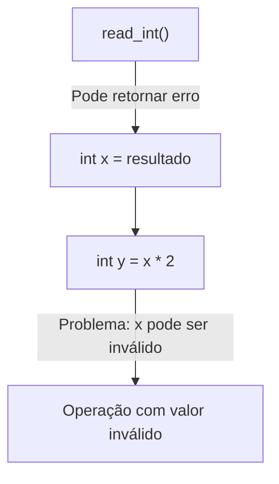

+++
title = "Try/Catch: Origem, Propósito e o Erro de Usá-lo como Fluxo Lógico"
description = "Entenda quando, por que e para que o try/catch foi criado, e por que ele não deve ser usado como controle de fluxo lógico."
date = 2025-05-23T19:41:45-03:00
tags = ["tratamento de erros", "exceções", "javascript", "typescript", "rust", "clojure", "boas práticas", "c++"]
draft = false
weight = 1
author = "Vitor Lobo Ramos"
+++


O tratamento de exceções surgiu para separar o fluxo normal do programa do tratamento de situações inesperadas, como falhas de hardware ou erros de entrada/saída. Inicialmente, programas usavam códigos de retorno para lidar com erros, mas isso era propenso a falhas e difícil de manter. 

O modelo `try/catch` foi evoluindo desde os anos 60, ganhando formas mais estruturadas em linguagens como [PL/I](https://en.wikipedia.org/wiki/PL/I), [Ada](https://en.wikipedia.org/wiki/Ada_(programming_language)), [C++](https://en.wikipedia.org/wiki/C%2B%2B) e [Java](https://en.wikipedia.org/wiki/Java_(programming_language)), e depois sendo adotado por outras como [JavaScript](https://en.wikipedia.org/wiki/JavaScript). 

O objetivo sempre foi permitir que programas lidassem de forma controlada com erros imprevisíveis, sem travar o sistema. As exceções não foram criadas para controlar o fluxo normal do programa, mas sim para tratar casos realmente excepcionais. Neste artigo, vamos ver por que usar `try/catch` como controle de fluxo é um erro e qual é o seu propósito real.


## Propósito do Try/Catch

A linguagem **[SIMULA 67](https://en.wikipedia.org/wiki/SIMULA)** – precursora da programação orientada a objetos, introduzindo conceitos como classes e herança – não possuía um sistema de tratamento de exceções idêntico ao `try/catch` moderno, mas contava com um mecanismo de tratamento de condições excepcionais (*ON-actions*) para casos como falhas de operações de **[I/O](https://en.wikipedia.org/wiki/Input/output)** (entrada/saída). 

Esse mecanismo era conceitualmente similar aos **[handlers](https://en.wikipedia.org/wiki/Error_handling#Error_handlers)** de erro introduzidos no [PL/I](https://en.wikipedia.org/wiki/PL/I) em 1964 e já demonstrava a vantagem de estruturar o código para lidar separadamente com situações de erro. Em essência, no [SIMULA](https://en.wikipedia.org/wiki/SIMULA) havia:

* **Bloco Protegido** – equivalente funcional ao bloco `try`, delimitando o código onde erros poderiam ocorrer.
* **Rotina de Tratamento (Handler)** – definida via construções `ON ... DO`, análoga ao `catch` atual, executada caso uma condição excepcional fosse detectada.

Um exemplo simplificado em pseudo-sintaxe inspirada no [SIMULA 67](https://en.wikipedia.org/wiki/SIMULA) ilustrava essa estrutura:

```simula
BEGIN  
   ON ERROR DO BEGIN  
      ! Código de recuperação (handler).  
   END;
   ! Bloco protegido (código propenso a erro).
   ...  
END;
```

Desde cedo, a ideia de separar o código principal do tratamento de erros foi vista como um grande avanço, pois deixava os programas mais organizados e fáceis de entender. O [SIMULA](https://en.wikipedia.org/wiki/SIMULA) trouxe esse conceito lá atrás, mas quem realmente mudou o jogo foi o **[Lisp](https://en.wikipedia.org/wiki/Lisp_(programming_language))**. 

Embora não tivesse a estrutura `try/catch` como conhecemos, versões do [Lisp](https://en.wikipedia.org/wiki/Lisp_(programming_language)) nos anos 1970 introduziram as funções `catch` e `throw` para lidar com situações inesperadas, evitando a necessidade de verificar códigos de erro manualmente o tempo todo. Isso foi revolucionário porque permitia que o programa “sinalizasse” que algo deu errado e saltasse diretamente para um ponto de tratamento pré-definido, sem *enrolação*. 

No [Lisp](https://en.wikipedia.org/wiki/Lisp_(programming_language)), esse mecanismo de exceção era totalmente integrado à linguagem, usando as mesmas construções do restante do código – o que demonstra sua flexibilidade e quão à frente do tempo ele estava. 

Basicamente, marcava-se um ponto de captura com uma *tag* simbólica usando `catch` e, se algo saísse errado, utilizava-se `throw` para desviar imediatamente a execução para lá, ignorando qualquer código intermediário. Essa ideia influenciou praticamente todas as linguagens modernas, embora hoje utilizemos tipos de exceção em vez de tags simbólicas como no [Lisp](https://en.wikipedia.org/wiki/Lisp_(programming_language)).

Apesar da sintaxe e implementação do [Lisp](https://en.wikipedia.org/wiki/Lisp_(programming_language)) serem bem diferentes das linguagens atuais, sua abordagem com `catch/throw` demonstrou o paradigma fundamental de desviar o fluxo de execução sem verificações explícitas de erro – conceito que inspirou os mecanismos modernos de exceções (mesmo com implementações técnicas distintas).

Consolidando essa evolução histórica, linguagens como [C++](https://en.wikipedia.org/wiki/C%2B%2B) formalizaram e refinaram esses conceitos pioneiros por meio das estruturas **`try`** e **`catch`**, introduzindo um sistema de exceções baseado em tipos. Em [C++](https://en.wikipedia.org/wiki/C%2B%2B), por exemplo, podemos proteger um bloco de código e tratar erros assim:

```cpp
try {
    // Código que pode lançar exceções
    throw std::runtime_error("Erro!");
} catch (const std::exception& e) {
    // Tratamento da exceção
    std::cerr << "Exceção capturada: " << e.what();
}
```

O objetivo principal desse mecanismo é ajudar os programadores a lidar com problemas que ocorram durante a execução de forma organizada, separando claramente a lógica normal do tratamento de erros. Ele leva adiante – e aprimora – os princípios introduzidos por linguagens como [SIMULA](https://en.wikipedia.org/wiki/SIMULA) e [Lisp](https://en.wikipedia.org/wiki/Lisp_(programming_language)), porém com uma implementação mais robusta e integrada à tipagem da linguagem.

> Nesse ponto, vale destacar um princípio essencial do livro **[The Pragmatic Programmer](https://en.wikipedia.org/wiki/The_Pragmatic_Programmer)**, que recomenda: “Crash early” — ou seja, falhe cedo e com clareza quando algo realmente inesperado ocorre. Segundo os autores, "dead programs tell no lies" — um programa que trava rapidamente pode ser mais confiável que um inválido operando silenciosamente com dados corrompidos. Isso reforça o propósito original das exceções: detectar falhas graves imediatamente, evitando consequências imprevisíveis.

Antes de explorarmos os detalhes técnicos e as melhores práticas do uso de `try/catch`, é importante entender o propósito fundamental desse mecanismo no contexto da programação moderna. O tratamento estruturado de exceções surgiu para resolver problemas clássicos de legibilidade, robustez e manutenção do código, especialmente em situações onde o fluxo normal de execução pode ser interrompido por eventos inesperados. 

A seguir, vamos analisar como o `try/catch` evoluiu historicamente, quais problemas ele resolve em relação a abordagens mais antigas (como códigos de erro) e por que sua adoção tornou-se um marco na organização e clareza dos programas:

1. **Problemas com Códigos de Erro**:
   Com códigos de retorno, o chamador pode simplesmente esquecer de verificar se ocorreu um erro. Quando isso acontece, o programa continua executando como se tudo estivesse normal, mesmo que tenha ocorrido um problema sério. 
   
O exemplo abaixo ilustra como isso pode levar a situações indesejadas – a função `read_int()` retorna um código indicando erro ou sucesso, mas se quem a chamou não conferir esse código, um valor inválido poderá ser usado em cálculo a seguir:



No diagrama, vê-se um fluxo onde `read_int()` pode indicar uma falha, mas esse retorno não é verificado ao atribuir o resultado à variável `x`. Em consequência, o programa segue seu curso normal, calculando `y = x * 2` mesmo que `x` possa conter um valor inválido. Isso resulta em uma operação com dado incorreto no final do fluxo, demonstrando como a falta de verificação de erros pode propagar problemas silenciosamente pelo programa.

2. **Separação de Preocupações**:
   Com exceções, a detecção de um erro (na função chamada) fica separada do tratamento do erro (na função chamadora). Isso permite um código mais limpo, em que a lógica principal não fica poluída por verificações de erro a cada passo. O tratamento pode ser centralizado em um único lugar, geralmente no nível mais alto da aplicação, enquanto o fluxo normal de execução permanece claro. 
   
O diagrama abaixo ilustra essa separação: o caminho principal (em azul) representa a execução bem-sucedida – inicia, processa dados, salva resultados, envia notificação e finaliza com sucesso. Porém, se em qualquer dessas etapas ocorrer uma exceção, o fluxo é desviado para o bloco de tratamento de erros (em vermelho), onde o erro é registrado e o programa termina de forma controlada.

   ```mermaid
   graph TD
       A[Início] --> B[processarDados]
       B --> C[salvarResultados]
       C --> D[enviarNotificacao]
       D --> E[Fim com Sucesso]
       
       B -->|Exceção| F[catch ErroProcessamento]
       C -->|Exceção| F
       D -->|Exceção| F
       
       F --> G[registrarErro]
       G --> H[Fim com Tratamento]
       
       style B fill:#d0e0ff,stroke:#3366cc
       style C fill:#d0e0ff,stroke:#3366cc
       style D fill:#d0e0ff,stroke:#3366cc
       style F fill:#ffe0e0,stroke:#cc6666
       style G fill:#ffe0e0,stroke:#cc6666
   ```

Esse diagrama destaca como o código principal pode se concentrar na lógica de negócio, enquanto o tratamento de erro fica isolado no bloco `catch`. Essa é a essência do `try/catch`: permitir que o fluxo “normal” do programa permaneça legível e que todo o código referente a erros esteja agrupado e bem definido em outro lugar. O resultado é um código mais organizado e de fácil manutenção.

3. **Erros Não Podem Ser Ignorados**:
   Se uma exceção não for capturada em lugar nenhum, o programa **termina** de forma controlada. Diferentemente de um código de erro que pode ser ignorado sem querer, uma exceção não tratada provoca a finalização do programa, garantindo que erros críticos não passem despercebidos. 
   
O diagrama a seguir mostra dois fluxos possíveis de um programa simples: no caminho normal, a função é executada e imprime uma mensagem ("Esta linha...") antes de retornar ao `main` e encerrar normalmente; já no caminho de erro, a função lança uma exceção (`std::runtime_error`), que não é capturada em nenhuma parte do programa, resultando no encerramento imediato da aplicação. Abaixo, temos o diagrama:

   ```mermaid
   graph TD
       A[main] --> B[funcao_que_pode_falhar]
       B -->|Execução normal| C["std::cout << 'Esta linha...'"]
       C --> D[Retorno à main]
       D --> E[return 0]
       
       B -->|throw std::runtime_error| F[Exceção não capturada]
       F --> G[Programa termina]
       
       style B fill:#f9f,stroke:#333
       style F fill:#f99,stroke:#900
       style G fill:#f99,stroke:#900
   ```

Podemos observar, em rosa, o ponto onde “dá ruim” (onde a exceção é lançada) e, em vermelho, o caminho do erro levando ao término do programa. Esse comportamento é intencional: como o próprio [Stroustrup](https://en.wikipedia.org/wiki/Bjarne_Stroustrup) explica, **“se uma função encontrar um erro que não consiga resolver, ela lança uma exceção; alguma função acima na hierarquia de chamadas pode capturá-la, mas, se ninguém o fizer, o programa termina”**. 

Embora terminar a aplicação possa parecer drástico, isso na verdade evita consequências piores, como continuar a execução com dados corrompidos. Diferente dos códigos de erro (em que o programador **precisa** lembrar de verificar cada retorno), as exceções forçam uma decisão: ou você trata o problema em algum lugar, ou o programa será finalizado. Assim, falhas graves não “passam batido”. 

Além disso, a separação clara entre lógica principal e lógica de erro torna possível garantir a liberação de recursos mesmo quando algo dá errado, graças ao comportamento do próprio mecanismo de exceções em linguagens como [C++](https://en.wikipedia.org/wiki/C%2B%2B). 

---

## **Principais Usos do `try/catch` — Exemplos Práticos em Diferentes Contextos**

O bloco `try/catch` é fundamental para lidar com eventos **realmente excepcionais** — aqueles que interrompem o fluxo normal e não podem ser resolvidos apenas com valores de retorno ou verificações simples. Exemplos clássicos: falta de memória, falhas de **[I/O](https://en.wikipedia.org/wiki/Input/output)**, corrupção de dados, ou erros lógicos imprevistos.

A seguir, os principais cenários onde o uso do `try/catch` é apropriado, já com exemplos comentados em cada contexto:

### Falhas de I/O (Arquivos, Rede, Dispositivos)

Situações em que o programa depende de recursos externos — um arquivo, uma conexão de rede, um socket — e o resultado pode variar a qualquer momento, independentemente da lógica do seu código.

```cpp
try {
    std::ifstream arq("dados.txt");
    if (!arq) throw std::runtime_error("Arquivo não abriu");
    std::string linha;
    while (std::getline(arq, linha))
        processar(linha);
} catch (const std::exception& e) {
    logErro("Falha de I/O: " + std::string{e.what()});
}
```

* **Fluxo normal:** abrir, ler, processar.
* **Fluxo de erro:** qualquer falha salta direto para o `catch`.

Esse exemplo ilustra como o `try/catch` separa claramente o fluxo principal do tratamento de erros em operações de entrada e saída (I/O). O bloco `try` contém o código que abre e lê um arquivo linha a linha, processando cada uma delas. Caso ocorra qualquer problema — como o arquivo não existir, não abrir corretamente ou surgir uma falha durante a leitura — uma exceção é lançada e imediatamente desviada para o bloco `catch`. 

Lá, o erro é tratado de forma centralizada, registrando a mensagem detalhada do problema. Assim, o código principal permanece limpo e focado na lógica de negócio, enquanto o tratamento de falhas fica isolado, tornando o programa mais robusto e fácil de manter.

> Conforme discutido por [Scott Meyers](https://en.wikipedia.org/wiki/Scott_Meyers) no seu livro **[Effective C++](https://en.wikipedia.org/wiki/Effective_C%2B%2B)**, o uso de RAII e arquiteturas seguras de exceção (exception-safe) garante que recursos sejam sempre liberados corretamente mesmo em falha, movendo o código para o nível de basic ou strong exception safety.


---

### Papel do RAII: limpeza automática

Em C++ não há `finally`, porque o RAII resolve a liberação de recursos durante o “desenrolar” da pilha:

```cpp
#include <fstream>
#include <memory>

void processarArquivo(const std::string& caminho) {
    std::ifstream f(caminho);                     // fecha sozinho no destrutor
    if (!f) throw std::runtime_error("Não abriu");

    auto buf = std::make_unique<char[]>(1024);    // libera sozinho

    f.read(buf.get(), 1024);                      // pode lançar
    // ...processa dados...
}   // Se qualquer exceção “subir”, f e buf são destruídos aqui
```

Quando uma exceção é lançada, a execução normal do programa é imediatamente interrompida. Nesse momento, todos os objetos locais têm seus destrutores chamados automaticamente, o que garante a liberação dos recursos alocados, como arquivos abertos ou blocos de memória. O controle do fluxo, então, é transferido para o bloco `catch` mais próximo que seja capaz de tratar aquela exceção.

Esse mecanismo faz com que, mesmo em situações em que “tudo dá errado”, o programa consiga fechar arquivos, devolver memória e encerrar de maneira previsível. Caso seja apropriado, o programa pode até continuar sua execução após o tratamento, dependendo da gravidade do erro e da lógica implementada.

Por outro lado, é importante não usar `try/catch` para controlar o fluxo nominal do programa. Exceções não devem ser empregadas para lidar com situações esperadas, como o fim de um arquivo durante uma leitura sequencial. Da mesma forma, se um resultado pode ser tratado por meio de valores de retorno, essa abordagem deve ser preferida. Reservar exceções para falhas realmente irrecuperáveis mantém o código mais claro e eficiente.

> Em resumo, o `try/catch` serve para isolar o código de negócio do tratamento de falhas, garantir a liberação automática de recursos (graças ao RAII) e evitar que erros críticos passem despercebidos. Essa separação contribui para a clareza, robustez e manutenibilidade do software.

## Tratamento de Exceções em Diferentes Contextos

Agora que vimos **por que** e **quando** usar `try/catch`, vamos explorar o mecanismo em ação em cenários do dia a dia. Os exemplos abaixo seguem o mesmo princípio apresentado na seção anterior:

> **separe a lógica "feliz" do que acontece quando algo dá errado**.

### Gerenciamento de recursos

```cpp
void processar() {
    auto dados = std::make_unique<Buffer>(1024);   // libera sozinho

    try {
        dados->carregar();
        dados->processar();
        dados->salvar();
    } catch (...) {
        logErro("Falha no processamento, propagando...");
        throw;                                     // sobe para quem souber tratar
    }                                             // `dados` é liberado aqui
}
```

* O `unique_ptr` garante liberação, dispensando `finally`.
* O bloco `catch` adiciona contexto e re‑lança.

O exemplo acima ilustra como o uso combinado de `try/catch` e RAII (através do `unique_ptr`) simplifica o gerenciamento de recursos em C++. Ao encapsular a lógica principal dentro de um bloco `try`, garantimos que qualquer exceção lançada durante o carregamento, processamento ou salvamento dos dados seja capturada no `catch`, onde podemos registrar o erro e, se necessário, propagar a exceção para níveis superiores. 

O uso do `unique_ptr` assegura que a memória alocada para o buffer será automaticamente liberada ao final do escopo, mesmo que uma exceção ocorra — eliminando a necessidade de blocos `finally` ou liberações manuais. 

> Assim, o código permanece limpo, seguro e robusto, pois separa claramente o fluxo normal do tratamento de falhas, um dos principais propósitos do mecanismo de exceções discutido neste artigo.


### Validação de dados

```cpp
class Usuario {
public:
    void setIdade(int idade) {
        if (idade < 0 || idade > 120)
            throw std::invalid_argument("Idade fora do intervalo permitido");
        idade_ = idade;
    }
private:
    int idade_{};
};

try {
    Usuario u;
    u.setIdade(valorLido);
} catch (const std::invalid_argument& e) {
    logErro("Entrada inválida: " + std::string{e.what()});
}
```

* A regra de negócio fica **dentro** da classe.
* Quem usa a API só precisa lidar com a exceção, sem checar retornos.

O exemplo acima demonstra como encapsular regras de validação diretamente na classe, lançando exceções quando os dados não atendem aos critérios esperados (por exemplo, uma idade fora do intervalo permitido). Isso centraliza a lógica de negócio e simplifica o uso da API, pois quem consome a classe só precisa tratar possíveis exceções, sem se preocupar em checar retornos de erro manualmente. 

> Esse padrão torna o código mais limpo, seguro e fácil de manter, além de separar claramente o fluxo normal do tratamento de falhas. Essa abordagem de propagação de exceções é especialmente útil em cenários mais complexos, como operações transacionais, que veremos a seguir.

### Transações atômicas

```cpp
void transferir(Conta& a, Conta& b, double v) {
    if (v <= 0) throw std::invalid_argument("valor <= 0");

    std::lock_guard lk1(a.mtx());
    std::lock_guard lk2(b.mtx());

    try {
        a.debitar(v);
        b.creditar(v);
    } catch (...) {          // qualquer erro ⇒ rollback
        a.creditar(v);
        throw;
    }
}
```

* **All‑or‑nothing**: ou ambas as contas mudam, ou nada persiste.
* `lock_guard` solta os mutexes mesmo em caso de exceção.

> **⚠️ Nota sobre deadlock**: Este exemplo assume ordem consistente de aquisição de locks entre threads. Em produção, use `std::scoped_lock<std::mutex, std::mutex> lk(a.mtx(), b.mtx())` (C++17+) que adquire ambos os mutexes simultaneamente sem risco de deadlock, ou garanta uma ordenação determinística (ex: sempre adquirir primeiro o mutex da conta com menor endereço de memória).

O exemplo acima ilustra como implementar uma operação transacional utilizando exceções para garantir a atomicidade: se qualquer etapa da transferência falhar (por exemplo, por saldo insuficiente ou erro inesperado), o código faz o rollback debitando e depois creditando novamente o valor na conta de origem, antes de propagar a exceção. 

O uso de `lock_guard` assegura que os mutexes das contas sejam liberados automaticamente, mesmo em caso de erro, evitando deadlocks e vazamentos de recurso. 

> Esse padrão é fundamental em sistemas financeiros e outros domínios críticos, pois assegura que as alterações de estado sejam consistentes e não deixem o sistema em situação intermediária caso ocorra uma falha. 

A seguir, veremos como enriquecer o contexto das exceções ao longo das camadas da aplicação, facilitando o diagnóstico e a rastreabilidade dos erros.

### Enriquecendo contexto em camadas

```cpp
void baixa()  { /* ... */ throw std::runtime_error("DB offline"); }
void media()  { try { baixa(); }
                catch (const std::exception& e) {
                    throw std::runtime_error("Camada média: " + std::string{e.what()});
                }}
void alta()   { try { media(); }
                catch (const std::exception& e) {
                    throw std::runtime_error("Camada alta: "  + std::string{e.what()});
                }}
```

O objetivo desse padrão é fornecer uma trilha clara e detalhada do caminho percorrido pelo erro, desde sua origem até o ponto mais alto da pilha de chamadas. Ao enriquecer a mensagem de exceção em cada camada, o desenvolvedor consegue identificar rapidamente onde o problema começou e por quais etapas ele passou, facilitando o diagnóstico e a correção. Esse encadeamento de mensagens resulta em um relatório final como:

```
"Camada alta: Camada média: DB offline"
```

Exceções devem ser usadas exclusivamente para situações realmente excepcionais, ou seja, aquelas que impedem o fluxo normal do programa de continuar. Não utilize exceções para controlar o fluxo rotineiro da aplicação, pois isso pode tornar o código confuso, difícil de manter e impactar negativamente a performance.

> Algumas boas práticas são fundamentais para um uso correto do `try/catch`: sempre capture tipos específicos de exceção primeiro, evitando tratar tudo como erro genérico; nunca ignore exceções silenciosamente — registre o erro ou converta-o em um erro de domínio; em C++, garanta o uso de RAII (Resource Acquisition Is Initialization) para liberar recursos automaticamente, dispensando a necessidade de blocos `finally` e prevenindo vazamentos (em outras linguagens, utilize os mecanismos equivalentes, como `with` em Python ou `using` em C#).

Documente claramente quais exceções sua função pode lançar, facilitando o uso e os testes; e lembre-se de que lançar exceções tem custo, então não utilize esse mecanismo para situações comuns do fluxo de controle.

---

### Má prática de design — quando o `try/catch` vira gambiarra

No tópico anterior, vimos quando é apropriado lançar exceções; agora, é importante abordar o outro lado: o que acontece quando utilizamos `try/catch` para tratar situações que não são realmente excepcionais. Usar exceções como substituto de verificações normais, como um simples `if`, é considerado um anti-padrão e pode trazer consequências negativas para a clareza, desempenho e manutenção do código. Observe o exemplo abaixo:

```ts
// ❌  Exceção controlando fluxo normal
function getItemPrice(item: { name: string; price?: number }): number {
  try {
    if (item.price === undefined)            // caso esperado
      throw new Error("Preço indefinido");   // força exceção
    return item.price;
  } catch {
    return 0;                                // valor padrão
  }
}
```

Usar exceções para tratar situações rotineiras, como uma simples validação de campo, é prejudicial por vários motivos. Primeiro, isso surpreende quem lê o código, pois dá a impressão de que ocorreu uma falha grave, quando na verdade é apenas um caso esperado e trivial — quebrando o [Princípio do Menor Espanto (POLA)](https://en.wikipedia.org/wiki/Principle_of_least_astonishment). 

Além disso, lançar e capturar exceções é uma operação significativamente mais custosa do que um simples `if`. Embora o modelo C++ use **"zero-cost exceptions"** — que na verdade significa zero custo apenas no *caminho normal* — o custo de lançar uma exceção é extremamente alto. Como explica [Raymond Chen](https://devblogs.microsoft.com/oldnewthing/20220228-00/?p=106296), da Microsoft, o termo é equivocado: *"Metadata-based exception handling should really be called super-expensive exceptions"*.

O processo envolve: busca por metadados no PC (program counter), decodificação de dados DWARF compactados, chamadas ao *personality routine*, e o custoso **stack unwinding**. [Herb Sutter](https://isocpp.org/blog/2019/09/cppcon-2019-de-fragmenting-cpp-making-exceptions-and-rtti-more-affordable-a) demonstra que exceções violam o *zero-overhead principle* do C++, sendo uma das únicas duas funcionalidades da linguagem (junto com RTTI) que têm opções para serem desabilitadas pelos compiladores.

Adicionalmente, mesmo quando não lançadas, exceções limitam otimizações do compilador: antes de qualquer operação que pode gerar exceção, o compilador deve descarregar registradores para memória e evitar reordenações que quebrariam a semântica de unwinding. As [C++ Core Guidelines](https://isocpp.github.io/CppCoreGuidelines/CppCoreGuidelines#e3-use-exceptions-for-error-handling-only) enfatizam que "exceptions are for error handling only" e que usar exceções para controle de fluxo normal "makes code hard to follow and maintain."

> Essa ideia está diretamente alinhada ao conselho do livro **[The Pragmatic Programmer](https://en.wikipedia.org/wiki/The_Pragmatic_Programmer)**: trate apenas o que realmente é excepcional como exceção — caso contrário, você adiciona complexidade desnecessária e viola princípios como [Principle of Least Astonishment](https://en.wikipedia.org/wiki/Principle_of_least_astonishment).

> Além disso, conforme [Matt Klein](https://en.wikipedia.org/wiki/Matt_Klein) discute, verificações desnecessárias geram dívida de manutenção, e o único “erro checking” que importa são aqueles que realmente podem ocorrer no fluxo normal.

Outro problema é que esse uso inadequado de exceções [polui o stack-trace](https://en.wikipedia.org/wiki/Stack_trace), tornando mais difícil depurar e analisar o comportamento do sistema. O excesso de exceções desnecessárias pode mascarar erros reais, dificultar o profiling e tornar o código mais difícil de manter. 

Por isso, para validações simples e previsíveis, prefira sempre estruturas de controle explícitas, reservando as exceções apenas para situações realmente inesperadas ou graves. Vamos ver um exemplo idiomático em TypeScript:


```ts
// ✅  Fluxo explícito, sem exceção
function getItemPrice(item: { name: string; price?: number }): number {
  return item.price ?? 0;     // se undefined, usa 0
}
```

O resultado de evitar exceções para casos esperados é um código mais claro, eficiente e sem armadilhas ocultas. Em vez de usar `try/catch` para controlar fluxos normais, prefira estruturas explícitas como `if`, valores opcionais (`std::optional`, `std::expected`, `nullish ??`) ou retornos convencionais. 

> Assim, situações como campo obrigatório não preenchido, busca sem resultado ou divisão por zero prevista são tratadas de forma transparente e previsível, sem sobrecarregar o sistema com o custo e a complexidade das exceções.

Já para eventos realmente excepcionais — como disco cheio, queda de conexão, corrupção de dados ou necessidade de desfazer uma operação crítica — o uso de exceções (`throw`) é apropriado. 

Nesses casos, não há como prever ou contornar o problema apenas com verificações simples, e a exceção serve para interromper o fluxo e sinalizar que algo grave aconteceu, permitindo que o erro seja tratado em um nível superior ou que o programa seja encerrado de forma segura.

Diversas linguagens modernas reforçam essa separação: Rust exige retornos explícitos para erros esperados e reserva exceções (`panic!`) para bugs; Clojure trata erros como valores e só lança exceção em último caso; TypeScript incentiva o uso de tipos como `unknown` e alternativas funcionais como `Either`. 

Todas seguem o mesmo princípio: erros previsíveis devem ser tratados como dados, enquanto exceções ficam para situações realmente imprevisíveis. Assim, lançar exceção só quando necessário aproxima o erro da sua origem, evita estados inconsistentes e facilita o diagnóstico, enquanto o uso excessivo só dificulta a manutenção e a clareza do código. 

#### Alternativa correta: retorno explícito de erro

Para casos previsíveis como divisão por zero, a abordagem ideal é usar tipos como `std::optional` que tornam a possibilidade de falha explícita:

```cpp
std::optional<int> dividir_seguro(int a, int b) {
    if (b == 0) return std::nullopt;   // falha previsível
    return a / b;
}

// Uso claro e sem exceções
auto media = dividir_seguro(a, b);     // retorno explícito
if (!media) {                          // falha prevista
    log("b = 0, usando valor padrão");
} else {
    usar(*media);
}
```

No exemplo apresentado acima, vemos que tratar situações esperadas com exceções — como retornar 0 quando o preço está indefinido — prejudica a clareza e a eficiência do código. Isso ocorre porque exceções interrompem o fluxo normal e impactam significativamente otimizações do compilador: impedem marcação de funções com `noexcept` (essencial para move semântics eficientes na STL), forçam spilling de registradores para memória, e limitam reordenação de instruções que poderiam melhorar o pipeline do processador. 

O ideal é reservar exceções para eventos realmente inesperados, como um air-bag que só deve ser acionado em caso de acidente, enquanto validações de domínio e casos previstos devem ser tratados com retornos explícitos, usando estruturas como `if`, valores opcionais ou operadores como `??`. 

> Linguagens modernas reforçam essa separação ao tratar erros esperados como dados e reservar exceções para situações imprevisíveis. Seguindo essas práticas, seu código permanece limpo, eficiente e fácil de manter, pois cada ferramenta é usada para o propósito correto, evitando surpresas e facilitando o diagnóstico de problemas reais.


---

### Design by Contract e asserções

Beleza, mas como decidir, de forma objetiva, o que é “inesperado”? A resposta clássica vem do **[Design by Contract (DbC)](https://en.wikipedia.org/wiki/Design_by_contract)** de [Bertrand Meyer](https://en.wikipedia.org/wiki/Bertrand_Meyer).

O **Design by Contract** (DbC) é um paradigma de desenvolvimento que define um contrato explícito entre um componente e seus clientes, garantindo que ambos entendam as expectativas e as responsabilidades. O DbC estabelece três elementos essenciais:

1. **Pré-condições**: Obrigações que devem ser satisfeitas pelo chamador antes de invocar uma operação.
2. **Pós-condições**: Garantias que a operação fornece quando as pré-condições são atendidas.
3. **Invariantes**: Propriedades que devem ser mantidas ao longo do tempo.

Se a pré-condição de uma função não for atendida, ou seja, se o uso já começa errado (por exemplo, tentar sacar um valor negativo ou maior que o saldo), lançar uma exceção é apropriado, pois indica um erro de uso da interface; por outro lado, se a violação da pré-condição é algo frequente e esperado, como um campo vazio em um formulário, o ideal é tratar esse caso antes mesmo de chamar a função, evitando o uso de exceções para fluxos normais. 

O exemplo abaixo em C++ abaixo ilustra como aplicar esse princípio, diferenciando claramente quando lançar exceção por violação de contrato e quando validar previamente:

```cpp
class Conta {
    double saldo_{0};                       // invariante: ≥ 0
public:
    void sacar(double v) {
        if (v <= 0)                      // pré‑condição violada → erro do usuário
            throw std::invalid_argument("valor ≤ 0");
        if (v > saldo_)                  // pré‑condição violada → uso incorreto
            throw std::domain_error("saldo insuficiente");

        double antigo = saldo_;
        saldo_ -= v;

        if (saldo_ != antigo - v)        // pós‑condição falhou → erro interno
            throw std::logic_error("sacar corrompeu saldo");
        assert(saldo_ >= 0);             // invariante (desligada em release)
    }
};
```


#### Programação com **asserções**

* **O que são:** checagens de *bugs* de desenvolvimento, desativadas em builds release.
* **Quando usar:** para invariantes internas e estados “impossíveis”.
* **Quando *não* usar:** para validar entrada de usuário ou recursos externos (isso é papel de exceção ou valor de retorno).

```cpp
void push(Buffer& buf, int x) {
    assert(!buf.cheio());          // bug se falhar em dev
    buf.escreve(x);
}
```

O código apresentado acima ilustra como aplicar, de forma prática, os princípios do [Design by Contract (DbC)](https://en.wikipedia.org/wiki/Design_by_contract) e o uso de asserções para garantir a robustez do software. Cada tipo de situação exige uma ferramenta adequada: bugs internos, como a quebra de invariantes, devem ser detectados com `assert` (que só dispara em modo debug); violações de pré-condições, ou seja, quando o usuário utiliza a interface de forma incorreta, são tratadas com exceções específicas como `invalid_argument` ou `domain_error`.

Falhas em recursos externos, como problemas de I/O ou falta de memória, são sinalizadas por exceções de runtime (`ios_base::failure`, `bad_alloc`); e, finalmente, situações esperadas e frequentes, como um campo opcional vazio, devem ser representadas por tipos como `std::optional`, `std::expected` ou códigos de status, evitando o uso de exceções para o fluxo normal.

O mini-checklist apresentado resume o contrato em três etapas: primeiro, garantir as pré-condições (validando entradas e lançando exceções quando necessário); segundo, executar o trabalho principal da função; e, por fim, verificar as pós-condições e usar asserções para garantir que as invariantes do objeto foram mantidas. 

Assim, o chamador sabe exatamente o que precisa fornecer, a função garante o resultado correto ou lança uma exceção se não puder cumprir, e o objeto permanece sempre em um estado válido. Essa abordagem torna o código mais seguro, previsível e fácil de manter.

> Isso fecha, de forma formal, o ciclo começado lá atrás: *"exceção para o inesperado, valor para o esperado, assert para o impossível"*.

Até aqui vimos que **pré‑/pós‑condições e asserções** deixam claro *o que* cada parte deve cumprir — e que exceções só aparecem quando o contrato é quebrado. Mas o inverso também é verdadeiro: **quando usamos exceções para controlar o fluxo diário, criamos contratos escondidos** que amarram módulos sem ninguém notar.

Quando usamos exceções para controlar o fluxo normal do programa, criamos dependências ocultas entre módulos: o cliente precisa conhecer os tipos de exceção internos do serviço, o que torna o contrato implícito — afinal, as ações a serem tomadas em caso de erro (“se der erro X faça Y”) não aparecem na assinatura da função, mas apenas nos blocos `catch` espalhados pelo código. 

Isso gera fragilidade, pois qualquer alteração nos tipos de exceção ou nas condições que as disparam pode quebrar vários pontos do sistema, como ilustrado no exemplo em C++ abaixo, onde o serviço lança exceções específicas e o cliente é obrigado a capturar cada uma delas individualmente. Observe o exemplo abaixo:

```cpp
// Serviço lança tipos específicos  ➜  Cliente precisa capturar cada um
try {
    auto* u = auth.autenticar(user, pass);
} catch(const UsuarioNaoEncontrado&) { … }
  catch(const SenhaInvalida&)       { … }
```

Quando um serviço lança exceções específicas para sinalizar falhas, qualquer alteração nesses tipos de erro obriga o desenvolvedor a revisar e atualizar todos os blocos `catch` espalhados pelo código cliente. 

> **Isso cria um acoplamento invisível entre módulos**: o cliente precisa conhecer detalhes internos do serviço para capturar corretamente cada exceção, tornando a manutenção mais trabalhosa e sujeita a erros. O controle de fluxo baseado em exceções, nesse contexto, esconde contratos importantes e dificulta a evolução segura da API.

Para tornar o contrato explícito e facilitar a manutenção, o C++23 introduziu o `std::expected<T, E>`, que incorpora o erro ao próprio tipo de retorno da função. Assim, a assinatura já deixa claro para o usuário todas as possibilidades de sucesso ou falha, como no exemplo abaixo:

```cpp
std::expected<Usuario*, ErroAuth>
autenticar(std::string_view user, std::string_view pass);
```

O resultado é um código menos acoplado, mais documentado e mais seguro. Pois, o usuário da função já sabe todas as possibilidades de sucesso ou falha, e o compilador força o tratamento via `resultado.error()`.

---

### Testabilidade e caminhos de erro

Na seção anterior, vimos que tornar os contratos explícitos e como é possível reduzir o acoplamento entre módulos e deixa o código mais robusto. Um benefício imediato dessa abordagem é a facilidade de testar: quando o erro é representado como valor de retorno, fica muito mais simples cobrir todos os caminhos possíveis em testes unitários, sem depender de manipulação de exceções. 

> Isso está totalmente alinhado com o conselho do livro **Pragmatic Programmer** que diz: “**Test your software, or your users will**”. Ou seja, "se você não testar seu software, seus usuários vão testar".

Cenários de erro merecem atenção especial nos testes, pois é justamente no tratamento de falhas que costumam aparecer os bugs mais críticos. Testar apenas o “caminho feliz” não garante a qualidade do sistema. Além disso, garantir que mudanças internas não quebrem o contrato de erro é fundamental para evitar regressões. Testes bem escritos também funcionam como documentação viva, mostrando claramente como o sistema reage a cada tipo de problema.

Por outro lado, quando o tratamento de falhas depende de exceções, surgem desafios práticos. Simular e capturar exceções em testes exige o uso de mocks que lançam erros, além de poluir o código de teste com blocos `try-catch` ou macros como `EXPECT_THROW`. Isso pode prejudicar a legibilidade e facilitar a omissão de casos importantes, já que é fácil esquecer de testar um `catch` específico. O resultado é uma cobertura de testes parcial e menos confiável.

Ao adotar contratos explícitos, como no exemplo em C++ abaixo usando `std::expected`, o teste se torna mais direto: basta verificar o valor retornado, sem precisar capturar exceções. Isso simplifica o código de teste, aumenta a clareza e garante que todos os ramos — inclusive os de erro — sejam exercitados de forma sistemática. 

Assim, além de reduzir o acoplamento, esse padrão melhora a testabilidade e contribui para a manutenção segura do software. Abaixo, vamos ver como testar o código com contratos explícitos e como testar o código com exceções:

1. **Mocks que simulam falha**

   ```cpp
   class IServico { public: virtual Dados get(std::string) = 0; };
   class MockFalho : public IServico {
       std::exception_ptr ex_;
   public:
       void setFalha(const std::string& msg) {
           ex_ = std::make_exception_ptr(std::runtime_error(msg));
       }
       Dados get(std::string) override { std::rethrow_exception(ex_); }
   };
   ```

   Teste foca em como o *consumidor* reage, sem depender do serviço real.

2. **Retorno explícito para casos esperados**

   ```cpp
   struct Resultado { bool ok; std::string erro; Dados dados; };

   Resultado processar(const Entrada& in) {
       if (!valido(in)) return {false,"Entrada inválida",{}};
       // ...
       return {true,"",dados};
   }
   // Teste
   EXPECT_FALSE(processar(invalido).ok);
   ```

3. **`std::expected` (C++23)** – contrato de erro no tipo

   ```cpp
   std::expected<Dados,ErroIO> lerArquivo(...);
   ASSERT_FALSE(lerArquivo(path).has_value());
   ```

4. **Testes de propriedade** – use frameworks como *rapidcheck* ou *Catch2 generators* para iterar entradas aleatórias e garantir:

   * “Nenhum input válido gera exceção”.
   * “Toda falha retorna erro não‑vazio”.

5. **Ambiente de integração controlado** – docker de DB que cai, servidor fake que devolve *timeouts*; reproduz falhas reais sem mexer no prod.

---

## Referências

1. [**"The Pragmatic Programmer: Your Journey to Mastery"** - David Thomas & Andrew Hunt](https://a.co/d/8ZBw0ix)  
   *Apresenta o princípio "Crash Early" e outras práticas essenciais para programação profissional, incluindo tratamento de erros e resiliência em sistemas.
2. [**"Effective Modern C++: 42 Specific Ways to Improve Your Use of C++11 and C++14"** - Scott Meyers](https://a.co/d/1L2Bwz4)  
   *Discute técnicas modernas de C++, incluindo o uso correto de exceções e alternativas como `std::optional`.*
3. [**"Programming: Principles and Practice Using C++"** - Bjarne Stroustrup](https://a.co/d/3Wy2dFE)  
   *O criador do C++ explica fundamentos da linguagem, incluindo tratamento de erros e quando usar exceções.*
4. [**"The Rust Programming Language" (Livro Oficial)** - Steve Klabnik & Carol Nichols](https://a.co/d/a4zoUcs)  
   *Explica o sistema de `Result` e `Option` do Rust, que evita exceções.*
5. [**"Clojure for the Brave and True"** - Daniel Higginbotham](https://a.co/d/4geTFbr)  
   *Aborda a filosofia de tratamento de erros em Clojure usando valores e mapas.*
6. [**"Designing Data-Intensive Applications"** - Martin Kleppmann](https://a.co/d/8oEH9z4)  
   *Discute tolerância a falhas em sistemas distribuídos, complementando o conceito de "graceful failure".*
7. [**"Release It!: Design and Deploy Production-Ready Software"** - Michael T. Nygard](https://a.co/d/66ya4UP)  
    *Ensina padrões como "Circuit Breaker" para lidar com erros em produção.*
8. [**"Functional Light JavaScript"** - Kyle Simpson](https://a.co/d/5bg0IIB)  
    *Mostra como aplicar conceitos funcionais (incluindo tratamento de erros sem exceções) em JavaScript.*
9. [**"Domain Modeling Made Functional"** - Scott Wlaschin](https://a.co/d/9S37n8W)  
    *Usa F# para demonstrar como tipos como `Result` podem modelar erros de forma explícita.*