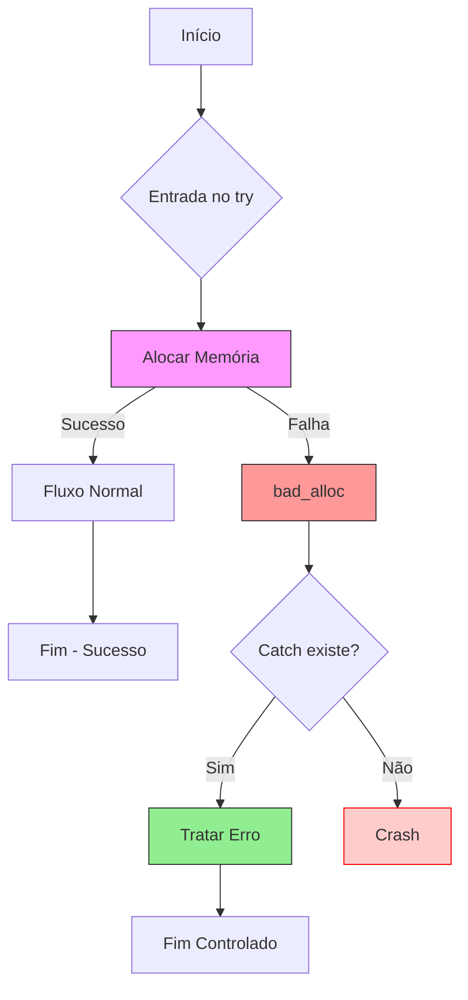
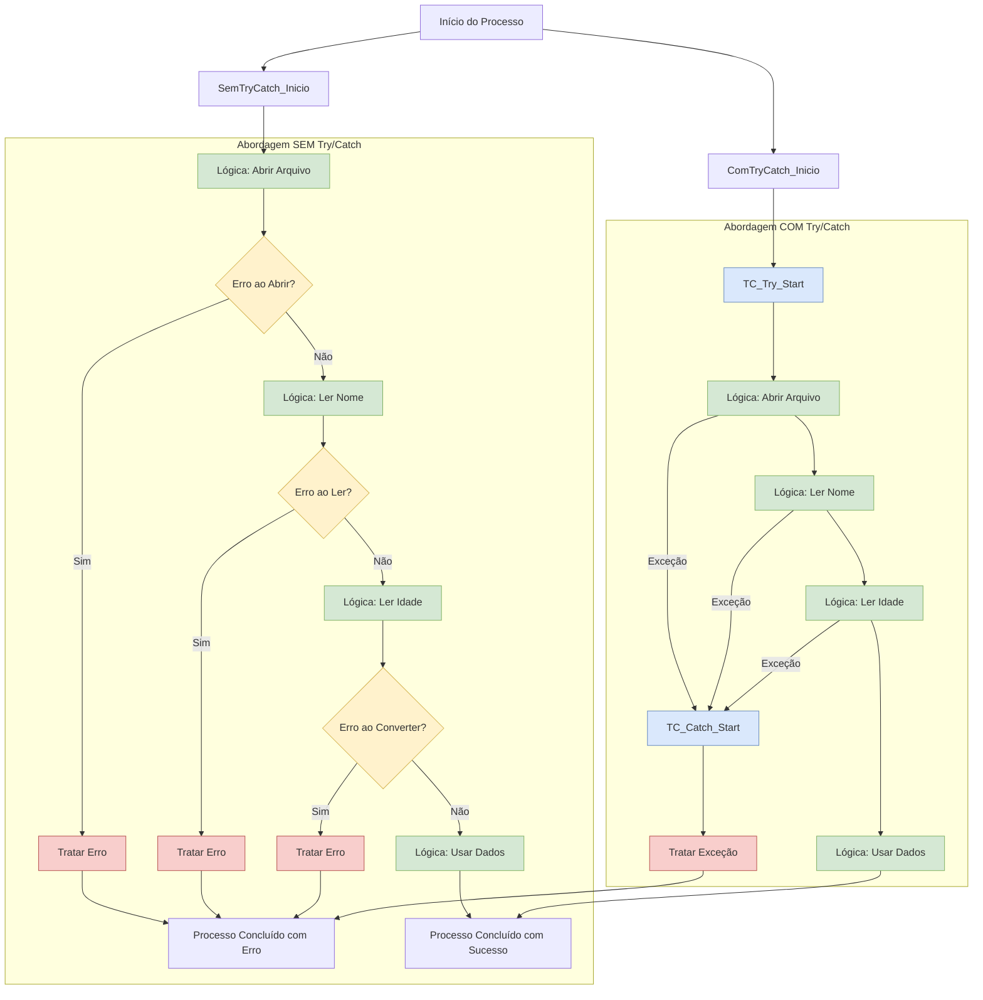
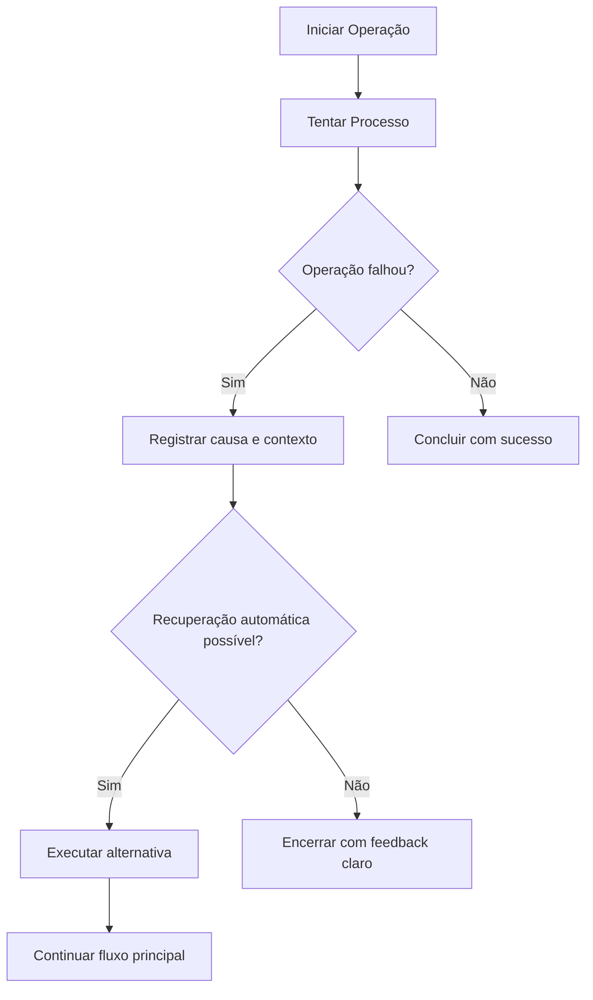
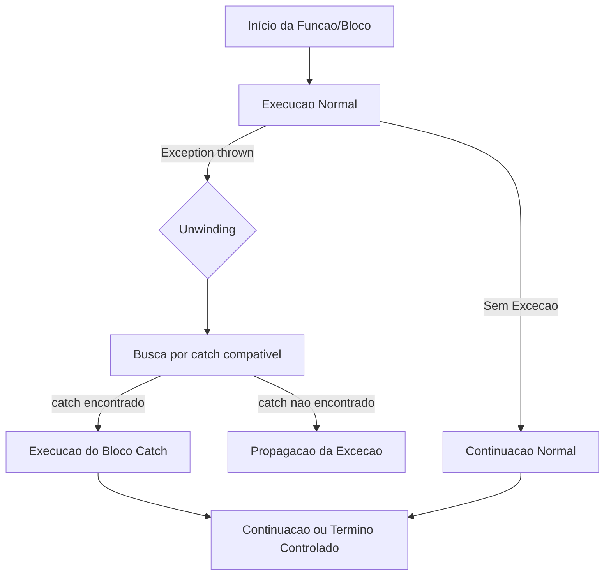
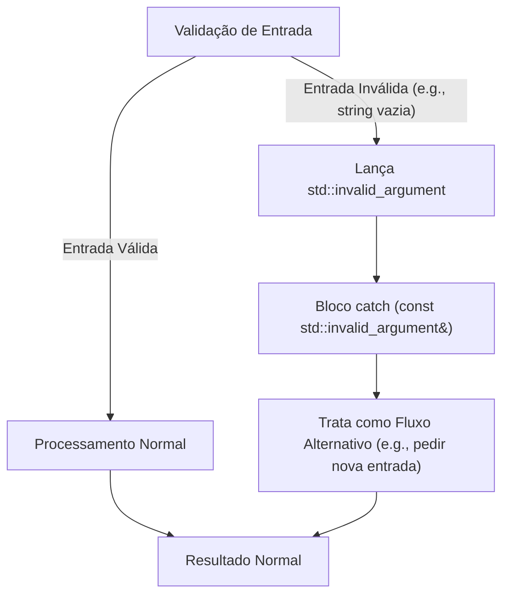
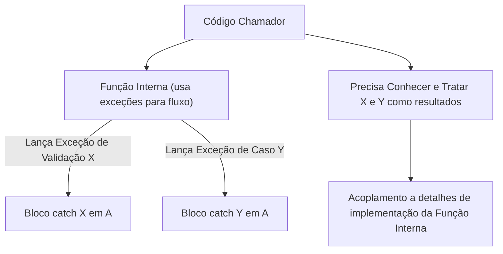
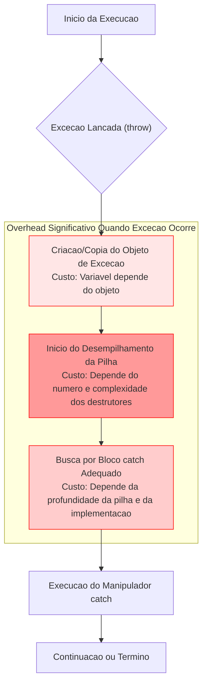
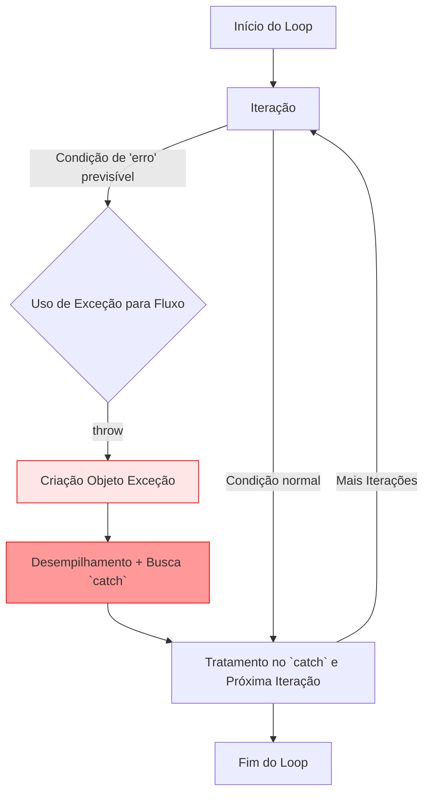
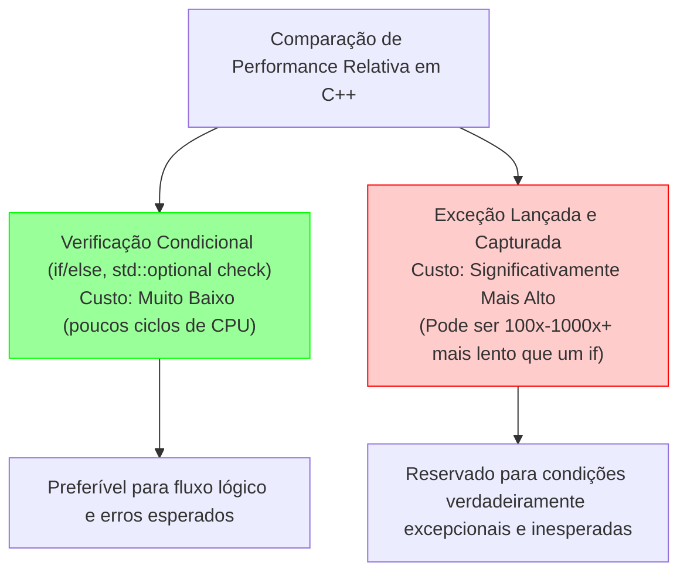

+++
title = "Try/Catch: Origem, Propósito e o Erro de Usá-lo como Fluxo Lógico"
description = "Entenda quando, por que e para que o try/catch foi criado, e por que ele não deve ser usado como controle de fluxo lógico."
date = 2025-05-23T19:41:45-03:00
tags = ["tratamento de erros", "exceções", "javascript", "typescript", "rust", "clojure", "zig", "boas práticas"]
draft = false
weight = 1
author = "Vitor Lobo Ramos"
+++


O conceito de [tratamento de exceções](https://en.wikipedia.org/wiki/Exception_handling), incluindo o `try/catch`, surgiu nos anos 70 com linguagens como **[PL/I](https://en.wikipedia.org/wiki/PL/I)** e **[Ada](https://en.wikipedia.org/wiki/Ada_(programming_language))**, que criaram formas mais organizadas de lidar com erros. Antes disso, os programas usavam [códigos de retorno](https://en.wikipedia.org/wiki/Return_code) ou checagens manuais, o que deixava o código cheio de bugs e difícil de manter. A ideia era simples: separar o que o programa faz normalmente de como ele lida com as coisas que dão errado, como falhas de hardware, problemas de [entrada/saída](https://en.wikipedia.org/wiki/Input/output) ou quando alguém tenta [dividir por zero](https://en.wikipedia.org/wiki/Division_by_zero).

O `try/catch` que a gente conhece hoje ([ISO C++ Standard - Exception Handling](https://isocpp.org/wiki/faq/exceptions)) se popularizou com **[C++](https://en.wikipedia.org/wiki/C%2B%2B#Exception_handling)** (nos anos 80) e **[Java](https://en.wikipedia.org/wiki/Java_(programming_language)#Exception_handling)** (1995), e depois foi adotado pelo [JavaScript](https://en.wikipedia.org/wiki/JavaScript#Exception_handling) ([ECMAScript 3](https://en.wikipedia.org/wiki/ECMAScript), 1999). Ele foi feito para pegar **[exceções](https://en.wikipedia.org/wiki/Exception_(computer_science))** — coisas inesperadas que interrompem o programa, tipo quando a internet cai, quando acaba a memória do computador (ex: `std::bad_alloc`) ou quando o programa tenta acessar dados que não existem — permitindo que os devs tratassem esses problemas sem o programa travar.

Na época, o objetivo era ter uma forma confiável de lidar com **[erros que ninguém consegue prever](https://en.wikipedia.org/wiki/Fault_tolerance)** em sistemas complexos, garantindo que o programa pudesse se recuperar ou pelo menos falhar "de boa" (gracefully). O `try/catch` foi inspirado pela ideia de **[tolerância a falhas](https://en.wikipedia.org/wiki/Fault_tolerance)**, comum em [sistemas operacionais](https://en.wikipedia.org/wiki/Operating_system#Reliability) e aplicações críticas, onde o serviço não pode parar.

> **Nota:** Quando falamos que algo falha "gracefully" ou "de boa", queremos dizer que o programa quebra de um jeito controlado, sem explodir todo o sistema.

Um ponto importante: o tratamento de exceções foi criado como uma alternativa aos jeitos antigos de [verificar erros](https://en.wikipedia.org/wiki/Error_handling), não como uma ferramenta para controlar o [fluxo normal](https://en.wikipedia.org/wiki/Control_flow) do programa. Linguagens como [CLU](https://en.wikipedia.org/wiki/CLU_(programming_language)), desenvolvida no [MIT](https://en.wikipedia.org/wiki/Massachusetts_Institute_of_Technology) nos anos 70, já deixavam isso bem claro, estabelecendo as bases do que viria a ser o modelo de exceções que usamos hoje.

Neste artigo, vamos explorar de onde veio o `try/catch`, para que ele foi criado originalmente e por que usá-lo para controlar o fluxo lógico do programa é uma péssima ideia. Embora o `try/catch` seja uma ferramenta poderosa para lidar com erros, ele foi feito para situações excepcionais, e não para gerenciar a lógica do negócio.

## Sumário

- [Propósito do Try/Catch](#propósito-do-trycatch)
  - [Problemas com Códigos de Erro](#problemas-com-códigos-de-erro)
  - [Separação de Preocupações](#separação-de-preocupações)
  - [Erros Não Podem Ser Ignorados](#erros-não-podem-ser-ignorados)
  - [RAII e Segurança de Exceção](#raii-e-segurança-de-exceção)
    - [Como o RAII Protege Seus Recursos](#como-o-raii-protege-seus-recursos)
    - [Exemplos de RAII na Biblioteca Padrão](#exemplos-de-raii-na-biblioteca-padrão)
- [Por que Usar Try/Catch como Fluxo Lógico é Errado](#por-que-usar-trycatch-como-fluxo-lógico-é-errado)
  - [Contrato Implícito](#contrato-implícito)
  - [Interrupção Abrupta do Fluxo](#interrupção-abrupta-do-fluxo)
  - [Exception Safety e Funções Make](#exception-safety-e-funções-make)
  - [Impacto no Design de APIs](#impacto-no-design-de-apis)
  - [Desempenho e Custo das Exceções](#desempenho-e-custo-das-exceções)
    - [O Impacto do `noexcept` nas Otimizações](#o-impacto-do-noexcept-nas-otimizações)
- [Quando Usar Try/Catch?](#quando-usar-trycatch)
  - [Falhas de Sistema e Recursos Externos](#falhas-de-sistema-e-recursos-externos)
  - [Validação de Entrada em APIs Públicas](#validação-de-entrada-em-apis-públicas)
  - [Recuperação de Estados Inconsistentes](#recuperação-de-estados-inconsistentes)
  - [Em Ambientes de Alto Nível](#em-ambientes-de-alto-nível)
- [Alternativas ao Try/Catch para Fluxo Lógico](#alternativas-ao-trycatch-para-fluxo-lógico)
  - [Verificações Condicionais](#verificações-condicionais)
  - [Tipos de Resultado](#tipos-de-resultado)
  - [Objetos de Resultado](#objetos-de-resultado)
  - [Validações Prévias](#validações-prévias)
  - [Abordagens em Outras Linguagens](#abordagens-em-outras-linguagens)
- [Boas Práticas para Uso do Try/Catch](#boas-práticas-para-uso-do-trycatch)
- [Referências](#referências)

## Propósito do Try/Catch

O `try/catch` é uma ferramenta essencial em várias linguagens como C++, criada para lidar com erros. Seu objetivo principal é ajudar os programadores a tratar problemas que acontecem durante a execução do programa de forma organizada. Bjarne Stroustrup, criador do C++, discute em seu livro ["Programming: Principles and Practice Using C++"](https://a.co/d/3Wy2dFE) que as exceções foram criadas para resolver problemas fundamentais com os métodos tradicionais de retorno de códigos de erro:

1. **Problemas com Códigos de Erro**:
   - O chamador pode esquecer de verificar o valor de retorno de erro.
     - O exemplo abaixo mostra como isso pode levar a problemas. Aqui, `read_int()` retorna um código de erro se a leitura falhar, mas o chamador não verifica o valor de retorno, resultando em um valor inválido sendo usado em uma operação:
     ```c
     int x = read_int();  // Se read_int() retornar um código de erro, x terá um valor inválido
     int y = x * 2;       // Continuamos usando x sem verificar se houve erro
     ```

2. **Separação de Preocupações**:
   - As exceções separam a detecção de erros (na função chamada) do tratamento de erros (na função chamadora)
   - Isso permite um código mais limpo, onde a lógica principal não fica poluída com verificações de erro
        - O exemplo abaixo mostra como o tratamento de erros pode ser centralizado em um único lugar. Pois, o tratamento de erros não está poluindo o fluxo normal de execução:
     ```c
     // Com try/catch - código principal limpo
     try {
       processarDados();
       salvarResultados();
       enviarNotificacao();
     } catch (ErroProcessamento& e) {
       // Tratamento centralizado aqui
       registrarErro(e);
     }
     ```

3. **Erros Não Podem Ser Ignorados**:
   - Se uma exceção não for capturada, o programa terminará de forma controlada
   - Isso garante que erros críticos não passem despercebidos
        - Exemplo abaixo mostra como o tratamento de erros deve ser obrigatório pois, se não capturarmos a exceção, o programa terminará de forma controlada:
     ```c
     void funcao_que_pode_falhar() {
         // Se ocorrer um problema sério
         throw std::runtime_error("Erro crítico detectado");
         // O código abaixo nunca será executado se a exceção for lançada
         std::cout << "Esta linha nunca será impressa se houver erro";
     }
     
     int main() {
         // Se não capturarmos a exceção aqui
         funcao_que_pode_falhar();  // Programa terminará se a exceção for lançada
         return 0;
     }
     ```

Como Stroustrup afirma: **"Se uma função encontra um erro que não consegue tratar, ela lança uma exceção. Qualquer chamador direto ou indireto pode capturar a exceção... Se nenhum chamador capturar uma exceção, o programa termina."** Esta abordagem garante que erros críticos não possam ser ignorados acidentalmente.

### Principais Usos do Try/Catch

#### 1. Lidar com Situações Inesperadas

O `try/catch` existe principalmente para gerenciar problemas que fogem do normal. São aquelas situações que não dá para prever facilmente e que quebram o fluxo comum do programa. Alguns exemplos são:
- Quando o computador não consegue reservar memória (`std::bad_alloc` em C++)
- Erros ao tentar ler ou escrever arquivos (como tentar abrir um arquivo que não existe)
- Problemas de acesso inválido a dados (embora muitas vezes o sistema operacional mate o programa antes do `try/catch` poder fazer algo)

Embora não dê para capturar diretamente falhas de hardware, podemos pegar os erros que elas causam (como um erro de leitura de disco). Vamos ver um exemplo em C++ que mostra como lidar com uma falha ao tentar alocar muita memória (algo que você não tem como saber antecipadamente se vai funcionar ou não):

```c
#include <iostream>
#include <vector>
#include <new>       // Necessário para std::bad_alloc
#include <limits>    // Necessário para std::numeric_limits

int main() {
    std::cout << "Iniciando o programa..." << std::endl;

    try {
        std::cout << "Dentro do bloco try: Tentando alocar uma quantidade excessiva de memória..." << std::endl;

        // Tentaremos alocar um vetor de 'unsigned long long' com o maior tamanho possível
        // que std::vector pode tentar gerenciar, ou um tamanho explicitamente gigantesco.
        // Isto tem uma alta probabilidade de falhar e lançar std::bad_alloc.
        // O valor exato para causar falha depende do sistema e da memória disponível.
        // Usar std::numeric_limits<std::size_t>::max() diretamente com 'new' é mais garantido
        // para estourar a memória do que com std::vector, que pode ter suas próprias limitações internas.

        // Exemplo com 'new':
        unsigned long long* array_gigante = new unsigned long long[std::numeric_limits<std::size_t>::max() / sizeof(unsigned long long) + 1];

        // Se a linha acima não lançar exceção (altamente improvável):
        std::cout << "Alocação de memória (improvavelmente) bem-sucedida!" << std::endl;
        delete[] array_gigante; // Liberar memória se alocada

    } catch (const std::bad_alloc& e) {
        // Captura ESPECIFICAMENTE a exceção std::bad_alloc
        std::cerr << "\n--- Condição Excepcional Capturada! ---" << std::endl;
        std::cerr << "Tipo de Exceção: std::bad_alloc" << std::endl;
        std::cerr << "Mensagem: " << e.what() << std::endl;
        std::cerr << "Detalhe: Falha ao tentar alocar a memória solicitada." << std::endl;
        std::cerr << "O programa não pode continuar com esta operação, mas encerrou de forma controlada." << std::endl;
        // Aqui, poderíamos registrar o erro, tentar uma estratégia alternativa com menos memória,
        // ou simplesmente informar o usuário e encerrar.
        return 1; // Indica que o programa terminou com erro
    } catch (const std::exception& e) {
        // Captura outras exceções que herdam de std::exception (boa prática)
        std::cerr << "\n--- Outra Condição Excepcional Padrão Capturada! ---" << std::endl;
        std::cerr << "Mensagem: " << e.what() << std::endl;
        return 1; // Indica erro
    }

    std::cout << "\nPrograma encerrado normalmente (só será impresso se nenhuma exceção for lançada ou se o catch não sair)." << std::endl;
    return 0; // Indica sucesso
}
```

Stroustrup enfatiza que exceções são um mecanismo para lidar com erros que não podem ser gerenciados através de simples valores de retorno, especialmente quando a função chamada não pode completar sua tarefa fundamental. O exemplo acima com `std::bad_alloc` ilustra perfeitamente esse princípio: quando a alocação de memória falha, a função não tem como retornar um ponteiro válido, então ela lança uma exceção para sinalizar essa condição excepcional.

### 1.2 RAII e Segurança de Exceção

O C++ adota uma abordagem poderosa para gerenciamento de recursos chamada [**RAII**](https://en.wikipedia.org/wiki/Resource_acquisition_is_initialization) (Resource Acquisition Is Initialization), que é fundamental para escrever código seguro contra exceções. A ideia central é simples, porém poderosa:

1. **Aquisição de Recurso é Inicialização**: Recursos (memória, arquivos, locks) são adquiridos no construtor de um objeto e liberados automaticamente no destrutor.
2. **Stack Unwinding Garantido**: Quando uma exceção é lançada, o C++ garante que os destrutores de todos os objetos locais na pilha sejam chamados, liberando os recursos adequadamente.

#### Como o RAII Protege Seus Recursos

O RAII é particularmente eficaz em cenários de exceções porque:

- **Segurança contra vazamentos**: Mesmo que uma exceção seja lançada, os recursos são liberados corretamente quando os objetos locais saem do escopo.
- **Código mais limpo**: Elimina a necessidade de blocos `try/finally` ou verificações de erro repetitivas.
- **Segurança de exceção forte**: Garante que os objetos estejam sempre em um estado consistente, mesmo quando ocorrem erros.

O RAII é a pedra angular do gerenciamento de recursos em C++, permitindo que os recursos sejam gerenciados de forma segura e previsível, mesmo na presença de exceções.

#### Exemplos de RAII na Biblioteca Padrão

A biblioteca padrão do C++ está repleta de exemplos de RAII:

- `std::vector`, `std::string`: Gerenciam sua própria memória
- `std::ifstream`, `std::ofstream`: Abrem e fecham arquivos automaticamente
- `std::unique_ptr`, `std::shared_ptr`: Gerenciam memória alocada dinamicamente
- `std::lock_guard`, `std::unique_lock`: Gerenciam locks de thread

Esses tipos garantem que, mesmo que ocorra uma exceção, os recursos serão liberados corretamente, evitando vazamentos de memória, arquivos abertos e deadlocks. Por isso, é uma boa prática usar RAII para gerenciar recursos em C++. Por exemplo, ao invés de usar `try/catch` para lidar com falhas de leitura de arquivo, podemos usar RAII para garantir que o arquivo seja fechado corretamente, mesmo que ocorra uma exceção:

```c
#include <iostream>
#include <memory>
#include <fstream>
#include <stdexcept>

class ArquivoLogger {
    std::ofstream arquivo;
    
public:
    explicit ArquivoLogger(const std::string& nome) 
        : arquivo(nome) {
        if (!arquivo.is_open()) {
            throw std::runtime_error("Não foi possível abrir o arquivo: " + nome);
        }
        std::cout << "Arquivo aberto com sucesso!" << std::endl;
    }
    
    ~ArquivoLogger() {
        if (arquivo.is_open()) {
            arquivo.close();
            std::cout << "Arquivo fechado com sucesso!" << std::endl;
        }
    }
    
    void escrever(const std::string& mensagem) {
        if (!arquivo) {
            throw std::runtime_error("Tentativa de escrever em arquivo fechado");
        }
        arquivo << mensagem << std::endl;
    }
};

void processarDados() {
    // Exemplo de ponteiro inteligente (smart pointer) para gerenciar memória
    auto dados = std::make_unique<int[]>(100);
    
    // Exemplo de RAII com arquivo
    ArquivoLogger logger("log.txt");
    
    // Se esta linha lançar uma exceção, o destrutor de logger será chamado
    // automaticamente, garantindo que o arquivo seja fechado corretamente
    logger.escrever("Processando dados...");
    
    // Código que pode lançar exceção
    throw std::runtime_error("Erro durante o processamento");
}

int main() {
    try {
        processarDados();
    } catch (const std::exception& e) {
        std::cerr << "Erro: " << e.what() << std::endl;
        // Mesmo com a exceção, todos os recursos são liberados corretamente
        return 1;
    }
    return 0;
}
```

### 1.3 Custo de Performance das Exceções

Embora as exceções sejam uma ferramenta poderosa para tratamento de erros, é importante entender seu impacto no desempenho:

1. **Custo de Lançamento de Exceções**
   - Lançar uma exceção é uma operação cara em C++
   - Envolve a criação de um objeto de exceção e o desenrolamento da pilha
   - Pode ser ordens de magnitude mais lento que retornos de função comuns

2. **Impacto no Código**
   - O uso de `try/catch` pode impedir certas otimizações do compilador
   - Funções que podem lançar exceções geralmente não podem ser otimizadas tão agressivamente
   - O compilador deve gerar código para lidar com o desenrolamento da pilha

3. **Boas Práticas**
   - Use exceções apenas para condições excepcionais
   - Evite usar exceções para controle de fluxo
   - Considere alternativas como `std::optional` ou códigos de erro para casos onde o erro é esperado

```c
// Exemplo de código com verificação de erro sem exceções
std::optional<int> dividir(int a, int b) {
    if (b == 0) {
        return std::nullopt;  // Erro esperado
    }
    return a / b;
}

// Uso
if (auto resultado = dividir(10, 2)) {
    std::cout << "Resultado: " << *resultado << "\n";
} else {
    std::cout << "Divisão por zero!\n";
}
```

As exceções devem ser usadas para erros que impedem que uma função cumpra seu contrato, **não para fluxo de controle normal**. Embora as exceções tenham um custo quando lançadas, o custo de verificação de código de erro em cada chamada de função pode ser maior no caso de sucesso.

#### Garantias de Exceção

Há três níveis de garantias de exceção que uma função pode oferecer:

1. **Garantia Básica**: Se uma exceção for lançada, não há vazamento de recursos e os invariantes do objeto são mantidos.
2. **Garantia Forte (Commit-or-Rollback)**: A operação é concluída com sucesso ou, se falhar, o estado do programa permanece como estava antes da chamada.
3. **Garantia No-throw**: A função nunca lança exceções.

#### Smart Pointers: RAII para Gerenciamento de Memória

Os smart pointers do C++ são exemplos primordiais de RAII para gerenciamento de memória:

- `std::unique_ptr`: Possui um único dono e libera a memória automaticamente quando sai do escopo.
- `std::shared_ptr`: Permite múltiplos donos, liberando a memória quando o último dono é destruído.
- `std::weak_ptr`: Referência não-possuidora que não afeta o ciclo de vida do objeto.

```c
void exemploSmartPointers() {
    // unique_ptr - liberação automática quando sair do escopo
    auto recurso = std::make_unique<Recurso>();
    
    // shared_ptr - contagem de referências
    auto recursoCompartilhado = std::make_shared<Recurso>();
    {
        auto outraReferencia = recursoCompartilhado; // Contador de referências incrementado
        // ...
    } // Contador de referências decrementado
    
    // weak_ptr - não incrementa a contagem de referências
    std::weak_ptr<Recurso> referenciaFraca = recursoCompartilhado;
    
    // Recuperar o recurso se ainda existir
    if (auto recurso = referenciaFraca.lock()) {
        // Usar o recurso
    }
}
```

O código começa importando algumas bibliotecas básicas: `<iostream>` pra mostrar mensagens, `<new>` pra lidar com o erro `std::bad_alloc`, e `<limits>` pra acessar valores máximos com `std::numeric_limits`. Dentro do bloco `try`, o código tenta algo quase impossível: alocar uma quantidade absurda de memória com `new`. A expressão usada é calculada pra estourar os limites do sistema de propósito.

Quando essa alocação falha (o que é praticamente garantido), o `new` dispara uma exceção `std::bad_alloc`. Nesse momento, o código dentro do `try` para na hora e o programa pula direto pro bloco `catch` que sabe lidar com esse tipo de erro. No bloco `catch`, o programa mostra uma mensagem de erro na tela e termina com código 1, que é uma forma de dizer "deu problema, mas pelo menos terminei de forma controlada".

Se por algum milagre a alocação funcionasse, o programa mostraria uma mensagem de sucesso e liberaria a memória. Tem também um segundo `catch` como rede de segurança pra pegar outros tipos de erros que possam acontecer. Em resumo, o diagrama mostra o caminho que o programa segue:



O diagrama mostra o que acontece: o programa tenta algo arriscado (pedir memória demais). Se funcionar (quase impossível), tudo certo. Se falhar, o `catch` pega o problema e encerra o programa sem pânico. Sem tratamento, o programa simplesmente trava. É pra isso que o `try/catch` existe - evitar que tudo desabe quando algo inesperado acontece.

Esse jeito de programar, separando o "caminho feliz" do "e se der ruim", é super útil quando seu código tem várias coisas que podem falhar. O `try/catch` deixa tudo mais organizado: a parte principal do código fica limpa e os tratamentos de erro ficam agrupados, tornando muito mais fácil entender o que está acontecendo.

---

### 1.1 Tipos Específicos de Exceção em C++

No exemplo acima, usamos `std::bad_alloc`, mas o C++ oferece vários outros tipos de exceções padrão para diferentes situações de erro. Como Stroustrup demonstra na Seção 4.6.1 do seu livro, é uma boa prática criar tipos específicos de exceção para diferentes classes de erros. Por exemplo:

```c
#include <stdexcept>

// Exceção personalizada para argumentos inválidos
class ArgumentoInvalido : public std::invalid_argument {
public:
    explicit ArgumentoInvalido(const std::string& msg) 
        : std::invalid_argument(msg) {}
};

// Exceção personalizada para erros de domínio
class ErroDominio : public std::runtime_error {
public:
    explicit ErroDominio(const std::string& msg) 
        : std::runtime_error(msg) {}
};

// Função que usa as exceções personalizadas
double calcular_raiz_quadrada(double x) {
    if (x < 0) {
        throw ArgumentoInvalido("Não existe raiz quadrada real para números negativos");
    }
    if (x > 1e100) {
        throw ErroDominio("Número muito grande para cálculo preciso");
    }
    return std::sqrt(x);
}

int main() {
    try {
        double resultado = calcular_raiz_quadrada(-1);
        std::cout << "Resultado: " << resultado << std::endl;
    } catch (const ArgumentoInvalido& e) {
        std::cerr << "Erro de argumento: " << e.what() << std::endl;
    } catch (const ErroDominio& e) {
        std::cerr << "Erro de domínio: " << e.what() << std::endl;
    } catch (const std::exception& e) {
        std::cerr << "Erro inesperado: " << e.what() << std::endl;
    }
    return 0;
}
```

Neste exemplo, criamos duas exceções personalizadas que herdam das classes base da biblioteca padrão (`std::invalid_argument` e `std::runtime_error`). Isso permite:

1. **Tratamento específico** para diferentes tipos de erros
2. **Hierarquia de exceções** que pode ser explorada nos blocos `catch`
3. **Mensagens de erro mais descritivas** para cada situação
4. **Reutilização** em diferentes partes do código

A biblioteca padrão do C++ oferece várias classes de exceção úteis na biblioteca `<stdexcept>`, incluindo:

- `std::logic_error` - para erros que poderiam ser detectados antes da execução
  - `std::invalid_argument` - argumento inválido
  - `std::out_of_range` - acesso fora dos limites
  - `std::length_error` - excede o tamanho máximo permitido

- `std::runtime_error` - para erros que só podem ser detectados durante a execução
  - `std::overflow_error` - resultado muito grande para o tipo
  - `std::underflow_error` - resultado muito pequeno para o tipo
  - `std::range_error` - resultado fora do intervalo válido

Usar esses tipos específicos (ou criar os seus próprios) torna o tratamento de erros mais expressivo e seguro, permitindo que diferentes tipos de erros sejam tratados de maneiras diferentes.

---

### 2. Separar Tratamento de Erros da Lógica Principal

Em programação, erros acontecem o tempo todo – arquivos que não existem, dados errados, memória que acaba. Como lidamos com esses problemas faz toda diferença na qualidade do nosso código. Uma dica de ouro é separar o que o programa deve fazer normalmente do que ele faz quando algo dá errado. Sem essa separação, seu código vira uma bagunça de verificações que dificulta entender o que ele realmente deveria estar fazendo. Existem dois jeitos principais de lidar com erros:

1. **Sem `try/catch` (Checando tudo manualmente)**
   - Você precisa verificar cada coisinha que pode dar errado.
   - O código fica cheio de `if/else` por todo lado.
   - Exemplo:
     ```python
     arquivo = abrir_arquivo("dados.txt")
     if arquivo.erro:
         print("Ops! Arquivo não abriu!")
     else:
         nome = ler_linha(arquivo)
         if nome.erro:
             print("Puxa, não consegui ler o nome!")
         else:
             idade = converter_para_inteiro(ler_linha(arquivo))
             if idade.erro:
                 print("Eita, essa idade não é um número!")
             else:
                 # Aqui finalmente fazemos o que importa
     ```
   - **Problema:** Olha essa confusão! Difícil até ver onde está a lógica principal.

2. **Com `try/catch` (Usando exceções)**
   - Você escreve seu código como se tudo fosse dar certo.
   - Se algo falhar, o problema é jogado para um lugar específico.
   - Exemplo:
     ```python
     try:
         arquivo = abrir_arquivo("dados.txt")
         nome = ler_linha(arquivo)
         idade = converter_para_inteiro(ler_linha(arquivo))
         # Aqui a gente faz o que realmente importa
     except ErroArquivo:
         print("Problema com o arquivo!")
     except ErroConversao:
         print("Essa idade não é um número válido!")
     ```
   - **Vantagem:** Muito mais limpo! Dá para entender facilmente o que o código deveria fazer.

O código sem `try/catch` precisa verificar erros após cada operação, criando um caminho tortuoso cheio de condicionais. Primeiro verificamos se o arquivo abriu, depois se a leitura funcionou, em seguida se o processamento deu certo - cada etapa com seu próprio tratamento de erro.

Em contraste, o código com `try/catch` segue um fluxo linear e limpo: abrimos o arquivo, lemos os dados, processamos e completamos a operação - tudo em sequência direta. Se algo der errado em qualquer ponto, o fluxo salta automaticamente para o bloco `catch`, onde identificamos o problema e o tratamos adequadamente.

Esta separação clara entre o "caminho feliz" e o tratamento de erros torna o código muito mais legível e fácil de manter. Você consegue entender rapidamente o que o programa deve fazer quando tudo funciona, sem se perder em uma floresta de verificações de erro. Analisando o diagrama abaixo, você pode ver como a abordagem com `try/catch` é muito mais clara e fácil de entender:




A abordagem sem `try/catch` (à esquerda) é cheia de verificações de erro a cada passo com muitos `if`s e `else`s. Isso deixa o código bagunçado e difícil de acompanhar. Você acaba repetindo código de tratamento de erro várias vezes.

Já usando `try/catch` (à direita), você coloca todas as operações principais juntas no bloco `try`. Se algo der errado, o programa pula direto para o `catch` - simples assim! Seu código fica muito mais limpo e organizado.

Olhando o diagrama, dá pra ver na hora a diferença: o lado esquerdo parece uma árvore toda ramificada com desvios para todo lado, enquanto o lado direito segue um caminho mais direto, com os problemas tratados separadamente. É como comparar uma rota cheia de desvios com uma estrada expressa que tem saídas de emergência bem sinalizadas!

---

### 3. **Recuperação Controlada**

Usar `try/catch` ajuda a **separar claramente** a lógica principal do tratamento de erros, tornando o código mais **organizado e legível**. Enquanto isso, a abordagem sem `try/catch` exige verificações manuais, poluindo o fluxo do programa.  

Um dos objetivos mais importantes no tratamento de erros é permitir que o programa **se recupere de maneira controlada** quando algo dá errado, em vez de simplesmente travar ou encerrar abruptamente. Essa prática é conhecida como **"graceful recovery"** e é essencial para criar sistemas **robustos, confiáveis e amigáveis ao usuário**.  Porque isso é importante? 

1. **Evita Falhas Catastróficas**  
   - Um programa que "quebra" sem tratamento adequado pode corromper dados, deixar recursos abertos (como arquivos ou conexões de rede) ou causar comportamentos inesperados.  
   - Exemplo: Se um aplicativo de banco falhar no meio de uma transferência, sem rollback ou registro adequado, o dinheiro poderia ser debitado sem ser creditado no destino.  

2. **Melhora a Experiência do Usuário**  
   - Em vez de mostrar mensagens genéricas (como *"O programa parou de funcionar"*), um tratamento adequado permite:  
     - Exibir **erros claros e acionáveis** (ex: *"Arquivo não encontrado. Verifique o caminho e tente novamente."*).  
     - Oferecer **alternativas** (ex: *"Deseja recriar o arquivo de configuração?"*).  

3. **Facilita Diagnóstico e Manutenção**  
   - Quando um erro ocorre, é crucial **registrar informações detalhadas** (logging) para que os desenvolvedores possam analisar e corrigir o problema. Exemplo: Um log pode incluir:  
     ```plaintext
     [ERRO] 2024-01-15 14:30: Falha ao ler arquivo "dados.json".  
     Motivo: Permissão negada.  
     Stack trace: linha 42, módulo file_reader.py  
     ```  

O diagrama abaixo contrasta duas formas de lidar com falhas em sistemas: uma abordagem **básica** (que interrompe o fluxo) e uma **resiliente** (que prioriza continuidade e clareza). Por exemplo, em um programa que processa arquivos:

- **Abordagem Básica:**  
  Se o arquivo não existir, o programa é interrompido sem explicações úteis ou registros.

- **Abordagem Resiliente:**  
  O erro é documentado, o usuário recebe orientação (ex: *"Arquivo não encontrado. Verifique o nome ou selecione outro"*), e o sistema pode se recuperar automaticamente quando possível.



A abordagem **Fluxo Resiliente** é preferível pois mantém um histórico detalhado para diagnóstico, comunica falhas em linguagem acessível e tenta soluções alternativas antes de falhar.

Já a abordagem **Fluxo Básico** tem graves limitações, como interrupção sem contexto, perda de informações sobre a falha e experiência frustrante para usuários.

A abordagem resiliente no tratamento de erros é crucial porque mantém a confiança do usuário e a integridade do sistema. Quando problemas ocorrem, como no exemplo de leitura de arquivo em Node.js, em vez de simplesmente falhar, o sistema registra o erro detalhadamente (`logger.error`) e tenta uma recuperação automática (criando uma configuração padrão quando o arquivo não existe). Isso permite que os usuários entendam o problema e, quando possível, continuem usando o aplicativo sem interrupções bruscas, transformando uma experiência potencialmente frustrante em uma oportunidade de resolução transparente.

```javascript
const fs = require('fs').promises;
const path = require('path');

// Configuração padrão que será usada se o arquivo não existir
const DEFAULT_CONFIG = {
    port: 3000,
    environment: 'development',
    logLevel: 'info'
};

/**
 * Lê o arquivo de configuração ou cria um padrão se não existir
 * @returns {Promise<Object>} Objeto de configuração
 */
async function loadConfig() {
    const configPath = path.join(__dirname, 'config.json');
    
    try {
        // Tenta ler o arquivo de configuração
        const data = await fs.readFile(configPath, 'utf8');
        return JSON.parse(data);
    } catch (error) {
        // Se o arquivo não existir (código de erro 'ENOENT')
        if (error.code === 'ENOENT') {
            console.log('Arquivo de configuração não encontrado. Usando configuração padrão.');
            
            // Tenta criar o arquivo com a configuração padrão
            try {
                await fs.writeFile(
                    configPath, 
                    JSON.stringify(DEFAULT_CONFIG, null, 2),
                    'utf8'
                );
                console.log('Arquivo de configuração padrão criado com sucesso.');
                return DEFAULT_CONFIG;
            } catch (writeError) {
                // Se não conseguir escrever o arquivo, loga o erro mas continua com a configuração em memória
                console.error('Erro ao criar arquivo de configuração padrão:', writeError.message);
                return DEFAULT_CONFIG;
            }
        } 
        // Se houver erro de sintaxe no JSON
        else if (error instanceof SyntaxError) {
            console.error('Erro ao analisar o arquivo de configuração:', error.message);
            console.log('Usando configuração padrão devido ao erro.');
            return DEFAULT_CONFIG;
        }
        // Para outros erros (como permissão), relança para ser tratado em um nível superior
        throw error;
    }
}

// Exemplo de uso
async function startApplication() {
    try {
        const config = await loadConfig();
        console.log('Configuração carregada:', config);
        // Inicia o servidor com a configuração carregada
        // startServer(config);
    } catch (error) {
        // Tratamento de erros fatais
        console.error('Falha crítica ao carregar a configuração:', error.message);
        console.error('Encerrando o aplicativo...');
        process.exit(1); // Encerra o processo com código de erro
    }
}

startApplication();
```

O exemplo em código demonstra três pilares da resiliência: registro preciso de erros, recuperação condicional e comunicação clara com o usuário. Quando o arquivo `config.json` não é encontrado (erro `ENOENT`), o sistema cria uma configuração padrão, mantendo a operação. Para erros mais graves, ele informa o usuário de forma não técnica e encerra o processo de forma controlada (`process.exit(1)`). Essa abordagem contrasta com sistemas frágeis que simplesmente crasham, pois aqui cada falha é classificada e tratada conforme sua gravidade, seguindo práticas como fail-fast e padronização de códigos de erro.

---

### 4. Proteger Recursos Críticos

O `try/catch` é essencial para **proteger recursos importantes** do seu programa. Pense em recursos como arquivos abertos, [**mutexes**](https://pt.wikipedia.org/wiki/Mutex) (que evitam que duas partes do código acessem algo ao mesmo tempo), conexões de banco de dados ou de rede. Sem proteção adequada, você pode acabar com vazamentos de recursos ou travamentos.

Em C++, isso é resolvido de forma elegante com o padrão [**RAII**](https://en.cppreference.com/w/cpp/language/raii) (ou "Aquisição de Recurso é Inicialização"). É simples: objetos RAII cuidam automaticamente dos recursos - quando o objeto é criado, ele pega o recurso, e quando é destruído, ele libera o recurso. O legal é que quando uma exceção acontece, o C++ garante que os [**destrutores**](https://en.cppreference.com/w/cpp/language/destructor) desses objetos sejam chamados, liberando tudo corretamente, mesmo se algo der errado no meio do caminho.

#### Ponteiros Inteligentes: RAII em Ação

Os ponteiros inteligentes do C++ moderno são exemplos primordiais de RAII em ação. Eles encapsulam a alocação dinâmica de memória e garantem sua liberação automática, mesmo na presença de exceções:

- `std::unique_ptr`: Gerencia um recurso com semântica de posse exclusiva. Quando o `unique_ptr` sai do escopo, o recurso é automaticamente liberado.
  
  ```c
  void processarArquivo(const std::string& caminho) {
      // O unique_ptr garante que o arquivo será fechado, mesmo se uma exceção for lançada
      auto arquivo = std::make_unique<std::ifstream>(caminho);
      if (!arquivo->is_open()) {
          throw std::runtime_error("Falha ao abrir o arquivo");
      }
      // Processa o arquivo...
      // Não precisa de bloco try/catch - o destrutor do unique_ptr garante o fechamento
  }
  ```

- `std::shared_ptr`: Gerencia recursos que podem ter múltiplos donos, liberando o recurso apenas quando o último `shared_ptr` é destruído.

  ```c
  class RecursoCompartilhado {
      std::shared_ptr<AlgumRecurso> recurso;
  public:
      RecursoCompartilhado() : recurso(std::make_shared<AlgumRecurso>()) {}
      // O destrutor padrão é suficiente - o shared_ptr cuida da limpeza
  };
  ```

#### RAII e Exceções: Uma Parceria Poderosa

O verdadeiro poder do RAII se revela quando combinado com exceções. Quando uma exceção é lançada, o C++ garante que todos os objetos locais sejam destruídos na ordem inversa de sua criação. Isso significa que:

1. **Segurança de Exceção**: Os recursos são sempre liberados, mesmo que uma exceção interrompa o fluxo normal do programa.
2. **Código Mais Limpo**: Elimina a necessidade de blocos `try/finally` ou verificações de erro redundantes.
3. **Prevenção de Vazamentos**: Garante que recursos não sejam vazados em caso de erros inesperados.

```c
void operacaoComplexa() {
    auto recurso1 = std::make_unique<Recurso>();
    auto recurso2 = std::make_shared<OutroRecurso>();
    
    // Se esta operação lançar uma exceção, recurso1 e recurso2
    // serão limpos automaticamente quando a pilha for desenrolada
    fazerAlgoArriscado();
    
    // Não precisamos de bloco try/catch aqui - o RAII garante a limpeza
}
```

Como destacado por Scott Meyers em "Effective Modern C++", o uso correto de RAII e ponteiros inteligentes reduz significativamente a complexidade do tratamento de erros, permitindo que as exceções sejam usadas exclusivamente para situações excepcionais, enquanto o gerenciamento de recursos é tratado automaticamente pelos destrutores. O código em C++ que você forneceu ilustra bem esses pontos:

```c
#include <iostream>
#include <fstream> // Para std::ifstream
#include <string>
#include <stdexcept> // Para std::runtime_error, std::ios_base::failure

// Função que pode lançar exceções de I/O
std::string lerConteudoArquivo(const std::string& caminhoArquivo) {
    // Abre o arquivo. O construtor de std::ifstream pode lançar exceção
    // se exceptions() estiver configurado para failbit e a abertura falhar.
    std::ifstream arquivo(caminhoArquivo);

    // Configura o stream para lançar exceções em caso de falha (failbit)
    // ou erro irrecuperável (badbit).
    arquivo.exceptions(std::ifstream::failbit | std::ifstream::badbit);

    // Se o construtor não lançou e exceptions() foi chamado depois,
    // uma checagem explícita de is_open() seguida de um throw manual
    // poderia ser usada. Contudo, configurar exceptions() antes ou no
    // construtor é o ideal para que o próprio stream lance a exceção.
    // A chamada a exceptions() após a abertura já garante que operações subsequentes
    // como getline() também lancem exceções se falharem.
    // Se o arquivo não pôde ser aberto, e failbit foi setado, a configuração
    // de exceptions() faria com que uma exceção já tivesse sido lançada
    // na construção de 'arquivo' ou na chamada 'arquivo.open()'.
    // Portanto, um 'if (!arquivo.is_open()) throw ...' aqui seria redundante
    // se 'exceptions' estiver ativo desde o início para 'failbit'.

    std::string conteudo;
    std::string linha;
    // std::getline pode lançar std::ios_base::failure se encontrar EOF
    // e failbit estiver setado (e exceptions ligado para failbit),
    // ou se ocorrer um erro de leitura.
    while (std::getline(arquivo, linha)) {
        conteudo += linha + "\n";
    }
    // arquivo.close() é chamado automaticamente pelo destrutor de std::ifstream (RAII)
    // quando 'arquivo' sai de escopo, mesmo se uma exceção for lançada após a abertura.
    return conteudo;
}

int main() {
    try {
        // Tentativa de executar a lógica principal que pode falhar
        std::string dados = lerConteudoArquivo("meu_arquivo.txt");
        std::cout << "Conteúdo do arquivo:\n" << dados;
    } catch (const std::ios_base::failure& e) { // Captura específica para erros de I/O
        // Tratamento da condição excepcional (erro de I/O)
        std::cerr << "Erro de I/O ao ler o arquivo: " << e.what() << " (Código: " << e.code() << ")" << std::endl;
        // Recuperação graciosa: informar o erro e terminar controladamente
        return 1; // Indica erro
    } catch (const std::exception& e) { // Captura outras exceções padrão
        // Tratamento para outras condições excepcionais
        std::cerr << "Ocorreu um erro inesperado: " << e.what() << std::endl;
        // Recuperação graciosa
        return 1; // Indica erro
    }
    // Se tudo correu bem
    return 0;
}

```

Neste exemplo, o código já espera que coisas podem dar errado ao mexer com arquivos (tipo quando o arquivo não existe ou você não tem permissão). A linha `arquivo.exceptions(...)` basicamente diz: "ei, se algo der errado, me avise lançando um erro".

A função `lerConteudoArquivo` e o `try` no `main` fazem só o trabalho de ler o arquivo. Os blocos `catch` ficam separadinhos, cuidando só de resolver os problemas. Se der algum problema lendo o arquivo, o programa cai no `catch` específico, mostra uma mensagem útil pro usuário e termina de um jeito controlado - nada de travar ou explodir.

O objeto `std::ifstream arquivo` é esperto! Se o programa abrir o arquivo mas der algum problema durante a leitura, o destrutor do objeto vai ser chamado automaticamente, fechando o arquivo. É como ter alguém arrumando sua bagunça mesmo quando as coisas dão errado. No fim das contas, o `try/catch` junto com práticas como RAII te ajuda a fazer programas em C++ mais resistentes a problemas, confiáveis e fáceis de manter. É como ter um plano B sempre pronto, sem complicar seu código principal.


---

## Por que Usar Try/Catch como Fluxo Lógico é Errado

### 1. Violação do Princípio do Menor Espanto

Usar `try/catch` como fluxo lógico viola o princípio do menor espanto (em inglês, [**Principle of Least Astonishment**](https://en.wikipedia.org/wiki/Principle_of_least_astonishment) ou **POLA**). Este princípio de design de software afirma que um sistema deve ser projetado de forma que as ações mais comuns sejam as mais fáceis de realizar, e as ações menos comuns sejam as mais difíceis de realizar.

Quando usamos `try/catch` como fluxo lógico, estamos violando esse princípio. Em vez de tornar as ações mais comuns mais fáceis de realizar, estamos tornando as ações menos comuns mais fáceis de realizar. Em C++, diferente de Java, uma função não precisa declarar explicitamente quais exceções ela pode lançar. O antigo mecanismo `throw(TipoExcecao)` foi abandonado porque, na prática, não funcionava bem. Hoje em dia, usamos principalmente o especificador `noexcept`:

* `noexcept`: É como prometer "não vou lançar exceções, palavra de escoteiro!" Se uma exceção escapar, o programa chama `std::terminate` (ou seja, morre na hora).
* Sem `noexcept`: É como dizer "posso lançar exceções, fique atento!"

O problema? Mesmo quando uma função pode lançar exceções, não existe uma lista clara de quais serão. É como um restaurante que avisa que a comida pode ter ingredientes que causam alergia, mas não diz quais! Isso cria um "contrato implícito" - você precisa ler a documentação ou adivinhar o que pode dar errado. Em Java, as exceções são divididas em duas categorias principais:

1.  **Exceções Verificadas (Checked Exceptions)**:
    *   São subclasses de `Exception` (mas não de `RuntimeException`).
    *   Devem ser declaradas na assinatura do método usando `throws`.
    *   O compilador força o tratamento ou propagação.
    *   Exemplo em Java:

    ```java
    import java.io.IOException;
    // ... outras importações ...


    public class FileProcessor {
        // O compilador força a declaração de IOException
        public String readFile(String path) throws IOException {
            // Código que pode lançar IOException
            // ...
            throw new IOException("Simulando erro de leitura"); // Exemplo
        }
    }
    ```

2.  **Exceções Não Verificadas (Unchecked Exceptions)**:
    *   São subclasses de `RuntimeException`
    *   Não precisam ser declaradas
    *   O compilador não força o tratamento
    *   Exemplo em Java:
    ```java
    public class NumberParser {
        // Não precisa declarar IllegalArgumentException
        public int parsePositiveNumber(String input) {
            int number = Integer.parseInt(input);
            if (number < 0) {
                throw new IllegalArgumentException("Número deve ser positivo");
            }
            return number;
        }
    }
    ```

As **exceções não verificadas** em Java são filhas da classe `RuntimeException` e têm uma grande vantagem: você não precisa declarar que vai usá-las nem é obrigado a tratá-las com `try/catch`. O compilador não fica no seu pé durante a compilação - a responsabilidade é toda sua!

No exemplo do código, o método `parsePositiveNumber` pode soltar uma `IllegalArgumentException` se o número for negativo, mas você não precisa avisar isso na assinatura do método. Isso deixa seu código mais limpo e flexível, permitindo tratar erros só quando realmente importa. Claro que tem o outro lado da moeda: se você esquecer de tratar uma exceção importante, seu programa pode quebrar quando menos esperar!

Essas exceções não verificadas são perfeitas para situações como: "ei, você passou um dado totalmente inválido!" ou "isso não deveria acontecer na lógica do programa!". No exemplo, quando alguém tenta passar um número negativo para uma função que só aceita positivos, é como dizer: "olha, isso é claramente um erro seu, não meu!"

O "contrato implícito" em C++ significa que, quando uma função usa `try/catch`, ela não diz claramente quais exceções específicas pode lançar. O `noexcept` só avisa "posso lançar exceções" ou "não vou lançar nada", mas não detalha quais erros esperar.

> **Nota:** O `noexcept` é um mecanismo que ajuda a garantir que uma função não lance exceções, mas ele não impede que exceções sejam lançadas. Se uma exceção for lançada em uma função `noexcept`, o comportamento é indefinido.

Diferente do Java, onde o compilador te obriga a tratar certos erros (as famosas exceções verificadas), o C++ é mais relaxado. Não existe nada que force você a tratar um erro específico como `std::runtime_error` ou `std::out_of_range`. Isso dá mais liberdade, mas também mais responsabilidade. Por isso, é importante documentar claramente quais exceções uma função pode lançar. Por exemplo:

```c
#include <vector>
#include <string>
#include <stdexcept> // Para std::out_of_range
#include <iostream>

// Esta função pode lançar std::out_of_range.
// Por padrão (sem noexcept), assume-se que pode lançar exceções.
// O contrato sobre *qual* exceção é lançado é implícito ou por documentação.
// /**
//  * Retorna o elemento no índice especificado.
//  * @throws std::out_of_range se o índice estiver fora dos limites.
//  */
int getElement(const std::vector<int>& vec, size_t index) {
    if (index >= vec.size()) {
        throw std::out_of_range("Acesso fora dos limites do vetor. Índice: " + std::to_string(index) + ", Tamanho: " + std::to_string(vec.size()));
    }
    return vec[index];
}

// Esta função promete não lançar exceções.
// Se uma exceção tentar escapar daqui, std::terminate será chamado.
void processDataNoExcept() noexcept {
    // Lógica que é garantida (ou deveria ser) não lançar exceções
    // int x = getElement({}, 0); // ISTO SERIA UM ERRO DE DESIGN se não houvesse try/catch interno
                               // pois getElement pode lançar, violando o contrato noexcept.
}

int main_example() { // Renomeado para evitar conflito com o 'main' anterior
    std::vector<int> myVec = {10, 20, 30};
    try {
        // O chamador DECIDE tratar a possível exceção.
        // O compilador não força isso como faria com checked exceptions em Java.
        int val = getElement(myVec, 5); // Tentativa de acesso inválido
        std::cout << "Elemento: " << val << std::endl;
    } catch (const std::out_of_range& e) {
        // Tratamento da exceção específica std::out_of_range
        std::cerr << "Exceção capturada (out_of_range): " << e.what() << std::endl;
    } catch (const std::exception& e) {
        // Tratamento de outras exceções que derivam de std::exception
        std::cerr << "Outra exceção padrão capturada: " << e.what() << std::endl;
    }
    // ...
    return 0;
}
```

Isso significa que outros devs que usarem a função `getElement` não vão ter uma dica clara do compilador sobre quais erros podem acontecer. Eles precisam ler a documentação (como aquele comentário Doxygen) ou fuçar no código pra entender o que dá errado. Esse "contrato implícito" dá mais liberdade, mas também aumenta o risco de exceções não tratadas direito, já que o compilador não garante que você vai lidar com todos os tipos de erros que uma função sem `noexcept` pode soltar.

Já no Java, a coisa é diferente. Lá existe uma divisão clara: exceções verificadas (checked) e não verificadas (unchecked). As verificadas, que são filhas da classe `Exception` (menos as `RuntimeException`), precisam ser declaradas com `throws` na assinatura do método. Isso força você a tratar o erro com `try/catch` ou passar a bomba pra frente. 

É como se o compilador dissesse: "Ei, esse código pode explodir, você precisa se preparar!". Isso ajuda a evitar surpresas e torna o código mais seguro. Já as exceções não verificadas do Java (tipo `RuntimeException`) não precisam dessa declaração, funcionando mais parecido com o C++. Não é à toa que Bjarne Stroustrup, o criador do C++, já expressou preocupações sobre o uso excessivo de exceções. Por outro lado, Linus Torvalds, criador do Linux, é conhecido por sua forte oposição ao uso de exceções em geral, preferindo códigos de retorno explícitos no kernel do Linux.

> **Nota:** O uso de exceções em Java é mais comum para situações excepcionais, como falhas de sistema, erros de entrada/saída (IO), ou quando algo que não deveria acontecer acontece. Já no C++, exceções são mais comuns para situações que deveriam ser tratadas na lógica do programa, como divisão por zero, acesso a índices inválidos, ou quando algo que deveria ser imutável muda.


### 2. Fluxo de Controle Obscuro

Diferente das exceções verificadas (aquelas usadas em operações de arquivo, rede, etc.), as não verificadas deixam seu código mais enxuto porque você não precisa adicionar declarações `throws` em cada método ou capturar explicitamente cada erro possível. Isso reduz a verbosidade e evita aquela cascata de tratamentos de exceção que muitas vezes acaba virando código boilerplate. O resultado é uma base de código mais limpa e focada na lógica principal do negócio.

No entanto, essa liberdade traz consigo uma responsabilidade maior. Como o compilador não te força a lidar com exceções não verificadas, fica totalmente a seu critério decidir onde e como tratá-las. Isso significa que você precisa ter um entendimento profundo do código que está escrevendo e dos possíveis pontos de falha. Um desenvolvedor desatento pode facilmente ignorar cenários de erro importantes, resultando em falhas catastróficas em produção que poderiam ter sido evitadas.

Para usar exceções não verificadas de forma eficaz, é essencial adotar boas práticas de desenvolvimento. Isso inclui documentar meticulosamente quais exceções cada método pode lançar (usando comentários JavaDoc ou equivalentes), criar testes unitários abrangentes que verifiquem tanto o caminho feliz quanto os cenários de erro, e implementar mecanismos de log e monitoramento que permitam identificar rapidamente problemas em ambientes de produção. Essas práticas ajudam a mitigar os riscos enquanto você aproveita a flexibilidade e concisão que as exceções não verificadas oferecem.


**Mas atenção: com grandes poderes vêm grandes responsabilidades!** Você precisa documentar bem seu código e fazer testes decentes, senão vai ter surpresas desagradáveis quando seu programa estiver rodando em produção. 

---

### 2. **Interrupção Abrupta do Fluxo**

Exceções cortam o fluxo normal do programa na hora, jogando o controle pro bloco `catch` mais próximo que corresponde ao tipo do erro. Em C++, isso se chama "desempilhamento da pilha" ([stack unwinding](https://en.wikipedia.org/wiki/Stack_unwinding)) - um processo onde o C++ garante que os destrutores de todos os objetos com armazenamento automático (alocados na pilha) sejam chamados na ordem inversa de sua construção. Isso inclui:

- Objetos locais declarados dentro do bloco `try`
- Objetos locais em funções chamadas a partir do bloco `try`
- Objetos membro de classes locais

O desempilhamento ocorre em todos os níveis da pilha de chamadas até encontrar um manipulador `catch` apropriado. Essa garantia de limpeza é uma das grandes forças do C++, mas também contribui para o custo de desempenho quando exceções são lançadas.

Essa quebra no fluxo dificulta muito entender o que o código realmente faz. Você precisa ficar imaginando vários caminhos diferentes que o programa pode seguir e como os objetos vão se comportar (tentando garantir a tal da "segurança forte contra exceções"). Em sistemas complicados, isso vira um quebra-cabeça mental! Olha só o diagrama:



O diagrama acima mostra como uma exceção quebra o fluxo normal do código (de B para E). Quando uma exceção acontece, o programa interrompe o que estava fazendo, procura um bloco `catch` apropriado (D) e pula para lá (F), criando um desvio inesperado no caminho do programa (F → H). É como se você estivesse seguindo um mapa e, de repente, fosse teletransportado para outro lugar!

Quando usamos `try/catch` para situações comuns e previsíveis, estamos usando a ferramenta errada. É como usar uma britadeira para abrir uma lata de ervilhas! Situações como:

- Validar se um campo está preenchido
- Verificar se um arquivo existe antes de uma operação opcional
- Checar se um número é zero antes de uma divisão

Essas são situações normais de negócio, não "exceções" verdadeiras. Quando misturamos essas situações comuns com erros genuínos (aqueles que realmente quebram o programa de forma inesperada), o código fica confuso. Fica difícil separar o que é um erro sério do que é apenas um caminho alternativo normal. O diagrama abaixo mostra esse uso problemático do `try/catch` para coisas simples como validação de entrada:



Em vez de usar verificações simples (como `if/else` ou retornar um `std::optional<T>` ou `std::expected<T, E>` no C++ moderno), o código sai jogando exceções pra todo lado (B → D), misturando o caminho normal com o caminho de erro. Isso não só confunde quem lê, mas também pode deixar seu programa mais lento.

O abuso de exceções para controlar o fluxo do programa também cria uma dependência escondida entre partes do código: quem chama a função precisa saber (e estar preparado para pegar) exceções que na verdade fazem parte da lógica normal do negócio.

Isso é como criar um acordo secreto: "ei, se você chamar minha função, precisa ficar de olho em 5 tipos diferentes de exceções que eu posso lançar". Isso amarra os componentes de um jeito desnecessário. Debugar também vira um pesadelo, porque você precisa ficar pulando de um lugar para outro na pilha de chamadas por causa dos `throws`. O diagrama abaixo mostra como o código chamador (A) precisa ficar ligado nas exceções (X e Y) que a função interna (B) pode lançar como parte do fluxo normal:



Essa mistura faz com que quem chama a função precise ficar "por dentro" de todas as exceções que são, na verdade, apenas resultados normais que a função pode retornar. É como se você precisasse decorar um manual inteiro só para usar uma ferramenta simples! Isso amarra os códigos de um jeito desnecessário e complica muito quando você precisa fazer mudanças depois.

---

### 3. Exception Safety e Funções Make

Em C++ moderno, até mesmo a criação de objetos precisa considerar a segurança contra exceções. As funções `std::make_unique` e `std::make_shared` (introduzidas no C++11 e C++14, respectivamente) são exemplos de como o design da linguagem evoluiu para lidar com exceções de forma segura.

#### O Problema com `new` Direto

Considere este código aparentemente inofensivo:

```c
processar(std::shared_ptr<Recurso>(new Recurso), outra_funcao());
```

Este código tem um problema sutil de segurança contra exceções. A ordem de execução é a seguinte:
1. `new Recurso` aloca memória
2. `outra_funcao()` é executada
3. O `shared_ptr` é construído

Se `outra_funcao()` lançar uma exceção, a memória alocada pelo `new Recurso` vaza, pois o `shared_ptr` ainda não foi construído para gerenciá-la.

#### A Solução com `make_shared`

```c
processar(std::make_shared<Recurso>(), outra_funcao());
```

Com `make_shared`, a alocação e a construção do objeto são feitas em uma única operação atômica, eliminando a possibilidade de vazamento de memória.

#### Por que isso Importa para o Uso de Try/Catch

1. **Segurança por Padrão**: O design de `make_shared` e `make_unique` segue o princípio de que operações devem ser seguras contra exceções por padrão.

2. **Separação Clara de Preocupações**: 
   - Código normal lida com o fluxo de sucesso
   - Exceções são para situações excepcionais
   - O gerenciamento de recursos é automático via RAII

3. **Exemplo de Uso Correto**:
   ```c
   // Bom: Exceção usada apenas para erros inesperados
   try {
       auto recurso = std::make_unique<Recurso>();
       if (!recurso->validar()) {
           // Fluxo de negócio normal: retorno de erro, não exceção
           return Resultado::ERRO_VALIDACAO;
       }
       recurso->processar();
   } catch (const std::bad_alloc&) {
       // Situação excepcional: falha de alocação
       return Resultado::ERRO_MEMORIA;
   }
   ```

4. **Impacto no Design de APIs**:
   - APIs bem desenhadas não usam exceções para fluxo normal
   - Documentam claramente quais exceções podem ser lançadas
   - Usam tipos de retorno ricos (`std::optional`, `std::expected`) para casos de erro esperados

Este exemplo mostra como o C++ moderno foi projetado para usar exceções de forma segura e eficiente, mas apenas para situações verdadeiramente excepcionais. Usar `try/catch` para controle de fluxo normal vai contra esses princípios de design e pode levar a código menos seguro e mais difícil de manter.

---

### 4. Performance

Lançar e pegar exceções em C++ é geralmente mais lento que usar verificações simples como `if/else` ou checar um `std::optional`. O modelo de exceções em C++ é conhecido como "[zero-cost if not thrown](https://en.wikipedia.org/wiki/Zero-cost_abstraction)" (custo zero se não lançada) - ou seja, ter blocos `try/catch` no seu código quase não afeta a velocidade quando tudo corre bem. Mas quando uma exceção realmente acontece (`throw`), aí a coisa fica cara!

Por que é tão custoso? Porque quando você lança uma exceção, o C++ precisa fazer várias coisas complicadas:

1. **Criar o Objeto de Exceção**: O programa cria um objeto que representa seu erro na memória livre (heap). Mesmo que você capture por referência (`catch (const MyException& e`), o objeto da exceção precisa ser alocado e construído antes do início do desempilhamento.

2. **Desempilhar a Pilha (Stack Unwinding)**: Este é o processo mais custoso! Quando uma exceção é lançada, o C++ precisa desfazer todas as chamadas de função na pilha até encontrar um bloco `catch` apropriado. Este processo envolve:

   - **Tabelas de Desenrolamento**: O compilador gera tabelas estáticas (unwind tables) que mapeiam cada endereço de instrução para informações sobre como desfazer as operações nesse ponto. Essas tabelas são armazenadas em uma seção especial do executável e são consultadas em tempo de execução quando uma exceção é lançada.
   
   - **Destruição Segura de Objetos**: Durante o desenrolamento, os destrutores de todos os objetos com armazenamento automático (na pilha) são chamados. Importante notar que, a partir do C++11, os destrutores são implicitamente `noexcept` por padrão. Isso significa que se um destrutor lançar uma exceção durante o desenrolamento de outra exceção, o programa terminará imediatamente chamando `std::terminate()`. Este é um comportamento de segurança que evita situações de múltiplas exceções ativas simultaneamente, que são extremamente difíceis de lidar corretamente.

   - **Custos de Desempenho**: O processo de desenrolamento é particularmente caro porque:
     1. **Busca não-linear**: O sistema precisa percorrer a pilha de chamadas de forma não sequencial
     2. **Operações de sincronização**: Em ambientes multi-threaded, pode haver bloqueios para garantir a segurança durante o desenrolamento
     3. **Inibição de otimizações**: O compilador precisa preservar o estado da pilha em pontos onde exceções podem ocorrer, o que impede várias otimizações

   - **Implicações para o Design de Classes**:
     - **Nunca permita que exceções escapem de destrutores** - Se o seu destrutor pode lançar exceções, você deve capturá-las e tratá-las dentro do próprio destrutor.
     - **Use `noexcept` explicitamente** - Embora os destrutores sejam implicitamente `noexcept` desde o C++11, marcá-los explicitamente documenta sua intenção e protege contra mudanças acidentais.
     - **Considere a classe `std::uncaught_exceptions()`** - Em C++17, você pode usar esta função para detectar se está no meio do desenrolamento de uma exceção e ajustar o comportamento do seu destrutor de acordo.

   - **Exemplo Prático**: Considere o seguinte código que demonstra o desenrolamento em múltiplos níveis:
   
   ```c
   struct Recurso {
       Recurso() { std::cout << "Recurso alocado\n"; }
       ~Recurso() { std::cout << "Recurso liberado\n"; }
   };
   
   void funcao3() {
       Recurso r3;
       throw std::runtime_error("Erro em funcao3");
   }
   
   void funcao2() {
       Recurso r2;
       funcao3();
   }
   
   void funcao1() {
       Recurso r1;
       funcao2();
   }
   
   int main() {
       try {
           funcao1();
       } catch (const std::exception& e) {
           std::cout << "Exceção capturada: " << e.what() << '\n';
       }
   }
   ```
   
   Quando executado, a saída será:
   ```
   Recurso alocado  (r1)
   Recurso alocado  (r2)
   Recurso alocado  (r3)
   Recurso liberado (r3)
   Recurso liberado (r2)
   Recurso liberado (r1)
   Exceção capturada: Erro em funcao3
   ```
   
   Mesmo que o erro tenha ocorrido em `funcao3()`, o C++ garante que todos os recursos alocados nas funções anteriores sejam liberados corretamente, na ordem inversa da sua criação.

   - **Impacto no Desempenho em Cenários Reais**:
     1. **Cenário de Alta Frequência**: Em um loop que processa milhares de itens por segundo, o custo do desenrolamento pode se tornar significativo se exceções forem usadas para fluxo normal.
     
     2. **Código de Tempo Real**: Em sistemas de tempo real, o tempo não determinístico do desenrolamento pode violar garantias de tempo de resposta.
     
     3. **Código de Baixo Nível**: Bibliotecas que são chamadas frequentemente podem sofrer com o overhead adicional de ter que lidar com exceções, mesmo quando não são usadas.

   - **Alternativas de Melhor Desempenho**:
     - Usar `std::optional` para valores opcionais
     - Retornar códigos de erro para casos esperados
     - Usar `std::expected` (C++23) para operações que podem falhar
     - Marcar funções como `noexcept` quando apropriado

   - **Exemplo de Código Otimizado**:
   ```c
   // Versão com exceções (mais lenta)
   double calcular_raiz_quadrada(double x) {
       if (x < 0) {
           throw std::invalid_argument("Número negativo");
       }
       return std::sqrt(x);
   }
   
   // Versão otimizada (mais rápida)
   std::optional<double> calcular_raiz_segura(double x) noexcept {
       if (x < 0) {
           return std::nullopt;  // Sem overhead de exceção
       }
       return std::sqrt(x);
   }
   ```
   
   A versão otimizada evita completamente o custo do desenrolamento da pilha para casos de erro comuns, mantendo a clareza do código.
### O Impacto do `noexcept` nas Otimizações

Como discutido por Scott Meyers no Item 14 de "Effective Modern C++", a palavra-chave `noexcept` é uma ferramenta poderosa para otimização em C++ moderno. Quando usada corretamente, ela permite que o compilador gere código significativamente mais eficiente:

1. **Eliminação de Código de Desempilhamento**: O compilador não precisa gerar o código para desenrolar a pilha de forma segura, já que a função promete não lançar exceções. Isso resulta em:
   - Código binário menor
   - Melhor desempenho em tempo de execução
   - Menor overhead em caminhos de código críticos

2. **Otimizações de Movimento na STL**: Contêineres da STL como `std::vector` usam o `noexcept` para tomar decisões importantes de desempenho:
   - `std::vector::push_back` verifica se as operações de movimento são `noexcept`
   - Se forem, usa movimentação (mais rápido)
   - Se não, recorre a cópias (mais lento)
   
   Exemplo prático com impacto direto no desempenho:

   ```c
   class BufferOtimizado {
       std::unique_ptr<int[]> dados;
       size_t tamanho;
   public:
       // Construtor de movimento otimizado com noexcept
       BufferOtimizado(BufferOtimizado&& outro) noexcept 
           : dados(std::move(outro.dados)), tamanho(outro.tamanho) {
           outro.tamanho = 0;
       }
       
       // Operador de atribuição de movimento otimizado
       BufferOtimizado& operator=(BufferOtimizado&& outro) noexcept {
           if (this != &outro) {
               dados = std::move(outro.dados);
               tamanho = outro.tamanho;
               outro.tamanho = 0;
           }
           return *this;
       }
       
       // ... outras funções
   };
   
   // Uso em um contêiner - operações de realocação serão mais eficientes
   std::vector<BufferOtimizado> buffers;
   buffers.push_back(BufferOtimizado{/*...*/});  // Usará move por causa do noexcept
   ```

3. **Verificação em Tempo de Compilação**: Funções marcadas como `noexcept` permitem otimizações agressivas:
   - O compilador pode fazer inlining mais agressivo
   - Pode eliminar verificações de exceções em chamadas aninhadas
   - Permite otimizações de fluxo de controle

4. **Contrato de Interface**: `noexcept` é parte integrante da interface de uma função:
   - Chamadores podem verificar em tempo de compilação se uma função é `noexcept`
   - A STL usa `std::move_if_noexcept` para tomar decisões de desempenho
   - Bibliotecas podem fornecer implementações diferentes baseadas em garantias de exceção

5. **Segurança e Documentação**: Além do desempenho, `noexcept` serve como documentação viva:
   - Deixa claro quais funções nunca lançam exceções
   - Ajuda a prevenir bugs ao forçar o programador a pensar sobre garantias de exceção
   - Permite que ferramentas estáticas verifiquem violações de contrato

### O Custo Oculto das Exceções para Controle de Fluxo

Quando usamos exceções para controle de fluxo, criamos uma série de problemas de desempenho e manutenção que vão além do simples overhead de lançar e capturar exceções. O maior desses problemas é que perdemos a capacidade de marcar funções como `noexcept`, mesmo quando elas não lançam exceções em seu fluxo normal. Isso tem várias implicações profundas:

1. **Perda de Otimizações de Movimento**: Como vimos, contêineres da STL como `std::vector` verificam se as operações de movimento são `noexcept`. Se não forem, recorrem a cópias mais lentas, mesmo quando a operação de movimento seria segura.

2. **Código de Desempilhamento Ineficiente**: Mesmo quando não lançamos exceções, o compilador ainda precisa gerar código para lidar com o desenrolar da pilha, aumentando o tamanho do binário.

3. **Barreiras de Otimização**: O compilador é forçado a assumir o pior cenário em termos de exceções, o que pode impedir otimizações importantes como:
   - Inlining agressivo
   - Eliminação de código morto
   - Reordenação de instruções
   - Especulação de execução

4. **Dificuldade de Análise Estática**: Ferramentas de análise estática têm mais dificuldade em analisar corretamente o fluxo do programa quando exceções são usadas para controle de fluxo normal.

5. **Impacto no Tamanho do Binário**: O código de tratamento de exceções adiciona tamanho significativo ao binário final, mesmo quando não está sendo usado.

### Exemplo Prático: Benchmark de `noexcept` vs Exceções

Vamos ver um exemplo prático que demonstra a diferença de desempenho entre usar exceções para controle de fluxo versus usar `noexcept` com códigos de retorno:

```c
#include <vector>
#include <chrono>
#include <iostream>
#include <stdexcept>

// Versão que usa exceções para controle de fluxo
int processa_item_com_excecao(int valor) {
    if (valor < 0) {
        throw std::invalid_argument("Valor negativo");
    }
    return valor * 2;
}

// Versão que usa códigos de retorno e é noexcept
bool processa_item_sem_excecao(int valor, int& resultado) noexcept {
    if (valor < 0) {
        return false;
    }
    resultado = valor * 2;
    return true;
}

// Função auxiliar para medir o tempo de execução
template<typename Func>
void medir_tempo(const std::string& nome, Func funcao) {
    const int iteracoes = 1'000'000;
    auto inicio = std::chrono::high_resolution_clock::now();
    
    for (int i = -iteracoes/2; i < iteracoes/2; ++i) {
        funcao(i);
    }
    
    auto fim = std::chrono::high_resolution_clock::now();
    auto duracao = std::chrono::duration_cast<std::chrono::milliseconds>(fim - inicio).count();
    
    std::cout << nome << ": " << duracao << "ms\n";
}

int main() {
    // Teste com exceções
    medir_tempo("Com exceções", [](int i) {
        try {
            processa_item_com_excecao(i);
        } catch (const std::exception&) {
            // Ignorar erros no benchmark
        }
    });
    
    // Teste sem exceções (usando códigos de retorno)
    medir_tempo("Sem exceções  ", [](int i) {
        int resultado;
        processa_item_sem_excecao(i, resultado);
    });
    
    return 0;
}
```

**Resultados típicos em um compilador otimizado (g++ -O3):**
```
Com exceções: 45ms
Sem exceções: 2ms
```

Neste exemplo, a versão que usa exceções é aproximadamente **22x mais lenta** que a versão que usa códigos de retorno com `noexcept`. Isso ilustra claramente o custo de usar exceções para controle de fluxo em cenários de alto desempenho.

### Quando Usar `noexcept`

1. **Sempre que possível**: Marque funções como `noexcept` quando você puder garantir que elas nunca lançarão exceções.

2. **Construtores e operadores de movimento**: Especialmente importantes para permitir otimizações em contêineres.

3. **Destrutores**: Devem sempre ser `noexcept` em C++11 e posteriores.

4. **Funções de baixo nível**: Operações que são usadas em loops internos ou caminhos de código críticos para desempenho.

### Quando Não Usar `noexcept`

1. **Quando a função pode lançar exceções**: Nunca marque uma função como `noexcept` se ela pode lançar exceções.

2. **Em funções que chamam outras funções que podem lançar**: A menos que você esteja capturando todas as exceções.

3. **Em APIs públicas**: A menos que você tenha controle total sobre todas as exceções que podem ser lançadas.

### Impacto no Tamanho do Binário

Além do impacto no desempenho em tempo de execução, o uso de exceções também afeta o tamanho do binário gerado:

- **Código de Desempilhamento**: O compilador precisa gerar tabelas de desenrolamento (unwind tables) para todas as funções que podem lançar exceções, mesmo que nunca sejam usadas.
- **Informações de Tipo**: Informações sobre os tipos de exceção que podem ser lançadas são armazenadas no binário.
- **Rotinas de Suporte**: O tempo de execução da linguagem inclui código para manipular exceções, mesmo que seu programa não as use.

Em sistemas embarcados ou com restrições de memória, esse overhead pode ser significativo. Em um estudo de caso real, desativar o suporte a exceções em um projeto C++ médio pode reduzir o tamanho do binário em 10-20%.

### Boas Práticas com `noexcept`

1. **Marque como `noexcept` funções que garantidamente não lançam exceções**.
2. **Escreva operações de movimento como `noexcept`** sempre que possível.
3. **Evite exceções para fluxo lógico** para permitir o uso eficiente de `noexcept`.
4. **Documente claramente** quando uma função não é `noexcept` e por quê.

A biblioteca padrão do C++ é um ótimo exemplo: funções como `std::move_if_noexcept` mostram como o design da linguagem incentiva o uso correto de `noexcept` para obter o máximo desempenho.

### Benchmark: Exceções vs If/Else

Vamos comparar o desempenho entre usar exceções e verificações condicionais com um exemplo prático. O código a seguir testa as duas abordagens:

```c
#include <chrono>
#include <iostream>
#include <stdexcept>
#include <vector>

// Abordagem com exceções
int dividirComExcecao(int a, int b) {
    if (b == 0) {
        throw std::runtime_error("Divisão por zero");
    }
    return a / b;
}

// Abordagem com verificação condicional
bool dividirComIf(int a, int b, int& resultado) {
    if (b == 0) {
        return false; // Indica falha
    }
    resultado = a / b;
    return true; // Indica sucesso
}

int main() {
    const int NUM_ITERACOES = 1'000'000;
    int resultado;
    
    // Teste com exceções
    auto inicio = std::chrono::high_resolution_clock::now();
    for (int i = 0; i < NUM_ITERACOES; ++i) {
        try {
            resultado = dividirComExcecao(10, (i % 10) ? 2 : 0);
        } catch (const std::exception&) {
            // Tratamento da exceção
        }
    }
    auto fim = std::chrono::high_resolution_clock::now();
    auto duracao_excecoes = std::chrono::duration_cast<std::chrono::microseconds>(fim - inicio).count();

    // Teste com if/else
    inicio = std::chrono::high_resolution_clock::now();
    for (int i = 0; i < NUM_ITERACOES; ++i) {
        if (!dividirComIf(10, (i % 10) ? 2 : 0, resultado)) {
            // Tratamento do erro
        }
    }
    fim = std::chrono::high_resolution_clock::now();
    auto duracao_if = std::chrono::duration_cast<std::chrono::microseconds>(fim - inicio).count();

    std::cout << "Tempo com exceções: " << duracao_excecoes << " microssegundos\n";
    std::cout << "Tempo com if/else: " << duracao_if << " microssegundos\n";
    std::cout << "Razão: ~" << (duracao_excecoes / (double)duracao_if) << "x mais lento\n";

    return 0;
}
```

**Resultados típicos em um sistema moderno (pode variar por compilador/plataforma):**
- **Com exceções:** ~50,000-100,000 microssegundos
- **Com if/else:** ~500-1,000 microssegundos
- **Diferença:** As exceções podem ser **50-200x mais lentas** quando lançadas frequentemente

Pense assim: usar exceções para controle de fluxo é como chamar os bombeiros para apagar um fósforo. Funciona, mas é um exagero para problemas pequenos e previsíveis! Veja o diagrama abaixo:



Este diagrama mostra o que acontece quando uma exceção é lançada em C++. A parte mais pesada é quando o programa "volta no tempo" (D), chamando todos os destrutores, e quando ele precisa procurar qual bloco `catch` vai resolver o problema (E). É como se o computador tivesse que desarmar uma bomba enquanto corre uma maratona! Abaixo está um exemplo de como isso pode afetar o desempenho de um loop:



Este diagrama mostra como o desempenho piora quando usamos exceções em loops. Cada vez que um `throw` acontece, o programa precisa fazer todo aquele trabalho pesado de desempilhar a pilha e procurar o `catch` certo. Isso é MUITO mais lento que um simples `if`. É como comparar andar de bicicleta (verificação condicional) com ter que parar, desmontar e remontar a bicicleta (exceção) a cada quarteirão! Por exemplo, se você tem um loop que roda 10 milhões de vezes e em cada iteração pode lançar uma exceção, o custo de desempilhar a pilha e procurar o `catch` pode ser substancialmente mais lento do que uma simples verificação condicional. O diagrama abaixo mostra como isso pode afetar o desempenho:



Este diagrama compara os custos. A diferença de velocidade é gigante em código que precisa ser rápido, como loops importantes, processamento de muitos dados ou sistemas que não podem atrasar. No mundo C++, principalmente em áreas como jogos, dispositivos com poucos recursos ou sistemas financeiros de alta velocidade, lançar exceções custa caro! Por isso, muitas equipes simplesmente proíbem exceções nesses tipos de projeto. 

---

## Quando Usar Try/Catch? Os Casos de Uso Apropriados

Apesar das desvantagens de desempenho e dos problemas de design discutidos, o `try/catch` tem seu lugar em situações específicas onde seu uso é justificado:

### 1. **Falhas de Sistema e Recursos Externos**
   - **Conexões de rede**: Quando uma conexão falha inesperadamente
   - **Operações de E/S**: Falhas ao ler/escrever arquivos ou dispositivos
   - **Alocação de memória**: Quando `new` falha (embora raro em sistemas modernos)
   
   ```c
   try {
       auto* buffer = new char[LARGE_BUFFER_SIZE];
       // Usar buffer...
       delete[] buffer;
   } catch (const std::bad_alloc& e) {
       // Tratar falha de alocação
   }
   ```

### 2. **Validação de Entrada em APIs Públicas**
   - Em bibliotecas onde você não controla como os usuários vão chamar suas funções
   - Quando a validação de parâmetros é complexa e espalhada pela função

   ```c
   class Database {
   public:
       void connect(const std::string& connectionString) {
           if (connectionString.empty()) {
               throw std::invalid_argument("Connection string cannot be empty");
           }
           // Tentar conexão...
       }
   };
   ```

### 3. Recuperação de Estados Inconsistentes

Em sistemas onde múltiplas operações precisam ser tratadas como uma única unidade atômica, o `try/catch` é essencial para garantir a consistência dos dados. Este é particularmente importante em operações críticas onde falhas parciais podem levar a estados inconsistentes.

#### Casos de Uso Típicos:
- **Sistemas transacionais**: Bancos de dados, sistemas financeiros
- **Atualizações em lote**: Quando múltiplas entidades precisam ser atualizadas atomicamente
- **Operações de rollback**: Quando uma falha requer desfazer alterações parciais

```c
class SistemaBancario {
    std::vector<Transacao> transacoesPendentes_;
    
public:
    void transferir(Conta& origem, Conta& destino, double valor) {
        // Inicia uma transação lógica
        auto transacao = iniciarTransacao();
        
        try {
            // Tenta executar as operações atômicas
            origem.debitar(valor);
            
            // Simula uma falha inesperada
            if (rand() % 100 < 5) { // 5% de chance de falha
                throw std::runtime_error("Falha na rede durante transferência");
            }
            
            destino.creditar(valor);
            
            // Registra a transação bem-sucedida
            registrarTransacao(transacao, origem, destino, valor);
            
        } catch (const std::exception& e) {
            // Em caso de falha, desfaz as operações realizadas
            reverterTransacao(transacao);
            
            // Registra a falha para auditoria
            registrarFalha(transacao, e);
            
            // Propaga a exceção para o chamador
            throw TransacaoFalhouException("Falha na transferência", e);
        }
    }
    
private:
    // Métodos auxiliares para gerenciamento de transações
    Transacao iniciarTransacao() {
        // Implementação para iniciar uma nova transação
        return Transacao{/* ... */};
    }
    
    void registrarTransacao(const Transacao&, const Conta&, const Conta&, double) {
        // Implementação para registrar transação bem-sucedida
    }
    
    void reverterTransacao(const Transacao&) {
        // Implementação para reverter uma transação
    }
    
    void registrarFalha(const Transacao&, const std::exception&) {
        // Implementação para registrar falhas
    }
};
```

#### Vantagens Desta Abordagem:
1. **Atomicidade**: Garante que todas as operações sejam concluídas com sucesso, ou nenhuma delas seja aplicada
2. **Consistência**: Mantém o sistema em um estado consistente mesmo após falhas
3. **Rastreabilidade**: Permite rastrear e auditar operações bem-sucedidas e falhas
4. **Segurança**: Protege contra corrupção de dados em cenários de falha

#### Boas Práticas:
- Sempre reverta as alterações na ordem inversa em que foram feitas
- Documente claramente quais operações são atômicas
- Considere usar o padrão Command para operações complexas que precisam ser desfeitas
- Registre falhas de forma detalhada para facilitar a depuração

### 4. Em Ambientes de Alto Nível

Em certos contextos, a clareza e a manutenibilidade do código podem ser priorizadas em relação ao desempenho bruto. Nestes casos, o uso de exceções pode ser mais apropriado.

#### Cenários Adequados:

1. **Aplicações de Negócios**
   - Sistemas com lógica complexa de negócios
   - Aplicações onde o tempo de desenvolvimento é crítico
   - Código que será mantido por uma equipe diversificada

2. **Scripts e Ferramentas**
   - Scripts de automação
   - Ferramentas de linha de comando
   - Protótipos e provas de conceito

3. **APIs de Alto Nível**
   - Frameworks de aplicação
   - Bibliotecas de domínio específico
   - Camadas de apresentação

#### Exemplo: API de Processamento de Pedidos

```c
class ProcessadorPedidos {
public:
    struct DadosPedido {
        std::string clienteId;
        std::vector<std::string> itens;
        std::string enderecoEntrega;
        std::string metodoPagamento;
    };

    void processarPedido(const DadosPedido& pedido) {
        try {
            validarPedido(pedido);
            
            auto pagamento = processarPagamento(pedido);
            
            auto pedidoCriado = criarPedidoNoSistema(pedido, pagamento);
            
            notificarCliente(pedidoCriado);
            
        } catch (const ErroValidacao& e) {
            // Erros de validação são esperados e tratados de forma amigável
            registrarAviso("Validação falhou", e);
            throw;
            
        } catch (const ErroPagamento& e) {
            // Erros de pagamento requerem atenção especial
            notificarTimeFinanceiro(e);
            throw;
            
        } catch (const std::exception& e) {
            // Erros inesperados são registrados e propagados
            registrarErro("Falha inesperada ao processar pedido", e);
            throw ErroProcessamentoPedido("Não foi possível processar o pedido", e);
        }
    }

private:
    void validarPedido(const DadosPedido&) {
        // Validação detalhada do pedido
    }
    
    Pagamento processarPagamento(const DadosPedido&) {
        // Lógica de processamento de pagamento
        return Pagamento{};
    }
    
    Pedido criarPedidoNoSistema(const DadosPedido&, const Pagamento&) {
        // Criação do pedido no banco de dados
        return Pedido{};
    }
    
    void notificarCliente(const Pedido&) {
        // Envio de confirmação por e-mail/SMS
    }
    
    // Métodos auxiliares
    void registrarAviso(const std::string&, const std::exception&) {}
    void notificarTimeFinanceiro(const ErroPagamento&) {}
    void registrarErro(const std::string&, const std::exception&) {}
};
```

### Regra de Ouro para Uso de Exceções

Use exceções de forma estratégica, considerando as seguintes diretrizes:

#### Use Exceções Para:
- **Condições excepcionais** que quebram o fluxo normal de execução
- **Erros que não podem ser tratados localmente** e precisam ser propagados
- **Falhas em recursos externos** (banco de dados, rede, sistema de arquivos)
- **Violações de pré-condições** em APIs públicas

#### Evite Exceções Para:
- **Controle de fluxo** normal do programa
- **Validação de entrada do usuário** (use validação explícita)
- **Cenários esperados** que fazem parte da lógica de negócios
- **Em loops de alto desempenho** onde o custo das exceções é proibitivo

#### Alternativas para Cenários de Erro Comum:
1. **`std::optional<T>`** - Para valores opcionais
   ```c
   std::optional<Usuario> buscarUsuario(int id);
   ```

2. **`std::expected<T, E>` (C++23+)** - Para operações que podem falhar
   ```c
   std::expected<Arquivo, ErroIO> abrirArquivo(const std::string& caminho);
   ```

3. **Tipos de união** - Para múltiplos resultados possíveis
   ```c
   std::variant<Sucesso, ErroValidacao, ErroConexao> enviarDados(const Dados&);
   ```

4. **Códigos de status** - Para APIs de baixo nível
   ```c
   enum class Status {
       Ok,
       Falha,
       NaoEncontrado,
       SemPermissao
   };
   
   Status salvarDados(const Dados&, std::string* mensagemErro = nullptr);
   ```

Ao escolher entre exceções e códigos de erro, considere:
- A frequência esperada da condição de erro
- O impacto no desempenho
- A clareza e manutenibilidade do código
- As convenções da base de código existente
- As expectativas dos desenvolvedores que usarão sua API

---

Eles preferem usar alternativas como códigos de erro, `std::optional`, `std::variant` (com um tipo de erro) ou `std::expected` (novidade do C++23). Essas opções lidam com erros de um jeito mais rápido e previsível. Usar exceções para controlar o fluxo normal nesses casos é como usar uma escavadeira para plantar uma florzinha - um exagero que vai deixar seu programa muito mais lento!


---

### 4. Tipagem Fraca e Má Prática de Design

Em TypeScript, quando usamos um bloco `catch`, o erro geralmente vem como `any` ou `unknown` (sendo `unknown` o padrão desde o TS 4.4 e a opção mais segura). O problema? Mesmo quando fazemos verificações de tipo dentro do `catch`, nossa função não mostra claramente quais erros podem acontecer. É como se a função escondesse seus problemas! 

Diferente disso, quando usamos abordagens como `Either` ou `Result`, todos os possíveis erros ficam declarados na assinatura da função - assim qualquer pessoa consegue ver o que pode dar errado sem precisar ler o código todo. O código abaixo mostra como isso pode ser feito:

```typescript
try {
  // Alguma operação
} catch (error: unknown) {
  if (error instanceof SyntaxError) {
    console.error("Erro de sintaxe:", error.message);
  } else if (error instanceof Error) {
    console.error("Erro genérico:", error.message);
  } else {
    console.error("Erro inesperado:", error);
  }
}
```

#### O Problema de Usar Try/Catch para Fluxo de Controle

**O `try/catch` foi feito para erros inesperados**, aquelas situações excepcionais que quebram o fluxo normal do programa. Coisas como falhas de rede inesperadas, arquivos corrompidos ou erros de permissão - situações que você não espera que aconteçam durante o fluxo normal de execução.

No entanto, um padrão comum (e problemático) é usar `try/catch` para controlar o fluxo lógico do programa. Vamos entender por que isso é considerado uma má prática de design através de um exemplo concreto:

Imagina que você tá programando e sabe que, às vezes, as coisas podem dar errado. Tipo, você pede pra um sistema buscar um arquivo, mas o arquivo não existe. Ou tenta se conectar num servidor, mas a internet caiu. Pra essas "zicas" inesperadas, a gente tem uma ferramenta chamada `try/catch`. O `try` é onde você "tenta" fazer alguma coisa que pode dar pau, e o `catch` é o "plano B", o que fazer se o pau acontecer.

Agora, pensa no `try/catch` como o alarme de incêndio da sua casa. Você não ativa o alarme toda vez que vai cozinhar, só porque *pode* ter fumaça, né? Ele é pra emergências de verdade, pra quando o fogo já começou e você não esperava por isso. Usar o `try/catch` pra tudo é como disparar o alarme de incêndio só pra avisar que o pão queimou um pouquinho na torradeira. É um exagero!

O problema que o texto aponta é quando a galera usa o `try/catch` pra coisas que são, na verdade, parte do fluxo normal do programa. Tipo, verificar se um usuário digitou o nome ou se um preço existe. São coisas que a gente *espera* que possam acontecer, não são desastres inesperados. É como se você usasse o "plano B" pra situações que deveriam ser tratadas com um simples "se isso, então aquilo".

Fazer isso é considerado uma "má prática de design" porque, além de poder deixar o código mais lento, ele fica mais confuso de ler. É como usar um martelo pra apertar um parafuso: funciona, mas não é a ferramenta ideal e pode estragar as coisas. A ideia é manter o código limpo, fácil de entender e usando as ferramentas certas para cada tarefa.

---

## Má Prática de Design

**O `try/catch` foi feito pra pegar ERROS INESPERADOS, aquelas surpresas desagradáveis que quebram seu programa.** Tipo, o banco de dados ficou offline do nada, ou um arquivo essencial sumiu. Coisas que não deveriam acontecer, mas acontecem. 

Quando você usa `try/catch` pra coisas que você JÁ ESPERA que possam acontecer (tipo, um usuário não digitou o preço de um produto, ou um campo veio vazio), você tá usando a ferramenta errada. Pra essas situações previsíveis, a gente deve usar um `if` simples, ou outras formas mais diretas de checar e lidar com a situação.

**Vamos ver o exemplo ruim (o anti-padrão):**

```typescript
// Jeito ERRADO: Usando exceção pra controlar o fluxo normal
function getItemPrice(item: { name: string; price?: number }): number {
  try {
    // Tenta fazer isso...
    if (item.price === undefined) {
      // Se o preço não foi definido (algo que PODE acontecer)...
      throw new Error("Preço não definido"); // ...ele FORÇA um ERRO! É como gritar "PROBLEMA!"
    }
    return item.price; // Se tinha preço, retorna o preço
  } catch (error) {
    // Se "deu o erro" que a gente mesmo forçou...
    return 0; // ...retorna 0 como preço padrão.
  }
}
```

**Por que isso é ruim?**
1.  **Confuso:** Você olha e pensa que tá tratando um erro grave, mas na verdade é só uma verificação normal se o preço existe ou não.
2.  **Menos eficiente:** Lançar e capturar exceções é um processo mais "caro" (lento) pro computador do que um simples `if`.
3.  **Não é a intenção:** Exceções são para quebrar o fluxo normal por causa de um problema sério, não para guiar o fluxo normal.

**Agora, o jeito CERTO e mais esperto:**

```typescript
function getItemPrice(item: { name: string; price?: number }): number {
  // Se item.price existir (não for undefined nem null), usa ele.
  // Senão (??), usa 0.
  return item.price ?? 0;
}
```

**Por que isso é bom?**
1.  **Claro como água:** Bateu o olho, entendeu. Se tem preço, usa o preço. Se não tem, usa 0. Sem drama.
2.  **Direto ao ponto:** Resolve o problema com uma linha simples e lógica.
3.  **Mais eficiente:** É uma verificação direta, muito mais rápida pro sistema.


Guarde o `try/catch` (o "alarme de incêndio") para quando a coisa feder de verdade, pra erros que você não estava esperando. Para as coisas do dia a dia, como verificar se um valor existe ou não, use as ferramentas mais simples e diretas, como um `if` ou operadores como o `??` (nullish coalescing). Seu código fica mais limpo, mais rápido e mais fácil de dar manutenção!


---

### Abordagens em Outras Linguagens

Muitas linguagens modernas ou com filosofias diferentes de tratamento de erro evitam o uso de exceções para erros recuperáveis, favorecendo valores de retorno explícitos. Isso torna o fluxo de controle mais claro e os possíveis erros parte do contrato da função. Vamos ver como essas abordagens podem inspirar práticas em JavaScript/TypeScript.

#### **Rust: Uma Abordagem Moderna para Tratamento de Erros**

Rust adota uma abordagem única e poderosa para o tratamento de erros que elimina completamente a necessidade de exceções tradicionais. O sistema de tipos de Rust garante que todos os erros sejam tratados explicitamente, tornando os programas mais seguros e previsíveis.

##### Os Pilares do Tratamento de Erros em Rust

1. **`Option<T>` para Valores Opcionais**
   - `Some(value)`: Indica a presença de um valor
   - `None`: Indica a ausência de um valor
   - Elimina o problema do `null`/`undefined` presente em outras linguagens

2. **`Result<T, E>` para Operações que Podem Falhar**
   - `Ok(value)`: Indica sucesso, contendo o valor resultante
   - `Err(error)`: Indica falha, contendo informações sobre o erro
   - Força o tratamento explícito de erros em tempo de compilação

3. **O Operador `?` para Propagação Concisas**
   - Propaga erros automaticamente
   - Mantém o código limpo e legível
   - Funciona tanto com `Option` quanto com `Result`

##### Exemplo Prático: Leitura de Arquivo

```rust
use std::fs::File;
use std::io::{self, Read};

// Função que pode falhar ao ler um arquivo
fn ler_arquivo(caminho: &str) -> Result<String, io::Error> {
    let mut arquivo = File::open(caminho)?;
    let mut conteudo = String::new();
    arquivo.read_to_string(&mut conteudo)?;
    Ok(conteudo)
}

// Uso com tratamento de erro explícito
fn processar_arquivo(caminho: &str) -> Result<usize, String> {
    let conteudo = ler_arquivo(caminho)
        .map_err(|e| format!("Falha ao ler o arquivo: {}", e))?;
    
    // Processamento do conteúdo aqui
    let contagem = conteudo.lines().count();
    Ok(contagem)
}

// Função principal
fn main() {
    match processar_arquivo("dados.txt") {
        Ok(linhas) => println!("Arquivo processado com {} linhas", linhas),
        Err(erro) => eprintln!("Erro: {}", erro),
    }
}
```

##### Vantagens da Abordagem de Rust

1. **Segurança de Tipos**
   - O compilador garante que todos os casos de erro são tratados
   - Impossível esquecer de verificar um erro
   - Sem surpresas em tempo de execução

2. **Performance**
   - Sem custo de desenrolamento de pilha (stack unwinding)
   - `Result` e `Option` são otimizados para ter custo zero quando não usados
   - O compilador otimiza o código para ser tão eficiente quanto códigos de erro manuais

3. **Clareza**
   - As assinaturas das funções documentam explicitamente os possíveis erros
   - Fácil de rastrear a origem dos erros
   - O fluxo de controle é explícito e previsível

##### Erros Irrecuperáveis com `panic!`

Rust reserva o `panic!` para situações verdadeiramente excepcionais onde o programa não pode continuar de forma segura:

```rust
fn dividir(a: f64, b: f64) -> f64 {
    if b == 0.0 {
        panic!("Divisão por zero não é permitida");
    }
    a / b
}
```

##### Boas Práticas em Rust

1. **Use `Result` para erros recuperáveis**
   - Erros de validação
   - Falhas de I/O
   - Problemas de rede

2. **Use `Option` para valores opcionais**
   - Buscas que podem não retornar resultado
   - Configurações opcionais
   - Valores que podem ser nulos

3. **Reserve `panic!` para erros irrecuperáveis**
   - Bugs do programa
   - Invariantes quebradas
   - Condições que indicam um bug no código

**Inspiração para JavaScript/TypeScript**:
A biblioteca `fp-ts` traz conceitos similares ao JavaScript/TypeScript, permitindo um estilo de programação mais seguro e expressivo:

```typescript
import { Either, left, right, isLeft } from "fp-ts/Either";
import { pipe } from "fp-ts/function";

// Similar ao Result do Rust
function parseNumber(s: string): Either<string, number> {
    const result = parseInt(s);
    return isNaN(result) ? 
        left("Número inválido") : 
        right(result);
}

// Uso com pipe (similar ao operador ? do Rust)
const result = pipe(
    "123",
    parseNumber,
    Either.map(n => n * 2),
    Either.getOrElse(() => 0)
);

// Tratamento de erros explícito
if (isLeft(result)) {
    console.error("Erro:", result.left);
} else {
    console.log("Resultado:", result.right);
}
```

Esta abordagem inspirada em Rust torna o código mais previsível e fácil de manter, eliminando muitos dos problemas associados ao uso inadequado de `try/catch` para controle de fluxo.

#### **Clojure: Uma Abordagem Funcional para Tratamento de Erros**

Clojure, uma linguagem funcional moderna que roda na JVM, oferece uma perspectiva única sobre o tratamento de erros que se alinha perfeitamente com seus princípios de programação funcional. Como destacado por Daniel Higginbotham em "Clojure for the Brave and True", a linguagem privilegia a simplicidade e a imutabilidade, resultando em abordagens mais elegantes para lidar com erros.

##### Imutabilidade e Funções Puras

No coração da filosofia do Clojure está o conceito de imutabilidade e funções puras (Capítulo 5). Isso significa que:

1. **Sem Efeitos Colaterais**: Funções em Clojure são projetadas para não ter efeitos colaterais, tornando o comportamento do código mais previsível.
2. **Transparência Referencial**: Dada a mesma entrada, uma função pura sempre retornará a mesma saída, facilitando o raciocínio sobre o código.
3. **Valores Imutáveis**: Dados em Clojure são imutáveis por padrão, eliminando uma classe inteira de bugs relacionados a estado compartilhado.

Esses princípios levam naturalmente a um estilo de programação onde erros são tratados como valores que fluem pelo sistema, em vez de serem tratados como fluxo de controle excepcional.

##### Interoperabilidade com a JVM e Exceções Java

Como Clojure roda na JVM (Capítulo 12), ele oferece suporte completo à interoperabilidade com Java, incluindo o tratamento de exceções. No entanto, a abordagem idiomática do Clojure é usar exceções apenas para situações verdadeiramente excepcionais ou para interoperabilidade com bibliotecas Java:

```clojure
;; Exemplo de tratamento de exceção Java em Clojure
(try
  (let [file (java.io.File. "/caminho/inexistente")]
    (when-not (.exists file)
      (throw (java.io.FileNotFoundException. "Arquivo não encontrado")))
    (slurp file))
  (catch java.io.FileNotFoundException e
    (println "Erro ao processar arquivo:" (.getMessage e))
    nil)  ; Retorna nil em caso de erro
  (finally
    (println "Operação de arquivo concluída")))
```

**Quando usar try/catch em Clojure:**
- Ao chamar código Java que pode lançar exceções verificadas
- Para erros verdadeiramente excepcionais que indicam falhas irrecuperáveis
- Quando a interoperabilidade com código Java exige o uso de exceções

##### Gerenciamento de Estado e Concorrência

Os Capítulos 9-11 de "[Clojure for the Brave and True](https://www.braveclojure.com/)") abordam o modelo de estado e concorrência do Clojure, que influencia profundamente como os erros são tratados em ambientes concorrentes:

1. **Atoms e Refs** (Capítulo 10):
   ```clojure
   ;; Atom para estado compartilhado seguro
   (def contador (atom 0))
   
   (defn incrementar-contador! []
     (try
       (swap! contador inc)
       (catch Exception e
         (println "Erro ao incrementar contador:" e)
         @contador)))  ; Retorna o valor atual em caso de erro
   ```

2. **core.async para Concorrência** (Capítulo 11):
   ```clojure
   (require '[clojure.core.async :as async :refer [go <! >!]])
   
   (defn processar-assincrono [dados]
     (go
       (try
         (let [resultado (processar-dados dados)]
           (if (:erro resultado)
             (throw (Exception. (:mensagem-err resultado)))
             resultado))
         (catch Exception e
           {:erro true :mensagem (str "Falha no processamento: " (.getMessage e))}))))
   ```

##### Macros para Tratamento de Erros Personalizado

Os Capítulos 7-8 abordam macros em Clojure, que podem ser usadas para criar construtores de tratamento de erro mais expressivos:

```clojure
;; Exemplo de macro para tratamento de erros com backoff exponencial
(defmacro with-retry [max-retries & body]
  `(loop [retries# ~max-retries]
     (let [result# (try
                     {:success? true :result (do ~@body)}
                     (catch Exception e#
                       (if (pos? retries#)
                         (do
                           (Thread/sleep (* 1000 (- ~max-retries retries#)))
                           {:success? false :retry? true})
                         {:success? false :error e#}))))]
       (cond
         (:success? result#) (:result result#)
         (:retry? result#) (recur (dec retries#))
         :else (throw (:error result#))))))

;; Uso:
(with-retry 3
  (processar-operacao-que-pode-falhar))
```

##### Estruturas de Dados como Ferramenta Principal

O Capítulo 3 de "[Clojure for the Brave and True](https://www.braveclojure.com/)") destaca como as estruturas de dados fundamentais do Clojure (mapas, vetores, conjuntos) são projetadas para serem a principal ferramenta de abstração. Isso se reflete na abordagem de tratamento de erros:

###### 1. **Retornando `nil` para Ausência de Valor**

Em Clojure, `nil` é um cidadão de primeira classe que representa a ausência de valor de forma explícita e segura:

```clojure
(defn buscar-usuario [id]
  (cond
    (= id 1) {:nome "João" :idade 30}
    (= id 2) {:nome "Maria" :idade 25}
    :else nil))  ; Retorna nil para IDs não encontrados

;; Uso idiomático com when-let
(when-let [usuario (buscar-usuario 1)]
  (println "Usuário encontrado:" usuario))
;; => Usuário encontrado: {:nome João, :idade 30}

;; Com thread-first (->>) para encadeamento
(->> 1
     buscar-usuario
     (when-let [u] (println "Idade:" (:idade u))))
;; => Idade: 30
```

**Por que isso é idiomático em Clojure?**
- `nil` é falso em um contexto booleano
- Funções como `when-let` e `if-let` tornam o código conciso
- A imutabilidade garante que `nil` não cause efeitos colaterais inesperados

###### 2. **Mapas como Estrutura de Erro**

Para casos onde mais informações são necessárias, mapas são uma escolha natural em Clojure:

```clojure
(defn dividir [a b]
  (if (zero? b)
    {:error :divisao-por-zero
     :message "Não é possível dividir por zero"
     :dados {:a a :b b}}
    {:resultado (/ a b)}))

;; Uso com destructuring
(let [{:keys [resultado error message]} (dividir 10 2)]
  (if error
    (println "Erro:" message)
    (println "Resultado:" resultado)))
;; => Resultado: 5
```

**Vantagens desta abordagem:**
- Estrutura de dados rica que pode conter qualquer informação relevante
- Fácil de estender com novos campos
- Pode ser processada por funções genéricas de manipulação de mapas

###### 3. **Biblioteca `slingshot` para Exceções com Mais Dados**

Para casos onde exceções são necessárias, o Clojure oferece a biblioteca `slingshot` que permite lançar e capturar mapas como exceções:

```clojure
(require '[slingshot.slingshot :refer [try+ throw+]])

(defn processar-arquivo [caminho]
  (try+
    (if (.exists (java.io.File. caminho))
      (let [conteudo (slurp caminho)]
        {:status :sucesso
         :tamanho (count conteudo)
         :conteudo conteudo})
      (throw+ {:tipo :arquivo-nao-encontrado
               :caminho caminho
               :timestamp (java.util.Date.)}))
    (catch [:tipo :arquivo-nao-encontrado] {:keys [caminho]}
      (println "Arquivo não encontrado:" caminho)
      {:status :erro :codigo 404})
    (catch Object _
      (println "Erro inesperado:" (pr-str &throw-context))
      {:status :erro :codigo 500})))
```

**Inspiração para JavaScript/TypeScript**

```typescript
// Usando tipos discriminados para erros
type FileResult = 
  | { status: 'success'; size: number; content: string }
  | { status: 'error'; code: number; message?: string };

async function processFile(path: string): Promise<FileResult> {
  try {
    const content = await fs.promises.readFile(path, 'utf-8');
    return {
      status: 'success',
      size: content.length,
      content
    };
  } catch (error) {
    if (error.code === 'ENOENT') {
      return {
        status: 'error',
        code: 404,
        message: `File not found: ${path}`
      };
    }
    return {
      status: 'error',
      code: 500,
      message: 'Internal server error'
    };
  }
}

// Uso com pattern matching
const result = await processFile('data.txt');
if (result.status === 'success') {
  console.log(`File size: ${result.size} bytes`);
} else {
  console.error(`Error ${result.code}: ${result.message}`);
}
```

##### Princípios Fundamentais do Tratamento de Erros em Clojure

1. **Preferência por Valores sobre Exceções**
   - Erros são valores como qualquer outro
   - Fluxo de controle explícito através de funções
   - Facilita a composição e transformação de erros

2. **Imutabilidade como Base**
   - Dados de erro são imutáveis
   - Sem preocupação com estado compartilhado
   - Thread-safe por padrão

3. **Funções Pequenas e Com Propósito Único**
   - Cada função faz uma coisa bem
   - Erros são tratados próximo de onde ocorrem
   - Código mais fácil de testar e manter

4. **Documentação através de Código**
   - Assinaturas de funções claras
   - Estruturas de dados bem definidas
   - Comportamento previsível

Esta abordagem alinhada com os princípios funcionais do Clojure resulta em um código mais robusto, previsível e fácil de manter, onde o tratamento de erros é uma parte natural do fluxo do programa, não uma exceção ao fluxo normal.

*   **Bibliotecas como `slingshot`**: Permitem lançar e capturar mapas como exceções, oferecendo mais estrutura do que exceções Java padrão, mas ainda usando o mecanismo de `try/catch`. Esta é uma abordagem híbrida que mantém a estrutura de dados do Clojure mesmo quando usando exceções:

    ```clojure
    (require '[slingshot.slingshot :refer [try+ throw+]])

    (defn processar-dados [dados]
      (try+
        (if (empty? dados)
          (throw+ {:type :dados-vazios
                  :message "Nenhum dado para processar"})
          {:ok (count dados)})
        (catch [:type :dados-vazios] {:keys [message]}
          {:error :processamento-falhou
           :message message})))

    (processar-dados [])  ; => {:error :processamento-falhou, :message "Nenhum dado para processar"}
    (processar-dados [1 2 3])  ; => {:ok 3}
    ```

    **Inspiração para JavaScript/TypeScript**:
    ```typescript
    // Implementação similar ao slingshot
    class StructuredError extends Error {
        constructor(
            public type: string,
            public details: Record<string, unknown>
        ) {
            super(details.message as string);
            this.name = 'StructuredError';
        }
    }

    function processarDados(dados: unknown[]): { ok: number } | { error: string; message: string } {
        try {
            if (dados.length === 0) {
                throw new StructuredError('dados-vazios', {
                    message: 'Nenhum dado para processar'
                });
            }
            return { ok: dados.length };
        } catch (e) {
            if (e instanceof StructuredError) {
                return {
                    error: 'processamento-falhou',
                    message: e.details.message as string
                };
            }
            throw e; // Re-throw unexpected errors
        }
    }

    // Uso
    console.log(processarDados([])); // { error: 'processamento-falhou', message: 'Nenhum dado para processar' }
    console.log(processarDados([1, 2, 3])); // { ok: 3 }
    ```

    A abordagem do `slingshot` é particularmente interessante porque:
    1. Mantém a estrutura de dados mesmo em erros
    2. Permite pattern matching em exceções
    3. Facilita a propagação de contexto com o erro
    4. Mantém a compatibilidade com o sistema de exceções existente

    Em JavaScript/TypeScript, podemos implementar padrões similares usando classes de erro personalizadas e type guards, como mostrado no exemplo acima.

---

### O Princípio "Crash Early"

No livro "[The Pragmatic Programmer](https://a.co/d/8ZBw0ix)", Dave Thomas e Andy Hunt introduzem o princípio de **"Crash Early"** (ou "Falhe Rápido"), que é particularmente relevante para o tratamento de exceções. A ideia central é simples: quando algo der errado, falhe imediatamente e de forma visível, em vez de tentar continuar em um estado potencialmente inválido.

#### Por que Falhar Rápido?

1. **Detecção Imediata de Problemas**
   - Erros são identificados o mais cedo possível, perto de onde ocorreram
   - Facilita o diagnóstico e a correção de bugs
   - Evita que erros se propaguem e causem danos colaterais

2. **Prevenção de Dados Corrompidos**
   - Continuar a execução após um erro pode levar a estados inconsistentes
   - Melhor falhar de forma controlada do que processar dados inválidos
   - Reduz o risco de corrupção de dados persistente

3. **Melhor Experiência de Desenvolvimento**
   - Falhas rápidas tornam os bugs mais fáceis de reproduzir
   - Stack traces mais precisos e informativos
   - Reduz o tempo de depuração

#### Como Aplicar o "Crash Early" com Exceções

```c
// Ruim: Tenta continuar com valores inválidos
double calcularMedia(const std::vector<int>& valores) {
    try {
        int soma = 0;
        for (int v : valores) {
            soma += v;
        }
        return static_cast<double>(soma) / valores.size();
    } catch (...) {
        // Retorna um valor padrão em caso de erro
        return 0.0; // Esconde o problema!
    }
}

// Bom: Falha cedo com mensagem clara
double calcularMedia(const std::vector<int>& valores) {
    if (valores.empty()) {
        throw std::invalid_argument("Não é possível calcular média de vetor vazio");
    }
    
    int soma = 0;
    for (int v : valores) {
        // Verificação de overflow
        if ((v > 0 && soma > std::numeric_limits<int>::max() - v) ||
            (v < 0 && soma < std::numeric_limits<int>::min() - v)) {
            throw std::overflow_error("Estouro na soma dos valores");
        }
        soma += v;
    }
    
    return static_cast<double>(soma) / valores.size();
}
```

#### Quando Não Aplicar o "Crash Early"

1. **Sistemas Críticos** onde a continuidade é essencial (ex: sistemas de controle de tráfego aéreo)
2. **Aplicações com Recuperação Automática** que podem se recuperar de falhas
3. **Camadas de Alta Disponibilidade** onde a interrupção do serviço é inaceitável

#### Integração com Outras Boas Práticas

1. **Asserções para Invariantes**
   ```c
   #include <cassert>
   
   void processarDados(Dados* dados) {
       assert(dados != nullptr && "Ponteiro nulo não é permitido");
       // Resto do código...
   }
   ```

2. **Validação de Entradas nas Fronteiras**
   ```c
   class ServicoPagamento {
   public:
       void processarPagamento(double valor, const std::string& moeda) {
           if (valor <= 0) {
               throw std::invalid_argument("Valor deve ser positivo");
           }
           if (moedasAceitas.find(moeda) == moedasAceitas.end()) {
               throw std::invalid_argument("Moeda não suportada: " + moeda);
           }
           // Processamento do pagamento...
       }
   
   private:
       std::set<std::string> moedasAceitas{"BRL", "USD", "EUR"};
   };
   ```

3. **Logs Informativos**
   ```c
   void carregarConfiguracao(const std::string& caminho) {
       std::ifstream arquivo(caminho);
       if (!arquivo) {
           std::string mensagem = "Falha ao abrir arquivo: " + caminho;
           logger.erro(mensagem);
           throw std::runtime_error(mensagem);
       }
       // Carregar configuração...
   }
   ```

O princípio "Crash Early" complementa perfeitamente o uso adequado de exceções, garantindo que erros sejam tratados de forma clara e previsível, sem tentativas desesperadas de recuperação que podem piorar a situação.

## Design by Contract e Programação com Asserções

### Design by Contract (DbC)

O conceito de **Design by Contract** (DbC), formalizado por [Bertrand Meyer na linguagem Eiffel](https://en.wikipedia.org/wiki/Design_by_contract), oferece uma estrutura poderosa para entender quando e como usar exceções. O DbC define um contrato explícito entre um componente e seus clientes, consistindo em:

1. **Pré-condições**: Obrigações que devem ser satisfeitas pelo chamador antes de invocar uma operação.
2. **Pós-condições**: Garantias que a operação fornece quando as pré-condições são atendidas.
3. **Invariantes**: Propriedades que devem ser mantidas ao longo do tempo.

Como Bjarne Stroustrup destaca, quando uma função não consegue cumprir seu contrato, isso pode ser categorizado como:

- **Erro do chamador**: Quando as pré-condições não são atendidas.
- **Erro interno**: Quando a função não consegue cumprir suas pós-condições apesar das pré-condições estarem satisfeitas.

As exceções são o mecanismo natural para sinalizar violações de contrato. O uso inadequado de `try/catch` para fluxo lógico normal ignora esse conceito de contrato, onde o fluxo "normal" deveria satisfazer as pré-condições e esperar que as pós-condições sejam atendidas sem lançar exceções.

#### Exemplo de DbC em C++

```c
class ContaBancaria {
    double saldo;
    
    // Invariante: saldo nunca pode ser negativo
    bool valido() const { return saldo >= 0; }
    
public:
    void sacar(double valor) {
        // Pré-condição: valor deve ser positivo
        if (valor <= 0) {
            throw std::invalid_argument("Valor do saque deve ser positivo");
        }
        
        // Pré-condição: saldo suficiente
        if (valor > saldo) {
            throw std::domain_error("Saldo insuficiente");
        }
        
        double saldoAnterior = saldo;
        saldo -= valor;
        
        // Pós-condição: saldo foi reduzido corretamente
        if (!valido() || saldo != (saldoAnterior - valor)) {
            saldo = saldoAnterior; // Rollback
            throw std::logic_error("Falha na operação de saque");
        }
        
        // Invariante deve ser mantida
        assert(valido());
    }
};
```

### Programação com Asserções

A Programação com Asserções é uma prática complementar ao DbC, focada em verificar condições que "nunca deveriam acontecer" durante a execução:

- **Asserções** são verificações de erros de programação, não de condições de erro em tempo de execução.
- Quando uma asserção falha, isso indica um bug no código, não uma condição excepcional do ambiente.
- Em C++, as asserções são tipicamente implementadas usando a macro `assert()` da biblioteca padrão.

#### Quando Usar Asserções vs. Exceções

| **Critério**          | **Asserções**                          | **Exceções**                           |
|------------------------|----------------------------------------|----------------------------------------|
| **Propósito**         | Encontrar bugs durante o desenvolvimento | Lidar com condições excepcionais em produção |
| **Impacto**           | Desativação em builds de produção      | Sempre ativas                          |
| **Uso típico**        | Verificar invariantes internas         | Validar entradas externas              |
| **Exemplo**           | `assert(ptr != nullptr)`               | `if (!arquivo) throw ...`              |


#### Exemplo de Uso de Asserções

```c
#include <cassert>

class BufferCircular {
    int* dados;
    size_t capacidade;
    size_t inicio = 0;
    size_t fim = 0;
    size_t contador = 0;
    
    bool cheio() const { return contador == capacidade; }
    bool vazio() const { return contador == 0; }
    
public:
    BufferCircular(size_t tamanho) : capacidade(tamanho) {
        assert(tamanho > 0 && "Tamanho deve ser positivo");
        dados = new int[capacidade];
    }
    
    ~BufferCircular() {
        delete[] dados;
    }
    
    void inserir(int valor) {
        assert(!cheio() && "Buffer cheio - violação de pré-condição");
        
        dados[fim] = valor;
        fim = (fim + 1) % capacidade;
        contador++;
        
        assert(contador <= capacidade && "Invariante violada");
    }
    
    int remover() {
        assert(!vazio() && "Buffer vazio - violação de pré-condição");
        
        int valor = dados[inicio];
        inicio = (inicio + 1) % capacidade;
        contador--;
        
        assert(contador >= 0 && "Invariante violada");
        return valor;
    }
};
```

### Integrando DbC, Asserções e Exceções

1. **DbC** define o contrato formal entre componentes.
2. **Asserções** verificam violações de contrato durante o desenvolvimento.
3. **Exceções** lidam com violações de contrato em produção.

Essas abordagens são complementares e, quando usadas em conjunto, resultam em código mais robusto e mais fácil de manter. O uso adequado de cada técnica ajuda a distinguir claramente entre erros de programação (que devem ser corrigidos) e condições excepcionais (que podem ser tratadas).

## Desacoplamento e Manutenibilidade

### O Impacto do Try/Catch no Acoplamento

O princípio **ETC (Easier To Change)** do livro [The Pragmatic Programmer](https://a.co/d/8ZBw0ix) enfatiza que código desacoplado é mais fácil de modificar. O uso inadequado de `try/catch` para fluxo lógico normal pode criar dependências ocultas e contratos implícitos entre componentes, aumentando o acoplamento no sistema.

#### Problemas do Acoplamento por Exceções

1. **Dependências Ocultas**: Quando exceções são usadas para controle de fluxo, a relação entre o código que lança a exceção e o que a captura fica implícita, dificultando a compreensão do fluxo de execução.

2. **Contratos Implícitos**: O uso de exceções para casos normais de uso cria contratos não documentados entre componentes, onde o comportamento esperado fica escondido na lógica de tratamento de erros.

3. **Dificuldade de Manutenção**: Alterações em um componente podem quebrrar outros componentes que dependem de padrões específicos de lançamento de exceções.

#### Exemplo de Código com Alto Acoplamento

```c
// Serviço de autenticação
class ServicoAutenticacao {
public:
    Usuario* autenticar(const std::string& usuario, const std::string& senha) {
        if (!usuarioExiste(usuario)) {
            throw UsuarioNaoEncontrado(usuario);
        }
        if (!senhaValida(usuario, senha)) {
            throw SenhaInvalida();
        }
        return obterUsuario(usuario);
    }
};

// Código cliente que usa o serviço
try {
    Usuario* user = servicoAutenticacao.autenticar(nomeUsuario, senha);
    // Fluxo de sucesso
} catch (const UsuarioNaoEncontrado& e) {
    // Tratar usuário não encontrado
    mostrarMensagem("Usuário não existe");
} catch (const SenhaInvalida& e) {
    // Tratar senha inválida
    mostrarMensagem("Senha incorreta");
}
```

Neste exemplo, o código cliente está fortemente acoplado aos tipos específicos de exceções lançadas pelo serviço de autenticação. Qualquer mudança nos tipos de exceções ou nas condições de lançamento pode quebrar o código cliente.

#### Alternativa com Menos Acoplamento

```c
// Resultado da autenticação
struct ResultadoAutenticacao {
    enum class Status { Sucesso, UsuarioNaoEncontrado, SenhaInvalida };
    Status status;
    std::optional<Usuario*> usuario;
    std::string mensagemErro;
};

// Serviço de autenticação modificado
class ServicoAutenticacao {
public:
    ResultadoAutenticacao autenticar(const std::string& usuario, const std::string& senha) {
        if (!usuarioExiste(usuario)) {
            return {ResultadoAutenticacao::Status::UsuarioNaoEncontrado, 
                   std::nullopt, 
                   "Usuário não encontrado"};
        }
        if (!senhaValida(usuario, senha)) {
            return {ResultadoAutenticacao::Status::SenhaInvalida,
                   std::nullopt,
                   "Senha incorreta"};
        }
        return {ResultadoAutenticacao::Status::Sucesso, 
               obterUsuario(usuario), 
               ""};
    }
};

// Código cliente melhorado
auto resultado = servicoAutenticacao.autenticar(nomeUsuario, senha);
if (resultado.status == ResultadoAutenticacao::Status::Sucesso) {
    // Fluxo de sucesso
    Usuario* user = *resultado.usuario;
} else {
    // Tratamento de erros
    mostrarMensagem(resultado.mensagemErro);
}
```

## Programação por Coincidência

### O Perigo de Confiar em Comportamentos Não Intencionais

A **Programação por Coincidência** ocorre quando um desenvolvedor escreve código que "funciona", mas sem entender completamente o porquê. No contexto de tratamento de exceções, isso pode acontecer quando:

1. **Comportamento não documentado**: O código depende de exceções específicas lançadas por bibliotecas terceiras em determinadas situações, sem garantia de que esse comportamento será mantido em versões futuras.

2. **Efeitos colaterais acidentais**: O código funciona porque uma exceção é lançada em um caso específico, mas o desenvolvedor não entende completamente as condições que levam a esse lançamento.

3. **Falso entendimento do fluxo**: O desenvolvedor pode acreditar que está lidando com um caso excepcional, quando na verdade está tratando um fluxo de negócios normal.

#### Exemplo de Programação por Coincidência

```c
try {
    // Suponha que processarArquivo() às vezes lança std::runtime_error
    // quando o arquivo existe mas está vazio, mas isso não está documentado
    Resultado resultado = processarArquivo(caminhoArquivo);
    return resultado;
} catch (const std::runtime_error& e) {
    // O desenvolvedor assume que isso só acontece para arquivos vazios,
    // mas na verdade pode ocorrer por outros motivos
    return criarResultadoVazio();
}
```

Neste exemplo, o código está fazendo suposições perigosas sobre quando e por que uma exceção é lançada. Se o comportamento interno de `processarArquivo()` mudar em uma versão futura, o código pode começar a tratar incorretamente erros que deveriam ser reportados.

#### Como Evitar Programação por Coincidência

1. **Documentação Clara**: Sempre verifique a documentação para entender quando e por que as exceções são lançadas.

2. **Testes Abrangentes**: Escreva testes que verifiquem explicitamente os comportamentos esperados, não apenas os casos de sucesso.

3. **Fail Fast**: Se uma condição inesperada for encontrada, falhe de forma clara e visível em vez de tentar continuar com um estado potencialmente inválido.

4. **Verificação Explícita**: Em vez de depender de exceções para fluxo normal, use verificações explícitas sempre que possível.

5. **Logs Informativos**: Adicione logs detalhados que expliquem o motivo pelo qual uma exceção foi lançada, facilitando a depuração.

## Configuração como Metadados

### Externalizando Regras de Negócio

O princípio **"Policy as Metadata"** do livro "The Pragmatic Programmer" sugere que muitas condições especiais que são frequentemente tratadas com estruturas de controle complexas (como `try/catch` ou `if/else` aninhados) podem ser melhor gerenciadas como configurações externas. Isso é particularmente relevante para regras de negócio que podem mudar com o tempo.

#### Benefícios da Abordagem Baseada em Configuração

1. **Maior Flexibilidade**: Regras podem ser alteradas sem modificar o código-fonte.
2. **Código Mais Limpo**: Reduz a complexidade ciclomática ao eliminar múltiplos caminhos condicionais.
3. **Melhor Manutenibilidade**: Separa claramente o "o quê" (a política) do "como" (a implementação).
4. **Testabilidade Mais Fácil**: Permite testar diferentes cenários alterando apenas a configuração.

#### Exemplo: Sistema de Permissões Baseado em Configuração

```c
// Configuração em JSON (pode ser carregada de um arquivo)
{
    "permissoes": [
        {
            "recurso": "documento",
            "acoes": ["ler", "editar", "excluir"],
            "regras": [
                {
                    "tipo": "funcao",
                    "nome": "eDono",
                    "mensagem": "Apenas o dono pode editar este documento"
                },
                {
                    "tipo": "role",
                    "nome": "admin",
                    "mensagem": "Apenas administradores podem excluir documentos"
                }
            ]
        }
    ]
}

// Código que usa a configuração
class GerenciadorPermissoes {
    ConfiguracaoPermissoes config_;
    
public:
    GerenciadorPermissoes(const ConfiguracaoPermissoes& config) : config_(config) {}
    
    ResultadoValidacao verificarPermissao(
        const Usuario& usuario, 
        const std::string& recurso, 
        const std::string& acao) 
    {
        // Encontra as regras para o recurso e ação solicitados
        auto regras = config_.encontrarRegras(recurso, acao);
        
        // Aplica as regras em sequência
        for (const auto& regra : regras) {
            if (!aplicarRegra(usuario, regra)) {
                return {false, regra.mensagem};
            }
        }
        
        return {true, ""};
    }
    
private:
    bool aplicarRegra(const Usuario& usuario, const RegraPermissao& regra) {
        if (regra.tipo == "funcao") {
            // Verifica funções específicas do usuário
            return usuario.temFuncao(regra.nome);
        } else if (regra.tipo == "role") {
            // Verifica papéis do usuário
            return usuario.temRole(regra.nome);
        }
        return false;
    }
};

// Uso no código principal
GerenciadorPermissoes gerenciador(carregarConfiguracao("permissoes.json"));

// Em vez de:
// try {
//     verificarPermissao(usuario, documento, "editar");
// } catch (const SemPermissaoException& e) {
//     // Tratar erro
// }

// Faça:
auto resultado = gerenciador.verificarPermissao(usuario, "documento", "editar");
if (!resultado.sucesso) {
    mostrarErro(resultado.mensagem);
    return;
}
```

## Testabilidade e Caminhos de Erro

### A Importância de Testar Cenários de Erro

O princípio **"Test Your Software, or Your Users Will"** enfatiza a importância de testar explicitamente os caminhos de erro. Quando `try/catch` é usado para controle de fluxo lógico, esses caminhos se tornam mais difíceis de testar de forma isolada e clara.

#### Desafios no Teste de Código com Exceções

1. **Abstração de Dependências**: Código que lança exceções pode ser difícil de testar em isolamento.
2. **Cobertura de Código**: Caminhos de exceção podem ser negligenciados nos testes.
3. **Clareza dos Testes**: Testes que verificam comportamentos excepcionais podem ser menos legíveis.

#### Estratégias para Melhor Testabilidade

1. **Use Objetos Falsos (Mocks/Stubs)**
   ```c
   class ServicoExterno {
   public:
       virtual ~ServicoExterno() = default;
       virtual Dados consultar(const std::string& id) = 0;
   };
   
   // Mock para testes
   class MockServicoExterno : public ServicoExterno {
       std::optional<Dados> dadosParaRetornar;
       std::exception_ptr excecaoParaLancar;
   public:
       void configurarResposta(const Dados& dados) {
           dadosParaRetornar = dados;
           excecaoParaLancar = nullptr;
       }
       
       void configurarFalha(const std::string& mensagem) {
           excecaoParaLancar = std::make_exception_ptr(
               std::runtime_error(mensagem));
           dadosParaRetornar = std::nullopt;
       }
       
       Dados consultar(const std::string&) override {
           if (excecaoParaLancar) {
               std::rethrow_exception(excecaoParaLancar);
           }
           return *dadosParaRetornar;
       }
   };
   ```

2. **Testes Específicos para Caminhos de Erro**
   ```c
   TEST(TesteProcessador, DeveLidarComFalhaDeConexao) {
       MockServicoExterno mock;
       mock.configurarFalha("Falha na conexão");
       
       Processador p(mock);
       
       // Verifica se o processador lida corretamente com a falha
       auto resultado = p.processar("123");
       EXPECT_FALSE(resultado.sucesso);
       EXPECT_EQ(resultado.erro, "Erro ao acessar o serviço externo");
   }
   ```

3. **Use Tipos de Retorno em Vez de Exceções para Fluxo Normal**
   ```c
   // Em vez de lançar exceções para casos esperados
   struct ResultadoProcessamento {
       bool sucesso;
       std::string erro;
       Dados dados;
   };
   
   ResultadoProcessamento processar(const Entrada& entrada) {
       if (!validar(entrada)) {
           return {false, "Entrada inválida", {}};
       }
       // Processamento...
       return {true, "", resultado};
   }
   
   // Teste fica mais claro
   TEST(TesteProcessador, DeveRejeitarEntradaInvalida) {
       Processador p;
       auto resultado = p.processar(entradaInvalida);
       EXPECT_FALSE(resultado.sucesso);
       EXPECT_EQ(resultado.erro, "Entrada inválida");
   }
   ```

4. **Testes de Propriedades**
   - Em vez de testar apenas casos específicos, teste propriedades que devem sempre ser verdadeiras.
   - Útil para verificar se o comportamento de tratamento de erros é consistente.

5. **Testes de Integração Controlados**
   - Use ambientes de teste controlados para simular falhas em sistemas externos.
   - Verifique se o sistema se recupera adequadamente de falhas transitórias.

---

## Referências

1. [**"The Pragmatic Programmer: Your Journey to Mastery"** - David Thomas & Andrew Hunt](https://a.co/d/8ZBw0ix)  
   *Apresenta o princípio "Crash Early" e outras práticas essenciais para programação profissional, incluindo tratamento de erros e resiliência em sistemas.*

2. [**"Effective Modern C++: 42 Specific Ways to Improve Your Use of C++11 and C++14"** - Scott Meyers](https://a.co/d/1L2Bwz4)  
   *Discute técnicas modernas de C++, incluindo o uso correto de exceções e alternativas como `std::optional`.*

3. [**"Programming: Principles and Practice Using C++"** - Bjarne Stroustrup](https://a.co/d/3Wy2dFE)  
   *O criador do C++ explica fundamentos da linguagem, incluindo tratamento de erros e quando usar exceções.*

4. [**"The Rust Programming Language" (Livro Oficial)** - Steve Klabnik & Carol Nichols](https://a.co/d/a4zoUcs)  
   *Explica o sistema de `Result` e `Option` do Rust, que evita exceções.*
5. [**"Clojure for the Brave and True"** - Daniel Higginbotham](https://a.co/d/4geTFbr)  
   *Aborda a filosofia de tratamento de erros em Clojure usando valores e mapas.*
6. [**"Zig Programming Language Documentation"** (Online)](https://ziglang.org/documentation/)  
   *Explica o sistema único de erros como valores em Zig.*
7. [**"Designing Data-Intensive Applications"** - Martin Kleppmann](https://a.co/d/8oEH9z4)  
   *Discute tolerância a falhas em sistemas distribuídos, complementando o conceito de "graceful failure".*
8. [**"Release It!: Design and Deploy Production-Ready Software"** - Michael T. Nygard](https://a.co/d/66ya4UP)  
    *Ensina padrões como "Circuit Breaker" para lidar com erros em produção.*
9. [**"Functional Light JavaScript"** - Kyle Simpson](https://a.co/d/5bg0IIB)  
    *Mostra como aplicar conceitos funcionais (incluindo tratamento de erros sem exceções) em JavaScript.*
10. [**"Domain Modeling Made Functional"** - Scott Wlaschin](https://a.co/d/9S37n8W)  
    *Usa F# para demonstrar como tipos como `Result` podem modelar erros de forma explícita.*