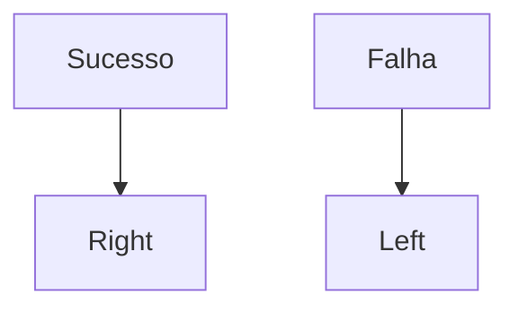
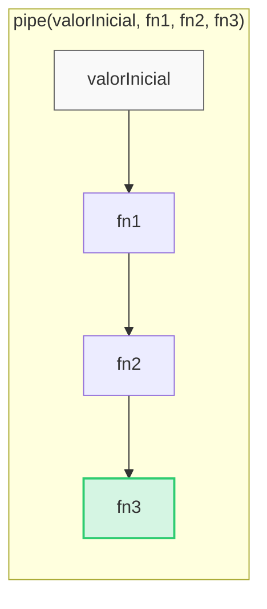
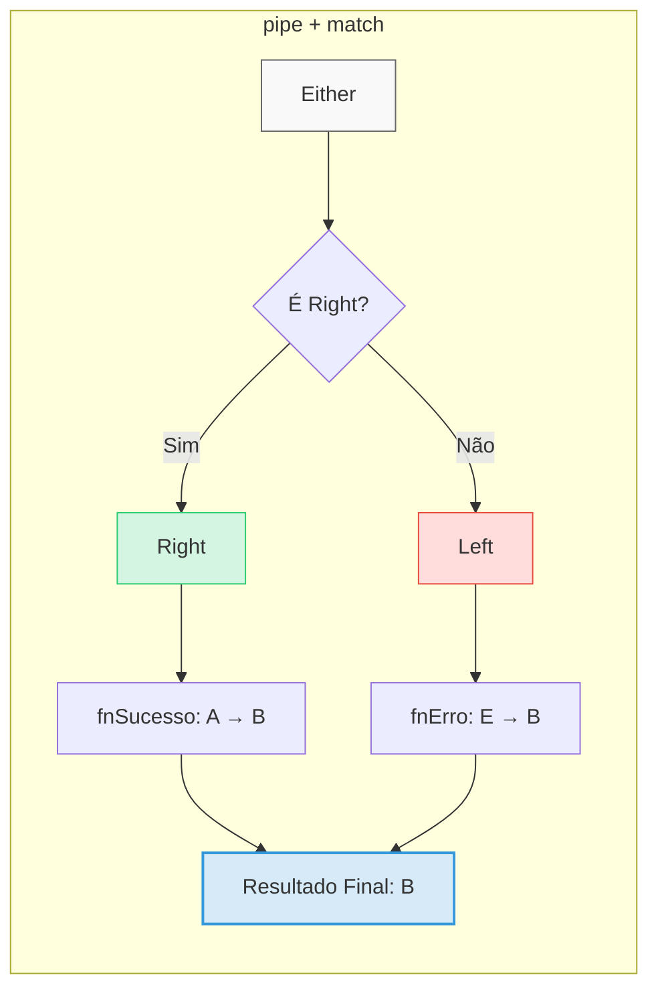
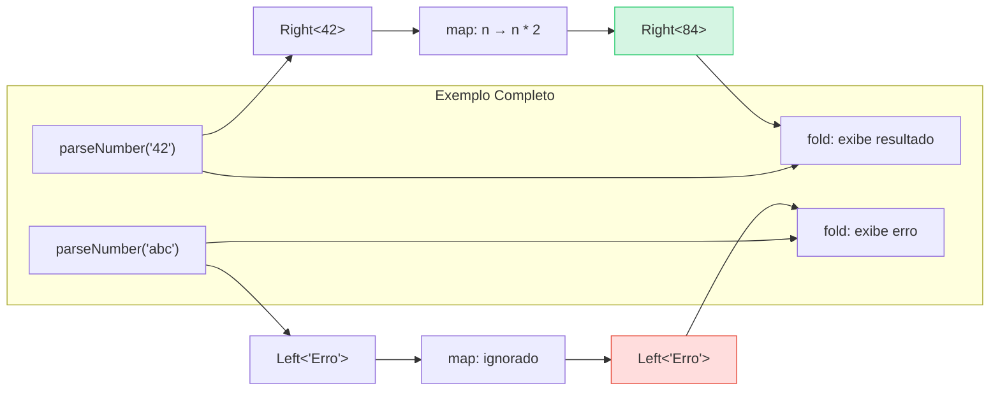
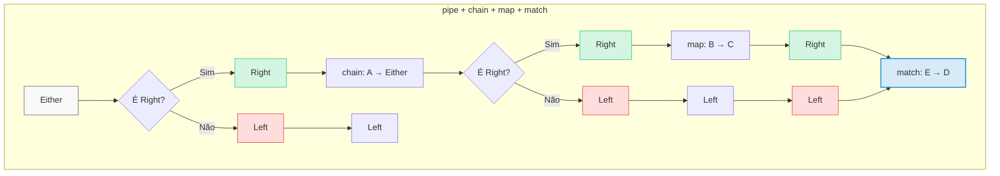

+++
title = "Tratamento Funcional de Erros em TypeScript"
description = "Usando fp-ts para gerenciar erros de forma robusta e tipada"
date = 2025-05-12T18:31:45-03:00
tags = ["javascript", "typescript", "fp-ts", "programação funcional", "tratamento de erros", "desenvolvimento"]
draft = false
weight = 1
author = "Vitor Lobo Ramos"
+++


Neste artigo, vamos explorar uma abordagem mais estruturada para o tratamento de erros em TypeScript usando conceitos de programação funcional. A biblioteca [fp-ts](https://gcanti.github.io/fp-ts/) (Functional Programming em TypeScript) oferece ferramentas que permitem lidar com falhas de forma explícita e type-safe, melhorando a robustez e legibilidade do código. Existem também outras bibliotecas com abordagens semelhantes ou complementares no ecossistema TypeScript:

- [**Purify-ts**](https://github.com/purify-ts/purify-ts): Uma alternativa mais leve ao fp-ts, focada em tipos como Maybe e Either
- [**Neverthrow**](https://github.com/microsoft/neverthrow): Biblioteca especializada em tratamento de erros com Result/Either
- [**Effect**](https://github.com/Effect-TS/effect): Uma biblioteca mais recente que expande os conceitos do fp-ts com foco em STM (Software Transactional Memory), concorrência e gerenciamento de recursos
- [**Zio-ts**](https://github.com/zio/zio-ts): Inspirada na biblioteca ZIO de Scala, oferecendo abstrações para IO, concorrência e recursos

Cada uma dessas bibliotecas tem seus pontos fortes, mas o [fp-ts](https://gcanti.github.io/fp-ts/) se destaca pela sua maturidade, documentação abrangente e ecossistema rico de bibliotecas complementares. Neste artigo, focaremos no fp-ts e em como ele aborda o tratamento de erros de forma funcional.

> **Nota sobre versões:** Este artigo utiliza a sintaxe do fp-ts 3.x (lançada em abril de 2025), que introduziu mudanças significativas na API, incluindo `fold` → `match`, `mapLeft` → `mapError`, e outros renomeamentos para maior clareza. Se você estiver usando fp-ts 2.x, consulte a [documentação de migração](https://gcanti.github.io/fp-ts/guides/migration-v3.html) para detalhes sobre as mudanças.

## Sumário

- [O dilema do tratamento de erros convencional](#o-dilema-do-tratamento-de-erros-convencional)
- [Erros como cidadãos de primeira classe](#erros-como-cidadãos-de-primeira-classe)
- [Propriedades avançadas do Either](#propriedades-avançadas-do-either)
- [Usando `match` para extrair valores de `Either`](#usando-match-para-extrair-valores-de-either)
- [TaskEither: Computação Assíncrona com Tratamento Explícito de Erros](#taskeither-computação-assíncrona-com-tratamento-explícito-de-erros)
- [Compondo múltiplas requisições assíncronas](#compondo-múltiplas-requisições-assíncronas)
- [Referências](#referências)


---

## O Dilema do Tratamento de Erros Convencional

No ecossistema JavaScript/TypeScript, historicamente, recorremos a duas abordagens principais para lidar com erros, cada uma com suas armadilhas. A forma mais comum de sinalizar e capturar erros é através de exceções, usando `throw` e `try/catch`. Porém, essa abordagem tem alguns problemas:

```typescript
function dividirLegado(a: number, b: number): number {
  if (b === 0) {
    throw new Error("Divisão por zero não é permitida!");
  }
  return a / b;
}

try {
  const resultado = dividirLegado(10, 0);
  console.log("Resultado:", resultado);
} catch (error: any) { // Note o 'any', um ponto fraco comum
  console.error("Ops, algo deu errado:", error.message);
  // Saída: "Ops, algo deu errado: Divisão por zero não é permitida!"
}
```

> **Nota:** O uso de `any` para o tipo do erro é uma prática comum, mas não é a melhor opção. Em um sistema mais complexo, isso pode levar a erros de tipo que são difíceis de detectar.


O uso de exceções apresenta sérios problemas de design: a assinatura da função `dividirLegado` não revela ao compilador a possibilidade de exceções, criando um contrato implícito onde o chamador precisa adivinhar a necessidade de um `try/catch`. Além disso, o `throw` interrompe abruptamente o fluxo de execução, dificultando o rastreamento e comprometendo a pureza funcional, enquanto a facilidade de esquecer blocos `try/catch` pode resultar em erros não capturados que derrubam aplicações inteiras.

Uma alternativa comum é retornar valores especiais como `null`, `undefined` ou objetos de erro para sinalizar falhas, embora essa abordagem também apresente suas próprias limitações. Por exemplo:

```typescript
interface ResultadoDivisao {
  valor?: number;
  erro?: string;
}

function dividirComObjeto(a: number, b: number): ResultadoDivisao {
  if (b === 0) {
    return { erro: "Divisão por zero!" };
  }
  return { valor: a / b };
}

const resultadoObj = dividirComObjeto(10, 0);
if (resultadoObj.erro) {
  console.error("Falha:", resultadoObj.erro);
} else {
  console.log("Sucesso:", resultadoObj.valor);
}

// Ou com null:
function dividirComNull(a: number, b: number): number | null {
    if (b === 0) return null;
    return a / b;
}
const resultadoNull = dividirComNull(10, 0);
if (resultadoNull === null) console.error("Divisão por zero!");
```


Essa abordagem infelizmente também apresenta problemas significativos de usabilidade e segurança. O código se torna verboso e menos legível devido às constantes verificações manuais como `if (resultado.erro)` ou `if (resultado === null)`, enquanto a perda de contexto é inevitável, especialmente com valores `null` que não informam o motivo da falha - mesmo objetos de erro exigem disciplina manual consistente.

Além disso, há um risco constante de erros silenciosos no sistema, pois esquecer de verificar o `null` ou a propriedade `erro` pode facilmente resultar em erros do tipo `TypeError: Cannot read property '...' of null` em partes subsequentes do código, comprometendo a robustez da aplicação como um todo.

---

## Erros Como Cidadãos de Primeira Classe

A Programação Funcional (FP) encara os erros de uma maneira fundamentalmente diferente: **erros são simplesmente valores**. Em vez de lançar exceções que quebram o fluxo, as funções retornam tipos de dados explícitos que representam tanto o sucesso quanto a falha. `fp-ts` nos fornece estruturas de dados poderosas para isso, como `Option` e `Either`.

Antes de `Either`, vamos entender `Option`. Ele é usado para representar um valor que pode ou não estar presente. Pense nele como um substituto type-safe para `null` ou `undefined`.

*   **`Some<A>`**: Contém um valor do tipo `A`.
*   **`None`**: Representa a ausência de um valor.

O código abaixo mostra como usar `Option` para lidar com a ausência de valor. Vejamos:

```typescript
import * as O from 'fp-ts/Option';
import { pipe } from 'fp-ts/function';

interface User {
  id: number;
  name: string;
}
const users: User[] = [{ id: 1, name: "Alice" }, { id: 2, name: "Bob" }];

function findUserById(id: number): O.Option<User> {
  const user = users.find(u => u.id === id);
  return user ? O.some(user) : O.none; // Explicita a possibilidade de não encontrar
}

// Usando Option
const user1 = findUserById(1); // Some({ id: 1, name: "Alice" })
const user3 = findUserById(3); // None

pipe(
  user1,
  O.map(user => user.name.toUpperCase()), // Só executa se for Some
  O.match(
    () => console.log("Usuário não encontrado."), // Caso None
    (name) => console.log("Nome em maiúsculas:", name) // Caso Some
  )
); // Saída: Nome em maiúsculas: ALICE

pipe(
  user3,
  O.map(user => user.name.toUpperCase()),
  O.match(
    () => console.log("Usuário não encontrado."),
    (name) => console.log("Nome em maiúsculas:", name)
  )
); // Saída: Usuário não encontrado.
```

Note que `Option` é perfeito para casos onde a ausência não é necessariamente um "erro", mas um estado esperado. Ele nos permite modelar de forma elegante situações como buscas que podem não retornar resultados, valores opcionais em formulários, ou acessos a propriedades que podem não existir. 

Ao usar `Option`, tornamos explícito no sistema de tipos que um valor pode estar ausente, forçando o desenvolvedor a lidar com ambos os casos. Isso elimina erros comuns como referências nulas inesperadas e torna o código mais robusto, previsível e auto-documentado, sem a necessidade de verificações defensivas espalhadas pelo código.

> **Nota:** O uso de `Option` é uma abordagem mais moderna e elegante para lidar com valores que podem estar ausentes. Ele é preferível ao uso de `null` ou `undefined` em muitos casos, pois fornece um tipo mais explícito e seguro para representar a ausência de valor.

Para ilustrar ainda mais a utilidade de `Option`, especialmente em cenários do mundo real, vamos considerar uma operação assíncrona, como buscar dados de uma API. Muitas vezes, uma API pode não encontrar o recurso solicitado, e `Option` é uma excelente forma de modelar essa possibilidade sem recorrer a `null` ou exceções para um "não encontrado" esperado. Imagine que estamos buscando uma notícia por ID:

```typescript
interface Noticia {
  id: number;
  titulo: string;
  conteudo: string;
}

const buscarNoticia = async (id: number): Promise<O.Option<Noticia>> => {
  const noticia = await fetch(`https://api.exemplo.com/noticias/${id}`);
  if (noticia.status === 404) {
    return O.none;
  }
  return O.some(await noticia.json());
}

const noticia = await buscarNoticia(1);
pipe(
  noticia,
  O.match(
    () => console.log("Notícia não encontrada"),
    (noticia) => console.log(noticia.titulo)
  )
);
```

Neste exemplo, `buscarNoticia` retorna um `Option<Noticia>`, que pode ser `Some` (com a notícia encontrada) ou `None` (quando a notícia não é encontrada). Isso torna o código mais claro e seguro, pois não precisamos verificar o status da resposta ou lidar com `null`/`undefined`.


## Sucesso Explícito ou Falha Detalhada

Já o `Either` é o tipo protagonista no paradigma funcional quando precisamos modelar operações que podem falhar, oferecendo uma estrutura elegante que não apenas sinaliza o erro, mas também fornece detalhes específicos sobre a falha. Diferente de exceções tradicionais que interrompem o fluxo de execução, `Either` encapsula tanto o sucesso quanto o erro como valores de primeira classe, permitindo composição e transformação de operações falíveis de forma segura e previsível. Basicamente, `Either` é uma união de dois tipos: `Right` e `Left`:

*   **`Right<A>`**: Representa um resultado de sucesso, contendo um valor do tipo `A`. (Pense "Right" como "correto").
*   **`Left<E>`**: Representa uma falha, contendo um erro do tipo `E`. (Pense "Left" como o que sobrou, o erro).

Para ficar mais claro, veja o gráfico abaixo:



Esta estrutura nos permite representar de forma explícita tanto o caminho feliz quanto o caminho de erro em nossas operações, sem recorrer a exceções ou valores nulos. O tipo `Either` força o programador a considerar ambos os casos, tornando o código mais robusto e previsível. Vamos ver um exemplo prático em código:


```typescript
import * as E from "fp-ts/Either";
import { pipe } from "fp-ts/function"; // pipe é essencial!

// Nosso divisor, agora funcional e type-safe!
function dividir(a: number, b: number): E.Either<string, number> {
  if (b === 0) {
    return E.left("Divisão por zero!"); // Falha explícita com uma mensagem
  }
  return E.right(a / b); // Sucesso explícito com o valor
}

const resultado1 = dividir(10, 2); // Right(5)
const resultado2 = dividir(10, 0); // Left("Divisão por zero!")

console.log(resultado1);
console.log(resultado2);
```
O tipo de retorno `E.Either<string, number>` diz claramente: "esta função retorna um número em caso de sucesso, OU uma string de erro em caso de falha." O compilador TypeScript agora *sabe* dos possíveis resultados.

Nunca acessamos diretamente `Left` ou `Right` (ou `Some`/`None`). Em vez disso, usamos funções de alta ordem que operam sobre esses "containers". A função `pipe` de `fp-ts/function` é crucial aqui para compor essas operações de forma legível.

A função `pipe(valorInicial, fn1, fn2, fn3)` é equivalente a `fn3(fn2(fn1(valorInicial)))`, simplificando a composição de funções. Ela recebe um valor inicial e o encaminha através de uma sequência de transformações, criando um fluxo de dados da esquerda para a direita que é intuitivo e fácil de acompanhar, melhorando significativamente a legibilidade do código em comparação com as chamadas aninhadas tradicionais. Veja o gráfico abaixo:



O diagrama acima mostra como funciona a função `pipe` de uma forma simples. Em vez de escrever código aninhado como `fn3(fn2(fn1(valorInicial)))`, que é difícil de ler, usamos `pipe(valorInicial, fn1, fn2, fn3)`, que é como ler uma receita: primeiro faça isso, depois aquilo...por exemplo:

   ```typescript
   // Sem pipe (difícil de ler):
   const resultado = multiplicarPorDois(somarCinco(converterParaNumero("10")));
   
   // Com pipe (fácil de seguir):
   const resultado = pipe(
     "10",               // Valor inicial
     converterParaNumero, // Primeira transformação
     somarCinco,         // Segunda transformação
     multiplicarPorDois  // Terceira transformação
   );
   ```

Pense no `pipe` como uma linha de montagem: o valor inicial entra por um lado, passa por várias estações de trabalho (funções), e sai transformado do outro lado!

## Propriedades Avançadas do Either

O `Either` vai muito além de ser apenas um container para sucesso ou erro - ele é um conceito fundamental da programação funcional que implementa padrões poderosos que nos permitem compor operações de forma elegante e segura. Na programação funcional, o `Either` é classificado como um tipo algebráico que implementa interfaces importantes como [Functor](https://en.wikipedia.org/wiki/Functor) e [Monad](https://en.wikipedia.org/wiki/Monad_(category_theory)). Vamos entender o que isso significa na prática e como isso nos ajuda a escrever código mais robusto:

1. **Functor**: O `Either` é um functor porque implementa a operação `map`, que permite transformar o valor dentro de um `Right` sem alterar a estrutura do container. Se for um `Left`, o erro é simplesmente propagado sem alteração.

```typescript
// map transforma apenas o lado Right
const resultado = pipe(
  dividir(10, 2), // Right(5)
  E.map(valor => valor * 2) // Right(10)
);

// Se for Left, map não faz nada
const resultadoErro = pipe(
  dividir(10, 0), // Left("Divisão por zero!")
  E.map(valor => valor * 2) // Continua Left("Divisão por zero!")
);
```

2. **Monad**: O `Either` também é uma monad porque implementa a operação `chain` (também chamada de `flatMap` ou `bind` em outras linguagens). Isso permite compor operações que também podem falhar, evitando o aninhamento de `E.Either<E, E.Either<E, A>>`.

```typescript
// Outra função que pode falhar
const raizQuadrada = (n: number): E.Either<string, number> =>
n < 0 ? E.left("Não existe raiz de número negativo") : E.right(Math.sqrt(n));

// Usando chain para compor operações falíveis
const calcularRaizDaDivisao = (a: number, b: number) => pipe(
  dividir(a, b),        // E.Either<string, number>
E.chain(raizQuadrada) // E.Either<string, number>
);

console.log(calcularRaizDaDivisao(16, 4));  // Right(2)
console.log(calcularRaizDaDivisao(16, 0));  // Left("Divisão por zero!")
console.log(calcularRaizDaDivisao(-16, 4)); // Left("Não existe raiz de número negativo")
```

Estas propriedades tornam o `Either` extremamente poderoso para composição de operações, permitindo criar fluxos complexos de tratamento de erros de forma elegante e type-safe. O `map` nos permite transformar valores de sucesso, enquanto o `chain` nos permite sequenciar operações que podem falhar, com propagação automática de erros.

## Usando `match` para Extrair Valores de `Either`

Agora que entendemos o conceito de `pipe`, vamos explorar a função `match`, que é fundamental para extrair valores de um `Either`. Esta função permite definir duas funções: uma para o caso `Left` (erro) e outra para o caso `Right` (sucesso), funcionando essencialmente como um `if/else` especializado para o tipo `Either`. Com `match`, podemos transformar nosso `Either` em qualquer outro tipo, garantindo que ambos os casos sejam tratados explicitamente.

O `match` é uma forma de "pattern matching" funcional - um conceito poderoso de linguagens funcionais que permite lidar com diferentes "casos" ou "formas" que um valor pode ter. No caso do `Either`, temos dois padrões possíveis: `Left` e `Right`. O pattern matching nos força a tratar todos os casos possíveis de forma explícita, eliminando a possibilidade de esquecermos algum caminho. Isso é especialmente valioso em TypeScript, onde o sistema de tipos garanta que não podemos acessar o valor interno de um `Either` sem primeiro "desempacotá-lo" usando `match` ou funções similares.

Agora que você já entendeu o conceito de `pipe`, vamos ver como usar `match` para extrair valores de um `Either` acompanhando o gráfico abaixo:



O processo começa com uma entrada `E.Either<E, A>`, que representa um valor que pode ser um sucesso (`Right<A>`) ou um erro (`Left<E>`). Quando aplicamos a função `match`, ela toma uma decisão baseada no tipo do `Either`: se for um `Right`, aplica a função de sucesso (`fnSucesso`) ao valor interno, transformando `A` em `B`; se for um `Left`, aplica a função de erro (`fnErro`) ao erro interno, transformando `E` também em `B`.

O resultado final deste processo é sempre um valor do tipo `B`, independentemente do caminho seguido. Esta é a beleza do `match`: ele unifica os dois caminhos possíveis (sucesso e erro) em um único tipo de saída, permitindo que o código subsequente trabalhe com um valor concreto sem precisar verificar constantemente se estamos lidando com um sucesso ou um erro. Vamos ver um exemplo prático em código:

```typescript
import * as E from "fp-ts/Either";
import { pipe } from "fp-ts/function";

// Função que pode falhar
const divide = (a: number, b: number): E.Either<string, number> =>
  b === 0 ? E.left("Divisão por zero!") : E.right(a / b);

// Tratamento com match
const result = pipe(
  divide(10, 0),
  E.match(
    (error) => `Erro: ${error}`, // fnErro
    (value) => `Resultado: ${value}` // fnSucesso
  )
);

console.log(result); // "Erro: Divisão por zero!"
```


O método `match` é particularmente útil quando você precisa **transformar** o resultado final de uma operação em um formato específico, como preparar dados para exibição na interface do usuário ou formatar mensagens para logging. Esta função é essencial para unificar os caminhos de sucesso e erro em um único tipo de retorno.

Além disso, `match` serve como uma excelente maneira de **encerrar** uma cadeia de operações com um valor concreto, permitindo que você conclua o processamento de um `Either` e obtenha um resultado final que não é mais um tipo monádico. 

## Usando `map` para Transformar o Valor de Sucesso

Enquanto `match` nos permite encerrar uma cadeia de operações unificando os caminhos de sucesso e erro, muitas vezes precisamos apenas transformar o valor de sucesso sem alterar o fluxo de tratamento de erros. É aqui que o operador `map` se torna valioso. Esta função aplica uma transformação apenas ao valor contido em um `Right`, deixando qualquer `Left` intacto e propagando o erro original sem modificação. O gráfico abaixo mostra como funciona o `map` em um `Either`:



Vamos entender o diagrama acima: ele ilustra como o operador `map` funciona com o tipo `Either`. No caminho superior, quando `parseNumber('42')` retorna um `Right<42>` (sucesso), o `map` aplica a função de transformação (multiplicação por 2), resultando em `Right<84>`. No caminho inferior, quando `parseNumber('abc')` retorna um `Left<'Erro'>` (falha), o `map` ignora completamente a função de transformação, propagando o erro original sem modificação. Este comportamento é fundamental para a programação funcional, pois permite transformar valores de sucesso enquanto preserva automaticamente os erros, criando um fluxo de dados seguro e previsível. Vejamos um exemplo prático de como usar `map` com `Either`:


```typescript
const resultadoDobrado = pipe(
  dividir(20, 2),         // Right(10)
  E.map(valor => valor * 2) // Aplica valor * 2 somente se for Right
); // resultadoDobrado é Right(20)

const falhaDobrada = pipe(
  dividir(20, 0),         // Left("Divisão por zero!")
  E.map(valor => valor * 2) // Não é executado
); // falhaDobrada é Left("Divisão por zero!")
```


## Usando `chain` para Encadear Operações Falíveis

Enquanto `map` é perfeito para transformações simples de valores de sucesso, ele não é suficiente quando a própria transformação pode falhar. É aqui que `chain` se torna essencial. Esta função permite compor operações sequenciais onde cada etapa depende do resultado bem-sucedido da anterior e pode, por si só, produzir um erro. Diferente do `map`, que sempre envolve o resultado da transformação em um novo `Right`, o `chain` espera que a função de transformação já retorne um `Either`, evitando o aninhamento desnecessário de estruturas.

Na prática, `chain` é fundamental para construir fluxos de validação e processamento robustos. Por exemplo, ao processar dados de usuário, podemos encadear várias validações (verificar formato de email, checar comprimento de senha, validar idade) onde cada etapa só é executada se a anterior for bem-sucedida. Se qualquer validação falhar, o erro é propagado automaticamente até o final da cadeia, eliminando a necessidade de verificações condicionais repetitivas e tornando o código mais declarativo e menos propenso a erros. Vejamos um exemplo prático de como usar `chain` com `Either` no gráfico abaixo:



O diagrama acima ilustra o fluxo de processamento usando a combinação de operadores `pipe`, `chain`, `map` e `match` com o tipo `Either`. Ele demonstra como um valor inicial `E.Either<E, A>` é processado através de uma série de transformações condicionais. Se o valor for um `Right<A>`, ele passa pela função `chain` que pode produzir um novo `E.Either<E, B>`. Se esse resultado for um `Right<B>`, ele é transformado pela função `map` em um `Right<C>`. Em qualquer ponto onde um `Left<E>` é encontrado, o fluxo de transformações é curto-circuitado, propagando o erro até o final. 

Finalmente, a função `match` é aplicada para extrair o valor final, seja ele um sucesso (`C`) ou um erro (`E`), convertendo-os para um tipo comum `D`. Este padrão de composição permite criar pipelines de processamento robustos onde os erros são tratados de forma elegante e explícita. Vamos ver um exemplo prático de como usar `chain` com `Either` no código abaixo:

```typescript
// Função que valida se um número é positivo
const garantirPositivo = (n: number): E.Either<string, number> =>
  n > 0 ? E.right(n) : E.left("Número deve ser positivo!");

// Função que calcula a raiz quadrada (apenas para positivos)
const raizQuadradaSegura = (n: number): E.Either<string, number> =>
  n < 0 ? E.left("Não é possível calcular raiz de número negativo!") : E.right(Math.sqrt(n));

// Cenário 1: Sucesso em tudo
const computacaoSucesso = pipe(
  dividir(32, 2),           // Right(16)
  E.chain(garantirPositivo),  // Right(16) -> garantirPositivo(16) -> Right(16)
  E.chain(raizQuadradaSegura) // Right(16) -> raizQuadradaSegura(16) -> Right(4)
);
console.log(pipe(computacaoSucesso, E.match(e => e, v => v.toString()))); // "4"

// Cenário 2: Falha na divisão
const computacaoFalhaDivisao = pipe(
  dividir(32, 0),           // Left("Divisão por zero!")
  E.chain(garantirPositivo),  // Ignorado, propaga Left("Divisão por zero!")
  E.chain(raizQuadradaSegura) // Ignorado, propaga Left("Divisão por zero!")
);
console.log(pipe(computacaoFalhaDivisao, E.match(e => e, v => v.toString()))); // "Divisão por zero!"

// Cenário 3: Falha na validação de positivo
const computacaoFalhaPositivo = pipe(
  E.right(-10),               // Começamos com um Right(-10) para este exemplo
  E.chain(garantirPositivo),  // Right(-10) -> garantirPositivo(-10) -> Left("Número deve ser positivo!")
  E.chain(raizQuadradaSegura) // Ignorado, propaga Left("Número deve ser positivo!")
);
console.log(pipe(computacaoFalhaPositivo, E.match(e => e, v => v.toString()))); // "Número deve ser positivo!"
```

Note como o primeiro `Left` encontrado interrompe a cadeia e é propagado até o final.

---

## Usando `TaskEither<E, A>`: O Poder de `Either` no Mundo Assíncrono

E quando nossas operações são assíncronas, como chamadas de API ou interações com banco de dados? Para entender o `TaskEither<E, A>`, vamos construir o conceito passo a passo:

1. Uma `Promise<A>` no JavaScript representa uma operação assíncrona que eventualmente produzirá um valor do tipo `A` ou será rejeitada com um erro.

2. Na biblioteca fp-ts, o tipo `Task<A>` é essencialmente uma função que retorna uma `Promise<A>`, mas com uma abordagem mais funcional. É definido como `() => Promise<A>`.

3. O `TaskEither<E, A>` combina o conceito de `Task` com `Either`. Formalmente, é um `Task<Either<E, A>>`, ou seja, uma função que retorna uma promessa que resolverá para um `Either<E, A>`.

Isso nos dá o melhor dos dois mundos: a capacidade de lidar com operações assíncronas (como o `Promise`) e um tratamento de erros explícito e tipado (como o `Either`).

Na prática, o `TaskEither` é perfeito para operações que demoram para completar e podem falhar, como buscar dados de um servidor ou ler um arquivo. Em vez de usar `try/catch` espalhados pelo código ou verificar erros manualmente, você encadeia operações de forma elegante e o TypeScript garanta que você não esqueça de tratar os erros.

A grande vantagem é que, diferente de uma `Promise` comum que mistura o fluxo de sucesso e erro em callbacks separados (`.then()` e `.catch()`), o `TaskEither` mantém ambos os caminhos dentro do mesmo tipo, permitindo composição mais segura e previsível de operações assíncronas que podem falhar.

Vamos ver um exemplo prático de como usar `TaskEither` no código abaixo:


```typescript
import * as TE from "fp-ts/TaskEither";
// 'pipe' já foi importado de 'fp-ts/function'

interface UserData {
  id: number;
  name: string;
  email: string;
}

// Erro customizado para nossa API
class NetworkError extends Error {
  constructor(message: string, public status?: number) {
    super(message);
    this.name = "NetworkError";
  }
}

const fetchUser = (userId: number): TE.TaskEither<NetworkError, UserData> =>
  TE.tryCatch<NetworkError, UserData>(
    // A função que retorna uma Promise (o "try" do tryCatch)
    async () => {
      const response = await fetch(`https://jsonplaceholder.typicode.com/users/${userId}`);
      if (!response.ok) {
        // Lançamos um erro customizado para ser capturado pelo 'onRejected'
        throw new NetworkError(`Falha na requisição: ${response.statusText}`, response.status);
      }
      return response.json() as Promise<UserData>; // Garantimos o tipo
    },
    // A função que converte o erro/rejeição da Promise em um Left<E>
    (motivoDesconhecido: unknown): NetworkError => {
      if (motivoDesconhecido instanceof NetworkError) {
        return motivoDesconhecido;
      }
      // Para outros tipos de erros (ex: falha de rede antes da resposta HTTP)
      return new NetworkError(String(motivoDesconhecido));
    }
  );

// Como usar:
async function exibirNomeUsuario(id: number): Promise<void> {
  const programa = pipe(
    fetchUser(id), // Retorna TaskEither<NetworkError, UserData>
    TE.map(user => `Nome do usuário: ${user.name}`), // Transforma o sucesso
    TE.matchE(
      // Função para o caso de falha (Left)
      (erro) => async () => console.error(`Erro ao buscar usuário: ${erro.message}${erro.status ? ` (Status: ${erro.status})` : ''}`),
      // Função para o caso de sucesso (Right)
      (nomeFormatado) => async () => console.log(nomeFormatado)
    )
  );
  // Para executar o TaskEither e obter o resultado (ou efeito colateral), chamamos a função retornada por matchE:
  await programa();
}

// Pattern alternativo: TE.mapError para logging de erros no pipeline
const programaComLog = pipe(
  fetchUser(id),
  TE.mapError((erro) => {
    console.error(`Falha na operação: ${erro.message}`);
    // Aqui você pode adicionar logging estruturado, métricas, etc.
    return erro; // Retorna o erro para continuar o pipeline
  }),
  TE.matchE(
    (erro) => async () => console.error(`Erro final: ${erro.message}`),
    (user) => async () => console.log(`Sucesso: ${user.name}`)
  )
);

// Testando:
// exibirNomeUsuario(1); // Deve imprimir "Nome do usuário: Leanne Graham" (ou similar)
// exibirNomeUsuario(999); // Deve imprimir o erro de "Falha na requisição: Not Found (Status: 404)"
```

O `tryCatch` é um construtor muito útil para envolver código baseado em Promises que pode rejeitar. Ele transforma o modelo tradicional de tratamento de erros com `try/catch` em uma estrutura funcional, encapsulando tanto o caminho feliz quanto o de erro em um único tipo de dados `TaskEither`. Isso permite que o código cliente trabalhe com um valor que representa explicitamente a possibilidade de falha, em vez de depender de exceções implícitas.

A principal vantagem desse construtor é a separação clara entre a lógica de negócio e o tratamento de erros. Ao usar `tryCatch`, você define duas funções: uma que executa a operação principal (retornando uma Promise) e outra que converte qualquer erro em um tipo específico. Isso torna o código mais previsível e facilita o rastreamento de todos os possíveis caminhos de erro através do sistema de tipos.

Além disso, `tryCatch` se integra perfeitamente com outras funções do ecossistema fp-ts, permitindo compor operações assíncronas que podem falhar de maneira elegante e segura. Em vez de aninhamentos complexos de try/catch ou promessas encadeadas com .catch(), você pode usar operadores como pipe, map e chain para expressar fluxos de dados complexos de forma declarativa, mantendo o tratamento de erros consistente em toda a aplicação.

A tabela abaixo compara as diferentes estratégias de tratamento de erros em TypeScript, destacando os pontos fortes e fracos de cada uma:

| Abordagem | Prós | Contras |
|-----------|------|---------|
| **try/catch com exceções** | • Sintaxe familiar e padrão da linguagem<br>• Separação visual entre código normal e tratamento de erro<br>• Captura erros em qualquer nível da pilha de chamadas | • Contrato implícito (assinatura da função não indica possibilidade de erro)<br>• Interrompe abruptamente o fluxo de execução<br>• Fácil esquecer de usar try/catch<br>• Difícil composição de funções que podem lançar exceções<br>• Tipagem de erros geralmente fraca (any) |
| **Retorno de null/undefined** | • Simplicidade de implementação<br>• Não interrompe o fluxo de execução | • Perda completa de contexto do erro<br>• Verificações constantes de null/undefined<br>• Fácil esquecer verificações, causando erros em runtime<br>• Não escala bem para operações compostas |
| **Objetos de resultado/erro** | • Contrato explícito<br>• Preserva algum contexto de erro<br>• Não interrompe o fluxo de execução | • Código verboso com muitas verificações manuais<br>• Disciplina manual para manter consistência<br>• Composição de operações torna-se complexa<br>• Tipagem pode ser ambígua (propriedades opcionais) |
| **Either/TaskEither** | • Contrato totalmente explícito via sistema de tipos<br>• Composição elegante de operações<br>• Tratamento de erro obrigatório (impossível "esquecer")<br>• Preservação completa do contexto de erro<br>• Fluxo de execução previsível<br>• Facilita testes unitários | • Curva de aprendizado inicial<br>• Requer familiaridade com conceitos funcionais<br>• Verbosidade em casos simples<br>• Dependência de biblioteca externa (fp-ts) |

A abordagem com `Either` e `TaskEither` oferece o melhor equilíbrio entre segurança de tipos, composição e manutenibilidade para sistemas complexos, embora exija um investimento inicial em aprendizado dos conceitos de programação funcional.

### TaskEither: Computação Assíncrona com Tratamento Explícito de Erros

Um aspecto fundamental a ser compreendido sobre `TaskEither` é que ele representa uma *descrição* de uma computação assíncrona que pode falhar, não a execução imediata dessa computação. Quando você cria um `TaskEither`, está apenas definindo o que deve acontecer, sem executar nenhum código assíncrono naquele momento. Esta é uma característica poderosa da programação funcional: a separação entre a definição de uma computação e sua execução.

Formalmente, um `TaskEither<E, A>` é definido como `() => Promise<E.Either<E, A>>` - uma função que retorna uma Promise que resolverá para um `E.Either<E, A>`. Esta definição torna explícito que `TaskEither` é lazy: a computação só é executada quando a função é chamada.

Esta separação oferece benefícios significativos. Primeiro, permite compor operações complexas de forma declarativa, construindo um pipeline de transformações antes de qualquer execução. Segundo, facilita o teste unitário, já que você pode inspecionar e manipular a descrição da computação sem disparar efeitos colaterais. Terceiro, proporciona otimizações como [lazy evaluation (avaliação preguiçosa)](https://en.wikipedia.org/wiki/Lazy_evaluation), onde computações são executadas apenas quando realmente necessárias.

A execução real só ocorre no que chamamos de "fim do mundo" - o momento em que você efetivamente precisa do resultado ou do efeito colateral. Isso acontece em duas etapas: primeiro, quando usamos `matchE` (ou outros combinadores finais como `getOrElseEW`) para "consumir" o `TaskEither` e transformá-lo em uma `Task` (que é essencialmente uma função `() => Promise<A>`); e depois, quando chamamos `await programa()` para executar essa `Task` e obter o resultado final. Este modelo de execução adiada dá ao desenvolvedor controle preciso sobre quando e como os efeitos ocorrem, tornando o código mais previsível e facilitando o raciocínio sobre o fluxo de dados, especialmente em aplicações complexas com múltiplas operações assíncronas interdependentes.

## TaskOption: Quando a Ausência é Esperada

Além do `TaskEither`, o fp-ts oferece `TaskOption` para cenários onde a ausência de valor é um resultado esperado em operações assíncronas. Diferente do `TaskEither`, que modela falhas como erros, o `TaskOption` é ideal quando "não encontrado" é um estado válido da aplicação.

```typescript
import * as TO from 'fp-ts/TaskOption';

// Buscar usuário que pode não existir
const buscarUsuarioOpcional = (id: number): TO.TaskOption<UserData> =>
  TO.tryCatch(async () => {
    const response = await fetch(`/api/users/${id}`);
    if (response.status === 404) {
      return TO.none; // Usuário não encontrado - estado válido
    }
    if (!response.ok) {
      throw new Error(`Erro de rede: ${response.status}`);
    }
    return TO.some(await response.json());
  }, (e: unknown) => new Error(String(e)));

// Uso: a ausência é tratada como um caso normal
const programa = pipe(
  buscarUsuarioOpcional(123),
  TO.match(
    () => console.log("Usuário não encontrado"), // Caso normal
    (user) => console.log(`Usuário: ${user.name}`)
  )
);
```

Use `TaskOption` quando a ausência de valor é um resultado esperado (como buscas que podem não retornar resultados), e `TaskEither` quando a ausência representa uma falha real da operação.

## Interoperabilidade com Promises

O fp-ts 3.x oferece funções especializadas para interoperar com código baseado em Promises existente. Em vez de usar `tryCatch` manualmente para envolver funções que já retornam `Promise`, prefira `tryCatchK` ou `fromPromise`:

```typescript
import * as TE from 'fp-ts/TaskEither';

// ❌ Evite: tryCatch manual para funções que já retornam Promise
const fetchUserManual = (id: number): TE.TaskEither<Error, UserData> =>
  TE.tryCatch(
    () => fetchUserPromise(id), // Função que já retorna Promise<UserData>
    (e) => new Error(String(e))
  );

// ✅ Prefira: tryCatchK para funções que já retornam Promise
const fetchUserK = (id: number): TE.TaskEither<Error, UserData> =>
  TE.tryCatchK(
    fetchUserPromise, // Passa a função diretamente
    (e: unknown) => new Error(String(e))
  )(id);

// ✅ Ou use fromPromise para conversão direta
const fetchUserFromPromise = (id: number): TE.TaskEither<Error, UserData> =>
  TE.fromPromise(
    fetchUserPromise(id),
    (e: unknown) => new Error(String(e))
  );
```

Estas funções são mais idiomáticas e type-safe, especialmente quando você está integrando bibliotecas existentes que já trabalham com Promises.

> **Nota:** A abordagem lazy evaluation é uma técnica que adia a execução de uma computação até que seu resultado seja realmente necessário. Em outras palavras, a computação não é executada imediatamente, mas apenas quando realmente precisamos do resultado. Isso pode ser benéfico em situações onde a computação é cara (em termos de tempo ou recursos) e não é necessária imediatamente.

Um dos benefícios mais profundos de `Either` e `TaskEither` é como eles tornam os efeitos colaterais explícitos no sistema de tipos. Em programação funcional, um "efeito colateral" é qualquer interação com o mundo externo: leitura/escrita de arquivos, chamadas de rede, acesso a banco de dados, ou qualquer operação que possa falhar por razões fora do controle do programa.

Tradicionalmente, esses efeitos são "invisíveis" na assinatura das funções em TypeScript/JavaScript. Uma função que faz uma chamada HTTP não indica isso em seu tipo de retorno, e as exceções que podem ocorrer não são capturadas pelo sistema de tipos. Isso cria um "vazamento" onde efeitos potencialmente perigosos escapam da análise estática.

## Compondo Múltiplas Requisições Assíncronas

O `fp-ts` brilha na composição. Se precisarmos de dados de múltiplas fontes, podemos encadear operações de forma elegante e segura, como demonstrado nos exemplos acima. Por fim, a biblioteca fp-ts oferece uma abordagem robusta para lidar com erros em TypeScript, transformando o tratamento de exceções tradicional em um fluxo de dados previsível e tipado. 

Ao adotar esses padrões funcionais, conseguimos criar código mais confiável, testável e manutenível, onde os erros são tratados como cidadãos de primeira classe em vez de casos excepcionais. Essa mudança de paradigma não apenas melhora a qualidade do código, mas também proporciona uma experiência de desenvolvimento mais agradável, onde a composição de operações complexas se torna natural e o sistema de tipos trabalha a nosso favor para garantir que todos os casos de erro sejam devidamente considerados.

Vamos ver um exemplo prático de como usar `TaskEither` para buscar um post e depois seus comentários:

```typescript
import * as TE from 'fp-ts/TaskEither';
import * as A from 'fp-ts/Array';
// pipe já importado de 'fp-ts/function'

// Suponha que fetchPost retorne TaskEither<NetworkError, PostData>
// e fetchComments retorne TaskEither<NetworkError, CommentData[]> para um postId

// Exemplo fictício:
interface PostData { id: number; title: string; userId: number; }
interface CommentData { id: number; body: string; postId: number; }

const fetchPost = (postId: number): TE.TaskEither<NetworkError, PostData> =>
  TE.tryCatch(
    async () => {
      const res = await fetch(`https://jsonplaceholder.typicode.com/posts/${postId}`);
      if (!res.ok) throw new NetworkError(`Post não encontrado: ${res.status}`, res.status);
      return res.json();
    },
    (r: unknown): NetworkError => new NetworkError(String(r))
  );

const fetchCommentsForPost = (postId: number): TE.TaskEither<NetworkError, CommentData[]> =>
  TE.tryCatch(
    async () => {
      const res = await fetch(`https://jsonplaceholder.typicode.com/posts/${postId}/comments`);
      if (!res.ok) throw new NetworkError(`Comentários não encontrados: ${res.status}`, res.status);
      return res.json();
    },
    (r: unknown): NetworkError => new NetworkError(String(r))
  );


// Objetivo: buscar um post e depois seus comentários
const getPostWithComments = (postId: number): TE.TaskEither<NetworkError, { post: PostData; comments: CommentData[] }> =>
  pipe(
    fetchPost(postId), // TaskEither<NetworkError, PostData>
    TE.chain(post => // Se fetchPost deu certo, 'post' é PostData
      pipe(
        fetchCommentsForPost(post.id), // TaskEither<NetworkError, CommentData[]>
        TE.map(comments => ({ post, comments })) // Se fetchComments deu certo, combina os resultados
      )
    )
  );

// Para buscar vários posts e seus comentários em paralelo (cuidado com limites de API):
const getUserIds = [1, 2, 3]; // IDs de posts, por exemplo

// Criamos um array de TaskEithers, cada um buscando um usuário
const fetchAllUsersPrograms: Array<TE.TaskEither<NetworkError, UserData>> = getUserIds.map(fetchUser);

// TE.sequenceArray transforma Array<TaskEither<E, A>> em TaskEither<E, Array<A>>
// Ele executa todas as Tasks em paralelo. Se qualquer uma falhar, o resultado é o primeiro Left.
// ⚠️ Importante: sequenceArray só funciona com tipos homogêneos (todos retornam o mesmo tipo A).
// Se os tipos de retorno diferem, use sequenceT ou mapeie para uma união A | B.
// Nota: Em fp-ts 3.x, sequenceArray pode requerer import específico
const allUsersProgram: TE.TaskEither<NetworkError, UserData[]> = pipe(
  fetchAllUsersPrograms,
  TE.sequenceArray
);

async function processarUsuarios() {
  const resultado = await pipe(
    allUsersProgram,
    TE.map(users => users.map(u => u.name)), // Extrai apenas os nomes se tudo der certo
    TE.matchE(
      (erro) => async () => `Falha ao buscar usuários: ${erro.message}`,
      (nomes) => async () => `Nomes dos usuários: ${nomes.join(', ')}`
    )
  )(); // Executa e obtém a string final
  console.log(resultado);
}

// processarUsuarios();
```


Note que o `TE.sequenceArray` (e seu análogo `A.sequence(TE.ApplicativePar)`) é poderoso para paralelizar operações falíveis. Adotar `Either`, `Option` e `TaskEither` traz benefícios significativos como type safety explícito e previsibilidade. O compilador se torna seu aliado, forçando você a lidar com todos os caminhos possíveis, enquanto as falhas são tratadas como valores esperados no fluxo de dados, eliminando surpresas como `Uncaught Error` que interrompem sua aplicação.

A adoção desses tipos funcionais resulta em código mais limpo e declarativo, reduzindo drasticamente a necessidade de `try/catch` aninhados e condicionais. O fluxo de dados se torna mais claro com operações como `pipe`, `map` e `chain`, enquanto funções que retornam `Either` ou `TaskEither` podem ser encadeadas de forma segura e elegante, com propagação automática de erros que simplifica lógicas complexas.

Além disso, a manutenção e evolução do código se tornam mais robustas, pois alterar ou adicionar etapas em um fluxo de processamento é mais seguro quando o sistema de tipos garanta que todos os casos de erro sejam considerados. A testabilidade também é aprimorada, já que funções puras que retornam `Either` são mais fáceis de testar unitariamente por não dependerem de mecanismos de exceção globais, contribuindo para uma base de código mais confiável e sustentável.

## Trade-offs

Embora as abstrações funcionais como `Either` e `TaskEither` ofereçam benefícios significativos para o tratamento de erros, é importante considerar alguns trade-offs, especialmente em relação à performance:

- **Overhead de Alocação:** cada `Either`, `TaskEither` ou `Option` cria estruturas de dados adicionais na memória. Em [hot paths](https://en.wikipedia.org/wiki/Hot_path) de aplicações que processam grandes volumes de dados, esse overhead de alocação pode se tornar perceptível. Comparado com abordagens mais diretas como verificações de `null` ou `try/catch`, há um custo adicional de memória.

- **Micro-overhead em Operações Assíncronas:** Benchmarks mostram que `TaskEither` adiciona aproximadamente **3-5 µs por operação** em comparação com Promises nativas. Este overhead é geralmente insignificante para a maioria das aplicações (uma operação de rede típica leva 50-200ms), mas pode ser relevante em sistemas com milhares de operações por segundo ou requisitos extremos de baixa latência.

- **Curva de Aprendizado:** a programação funcional e seus tipos algebráicos têm uma curva de aprendizado significativa para equipes acostumadas com paradigmas imperativos. Isso pode reduzir temporariamente a produtividade até que a equipe esteja confortável com conceitos como functors, monads e composição de funções.

- **Pilha de Chamadas e Debugging:** em cadeias longas de operações com `pipe` e `chain`, os stacktraces podem se tornar mais difíceis de interpretar quando ocorrem erros. Isso pode complicar o debugging em comparação com código imperativo mais direto. Para mitigar esse problema, é recomendável usar `mapError` ou `bimap` para enriquecer erros com contexto adicional em pontos estratégicos da cadeia.

- **Tamanho do Bundle:** a inclusão da biblioteca `fp-ts` adiciona peso ao bundle final da aplicação. Embora técnicas de [tree-shaking](https://en.wikipedia.org/wiki/Tree_shaking) possam mitigar isso, aplicações que priorizam tamanho mínimo de bundle (como PWAs ou aplicações móveis) precisam considerar esse impacto.


---

## Referências

- [fp-ts](https://github.com/gcanti/fp-ts) - Documentação oficial
- [Hands-On Functional Programming with Typescript](https://a.co/d/3LxV0CO) - Livro do Remo H. Jansen publicado pela Packt. O livro aborda conceitos fundamentais para o tratamento funcional de erros, discutindo na seção "side-effects" como podemos usar técnicas de programação funcional para tornar explícitos os efeitos colaterais em TypeScript. 
